# Prediction demo: text-only vs vision (provenience) model

20 random test-split tablets, seed=42. Both models see the exact same masked positions per example (bold <strong>?</strong> shown at every chosen position, 15% of eligible tokens) -- differences in restoration come only from the two models' separately trained weights, not from the image itself (the image only reaches `provenience_head`, see module docstring). The metadata table's `provenience` row is where the image can actually change an answer.

## Example 1 — `P129360` (has photo: False)

*SAKF 090 -- Administrative, Ur III, uncertain (mod. uncertain) -- Museo Archeologico Nazionale di Firenze, Florence, Italy -- published in Sumerische und akkadische Keilschriftdenkmäler des Archäologischen Museums zu Florenz (Oberhuber, 1958-1960)*

**Original text (transliteration):**
> 1diš kišib₃ a - ab - ba 1diš kišib₃ lugal - si - NE - e 2diš kišib₃ a₂ - <strong>x</strong> ašgab 1diš kišib₃ lu₂ - igi - <strong>x</strong> 1diš kišib₃ ur - a - šar₂ ab <strong>x</strong> 1diš kišib₃ lu₂ - <strong>x</strong> - <strong>x</strong> lu₂ MI 1diš kišib₃ nig₂ - u₂ - rum dumu lugal

**Masked input (10 positions):**
> 1diš kišib₃ a <strong>?</strong> ab - <strong>?</strong> 1diš kišib₃ <strong>?</strong> - si - NE <strong>?</strong> e 2diš kišib₃ a₂ - <strong>x</strong> ašgab 1diš kišib <strong>?</strong> lu₂ <strong>?</strong> igi <strong>?</strong> <strong>x</strong> 1diš kišib₃ ur - a - šar <strong>?</strong> ab <strong>x</strong> 1diš kišib₃ lu₂ - <strong>x</strong> - <strong>x</strong> lu <strong>?</strong> MI 1diš kišib₃ nig₂ - u <strong>?</strong> - rum dumu lugal

### Restoration (masked-token predictions)

| # | true token | text-only top-1 | text-only top-3 | vision top-1 | vision top-3 | text-only correct | vision correct |
|---|---|---|---|---|---|---|---|
| 1 | `-` | `-` | `-`, `##₂`, `:` | `-` | `-`, `##₂`, `##₃` | ✅ | ✅ |
| 2 | `ba` | `ba` | `ba`, `zu`, `mu` | `ba` | `ba`, `zu`, `gu` | ✅ | ✅ |
| 3 | `lugal` | `lugal` | `lugal`, `ur`, `nin` | `lugal` | `lugal`, `ur`, `a` | ✅ | ✅ |
| 4 | `-` | `-` | `-`, `:`, `.` | `-` | `-`, `:`, `.` | ✅ | ✅ |
| 5 | `##₃` | `##₃` | `##₃`, `##₂`, `-` | `##₃` | `##₃`, `##₂`, `-` | ✅ | ✅ |
| 6 | `-` | `-` | `-`, `:`, `.` | `-` | `-`, `:`, `dumu` | ✅ | ✅ |
| 7 | `-` | `-` | `-`, `1diš`, `dumu` | `-` | `-`, `dumu`, `1diš` | ✅ | ✅ |
| 8 | `##₂` | `dumu` | `dumu`, `-`, `##₂` | `##₂` | `##₂`, `dumu`, `1diš` | ❌ | ✅ |
| 9 | `##₂` | `##₂` | `##₂`, `##kur`, `-` | `##₂` | `##₂`, `##kur`, `-` | ✅ | ✅ |
| 10 | `##₂` | `##₂` | `##₂`, `##₃`, `##₈` | `##₂` | `##₂`, `##₃`, `##h` | ✅ | ✅ |

Top-1 accuracy on this example: text-only 9/10 (90%), vision 10/10 (100%)

### Metadata predictions

| head | ground truth | text-only prediction | vision prediction |
|---|---|---|---|
| period | Ur III | Ur III (0.93) | Ur III (0.92) |
| genre | Administrative | Administrative (0.93) | Administrative (0.92) |
| language | Sumerian | Sumerian (0.93) | Sumerian (0.94) |
| provenience | (no label) | Umma (0.92) | Umma (0.87) |

---

## Example 2 — `P258597` (has photo: True)

*BE 06/1, 007 -- Legal, Old Babylonian, Sippar-Yahrurum (mod. Tell Abu Habbah) -- Penn Museum, Philadelphia, Pennsylvania, USA -- published in Babylonian legal and business documents from the time of the First Dynasty of Babylon, chiefly from Sippar (Ranke, 1906)*

<table><tr><td valign="top" width="240">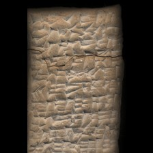 model input (224x224)  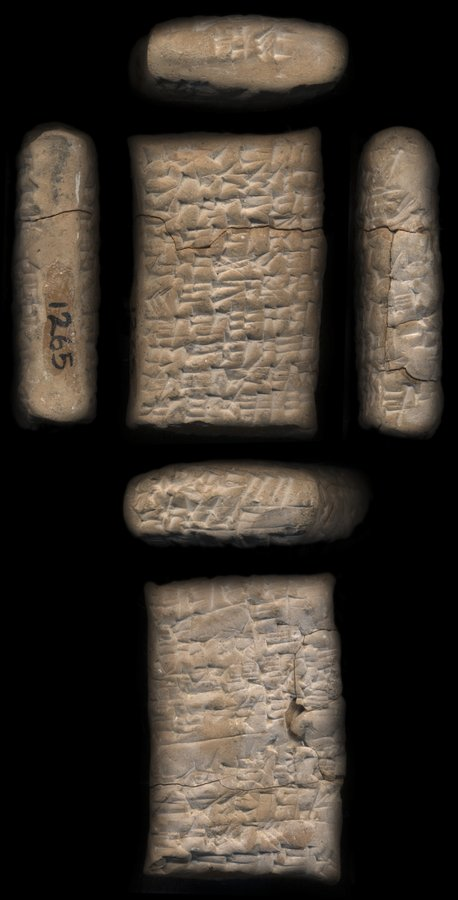 full photo (reference)</td><td valign="top"><table><tr><th>#</th><th>face</th><th>cuneiform</th><th>transliteration</th><th>translation</th></tr><tr><td>1</td><td>obverse</td><td>𒀸 𒋳 𒌋 𒃷 𒀀 𒊮</td><td>asz-szum 1(bur3) GAN2 a-sza3</td><td>&mdash;</td></tr><tr><td>2</td><td>obverse</td><td>𒊭 𒈾 𒄖 𒌝</td><td>sza na-gu-um</td><td>&mdash;</td></tr><tr><td>3</td><td>obverse</td><td>𒊭 𒄩 𒀭 𒁀 𒌈</td><td>sza ha-an-ba-tum</td><td>&mdash;</td></tr><tr><td>4</td><td>obverse</td><td>𒂊 𒊑 𒁀 𒄠 𒌉 𒀴 𒌍</td><td>e-ri-ba-am dumu ARAD-sin</td><td>&mdash;</td></tr><tr><td>5</td><td>obverse</td><td>𒌓 𒆜𒆳 𒍪</td><td>utu-illat-su2</td><td>&mdash;</td></tr><tr><td>6</td><td>obverse</td><td>𒌍 𒄿 𒁷 𒉆 𒅇 𒈾 𒁉 𒉌 𒉌 𒋗</td><td>sin-i-din-nam u3 na-bi-i3-li2-szu</td><td>&mdash;</td></tr><tr><td>7</td><td>obverse</td><td>𒅇 𒆷 𒄿 𒍝 𒁀 𒀜</td><td>u3-la i-s,a-ba-at</td><td>&mdash;</td></tr><tr><td>8</td><td>obverse</td><td>𒄩 𒀭 𒁀 𒌈</td><td>ha-an-ba-tum</td><td>&mdash;</td></tr><tr><td>9</td><td>obverse</td><td>𒆠 𒈠 𒈾 𒁲 𒁴</td><td>ki-ma na-di-tim</td><td>&mdash;</td></tr><tr><td>10</td><td>obverse</td><td>𒁲 𒆪 𒁮 𒄿 𒆷 𒀝</td><td>di-ku-tam2 i-la-ak</td><td>&mdash;</td></tr><tr><td>11</td><td>obverse</td><td>𒈬 𒌓 𒀀 𒀀</td><td>mu utu a-a</td><td>&mdash;</td></tr><tr><td>12</td><td>obverse</td><td>𒀫 𒌓</td><td>amar-utu</td><td>&mdash;</td></tr><tr><td>1</td><td>reverse</td><td>𒅇 𒋢 𒈬 𒆷 𒀭</td><td>u3 su-mu-la-el3</td><td>&mdash;</td></tr><tr><td>2</td><td>reverse</td><td>𒀉 𒈠</td><td>it-ma</td><td>&mdash;</td></tr><tr><td>3</td><td>reverse</td><td>𒅆 𒄩 𒇷 𒌑 𒌝</td><td>igi ha-li-u2-um</td><td>&mdash;</td></tr><tr><td>4</td><td>reverse</td><td>𒅆 𒁕 𒈪 𒅅 𒌈</td><td>igi da-mi-iq-tum</td><td>&mdash;</td></tr><tr><td>5</td><td>reverse</td><td>𒌉 𒈨 𒄩 𒈾 𒁍 𒌝</td><td>dumu-me ha-na-bu-um</td><td>&mdash;</td></tr><tr><td>6</td><td>reverse</td><td>𒅆 𒅀 𒄴 𒍪 𒌦 𒀭</td><td>igi ia-ah-zu-un-dingir</td><td>&mdash;</td></tr><tr><td>7</td><td>reverse</td><td>𒌉 𒇷 𒁉 𒀉 𒀹 𒁯</td><td>dumu li-pi2-it-isz8-tar2</td><td>&mdash;</td></tr><tr><td>8</td><td>reverse</td><td>𒅆 𒁁 𒇷 𒍪 𒉡</td><td>igi be-le-su2-nu</td><td>&mdash;</td></tr><tr><td>9</td><td>reverse</td><td>𒌉 𒊩 𒀴 𒌍</td><td>dumu-munus ARAD-sin</td><td>&mdash;</td></tr><tr><td>10</td><td>reverse</td><td>𒅆 𒈹 𒂼 𒈬 𒁾 𒊬</td><td>igi inanna-ama-mu dub-sar</td><td>&mdash;</td></tr></table></td></tr></table>

**Original text (transliteration):**
> aš - šum 1bur₃ GAN2 a - ša₃ ša na - gu - um ša ha - an - ba - tum e - ri - ba - am dumu ARAD - sin D utu - illat - su₂ sin - i - din - nam u₃ na - bi - i₃ - li₂ - šu u₃ - la i - ṣa - ba - at ha - an - ba - tum ki - ma na - di - tim di - ku - tam₂ i - la - ak mu D utu D a - a D amar - utu u₃ su - mu - la - el₃ it - ma igi ha - li - u₂ - um igi da - mi - iq - tum dumu - me ha - na - bu - um igi ia - ah - zu - un - dingir dumu li - pi₂ - it - iš₈ - tar₂ igi be - le - su₂ - nu dumu - munus ARAD - sin igi D inanna - ama - mu dub - sar

**Cuneiform (Unicode signs, whole document, not position-aligned to the text above):**
> 𒀸 𒋳 𒌋 𒃷 𒀀 𒊮 𒊭 𒈾 𒄖 𒌝 𒊭 𒄩 𒀭 𒁀 𒌈 𒂊 𒊑 𒁀 𒄠 𒌉 𒀴 𒌍 <D> 𒌓 𒆜𒆳 𒍪 𒌍 𒄿 𒁷 𒉆 𒅇 𒈾 𒁉 𒉌 𒉌 𒋗 𒅇 𒆷 𒄿 𒍝 𒁀 𒀜 𒄩 𒀭 𒁀 𒌈 𒆠 𒈠 𒈾 𒁲 𒁴 𒁲 𒆪 𒁮 𒄿 𒆷 𒀝 𒈬 <D> 𒌓 <D> 𒀀 𒀀 <D> 𒀫 𒌓 𒅇 𒋢 𒈬 𒆷 𒀭 𒀉 𒈠 𒅆 𒄩 𒇷 𒌑 𒌝 𒅆 𒁕 𒈪 𒅅 𒌈 𒌉 𒈨 𒄩 𒈾 𒁍 𒌝 𒅆 𒅀 𒄴 𒍪 𒌦 𒀭 𒌉 𒇷 𒁉 𒀉 𒀹 𒁯 𒅆 𒁁 𒇷 𒍪 𒉡 𒌉 𒊩 𒀴 𒌍 𒅆 <D> 𒈹 𒂼 𒈬 𒁾 𒊬

**Masked input (32 positions):**
> <strong>?</strong> - šum 1 <strong>?</strong>₃ GAN2 <strong>?</strong> - ša₃ ša na - gu - um <strong>?</strong> ha - an - ba - tum <strong>?</strong> <strong>?</strong> ri - ba - am dumu ARAD <strong>?</strong> sin <strong>?</strong> utu - illat - <strong>?</strong>₂ sin - i - <strong>?</strong> - nam u <strong>?</strong> na - bi - i₃ - li <strong>?</strong> - <strong>?</strong> u₃ - la i - ṣa - ba - at ha - an - ba - tum ki - ma na - di - tim di - ku - tam₂ <strong>?</strong> - la - ak mu D utu D <strong>?</strong> - a <strong>?</strong> <strong>?</strong> - utu u₃ su - mu - la <strong>?</strong> el <strong>?</strong> it - ma igi ha - li - u₂ <strong>?</strong> um igi da - mi - i <strong>?</strong> - tum dumu - me ha - na - <strong>?</strong> <strong>?</strong> um igi ia - ah <strong>?</strong> <strong>?</strong> <strong>?</strong> un <strong>?</strong> dingir dumu li - pi₂ - it - iš₈ - tar₂ <strong>?</strong> be - <strong>?</strong> - su₂ <strong>?</strong> nu dumu - munus <strong>?</strong>AD - sin igi D inanna <strong>?</strong> ama - mu dub - sar

### Restoration (masked-token predictions)

| # | true token | text-only top-1 | text-only top-3 | vision top-1 | vision top-3 | text-only correct | vision correct |
|---|---|---|---|---|---|---|---|
| 1 | `aš` | `aš` | `aš`, `ma`, `a` | `aš` | `aš`, `i`, `a` | ✅ | ✅ |
| 2 | `##bur` | `##bur` | `##bur`, `##ban`, `##iku` | `##bur` | `##bur`, `##še`, `##ban` | ✅ | ✅ |
| 3 | `a` | `a` | `a`, `i`, `an` | `a` | `a`, `i`, `an` | ✅ | ✅ |
| 4 | `ša` | `ki` | `ki`, `ša`, `-` | `ki` | `ki`, `ša`, `-` | ❌ | ❌ |
| 5 | `e` | `e` | `e`, `suen`, `ta` | `e` | `e`, `ta`, `suen` | ✅ | ✅ |
| 6 | `-` | `-` | `-`, `##₃`, `##₂` | `-` | `-`, `##₃`, `##₂` | ✅ | ✅ |
| 7 | `-` | `-` | `-`, `D`, `##2` | `-` | `-`, `D`, `##2` | ✅ | ✅ |
| 8 | `D` | `D` | `D`, `dumu`, `igi` | `D` | `D`, `igi`, `dumu` | ✅ | ✅ |
| 9 | `su` | `su` | `su`, `pi`, `e` | `su` | `su`, `pi`, `e` | ✅ | ✅ |
| 10 | `din` | `din` | `din`, `di`, `lu` | `din` | `din`, `di`, `en` | ✅ | ✅ |
| 11 | `##₃` | `##₃` | `##₃`, `##₄`, `##₂` | `##₃` | `##₃`, `##₄`, `##₂` | ✅ | ✅ |
| 12 | `##₂` | `##₂` | `##₂`, `##m`, `##₄` | `##₂` | `##₂`, `##m`, `##₃` | ✅ | ✅ |
| 13 | `šu` | `šu` | `šu`, `ia`, `ka` | `šu` | `šu`, `ia`, `ma` | ✅ | ✅ |
| 14 | `i` | `i` | `i`, `e`, `il` | `i` | `i`, `e`, `til` | ✅ | ✅ |
| 15 | `a` | `suen` | `suen`, `a`, `nin` | `suen` | `suen`, `a`, `sin` | ❌ | ❌ |
| 16 | `D` | `-` | `-`, `u`, `.` | `-` | `-`, `u`, `lu` | ❌ | ❌ |
| 17 | `amar` | `bi` | `bi`, `mur`, `a` | `bi` | `bi`, `mur`, `a` | ❌ | ❌ |
| 18 | `-` | `-` | `-`, `##₂`, `##m` | `-` | `-`, `##₂`, `##m` | ✅ | ✅ |
| 19 | `##₃` | `-` | `-`, `##₂`, `dumu` | `-` | `-`, `dumu`, `##₂` | ❌ | ❌ |
| 20 | `-` | `-` | `-`, `.`, `:` | `-` | `-`, `.`, `:` | ✅ | ✅ |
| 21 | `##q` | `##q` | `##q`, `##b`, `##ṭ` | `##q` | `##q`, `##b`, `##ṭ` | ✅ | ✅ |
| 22 | `bu` | `nu` | `nu`, `bu`, `bi` | `nu` | `nu`, `ru`, `bu` | ❌ | ❌ |
| 23 | `-` | `-` | `-`, `.`, `##₂` | `-` | `-`, `##₂`, `:` | ✅ | ✅ |
| 24 | `-` | `-` | `-`, `.`, `dumu` | `-` | `-`, `dumu`, `.` | ✅ | ✅ |
| 25 | `zu` | `ku` | `ku`, `mu`, `hu` | `ku` | `ku`, `mu`, `hu` | ❌ | ❌ |
| 26 | `-` | `-` | `-`, `/`, `dumu` | `-` | `-`, `dumu`, `igi` | ✅ | ✅ |
| 27 | `-` | `-` | `-`, `dumu`, `.` | `-` | `-`, `dumu`, `igi` | ✅ | ✅ |
| 28 | `igi` | `igi` | `igi`, `dumu`, `iti` | `igi` | `igi`, `dumu`, `iti` | ✅ | ✅ |
| 29 | `le` | `el` | `el`, `lu`, `er` | `el` | `el`, `er`, `lu` | ❌ | ❌ |
| 30 | `-` | `-` | `-`, `.`, `:` | `-` | `-`, `.`, `:` | ✅ | ✅ |
| 31 | `AR` | `AR` | `AR`, `-`, `ar` | `AR` | `AR`, `-`, `lu` | ✅ | ✅ |
| 32 | `-` | `-` | `-`, `D`, `dumu` | `-` | `-`, `dumu`, `D` | ✅ | ✅ |

Top-1 accuracy on this example: text-only 24/32 (75%), vision 24/32 (75%)

### Metadata predictions

| head | ground truth | text-only prediction | vision prediction |
|---|---|---|---|
| period | Old Babylonian | Old Babylonian (0.94) | Old Babylonian (0.96) |
| genre | Legal | Legal (0.90) | Legal (0.85) |
| language | Akkadian | Akkadian (0.89) | Akkadian (0.83) |
| provenience | Sippar | Sippar (0.76) | Sippar (0.80) |

---

## Example 3 — `P250745` (has photo: False)

*CUSAS 39, 073 -- Receipt, Ur III, Umma (mod. Tell Jokha) -- Schøyen Collection, Oslo, Norway -- published in Ur III texts in the Schøyen collection (Dahl, 2020)*

**Original text (transliteration):**
> 1diš u₈ ba - uš₂ kur - ra ki ur - ru - ta kišib₃ ensi₂ - ka iti ezem - D šul - gi mu D amar - D suen lugal D šul - gi nita kal - ga lugal uri₅ ki - ma lugal an - ub - da limmu₂ - ba ur - D li₉ - si₄ umma ki ARAD2 - zu

**Cuneiform (Unicode signs, whole document, not position-aligned to the text above):**
> 𒁹 𒇇 𒁀 𒌀 𒆳 𒊏 𒆠 𒌨 𒊒 𒋫 𒁾 𒉺𒋼𒋛 𒅗 𒌗 𒂡 <D> 𒂄 𒄀 𒈬 <D> 𒀫 <D> 𒂗𒍪 𒈗 <D> 𒂄 𒄀 𒍑 𒆗 𒂵 𒈗 𒋀𒀊 𒆠 𒈠 𒈗 𒀭 𒌒 𒁕 𒇹 𒁀 𒌨 <D> 𒉈 𒋜 𒄑𒆵 𒆠 𒀵 𒍪

**Masked input (12 positions):**
> <strong>?</strong> u₈ ba <strong>?</strong> uš₂ kur - ra ki ur - ru - ta kišib₃ ensi <strong>?</strong> - ka iti ezem - D šul - gi mu D amar <strong>?</strong> D suen lugal D šul - <strong>?</strong> nita kal - ga lugal <strong>?</strong> <strong>?</strong> ki - ma lugal <strong>?</strong> - ub - da <strong>?</strong> <strong>?</strong>u₂ <strong>?</strong> ba ur - D li₉ - <strong>?</strong>₄ umma ki ARAD2 - zu

### Restoration (masked-token predictions)

| # | true token | text-only top-1 | text-only top-3 | vision top-1 | vision top-3 | text-only correct | vision correct |
|---|---|---|---|---|---|---|---|
| 1 | `1diš` | `1diš` | `1diš`, `2diš`, `3diš` | `1diš` | `1diš`, `2diš`, `3diš` | ✅ | ✅ |
| 2 | `-` | `-` | `-`, `+`, `:` | `-` | `-`, `+`, `:` | ✅ | ✅ |
| 3 | `##₂` | `##₂` | `##₂`, `##2`, `##m` | `##₂` | `##₂`, `##2`, `'` | ✅ | ✅ |
| 4 | `-` | `-` | `-`, `.`, `+` | `-` | `-`, `+`, `.` | ✅ | ✅ |
| 5 | `gi` | `gi` | `gi`, `suen`, `D` | `gi` | `gi`, `mu`, `pa` | ✅ | ✅ |
| 6 | `uri` | `uri` | `uri`, `ša`, `-` | `uri` | `uri`, `um`, `en` | ✅ | ✅ |
| 7 | `##₅` | `##₅` | `##₅`, `-`, `##u` | `##₅` | `##₅`, `-`, `##₆` | ✅ | ✅ |
| 8 | `an` | `an` | `an`, `nu`, `lugal` | `an` | `an`, `nu`, `lugal` | ✅ | ✅ |
| 9 | `li` | `li` | `li`, `i`, `D` | `li` | `li`, `i`, `di` | ✅ | ✅ |
| 10 | `##mm` | `##mm` | `##mm`, `##ṭ`, `##m` | `##mm` | `##mm`, `##m`, `##ṭ` | ✅ | ✅ |
| 11 | `-` | `-` | `-`, `:`, `##₂` | `-` | `-`, `:`, `.` | ✅ | ✅ |
| 12 | `si` | `si` | `si`, `gi`, `ša` | `si` | `si`, `gi`, `par` | ✅ | ✅ |

Top-1 accuracy on this example: text-only 12/12 (100%), vision 12/12 (100%)

### Metadata predictions

| head | ground truth | text-only prediction | vision prediction |
|---|---|---|---|
| period | Ur III | Ur III (0.93) | Ur III (0.92) |
| genre | Administrative | Administrative (0.92) | Administrative (0.93) |
| language | Sumerian | Sumerian (0.93) | Sumerian (0.94) |
| provenience | Umma | Umma (0.91) | Umma (0.92) |

---

## Example 4 — `P503288` (has photo: False)

*PRU 3,  pl. 7 RS 11.0839 -- Administrative, Middle Babylonian, Ugarit (mod. Ras Shamra) -- published in Le palais royal d'Ugarit. III, Textes accadiens et hourrites des archives est, ouest et centrales (Nougayrol, 1955)*

**Original text (transliteration):**
> 1 me - at 78 KU₃. BABBAR - MEŠ i - na ŠU ta₂ - li - mu - nu 1 me - at 28 KU₃. BABBAR - MEŠ i - na ŠU pil₂ - si₂ - ia₈ 1 me - at 44 KU₃. BABBAR - MEŠ i - na ŠU IR₃ - U 1 me - at 18 KU₃. BABBAR - MEŠ i - na ŠU DUMU a - dal - ŠEŠ 89 KU₃. BABBAR - MEŠ i - na ŠU ia - an - ha - mi ša - na - ni 49 KU₃. BABBAR - MEŠ i - na ŠU DINGIR - tah - mi₃ ša - na - ni 59 KU₃. BABBAR - MEŠ i - na ŠU ab - di - na LU₂ raqxZUMdi 1 me - at 17 KU₃. BABBAR - MEŠ i - na ŠU DUMU el - la - na LU₂ uš₂ - ka - ni 2 me - at 58 KU₃. BABBAR - MEŠ i - na ŠU ṣi - id - qa - na LU₂ gi₅ - U 69 KU₃. BABBAR - MEŠ i - na ŠU ṣi - id - qa - na DUMU IGI 74 1 / 2 KU₃. BABBAR - MEŠ i - na ŠU DUMU - qu - ṭu - bi - ia₈ 14 1 / 2 KU₃. BABBAR - MEŠ i - na ŠU ia - pa - i LU₂ raqxZUMdi 26 KU₃. BABBAR - MEŠ i - na ŠU ṣi - id - qa - na LU₂ gi₅ - U 1 ME 60 KU₃. BABBAR - MEŠ i - na ŠU DUMU - IGI 46 KU₃. BABBAR - MEŠ i - na ŠU DUMU - a - hi - ia - na 12 KU₃. BABBAR - MEŠ i - na ŠU gu - pa - na 46 1 / 2 KU₃. BABBAR - MEŠ i - na ŠU u₂ - lu - ni 1 me - at 9 KU₃. BABBAR - MEŠ i - na ŠU am - mi - na ša - na - ni 1

**Cuneiform (Unicode signs, whole document, not position-aligned to the text above):**
> 𒁹 𒈨 𒀜 𒐕 𒆬 𒌓 𒎌 𒄿 𒈾 𒋗 𒁹 𒁕 𒇷 𒈬 𒉡 𒁹 𒈨 𒀜 𒎙 𒆬 𒌓 𒎌 𒄿 𒈾 𒋗 𒁹 𒉋 𒍣 𒉿 𒁹 𒈨 𒀜 𒐏 𒆬 𒌓 𒎌 𒄿 𒈾 𒋗 𒁹 𒀴 𒀭 𒌋 𒁹 𒈨 𒀜 𒌋 𒆬 𒌓 𒎌 𒄿 𒈾 𒋗 𒌉 𒁹 𒀀 𒊑 𒋀 𒐕 𒆬 𒌓 𒎌 𒄿 𒈾 𒋗 𒁹 𒅀 𒀭 𒄩 𒈪 𒇽 𒊭 𒈾 𒉌 𒐏 𒆬 𒌓 𒎌 𒄿 𒈾 𒋗 𒁹 𒀭 𒈭 𒈨 𒇽 𒊭 𒈾 𒉌 𒐐 𒆬 𒌓 𒎌 𒄿 𒈾 𒋗 𒁹 𒀊 𒁲 𒈾 𒇽 𒌷 𒍮 𒁲 𒁹 𒈨 𒀜 𒌋 𒆬 𒌓 𒎌 𒄿 𒈾 𒋗 𒌉 𒁹 𒂖 𒆷 𒈾 𒇽 𒌷 𒌀 𒅗 𒉌 𒈫 𒈨 𒀜 𒐐 𒆬 𒌓 𒎌 𒄿 𒈾 𒋗 𒋾 𒁹 𒍢 𒀉 𒋡 𒈾 𒇽 𒌷 𒆠 𒀭 𒌋 𒆷 𒐕 𒆬 𒌓 𒎌 𒄿 𒈾 𒋗 𒁹 𒍢 𒀉 𒋡 𒈾 𒌉 𒁹 𒀭 𒅆 𒀜 𒐕 𒁹 𒆬 𒌓 𒎌 𒄿 𒈾 𒋗 𒊩 𒌉 𒄣 𒂅 𒁉 𒉿 𒌋 𒁹 𒆬 𒌓 𒎌 𒄿 𒈾 𒋗 𒁹 𒅀 𒉺 𒄿 𒇽 𒌷 𒍮 𒁲 𒎙 𒆬 𒌓 𒎌 𒄿 𒈾 𒋗 𒁹 𒍢 𒀉 𒋡 𒈾 𒇽 𒌷 𒆠 𒀭 𒌋 𒁹 𒈨 𒐕 𒆬 𒌓 𒎌 𒄿 𒈾 𒋗 𒁹 𒌉 𒁹 𒀭 𒅆 𒀜 𒐏 𒆬 𒌓 𒎌 𒄿 𒈾 𒋗 𒁹 𒌉 𒀀 𒄭 𒅀 𒈾 𒌋 𒆬 𒌓 𒎌 𒄿 𒈾 𒋗 𒁹 𒄖 𒉺 𒈾 𒐏 𒁹 𒆬 𒌓 𒎌 𒄿 𒈾 𒋗 𒁹 𒌑 𒇻 𒉌 𒁹 𒈨 𒀜 𒐎 𒆬 𒌓 𒎌 𒄿 𒈾 𒋗 𒁹 𒄠 𒈪 𒈾 𒇽 𒊭 𒈾 𒉌 𒌋 𒁹 𒆬 𒌓 𒎌 𒄿 𒈾 𒋗 𒁹 𒀭 𒌨 𒊕 𒌉 𒁹 𒅗 𒅆 𒉿 𒇽 𒄯 𒌋

**Masked input (70 positions):**
> 1 <strong>?</strong> - at 78 KU₃. <strong>?</strong>BBAR - <strong>?</strong> i - na ŠU <strong>?</strong>₂ <strong>?</strong> li - mu - nu 1 me <strong>?</strong> at 28 KU <strong>?</strong>. BA <strong>?</strong>AR - MEŠ i - <strong>?</strong> Š <strong>?</strong> pil <strong>?</strong> - si₂ - ia₈ 1 <strong>?</strong> - at 44 KU₃. BA <strong>?</strong>AR - MEŠ i - na ŠU <strong>?</strong>₃ - U 1 me - at 18 KU₃. BABBAR - MEŠ i - <strong>?</strong> ŠU DUMU a - dal <strong>?</strong> <strong>?</strong>EŠ 89 KU₃ <strong>?</strong> BABBAR - MEŠ i - na ŠU ia <strong>?</strong> an - ha - mi ša <strong>?</strong> na - ni 49 KU₃. BABBAR - MEŠ i - na ŠU DINGIR - tah - mi₃ <strong>?</strong> - na - ni <strong>?</strong> KU <strong>?</strong>. <strong>?</strong>BBAR - MEŠ i - na ŠU ab - di <strong>?</strong> na LU <strong>?</strong> <strong>?</strong>qxZUMdi 1 me - <strong>?</strong> 17 KU₃ <strong>?</strong> BABBAR - MEŠ i - na <strong>?</strong>U DUMU <strong>?</strong> - la - na LU <strong>?</strong> <strong>?</strong>₂ - ka - ni 2 me - at 58 KU₃. BABBAR - <strong>?</strong> i - na ŠU <strong>?</strong>i - id - <strong>?</strong>a - na LU₂ gi₅ - U 69 <strong>?</strong>₃. <strong>?</strong> <strong>?</strong>AR - MEŠ i <strong>?</strong> na ŠU ṣi - id - qa - na DUMU IGI 74 1 / <strong>?</strong> <strong>?</strong>₃ <strong>?</strong> BABBAR - MEŠ i <strong>?</strong> na ŠU DUMU - qu <strong>?</strong> ṭu - bi - ia₈ 14 1 / 2 KU <strong>?</strong>. BABBAR - MEŠ i - na ŠU ia - pa - i LU₂ <strong>?</strong> <strong>?</strong>xZUMdi 26 <strong>?</strong>₃ <strong>?</strong> BABBAR - MEŠ i <strong>?</strong> na ŠU ṣi - id - qa <strong>?</strong> na LU <strong>?</strong> gi₅ - <strong>?</strong> 1 ME 60 KU₃. BABBAR - MEŠ <strong>?</strong> - na Š <strong>?</strong> DUMU - IGI <strong>?</strong> KU₃. BABBAR - MEŠ i - na Š <strong>?</strong> DUMU - <strong>?</strong> - hi - ia - na <strong>?</strong> KU₃ <strong>?</strong> BABB <strong>?</strong> - MEŠ i - na ŠU gu - <strong>?</strong> - na <strong>?</strong> 1 / 2 KU₃. BABB <strong>?</strong> - MEŠ <strong>?</strong> - <strong>?</strong> ŠU u <strong>?</strong> - lu - ni 1 me - at 9 KU₃. BABBAR - <strong>?</strong> i - na Š <strong>?</strong> am - mi - na ša - na - ni 1

### Restoration (masked-token predictions)

| # | true token | text-only top-1 | text-only top-3 | vision top-1 | vision top-3 | text-only correct | vision correct |
|---|---|---|---|---|---|---|---|
| 1 | `me` | `me` | `me`, `ME`, `ma` | `me` | `me`, `ME`, `ma` | ✅ | ✅ |
| 2 | `BA` | `BA` | `BA`, `BE`, `ba` | `BA` | `BA`, `ba`, `##BA` | ✅ | ✅ |
| 3 | `MEŠ` | `MEŠ` | `MEŠ`, `ME`, `LUGAL` | `MEŠ` | `MEŠ`, `LUGAL`, `ME` | ✅ | ✅ |
| 4 | `ta` | `u` | `u`, `ša`, `E` | `u` | `u`, `ša`, `E` | ❌ | ❌ |
| 5 | `-` | `-` | `-`, `DUMU`, `ša` | `-` | `-`, `DUMU`, `.` | ✅ | ✅ |
| 6 | `-` | `-` | `-`, `.`, `##₂` | `-` | `-`, `.`, `:` | ✅ | ✅ |
| 7 | `##₃` | `##₃` | `##₃`, `##₂`, `##₄` | `##₃` | `##₃`, `##₂`, `##₇` | ✅ | ✅ |
| 8 | `##BB` | `##BB` | `##BB`, `##B`, `##BA` | `##BB` | `##BB`, `##B`, `BA` | ✅ | ✅ |
| 9 | `na` | `na` | `na`, `da`, `di` | `na` | `na`, `ni`, `nat` | ✅ | ✅ |
| 10 | `##U` | `##U` | `##U`, `##A`, `##u` | `##U` | `##U`, `##A`, `##u` | ✅ | ✅ |
| 11 | `##₂` | `##₂` | `##₂`, `##₃`, `##₄` | `##₂` | `##₂`, `##₃`, `##₄` | ✅ | ✅ |
| 12 | `me` | `me` | `me`, `ME`, `ma` | `me` | `me`, `ME`, `ma` | ✅ | ✅ |
| 13 | `##BB` | `##BB` | `##BB`, `##B`, `BA` | `##BB` | `##BB`, `##B`, `BA` | ✅ | ✅ |
| 14 | `IR` | `DU` | `DU`, `KU`, `IR` | `DU` | `DU`, `KU`, `IR` | ❌ | ❌ |
| 15 | `na` | `na` | `na`, `di`, `da` | `na` | `na`, `di`, `ni` | ✅ | ✅ |
| 16 | `-` | `-` | `-`, `##₂`, `##₃` | `-` | `-`, `##₂`, `##₃` | ✅ | ✅ |
| 17 | `Š` | `Š` | `Š`, `T`, `K` | `Š` | `Š`, `T`, `K` | ✅ | ✅ |
| 18 | `.` | `.` | `.`, `-`, `,` | `.` | `.`, `-`, `,` | ✅ | ✅ |
| 19 | `-` | `-` | `-`, `.`, `##₂` | `-` | `-`, `.`, `##₂` | ✅ | ✅ |
| 20 | `-` | `-` | `-`, `+`, `.` | `-` | `-`, `.`, `:` | ✅ | ✅ |
| 21 | `ša` | `ša` | `ša`, `šu`, `an` | `ša` | `ša`, `lu`, `šu` | ✅ | ✅ |
| 22 | `59` | `50` | `50`, `45`, `48` | `18` | `18`, `45`, `40` | ❌ | ❌ |
| 23 | `##₃` | `##₃` | `##₃`, `##₂`, `##₄` | `##₃` | `##₃`, `##₂`, `##₇` | ✅ | ✅ |
| 24 | `BA` | `BA` | `BA`, `BE`, `##BA` | `BA` | `BA`, `ba`, `MA` | ✅ | ✅ |
| 25 | `-` | `-` | `-`, `.`, `##₂` | `-` | `-`, `.`, `:` | ✅ | ✅ |
| 26 | `##₂` | `##₂` | `##₂`, `-`, `##₄` | `##₂` | `##₂`, `-`, `##₃` | ✅ | ✅ |
| 27 | `ra` | `i` | `i`, `zi`, `za` | `zi` | `zi`, `i`, `za` | ❌ | ❌ |
| 28 | `at` | `at` | `at`, `At`, `na` | `at` | `at`, `At`, `it` | ✅ | ✅ |
| 29 | `.` | `.` | `.`, `-`, `,` | `.` | `.`, `-`, `,` | ✅ | ✅ |
| 30 | `Š` | `Š` | `Š`, `G`, `š` | `Š` | `Š`, `š`, `G` | ✅ | ✅ |
| 31 | `el` | `gu` | `gu`, `a`, `ma` | `gu` | `gu`, `ma`, `a` | ❌ | ❌ |
| 32 | `##₂` | `##₂` | `##₂`, `-`, `##₄` | `##₂` | `##₂`, `-`, `##₃` | ✅ | ✅ |
| 33 | `uš` | `u` | `u`, `ša`, `ar` | `ša` | `ša`, `u`, `aš` | ❌ | ❌ |
| 34 | `MEŠ` | `MEŠ` | `MEŠ`, `ME`, `LUGAL` | `MEŠ` | `MEŠ`, `LUGAL`, `ME` | ✅ | ✅ |
| 35 | `ṣ` | `ṣ` | `ṣ`, `q`, `Ṣ` | `ṣ` | `ṣ`, `Ṣ`, `q` | ✅ | ✅ |
| 36 | `q` | `q` | `q`, `Q`, `ṣ` | `q` | `q`, `Q`, `ṣ` | ✅ | ✅ |
| 37 | `KU` | `KU` | `KU`, `DU`, `LU` | `KU` | `KU`, `DU`, `LU` | ✅ | ✅ |
| 38 | `BA` | `BA` | `BA`, `BE`, `ba` | `BA` | `BA`, `ba`, `B` | ✅ | ✅ |
| 39 | `##BB` | `##BB` | `##BB`, `##B`, `##BA` | `##BB` | `##BB`, `##B`, `BA` | ✅ | ✅ |
| 40 | `-` | `-` | `-`, `+`, `##₃` | `-` | `-`, `+`, `.` | ✅ | ✅ |
| 41 | `2` | `2` | `2`, `3`, `4` | `2` | `2`, `3`, `4` | ✅ | ✅ |
| 42 | `KU` | `KU` | `KU`, `DU`, `LU` | `KU` | `KU`, `DU`, `GI` | ✅ | ✅ |
| 43 | `.` | `.` | `.`, `-`, `,` | `.` | `.`, `-`, `,` | ✅ | ✅ |
| 44 | `-` | `-` | `-`, `+`, `##₃` | `-` | `-`, `+`, `.` | ✅ | ✅ |
| 45 | `-` | `-` | `-`, `##r`, `##₂` | `-` | `-`, `##₂`, `##r` | ✅ | ✅ |
| 46 | `##₃` | `##₃` | `##₃`, `##₂`, `##₄` | `##₃` | `##₃`, `##₂`, `##₇` | ✅ | ✅ |
| 47 | `ra` | `zi` | `zi`, `i`, `gi` | `i` | `i`, `zi`, `za` | ❌ | ❌ |
| 48 | `##q` | `##q` | `##q`, `##k`, `q` | `##q` | `##q`, `##k`, `##₂` | ✅ | ✅ |
| 49 | `KU` | `KU` | `KU`, `DU`, `LU` | `KU` | `KU`, `DU`, `LU` | ✅ | ✅ |
| 50 | `.` | `.` | `.`, `-`, `,` | `.` | `.`, `-`, `,` | ✅ | ✅ |
| 51 | `-` | `-` | `-`, `+`, `##₃` | `-` | `-`, `+`, `.` | ✅ | ✅ |
| 52 | `-` | `-` | `-`, `.`, `+` | `-` | `-`, `.`, `:` | ✅ | ✅ |
| 53 | `##₂` | `##₂` | `##₂`, `##₄`, `-` | `##₂` | `##₂`, `##₃`, `##I` | ✅ | ✅ |
| 54 | `U` | `U` | `U`, `u`, `UD` | `U` | `U`, `u`, `UD` | ✅ | ✅ |
| 55 | `i` | `i` | `i`, `a`, `I` | `i` | `i`, `a`, `e` | ✅ | ✅ |
| 56 | `##U` | `##U` | `##U`, `##A`, `##u` | `##U` | `##U`, `##A`, `##u` | ✅ | ✅ |
| 57 | `46` | `56` | `56`, `58`, `54` | `6` | `6`, `50`, `8` | ❌ | ❌ |
| 58 | `##U` | `##U` | `##U`, `##A`, `##u` | `##U` | `##U`, `##A`, `##u` | ✅ | ✅ |
| 59 | `a` | `a` | `a`, `sa`, `la` | `a` | `a`, `ma`, `sa` | ✅ | ✅ |
| 60 | `12` | `6` | `6`, `1`, `8` | `6` | `6`, `18`, `8` | ❌ | ❌ |
| 61 | `.` | `.` | `.`, `-`, `,` | `.` | `.`, `-`, `,` | ✅ | ✅ |
| 62 | `##AR` | `##AR` | `##AR`, `##A`, `##ar` | `##AR` | `##AR`, `##ar`, `##UR` | ✅ | ✅ |
| 63 | `pa` | `la` | `la`, `za`, `di` | `la` | `la`, `za`, `lu` | ❌ | ❌ |
| 64 | `46` | `14` | `14`, `1`, `13` | `1` | `1`, `10`, `6` | ❌ | ❌ |
| 65 | `##AR` | `##AR` | `##AR`, `##A`, `##ar` | `##AR` | `##AR`, `##ar`, `##UR` | ✅ | ✅ |
| 66 | `i` | `i` | `i`, `a`, `I` | `i` | `i`, `a`, `e` | ✅ | ✅ |
| 67 | `na` | `na` | `na`, `da`, `di` | `na` | `na`, `ni`, `di` | ✅ | ✅ |
| 68 | `##₂` | `##₂` | `##₂`, `##b`, `##₃` | `##₂` | `##₂`, `##b`, `##₃` | ✅ | ✅ |
| 69 | `MEŠ` | `MEŠ` | `MEŠ`, `ME`, `LUGAL` | `MEŠ` | `MEŠ`, `LUGAL`, `ME` | ✅ | ✅ |
| 70 | `##U` | `##U` | `##U`, `##A`, `##u` | `##U` | `##U`, `##A`, `##u` | ✅ | ✅ |

Top-1 accuracy on this example: text-only 59/70 (84%), vision 59/70 (84%)

### Metadata predictions

| head | ground truth | text-only prediction | vision prediction |
|---|---|---|---|
| period | Middle Babylonian | Middle Babylonian (0.94) | Middle Babylonian (0.97) |
| genre | (no label) | Administrative (0.42) | Letters (0.38) **<- differs** |
| language | (no label) | Akkadian (0.87) | Akkadian (0.73) |
| provenience | Ugarit | Ugarit (0.94) | Ugarit (0.98) |

---

## Example 5 — `P382312` (has photo: True)

*TCBI 1, 060 -- Administrative, Old Akkadian, Adab (mod. Bismaya) -- Banca d'Italia, Rome, Italy -- published in Le tavolette cuneiformi di Adab delle collezioni della Banca d’Italia (Pomponio, 2006)*

<table><tr><td valign="top" width="240">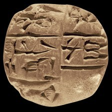 model input (224x224)  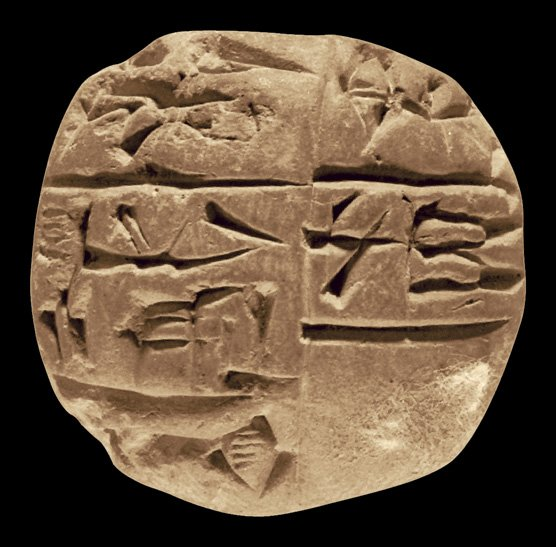 full photo (reference)</td><td valign="top"><table><tr><th>#</th><th>face</th><th>cuneiform</th><th>transliteration</th><th>translation</th></tr><tr><td>1</td><td>obverse</td><td>𒐀 𒉌 𒌢</td><td>2(asz@c) i3 umbin</td><td>&mdash;</td></tr><tr><td>2</td><td>obverse</td><td>𒈗 𒆳 𒊏</td><td>lugal-kur-ra</td><td>&mdash;</td></tr><tr><td>3</td><td>obverse</td><td>𒀭 𒈾 𒋧</td><td>an-na-szum2</td><td>&mdash;</td></tr></table></td></tr></table>

**Original text (transliteration):**
> 2aš @ c i₃ umbin lugal - kur - ra an - na - šum₂ di - utu nu - banda₃

**Masked input (4 positions):**
> 2aš <strong>?</strong> c i₃ umbin lugal - kur <strong>?</strong> ra an - na - šum₂ di - utu nu <strong>?</strong> banda <strong>?</strong>

### Restoration (masked-token predictions)

| # | true token | text-only top-1 | text-only top-3 | vision top-1 | vision top-3 | text-only correct | vision correct |
|---|---|---|---|---|---|---|---|
| 1 | `@` | `@` | `@`, `~`, `+` | `@` | `@`, `~`, `c` | ✅ | ✅ |
| 2 | `-` | `-` | `-`, `:`, `##₂` | `-` | `-`, `:`, `##₂` | ✅ | ✅ |
| 3 | `-` | `-` | `-`, `:`, `+` | `-` | `-`, `:`, `+` | ✅ | ✅ |
| 4 | `##₃` | `##₃` | `##₃`, `##₄`, `##₆` | `##₃` | `##₃`, `##₄`, `##₂` | ✅ | ✅ |

Top-1 accuracy on this example: text-only 4/4 (100%), vision 4/4 (100%)

### Metadata predictions

| head | ground truth | text-only prediction | vision prediction |
|---|---|---|---|
| period | Third Millennium | Third Millennium (0.94) | Third Millennium (0.97) |
| genre | Administrative | Administrative (0.93) | Administrative (0.91) |
| language | Sumerian | Sumerian (0.93) | Sumerian (0.93) |
| provenience | Adab | Adab (0.95) | Adab (0.99) |

---

## Example 6 — `P324308` (has photo: True)

*CUSAS 03, 0786 -- Administrative, Ur III, Garšana (mod. uncertain) -- Department of Near Eastern Studies, Cornell University, Ithaca, New York, USA -- published in The Garšana archives (Owen, 2007)*

<table><tr><td valign="top" width="240">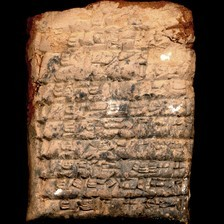 model input (224x224)  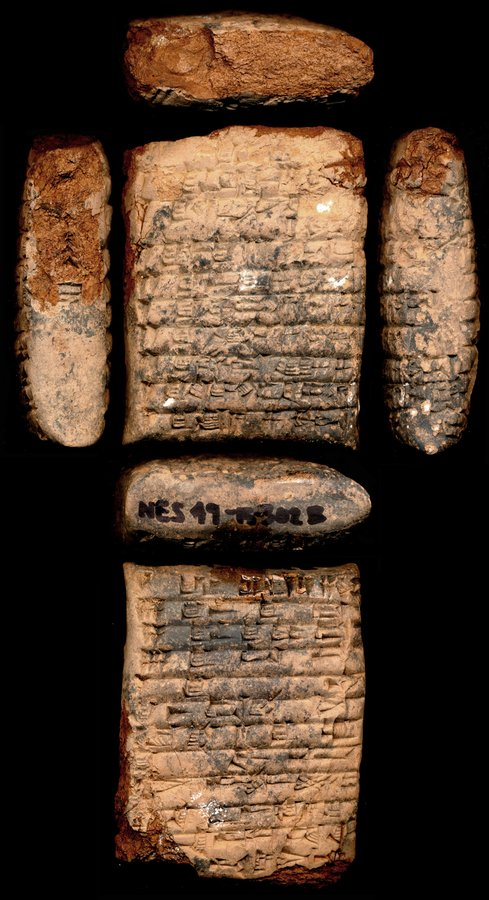 full photo (reference)</td><td valign="top"><table><tr><th>#</th><th>face</th><th>cuneiform</th><th>transliteration</th><th>translation</th></tr><tr><td>1</td><td>obverse</td><td>𒁹 𒌆 𒁇 𒋛 𒍑</td><td>2(disz) tug2 bar-si us2</td><td>&mdash;</td></tr><tr><td>2</td><td>obverse</td><td>𒁹 𒌆 𒁇 𒋛 𒃲 𒐈 𒄭𒁁 𒍑</td><td>1(disz) tug2 bar-si-gal 3(disz)-kam us2</td><td>&mdash;</td></tr><tr><td>3</td><td>obverse</td><td>𒁹 𒌆 𒊮 𒂵 𒆕 𒁀 𒌝 𒐈 𒄭𒁁 𒍑</td><td>1(disz) tug2 sza3-ga-du3 ba-tab duh-hu-um 3(disz)-kam us2</td><td>&mdash;</td></tr><tr><td>4</td><td>obverse</td><td>𒁹 𒌆 𒉿 𒐈 𒄭𒁁 𒍑 𒂍 𒁀 𒀭</td><td>2(disz) tug2 gesztu 3(disz)-kam us2 e2-ba-an</td><td>&mdash;</td></tr><tr><td>5</td><td>obverse</td><td>𒁹 𒌆 𒁇 𒌆 𒐉 𒄭𒁁 𒍑</td><td>2(disz) tug2 bar-dul5 4(disz)-kam us2</td><td>&mdash;</td></tr><tr><td>6</td><td>obverse</td><td>𒁹 𒌆 𒁀 𒑊 𒂃 𒄷 𒌝 𒐉 𒄭𒁁 𒍑</td><td>1(disz) tug2 ba-tab duh-hu-um 4(disz)-kam us2</td><td>&mdash;</td></tr><tr><td>7</td><td>obverse</td><td>𒁹 𒌆 𒃻 𒉈 𒐉 𒄭𒁁 𒍑</td><td>2(disz) tug2 nig2-lam2 4(disz)-kam us2</td><td>&mdash;</td></tr><tr><td>8</td><td>obverse</td><td>𒁹 𒌆 𒄘 𒌓𒁺 𒍝 𒐉 𒄭𒁁 𒍑</td><td>2(disz) tug2 gu2-e3 guz-za 4(disz)-kam us2</td><td>&mdash;</td></tr><tr><td>9</td><td>obverse</td><td>𒁹 𒌆 𒊮 𒄄 𒍏 𒁀 𒑊 𒂃 𒄷 𒌝 𒐉 𒄭𒁁 𒍑</td><td>1(disz) tug2 sza3-gi4-dab6 ba-tab duh-hu-um 4(disz)-kam us2</td><td>&mdash;</td></tr><tr><td>10</td><td>obverse</td><td>𒁹 𒌆 𒁯 𒀀 𒐉 𒄭𒁁 𒍑</td><td>1(disz) tug2 gun3-a 4(disz)-kam us2</td><td>&mdash;</td></tr><tr><td>1</td><td>reverse</td><td>𒁹 𒌆 𒁇 𒋛 𒁯 𒀀 𒐉 𒄭𒁁 𒍑</td><td>1(disz) tug2 bar-si gun3-a 4(disz)-kam us2</td><td>&mdash;</td></tr><tr><td>2</td><td>reverse</td><td>𒐋 𒌆 𒁇 𒌆 𒁺</td><td>6(disz) tug2 bar-dul5 du</td><td>&mdash;</td></tr><tr><td>3</td><td>reverse</td><td>𒐉 𒌆 𒁇 𒌆 𒌉 𒁺</td><td>4(disz) tug2 bar-dul5 tur du</td><td>&mdash;</td></tr><tr><td>4</td><td>reverse</td><td>𒐍 𒌆 𒍑 𒁇</td><td>8(disz) tug2 usz-bar</td><td>&mdash;</td></tr><tr><td>5</td><td>reverse</td><td>𒁹 𒌆 𒈮</td><td>1(disz) tug2 mug</td><td>&mdash;</td></tr><tr><td>6</td><td>reverse</td><td>𒆠 𒀸 𒁕 𒃼 𒋫</td><td>ki asz-ta2-qar-ta</td><td>&mdash;</td></tr><tr><td>7</td><td>reverse</td><td>𒅤𒊭 𒀀 𒆪 𒌝</td><td>puzur4-a-ku-um</td><td>&mdash;</td></tr><tr><td>8</td><td>reverse</td><td>𒋗 𒁀 𒋾</td><td>szu ba-ti</td><td>&mdash;</td></tr><tr><td>9</td><td>reverse</td><td>𒄊 𒅎 𒆜𒆳 𒑐𒀠</td><td>giri3 iszkur-illat szabra</td><td>&mdash;</td></tr><tr><td>10</td><td>reverse</td><td>𒌚 𒆠 𒋠 𒊩𒌆 𒀀 𒍪</td><td>iti ki-siki nin-a-zu</td><td>&mdash;</td></tr><tr><td>11</td><td>reverse</td><td>𒂗 𒈹 𒀕 𒆠 𒂵 𒈧 𒂊 𒉌 𒅆𒊒</td><td>mu en inanna unu-ga masz2-e i3-pa3</td><td>&mdash;</td></tr><tr><td>1</td><td>left</td><td>𒌋 𒐋</td><td>3(u) 6(disz)</td><td>&mdash;</td></tr></table></td></tr></table>

**Original text (transliteration):**
> tug₂ bar - si - gal tug₂ ša₃ - ga - du₃ ba - 2diš tug₂ geštu + tug₂ 3diš - kam 2diš tug₂ bar - dul₅ 4diš - kam 1diš tug₂ ba - tab duh - hu - um 2diš tug₂ nig₂ - lam₂ 4diš - 2diš tug₂ gu₂ - e₃ guz - 1diš tug₂ ša₃ - gi₄ - dab₆ ba - tab 1diš tug₂ gun₃ - a 4diš - kam us₂ 1diš tug₂ bar - si gun₃ - a 4diš - 6diš tug₂ bar - dul₅ du 4diš tug₂ bar - dul₅ tur 8diš tug₂ uš - 1diš tug₂ - illat šabra - a - zu unu ki - ga - pa₃ me - D ištaran dumu - munus lugal puzur₄ - a - ku - um lu₂ azlag₂ ARAD2 - zu 3u 6diš

**Cuneiform (Unicode signs, whole document, not position-aligned to the text above):**
> 𒌆 𒁇 𒋛 𒃲 𒌆 𒊮 𒂵 𒆕 𒁀 𒈫 𒌆 𒉿 𒐈 𒄰 𒈫 𒌆 𒁇 𒌆 𒐉 𒄰 𒁹 𒌆 𒁀 𒋰 𒃮 𒄷 𒌝 𒈫 𒌆 𒃻 𒉈 𒐉 𒈫 𒌆 𒄘 𒌓𒁺 𒁹 𒌆 𒊮 𒄄 𒍏 𒁀 𒋰 𒁹 𒌆 𒁯 𒀀 𒐉 𒄰 𒍑 𒁹 𒌆 𒁇 𒋛 𒁯 𒀀 𒐉 𒐋 𒌆 𒁇 𒌆 𒁺 𒐉 𒌆 𒁇 𒌆 𒌉 𒌆 𒍑 𒁹 𒌆 𒆜𒆳 𒉺𒀠 𒀀 𒍪 𒀕 𒆠 𒂵 𒅆𒊒 𒈨 <D> 𒌉 𒊩 𒈗 𒅤𒊭 𒀀 𒆪 𒌝 𒇽 𒌆 𒀵 𒍪 𒌍 𒐋

**Masked input (30 positions):**
> tug₂ <strong>?</strong> <strong>?</strong> si - gal tu <strong>?</strong> <strong>?</strong> <strong>?</strong> <strong>?</strong> - ga - du₃ <strong>?</strong> - 2diš tug₂ geštu + tug₂ <strong>?</strong> - kam <strong>?</strong> tug <strong>?</strong> bar <strong>?</strong> dul₅ 4diš - <strong>?</strong> 1diš tug₂ ba - tab duh <strong>?</strong> hu - um 2diš <strong>?</strong>g₂ <strong>?</strong>₂ - lam₂ 4diš - 2diš tug₂ gu₂ - e₃ guz - 1diš tug₂ ša₃ - gi₄ - dab₆ ba - tab 1diš tug₂ gun₃ <strong>?</strong> a 4diš - kam us₂ 1diš tug₂ bar - si <strong>?</strong>₃ - <strong>?</strong> 4diš - 6diš tu <strong>?</strong>₂ bar - dul₅ du <strong>?</strong> tug₂ <strong>?</strong> - dul₅ tur 8diš tug₂ <strong>?</strong> - 1diš tug₂ - illat ša <strong>?</strong> - a <strong>?</strong> zu unu ki - <strong>?</strong> <strong>?</strong> pa₃ <strong>?</strong> - D <strong>?</strong>taran dumu - munus lugal puzur₄ - a - ku - <strong>?</strong> lu₂ azlag₂ ARAD <strong>?</strong> - zu 3u 6diš

### Restoration (masked-token predictions)

| # | true token | text-only top-1 | text-only top-3 | vision top-1 | vision top-3 | text-only correct | vision correct |
|---|---|---|---|---|---|---|---|
| 1 | `bar` | `bar` | `bar`, `geš`, `-` | `bar` | `bar`, `geš`, `ba` | ✅ | ✅ |
| 2 | `-` | `-` | `-`, `##₃`, `##₂` | `-` | `-`, `##₃`, `##tu` | ✅ | ✅ |
| 3 | `##g` | `##g` | `##g`, `-`, `##š` | `##g` | `##g`, `-`, `##š` | ✅ | ✅ |
| 4 | `##₂` | `##₂` | `##₂`, `-`, `##₃` | `##₂` | `##₂`, `-`, `##₄` | ✅ | ✅ |
| 5 | `ša` | `du` | `du`, `nig`, `ša` | `nig` | `nig`, `geš`, `du` | ❌ | ❌ |
| 6 | `##₃` | `##₃` | `##₃`, `##₂`, `##₆` | `##₃` | `##₃`, `##₂`, `##₆` | ✅ | ✅ |
| 7 | `ba` | `4diš` | `4diš`, `3diš`, `2diš` | `4diš` | `4diš`, `3diš`, `2diš` | ❌ | ❌ |
| 8 | `3diš` | `4diš` | `4diš`, `3diš`, `2diš` | `4diš` | `4diš`, `3diš`, `2diš` | ❌ | ❌ |
| 9 | `2diš` | `1diš` | `1diš`, `2diš`, `4diš` | `1diš` | `1diš`, `2diš`, `4diš` | ❌ | ❌ |
| 10 | `##₂` | `##₂` | `##₂`, `##₃`, `-` | `##₂` | `##₂`, `##₃`, `##₄` | ✅ | ✅ |
| 11 | `-` | `-` | `-`, `:`, `.` | `-` | `-`, `:`, `.` | ✅ | ✅ |
| 12 | `kam` | `2diš` | `2diš`, `1diš`, `6diš` | `kam` | `kam`, `2diš`, `1diš` | ❌ | ✅ |
| 13 | `-` | `-` | `-`, `##₂`, `##₃` | `-` | `-`, `##₃`, `##₂` | ✅ | ✅ |
| 14 | `tu` | `tu` | `tu`, `mu`, `gu` | `tu` | `tu`, `mu`, `ti` | ✅ | ✅ |
| 15 | `nig` | `nig` | `nig`, `gu`, `lu` | `nig` | `nig`, `aš`, `lu` | ✅ | ✅ |
| 16 | `-` | `-` | `-`, `:`, `.` | `-` | `-`, `:`, `.` | ✅ | ✅ |
| 17 | `gun` | `gun` | `gun`, `du`, `ša` | `gun` | `gun`, `du`, `unu` | ✅ | ✅ |
| 18 | `a` | `a` | `a`, `da`, `ga` | `a` | `a`, `da`, `ga` | ✅ | ✅ |
| 19 | `##g` | `##g` | `##g`, `##gu`, `##m` | `##g` | `##g`, `##gu`, `##gi` | ✅ | ✅ |
| 20 | `4diš` | `1diš` | `1diš`, `2diš`, `3diš` | `1diš` | `1diš`, `2diš`, `4diš` | ❌ | ❌ |
| 21 | `bar` | `bar` | `bar`, `ba`, `geš` | `bar` | `bar`, `ba`, `geš` | ✅ | ✅ |
| 22 | `uš` | `bar` | `bar`, `1diš`, `sag` | `bar` | `bar`, `1diš`, `sag` | ❌ | ❌ |
| 23 | `##bra` | `##₃` | `##₃`, `##bra`, `##gina` | `##₃` | `##₃`, `##bra`, `nin` | ❌ | ❌ |
| 24 | `-` | `-` | `-`, `:`, `.` | `-` | `-`, `:`, `##₂` | ✅ | ✅ |
| 25 | `ga` | `ga` | `ga`, `e`, `ne` | `ga` | `ga`, `bi`, `e` | ✅ | ✅ |
| 26 | `-` | `-` | `-`, `mu`, `lugal` | `-` | `-`, `##₃`, `##₄` | ✅ | ✅ |
| 27 | `me` | `me` | `me`, `ur`, `lugal` | `me` | `me`, `ur`, `šu` | ✅ | ✅ |
| 28 | `iš` | `iš` | `iš`, `Iš`, `gi` | `iš` | `iš`, `gi`, `geš` | ✅ | ✅ |
| 29 | `um` | `um` | `um`, `un`, `tal` | `um` | `um`, `bi`, `un` | ✅ | ✅ |
| 30 | `##2` | `##2` | `##2`, `##₂`, `##3` | `##2` | `##2`, `##₂`, `##3` | ✅ | ✅ |

Top-1 accuracy on this example: text-only 22/30 (73%), vision 23/30 (77%)

### Metadata predictions

| head | ground truth | text-only prediction | vision prediction |
|---|---|---|---|
| period | Ur III | Ur III (0.96) | Ur III (0.94) |
| genre | Administrative | Administrative (0.88) | Administrative (0.94) |
| language | Sumerian | Sumerian (0.93) | Sumerian (0.94) |
| provenience | Garšana | Garšana (0.93) | Garšana (0.93) |

---

## Example 7 — `P211509` (has photo: False)

*Hermitage 3, 366 -- Administrative, Ur III, Puzriš-Dagan (mod. Drehem) -- State Hermitage Museum, St. Petersburg, Russian Federation -- published in Hermitage 3 (Koslova, nd)*

**Original text (transliteration):**
> 1geš₂ 4u la₂ 1diš @ t udu 4diš sila₄ 6diš maš₂ - gal šu - gid₂ ki na - lu₅ - ta du₁₁ - ga i₃ - dab₅ iti u₅ - bi₂ - gu₇ mu ma₂ - dara₃ - abzu D en - ki - ka ba - ab - du₈

**Cuneiform (Unicode signs, whole document, not position-aligned to the text above):**
> 𒐕 𒇲 𒇻 𒐉 𒃢 𒐋 𒈧 𒃲 𒋗 𒁍 𒆠 𒈾 𒈜 𒋫 𒅗 𒂵 𒉌 𒆪 𒌗 𒄷𒋛 𒉈 𒅥 𒈬 𒈣 𒁰 𒍪𒀊 <D> 𒂗 𒆠 𒅗 𒁀 𒀊 𒃮

**Masked input (11 positions):**
> 1geš₂ 4u la₂ 1diš @ <strong>?</strong> udu 4diš sila <strong>?</strong> <strong>?</strong> <strong>?</strong>₂ - gal šu - gi <strong>?</strong>₂ ki na - lu₅ - ta du₁₁ - ga i₃ - <strong>?</strong> <strong>?</strong> iti u₅ - bi₂ - gu₇ mu ma <strong>?</strong> - dara₃ - ab <strong>?</strong> D en - ki <strong>?</strong> ka ba - ab - du <strong>?</strong>

### Restoration (masked-token predictions)

| # | true token | text-only top-1 | text-only top-3 | vision top-1 | vision top-3 | text-only correct | vision correct |
|---|---|---|---|---|---|---|---|
| 1 | `t` | `t` | `t`, `c`, `s` | `t` | `t`, `c`, `v` | ✅ | ✅ |
| 2 | `##₄` | `##₄` | `##₄`, `##₃`, `##₈` | `##₄` | `##₄`, `##₃`, `##₈` | ✅ | ✅ |
| 3 | `6diš` | `1diš` | `1diš`, `2diš`, `3diš` | `2diš` | `2diš`, `1diš`, `4diš` | ❌ | ❌ |
| 4 | `maš` | `maš` | `maš`, `gu`, `gin` | `maš` | `maš`, `gin`, `aš` | ✅ | ✅ |
| 5 | `##d` | `##d` | `##d`, `##l`, `##t` | `##d` | `##d`, `##l`, `##gir` | ✅ | ✅ |
| 6 | `dab` | `dab` | `dab`, `gal`, `la` | `dab` | `dab`, `gal`, `la` | ✅ | ✅ |
| 7 | `##₅` | `##₅` | `##₅`, `##₂`, `##₃` | `##₅` | `##₅`, `##₂`, `##₃` | ✅ | ✅ |
| 8 | `##₂` | `##₂` | `##₂`, `##₃`, `##₄` | `##₂` | `##₂`, `##₃`, `##₄` | ✅ | ✅ |
| 9 | `##zu` | `##zu` | `##zu`, `-`, `##₂` | `##zu` | `##zu`, `-`, `##₂` | ✅ | ✅ |
| 10 | `-` | `-` | `-`, `ki`, `:` | `-` | `-`, `ki`, `:` | ✅ | ✅ |
| 11 | `##₈` | `##₈` | `##₈`, `##₇`, `##₃` | `##₈` | `##₈`, `##₇`, `##₆` | ✅ | ✅ |

Top-1 accuracy on this example: text-only 10/11 (91%), vision 10/11 (91%)

### Metadata predictions

| head | ground truth | text-only prediction | vision prediction |
|---|---|---|---|
| period | Ur III | Ur III (0.91) | Ur III (0.92) |
| genre | Administrative | Administrative (0.94) | Administrative (0.93) |
| language | Sumerian | Sumerian (0.93) | Sumerian (0.93) |
| provenience | Puzriš-Dagan | Puzriš-Dagan (0.92) | Puzriš-Dagan (0.93) |

---

## Example 8 — `P237245` (has photo: True)

*ABL 0345 -- Letter, Neo-Assyrian, Nineveh (mod. Kuyunjik) -- British Museum, London, UK -- published in Assyrian and Babylonian letters belonging to the Kouyunjik collections of the British museum (Harper, 1892-1914)*

<table><tr><td valign="top" width="240">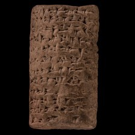 model input (224x224)  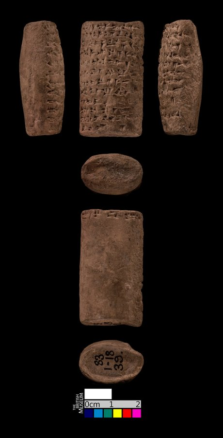 full photo (reference)</td><td valign="top">(no line-by-line ATF available for this tablet)</td></tr></table>

**Original text (transliteration):**
> IM mar - duk a - na ku - ri - gal - zu ŠEŠ - šu₂ EN u AG šu - lum ša₂ ŠEŠ - ia₂ liš - ʾa - a - lu am - mi₃ - ni am - mi₃ - ni A - šip - ri - ka A - šip - ri - ka ul am - mar a - di a - na bar - sip er - ru - bu - uʾ ki - i A - šip - ri - ka A - šip - ri - ka am - ma - ru lib - bu - u₂ GEŠTIN ta - šat - tu - u₂ 01. et šap - pa - ti ŠEŠ - u₂ - a lu - še - bi - li

**Cuneiform (Unicode signs, whole document, not position-aligned to the text above):**
> 𒅎 𒁹 𒈥 𒂁 𒀀 𒈾 𒁹 𒆪 𒊑 𒃲 𒍪 𒋀 𒋙 𒀭 𒂗 𒌋 𒀭 𒀝 𒋗 𒈝 𒃻 𒋀 𒐊 𒇺 𒀪 𒀀 𒇻 𒄠 𒈨 𒉌 𒄠 𒈨 𒉌 𒇽 𒀀 𒈨 𒊑 𒅗 𒇽 𒀀 𒈨 𒊑 𒅗 𒌌 𒄠 𒈥 𒀀 𒁲 𒀀 𒈾 𒁇 𒈨 𒆠 𒅕 𒊒 𒁍 𒀪 𒆠 𒄿 𒇽 𒀀 𒈨 𒊑 𒅗 𒇽 𒀀 𒈨 𒊑 𒅗 𒄠 𒈠 𒊒 𒈜 𒁍 𒌑 𒄑 𒃾 𒃻 𒋫 𒆳 𒌅 𒌑 𒁹 𒀉 𒂁 𒉺𒅁 𒉺 𒋾 𒋀 𒌑 𒀀 𒇻 𒊺 𒁉 𒇷

**Masked input (24 positions):**
> IM mar - duk a - na ku - ri <strong>?</strong> gal - zu Š <strong>?</strong> - šu₂ EN u AG šu - lum ša₂ Š <strong>?</strong> - ia₂ li <strong>?</strong> <strong>?</strong> ʾa - a - <strong>?</strong> <strong>?</strong> <strong>?</strong> mi₃ - ni am - <strong>?</strong>₃ - <strong>?</strong> A <strong>?</strong> šip - ri - ka A - šip - ri - <strong>?</strong> ul am - mar a - di a - na bar <strong>?</strong> <strong>?</strong>p <strong>?</strong> <strong>?</strong> ru - bu - uʾ ki <strong>?</strong> i A - šip - ri <strong>?</strong> ka A - <strong>?</strong>p - <strong>?</strong> - ka am - ma - ru lib - bu - u₂ GEŠTIN ta - šat - tu - u₂ 01. et <strong>?</strong>p - pa - ti ŠEŠ <strong>?</strong> u₂ - <strong>?</strong> lu - še - bi <strong>?</strong> li

### Restoration (masked-token predictions)

| # | true token | text-only top-1 | text-only top-3 | vision top-1 | vision top-3 | text-only correct | vision correct |
|---|---|---|---|---|---|---|---|
| 1 | `-` | `-` | `-`, `##b`, `##m` | `-` | `-`, `##b`, `##m` | ✅ | ✅ |
| 2 | `##EŠ` | `##EŠ` | `##EŠ`, `##ID`, `##U` | `##EŠ` | `##EŠ`, `##ID`, `##U` | ✅ | ✅ |
| 3 | `##EŠ` | `##EŠ` | `##EŠ`, `##U`, `##ID` | `##EŠ` | `##EŠ`, `##U`, `##ID` | ✅ | ✅ |
| 4 | `##š` | `##š` | `##š`, `##m`, `##q` | `##š` | `##š`, `##q`, `##m` | ✅ | ✅ |
| 5 | `-` | `-` | `-`, `i`, `ma` | `-` | `-`, `ma`, `i` | ✅ | ✅ |
| 6 | `lu` | `ni` | `ni`, `a`, `ti` | `a` | `a`, `ti`, `ni` | ❌ | ❌ |
| 7 | `am` | `am` | `am`, `um`, `im` | `am` | `am`, `um`, `im` | ✅ | ✅ |
| 8 | `-` | `-` | `-`, `ma`, `##₂` | `-` | `-`, `.`, `##₂` | ✅ | ✅ |
| 9 | `mi` | `mi` | `mi`, `ka`, `di` | `mi` | `mi`, `ma`, `di` | ✅ | ✅ |
| 10 | `ni` | `ni` | `ni`, `ri`, `ru` | `ni` | `ni`, `nu`, `ri` | ✅ | ✅ |
| 11 | `-` | `-` | `-`, `.`, `+` | `-` | `-`, `.`, `##₂` | ✅ | ✅ |
| 12 | `ka` | `ka` | `ka`, `ia`, `kam` | `ka` | `ka`, `ia`, `ku` | ✅ | ✅ |
| 13 | `-` | `-` | `-`, `##₂`, `.` | `-` | `-`, `##₂`, `.` | ✅ | ✅ |
| 14 | `si` | `ri` | `ri`, `si`, `qu` | `ri` | `ri`, `ši`, `qu` | ❌ | ❌ |
| 15 | `er` | `-` | `-`, `a`, `i` | `-` | `-`, `i`, `a` | ❌ | ❌ |
| 16 | `-` | `-` | `-`, `ti`, `ri` | `-` | `-`, `ka`, `ti` | ✅ | ✅ |
| 17 | `-` | `-` | `-`, `.`, `:` | `-` | `-`, `.`, `##₂` | ✅ | ✅ |
| 18 | `-` | `-` | `-`, `.`, `:` | `-` | `-`, `.`, `:` | ✅ | ✅ |
| 19 | `ši` | `ši` | `ši`, `ša`, `šu` | `ši` | `ši`, `ša`, `aš` | ✅ | ✅ |
| 20 | `ri` | `ri` | `ri`, `ra`, `ru` | `ri` | `ri`, `ra`, `ru` | ✅ | ✅ |
| 21 | `ša` | `li` | `li`, `i`, `ša` | `i` | `i`, `li`, `ša` | ❌ | ❌ |
| 22 | `-` | `-` | `-`, `##₂`, `LUGAL` | `-` | `-`, `##₂`, `LUGAL` | ✅ | ✅ |
| 23 | `a` | `a` | `a`, `ti`, `ni` | `ni` | `ni`, `a`, `ti` | ✅ | ❌ |
| 24 | `-` | `-` | `-`, `##₂`, `##₄` | `-` | `-`, `##₂`, `##š` | ✅ | ✅ |

Top-1 accuracy on this example: text-only 20/24 (83%), vision 19/24 (79%)

### Metadata predictions

| head | ground truth | text-only prediction | vision prediction |
|---|---|---|---|
| period | Neo-Assyrian | Neo-Assyrian (0.90) | Neo-Assyrian (0.94) |
| genre | Administrative | Administrative (0.97) | Administrative (0.94) |
| language | Akkadian | Akkadian (0.94) | Akkadian (0.87) |
| provenience | Nineveh | Nineveh (0.82) | Nineveh (0.80) |

---

## Example 9 — `oracc:cdli:P001113` (has photo: False)

**Original text (transliteration):**
> <strong>...</strong> 2N01 <strong>...</strong> SAL ERIN UNUG ~ a

**Cuneiform (Unicode signs, whole document, not position-aligned to the text above):**
> [#]

**Masked input (2 positions):**
> <strong>...</strong> 2N01 <strong>...</strong> <strong>?</strong>L ERIN <strong>?</strong>UG ~ a

### Restoration (masked-token predictions)

| # | true token | text-only top-1 | text-only top-3 | vision top-1 | vision top-3 | text-only correct | vision correct |
|---|---|---|---|---|---|---|---|
| 1 | `SA` | `SA` | `SA`, `KA`, `LA` | `SA` | `SA`, `LA`, `KA` | ✅ | ✅ |
| 2 | `UN` | `UN` | `UN`, `UD`, `##UN` | `UN` | `UN`, `##UN`, `##UL` | ✅ | ✅ |

Top-1 accuracy on this example: text-only 2/2 (100%), vision 2/2 (100%)

### Metadata predictions

| head | ground truth | text-only prediction | vision prediction |
|---|---|---|---|
| period | (no label) | Third Millennium (0.97) | Third Millennium (0.95) |
| genre | (no label) | Administrative (0.55) | Lexical (0.49) **<- differs** |
| language | (no label) | Sumerian (0.80) | Sumerian (0.91) |
| provenience | (no label) | Ur (0.45) | Uruk (0.57) **<- differs** |

---

## Example 10 — `P215161` (has photo: True)

*MAD 1, 335 -- Administrative, Old Akkadian, Ešnunna (mod. Tell Asmar) -- Institute for the Study of Ancient Cultures West Asia & North Africa Museum, Chicago, Illinois, USA -- published in Sargonic texts from the Diyala region (Gelb, 1951)*

<table><tr><td valign="top" width="240">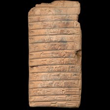 model input (224x224)  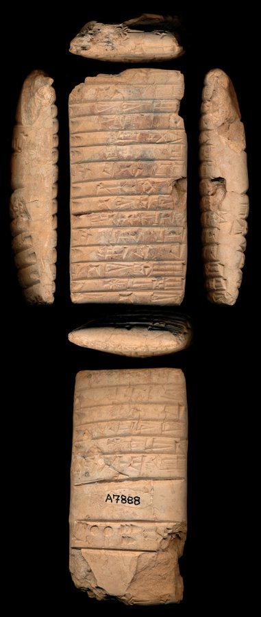 full photo (reference)</td><td valign="top"><table><tr><th>#</th><th>face</th><th>cuneiform</th><th>transliteration</th><th>translation</th></tr><tr><td>1</td><td>obverse</td><td>𒄥</td><td>8(asz@c) sze gur</td><td>&mdash;</td></tr><tr><td>2</td><td>obverse</td><td>𒍪 𒈾 𒈝</td><td>zu-na-num2</td><td>&mdash;</td></tr><tr><td>3</td><td>obverse</td><td>𒀸 𒉌 𒉌 𒄨</td><td>1(asz@c) i3-li2-dan</td><td>&mdash;</td></tr><tr><td>4</td><td>obverse</td><td>𒀸 𒃲 𒅖 𒄭</td><td>1(asz@c) gal-isz-du10</td><td>&mdash;</td></tr><tr><td>5</td><td>obverse</td><td>𒐀 𒈠 𒋳</td><td>2(asz@c) ma-szum</td><td>&mdash;</td></tr><tr><td>6</td><td>obverse</td><td>𒐀 𒇻 𒇻</td><td>2(asz@c) lu-lu</td><td>&mdash;</td></tr><tr><td>7</td><td>obverse</td><td>𒋗 𒌓 𒍪 𒈾 𒈝</td><td>szu-ut zu-na-num2</td><td>&mdash;</td></tr><tr><td>8</td><td>obverse</td><td>𒀸 𒍣 𒃼 𒋢</td><td>1(asz@c) zi-kar3-su</td><td>&mdash;</td></tr><tr><td>9</td><td>obverse</td><td>𒀸 𒁁 𒉌 𒁀 𒉌</td><td>1(asz@c) be-li2-ba-ni</td><td>&mdash;</td></tr><tr><td>10</td><td>obverse</td><td>𒀸 𒄿 𒋾 𒁕 𒃶</td><td>1(asz@c) i-di3-da-gan</td><td>&mdash;</td></tr><tr><td>11</td><td>obverse</td><td>𒋗 𒌓 𒁕 𒁕</td><td>szu-ut da-da</td><td>&mdash;</td></tr><tr><td>12</td><td>obverse</td><td>𒐀 𒅤 𒋢 𒋢</td><td>2(asz@c) pu3-su-su</td><td>&mdash;</td></tr><tr><td>13</td><td>obverse</td><td>𒋗 𒁁 𒉌 𒉈</td><td>szu be-li2-NE</td><td>&mdash;</td></tr><tr><td>14</td><td>obverse</td><td>𒀸 𒀭 𒌨 𒊕</td><td>1(asz@c) dingir-ur-sag</td><td>&mdash;</td></tr><tr><td>15</td><td>obverse</td><td>𒀸 𒁁 𒉌</td><td>1(asz@c) be-li2</td><td>&mdash;</td></tr><tr><td>1</td><td>reverse</td><td>𒊭 𒆪 𒊒 𒌒 𒀭 𒀭</td><td>sza ku-ru-ub-dingir-dingir</td><td>&mdash;</td></tr><tr><td>2</td><td>reverse</td><td>𒀸 𒌑 𒁕 𒌈</td><td>1(asz@c) u2-da-tum</td><td>&mdash;</td></tr><tr><td>3</td><td>reverse</td><td>𒀸 𒆪 𒊒 𒍪</td><td>1(asz@c) ku-ru-zu</td><td>&mdash;</td></tr><tr><td>4</td><td>reverse</td><td>𒀸 𒅤 𒉌 𒉌</td><td>1(asz@c) pu3-i3-li2</td><td>&mdash;</td></tr><tr><td>5</td><td>reverse</td><td>𒀸 𒀭 𒀠 𒋢</td><td>1(asz@c) dingir-al-su</td><td>&mdash;</td></tr><tr><td>6</td><td>reverse</td><td>𒋗 𒌓 𒄫 𒈾 𒈝</td><td>szu-ut kir-na-num2</td><td>&mdash;</td></tr><tr><td>7</td><td>reverse</td><td>𒋗𒃸 𒌋 𒐃 𒊺 𒄥</td><td>szunigin 2(u@c) 5(asz@c) sze gur</td><td>&mdash;</td></tr></table></td></tr></table>

**Original text (transliteration):**
> zu - na - num₂ 1aš @ c i₃ - li₂ - dan 1aš @ c gal - iš - du₁₀ 2aš @ c ma - šum 2aš @ c lu - lu šu - ut zu - na - num₂ 1aš @ c zi - kar₃ - su 1aš @ c be - li₂ - ba - ni 1aš @ c i - di₃ - D da - gan šu - ut da - da 2aš @ c pu₃ - su - su šu be - li₂ - NE 1aš @ c dingir - ur - sag 1aš @ c be - li₂ ša ku - ru - ub - dingir - dingir 1aš @ c u₂ - da - tum 1aš @ c ku - ru - zu 1aš @ c pu₃ - i₃ - li₂ 1aš @ c dingir - al - su šu - ut kir - na - num₂ šunigin 2u @ c 5aš @ c še gur

**Cuneiform (Unicode signs, whole document, not position-aligned to the text above):**
> 𒍪 𒈾 𒈝 𒉌 𒉌 𒆗 𒃲 𒅖 𒄭 𒈠 𒋳 𒇻 𒇻 𒋗 𒌓 𒍪 𒈾 𒈝 𒍣 𒃼 𒋢 𒁁 𒉌 𒁀 𒉌 𒄿 𒋾 <D> 𒁕 𒃶 𒋗 𒌓 𒁕 𒁕 𒅤 𒋢 𒋢 𒋗 𒁁 𒉌 𒉈 𒀭 𒌨 𒊕 𒁁 𒉌 𒊭 𒆪 𒊒 𒌒 𒀭 𒀭 𒌑 𒁕 𒌈 𒆪 𒊒 𒍪 𒅤 𒉌 𒉌 𒀭 𒀠 𒋢 𒋗 𒌓 𒄫 𒈾 𒈝 𒋗𒃸 𒊺 𒄥

**Masked input (28 positions):**
> zu <strong>?</strong> na - <strong>?</strong>₂ 1aš @ c i <strong>?</strong> - li₂ - dan 1aš @ c gal <strong>?</strong> iš <strong>?</strong> du₁ <strong>?</strong> 2aš @ c ma - šum <strong>?</strong> @ <strong>?</strong> lu <strong>?</strong> lu šu - <strong>?</strong> zu - na - <strong>?</strong>₂ 1aš @ c zi - <strong>?</strong>₃ - su 1aš @ c be - li₂ - ba - ni 1aš @ <strong>?</strong> i - <strong>?</strong>₃ - D da - gan šu - ut da - da 2aš @ c pu₃ - su - su šu be <strong>?</strong> li₂ - NE 1aš @ c din <strong>?</strong> <strong>?</strong> ur - sag 1aš @ c be - <strong>?</strong>₂ ša ku - ru <strong>?</strong> ub <strong>?</strong> dingir - dingir 1aš @ c <strong>?</strong>₂ - da - tum 1aš @ c ku - ru - zu 1aš <strong>?</strong> c pu <strong>?</strong> - i₃ - <strong>?</strong>₂ 1aš @ c <strong>?</strong>gir <strong>?</strong> al - <strong>?</strong> šu - ut kir - na - num₂ <strong>?</strong>nigin 2u @ c 5aš @ c še gur

### Restoration (masked-token predictions)

| # | true token | text-only top-1 | text-only top-3 | vision top-1 | vision top-3 | text-only correct | vision correct |
|---|---|---|---|---|---|---|---|
| 1 | `-` | `-` | `-`, `:`, `.` | `-` | `-`, `##₂`, `:` | ✅ | ✅ |
| 2 | `num` | `num` | `num`, `šum`, `li` | `num` | `num`, `šum`, `li` | ✅ | ✅ |
| 3 | `##₃` | `##₃` | `##₃`, `##₂`, `##p` | `##₃` | `##₃`, `##₂`, `##p` | ✅ | ✅ |
| 4 | `-` | `-` | `-`, `##₂`, `D` | `-` | `-`, `##₂`, `D` | ✅ | ✅ |
| 5 | `-` | `-` | `-`, `##₃`, `##kur` | `-` | `-`, `##kur`, `##₃` | ✅ | ✅ |
| 6 | `##₀` | `##₀` | `##₀`, `##₁`, `##₅` | `##₀` | `##₀`, `##₁`, `##₅` | ✅ | ✅ |
| 7 | `2aš` | `1aš` | `1aš`, `2aš`, `1barig` | `1aš` | `1aš`, `2aš`, `1barig` | ❌ | ❌ |
| 8 | `c` | `c` | `c`, `t`, `a` | `c` | `c`, `t`, `-` | ✅ | ✅ |
| 9 | `-` | `-` | `-`, `##₂`, `##₃` | `-` | `-`, `##₂`, `##₃` | ✅ | ✅ |
| 10 | `ut` | `ut` | `ut`, `ud`, `um` | `ut` | `ut`, `ud`, `ti` | ✅ | ✅ |
| 11 | `num` | `num` | `num`, `šum`, `li` | `num` | `num`, `šum`, `la` | ✅ | ✅ |
| 12 | `kar` | `pu` | `pu`, `i`, `bu` | `pu` | `pu`, `bu`, `i` | ❌ | ❌ |
| 13 | `c` | `c` | `c`, `t`, `d` | `c` | `c`, `t`, `-` | ✅ | ✅ |
| 14 | `di` | `di` | `di`, `pu`, `bu` | `di` | `di`, `pu`, `mi` | ✅ | ✅ |
| 15 | `-` | `-` | `-`, `:`, `##₂` | `-` | `-`, `:`, `##₂` | ✅ | ✅ |
| 16 | `##gir` | `##gir` | `##gir`, `##₃`, `##₂` | `##gir` | `##gir`, `##₃`, `##₂` | ✅ | ✅ |
| 17 | `-` | `-` | `-`, `D`, `dumu` | `-` | `-`, `D`, `dumu` | ✅ | ✅ |
| 18 | `li` | `li` | `li`, `la`, `lu` | `li` | `li`, `la`, `lu` | ✅ | ✅ |
| 19 | `-` | `-` | `-`, `##₂`, `šu` | `-` | `-`, `##₂`, `šu` | ✅ | ✅ |
| 20 | `-` | `šu` | `šu`, `dumu`, `##₂` | `-` | `-`, `##₂`, `šu` | ❌ | ✅ |
| 21 | `u` | `u` | `u`, `e`, `pa` | `u` | `u`, `pa`, `e` | ✅ | ✅ |
| 22 | `@` | `@` | `@`, `-`, `'` | `@` | `@`, `-`, `'` | ✅ | ✅ |
| 23 | `##₃` | `##₃` | `##₃`, `##₂`, `##š` | `##₃` | `##₃`, `##₂`, `##₅` | ✅ | ✅ |
| 24 | `li` | `li` | `li`, `si`, `la` | `li` | `li`, `si`, `la` | ✅ | ✅ |
| 25 | `din` | `din` | `din`, `nim`, `e` | `din` | `din`, `nim`, `e` | ✅ | ✅ |
| 26 | `-` | `-` | `-`, `D`, `dumu` | `-` | `-`, `D`, `dumu` | ✅ | ✅ |
| 27 | `su` | `la` | `la`, `lu`, `zu` | `la` | `la`, `lu`, `li` | ❌ | ❌ |
| 28 | `šu` | `šu` | `šu`, `še`, `ši` | `šu` | `šu`, `ši`, `še` | ✅ | ✅ |

Top-1 accuracy on this example: text-only 24/28 (86%), vision 25/28 (89%)

### Metadata predictions

| head | ground truth | text-only prediction | vision prediction |
|---|---|---|---|
| period | Third Millennium | Third Millennium (0.94) | Third Millennium (0.96) |
| genre | Administrative | Administrative (0.87) | Administrative (0.94) |
| language | (no label) | Akkadian (0.57) | Sumerian (0.54) **<- differs** |
| provenience | Ešnunna | Ešnunna (0.55) | Ešnunna (0.89) |

---

## Example 11 — `P118428` (has photo: True)

*MVN 15, 148 -- Administrative, Ur III, Nippur (mod. Nuffar) -- Rare Manuscript Collections, Cornell University Library, Ithaca, New York, USA -- published in Neo-Sumerian texts from American collections (Owen, 1991)*

<table><tr><td valign="top" width="240">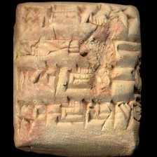 model input (224x224)  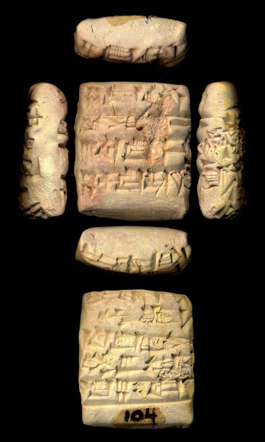 full photo (reference)</td><td valign="top"><table><tr><th>#</th><th>face</th><th>cuneiform</th><th>transliteration</th><th>translation</th></tr><tr><td>1</td><td>obverse</td><td>𒐉 𒂅 𒆬 𒌓</td><td>4(disz) gin2 ku3-babbar</td><td>&mdash;</td></tr><tr><td>2</td><td>obverse</td><td>𒇽 𒊭 𒅆</td><td>lu2-sza-lim</td><td>&mdash;</td></tr><tr><td>3</td><td>obverse</td><td>𒐈 𒑛 𒂅 𒉿 𒊒</td><td>3(disz) 2/3(disz) gin2 wu-ru</td><td>&mdash;</td></tr><tr><td>4</td><td>obverse</td><td>𒐊 𒈦 𒂅 𒌨 𒌋𒌓𒆤 𒃻</td><td>5(disz) 1/2(disz) gin2 ur-nigar</td><td>&mdash;</td></tr><tr><td>1</td><td>reverse</td><td>𒌉 𒅤𒊭 𒂗 𒆤</td><td>dumu puzur4-en-lil2</td><td>&mdash;</td></tr><tr><td>2</td><td>reverse</td><td>𒁹 𒑛 𒂅 𒈗 𒃶 𒅅 𒀜 𒁕 𒈗 𒀉 𒍣 𒁕</td><td>1(disz) 2/3(disz) gin2 lugal-he2-gal2 ad-da lugal-a2-zi-da</td><td>&mdash;</td></tr><tr><td>3</td><td>reverse</td><td>𒈦 𒂅 𒐊 𒊺 𒊕 𒋻</td><td>1/2(disz) gin2 5(disz) sze sag-ku5</td><td>&mdash;</td></tr></table></td></tr></table>

**Original text (transliteration):**
> 4diš gin₂ ku₃ - babbar lu₂ - ša - lim 3diš 2 / 3diš gin₂ wu - ru 5diš 1 / 2diš gin₂ ur - nigar gar dumu puzur₄ - D en - lil₂ 1diš 2 / 3diš gin₂ lugal - he₂ - gal₂ ad - da lugal - a₂ - zi - da 1 / 2diš gin₂ 5diš še sag - ku₅

**Cuneiform (Unicode signs, whole document, not position-aligned to the text above):**
> 𒐉 𒂆 𒆬 𒌓 𒇽 𒊭 𒅆 𒐈 𒂆 𒉿 𒊒 𒐊 𒈦 𒂆 𒌨 𒌋𒌓𒆤 𒃻 𒌉 𒅤𒊭 <D> 𒂗 𒆤 𒁹 𒂆 𒈗 𒃶 𒅅 𒀜 𒁕 𒈗 𒀉 𒍣 𒁕 𒈦 𒂆 𒐊 𒊺 𒊕 𒋻

**Masked input (12 positions):**
> <strong>?</strong> gin₂ ku <strong>?</strong> - babbar lu₂ <strong>?</strong> ša - lim 3diš 2 / 3diš gin₂ <strong>?</strong> <strong>?</strong> - ru 5diš 1 / 2diš <strong>?</strong>₂ ur - nigar gar dumu <strong>?</strong>zur₄ - D en <strong>?</strong> lil₂ 1diš 2 / 3diš gin <strong>?</strong> lugal - he₂ - gal₂ ad - <strong>?</strong> lugal - a₂ - zi - da 1 / 2diš gin <strong>?</strong> 5diš <strong>?</strong> sag - ku₅

### Restoration (masked-token predictions)

| # | true token | text-only top-1 | text-only top-3 | vision top-1 | vision top-3 | text-only correct | vision correct |
|---|---|---|---|---|---|---|---|
| 1 | `4diš` | `1diš` | `1diš`, `5diš`, `2diš` | `1diš` | `1diš`, `2diš`, `5diš` | ❌ | ❌ |
| 2 | `##₃` | `##₃` | `##₃`, `##g`, `##š` | `##₃` | `##₃`, `##₆`, `##g` | ✅ | ✅ |
| 3 | `-` | `-` | `-`, `:`, `D` | `-` | `-`, `D`, `:` | ✅ | ✅ |
| 4 | `w` | `u` | `u`, `gab`, `ša` | `bu` | `bu`, `u`, `gab` | ❌ | ❌ |
| 5 | `##u` | `##₃` | `##₃`, `##₂`, `##a` | `##₃` | `##₃`, `##₂`, `##a` | ❌ | ❌ |
| 6 | `gin` | `gin` | `gin`, `la`, `maš` | `gin` | `gin`, `la`, `šum` | ✅ | ✅ |
| 7 | `pu` | `pu` | `pu`, `mu`, `di` | `pu` | `pu`, `mu`, `bu` | ✅ | ✅ |
| 8 | `-` | `-` | `-`, `:`, `.` | `-` | `-`, `:`, `.` | ✅ | ✅ |
| 9 | `##₂` | `##₂` | `##₂`, `##₃`, `-` | `##₂` | `##₂`, `##₃`, `##₁` | ✅ | ✅ |
| 10 | `da` | `da` | `da`, `mu`, `ga` | `da` | `da`, `mu`, `di` | ✅ | ✅ |
| 11 | `##₂` | `##₂` | `##₂`, `##₃`, `-` | `##₂` | `##₂`, `##₃`, `-` | ✅ | ✅ |
| 12 | `še` | `še` | `še`, `udu`, `sar` | `še` | `še`, `udu`, `sar` | ✅ | ✅ |

Top-1 accuracy on this example: text-only 9/12 (75%), vision 9/12 (75%)

### Metadata predictions

| head | ground truth | text-only prediction | vision prediction |
|---|---|---|---|
| period | Ur III | Ur III (0.94) | Ur III (0.92) |
| genre | Administrative | Administrative (0.92) | Administrative (0.93) |
| language | Sumerian | Sumerian (0.93) | Sumerian (0.92) |
| provenience | Nippur | Umma (0.65) | Umma (0.61) |

---

## Example 12 — `P399604` (has photo: True)

*Gilgamesh fragment -- Neo-Assyrian -- The British Museum*

<table><tr><td valign="top" width="240">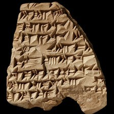 model input (224x224)  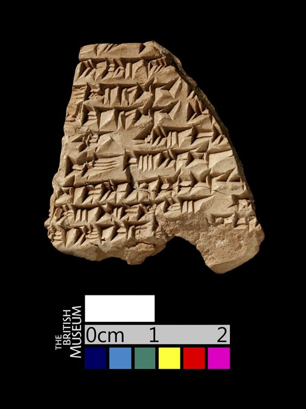 full photo (reference)</td><td valign="top"><table><tr><th>#</th><th>face</th><th>cuneiform</th><th>transliteration</th><th>translation</th></tr><tr><td>1'</td><td>default</td><td>𒈨𒌍 x</td><td>... x-MEŠ x ...</td><td>&mdash;</td></tr><tr><td>2'</td><td>default</td><td></td><td>... NIN.DINGIR.RA.MEŠ ...</td><td>&mdash;</td></tr><tr><td>3'</td><td>default</td><td>𒁕 𒀀 𒋾 x</td><td>... qa-aš₂-da-a-ti x ...</td><td>&mdash;</td></tr><tr><td>4'</td><td>default</td><td>𒄠 𒈠 𒀀 𒋾</td><td>...-am-ma-a-ti ba-...</td><td>&mdash;</td></tr><tr><td>5'</td><td>default</td><td>𒆠 𒄴 𒑊</td><td>...-ki uh-tab-ba-...</td><td>&mdash;</td></tr><tr><td>6'</td><td>default</td><td>𒌈</td><td>...-tu₄ E₂.AN.NA ...</td><td>&mdash;</td></tr><tr><td>7'</td><td>default</td><td>𒈾 𒉺 𒀭 𒄷 𒌒 𒋾 x</td><td>... a/i-na pa-an hu-ub-ti x ...</td><td>&mdash;</td></tr><tr><td>8'</td><td>default</td><td>x 𒋫 𒊕 𒆪 𒋫 š</td><td>... x ta-sak-ku-ta šal-...</td><td>&mdash;</td></tr><tr><td>9'</td><td>default</td><td>𒌅 𒌦 𒄷 𒌋</td><td>...-at-tu-un pa-an hu-ub-ti ...</td><td>&mdash;</td></tr></table></td></tr></table>

**Original text (transliteration):**
> <strong>...</strong> <strong>x</strong> - MEŠ <strong>x</strong> <strong>...</strong> <strong>...</strong> NIN. DINGIR. RA. MEŠ <strong>...</strong> <strong>...</strong> qa - aš₂ - da - a - ti <strong>x</strong> <strong>...</strong> <strong>...</strong> - am - ma - a - ti ba - <strong>...</strong> <strong>...</strong> - ki uh - tab - ba - <strong>...</strong> <strong>...</strong> - tu₄ E₂. AN. NA <strong>...</strong> <strong>...</strong> a / i - na pa - an hu - ub - ti <strong>x</strong> <strong>...</strong> <strong>...</strong> <strong>x</strong> ta - sak - ku - ta šal - <strong>...</strong> <strong>...</strong> - at - tu - un pa - an hu - ub - ti <strong>...</strong>

**Cuneiform (Unicode signs, whole document, not position-aligned to the text above):**
> 𒈨𒌍 x 𒁕 𒀀 𒋾 x 𒄠 𒈠 𒀀 𒋾 𒆠 𒄴 𒑊 𒌈 𒈾 𒉺 𒀭 𒄷 𒌒 𒋾 x x 𒋫 𒊕 𒆪 𒋫 š 𒌅 𒌦 𒄷 𒌋

**Masked input (14 positions):**
> <strong>...</strong> <strong>x</strong> - MEŠ <strong>x</strong> <strong>...</strong> <strong>...</strong> NIN. DINGIR. RA. MEŠ <strong>...</strong> <strong>...</strong> q <strong>?</strong> - aš <strong>?</strong> - da - a - ti <strong>x</strong> <strong>...</strong> <strong>...</strong> - am <strong>?</strong> ma - a <strong>?</strong> ti <strong>?</strong> - <strong>...</strong> <strong>...</strong> - ki uh - tab - ba - <strong>...</strong> <strong>...</strong> - tu₄ E₂ <strong>?</strong> AN. NA <strong>...</strong> <strong>...</strong> a / i - na pa - an hu <strong>?</strong> ub - ti <strong>x</strong> <strong>...</strong> <strong>...</strong> <strong>x</strong> <strong>?</strong> - sa <strong>?</strong> - <strong>?</strong> - <strong>?</strong> šal - <strong>...</strong> <strong>...</strong> - at - tu <strong>?</strong> <strong>?</strong> pa - an <strong>?</strong> - ub - ti <strong>...</strong>

### Restoration (masked-token predictions)

| # | true token | text-only top-1 | text-only top-3 | vision top-1 | vision top-3 | text-only correct | vision correct |
|---|---|---|---|---|---|---|---|
| 1 | `##a` | `##a` | `##a`, `##ar`, `##i` | `##a` | `##a`, `##i`, `##ar` | ✅ | ✅ |
| 2 | `##₂` | `##₂` | `##₂`, `##₃`, `##₈` | `##₂` | `##₂`, `##₃`, `##a` | ✅ | ✅ |
| 3 | `-` | `-` | `-`, `##₃`, `/` | `-` | `-`, `.`, `##₂` | ✅ | ✅ |
| 4 | `-` | `-` | `-`, `.`, `/` | `-` | `-`, `.`, `:` | ✅ | ✅ |
| 5 | `ba` | `a` | `a`, `i`, `ma` | `a` | `a`, `i`, `ma` | ❌ | ❌ |
| 6 | `.` | `.` | `.`, `-`, `30` | `.` | `.`, `-`, `u` | ✅ | ✅ |
| 7 | `-` | `-` | `-`, `.`, `:` | `-` | `-`, `:`, `.` | ✅ | ✅ |
| 8 | `ta` | `a` | `a`, `i`, `ma` | `a` | `a`, `i`, `ma` | ❌ | ❌ |
| 9 | `##k` | `##₃` | `##₃`, `##₂`, `##k` | `##₃` | `##₃`, `##₂`, `##k` | ❌ | ❌ |
| 10 | `ku` | `a` | `a`, `ra`, `ri` | `a` | `a`, `ra`, `ri` | ❌ | ❌ |
| 11 | `ta` | `ti` | `ti`, `ma`, `ni` | `ti` | `ti`, `ni`, `a` | ❌ | ❌ |
| 12 | `-` | `##₄` | `##₄`, `-`, `##₂` | `##₄` | `##₄`, `-`, `##₂` | ❌ | ❌ |
| 13 | `un` | `ina` | `ina`, `ša`, `na` | `ina` | `ina`, `na`, `ša` | ❌ | ❌ |
| 14 | `hu` | `hu` | `hu`, `ha`, `##hu` | `hu` | `hu`, `ha`, `nu` | ✅ | ✅ |

Top-1 accuracy on this example: text-only 7/14 (50%), vision 7/14 (50%)

### Metadata predictions

| head | ground truth | text-only prediction | vision prediction |
|---|---|---|---|
| period | Neo-Assyrian | Neo-Assyrian (0.54) | Neo-Assyrian (0.81) |
| genre | (no label) | Royal Inscriptions (0.89) | Royal Inscriptions (0.73) |
| language | Akkadian | Akkadian (0.98) | Akkadian (0.94) |
| provenience | Nineveh | Nineveh (0.64) | Nineveh (0.72) |

---

## Example 13 — `oracc:cdli:P108649` (has photo: False)

**Original text (transliteration):**
> 4gešʾu 5geš₂ 2u 6aš 1barig 4ban₂ še gur lugal 1aš 3barig 3ban₂ gu₂ - gal - gal gur 3barig še - lu₂ 5geš₂ ŠIM saga 2gešʾu 2geš₂ 4u la₂ 2diš ŠIM du nig₂ - gur₁₁ al - la - kam 1gešʾu 2geš₂ 5u 8aš 5ban₂ gur 1gešʾu 5geš₂ la₂ 2diš ŠIM du 3geš₂ 3u la₂ 3diš ŠIM du₈ e₂ - ta e₃ - a - am₃ geme₂ ARAD₂ al - la - ke₄ - ne 1geš₂ 3u 8aš 2barig še gur ur - mes di - ku₅ 1geš₂ 3u 5aš 4barig 1ban₂ gur šar - ru - um - i₃ - li₂ 4u 7aš gur lu₂ - nanna nar 1gešʾu 3u 1aš 4barig gur zi - ga nigin - ba ša₃ še bala - a - ta ša₃ e₂ - nam - du - du šunigin 1šar₂ 1gešʾu 2geš₂ 5u 7aš 2barig 4ban₂ še gur šunigin 1aš 3barig 3ban₂ gu₂ - gal - gal gur šunigin 3barig še - lu₂ šunigin 5geš₂ ŠIM saga šunigin 3gešʾu 7geš₂ 3u 5diš ŠIM du šunigin 3geš₂ 3u la₂ 3diš ŠIM du₈ nig₂ - gal₂ - la al - la nar e₂ - nam - du - du ša₃ - bi - ta 1gešʾu 3u 1aš 4barig gur zi - ga ša₃ še bala - a - ta giri₃ i - di₃ - li₂ mu us₂ - sa e₂ puzur₄ - iš - da - gan ba - du₃ gaba - ri lu₂ - <strong>x</strong> - <strong>x</strong> - <strong>x</strong>

**Masked input (57 positions):**
> 4gešʾu 5geš₂ 2u 6aš 1barig 4ban₂ <strong>?</strong> gur lugal 1aš 3barig 3ban₂ <strong>?</strong>₂ - gal <strong>?</strong> <strong>?</strong> gur 3barig še - lu₂ 5 <strong>?</strong> <strong>?</strong> ŠIM saga 2gešʾu 2geš₂ 4u <strong>?</strong>₂ 2diš <strong>?</strong>IM du <strong>?</strong> <strong>?</strong> - <strong>?</strong>₁₁ al - la - kam 1gešʾu 2geš₂ 5 <strong>?</strong> 8 <strong>?</strong> 5ban₂ <strong>?</strong> <strong>?</strong>ʾu 5geš₂ la₂ 2diš <strong>?</strong> <strong>?</strong> du 3geš₂ 3u la₂ <strong>?</strong> Š <strong>?</strong> <strong>?</strong>₈ e₂ <strong>?</strong> <strong>?</strong> e₃ <strong>?</strong> a <strong>?</strong> am₃ ge <strong>?</strong> <strong>?</strong> ARAD <strong>?</strong> <strong>?</strong> - la - ke₄ - <strong>?</strong> 1geš₂ 3u 8aš 2barig še gur ur - mes <strong>?</strong> - ku₅ <strong>?</strong>₂ 3u 5aš 4barig 1ban₂ gur šar - ru - um - i₃ - li₂ <strong>?</strong>u 7aš gur <strong>?</strong>₂ - nanna nar 1gešʾu 3u 1aš 4barig gur zi <strong>?</strong> ga nigin - ba ša <strong>?</strong> še bala - a - ta ša₃ e₂ - nam - du - du šunig <strong>?</strong> 1ša <strong>?</strong>₂ 1gešʾu 2geš₂ <strong>?</strong> <strong>?</strong> 7aš 2 <strong>?</strong> 4ban₂ še <strong>?</strong> šunigin 1aš 3barig 3ban₂ <strong>?</strong> <strong>?</strong> - gal - gal gur <strong>?</strong>nigin 3barig še <strong>?</strong> lu₂ šunigin 5geš₂ <strong>?</strong>IM saga šunigin 3gešʾu 7geš <strong>?</strong> 3u 5diš ŠIM du šunigin 3geš₂ 3u la₂ 3diš ŠIM du₈ nig <strong>?</strong> - gal <strong>?</strong> - la al <strong>?</strong> la nar e₂ - nam - du <strong>?</strong> du ša <strong>?</strong> - bi - ta 1gešʾu 3u 1aš 4barig gur zi - <strong>?</strong> ša₃ še bala - a - ta giri₃ i - <strong>?</strong>₃ - <strong>?</strong>₂ mu us <strong>?</strong> - sa e₂ puzur₄ - iš - da - gan ba - du₃ gab <strong>?</strong> - ri lu₂ - <strong>x</strong> - <strong>x</strong> - <strong>x</strong>

### Restoration (masked-token predictions)

| # | true token | text-only top-1 | text-only top-3 | vision top-1 | vision top-3 | text-only correct | vision correct |
|---|---|---|---|---|---|---|---|
| 1 | `še` | `še` | `še`, `kaš`, `ninda` | `še` | `še`, `kaš`, `ninda` | ✅ | ✅ |
| 2 | `gu` | `nig` | `nig`, `e`, `GAN` | `nig` | `nig`, `e`, `gu` | ❌ | ❌ |
| 3 | `-` | `-` | `-`, `##₂`, `##₁` | `-` | `-`, `##₂`, `:` | ✅ | ✅ |
| 4 | `gal` | `gal` | `gal`, `tur`, `ta` | `gal` | `gal`, `la`, `tur` | ✅ | ✅ |
| 5 | `##geš` | `##geš` | `##geš`, `##u`, `##aš` | `##geš` | `##geš`, `##u`, `##aš` | ✅ | ✅ |
| 6 | `##₂` | `##₂` | `##₂`, `3diš`, `2diš` | `##₂` | `##₂`, `6diš`, `5diš` | ✅ | ✅ |
| 7 | `la` | `la` | `la`, `1geš`, `1ban` | `la` | `la`, `1geš`, `gin` | ✅ | ✅ |
| 8 | `Š` | `Š` | `Š`, `š`, `T` | `Š` | `Š`, `š`, `T` | ✅ | ✅ |
| 9 | `nig` | `sa` | `sa`, `nig`, `su` | `sa` | `sa`, `nig`, `e` | ❌ | ❌ |
| 10 | `##₂` | `##₂` | `##₂`, `##₃`, `a` | `##₂` | `##₂`, `##₃`, `ki` | ✅ | ✅ |
| 11 | `gur` | `du` | `du`, `gur`, `sag` | `du` | `du`, `gur`, `sag` | ❌ | ❌ |
| 12 | `##u` | `##u` | `##u`, `##aš`, `##geš` | `##u` | `##u`, `##aš`, `##a` | ✅ | ✅ |
| 13 | `##aš` | `##aš` | `##aš`, `##diš`, `##barig` | `##aš` | `##aš`, `##diš`, `##barig` | ✅ | ✅ |
| 14 | `gur` | `gur` | `gur`, `še`, `2` | `gur` | `gur`, `še`, `2` | ✅ | ✅ |
| 15 | `1geš` | `1geš` | `1geš`, `##geš`, `##r` | `1geš` | `1geš`, `##geš`, `##r` | ✅ | ✅ |
| 16 | `Š` | `Š` | `Š`, `š`, `še` | `Š` | `Š`, `š`, `še` | ✅ | ✅ |
| 17 | `##IM` | `##IM` | `##IM`, `##₃`, `##₂` | `##IM` | `##IM`, `##₃`, `##₂` | ✅ | ✅ |
| 18 | `3diš` | `2diš` | `2diš`, `3diš`, `1diš` | `2diš` | `2diš`, `3diš`, `1diš` | ❌ | ❌ |
| 19 | `##IM` | `##IM` | `##IM`, `##I`, `##ID` | `##IM` | `##IM`, `##ID`, `##I` | ✅ | ✅ |
| 20 | `du` | `du` | `du`, `u`, `gu` | `du` | `du`, `u`, `gu` | ✅ | ✅ |
| 21 | `-` | `-` | `-`, `a`, `ta` | `-` | `-`, `a`, `gu` | ✅ | ✅ |
| 22 | `ta` | `ta` | `ta`, `-`, `a` | `ta` | `ta`, `-`, `a` | ✅ | ✅ |
| 23 | `-` | `-` | `-`, `:`, `ki` | `-` | `-`, `še`, `:` | ✅ | ✅ |
| 24 | `-` | `-` | `-`, `:`, `še` | `-` | `-`, `še`, `:` | ✅ | ✅ |
| 25 | `##me` | `##me` | `##me`, `##₆`, `##₄` | `##me` | `##me`, `##₆`, `##š` | ✅ | ✅ |
| 26 | `##₂` | `##₂` | `##₂`, `##₃`, `-` | `##₂` | `##₂`, `##₃`, `-` | ✅ | ✅ |
| 27 | `##₂` | `##₂` | `##₂`, `##2`, `-` | `##₂` | `##₂`, `##2`, `-` | ✅ | ✅ |
| 28 | `al` | `al` | `al`, `gu`, `kal` | `al` | `al`, `kal`, `gu` | ✅ | ✅ |
| 29 | `ne` | `ne` | `ne`, `zu`, `si` | `ne` | `ne`, `zu`, `si` | ✅ | ✅ |
| 30 | `di` | `di` | `di`, `šu`, `amar` | `di` | `di`, `šu`, `ba` | ✅ | ✅ |
| 31 | `1geš` | `1geš` | `1geš`, `##geš`, `GAN` | `1geš` | `1geš`, `##geš`, `GAN` | ✅ | ✅ |
| 32 | `4` | `4` | `4`, `5`, `6` | `4` | `4`, `5`, `6` | ✅ | ✅ |
| 33 | `lu` | `lu` | `lu`, `nig`, `e` | `lu` | `lu`, `nig`, `e` | ✅ | ✅ |
| 34 | `-` | `-` | `-`, `##₃`, `:` | `-` | `-`, `##₃`, `##₂` | ✅ | ✅ |
| 35 | `##₃` | `##₃` | `##₃`, `##bra`, `##₂` | `##₃` | `##₃`, `##bra`, `##₂` | ✅ | ✅ |
| 36 | `##in` | `##in` | `##in`, `##n`, `##i` | `##in` | `##in`, `##n`, `##IN` | ✅ | ✅ |
| 37 | `##r` | `##r` | `##r`, `##m`, `##n` | `##r` | `##r`, `##m`, `##n` | ✅ | ✅ |
| 38 | `5` | `5` | `5`, `4`, `3u` | `5` | `5`, `4`, `1geš` | ✅ | ✅ |
| 39 | `##u` | `##u` | `##u`, `2u`, `1u` | `##u` | `##u`, `3u`, `##₂` | ✅ | ✅ |
| 40 | `##barig` | `##barig` | `##barig`, `1barig`, `##ban` | `##barig` | `##barig`, `1barig`, `##₂` | ✅ | ✅ |
| 41 | `gur` | `gur` | `gur`, `lugal`, `du` | `gur` | `gur`, `lugal`, `1barig` | ✅ | ✅ |
| 42 | `gu` | `nig` | `nig`, `e`, `GAN` | `e` | `e`, `nig`, `maš` | ❌ | ❌ |
| 43 | `##₂` | `##₂` | `##₂`, `##₃`, `##a` | `##₂` | `##₂`, `##₃`, `##2` | ✅ | ✅ |
| 44 | `šu` | `šu` | `šu`, `ši`, `aš` | `šu` | `šu`, `dumu`, `ša` | ✅ | ✅ |
| 45 | `-` | `-` | `-`, `:`, `+` | `-` | `-`, `##₃`, `:` | ✅ | ✅ |
| 46 | `Š` | `Š` | `Š`, `š`, `T` | `Š` | `Š`, `š`, `T` | ✅ | ✅ |
| 47 | `##₂` | `##₂` | `##₂`, `##₃`, `'` | `##₂` | `##₂`, `##₃`, `'` | ✅ | ✅ |
| 48 | `##₂` | `##₂` | `##₂`, `##a`, `##₃` | `##₂` | `##₂`, `##a`, `##₃` | ✅ | ✅ |
| 49 | `##₂` | `##₂` | `##₂`, `##₅`, `##₃` | `##₂` | `##₂`, `##₅`, `gu` | ✅ | ✅ |
| 50 | `-` | `-` | `-`, `:`, `.` | `-` | `-`, `:`, `.` | ✅ | ✅ |
| 51 | `-` | `-` | `-`, `##₃`, `.` | `-` | `-`, `##₃`, `.` | ✅ | ✅ |
| 52 | `##₃` | `##₃` | `##₃`, `##bra`, `##₂` | `##₃` | `##₃`, `##bra`, `##₂` | ✅ | ✅ |
| 53 | `ga` | `ga` | `ga`, `ge`, `ba` | `ga` | `ga`, `ba`, `da` | ✅ | ✅ |
| 54 | `di` | `di` | `di`, `i`, `bu` | `di` | `di`, `i`, `ša` | ✅ | ✅ |
| 55 | `li` | `li` | `li`, `num`, `gal` | `li` | `li`, `šum`, `la` | ✅ | ✅ |
| 56 | `##₂` | `##₂` | `##₂`, `##₃`, `##2` | `##₂` | `##₂`, `##₃`, `##2` | ✅ | ✅ |
| 57 | `##a` | `##a` | `##a`, `##₂`, `##ar` | `##a` | `##a`, `##₂`, `##i` | ✅ | ✅ |

Top-1 accuracy on this example: text-only 52/57 (91%), vision 52/57 (91%)

### Metadata predictions

| head | ground truth | text-only prediction | vision prediction |
|---|---|---|---|
| period | (no label) | Ur III (0.93) | Ur III (0.92) |
| genre | (no label) | Administrative (0.91) | Administrative (0.93) |
| language | (no label) | Sumerian (0.94) | Sumerian (0.94) |
| provenience | (no label) | Girsu (0.89) | Girsu (0.58) |

---

## Example 14 — `P113862` (has photo: True)

*MVN 03, 302 -- Administrative, Ur III, Puzriš-Dagan (mod. Drehem) -- Free Library of Philadelphia, Philadelphia, Pennsylvania, USA -- published in The John Frederick Lewis Collection (Owen, 1975)*

<table><tr><td valign="top" width="240">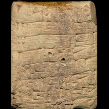 model input (224x224)  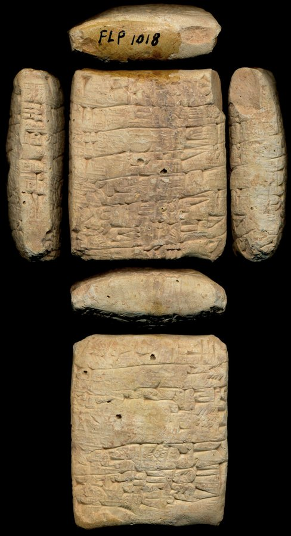 full photo (reference)</td><td valign="top"><table><tr><th>#</th><th>face</th><th>cuneiform</th><th>transliteration</th><th>translation</th></tr><tr><td>1</td><td>obverse</td><td>𒁹 𒈧 𒃲 𒊺 𒐈 𒄭𒁁</td><td>1(disz) masz2-gal niga 3(disz)-kam us2</td><td>&mdash;</td></tr><tr><td>2</td><td>obverse</td><td>𒁹 𒇻 𒀀 𒈝 𒊺</td><td>2(disz) udu a-lum niga</td><td>&mdash;</td></tr><tr><td>3</td><td>obverse</td><td>𒐊 𒃢</td><td>5(disz) sila4</td><td>&mdash;</td></tr><tr><td>4</td><td>obverse</td><td>𒁹 𒀫 𒈦 𒆕 𒊩</td><td>1(disz) amar masz-da3-munus</td><td>&mdash;</td></tr><tr><td>5</td><td>obverse</td><td>𒊩𒆳 𒂗 𒆤 𒇲</td><td>geme2-en-lil2-la2</td><td>&mdash;</td></tr><tr><td>6</td><td>obverse</td><td>𒃻 𒆪 𒀀 𒋗𒉀 𒀀 𒌓 𒈿 𒀀 𒅗 𒉌</td><td>nig2-dab5 a tu5-a u4-nu2-a-ka-ni</td><td>&mdash;</td></tr><tr><td>7</td><td>obverse</td><td>𒌓 𒌋 𒐌 𒄭𒁁</td><td>u4 2(u) 7(disz)-kam</td><td>&mdash;</td></tr><tr><td>1</td><td>reverse</td><td>𒆠 𒅔 𒋫 𒌓𒁺 𒀀 𒋫</td><td>ki in-ta-e3-a-ta</td><td>&mdash;</td></tr><tr><td>2</td><td>reverse</td><td>𒈗 𒄨 𒂵</td><td>lugal kal-ga</td><td>&mdash;</td></tr><tr><td>3</td><td>reverse</td><td>𒄊 𒌶𒆠 𒈠 𒁀 𒁾 𒊬</td><td>giri3 nanna-ma-ba dub-sar</td><td>&mdash;</td></tr><tr><td>4</td><td>reverse</td><td>𒈗 𒀭 𒌒 𒁕 𒇹 𒁀</td><td>lugal an-ub-da limmu2-ba</td><td>&mdash;</td></tr><tr><td>5</td><td>reverse</td><td>𒈬 𒄿 𒉈 𒂗𒍪 𒈗</td><td>mu i-bi2-suen lugal</td><td>&mdash;</td></tr></table></td></tr></table>

**Original text (transliteration):**
> 1diš maš₂ - gal niga 3diš - kam us₂ 2diš udu a - lum niga 5diš sila₄ 1diš amar maš - da₃ - munus geme₂ - en - lil₂ - la₂ nig₂ - dab₅ a tu₅ - a u₄ - nu₂ - a - ka - ni u₄ 2u 7diš - kam ki in - ta - e₃ - a - ta ba - zi giri₃ nanna - ma - ba dub - sar iti a₂ - ki - ti mu i - bi₂ - suen lugal šu - suen lugal kal - ga lugal uri₅ - ma lugal an - ub - da limmu₂ - ba nanna - ma - ba dub - sar dumu u₂ - na - ab - še - en₆ ARAD2 - zu

**Cuneiform (Unicode signs, whole document, not position-aligned to the text above):**
> 𒁹 𒈧 𒃲 𒊺 𒐈 𒄭𒁁 𒁹 𒇻 𒀀 𒈝 𒊺 𒐊 𒃢 𒁹 𒀫 𒈦 𒆕 𒊩 𒊩𒆳 𒂗 𒆤 𒇲 𒃻 𒆪 𒀀 𒋗𒉀 𒀀 𒌓 𒈿 𒀀 𒅗 𒉌 𒌓 𒌋 𒐌 𒄭𒁁 𒆠 𒅔 𒋫 𒌓𒁺 𒀀 𒋫 𒁀 𒍣 𒄊 𒌶𒆠 𒈠 𒁀 𒁾 𒊬 𒌚 𒀉 𒆠 𒋾 𒈬 𒄿 𒉈 𒂗𒍪 𒈗 𒋗 𒂗𒍪 𒈗 𒄨 𒂵 𒈗 𒋀𒀊 𒆠 𒈠 𒈗 𒀭 𒌒 𒁕 𒇹 𒁀 𒁾 𒊬 𒌉 𒌑 𒈾 𒊺 𒀵 𒍪

**Masked input (24 positions):**
> 1diš maš₂ - gal niga 3diš <strong>?</strong> kam us₂ 2diš udu a <strong>?</strong> lum niga 5diš sila₄ 1diš amar maš - da <strong>?</strong> - munus <strong>?</strong>me <strong>?</strong> - en - lil <strong>?</strong> - la <strong>?</strong> nig₂ - dab₅ <strong>?</strong> tu <strong>?</strong> - a u₄ <strong>?</strong> nu₂ - a - ka - ni u₄ 2u 7 <strong>?</strong> - <strong>?</strong> ki in - <strong>?</strong> - e₃ - a - ta ba - <strong>?</strong> giri <strong>?</strong> nanna - <strong>?</strong> - ba dub <strong>?</strong> sar iti a <strong>?</strong> - ki - ti mu i - <strong>?</strong>₂ - suen lugal šu - suen lugal kal <strong>?</strong> ga <strong>?</strong> uri₅ - ma lugal an - ub - da limmu₂ - ba nanna - ma - ba dub - <strong>?</strong> dumu u₂ - na - ab - še - en₆ AR <strong>?</strong> <strong>?</strong> - zu

### Restoration (masked-token predictions)

| # | true token | text-only top-1 | text-only top-3 | vision top-1 | vision top-3 | text-only correct | vision correct |
|---|---|---|---|---|---|---|---|
| 1 | `-` | `-` | `-`, `.`, `:` | `-` | `-`, `##₂`, `.` | ✅ | ✅ |
| 2 | `-` | `-` | `-`, `##₂`, `:` | `-` | `-`, `##₂`, `:` | ✅ | ✅ |
| 3 | `##₃` | `##₃` | `##₃`, `##₂`, `##₇` | `##₃` | `##₃`, `##₂`, `##₄` | ✅ | ✅ |
| 4 | `ge` | `ge` | `ge`, `re`, `di` | `ge` | `ge`, `ke`, `re` | ✅ | ✅ |
| 5 | `##₂` | `##₂` | `##₂`, `##₃`, `##₆` | `##₂` | `##₂`, `##₃`, `##₄` | ✅ | ✅ |
| 6 | `##₂` | `##₂` | `##₂`, `##₄`, `##₅` | `##₂` | `##₂`, `##₄`, `##₅` | ✅ | ✅ |
| 7 | `##₂` | `##₂` | `##₂`, `##m`, `-` | `##₂` | `##₂`, `##m`, `-` | ✅ | ✅ |
| 8 | `a` | `-` | `-`, `še`, `geš` | `-` | `-`, `geš`, `a` | ❌ | ❌ |
| 9 | `##₅` | `##š` | `##š`, `##ku`, `##₅` | `##š` | `##š`, `##₅`, `##ku` | ❌ | ❌ |
| 10 | `-` | `-` | `-`, `udu`, `še` | `-` | `-`, `udu`, `geš` | ✅ | ✅ |
| 11 | `##diš` | `##diš` | `##diš`, `##aš`, `##geš` | `##diš` | `##diš`, `##aš`, `##geš` | ✅ | ✅ |
| 12 | `kam` | `kam` | `kam`, `ta`, `zal` | `kam` | `kam`, `zal`, `ta` | ✅ | ✅ |
| 13 | `ta` | `ta` | `ta`, `pa`, `na` | `ta` | `ta`, `u`, `ši` | ✅ | ✅ |
| 14 | `zi` | `zi` | `zi`, `ti`, `zal` | `zi` | `zi`, `ti`, `na` | ✅ | ✅ |
| 15 | `##₃` | `##₃` | `##₃`, `##₄`, `##₂` | `##₃` | `##₃`, `##₄`, `##š` | ✅ | ✅ |
| 16 | `ma` | `ma` | `ma`, `a`, `na` | `ma` | `ma`, `a`, `na` | ✅ | ✅ |
| 17 | `-` | `-` | `-`, `.`, `+` | `-` | `-`, `.`, `+` | ✅ | ✅ |
| 18 | `##₂` | `##₂` | `##₂`, `##₃`, `##₄` | `##₂` | `##₂`, `##₃`, `##₄` | ✅ | ✅ |
| 19 | `bi` | `bi` | `bi`, `ur`, `di` | `bi` | `bi`, `ur`, `di` | ✅ | ✅ |
| 20 | `-` | `-` | `-`, `:`, `.` | `-` | `-`, `:`, `.` | ✅ | ✅ |
| 21 | `lugal` | `lugal` | `lugal`, `dumu`, `suen` | `lugal` | `lugal`, `dumu`, `igi` | ✅ | ✅ |
| 22 | `sar` | `sar` | `sar`, `dumu`, `suen` | `sar` | `sar`, `dumu`, `6diš` | ✅ | ✅ |
| 23 | `##AD` | `##AD` | `##AD`, `##D`, `##A` | `##AD` | `##AD`, `##D`, `##AG` | ✅ | ✅ |
| 24 | `##2` | `##₂` | `##₂`, `##2`, `##₅` | `##₂` | `##₂`, `##2`, `##₄` | ❌ | ❌ |

Top-1 accuracy on this example: text-only 21/24 (88%), vision 21/24 (88%)

### Metadata predictions

| head | ground truth | text-only prediction | vision prediction |
|---|---|---|---|
| period | Ur III | Ur III (0.92) | Ur III (0.94) |
| genre | Administrative | Administrative (0.68) | Administrative (0.68) |
| language | Sumerian | Sumerian (0.93) | Sumerian (0.95) |
| provenience | Puzriš-Dagan | Puzriš-Dagan (0.94) | Puzriš-Dagan (0.90) |

---

## Example 15 — `P100813` (has photo: True)

*Aleppo 481 -- Administrative, Ur III, Umma (mod. Tell Jokha) -- National Museum of Syria, Aleppo, Syria -- published in L'Administration palatiale à l'époque de la troisième dynastie d'Ur: Textes inédits du Musée d'Alep., Thèse de doctorat de troisième cycle soutenue à l'Université de Tours (Touzalin, 1982)*

<table><tr><td valign="top" width="240">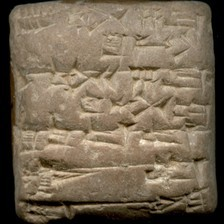 model input (224x224)  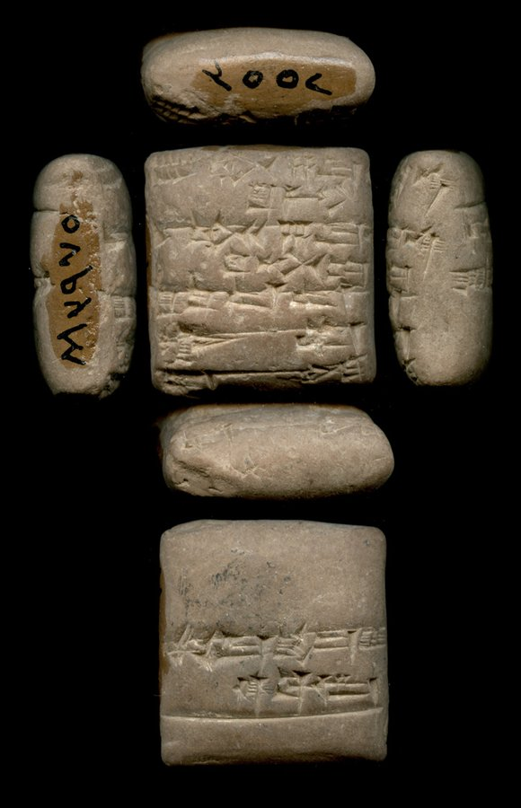 full photo (reference)</td><td valign="top"><table><tr><th>#</th><th>face</th><th>cuneiform</th><th>transliteration</th><th>translation</th></tr><tr><td>1</td><td>obverse</td><td>𒐇 𒄘 𒌋 𒐉 𒈠 𒈾 𒋠 𒄀</td><td>9(asz) gu2 1(u) 4(disz) ma-na siki-gi</td><td>&mdash;</td></tr><tr><td>2</td><td>obverse</td><td>𒀸 𒄘 𒌋 𒐌 𒈠 𒈾 𒋠 𒄈 𒄢</td><td>1(asz) gu2 2(u) 7(disz) ma-na siki gir2-gul</td><td>&mdash;</td></tr><tr><td>3</td><td>obverse</td><td>𒋠 𒇻 𒁺𒁺</td><td>siki udu-lah5</td><td>&mdash;</td></tr><tr><td>4</td><td>obverse</td><td>𒄊 𒁽</td><td>giri3 kas4</td><td>&mdash;</td></tr><tr><td>5</td><td>obverse</td><td>𒁽 𒉌 𒆪</td><td>kas4 i3-dab5</td><td>&mdash;</td></tr><tr><td>1</td><td>reverse</td><td>𒈬 𒌨 𒉈 𒈝 𒆠 𒁀 𒅆𒌨</td><td>mu ur-bi2-lum ba-hul</td><td>&mdash;</td></tr></table></td></tr></table>

**Original text (transliteration):**
> 9aš gu₂ 1u 4diš ma - na siki - gi 1aš gu₂ 2u 7diš ma - na siki gir₂ - gul siki udu - lah₅ giri₃ kas₄ kas₄ i₃ - dab₅ mu ur - bi₂ - lum ba - hul

**Cuneiform (Unicode signs, whole document, not position-aligned to the text above):**
> 𒐇 𒄘 𒌋 𒐉 𒈠 𒈾 𒋠 𒄀 𒀸 𒄘 𒌋 𒐌 𒈠 𒈾 𒋠 𒄈 𒄢 𒋠 𒇻 𒁺𒁺 𒄊 𒁽 𒁽 𒉌 𒆪 𒈬 𒌨 𒉈 𒈝 𒆠 𒁀 𒅆𒌨

**Masked input (8 positions):**
> 9aš gu₂ 1u 4diš ma - na sik <strong>?</strong> - gi 1aš <strong>?</strong>₂ 2u 7diš ma - na siki gir₂ - gul siki udu - lah₅ giri <strong>?</strong> <strong>?</strong>₄ kas <strong>?</strong> <strong>?</strong>₃ - dab₅ mu ur - bi₂ <strong>?</strong> lum ba - <strong>?</strong>

### Restoration (masked-token predictions)

| # | true token | text-only top-1 | text-only top-3 | vision top-1 | vision top-3 | text-only correct | vision correct |
|---|---|---|---|---|---|---|---|
| 1 | `##i` | `##i` | `##i`, `##₂`, `##u` | `##i` | `##i`, `##₂`, `##u` | ✅ | ✅ |
| 2 | `gu` | `gu` | `gu`, `u`, `ab` | `gu` | `gu`, `u`, `la` | ✅ | ✅ |
| 3 | `##₃` | `##₃` | `##₃`, `##₄`, `##₇` | `##₃` | `##₃`, `##₄`, `-` | ✅ | ✅ |
| 4 | `kas` | `kas` | `kas`, `gu`, `u` | `kas` | `kas`, `gu`, `pa` | ✅ | ✅ |
| 5 | `##₄` | `##₄` | `##₄`, `##kal`, `##₃` | `##₄` | `##₄`, `##kal`, `##₃` | ✅ | ✅ |
| 6 | `i` | `i` | `i`, `u`, `za` | `i` | `i`, `ša`, `šu` | ✅ | ✅ |
| 7 | `-` | `-` | `-`, `.`, `:` | `-` | `-`, `:`, `.` | ✅ | ✅ |
| 8 | `hul` | `hul` | `hul`, `hun`, `zi` | `hul` | `hul`, `hun`, `du` | ✅ | ✅ |

Top-1 accuracy on this example: text-only 8/8 (100%), vision 8/8 (100%)

### Metadata predictions

| head | ground truth | text-only prediction | vision prediction |
|---|---|---|---|
| period | Ur III | Ur III (0.93) | Ur III (0.91) |
| genre | Administrative | Administrative (0.94) | Administrative (0.93) |
| language | Sumerian | Sumerian (0.93) | Sumerian (0.93) |
| provenience | Puzriš-Dagan | Umma (0.86) | Umma (0.58) |

---

## Example 16 — `P329026` (has photo: False)

*CUSAS 19, 002 -- Administrative, Old Akkadian, Adab (mod. Bismaya) -- Department of Near Eastern Studies, Cornell University, Ithaca, New York, USA -- published in Classical Sargonic tablets chiefly from Adab in the Cornell University collections. Part II (Maiocchi, 2012)*

**Original text (transliteration):**
> 3u @ c udu hi - a udu zi - ga nig₂ u₄ - da - kam

**Masked input (3 positions):**
> 3u @ <strong>?</strong> udu hi - a udu zi - ga nig₂ <strong>?</strong>₄ - <strong>?</strong> - kam

### Restoration (masked-token predictions)

| # | true token | text-only top-1 | text-only top-3 | vision top-1 | vision top-3 | text-only correct | vision correct |
|---|---|---|---|---|---|---|---|
| 1 | `c` | `c` | `c`, `t`, `90` | `c` | `c`, `t`, `v` | ✅ | ✅ |
| 2 | `u` | `u` | `u`, `gu`, `gi` | `u` | `u`, `gu`, `sig` | ✅ | ✅ |
| 3 | `da` | `a` | `a`, `ra`, `da` | `ra` | `ra`, `a`, `da` | ❌ | ❌ |

Top-1 accuracy on this example: text-only 2/3 (67%), vision 2/3 (67%)

### Metadata predictions

| head | ground truth | text-only prediction | vision prediction |
|---|---|---|---|
| period | Third Millennium | Third Millennium (0.93) | Third Millennium (0.89) |
| genre | Administrative | Administrative (0.94) | Administrative (0.94) |
| language | Sumerian | Sumerian (0.93) | Sumerian (0.94) |
| provenience | Adab | Adab (0.97) | Adab (0.91) |

---

## Example 17 — `P217548` (has photo: True)

*Adab 0849 -- Administrative, Old Akkadian, Adab (mod. Bismaya) -- Institute for the Study of Ancient Cultures West Asia & North Africa Museum, Chicago, Illinois, USA -- published in Sargonic inscriptions from Adab (Yang, 1989)*

<table><tr><td valign="top" width="240">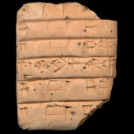 model input (224x224)  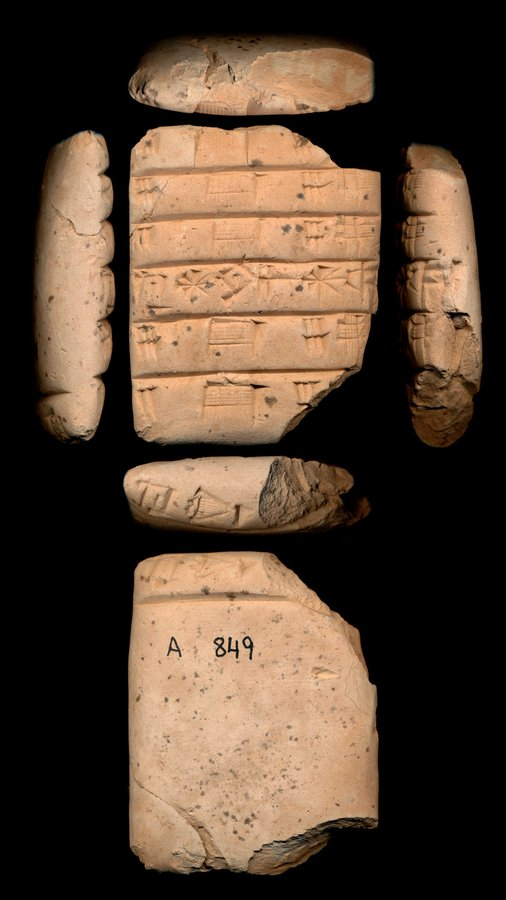 full photo (reference)</td><td valign="top"><table><tr><th>#</th><th>face</th><th>cuneiform</th><th>transliteration</th><th>translation</th></tr><tr><td>1</td><td>obverse</td><td>𒐁 𒆤 𒐅</td><td>3(asz@c) kid 7(asz@c) kusz3</td><td>&mdash;</td></tr><tr><td>2</td><td>obverse</td><td>𒐋 𒆤 𒐋 𒌑</td><td>6(disz) kid 6(disz) kusz3</td><td>&mdash;</td></tr><tr><td>3</td><td>obverse</td><td>𒐀 𒆤 𒐃 𒌑</td><td>2(asz@c) kid 5(asz@c) kusz3</td><td>&mdash;</td></tr><tr><td>4</td><td>obverse</td><td>𒈣 𒅎 𒀭 𒊨</td><td>ma2 iszkur-an-dul3</td><td>&mdash;</td></tr><tr><td>5</td><td>obverse</td><td>𒐋 𒆤 𒐋 𒌑</td><td>6(disz) kid 6(disz) kusz3</td><td>&mdash;</td></tr><tr><td>6</td><td>obverse</td><td>𒐀 𒆤 𒐊</td><td>2(asz@c) kid 5(disz) kusz3</td><td>&mdash;</td></tr><tr><td>1</td><td>reverse</td><td>𒈣 𒋽</td><td>ma2-gur8 ...</td><td>&mdash;</td></tr></table></td></tr></table>

**Original text (transliteration):**
> 3aš @ c kid 7aš @ c kuš₃ 6diš kid 6diš kuš₃ 2aš @ c kid 5aš @ c kuš₃ ma₂ iškur - an - dul₃ 6diš kid 6diš kuš₃ 2aš @ c kid 5diš kuš₃ ma₂ - gur₈ <strong>...</strong>

**Masked input (9 positions):**
> <strong>?</strong>š @ c kid 7aš @ c kuš₃ <strong>?</strong> kid 6diš <strong>?</strong>š₃ 2aš @ c kid 5aš @ c <strong>?</strong> <strong>?</strong> <strong>?</strong> ma₂ iškur - <strong>?</strong> - dul₃ 6diš kid 6diš kuš₃ 2aš @ c ki <strong>?</strong> 5diš <strong>?</strong>š₃ ma₂ - gur₈ <strong>...</strong>

### Restoration (masked-token predictions)

| # | true token | text-only top-1 | text-only top-3 | vision top-1 | vision top-3 | text-only correct | vision correct |
|---|---|---|---|---|---|---|---|
| 1 | `3a` | `3a` | `3a`, `4a`, `di` | `3a` | `3a`, `4a`, `5` | ✅ | ✅ |
| 2 | `6diš` | `6diš` | `6diš`, `4diš`, `5diš` | `6diš` | `6diš`, `5diš`, `1diš` | ✅ | ✅ |
| 3 | `ku` | `ku` | `ku`, `ke`, `pe` | `ku` | `ku`, `ke`, `u` | ✅ | ✅ |
| 4 | `ku` | `ku` | `ku`, `ki`, `ma` | `ku` | `ku`, `ki`, `ma` | ✅ | ✅ |
| 5 | `##š` | `##š` | `##š`, `##d`, `-` | `##š` | `##š`, `##d`, `-` | ✅ | ✅ |
| 6 | `##₃` | `##₃` | `##₃`, `##₂`, `gur` | `##₃` | `##₃`, `##₂`, `-` | ✅ | ✅ |
| 7 | `an` | `an` | `an`, `en`, `mu` | `an` | `an`, `en`, `da` | ✅ | ✅ |
| 8 | `##d` | `##d` | `##d`, `##₂`, `-` | `##d` | `##d`, `##₂`, `-` | ✅ | ✅ |
| 9 | `ku` | `ku` | `ku`, `pe`, `ke` | `ku` | `ku`, `ke`, `pe` | ✅ | ✅ |

Top-1 accuracy on this example: text-only 9/9 (100%), vision 9/9 (100%)

### Metadata predictions

| head | ground truth | text-only prediction | vision prediction |
|---|---|---|---|
| period | Third Millennium | Third Millennium (0.90) | Third Millennium (0.94) |
| genre | Administrative | Administrative (0.95) | Administrative (0.95) |
| language | (no label) | Sumerian (0.93) | Sumerian (0.95) |
| provenience | Adab | Girsu (0.50) | Adab (0.38) **<- differs** |

---

## Example 18 — `P237594` (has photo: True)

*Neo-Babylonian -- The British Museum*

<table><tr><td valign="top" width="240">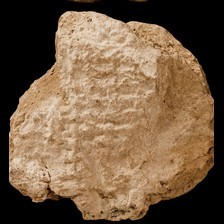 model input (224x224)  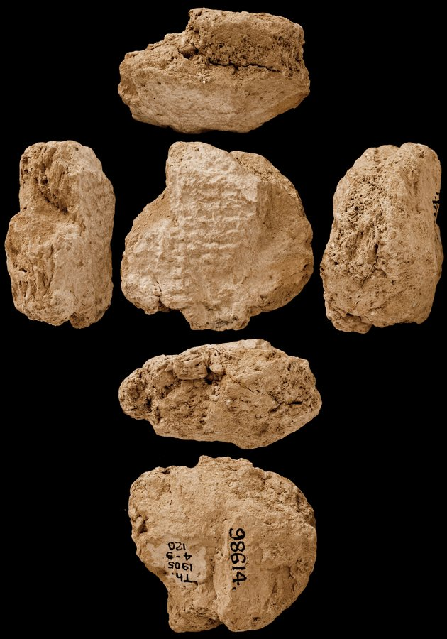 full photo (reference)</td><td valign="top"><table><tr><th>#</th><th>face</th><th>cuneiform</th><th>transliteration</th><th>translation</th></tr><tr><td>1'</td><td>default</td><td>𒀀 x</td><td>... A x ...</td><td>&mdash;</td></tr><tr><td>2'</td><td>default</td><td>x x</td><td>... x x ...</td><td>&mdash;</td></tr><tr><td>3'</td><td>default</td><td>x</td><td>... x LU₂ ...</td><td>&mdash;</td></tr><tr><td>4'</td><td>default</td><td>x 𒈨𒌍 x 𒅆 𒈨𒌍 x</td><td>... x MEŠ x IGI-MEŠ x ...</td><td>&mdash;</td></tr><tr><td>5'</td><td>default</td><td>x 𒀀 𒅆 𒈨𒌍</td><td>... x A IGI-MEŠ ...</td><td>&mdash;</td></tr><tr><td>6'</td><td>default</td><td>x 𒀀 𒅆 𒈨𒌍</td><td>... x A IGI-MEŠ ...</td><td>&mdash;</td></tr><tr><td>7'</td><td>default</td><td>x 𒀀 𒅆 𒈨𒌍</td><td>... x A IGI-MEŠ ...</td><td>&mdash;</td></tr><tr><td>8'</td><td>default</td><td>x 𒀀 𒅆</td><td>... x A IGI ...</td><td>&mdash;</td></tr><tr><td>9'</td><td>default</td><td>𒀀</td><td>... A ...</td><td>&mdash;</td></tr><tr><td>10'</td><td>default</td><td>x 𒀸</td><td>... x ina ...</td><td>&mdash;</td></tr><tr><td>11'</td><td>default</td><td>x x</td><td>... x x ...</td><td>&mdash;</td></tr></table></td></tr></table>

**Original text (transliteration):**
> <strong>...</strong> A <strong>x</strong> <strong>...</strong> <strong>...</strong> <strong>x</strong> <strong>x</strong> <strong>...</strong> <strong>...</strong> <strong>x</strong> LU₂ <strong>...</strong> <strong>...</strong> <strong>x</strong> MEŠ <strong>x</strong> IGI - MEŠ <strong>x</strong> <strong>...</strong> <strong>...</strong> <strong>x</strong> A IGI - MEŠ <strong>...</strong> <strong>...</strong> <strong>x</strong> A IGI <strong>...</strong> <strong>...</strong> A <strong>...</strong> <strong>...</strong> <strong>x</strong> ina <strong>...</strong>

**Cuneiform (Unicode signs, whole document, not position-aligned to the text above):**
> 𒀀 x x x x x 𒈨𒌍 x 𒅆 𒈨𒌍 x x 𒀀 𒅆 𒈨𒌍 x 𒀀 𒅆 𒀀 x 𒀸

**Masked input (2 positions):**
> <strong>...</strong> A <strong>x</strong> <strong>...</strong> <strong>...</strong> <strong>x</strong> <strong>x</strong> <strong>...</strong> <strong>...</strong> <strong>x</strong> LU₂ <strong>...</strong> <strong>...</strong> <strong>x</strong> MEŠ <strong>x</strong> IGI - <strong>?</strong> <strong>x</strong> <strong>...</strong> <strong>...</strong> <strong>x</strong> A IGI - MEŠ <strong>...</strong> <strong>...</strong> <strong>x</strong> <strong>?</strong> IGI <strong>...</strong> <strong>...</strong> A <strong>...</strong> <strong>...</strong> <strong>x</strong> ina <strong>...</strong>

### Restoration (masked-token predictions)

| # | true token | text-only top-1 | text-only top-3 | vision top-1 | vision top-3 | text-only correct | vision correct |
|---|---|---|---|---|---|---|---|
| 1 | `MEŠ` | `MEŠ` | `MEŠ`, `ME`, `ma` | `MEŠ` | `MEŠ`, `ME`, `šu` | ✅ | ✅ |
| 2 | `A` | `ina` | `ina`, `TA`, `A` | `A` | `A`, `ina`, `TA` | ❌ | ✅ |

Top-1 accuracy on this example: text-only 1/2 (50%), vision 2/2 (100%)

### Metadata predictions

| head | ground truth | text-only prediction | vision prediction |
|---|---|---|---|
| period | Neo-Assyrian | Neo-Assyrian (0.47) | Neo-Assyrian (0.41) |
| genre | Literary & Scholarly | Legal (0.35) | Legal (0.63) |
| language | Akkadian | Akkadian (0.92) | Akkadian (0.95) |
| provenience | Nineveh | Uruk (0.61) | Nineveh (0.37) **<- differs** |

---

## Example 19 — `P281840` (has photo: True)

*VS 19, 02 -- Administrative, Middle Assyrian, Assur (mod. Qalat Sherqat) -- Vorderasiatisches Museum, Berlin, Germany -- published in Ištar in Aššur.  Untersuchung eines Lokalkultes von ca. 2500 bis 614 v. Chr  (Meinhold, 2009)*

<table><tr><td valign="top" width="240">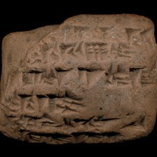 model input (224x224)  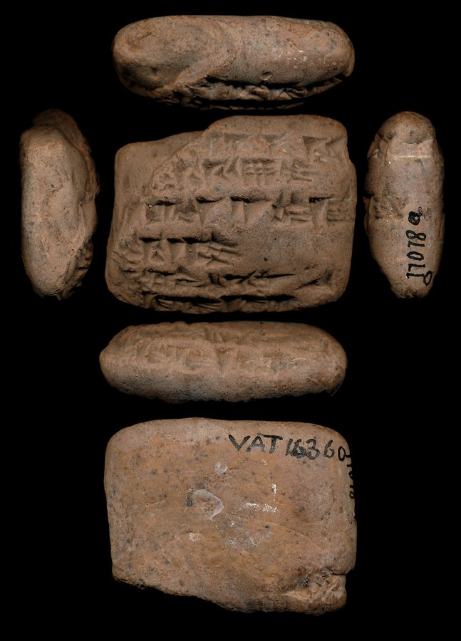 full photo (reference)</td><td valign="top">(no line-by-line ATF available for this tablet)</td></tr></table>

**Original text (transliteration):**
> 1 UDU. NIM ba - e - ru - te i + na U₄ 29KAM₂ 2 UDU. NITA₂ 2 DAM. GAR₃ i + na U₄ 1KAM₂ a - na pa - ni iš₈ - tar₂ MAN ša ša - ma - e

**Cuneiform (Unicode signs, whole document, not position-aligned to the text above):**
> 𒁹 𒇻 𒉏 𒁀 𒂊 𒊒 𒋼 𒄿 𒈾 𒌓 𒎙 𒐎 𒆚 𒈫 𒇻 𒀴 𒈫 𒁮 𒃼 𒄿 𒈾 𒌓 𒁹 𒆚 𒀀 𒈾 𒉺 𒉌 𒀭 𒀹 𒁯 𒎙 𒊭 𒊭 𒈠 𒂊

**Masked input (10 positions):**
> 1 UDU. NIM ba - e <strong>?</strong> ru - te i <strong>?</strong> <strong>?</strong> U₄ 29KA <strong>?</strong>₂ 2 UDU. N <strong>?</strong>A₂ 2 <strong>?</strong>M. GAR <strong>?</strong> <strong>?</strong> + na U₄ 1KAM₂ a - na pa - ni iš₈ - tar₂ <strong>?</strong> ša <strong>?</strong> - ma - e

### Restoration (masked-token predictions)

| # | true token | text-only top-1 | text-only top-3 | vision top-1 | vision top-3 | text-only correct | vision correct |
|---|---|---|---|---|---|---|---|
| 1 | `-` | `-` | `-`, `.`, `+` | `-` | `-`, `.`, `+` | ✅ | ✅ |
| 2 | `+` | `+` | `+`, `-`, `=` | `+` | `+`, `-`, `=` | ✅ | ✅ |
| 3 | `na` | `na` | `na`, `di`, `din` | `na` | `na`, `di`, `šar` | ✅ | ✅ |
| 4 | `##M` | `##M` | `##M`, `##N`, `##R` | `##M` | `##M`, `##N`, `##L` | ✅ | ✅ |
| 5 | `##IT` | `##IT` | `##IT`, `##IN`, `##IG` | `##IT` | `##IT`, `##IN`, `##IG` | ✅ | ✅ |
| 6 | `DA` | `NA` | `NA`, `DA`, `LA` | `DA` | `DA`, `NA`, `GA` | ❌ | ✅ |
| 7 | `##₃` | `##₃` | `##₃`, `##₂`, `##₅` | `##₃` | `##₃`, `##₂`, `##₅` | ✅ | ✅ |
| 8 | `i` | `i` | `i`, `a`, `+` | `i` | `i`, `a`, `e` | ✅ | ✅ |
| 9 | `MAN` | `-` | `-`, `ša`, `DUMU` | `-` | `-`, `ša`, `DUMU` | ❌ | ❌ |
| 10 | `ša` | `##₂` | `##₂`, `##m`, `##l` | `##₂` | `##₂`, `##l`, `##m` | ❌ | ❌ |

Top-1 accuracy on this example: text-only 7/10 (70%), vision 8/10 (80%)

### Metadata predictions

| head | ground truth | text-only prediction | vision prediction |
|---|---|---|---|
| period | Middle Assyrian | Middle Assyrian (0.93) | Middle Assyrian (0.93) |
| genre | (no label) | Literary & Scholarly (0.56) | Literary & Scholarly (0.42) |
| language | Akkadian | Akkadian (0.94) | Akkadian (0.93) |
| provenience | Assur | Assur (0.93) | Assur (0.93) |

---

## Example 20 — `P393956` (has photo: True)

*RINAP 5/3 Sîn-šarru-iškun 19, ex. 004 -- Official or display, Neo-Assyrian, Kalhu (mod. Nimrūd) -- British Museum, London, UK -- published in The Royal Inscriptions of Ashurbanipal (668–631 BC), Aššur-etel-ilāni (630–627 BC), and Sîn-šarra-iškun (626–612 BC), Kings of Assyria, Part 3 (Novotny, 2023)*

<table><tr><td valign="top" width="240">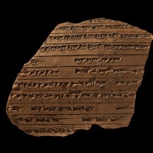 model input (224x224)  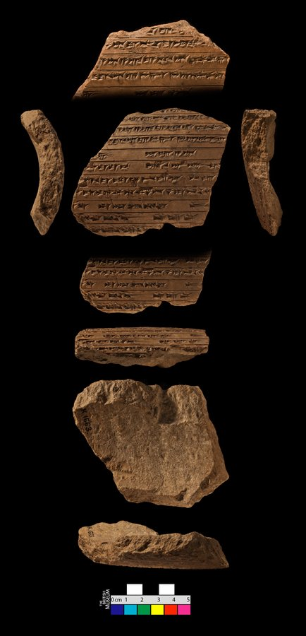 full photo (reference)</td><td valign="top"><table><tr><th>#</th><th>face</th><th>cuneiform</th><th>transliteration</th><th>translation</th></tr><tr><td>7</td><td>surface a</td><td>𒋙 𒌑 𒌑</td><td>...-szu2 u2-szam-...</td><td>&mdash;</td></tr><tr><td>8</td><td>surface a</td><td>𒃻 𒋾 𒅁 𒉡 𒋙 𒈠 𒀸 𒀮 𒄯 x</td><td>...-sza2-ti ib-nu-szu2-ma ina nap-har x ...</td><td>&mdash;</td></tr><tr><td>9</td><td>surface a</td><td>𒀀 𒋾 𒀀 𒄀 𒂊 𒂗 𒌋 𒋾 𒂊 𒉿 𒊒 𒍑</td><td>...-a-ti a-ge-e en -u-ti e-pi-ru-usz ...</td><td>&mdash;</td></tr><tr><td>10</td><td>surface a</td><td>𒉺𒇻 𒌋 𒋾 𒌦 𒈨𒌍 𒂼 𒈨𒌍 𒀝 𒉺 𒆤</td><td>... sipa -u-ti ug3-mesz dagal-mesz ag pa-qid ...</td><td>&mdash;</td></tr><tr><td>11</td><td>surface a</td><td>𒄣 𒉌 𒀊 𒋫 𒀀 𒋾</td><td>...-qu-ni ab-ta-a-ti ...</td><td>&mdash;</td></tr><tr><td>12</td><td>surface a</td><td>𒈾 𒋗 𒋗 𒁉 𒂗 𒌋 𒀝 𒌌</td><td>...-na szu-szu-bi en u ag ul-...</td><td>&mdash;</td></tr><tr><td>13</td><td>surface a</td><td>𒈬 𒀀 𒄭 𒄑 𒉈 𒂊 𒈨 𒌋 𒅖 𒆠 𒈬 𒋫 𒈬</td><td>...-mu a-hi-iz t,e3-e-me u mil-ki mu-ta-mu-...</td><td>&mdash;</td></tr><tr><td>14</td><td>surface a</td><td>x 𒁕 𒅔 𒁲 𒂗 𒈪 𒃻 𒊑 𒃻 𒀜 𒈬 𒋙 𒌋𒅗</td><td>... x da-in de-en mi-sza2-ri sza2 at-mu-szu2 ugu ...</td><td>&mdash;</td></tr><tr><td>15</td><td>surface a</td><td>𒀀 𒋼 𒆷 𒅗 𒈲 𒅅 𒆠 𒉺 𒅆</td><td>...-a-te la ka-s,ir ik-ki pa-szi-...</td><td>&mdash;</td></tr><tr><td>16</td><td>surface a</td><td>𒅅 𒆠 𒁉 𒋙 𒉡 𒈾 𒍢 𒊒</td><td>... ik-ki-bi-szu2-nu na-s,i-ru ...</td><td>&mdash;</td></tr><tr><td>17</td><td>surface a</td><td>𒄨 𒉡 𒈗 𒋙 𒈗 𒆳 𒀭 𒊹 𒈗 𒆳</td><td>... dan-nu lugal szu2 lugal kur an-szar2 lugal kur ...</td><td>&mdash;</td></tr></table></td></tr></table>

**Original text (transliteration):**
> <strong>...</strong> - šu₂ u₂ - šam - <strong>...</strong> <strong>...</strong> - ša₂ - ti ib - nu - šu₂ - ma ina nap - har <strong>x</strong> <strong>...</strong> <strong>...</strong> - a - ti a - ge - e en - u - ti e - pi - ru - uš <strong>...</strong> <strong>...</strong> sipa - u - ti ug₃ - meš dagal - meš ag pa - qid <strong>...</strong> <strong>...</strong> - qu - ni ab - ta - a - ti <strong>...</strong> <strong>...</strong> - na šu - šu - bi en u ag ul - <strong>...</strong> <strong>...</strong> - mu a - hi - iz ṭe₃ - e - me u mil - ki mu - ta - mu - <strong>...</strong> <strong>...</strong> <strong>x</strong> da - in de - en mi - ša₂ - ri ša₂ at - mu - šu₂ ugu <strong>...</strong> <strong>...</strong> - a - te la ka - ṣir ik - ki pa - ši - <strong>...</strong> <strong>...</strong> ik - ki - bi - šu₂ - nu na - ṣi - ru <strong>...</strong> <strong>...</strong> dan - nu lugal šu₂ lugal kur an - šar₂ lugal kur <strong>...</strong>

**Cuneiform (Unicode signs, whole document, not position-aligned to the text above):**
> 𒋙 𒌑 𒌑 𒃻 𒋾 𒅁 𒉡 𒋙 𒈠 𒀸 𒀮 𒄯 x 𒀀 𒋾 𒀀 𒄀 𒂊 𒂗 𒌋 𒋾 𒂊 𒉿 𒊒 𒍑 𒉺𒇻 𒌋 𒋾 𒌦 𒈨𒌍 𒂼 𒈨𒌍 𒀝 𒉺 𒆤 𒄣 𒉌 𒀊 𒋫 𒀀 𒋾 𒈾 𒋗 𒋗 𒁉 𒂗 𒌋 𒀝 𒌌 𒈬 𒀀 𒄭 𒄑 𒉈 𒂊 𒈨 𒌋 𒅖 𒆠 𒈬 𒋫 𒈬 x 𒁕 𒅔 𒁲 𒂗 𒈪 𒃻 𒊑 𒃻 𒀜 𒈬 𒋙 𒌋𒅗 𒀀 𒋼 𒆷 𒅗 𒈲 𒅅 𒆠 𒉺 𒅆 𒅅 𒆠 𒁉 𒋙 𒉡 𒈾 𒍢 𒊒 𒄨 𒉡 𒈗 𒋙 𒈗 𒆳 𒀭 𒊹 𒈗 𒆳

**Masked input (27 positions):**
> <strong>...</strong> - <strong>?</strong>₂ <strong>?</strong> <strong>?</strong> - šam <strong>?</strong> <strong>...</strong> <strong>...</strong> - <strong>?</strong> <strong>?</strong> - ti ib - nu - šu₂ <strong>?</strong> ma <strong>?</strong> nap <strong>?</strong> har <strong>x</strong> <strong>...</strong> <strong>...</strong> - a - ti a - <strong>?</strong> - e en - u - ti e - pi - ru - uš <strong>...</strong> <strong>...</strong> sipa - u - ti ug <strong>?</strong> - meš dagal <strong>?</strong> meš ag pa - qid <strong>...</strong> <strong>...</strong> - qu - ni ab - <strong>?</strong> - a - ti <strong>...</strong> <strong>...</strong> - na šu - šu - bi en u ag ul <strong>?</strong> <strong>...</strong> <strong>...</strong> - mu a - hi - iz ṭ <strong>?</strong>₃ - e <strong>?</strong> me <strong>?</strong> mil <strong>?</strong> ki mu - ta - mu <strong>?</strong> <strong>...</strong> <strong>...</strong> <strong>x</strong> da - in de <strong>?</strong> en <strong>?</strong> - ša₂ <strong>?</strong> ri ša <strong>?</strong> at - mu - šu <strong>?</strong> ugu <strong>...</strong> <strong>...</strong> - a - te la <strong>?</strong> - ṣir ik - ki pa - ši - <strong>...</strong> <strong>...</strong> ik - ki - bi - šu₂ - nu na - ṣi - <strong>?</strong> <strong>...</strong> <strong>...</strong> dan - nu <strong>?</strong> šu₂ lugal kur an - šar₂ lugal kur <strong>...</strong>

### Restoration (masked-token predictions)

| # | true token | text-only top-1 | text-only top-3 | vision top-1 | vision top-3 | text-only correct | vision correct |
|---|---|---|---|---|---|---|---|
| 1 | `šu` | `šu` | `šu`, `u`, `ša` | `šu` | `šu`, `u`, `ša` | ✅ | ✅ |
| 2 | `u` | `u` | `u`, `-`, `ša` | `-` | `-`, `u`, `i` | ✅ | ❌ |
| 3 | `##₂` | `##₂` | `##₂`, `a`, `mu` | `##₂` | `##₂`, `mu`, `a` | ✅ | ✅ |
| 4 | `-` | `-` | `-`, `##₂`, `##₃` | `-` | `-`, `##₂`, `la` | ✅ | ✅ |
| 5 | `ša` | `u` | `u`, `šu`, `e` | `u` | `u`, `šu`, `a` | ❌ | ❌ |
| 6 | `##₂` | `##₂` | `##₂`, `it`, `##t` | `##₂` | `##₂`, `it`, `##b` | ✅ | ✅ |
| 7 | `-` | `-` | `-`, `ina`, `la` | `-` | `-`, `la`, `ina` | ✅ | ✅ |
| 8 | `ina` | `-` | `-`, `la`, `ina` | `-` | `-`, `la`, `ina` | ❌ | ❌ |
| 9 | `-` | `-` | `-`, `##₂`, `##i` | `-` | `-`, `##₂`, `##i` | ✅ | ✅ |
| 10 | `ge` | `me` | `me`, `ke`, `le` | `me` | `me`, `te`, `le` | ❌ | ❌ |
| 11 | `##₃` | `##nim` | `##nim`, `##₃`, `##₅` | `##₃` | `##₃`, `##nim`, `##₅` | ❌ | ✅ |
| 12 | `-` | `-` | `-`, `:`, `.` | `-` | `-`, `.`, `:` | ✅ | ✅ |
| 13 | `ta` | `ba` | `ba`, `ta`, `ra` | `ba` | `ba`, `ta`, `da` | ❌ | ❌ |
| 14 | `-` | `-` | `-`, `ina`, `la` | `-` | `-`, `ul`, `la` | ✅ | ✅ |
| 15 | `##e` | `##e` | `##e`, `##i`, `##u` | `##e` | `##e`, `##i`, `##a` | ✅ | ✅ |
| 16 | `-` | `-` | `-`, `ina`, `u` | `-` | `-`, `ina`, `ša` | ✅ | ✅ |
| 17 | `u` | `##š` | `##š`, `-`, `en` | `##š` | `##š`, `-`, `en` | ❌ | ❌ |
| 18 | `-` | `-` | `-`, `##₃`, `##₂` | `-` | `-`, `##₂`, `u` | ✅ | ✅ |
| 19 | `-` | `-` | `-`, `##š`, `##t` | `-` | `-`, `##š`, `##t` | ✅ | ✅ |
| 20 | `-` | `-` | `-`, `##₃`, `##₂` | `-` | `-`, `##₃`, `##₂` | ✅ | ✅ |
| 21 | `mi` | `a` | `a`, `mu`, `pa` | `a` | `a`, `mu`, `i` | ❌ | ❌ |
| 22 | `-` | `-` | `-`, `##₂`, `a` | `-` | `-`, `.`, `##₂` | ✅ | ✅ |
| 23 | `##₂` | `##₂` | `##₂`, `-`, `##₃` | `##₂` | `##₂`, `-`, `##₃` | ✅ | ✅ |
| 24 | `##₂` | `##₂` | `##₂`, `-`, `ša` | `##₂` | `##₂`, `-`, `##b` | ✅ | ✅ |
| 25 | `ka` | `na` | `na`, `ki`, `mi` | `na` | `na`, `ki`, `ma` | ❌ | ❌ |
| 26 | `ru` | `ir` | `ir`, `ri`, `ru` | `ir` | `ir`, `i`, `it` | ❌ | ❌ |
| 27 | `lugal` | `-` | `-`, `.`, `:` | `-` | `-`, `.`, `:` | ❌ | ❌ |

Top-1 accuracy on this example: text-only 17/27 (63%), vision 17/27 (63%)

### Metadata predictions

| head | ground truth | text-only prediction | vision prediction |
|---|---|---|---|
| period | Neo-Assyrian | Neo-Assyrian (0.93) | Neo-Assyrian (0.92) |
| genre | Royal Inscriptions | Royal Inscriptions (0.88) | Royal Inscriptions (0.83) |
| language | Akkadian | Akkadian (0.93) | Akkadian (0.94) |
| provenience | Nimrud | Nimrud (0.49) | Nimrud (0.64) |

---
