# Prediction demo: text-only vs vision (provenience) model

20 random test-split tablets, seed=42. Both models see the exact same masked positions per example (`[MASK]` shown at every chosen position, 15% of eligible tokens) -- differences in restoration come only from the two models' separately trained weights, not from the image itself (the image only reaches `provenience_head`, see module docstring). The metadata table's `provenience` row is where the image can actually change an answer.

## Example 1 — `P322517` (has photo: True)

*CUSAS 03, 0853 -- Administrative, Ur III, Garšana (mod. uncertain) -- Department of Near Eastern Studies, Cornell University, Ithaca, New York, USA -- published in The Garšana archives (Owen, 2007)*

<table><tr><td valign="top" width="240">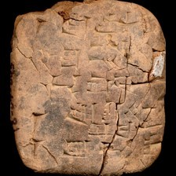 model input (224x224)  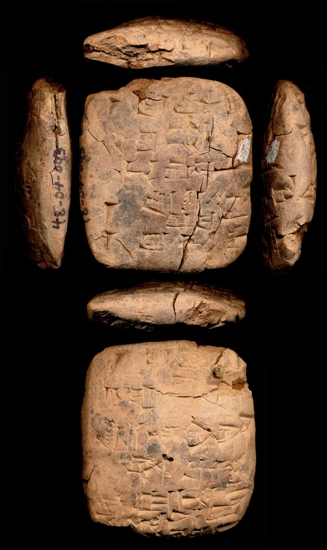 full photo (reference)</td><td valign="top"><table><tr><th>#</th><th>face</th><th>cuneiform</th><th>transliteration</th><th>translation</th></tr><tr><td>1</td><td>obverse</td><td>𒁹 𒋢 𒂊 𒁍 𒌆 𒂃 𒀀 𒌓 𒊕 𒂍 𒁀 𒀭</td><td>1(disz) suhub2 e-sir2-tug2 du8-a babbar saga e2-ba-an</td><td>&mdash;</td></tr><tr><td>2</td><td>obverse</td><td>𒁹 𒋢 𒂊 𒁍 𒁺 𒂍 𒁀 𒀭</td><td>1(disz) e-sir2 du e2-ba-an</td><td>&mdash;</td></tr><tr><td>3</td><td>obverse</td><td>𒁹 𒋢 𒈧 𒃲</td><td>1(disz) kusz masz2-gal</td><td>&mdash;</td></tr><tr><td>1</td><td>reverse</td><td>𒁹 𒋢 𒀉 𒋛 𒃻 𒊏 𒂍 𒁀 𒀭</td><td>1(disz) kusz a2-si-gar-ra e2-ba-an</td><td>&mdash;</td></tr><tr><td>2</td><td>reverse</td><td>𒆠 𒀀 𒈾 𒄴 𒉌 𒉌 𒋫 𒁀 𒍣</td><td>ki a-na-ah-i3-li2-ta ba-zi</td><td>&mdash;</td></tr><tr><td>3</td><td>reverse</td><td>𒌚 𒂡 𒈨 𒆠 𒅅</td><td>iti ezem-me-ki-gal2</td><td>&mdash;</td></tr><tr><td>4</td><td>reverse</td><td>𒈬 𒈾 𒆕 𒀀 𒈤 𒈬 𒉈 𒆕</td><td>mu na-ru2-a-mah mu-ne-du3</td><td>&mdash;</td></tr><tr><td>5</td><td>reverse</td><td>𒌉 𒀀 𒉈 𒀀 𒀵 𒍪</td><td>dumu a-bi2-a ARAD2-zu</td><td>&mdash;</td></tr></table></td></tr></table>

**Original text (transliteration):**
> 1diš kuš suhub₂ e - sir₂ - tug₂ du₈ - a babbar saga e₂ - ba - an 1diš kuš e - sir₂ du e₂ - ba - an 1diš kuš a₂ - si - gar - ra e₂ - ba - an ki a - na - ah - i₃ - li₂ - ta ba - zi

**Cuneiform (Unicode signs, whole document, not position-aligned to the text above):**
> 𒁹 𒋢 𒂊 𒁍 𒌆 𒃮 𒀀 𒌓 𒊕 𒂍 𒁀 𒀭 𒁹 𒋢 𒂊 𒁍 𒁺 𒂍 𒁀 𒀭 𒁹 𒋢 𒀉 𒋛 𒃻 𒊏 𒂍 𒁀 𒀭 𒆠 𒀀 𒈾 𒄴 𒉌 𒉌 𒋫 𒁀 𒍣

**Masked input (11 positions):**
> 1diš kuš [MASK]b₂ e - sir₂ - [MASK]g [MASK] du₈ - a babbar saga e₂ - [MASK] - an 1diš kuš e - sir₂ du e₂ - ba - an 1diš [MASK]š a₂ [MASK] si - gar - ra e [MASK] - ba [MASK] an [MASK] a - na - ah - i [MASK] [MASK] li₂ - ta ba - zi

### Restoration (masked-token predictions)

| # | true token | text-only top-1 | text-only top-3 | vision top-1 | vision top-3 | text-only correct | vision correct |
|---|---|---|---|---|---|---|---|
| 1 | `suhu` | `ka` | `ka`, `suhu`, `gu` | `suhu` | `suhu`, `ka`, `u` | ❌ | ✅ |
| 2 | `tu` | `ni` | `ni`, `tu`, `gu` | `tu` | `tu`, `ni`, `ri` | ❌ | ✅ |
| 3 | `##₂` | `##₂` | `##₂`, `##₄`, `-` | `##₂` | `##₂`, `##₄`, `-` | ✅ | ✅ |
| 4 | `ba` | `ba` | `ba`, `a`, `na` | `ba` | `ba`, `a`, `bi` | ✅ | ✅ |
| 5 | `ku` | `ku` | `ku`, `ka`, `guru` | `ku` | `ku`, `ka`, `di` | ✅ | ✅ |
| 6 | `-` | `-` | `-`, `geš`, `D` | `-` | `-`, `D`, `geš` | ✅ | ✅ |
| 7 | `##₂` | `##₂` | `##₂`, `##₃`, `##b` | `##₂` | `##₂`, `##₃`, `-` | ✅ | ✅ |
| 8 | `-` | `-` | `-`, `.`, `##₂` | `-` | `-`, `.`, `##₂` | ✅ | ✅ |
| 9 | `ki` | `ki` | `ki`, `-`, `dumu` | `ki` | `ki`, `dumu`, `mu` | ✅ | ✅ |
| 10 | `##₃` | `##₃` | `##₃`, `##₂`, `##₇` | `##₃` | `##₃`, `##₂`, `##₇` | ✅ | ✅ |
| 11 | `-` | `-` | `-`, `##₂`, `.` | `-` | `-`, `##₂`, `.` | ✅ | ✅ |

Top-1 accuracy on this example: text-only 9/11 (82%), vision 11/11 (100%)

### Metadata predictions

| head | ground truth | text-only prediction | vision prediction |
|---|---|---|---|
| period | Ur III | Ur III (0.92) | Ur III (0.91) |
| genre | Administrative | Administrative (0.95) | Administrative (0.94) |
| language | Sumerian | Sumerian (0.95) | Sumerian (0.95) |
| provenience | Garšana | Garšana (0.33) | Garšana (0.75) |

---

## Example 2 — `P369459` (has photo: True)

*OBTI 029 -- Legal, Early Old Babylonian, Nerebtum (mod. Iščali) -- Institute for the Study of Ancient Cultures West Asia & North Africa Museum, Chicago, Illinois, USA -- published in Old Babylonian tablets from Ishchali and vicinity (Greengus, 1979)*

<table><tr><td valign="top" width="240">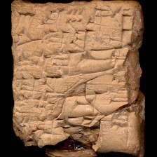 model input (224x224)  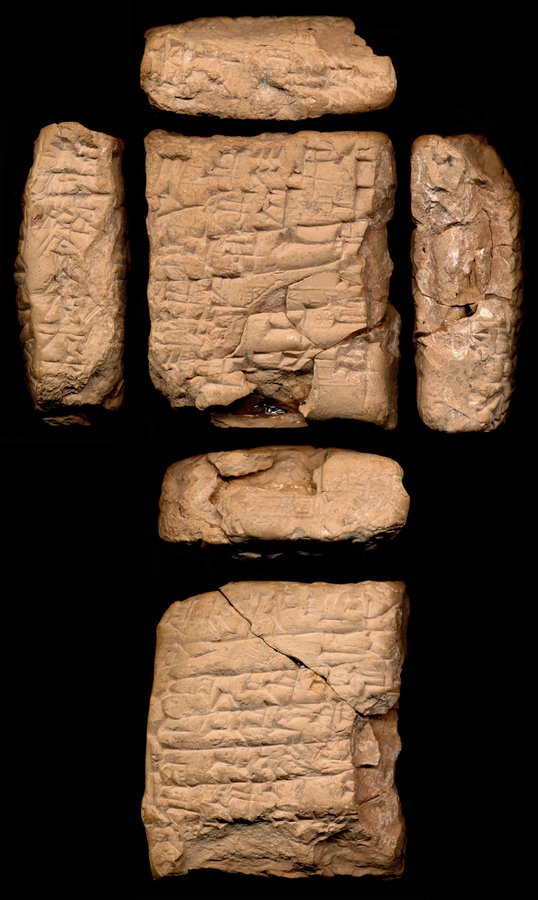 full photo (reference)</td><td valign="top"><table><tr><th>#</th><th>face</th><th>cuneiform</th><th>transliteration</th><th>translation</th></tr><tr><td>1</td><td>obverse</td><td>𒐁 𒊺 𒆬 𒌓</td><td>3(asz) sze ku3-babbar</td><td>&mdash;</td></tr><tr><td>2</td><td>obverse</td><td>𒉌 𒅗 𒍪 𒋗</td><td>ni-ka-su2-szu</td><td>&mdash;</td></tr><tr><td>3</td><td>obverse</td><td>𒄿 𒈾 𒆍 𒈽</td><td>i-na ka2 tiszpak</td><td>&mdash;</td></tr><tr><td>4</td><td>obverse</td><td>𒅗 𒊒 𒌝</td><td>ka-ru-um</td><td>&mdash;</td></tr><tr><td>5</td><td>obverse</td><td>𒄿 𒁍 𒍑 𒈠</td><td>i-pu-usz-ma</td><td>&mdash;</td></tr><tr><td>6</td><td>obverse</td><td>𒊺 𒌝 𒀭 𒉡 𒌝</td><td>sze-um an-nu-um</td><td>&mdash;</td></tr><tr><td>1</td><td>reverse</td><td>𒆠 𒇷 𒉿 𒊏 𒋳</td><td>ki li-wi-ra-szum</td><td>&mdash;</td></tr><tr><td>2</td><td>reverse</td><td>𒉌 𒅅</td><td>i3-gal2</td><td>&mdash;</td></tr><tr><td>3</td><td>reverse</td><td>𒅆 𒁓 𒂗𒍪 𒉺 𒁮 𒃼</td><td>igi bur-suen ugula dam-qar</td><td>&mdash;</td></tr><tr><td>4</td><td>reverse</td><td>𒅆 𒂗𒍪 𒄿 𒆠 𒊭</td><td>igi suen-i-qi2-sza-am</td><td>&mdash;</td></tr><tr><td>5</td><td>reverse</td><td>𒅆 𒂗 𒉆 𒂗𒍪</td><td>igi en-nam-suen</td><td>&mdash;</td></tr><tr><td>6</td><td>reverse</td><td>𒅇 𒅗 𒊒 𒌝</td><td>u3 ka-ru-um</td><td>&mdash;</td></tr><tr><td>7</td><td>reverse</td><td>𒊭 𒉈 𒊑 𒅁 𒁴</td><td>sza ne-ri-ib-tim</td><td>&mdash;</td></tr><tr><td>8</td><td>reverse</td><td>𒌚 𒀭 𒈠 𒈪 𒌓 𒌋 𒄭𒁁</td><td>iti ma-mi u4 1(u) n-kam</td><td>&mdash;</td></tr><tr><td>9</td><td>reverse</td><td>𒈬 x 𒄿 𒉿 𒅅 𒀭 𒅎 𒌦 𒈠 𒁲 𒄿 𒉿 𒅅 𒅎 𒁀 𒁶 𒁶 𒈠</td><td>mu x ... i-pi-iq-iszkur kalam-ma di-... i-pi-iq-iszkur ba-dim2-dim2-ma</td><td>&mdash;</td></tr></table></td></tr></table>

**Original text (transliteration):**
> 3aš še ku₃ - babbar ni - ka - su₂ - šu i - na ka₂ D tišpak ka - ru - um i - pu - uš - ma še - um an - nu - um ki li - wi - ra - šum igi bur - D suen ugula dam - qar igi suen - i - qi₂ - ša - u₃ ka - ru - um iti d ma - mi u₄ 1u n - kam mu x D i - pi - iq - d iškur kalam - ma di - D i - pi - iq - D iškur ba - dim₂ - dim₂ - ma

**Cuneiform (Unicode signs, whole document, not position-aligned to the text above):**
> 𒐁 𒊺 𒆬 𒌓 𒉌 𒅗 𒍪 𒋗 𒄿 𒈾 𒆍 <D> 𒅗 𒊒 𒌝 𒄿 𒁍 𒍑 𒈠 𒊺 𒌝 𒀭 𒉡 𒌝 𒆠 𒇷 𒉿 𒊏 𒋳 𒅆 𒁓 <D> 𒂗𒍪 𒉺 𒁮 𒃼 𒅆 𒂗𒍪 𒄿 𒆠 𒊭 𒅇 𒅗 𒊒 𒌝 𒌗 𒀭 𒈠 𒈪 𒌓 𒌋 𒄰 𒈬 <D> 𒄿 𒉿 𒅅 𒀭 𒅎 𒌦 𒈠 𒁲 <D> 𒄿 𒉿 𒅅 <D> 𒅎 𒁀 𒁶 𒁶 𒈠

**Masked input (20 positions):**
> 3aš še [MASK]₃ - babbar ni - ka - su₂ - šu i [MASK] na ka₂ D [MASK]špak ka - ru - um i - pu - uš - [MASK] še [MASK] um an - nu [MASK] [MASK] ki li - wi - ra - šum igi bur - D suen ugula dam [MASK] qar igi suen [MASK] i [MASK] qi₂ - [MASK] - u [MASK] ka - ru - um iti d ma - mi u₄ 1u n - kam mu x D [MASK] [MASK] [MASK] - iq - d [MASK]kur [MASK]m - ma [MASK] - D i - pi - iq - D iškur ba - [MASK]m₂ - dim₂ [MASK] ma

### Restoration (masked-token predictions)

| # | true token | text-only top-1 | text-only top-3 | vision top-1 | vision top-3 | text-only correct | vision correct |
|---|---|---|---|---|---|---|---|
| 1 | `ku` | `ku` | `ku`, `sa`, `i` | `ku` | `ku`, `i`, `sa` | ✅ | ✅ |
| 2 | `-` | `-` | `-`, `+`, `##₃` | `-` | `-`, `+`, `##₃` | ✅ | ✅ |
| 3 | `ti` | `še` | `še`, `ka`, `ki` | `ka` | `ka`, `še`, `ha` | ❌ | ❌ |
| 4 | `ma` | `šu` | `šu`, `ma`, `tum` | `ma` | `ma`, `šu`, `tum` | ❌ | ✅ |
| 5 | `-` | `-` | `-`, `##š`, `##₃` | `-` | `-`, `##š`, `##₂` | ✅ | ✅ |
| 6 | `-` | `-` | `-`, `u`, `lu` | `-` | `-`, `u`, `ša` | ✅ | ✅ |
| 7 | `um` | `um` | `um`, `ti`, `ma` | `um` | `um`, `ti`, `a` | ✅ | ✅ |
| 8 | `-` | `-` | `-`, `.`, `a` | `-` | `-`, `a`, `.` | ✅ | ✅ |
| 9 | `-` | `-` | `-`, `igi`, `dumu` | `-` | `-`, `dumu`, `igi` | ✅ | ✅ |
| 10 | `-` | `-` | `-`, `+`, `##₃` | `-` | `-`, `##₃`, `##₇` | ✅ | ✅ |
| 11 | `ša` | `bi` | `bi`, `šu`, `pu` | `pu` | `pu`, `šu`, `bu` | ❌ | ❌ |
| 12 | `##₃` | `##₂` | `##₂`, `##₃`, `##b` | `##₂` | `##₂`, `##₃`, `##b` | ❌ | ❌ |
| 13 | `i` | `i` | `i`, `a`, `ia` | `i` | `i`, `a`, `ia` | ✅ | ✅ |
| 14 | `-` | `-` | `-`, `##₃`, `##₂` | `-` | `-`, `##₃`, `##₂` | ✅ | ✅ |
| 15 | `pi` | `pi` | `pi`, `li`, `ri` | `pi` | `pi`, `pe`, `li` | ✅ | ✅ |
| 16 | `iš` | `iš` | `iš`, `Iš`, `is` | `iš` | `iš`, `Iš`, `kas` | ✅ | ✅ |
| 17 | `kala` | `ini` | `ini`, `ela`, `guru` | `ini` | `ini`, `ela`, `kala` | ❌ | ❌ |
| 18 | `di` | `šu` | `šu`, `lugal`, `ur` | `šu` | `šu`, `ur`, `lugal` | ❌ | ❌ |
| 19 | `di` | `di` | `di`, `la`, `lu` | `di` | `di`, `la`, `lu` | ✅ | ✅ |
| 20 | `-` | `-` | `-`, `ki`, `.` | `-` | `-`, `ki`, `##₂` | ✅ | ✅ |

Top-1 accuracy on this example: text-only 14/20 (70%), vision 15/20 (75%)

### Metadata predictions

| head | ground truth | text-only prediction | vision prediction |
|---|---|---|---|
| period | Old Babylonian | Old Babylonian (0.96) | Old Babylonian (0.96) |
| genre | Legal | Legal (0.66) | Legal (0.57) |
| language | Akkadian | Akkadian (0.71) | Akkadian (0.67) |
| provenience | Nerebtum | Larsa (0.40) | Larsa (0.45) |

---

## Example 3 — `P307244` (has photo: False)

*YOS 05, 132 -- Administrative, Old Babylonian, Larsa (mod. Tell as-Senkereh) -- Yale Babylonian Collection, New Haven, Connecticut, USA -- published in Records from Ur and Larsa dated in the Larsa dynasty (Grice, 1919)*

**Original text (transliteration):**
> 1diš iš₈ - tar₂ - illat - ti mu - mi - im a - na hu - bu - ul - li - šu geš - gan - na ib₂ - ta - an - bala igi D suen - mu - pa - hi - ir igi da - ar - ri - ku igi na - bi - i₃ - li₂ - šu - x - D utu igi ARAD - D nanna dumu na - x - im igi si₂ - ia - tum lu₂ - niga

**Cuneiform (Unicode signs, whole document, not position-aligned to the text above):**
> 𒁹 𒀹 𒁯 𒆜𒆳 𒋾 𒈬 𒈪 𒅎 𒀀 𒈾 𒄷 𒁍 𒌌 𒇷 𒋗 𒄑 𒃶 𒈾 𒌈 𒋫 𒀭 𒁄 𒅆 <D> 𒂗𒍪 𒈬 𒉺 𒄭 𒅕 𒅆 𒁕 𒅈 𒊑 𒆪 𒅆 𒈾 𒁉 𒉌 𒉌 𒋗 <D> 𒌓 𒅆 𒀴 <D> 𒋀𒆠 𒌉 𒈾 𒅎 𒅆 𒍣 𒅀 𒌈 𒇽 𒊺

**Masked input (15 positions):**
> 1diš iš₈ - tar₂ - illat [MASK] ti mu - [MASK] - im a - na hu - bu - ul - [MASK] - šu geš - gan [MASK] [MASK] ib₂ - ta - [MASK] - bala igi D suen - [MASK] - pa - hi - ir igi da - ar - [MASK] - ku [MASK] na [MASK] bi - i₃ - li₂ - šu - x - D [MASK]u [MASK] AR [MASK] - D nanna dumu na - x - im igi si [MASK] - ia - tum lu₂ - [MASK]ga

### Restoration (masked-token predictions)

| # | true token | text-only top-1 | text-only top-3 | vision top-1 | vision top-3 | text-only correct | vision correct |
|---|---|---|---|---|---|---|---|
| 1 | `-` | `-` | `-`, `dumu`, `D` | `-` | `-`, `##₂`, `:` | ✅ | ✅ |
| 2 | `mi` | `ri` | `ri`, `ni`, `hi` | `ri` | `ri`, `ni`, `zi` | ❌ | ❌ |
| 3 | `li` | `ti` | `ti`, `li`, `ki` | `li` | `li`, `ti`, `ki` | ❌ | ✅ |
| 4 | `-` | `-` | `-`, `dumu`, `igi` | `-` | `-`, `##₂`, `mu` | ✅ | ✅ |
| 5 | `na` | `-` | `-`, `##₃`, `D` | `-` | `-`, `D`, `##₃` | ❌ | ❌ |
| 6 | `an` | `ni` | `ni`, `an`, `ab` | `ni` | `ni`, `ab`, `a` | ❌ | ❌ |
| 7 | `mu` | `i` | `i`, `na`, `ša` | `i` | `i`, `a`, `na` | ❌ | ❌ |
| 8 | `ri` | `ši` | `ši`, `ša`, `da` | `da` | `da`, `ša`, `ši` | ❌ | ❌ |
| 9 | `igi` | `dumu` | `dumu`, `igi`, `-` | `igi` | `igi`, `dumu`, `-` | ❌ | ✅ |
| 10 | `-` | `-` | `-`, `dumu`, `igi` | `-` | `-`, `igi`, `dumu` | ✅ | ✅ |
| 11 | `ut` | `ut` | `ut`, `uz`, `sue` | `ut` | `ut`, `uz`, `sue` | ✅ | ✅ |
| 12 | `igi` | `igi` | `igi`, `dumu`, `mu` | `igi` | `igi`, `dumu`, `mu` | ✅ | ✅ |
| 13 | `##AD` | `##AD` | `##AD`, `##A`, `##AG` | `##AD` | `##AD`, `##A`, `##P` | ✅ | ✅ |
| 14 | `##₂` | `##₂` | `##₂`, `##pa`, `##₄` | `##₂` | `##₂`, `##pa`, `##₄` | ✅ | ✅ |
| 15 | `ni` | `ni` | `ni`, `bil`, `im` | `ni` | `ni`, `ab`, `manga` | ✅ | ✅ |

Top-1 accuracy on this example: text-only 8/15 (53%), vision 10/15 (67%)

### Metadata predictions

| head | ground truth | text-only prediction | vision prediction |
|---|---|---|---|
| period | Old Babylonian | Old Babylonian (0.89) | Old Babylonian (0.92) |
| genre | Administrative | Administrative (0.71) | Administrative (0.74) |
| language | Bilingual | Akkadian (0.46) | Akkadian (0.50) |
| provenience | Larsa | Larsa (0.52) | Larsa (0.48) |

---

## Example 4 — `oracc:ribo/babylon7:Q005389` (has photo: False)

**Original text (transliteration):**
> mu - ud - diš e₂ - sag - il₂ u₃ e₂ - zi - da e - pi - iš da - am - qa - a - ti

**Cuneiform (Unicode signs, whole document, not position-aligned to the text above):**
> 𒈬 𒌓 𒁹 𒂍 𒊕 𒅍 𒅇 𒂍 𒍣 𒁕 𒂊 𒉿 𒅖 𒁕 𒄠 𒋡 𒀀 𒋾

**Masked input (5 positions):**
> [MASK] - ud - diš e₂ [MASK] sag - il₂ u₃ e₂ - zi [MASK] da [MASK] - pi - [MASK] da - am - qa - a - ti

### Restoration (masked-token predictions)

| # | true token | text-only top-1 | text-only top-3 | vision top-1 | vision top-3 | text-only correct | vision correct |
|---|---|---|---|---|---|---|---|
| 1 | `mu` | `šu` | `šu`, `mu`, `hu` | `šu` | `šu`, `mu`, `nu` | ❌ | ❌ |
| 2 | `-` | `-` | `-`, `D`, `.` | `-` | `-`, `D`, `.` | ✅ | ✅ |
| 3 | `-` | `-` | `-`, `##₃`, `##š` | `-` | `-`, `##₃`, `##š` | ✅ | ✅ |
| 4 | `e` | `i` | `i`, `e`, `a` | `i` | `i`, `e`, `a` | ❌ | ❌ |
| 5 | `iš` | `i` | `i`, `it`, `ia` | `i` | `i`, `ia`, `it` | ❌ | ❌ |

Top-1 accuracy on this example: text-only 2/5 (40%), vision 2/5 (40%)

### Metadata predictions

| head | ground truth | text-only prediction | vision prediction |
|---|---|---|---|
| period | Neo-Babylonian | Neo-Babylonian (0.57) | Neo-Babylonian (0.53) |
| genre | Royal Inscriptions | Royal Inscriptions (0.63) | Royal Inscriptions (0.80) |
| language | Akkadian | Akkadian (0.92) | Akkadian (0.87) |
| provenience | Babylon | Babylon (0.16) | Babylon (0.25) |

---

## Example 5 — `P291133` (has photo: False)

*BPOA 07, 1924 -- Administrative, Ur III, Umma (mod. Tell Jokha) -- Nies Babylonian Collection, Yale Babylonian Collection, New Haven, Connecticut, USA -- published in Neo-Sumerian administrative tablets from the Yale Babylonian Collection. Part two (Sigrist, 2009)*

**Original text (transliteration):**
> 5aš duh du gur ša₃ - gal gu₄ niga a₂ - ge₆ - il₂ - la D šara₂ - anzu mušen - babbar₂

**Cuneiform (Unicode signs, whole document, not position-aligned to the text above):**
> 𒃮 𒁺 𒄥 𒊮 𒃲 𒄞 𒊺 𒀉 𒈪 𒅍 𒆷 <D> 𒇋 𒀭𒅎𒂂 𒄷 𒌓𒌓

**Masked input (5 positions):**
> 5aš duh du gur ša₃ [MASK] gal gu₄ niga a₂ - ge₆ - il [MASK] - la [MASK] šara [MASK] [MASK] anzu mušen - babbar₂

### Restoration (masked-token predictions)

| # | true token | text-only top-1 | text-only top-3 | vision top-1 | vision top-3 | text-only correct | vision correct |
|---|---|---|---|---|---|---|---|
| 1 | `-` | `-` | `-`, `še`, `geš` | `-` | `-`, `geš`, `še` | ✅ | ✅ |
| 2 | `##₂` | `##₂` | `##₂`, `##₅`, `##₃` | `##₂` | `##₂`, `##₃`, `##₅` | ✅ | ✅ |
| 3 | `D` | `D` | `D`, `##₂`, `d` | `D` | `D`, `##₂`, `d` | ✅ | ✅ |
| 4 | `##₂` | `##₂` | `##₂`, `##₃`, `##₄` | `##₂` | `##₂`, `##₃`, `-` | ✅ | ✅ |
| 5 | `-` | `-` | `-`, `D`, `geš` | `-` | `-`, `D`, `mu` | ✅ | ✅ |

Top-1 accuracy on this example: text-only 5/5 (100%), vision 5/5 (100%)

### Metadata predictions

| head | ground truth | text-only prediction | vision prediction |
|---|---|---|---|
| period | Ur III | Ur III (0.93) | Ur III (0.91) |
| genre | Administrative | Administrative (0.90) | Administrative (0.90) |
| language | Sumerian | Sumerian (0.93) | Sumerian (0.92) |
| provenience | Umma | Umma (0.86) | Umma (0.88) |

---

## Example 6 — `P335764` (has photo: False)

*ADD 0930 -- Administrative, Neo-Assyrian, Nineveh (mod. Kuyunjik) -- British Museum, London, UK -- published in Assyrian deeds and documents recording the transfer of property. Volume I-IV (Johns, 1898-1923)*

**Original text (transliteration):**
> an - ni - tu₂ a - nu - tu₂ ša DINGIR - MEŠ ša ak - kad ša ina NIM. MA tal - li - ku - u₂ - ni x x a. a - ri sa - da - ni ša GAŠAN - ak - kad KUG. GI x x KUG. UD 15 MA. NA KI. LAL - šu₂ NIN. GAL - SUM - na ki - i ina NIM. MA šu - tu₂ - u - ni ina pu - hi it - ti - ši x šap - pe - e KUG. UD 01 ta - ak - ka - si KUG. UD 03 ti - ri - ma - te KUG. UD 01 ša - sa - la - ʾi KUG. UD 04 ki - su - ki KUG. UD 02 su - sul - lu KUG. UD 01 si - ib - ka - ru - u KUG. UD 01 ma - sap - pu KUG. UD PAB - ma an - nu - tu₂ LAL - e SANGA - MEŠ i - qab - bi - u ma - a i - ba - aš₂ - ši x x TA @ v ŠA₃ - bi EN - ib - ni ina KUG. GI it - ti - din 2 : 3 MA. NA bat - qu ša ki - gal - li ša GAŠAN - ak - kad ṣa - bit 12 GIN₂ ina UGU o ša₂ - bir KUG. GI la - bi - ru - tu₂ ša na - na - a ur - ta - ad - di eš - šu - te e - ta - pa - aš₂ 2 : 3 MA. NA a - na 04 kak - ka - ba - te eb - ba - te ša GAŠAN - ak - kad ša UGU ku - ma - ri x x x 08 GIN₂ a - na 02 ša₂ - bir KUG. GI ša DUMU - E₂ ep - šu 10 GIN₂ o na - mur - tu ša a - na MAN NIM. MA uq - ṭar - ri - bu - u - ni 02 GIN₂ x x x x x mi - x + x x x x x x i - si - š

**Cuneiform (Unicode signs, whole document, not position-aligned to the text above):**
> 𒀭 𒉌 𒌓 𒀀 𒉡 𒌓 𒊭 𒀭 𒎌 𒊭 𒌷 𒀝 𒃰 𒊭 𒀸 𒆳 𒉏 𒈠 𒆠 𒊑 𒇷 𒆪 𒌑 𒉌 x x 𒀀 𒀀 𒊑 𒊓 𒁕 𒉌 𒊭 𒀭 𒃽 𒌷 𒀝 𒃰 𒆬 𒄀 x x 𒆬 𒌓 15 𒈠 𒈾 𒆠 𒇲 𒋙 𒁹 𒀭 𒎏 𒃲 𒋧 𒈾 𒆠 𒄿 𒀸 𒆳 𒉏 𒈠 𒆠 𒋗 𒌓 𒌋 𒉌 𒀸 𒁍 𒄭 𒀉 𒋾 𒅆 x 𒉺𒅁 𒉿 𒂊 𒆬 𒌓 𒁹 𒋫 𒀝 𒅗 𒋛 𒆬 𒌓 𒐈 𒋾 𒊑 𒈠 𒋼 𒆬 𒌓 𒁹 𒊭 𒊓 𒆷 𒀪 𒆬 𒌓 𒐉 𒆠 𒋢 𒆠 𒆬 𒌓 𒈫 𒋢 𒂄 𒇻 𒆬 𒌓 𒁹 𒋛 𒅁 𒅗 𒊒 𒌋 𒆬 𒌓 𒁹 𒈠 𒉺𒅁 𒁍 𒆬 𒌓 𒉽 𒈠 𒀭 𒉡 𒌓 𒇲 𒂊 𒇽 𒋃 𒎌 𒄿 𒃮 𒁉 𒌋 𒈠 𒀀 𒄿 𒁀 𒀾 𒅆 x x 𒋬 𒊮 𒁉 𒁹 𒂗 𒅁 𒉌 𒀸 𒆬 𒄀 𒀉 𒋾 𒁷 𒈫 𒐈 𒈠 𒈾 𒁁 𒄣 𒊭 𒆠 𒃲 𒇷 𒊭 𒀭 𒃽 𒌷 𒀝 𒃰 𒍝 𒂍 𒌋𒈫 𒂆 𒀸 𒌋𒅗 o 𒃻 𒄵 𒆬 𒄀 𒆷 𒁉 𒊒 𒌓 𒊭 𒀭 𒈾 𒈾 𒀀 𒌨 𒋫 𒀜 𒁲 𒌍 𒋗 𒋼 𒂊 𒋫 𒉺 𒀾 𒈫 𒐈 𒈠 𒈾 𒀀 𒈾 𒐉 𒆕 𒅗 𒁀 𒋼 𒅁 𒁀 𒋼 𒊭 𒀭 𒃽 𒌷 𒀝 𒃰 𒊭 𒌋𒅗 𒆪 𒈠 𒊑 x x x 𒐍 𒂆 𒀀 𒈾 𒈫 𒃻 𒄵 𒆬 𒄀 𒊭 𒀭 𒌉 𒂍 𒅁 𒋗 𒌋 𒂆 o 𒈾 𒄯 𒌅 𒊭 𒀀 𒈾 𒎙 𒆳 𒉏 𒈠 𒆠 𒊌 𒋻 𒊑 𒁍 𒌋 𒉌 𒈫 𒂆 x x x x x 𒈪 x x x x x x x 𒄿 𒋛 𒋙 𒉡 x x x x x 𒉽 𒎙𒁹 𒈠 𒈾 x x x x x 𒈫 𒆠 𒋢 𒆠 𒆬 𒌓 x x 𒀸 𒆜 𒊭 𒌷 𒋃 𒁲 x x x 𒇽 𒆳 𒉈 𒆷 𒋫 𒀀 𒀀 𒄴 𒊑 𒇷 𒄣 o 𒐍 𒈠 𒈾 𒆬 𒌓 𒊭 𒀭 𒅆 𒁺 𒊭 𒌷 𒌑 𒉿 𒄿 𒀸 𒌋𒅗 𒈫 𒃻 𒈾 𒎌 𒆷 𒁉 𒊒 𒌋 𒋾 𒊭 𒀭 𒃽 𒌷 𒀝 𒃰 𒌨 𒋫 𒀜 𒁲 𒌍 𒋗 𒌓 𒂊 𒋫 𒉺 𒀾 𒆬 𒄀 𒊭 x x x x x 𒁹 𒄀 𒇻 𒌋 𒀀 x x x x x 𒅖 𒋗 𒌑 𒉌 x x x x 𒈫 𒃻 𒄵 𒆬 x x x 𒈫 𒈠 𒈾 𒆠 𒇲 𒋙 𒉡 𒐉 𒆕 𒅗 𒁀 𒋼 𒅁 𒁀 𒋼 𒈫 𒐈 𒈠 𒈾 𒆠 𒇲 𒁉 𒁹 𒀉 𒋗 𒄥 𒆬 𒄀 𒐉 𒂆 𒆠 𒇲 𒁉 x x x 𒋻 𒍮 𒆬 𒄀 x 𒈠 𒈾 𒆠 𒇲 𒁉 x 𒈠 𒈾 𒆬 𒄀 𒅆 𒄵 𒌓 x x 𒊭 𒊓 𒁉 𒁉 𒉽 x 𒈠 𒈾 𒌋 𒂆 𒆬 𒄀 𒉽 𒊭 𒁹 𒄀 𒇻 𒌋 𒀀 𒅖 𒋗 𒌋 𒉌

**Masked input (67 positions):**
> an - ni - tu₂ a - nu - tu₂ ša [MASK] - MEŠ ša ak - kad ša ina NIM. MA tal - li - ku - u₂ - [MASK] x x a [MASK] a - ri sa - da - ni ša GAŠAN - ak - kad KUG. GI x x [MASK]G. UD 15 MA. NA KI. LAL - [MASK]₂ NIN. GAL - [MASK]M - na ki - i ina NIM. MA [MASK] - [MASK]₂ - u - ni ina pu - hi [MASK] - ti - ši x [MASK]p - pe - e KUG. UD 01 ta - ak - ka [MASK] [MASK] KUG. UD [MASK] ti - ri - ma - te KUG. UD 01 ša [MASK] sa - la - ʾ [MASK] KUG. [MASK] 04 [MASK] - su - ki [MASK]G. [MASK] [MASK] su [MASK] sul - lu KUG. UD 01 si - ib - ka - ru - u KUG [MASK] UD 01 ma - sap [MASK] [MASK] KUG. UD PAB - [MASK] an [MASK] nu [MASK] tu₂ LA [MASK] - e SANG [MASK] - [MASK] i - qab - bi - [MASK] ma - a i [MASK] ba - aš₂ - ši x x [MASK] @ v ŠA₃ - bi EN - [MASK] - ni ina KUG [MASK] GI it - [MASK] - din 2 [MASK] 3 MA. NA bat - qu ša ki - gal - li [MASK] GAŠAN - [MASK] [MASK] kad [MASK] - bit 12 GIN₂ [MASK] UGU o ša [MASK] - bir KU [MASK]. GI la - [MASK] - ru [MASK] tu [MASK] ša na - na - a ur - ta - ad - di eš - [MASK] - te e - ta - pa - aš₂ 2 : [MASK] MA. NA a - na [MASK] kak - ka [MASK] ba - te e [MASK] [MASK] ba - te ša GAŠ [MASK] - ak - [MASK] ša UGU ku [MASK] ma - ri x x x [MASK] GIN₂ a - na 02 ša₂ - bir KUG. GI ša [MASK] - E₂ ep - šu [MASK] GI [MASK]₂ [MASK] na - [MASK] [MASK] tu ša a - na MAN NIM. [MASK] [MASK]q - ṭar - [MASK] - bu - u - ni 02 GI [MASK]₂ x x x x x mi - x + x x x x x x i - si - š

### Restoration (masked-token predictions)

| # | true token | text-only top-1 | text-only top-3 | vision top-1 | vision top-3 | text-only correct | vision correct |
|---|---|---|---|---|---|---|---|
| 1 | `DINGIR` | `UN` | `UN`, `DINGIR`, `GAL` | `UN` | `UN`, `DINGIR`, `UD` | ❌ | ❌ |
| 2 | `ni` | `ni` | `ni`, `te`, `nu` | `ni` | `ni`, `ma`, `te` | ✅ | ✅ |
| 3 | `.` | `-` | `-`, `.`, `:` | `-` | `-`, `.`, `:` | ❌ | ❌ |
| 4 | `KU` | `KU` | `KU`, `DU`, `GU` | `KU` | `KU`, `DU`, `GU` | ✅ | ✅ |
| 5 | `šu` | `šu` | `šu`, `u`, `tu` | `šu` | `šu`, `u`, `tu` | ✅ | ✅ |
| 6 | `SU` | `SU` | `SU`, `KA`, `NA` | `SU` | `SU`, `KA`, `U` | ✅ | ✅ |
| 7 | `šu` | `a` | `a`, `pa`, `ka` | `a` | `a`, `e`, `ku` | ❌ | ❌ |
| 8 | `tu` | `šu` | `šu`, `ša`, `u` | `šu` | `šu`, `tu`, `qu` | ❌ | ❌ |
| 9 | `it` | `it` | `it`, `a`, `##q` | `it` | `it`, `##p`, `##k` | ✅ | ✅ |
| 10 | `ša` | `i` | `i`, `ša`, `ši` | `i` | `i`, `ša`, `ši` | ❌ | ❌ |
| 11 | `-` | `-` | `-`, `##k`, `##l` | `-` | `-`, `##l`, `##k` | ✅ | ✅ |
| 12 | `si` | `ni` | `ni`, `ki`, `te` | `ni` | `ni`, `lu`, `nu` | ❌ | ❌ |
| 13 | `03` | `01` | `01`, `02`, `05` | `01` | `01`, `02`, `05` | ❌ | ❌ |
| 14 | `-` | `##₂` | `##₂`, `-`, `ina` | `-` | `-`, `##₂`, `01` | ❌ | ✅ |
| 15 | `##i` | `##i` | `##i`, `##u`, `##a` | `##i` | `##i`, `##u`, `##a` | ✅ | ✅ |
| 16 | `UD` | `UD` | `UD`, `GI`, `DU` | `UD` | `UD`, `GI`, `DU` | ✅ | ✅ |
| 17 | `ki` | `a` | `a`, `i`, `su` | `su` | `su`, `ku`, `ha` | ❌ | ❌ |
| 18 | `KU` | `KU` | `KU`, `DU`, `SA` | `KU` | `KU`, `DU`, `SA` | ✅ | ✅ |
| 19 | `UD` | `GI` | `GI`, `UD`, `DU` | `UD` | `UD`, `GI`, `DU` | ❌ | ✅ |
| 20 | `02` | `01` | `01`, `02`, `05` | `01` | `01`, `02`, `05` | ❌ | ❌ |
| 21 | `-` | `-` | `-`, `##₂`, `ša` | `-` | `-`, `##₂`, `ša` | ✅ | ✅ |
| 22 | `.` | `.` | `.`, `-`, `,` | `.` | `.`, `-`, `,` | ✅ | ✅ |
| 23 | `-` | `-` | `-`, `##₂`, `ša` | `-` | `-`, `##₂`, `.` | ✅ | ✅ |
| 24 | `pu` | `ri` | `ri`, `ti`, `pu` | `ri` | `ri`, `ti`, `ra` | ❌ | ❌ |
| 25 | `ma` | `MEŠ` | `MEŠ`, `ni`, `ma` | `MEŠ` | `MEŠ`, `šu`, `ni` | ❌ | ❌ |
| 26 | `-` | `-` | `-`, `.`, `+` | `-` | `-`, `.`, `+` | ✅ | ✅ |
| 27 | `-` | `-` | `-`, `.`, `:` | `-` | `-`, `.`, `:` | ✅ | ✅ |
| 28 | `##L` | `##L` | `##L`, `##M`, `##G` | `##L` | `##L`, `##₂`, `##G` | ✅ | ✅ |
| 29 | `##A` | `##A` | `##A`, `##AR`, `##AN` | `##A` | `##A`, `##U`, `##AR` | ✅ | ✅ |
| 30 | `MEŠ` | `MEŠ` | `MEŠ`, `e`, `ni` | `MEŠ` | `MEŠ`, `ia`, `ka` | ✅ | ✅ |
| 31 | `u` | `ni` | `ni`, `e`, `te` | `ni` | `ni`, `šu`, `ia` | ❌ | ❌ |
| 32 | `-` | `-` | `-`, `+`, `.` | `-` | `-`, `+`, `.` | ✅ | ✅ |
| 33 | `TA` | `TA` | `TA`, `CT`, `MA` | `TA` | `TA`, `GI`, `MA` | ✅ | ✅ |
| 34 | `ib` | `u` | `u`, `a`, `ia` | `u` | `u`, `a`, `MEŠ` | ❌ | ❌ |
| 35 | `.` | `.` | `.`, `-`, `,` | `.` | `.`, `-`, `,` | ✅ | ✅ |
| 36 | `ti` | `ta` | `ta`, `ti`, `tal` | `ta` | `ta`, `ti`, `tal` | ❌ | ❌ |
| 37 | `:` | `:` | `:`, `/`, `+` | `:` | `:`, `/`, `-` | ✅ | ✅ |
| 38 | `ša` | `ša` | `ša`, `ina`, `##š` | `ša` | `ša`, `ina`, `##m` | ✅ | ✅ |
| 39 | `ak` | `ak` | `ak`, `a`, `aq` | `ak` | `ak`, `a`, `Ak` | ✅ | ✅ |
| 40 | `-` | `-` | `-`, `##₂`, `.` | `-` | `-`, `.`, `##₂` | ✅ | ✅ |
| 41 | `ṣa` | `a` | `a`, `ka`, `ra` | `a` | `a`, `ka`, `sa` | ❌ | ❌ |
| 42 | `ina` | `ina` | `ina`, `ša`, `ana` | `ina` | `ina`, `ša`, `02` | ✅ | ✅ |
| 43 | `##₂` | `##₂` | `##₂`, `a`, `##b` | `##₂` | `##₂`, `a`, `##b` | ✅ | ✅ |
| 44 | `##G` | `##G` | `##G`, `##₂`, `##₃` | `##G` | `##G`, `##₂`, `##₃` | ✅ | ✅ |
| 45 | `bi` | `ma` | `ma`, `ba`, `pa` | `a` | `a`, `ak`, `ta` | ❌ | ❌ |
| 46 | `-` | `-` | `-`, `ina`, `##₂` | `-` | `-`, `ša`, `02` | ✅ | ✅ |
| 47 | `##₂` | `##₂` | `##₂`, `ša`, `-` | `##₂` | `##₂`, `ša`, `##₃` | ✅ | ✅ |
| 48 | `šu` | `ru` | `ru`, `bu`, `ba` | `ru` | `ru`, `bu`, `ri` | ❌ | ❌ |
| 49 | `3` | `3` | `3`, `2`, `1` | `3` | `3`, `2`, `4` | ✅ | ✅ |
| 50 | `04` | `-` | `-`, `01`, `ina` | `02` | `02`, `01`, `-` | ❌ | ❌ |
| 51 | `-` | `-` | `-`, `ša`, `##l` | `-` | `-`, `ša`, `ina` | ✅ | ✅ |
| 52 | `##b` | `##₂` | `##₂`, `##b`, `##q` | `##₂` | `##₂`, `##b`, `##h` | ❌ | ❌ |
| 53 | `-` | `-` | `-`, `na`, `la` | `-` | `-`, `na`, `šu` | ✅ | ✅ |
| 54 | `##AN` | `##AN` | `##AN`, `##EN`, `AN` | `##AN` | `##AN`, `##EN`, `AN` | ✅ | ✅ |
| 55 | `kad` | `kad` | `kad`, `ka`, `ki` | `kad` | `kad`, `pi`, `ka` | ✅ | ✅ |
| 56 | `-` | `-` | `-`, `.`, `##l` | `-` | `-`, `.`, `##l` | ✅ | ✅ |
| 57 | `08` | `02` | `02`, `01`, `03` | `02` | `02`, `01`, `03` | ❌ | ❌ |
| 58 | `DUMU` | `PA` | `PA`, `EN`, `KUR` | `PA` | `PA`, `EN`, `KUR` | ❌ | ❌ |
| 59 | `10` | `02` | `02`, `01`, `03` | `02` | `02`, `01`, `03` | ❌ | ❌ |
| 60 | `##N` | `##N` | `##N`, `##D`, `##R` | `##N` | `##N`, `##R`, `##D` | ✅ | ✅ |
| 61 | `o` | `ina` | `ina`, `ša`, `01` | `ša` | `ša`, `02`, `01` | ❌ | ❌ |
| 62 | `mur` | `a` | `a`, `an`, `bi` | `a` | `a`, `an`, `at` | ❌ | ❌ |
| 63 | `-` | `-` | `-`, `.`, `##₂` | `-` | `-`, `.`, `##₂` | ✅ | ✅ |
| 64 | `MA` | `MA` | `MA`, `GI`, `MEŠ` | `MA` | `MA`, `GI`, `MEŠ` | ✅ | ✅ |
| 65 | `u` | `i` | `i`, `ta`, `e` | `i` | `i`, `ta`, `e` | ❌ | ❌ |
| 66 | `ri` | `ra` | `ra`, `ri`, `ru` | `ra` | `ra`, `a`, `ta` | ❌ | ❌ |
| 67 | `##N` | `##N` | `##N`, `##R`, `##D` | `##N` | `##N`, `##R`, `##D` | ✅ | ✅ |

Top-1 accuracy on this example: text-only 39/67 (58%), vision 41/67 (61%)

### Metadata predictions

| head | ground truth | text-only prediction | vision prediction |
|---|---|---|---|
| period | Neo-Assyrian | Neo-Assyrian (0.93) | Neo-Assyrian (0.93) |
| genre | Administrative | Administrative (0.47) | Legal (0.52) **<- differs** |
| language | Akkadian | Akkadian (0.93) | Akkadian (0.94) |
| provenience | Nineveh | Nineveh (0.83) | Nineveh (0.87) |

---

## Example 7 — `P247932` (has photo: True)

*RA 102, 063-064 12 -- Letter, Old Babylonian, Larsa (mod. Tell as-Senkereh) -- Hearst Museum of Anthropology, University of California at Berkeley, Berkeley, California, USA -- published in Old Babylonian Documents in the Hearst Museum of Anthropology, Berkeley (Veldhuis, 2008)*

<table><tr><td valign="top" width="240">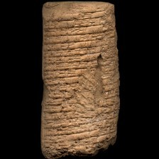 model input (224x224)  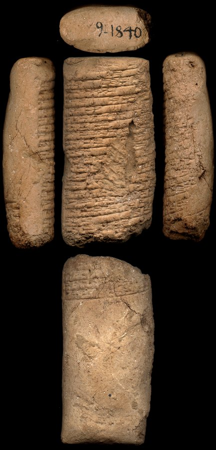 full photo (reference)</td><td valign="top"><table><tr><th>#</th><th>face</th><th>cuneiform</th><th>transliteration</th><th>translation</th></tr><tr><td>1</td><td>obverse</td><td>𒁉 𒅀</td><td>a-na a-bi-ia</td><td>&mdash;</td></tr><tr><td>2</td><td>obverse</td><td>𒉈</td><td>qi2-bi2-ma</td><td>&mdash;</td></tr><tr><td>3</td><td>obverse</td><td>𒌝 𒈠 𒄿 𒁷 𒅀 𒌈</td><td>um-ma i-din-ia-tum</td><td>&mdash;</td></tr><tr><td>4</td><td>obverse</td><td>𒌓 𒀸 𒋳 𒅀 𒈬</td><td>utu asz-szum-ia mu-szar2-kam</td><td>&mdash;</td></tr><tr><td>5</td><td>obverse</td><td>𒇷 𒁀 𒀠 𒇷 𒀉</td><td>li-ba-al-li-it,-ka</td><td>&mdash;</td></tr><tr><td>6</td><td>obverse</td><td>𒀀 𒈝 𒂦 𒄩 𒀠</td><td>a-lum bad3 ha-al-s,um</td><td>&mdash;</td></tr><tr><td>7</td><td>obverse</td><td>𒊭 𒇷 𒅎 𒄯 𒊑 𒄿</td><td>sza-li-im har-ri-i</td><td>&mdash;</td></tr><tr><td>8</td><td>obverse</td><td>𒈨 𒂊 𒈠 𒇷 𒄿</td><td>me-e ma-li-i-ma</td><td>&mdash;</td></tr><tr><td>9</td><td>obverse</td><td>𒄿 𒈾 𒌑 𒂵 𒊑 𒊭 𒅎 𒅗 𒆠</td><td>i-na u2-ga-ri sza im-...-ka-ki</td><td>&mdash;</td></tr></table></td></tr></table>

**Original text (transliteration):**
> - bi - ia um - ma i - din - ia - tum D utu aš - šum - ia mu - li - ba - al - li - iṭ - a - lum bad₃ ha - al - ša - li - im har - ri - i me - e ma - li - i - i - na u₂ - ga - ri ša im - ka - ki

**Cuneiform (Unicode signs, whole document, not position-aligned to the text above):**
> 𒁉 𒅀 𒌝 𒈠 𒄿 𒁷 𒅀 𒌈 <D> 𒌓 𒀸 𒋳 𒅀 𒈬 𒇷 𒁀 𒀠 𒇷 𒀉 𒀀 𒈝 𒂦 𒄩 𒀠 𒊭 𒇷 𒅎 𒄯 𒊑 𒄿 𒈨 𒂊 𒈠 𒇷 𒄿 𒄿 𒈾 𒌑 𒂵 𒊑 𒊭 𒅎 𒅗 𒆠

**Masked input (12 positions):**
> - bi - ia [MASK] [MASK] ma i - din [MASK] ia - [MASK] D utu aš - šum - [MASK] mu - li - ba - al - li [MASK] iṭ - a - lum bad₃ ha [MASK] al - [MASK] [MASK] li - im har [MASK] ri - i [MASK] - e ma - li - i - i - na u [MASK] - ga - ri ša im - ka - ki

### Restoration (masked-token predictions)

| # | true token | text-only top-1 | text-only top-3 | vision top-1 | vision top-3 | text-only correct | vision correct |
|---|---|---|---|---|---|---|---|
| 1 | `um` | `um` | `um`, `ki`, `šu` | `um` | `um`, `ki`, `šu` | ✅ | ✅ |
| 2 | `-` | `-` | `-`, `ma`, `a` | `-` | `-`, `a`, `ma` | ✅ | ✅ |
| 3 | `-` | `-` | `-`, `##gir`, `D` | `-` | `-`, `##gir`, `D` | ✅ | ✅ |
| 4 | `tum` | `ma` | `ma`, `a`, `tum` | `ma` | `ma`, `tum`, `a` | ❌ | ❌ |
| 5 | `ia` | `ma` | `ma`, `ia`, `šu` | `ma` | `ma`, `ia`, `šu` | ❌ | ❌ |
| 6 | `-` | `-` | `-`, `ša`, `##m` | `-` | `-`, `ša`, `##₂` | ✅ | ✅ |
| 7 | `-` | `-` | `-`, `##₂`, `.` | `-` | `-`, `.`, `##₂` | ✅ | ✅ |
| 8 | `ša` | `li` | `li`, `la`, `ma` | `li` | `li`, `la`, `ma` | ❌ | ❌ |
| 9 | `-` | `-` | `-`, `##₂`, `##m` | `-` | `-`, `##₂`, `##₃` | ✅ | ✅ |
| 10 | `-` | `-` | `-`, `##₂`, `##₃` | `-` | `-`, `##₂`, `ki` | ✅ | ✅ |
| 11 | `me` | `##ṭ` | `##ṭ`, `##ṣ`, `##₃` | `##q` | `##q`, `##ṭ`, `##₃` | ❌ | ❌ |
| 12 | `##₂` | `##₂` | `##₂`, `##₃`, `##₄` | `##₂` | `##₂`, `##₃`, `##₄` | ✅ | ✅ |

Top-1 accuracy on this example: text-only 8/12 (67%), vision 8/12 (67%)

### Metadata predictions

| head | ground truth | text-only prediction | vision prediction |
|---|---|---|---|
| period | Old Babylonian | Old Babylonian (0.95) | Old Babylonian (0.96) |
| genre | Letters | Letters (0.85) | Letters (0.92) |
| language | Akkadian | Akkadian (0.92) | Akkadian (0.93) |
| provenience | Larsa | Larsa (0.64) | Larsa (0.39) |

---

## Example 8 — `P209711` (has photo: False)

*Ontario 2, 253 -- Administrative, Ur III, Umma (mod. Tell Jokha) -- Royal Ontario Museum of Archaeology, Toronto, Ontario, Canada -- published in Neo-Sumerian texts from the Royal Ontario Museum. II: Administrative texts mainly from Umma (Sigrist, 2004)*

**Original text (transliteration):**
> 1u 5aš gur kišib₃ ugu₂ ki bahar₂ - me mu si - ma - num₂ ki a - ra₂ 3diš - kam ba - hul

**Cuneiform (Unicode signs, whole document, not position-aligned to the text above):**
> 𒌋 𒄥 𒁾 𒀀𒅗 𒆠 𒁃 𒈨 𒈬 𒋛 𒈠 𒈝 𒆠 𒀀 𒁺 𒐈 𒄰 𒁀 𒅆𒌨

**Masked input (5 positions):**
> [MASK] 5aš gur kiši [MASK]₃ ugu₂ ki bahar [MASK] - [MASK] mu si - ma - num₂ ki a - ra₂ 3diš - kam [MASK] - hul

### Restoration (masked-token predictions)

| # | true token | text-only top-1 | text-only top-3 | vision top-1 | vision top-3 | text-only correct | vision correct |
|---|---|---|---|---|---|---|---|
| 1 | `1u` | `1aš` | `1aš`, `2u`, `1u` | `1aš` | `1aš`, `2u`, `1u` | ❌ | ❌ |
| 2 | `##b` | `##b` | `##b`, `##₁`, `##₂` | `##b` | `##b`, `##₁`, `##₂` | ✅ | ✅ |
| 3 | `##₂` | `##₃` | `##₃`, `##₆`, `##₂` | `##₃` | `##₃`, `##₂`, `##₆` | ❌ | ❌ |
| 4 | `me` | `ta` | `ta`, `ka`, `ra` | `ta` | `ta`, `ka`, `bi` | ❌ | ❌ |
| 5 | `ba` | `ba` | `ba`, `mu`, `ki` | `ba` | `ba`, `mu`, `ki` | ✅ | ✅ |

Top-1 accuracy on this example: text-only 2/5 (40%), vision 2/5 (40%)

### Metadata predictions

| head | ground truth | text-only prediction | vision prediction |
|---|---|---|---|
| period | Ur III | Ur III (0.93) | Ur III (0.93) |
| genre | Administrative | Administrative (0.93) | Administrative (0.92) |
| language | Sumerian | Sumerian (0.91) | Sumerian (0.93) |
| provenience | Umma | Umma (0.89) | Umma (0.90) |

---

## Example 9 — `P453066` (has photo: True)

*Edinburgh 17 -- Letter, Old Babylonian, Sippar-Yahrurum (mod. Tell Abu Habbah) -- National Museums Scotland, Edinburgh, Scotland, UK -- published in A catalogue of the Akkadian cuneiform tablets in the collections of the Royal Scottish Museum, Edinburgh, with copies of the texts (Dalley, 1979)*

<table><tr><td valign="top" width="240">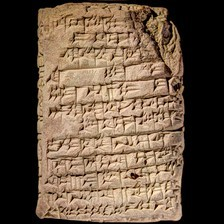 model input (224x224)  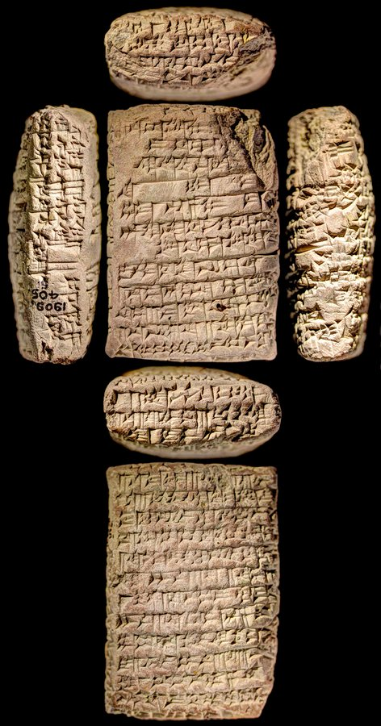 full photo (reference)</td><td valign="top"><table><tr><th>#</th><th>face</th><th>cuneiform</th><th>transliteration</th><th>translation</th></tr><tr><td>1</td><td>obverse</td><td>𒀀 𒈾 𒀊 𒇷 𒈝</td><td>a-na AB-li-lum sza ...</td><td>&mdash;</td></tr><tr><td>2</td><td>obverse</td><td>𒌑 𒁀 𒀠 𒆷</td><td>u2-ba-al-la-t,u2-szu</td><td>&mdash;</td></tr><tr><td>3</td><td>obverse</td><td>𒅇 𒋼 𒅎 𒋗 𒄿 𒈾 𒁕</td><td>u3 t,e4-em-szu i-na da-...</td><td>&mdash;</td></tr><tr><td>4</td><td>obverse</td><td>𒆠 𒉈 𒈠</td><td>qi2-bi2-ma</td><td>&mdash;</td></tr><tr><td>5</td><td>obverse</td><td>𒌝 𒈠 𒄷 𒍝 𒈝 𒈠</td><td>um-ma hu-za-lum-ma</td><td>&mdash;</td></tr><tr><td>6</td><td>obverse</td><td>𒊩𒌆 𒋚 𒁀 𒉌 𒅗 𒅇 𒊩𒌆 𒅊 𒁁 𒉌</td><td>nin-szubur ba-ni-ka u3 nin-imma3 be-li2</td><td>&mdash;</td></tr><tr><td>7</td><td>obverse</td><td>𒇷 𒁀 𒀠 𒇷 𒌅 𒅗</td><td>li-ba-al-li-t,u2-ka</td><td>&mdash;</td></tr><tr><td>8</td><td>obverse</td><td>𒄿 𒉡 𒈠 𒅖 𒌅 𒂗𒆤 𒆠</td><td>i-nu-ma isz-tu nibru</td><td>&mdash;</td></tr><tr><td>9</td><td>obverse</td><td>𒀀 𒈾 𒆍𒀭𒊏 𒆠 𒀠 𒇷 𒄭𒁁</td><td>a-na babila2 al-li-kam</td><td>&mdash;</td></tr><tr><td>10</td><td>obverse</td><td>𒆠 𒊭 𒀀 𒈠 𒄿 𒈾 𒇯 𒆬 𒂵</td><td>ki-sza-a-ma i-na du6-ku3-ga</td><td>&mdash;</td></tr><tr><td>11</td><td>obverse</td><td>𒀀 𒈾 𒂗𒆤 𒆠 𒀀 𒌅 𒌫 𒊏 𒄠</td><td>a-na nibru a-tu-ur2-ra-am</td><td>&mdash;</td></tr><tr><td>12</td><td>obverse</td><td>𒋼 𒈪 𒂵 𒄠 𒊏 𒄠 𒌑 𒌌 𒀸 𒆪 𒌦 𒅗</td><td>t,e4-mi ga-am-ra-am u2-ul asz-ku-un-ka</td><td>&mdash;</td></tr><tr><td>13</td><td>obverse</td><td>𒁹 𒀀 𒉋 𒉌 𒉌 𒋗 𒋰 𒁉 𒂊</td><td>a-pil2-i3-li2-szu tap-pe2-e</td><td>&mdash;</td></tr><tr><td>14</td><td>obverse</td><td>𒀀 𒈾 𒀀 𒊮 𒅎 𒊭 𒀀 𒃼 𒄖 𒆷</td><td>a-na a-sza3 -im sza a-gar3 gu-la</td><td>&mdash;</td></tr><tr><td>15</td><td>obverse</td><td>𒆷 𒄿 𒊓 𒀭 𒉌 𒅅</td><td>la i-sa-an-ni-iq</td><td>&mdash;</td></tr><tr><td>1</td><td>reverse</td><td>𒀀 𒈾 𒈠 𒅗 𒀀 𒅈 𒀀 𒊮 𒅎</td><td>a-na ma-ka-a-ar a-sza3 -im</td><td>&mdash;</td></tr><tr><td>2</td><td>reverse</td><td>𒊭 𒀀 𒃼 𒄖 𒆷 𒅗 𒇷 𒋗</td><td>sza a-gar3 gu-la ka-li-szu</td><td>&mdash;</td></tr><tr><td>3</td><td>reverse</td><td>𒈠 𒅗 𒊑 𒅎 𒆷 𒋼 𒅅 𒄀</td><td>ma-ka-ri-im la te-eg-gi</td><td>&mdash;</td></tr><tr><td>4</td><td>reverse</td><td>𒅖 𒌅 𒀊 𒁉 𒍪 𒌌 𒇷 𒂊 𒋗</td><td>isz-tu ap-pi2 s,u2-ul-le-e-szu</td><td>&mdash;</td></tr><tr><td>5</td><td>reverse</td><td>𒀀 𒁲 𒉽𒂊 𒉆 𒅗 𒊑 𒅎 𒊭 𒌉 𒈨𒌍 𒅁 𒆪 𒁕 𒈬</td><td>a-di pa5 nam-ka-ri-im sza dumu-mesz ip-qu2-da-mu</td><td>&mdash;</td></tr><tr><td>6</td><td>reverse</td><td>𒅇 𒐀 𒃷 𒀀 𒊮 𒀀 𒁲 𒆍 𒀭 𒍝 𒃼</td><td>u3 2(iku) GAN2 a-sza3 a-di ka2 an-za-gar3</td><td>&mdash;</td></tr><tr><td>7</td><td>reverse</td><td>𒁹 𒊬 𒀀 𒊮 𒈾 𒁺 𒌑 𒆷 𒅁 𒁀 𒀸 𒅆</td><td>1(disz) sar a-sza3 na-du-u2 la ib-ba-asz-szi</td><td>&mdash;</td></tr><tr><td>8</td><td>reverse</td><td>𒐀 𒃷 𒀀 𒊮 𒊭 𒆍 𒀭 𒍝 𒃼</td><td>2(iku) GAN2 a-sza3 sza ka2 an-za-gar3</td><td>&mdash;</td></tr><tr><td>9</td><td>reverse</td><td>𒀜 𒋫 𒀀 𒈾 𒊺 𒅎 𒅇 𒊺 𒄑 𒉌 𒋼 𒅁 𒁉 𒌍</td><td>at-ta a-na sze-im u3 sze-gesz-i3 te-ep-pe2-esz</td><td>&mdash;</td></tr><tr><td>10</td><td>reverse</td><td>𒅀 𒅆 𒅎 𒐂 𒃷 𒀀 𒊮 𒀀 𒈾 𒊺 𒅎</td><td>ia-szi-im 4(iku) GAN2 a-sza3 a-na sze-im</td><td>&mdash;</td></tr><tr><td>11</td><td>reverse</td><td>𒌅 𒍑 𒋫 𒈾 𒊍 𒍝 𒄭𒁁</td><td>tu-usz-ta-na-as-sa3-KAM</td><td>&mdash;</td></tr><tr><td>12</td><td>reverse</td><td>𒀸 𒋳 𒁲 𒅁 𒁀 𒌈 𒆷 𒊭 𒀝 𒈾 x</td><td>asz-szum di-ib-ba-tum la sza-ak-na x ...</td><td>&mdash;</td></tr><tr><td>13</td><td>reverse</td><td>𒌝 𒈠 𒀜 𒋫 𒈠</td><td>um-ma at-ta-ma</td><td>&mdash;</td></tr><tr><td>14</td><td>reverse</td><td>x 𒁉 𒉆 𒁕 𒀊 𒁀 𒆪 x</td><td>x BI nam da-ab-ba-ku x ...</td><td>&mdash;</td></tr><tr><td>15</td><td>reverse</td><td>𒈾 𒀀 𒊮 𒅎 𒂵 𒋾 𒌒</td><td>a-na a-sza3 -im qa2-ti ub-lam</td><td>&mdash;</td></tr><tr><td>16</td><td>reverse</td><td>𒀭 𒉌 𒌓 𒊭 x</td><td>x an-ni-tam sza x ...</td><td>&mdash;</td></tr><tr><td>1</td><td>left</td><td>𒈾 𒆠 𒄿 𒅁 𒀀 𒁀 𒋾 𒅀</td><td>a-na qi2-i-ip a-wa-ti-ia</td><td>&mdash;</td></tr><tr><td>2</td><td>left</td><td>𒅇 𒅆 𒁍 𒌓 𒀀 𒁀 𒋾 𒅀</td><td>u3 szi-bu-ut a-wa-ti-ia</td><td>&mdash;</td></tr><tr><td>3</td><td>left</td><td>𒁾 𒁉 𒀭 𒉌 𒀀 𒄠 𒈠 𒄯 𒇽 𒂗 𒆤 𒇲</td><td>tup-pi2 an-ni-a-am ma-har lu2-en-lil2-la2</td><td>&mdash;</td></tr></table></td></tr></table>

**Original text (transliteration):**
> a - na AB - li - lum u₂ - ba - al - la - u₃ ṭe₄ - em - šu i - na da - um - ma hu - za - lum - ma D nin - šubur ba - ni - ka u₃ D nin - imma₃ be - li₂ i - nu - ma iš - tu nibru ki a - na babila₂ ki al - li - kam ki - ša - a - ma i - na du₆ - ku₃ - ga a - na nibru ki a - tu - ur₂ - ra - am ṭe₄ - mi ga - am - ra - am u₂ - ul aš - ku - un - ka diš a - pil₂ - i₃ - li₂ - šu tap - pe₂ - e a - na a - ša₃ - im ša a - gar₃ gu - la la i - sa - an - ni - iq a - na ma - ka - a - ar a - ša₃ - im ša a - gar₃ gu - la ka - li - šu ma - ka - ri - im la te - eg - gi iš - tu ap - pi₂ ṣu₂ - ul - le - e - šu a - di pa₅ nam - ka - ri - im ša dumu - meš ip - qu₂ - D da - mu u₃ 2iku GAN2 a - ša₃ a - di ka₂ an - za - gar₃ 1diš sar a - ša₃ na - du - u₂ la ib - ba - aš - ši 2iku GAN2 a - ša₃ ša ka₂ an - za - gar₃ at - ta a - na še - im u₃ še - geš - i₃ te - ep - pe₂ - eš ia - ši - im 4iku GAN2 a - ša₃ a - na še - im tu - uš - ta - na - as - sa₃ - KAM aš - šum di - ib - ba - tum la ša - ak - na x x BI nam da - ab - ba - ku x - na a - ša₃ - im qa₂ - ti ub - an - ni - tam ša x - na qi₂ - i - ip a - wa - ti - ia u₃ ši - bu - ut a - wa - ti - ia tup - pi

**Cuneiform (Unicode signs, whole document, not position-aligned to the text above):**
> 𒀀 𒈾 𒀊 𒇷 𒈝 𒌑 𒁀 𒀠 𒆷 𒅇 𒋼 𒅎 𒋗 𒄿 𒈾 𒁕 𒌝 𒈠 𒄷 𒍝 𒈝 𒈠 <D> 𒊩𒌆 𒋚 𒁀 𒉌 𒅗 𒅇 <D> 𒊩𒌆 𒁁 𒉌 𒄿 𒉡 𒈠 𒅖 𒌅 𒂗𒆤 𒆠 𒀀 𒈾 𒆠 𒀠 𒇷 𒄰 𒆠 𒊭 𒀀 𒈠 𒄿 𒈾 𒇯 𒆬 𒂵 𒀀 𒈾 𒂗𒆤 𒆠 𒀀 𒌅 𒌫 𒊏 𒄠 𒋼 𒈪 𒂵 𒄠 𒊏 𒄠 𒌑 𒌌 𒀸 𒆪 𒌦 𒅗 𒁹 𒀀 𒉋 𒉌 𒉌 𒋗 𒋰 𒁉 𒂊 𒀀 𒈾 𒀀 𒊮 𒅎 𒊭 𒀀 𒃼 𒄖 𒆷 𒆷 𒄿 𒊓 𒀭 𒉌 𒅅 𒀀 𒈾 𒈠 𒅗 𒀀 𒅈 𒀀 𒊮 𒅎 𒊭 𒀀 𒃼 𒄖 𒆷 𒅗 𒇷 𒋗 𒈠 𒅗 𒊑 𒅎 𒆷 𒋼 𒅅 𒄀 𒅖 𒌅 𒀊 𒁉 𒍪 𒌌 𒇷 𒂊 𒋗 𒀀 𒁲 𒉽𒂊 𒉆 𒅗 𒊑 𒅎 𒊭 𒌉 𒈨𒌍 𒅁 𒆪 <D> 𒁕 𒈬 𒅇 𒃷 𒀀 𒊮 𒀀 𒁲 𒆍 𒀭 𒍝 𒃼 𒁹 𒊬 𒀀 𒊮 𒈾 𒁺 𒌑 𒆷 𒅁 𒁀 𒀸 𒅆 𒃷 𒀀 𒊮 𒊭 𒆍 𒀭 𒍝 𒃼 𒀜 𒋫 𒀀 𒈾 𒊺 𒅎 𒅇 𒊺 𒄑 𒉌 𒋼 𒅁 𒁉 𒌍 𒅀 𒅆 𒅎 𒃷 𒀀 𒊮 𒀀 𒈾 𒊺 𒅎 𒌅 𒍑 𒋫 𒈾 𒊍 𒍝 𒄰 𒀸 𒋳 𒁲 𒅁 𒁀 𒌈 𒆷 𒊭 𒀝 𒈾 𒁉 𒉆 𒁕 𒀊 𒁀 𒆪 𒈾 𒀀 𒊮 𒅎 𒂵 𒋾 𒌒 𒀭 𒉌 𒌓 𒊭 𒈾 𒆠 𒄿 𒅁 𒀀 𒉿 𒋾 𒅀 𒅇 𒅆 𒁍 𒌓 𒀀 𒉿 𒋾 𒅀 𒁾 𒁉 𒀭 𒉌 𒀀 𒄠 𒈠 𒄯 𒇽 <D> 𒂗 𒆤 𒇲 𒋫 𒈾 𒊍 𒍝 𒊏 𒄠

**Masked input (72 positions):**
> a - na AB - li - lum u₂ [MASK] [MASK] - al - la - u₃ ṭe [MASK] - em - šu i - na da - um - [MASK] hu - za - lum - ma [MASK] nin - šubur ba [MASK] ni - ka [MASK]₃ [MASK] nin - [MASK] [MASK]₃ be - li₂ i - nu - ma iš - [MASK] nibru ki a [MASK] na babila [MASK] ki al [MASK] li - kam ki [MASK] ša - a - ma i - na du₆ - ku₃ - ga [MASK] - na nibru ki a - [MASK] - ur₂ - [MASK] - am ṭe₄ [MASK] mi ga - am - ra - am u₂ - ul aš - ku - un - ka diš a - pil₂ [MASK] i [MASK] - li₂ - šu [MASK] - pe₂ [MASK] e a - na a [MASK] ša₃ - im ša [MASK] [MASK] gar [MASK] gu - la la i - sa - an - ni - [MASK]q a - na ma - ka - [MASK] - ar a - ša₃ [MASK] im ša a - [MASK]₃ gu - la ka [MASK] li - šu ma - [MASK] - ri - [MASK] la te [MASK] e [MASK] - gi [MASK] [MASK] tu ap - pi₂ [MASK]u₂ - [MASK] - le - e - šu a - [MASK] pa₅ nam - ka - ri [MASK] [MASK] [MASK] dumu - meš ip - qu₂ - D da - mu u [MASK] 2iku [MASK] [MASK]2 a - ša₃ a - [MASK] ka₂ [MASK] - za - [MASK]₃ 1diš sar a - ša₃ na - du - u₂ la ib - ba - aš [MASK] ši 2iku GAN2 a - [MASK]₃ ša ka₂ an - za - gar₃ at - ta a [MASK] [MASK] še - im u [MASK] [MASK] - geš [MASK] i₃ te - ep - [MASK]₂ - eš ia - [MASK] - im 4 [MASK] GAN2 a - [MASK]₃ a [MASK] na še - im tu - uš - ta - na - [MASK] - sa₃ - KA [MASK] aš - šum di - ib [MASK] [MASK] - tum la ša [MASK] ak - na x x BI nam da - ab - [MASK] - ku x - na a - ša₃ [MASK] im qa₂ - ti ub - an - ni - tam ša x - na qi₂ - i - ip a - wa - ti - ia u₃ ši - bu - [MASK] a - wa - [MASK] - ia tup [MASK] pi

### Restoration (masked-token predictions)

| # | true token | text-only top-1 | text-only top-3 | vision top-1 | vision top-3 | text-only correct | vision correct |
|---|---|---|---|---|---|---|---|
| 1 | `-` | `-` | `-`, `ša`, `u` | `-` | `-`, `ša`, `u` | ✅ | ✅ |
| 2 | `ba` | `ba` | `ba`, `ša`, `ma` | `ba` | `ba`, `ša`, `ma` | ✅ | ✅ |
| 3 | `##₄` | `##₄` | `##₄`, `##₃`, `##₂` | `##₄` | `##₄`, `##₃`, `##₂` | ✅ | ✅ |
| 4 | `ma` | `ma` | `ma`, `mi`, `ka` | `ma` | `ma`, `mi`, `ka` | ✅ | ✅ |
| 5 | `D` | `D` | `D`, `dumu`, `-` | `D` | `D`, `dumu`, `ša` | ✅ | ✅ |
| 6 | `-` | `-` | `-`, `.`, `a` | `-` | `-`, `.`, `a` | ✅ | ✅ |
| 7 | `u` | `u` | `u`, `ša`, `giri` | `u` | `u`, `ša`, `giri` | ✅ | ✅ |
| 8 | `D` | `D` | `D`, `-`, `d` | `D` | `D`, `-`, `d` | ✅ | ✅ |
| 9 | `im` | `ti` | `ti`, `šu`, `gal` | `gal` | `gal`, `šu`, `zu` | ❌ | ❌ |
| 10 | `##ma` | `u` | `u`, `##bur`, `giri` | `u` | `u`, `##bur`, `giri` | ❌ | ❌ |
| 11 | `tu` | `tu` | `tu`, `me`, `tar` | `tu` | `tu`, `tar`, `ti` | ✅ | ✅ |
| 12 | `-` | `-` | `-`, `+`, `##₂` | `-` | `-`, `+`, `.` | ✅ | ✅ |
| 13 | `##₂` | `##₂` | `##₂`, `ki`, `##₃` | `##₂` | `##₂`, `ki`, `##₃` | ✅ | ✅ |
| 14 | `-` | `-` | `-`, `.`, `##₂` | `-` | `-`, `##₂`, `a` | ✅ | ✅ |
| 15 | `-` | `-` | `-`, `ša`, `la` | `-` | `-`, `ša`, `la` | ✅ | ✅ |
| 16 | `a` | `a` | `a`, `i`, `an` | `a` | `a`, `i`, `an` | ✅ | ✅ |
| 17 | `tu` | `hu` | `hu`, `wa`, `bu` | `wa` | `wa`, `hu`, `bu` | ❌ | ❌ |
| 18 | `ra` | `ra` | `ra`, `a`, `ša` | `ra` | `ra`, `a`, `ša` | ✅ | ✅ |
| 19 | `-` | `-` | `-`, `.`, `:` | `-` | `-`, `.`, `##₂` | ✅ | ✅ |
| 20 | `-` | `-` | `-`, `ša`, `ki` | `-` | `-`, `ša`, `/` | ✅ | ✅ |
| 21 | `##₃` | `##₃` | `##₃`, `##₂`, `##p` | `##₃` | `##₃`, `##₂`, `##p` | ✅ | ✅ |
| 22 | `tap` | `e` | `e`, `te`, `iš` | `e` | `e`, `a`, `te` | ❌ | ❌ |
| 23 | `-` | `-` | `-`, `.`, `:` | `-` | `-`, `.`, `:` | ✅ | ✅ |
| 24 | `-` | `-` | `-`, `##₂`, `.` | `-` | `-`, `##₂`, `.` | ✅ | ✅ |
| 25 | `a` | `a` | `a`, `A`, `i` | `a` | `a`, `A`, `an` | ✅ | ✅ |
| 26 | `-` | `-` | `-`, `##₂`, `a` | `-` | `-`, `##₂`, `a` | ✅ | ✅ |
| 27 | `##₃` | `##₃` | `##₃`, `-`, `##₂` | `##₃` | `##₃`, `##₂`, `-` | ✅ | ✅ |
| 28 | `i` | `i` | `i`, `e`, `u` | `i` | `i`, `e`, `u` | ✅ | ✅ |
| 29 | `a` | `ra` | `ra`, `a`, `ha` | `a` | `a`, `ra`, `ha` | ❌ | ✅ |
| 30 | `-` | `-` | `-`, `.`, `/` | `-` | `-`, `.`, `/` | ✅ | ✅ |
| 31 | `gar` | `ša` | `ša`, `gar`, `šur` | `gar` | `gar`, `ša`, `šur` | ❌ | ✅ |
| 32 | `-` | `-` | `-`, `##₂`, `##₃` | `-` | `-`, `##₂`, `##₃` | ✅ | ✅ |
| 33 | `ka` | `ah` | `ah`, `am`, `ha` | `ah` | `ah`, `ka`, `ta` | ❌ | ❌ |
| 34 | `im` | `ia` | `ia`, `im`, `šu` | `ia` | `ia`, `im`, `šu` | ❌ | ❌ |
| 35 | `-` | `-` | `-`, `##₂`, `##š` | `-` | `-`, `##₂`, `##š` | ✅ | ✅ |
| 36 | `##g` | `##₂` | `##₂`, `##h`, `##₃` | `##₂` | `##₂`, `##₃`, `##h` | ❌ | ❌ |
| 37 | `iš` | `##š` | `##š`, `##₄`, `##₂` | `##₄` | `##₄`, `iš`, `##š` | ❌ | ❌ |
| 38 | `-` | `-` | `-`, `a`, `na` | `-` | `-`, `a`, `na` | ✅ | ✅ |
| 39 | `ṣ` | `ṣ` | `ṣ`, `ṭ`, `w` | `ṣ` | `ṣ`, `ṭ`, `uk` | ✅ | ✅ |
| 40 | `ul` | `ul` | `ul`, `bi`, `ba` | `e` | `e`, `te`, `ul` | ✅ | ❌ |
| 41 | `di` | `na` | `na`, `di`, `ta` | `na` | `na`, `di`, `ta` | ❌ | ❌ |
| 42 | `-` | `-` | `-`, `a`, `ša` | `-` | `-`, `ša`, `a` | ✅ | ✅ |
| 43 | `im` | `-` | `-`, `im`, `šu` | `-` | `-`, `im`, `ia` | ❌ | ❌ |
| 44 | `ša` | `ša` | `ša`, `##š`, `-` | `ša` | `ša`, `dumu`, `##₃` | ✅ | ✅ |
| 45 | `##₃` | `##₃` | `##₃`, `##₄`, `##₂` | `##₃` | `##₃`, `##₄`, `##₂` | ✅ | ✅ |
| 46 | `GA` | `GA` | `GA`, `##GA`, `BA` | `GA` | `GA`, `BA`, `KA` | ✅ | ✅ |
| 47 | `##N` | `##N` | `##N`, `##R`, `##G` | `##N` | `##N`, `##R`, `##G` | ✅ | ✅ |
| 48 | `di` | `na` | `na`, `di`, `ta` | `na` | `na`, `ša`, `di` | ❌ | ❌ |
| 49 | `an` | `an` | `an`, `a`, `en` | `an` | `an`, `a`, `en` | ✅ | ✅ |
| 50 | `gar` | `gar` | `gar`, `am`, `e` | `gar` | `gar`, `am`, `ša` | ✅ | ✅ |
| 51 | `-` | `-` | `-`, `##₂`, `.` | `-` | `-`, `##₂`, `+` | ✅ | ✅ |
| 52 | `ša` | `ša` | `ša`, `gar`, `šur` | `ša` | `ša`, `gar`, `šur` | ✅ | ✅ |
| 53 | `-` | `-` | `-`, `##₂`, `a` | `-` | `-`, `##₂`, `.` | ✅ | ✅ |
| 54 | `na` | `na` | `na`, `ma`, `ta` | `na` | `na`, `ta`, `ma` | ✅ | ✅ |
| 55 | `##₃` | `##₃` | `##₃`, `##₂`, `##₄` | `##₃` | `##₃`, `##₂`, `##₄` | ✅ | ✅ |
| 56 | `še` | `ur` | `ur`, `še`, `a` | `še` | `še`, `nu`, `lugal` | ❌ | ✅ |
| 57 | `-` | `-` | `-`, `ki`, `ša` | `-` | `-`, `ki`, `ša` | ✅ | ✅ |
| 58 | `pe` | `pi` | `pi`, `qi`, `qe` | `qe` | `qe`, `qi`, `u` | ❌ | ❌ |
| 59 | `ši` | `ri` | `ri`, `ni`, `ši` | `ri` | `ri`, `ši`, `di` | ❌ | ❌ |
| 60 | `##iku` | `##iku` | `##iku`, `##u`, `##ku` | `##iku` | `##iku`, `##u`, `##ku` | ✅ | ✅ |
| 61 | `ša` | `ša` | `ša`, `gar`, `am` | `ša` | `ša`, `gar`, `šur` | ✅ | ✅ |
| 62 | `-` | `-` | `-`, `+`, `##₂` | `-` | `-`, `+`, `.` | ✅ | ✅ |
| 63 | `as` | `an` | `an`, `ar`, `ab` | `an` | `an`, `ar`, `a` | ❌ | ❌ |
| 64 | `##M` | `##M` | `##M`, `-`, `##L` | `##M` | `##M`, `-`, `##L` | ✅ | ✅ |
| 65 | `-` | `-` | `-`, `##₂`, `ša` | `-` | `-`, `##₂`, `u` | ✅ | ✅ |
| 66 | `ba` | `ba` | `ba`, `bi`, `ra` | `bi` | `bi`, `ba`, `ru` | ✅ | ❌ |
| 67 | `-` | `-` | `-`, `##₃`, `##₂` | `-` | `-`, `##₂`, `##₃` | ✅ | ✅ |
| 68 | `ba` | `ba` | `ba`, `ra`, `la` | `da` | `da`, `ba`, `ta` | ✅ | ❌ |
| 69 | `-` | `-` | `-`, `/`, `ša` | `-` | `-`, `a`, `ki` | ✅ | ✅ |
| 70 | `ut` | `tum` | `tum`, `tim`, `šu` | `tim` | `tim`, `um`, `šu` | ❌ | ❌ |
| 71 | `ti` | `ri` | `ri`, `ti`, `ni` | `ri` | `ri`, `ti`, `ni` | ❌ | ❌ |
| 72 | `-` | `-` | `-`, `##₂`, `##₃` | `-` | `-`, `##₂`, `.` | ✅ | ✅ |

Top-1 accuracy on this example: text-only 53/72 (74%), vision 53/72 (74%)

### Metadata predictions

| head | ground truth | text-only prediction | vision prediction |
|---|---|---|---|
| period | Old Babylonian | Old Babylonian (0.94) | Old Babylonian (0.91) |
| genre | Letters | Letters (0.94) | Letters (0.84) |
| language | Akkadian | Akkadian (0.91) | Akkadian (0.81) |
| provenience | Sippar | Sippar (0.36) | Larsa (0.35) **<- differs** |

---

## Example 10 — `P249641` (has photo: True)

*AUCT 4, 021 -- Business / Contracts, Old Babylonian, Larsa (mod. Tell as-Senkereh) -- Siegfried H. Horn Museum, Institute of Archaeology, Andrews University, Berrien Springs, Michigan, USA -- published in Old Babylonian account texts in the Horn Archaeology Museum (Sigrist, 1990)*

<table><tr><td valign="top" width="240">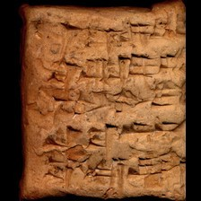 model input (224x224)  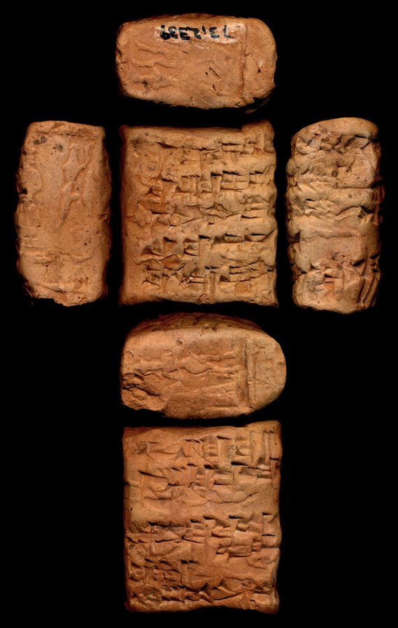 full photo (reference)</td><td valign="top"><table><tr><th>#</th><th>face</th><th>cuneiform</th><th>transliteration</th><th>translation</th></tr><tr><td>1</td><td>obverse</td><td>𒁹 𒂅 𒆬 𒁉 𒅖 𒂵 𒋾</td><td>1(disz) gin2 ku3 bi-isz qa2-ti</td><td>&mdash;</td></tr><tr><td>2</td><td>obverse</td><td>𒆠 𒂗𒍪 𒌑 𒍣 𒇷</td><td>ki suen-u2-s,e2-li</td><td>&mdash;</td></tr><tr><td>3</td><td>obverse</td><td>𒁹 𒉌 𒉌 𒄿 𒁷 𒉆</td><td>i3-li2-i-din-nam</td><td>&mdash;</td></tr><tr><td>4</td><td>obverse</td><td>𒋗 𒁀 𒀭 𒋾</td><td>szu ba-an-ti</td><td>&mdash;</td></tr><tr><td>5</td><td>obverse</td><td>𒌚 𒋞 𒀀 𒆬 𒉌 𒇲 𒂊</td><td>iti sig4-a ku3 i3-la2-e</td><td>&mdash;</td></tr><tr><td>1</td><td>reverse</td><td>𒅆 𒂗𒍪 𒁀 𒀀</td><td>igi suen-ba-a</td><td>&mdash;</td></tr><tr><td>2</td><td>reverse</td><td>𒁹 𒂗𒍪 𒁶 𒆷 𒀭 𒉌</td><td>suen-gim-la-an-ni</td><td>&mdash;</td></tr><tr><td>3</td><td>reverse</td><td>𒈩 𒇽 𒅗 𒈠 𒁉 𒈨𒌍 𒌈 𒊏</td><td>kiszib lu2-inim-ma-bi-mesz ib2-ra</td><td>&mdash;</td></tr><tr><td>4</td><td>reverse</td><td>𒌚 𒀾 𒀀</td><td>iti udru</td><td>&mdash;</td></tr><tr><td>5</td><td>reverse</td><td>𒈬 𒄘 𒆕 𒀀 𒁉</td><td>mu kilib3 gu2-du3-a-bi</td><td>&mdash;</td></tr></table></td></tr></table>

**Original text (transliteration):**
> 1diš gin₂ ku₃ bi - iš qa₂ - ti diš D suen - gim - la - an - ni

**Cuneiform (Unicode signs, whole document, not position-aligned to the text above):**
> 𒁹 𒂆 𒆬 𒁉 𒅖 𒂵 𒋾 𒁹 <D> 𒂗𒍪 𒁶 𒆷 𒀭 𒉌

**Masked input (4 positions):**
> 1diš gin₂ ku₃ [MASK] - iš qa₂ - ti di [MASK] D suen - gim [MASK] [MASK] - an - ni

### Restoration (masked-token predictions)

| # | true token | text-only top-1 | text-only top-3 | vision top-1 | vision top-3 | text-only correct | vision correct |
|---|---|---|---|---|---|---|---|
| 1 | `bi` | `ni` | `ni`, `gi`, `še` | `ri` | `ri`, `ni`, `še` | ❌ | ❌ |
| 2 | `##š` | `##š` | `##š`, `##₃`, `-` | `##š` | `##š`, `##₃`, `-` | ✅ | ✅ |
| 3 | `-` | `-` | `-`, `##₂`, `##₁` | `-` | `-`, `##₂`, `##₁` | ✅ | ✅ |
| 4 | `la` | `ma` | `ma`, `ba`, `la` | `ma` | `ma`, `na`, `la` | ❌ | ❌ |

Top-1 accuracy on this example: text-only 2/4 (50%), vision 2/4 (50%)

### Metadata predictions

| head | ground truth | text-only prediction | vision prediction |
|---|---|---|---|
| period | Old Babylonian | Old Babylonian (0.94) | Old Babylonian (0.95) |
| genre | Legal | Administrative (0.71) | Administrative (0.68) |
| language | (no label) | Akkadian (0.51) | Akkadian (0.58) |
| provenience | Larsa | Larsa (0.54) | Larsa (0.63) |

---

## Example 11 — `P248664` (has photo: True)

*AAICAB 1/2, pl. 102, 1937-053 -- Administrative, Ur III, Umma (mod. Tell Jokha) -- Ashmolean Museum, Oxford, UK -- published in AAICAB 1/2 (Grégoire, 2000)*

<table><tr><td valign="top" width="240">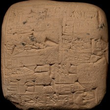 model input (224x224)  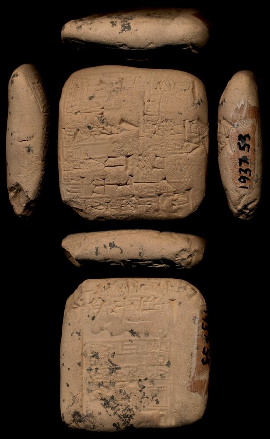 full photo (reference)</td><td valign="top"><table><tr><th>#</th><th>face</th><th>cuneiform</th><th>transliteration</th><th>translation</th></tr><tr><td>1</td><td>obverse</td><td>𒐈 𒋡 𒌑 𒌁</td><td>3(disz) sila3 u2-tir</td><td>&mdash;</td></tr><tr><td>2</td><td>obverse</td><td>𒆰 𒂠</td><td>numun-sze3</td><td>&mdash;</td></tr><tr><td>3</td><td>obverse</td><td>𒆠 𒈗 𒊷 𒂵 𒋫</td><td>ki lugal-sa6-ga-ta</td><td>&mdash;</td></tr><tr><td>4</td><td>obverse</td><td>𒈗 𒄑 𒊬</td><td>lugal-kiri6</td><td>&mdash;</td></tr><tr><td>5</td><td>obverse</td><td>𒋗 𒁀 𒋾</td><td>szu ba-ti</td><td>&mdash;</td></tr><tr><td>6</td><td>obverse</td><td>𒌚 𒉈 𒋜</td><td>iti li9-si4</td><td>&mdash;</td></tr><tr><td>1</td><td>reverse</td><td>𒈬 𒍑 𒊓 𒀭 𒊭 𒀭 𒆠 𒁀 𒅆𒌨</td><td>mu us2-sa an-sza-an ba-hul</td><td>&mdash;</td></tr><tr><td>2</td><td>reverse</td><td>𒁾 𒊬</td><td>dub-sar</td><td>&mdash;</td></tr><tr><td>3</td><td>reverse</td><td>𒌉 𒈗 𒆬 𒂵 𒉌</td><td>dumu lugal-ku3-ga-ni</td><td>&mdash;</td></tr></table></td></tr></table>

**Original text (transliteration):**
> 3diš sila₃ u₂ - tir

**Cuneiform (Unicode signs, whole document, not position-aligned to the text above):**
> 𒐈 𒋡 𒌑 𒌁

**Masked input (1 positions):**
> 3diš sila₃ [MASK]₂ - tir

### Restoration (masked-token predictions)

| # | true token | text-only top-1 | text-only top-3 | vision top-1 | vision top-3 | text-only correct | vision correct |
|---|---|---|---|---|---|---|---|
| 1 | `u` | `lu` | `lu`, `e`, `u` | `e` | `e`, `lu`, `u` | ❌ | ❌ |

Top-1 accuracy on this example: text-only 0/1 (0%), vision 0/1 (0%)

### Metadata predictions

| head | ground truth | text-only prediction | vision prediction |
|---|---|---|---|
| period | Ur III | Ur III (0.85) | Ur III (0.85) |
| genre | Administrative | Administrative (0.94) | Administrative (0.93) |
| language | Sumerian | Sumerian (0.94) | Sumerian (0.93) |
| provenience | Umma | Umma (0.67) | Umma (0.74) |

---

## Example 12 — `P422272` (has photo: False)

*RINAP 3/1 Sennacherib 017, ex. 003 -- Official or display, Neo-Assyrian, Nineveh (mod. Kuyunjik) -- British Museum, London, UK -- published in The Royal Inscriptions of Sennacherib, King of Assyria (704-681 BC), Part 1 (Grayson, 2012)*

**Original text (transliteration):**
> ... RA. MEŠ ... šu - pi - i ... - tu URU ... im - nu šal - la - ti - iš ... iq - qu - ru ... ša aš₂ - lu - la ... a - ri - tu ... ak - ṣur - ma ... u₂ - rad - di ... EN. NAM. MEŠ - ia ... - ʾi - iz u₂ - ša₂ - as - ḫi - ru u₂ - dan - nin šu - pu - uk - šu u₃ 4 ME i - na AS₄. LUM GAL - ti SAG. KI a - na mu - šab be - lu - ti - ia ab - ni - ma E₂ mu - ter - re - te x x - ri - ṣa e - li - šin ... ŠUR. MIN₃ LI ... SAG URUDU pi - ti - ... ša giš - maḫ - ... GIŠ meš - re - ... MAḪ. MEŠ ... 22 MUNUS ... ul - ṣu ... kum₂ - mu - ru ... ki - i ṭe₃ - ... e - ra - a ... u₂ - šak - ...

**Cuneiform (Unicode signs, whole document, not position-aligned to the text above):**
> [#] 𒊏 𒎌 [#] 𒋗 𒉿 𒄿 [#] 𒌅 𒌷 [#] 𒅎 𒉡 𒊩 𒆷 𒋾 𒅖 [#] 𒅅 𒄣 𒊒 [#] 𒊭 𒀾 𒇻 𒆷 [#] 𒄑 𒀀 𒊑 𒌅 [#] 𒀝 𒀫 𒈠 [#] 𒌑 𒋥 𒁲 [#] 𒂗 𒉆 𒎌 𒅀 [#] 𒀪 𒄑 𒌑 𒃻 𒊍 𒄭 𒊒 𒌑 𒆗 𒎏 𒋗 𒁍 𒊌 𒋗 𒅇 𒐉 𒈨 𒄿 𒈾 𒆹 𒈝 𒃲 𒋾 𒊕 𒆠 𒀀 𒈾 𒈬 𒉺𒅁 𒁁 𒇻 𒋾 𒅀 𒀊 𒉌 𒈠 𒂍 𒈬 𒌁 𒊑 𒋼 X X 𒊑 𒍝 𒂊 𒇷 𒊿 [#] 𒄑 𒋩 𒎙 𒋆 𒇷 [#] 𒊕 𒍏 𒉿 𒋾 [#] 𒊭 𒄑 𒈤 [#] 𒄑 𒎌 𒊑 [#] 𒈤 𒎌 [#] 𒎙 𒊩 [#] 𒌌 𒍮 [#] 𒉈 𒈬 𒊒 [#] 𒆠 𒄿 𒉈 [#] 𒂊 𒊏 𒀀 [#] 𒌑 𒊕 [#]

**Masked input (32 positions):**
> ... RA [MASK] MEŠ ... šu - pi - [MASK] ... - tu URU ... im - nu ša [MASK] - la - ti - iš ... iq - [MASK] - ru ... [MASK] aš₂ - lu - la ... a - ri - tu ... ak - ṣur - ma ... [MASK]₂ - [MASK] - [MASK] ... EN [MASK] NAM. MEŠ - ia ... - ʾi - iz u [MASK] - ša₂ [MASK] as - ḫi - ru u₂ [MASK] dan - [MASK] šu - pu - uk - šu u₃ [MASK] ME i - na AS [MASK]. LUM GAL - ti SAG. [MASK] a - na mu - [MASK]b [MASK] - lu - ti - ia ab [MASK] ni - ma E₂ mu - ter - [MASK] - [MASK] x x - ri - ṣa e - li - ši [MASK] ... ŠUR. [MASK] [MASK]₃ LI ... SA [MASK] URUDU pi - [MASK] - ... ša giš - maḫ [MASK] ... GIŠ meš - re - ... MA [MASK]. MEŠ ... 22 MUNUS ... ul [MASK] ṣu ... ku [MASK]₂ - mu - ru ... ki - i ṭe₃ - ... e [MASK] ra - a ... u₂ [MASK] šak - ...

### Restoration (masked-token predictions)

| # | true token | text-only top-1 | text-only top-3 | vision top-1 | vision top-3 | text-only correct | vision correct |
|---|---|---|---|---|---|---|---|
| 1 | `.` | `.` | `.`, `-`, `,` | `.` | `.`, `-`, `,` | ✅ | ✅ |
| 2 | `i` | `i` | `i`, `ia`, `šu` | `i` | `i`, `ia`, `tu` | ✅ | ✅ |
| 3 | `##l` | `##l` | `##l`, `il`, `##b` | `##l` | `##l`, `il`, `ma` | ✅ | ✅ |
| 4 | `qu` | `bu` | `bu`, `bi`, `lu` | `bu` | `bu`, `bi`, `ba` | ❌ | ❌ |
| 5 | `ša` | `ša` | `ša`, `-`, `la` | `ša` | `ša`, `-`, `la` | ✅ | ✅ |
| 6 | `u` | `aš` | `aš`, `u`, `ša` | `u` | `u`, `aš`, `ša` | ❌ | ✅ |
| 7 | `rad` | `bi` | `bi`, `ma`, `lu` | `la` | `la`, `lu`, `ma` | ❌ | ❌ |
| 8 | `di` | `ma` | `ma`, `la`, `ti` | `la` | `la`, `lu`, `ma` | ❌ | ❌ |
| 9 | `.` | `.` | `.`, `-`, `##₂` | `.` | `.`, `-`, `##₂` | ✅ | ✅ |
| 10 | `##₂` | `##₂` | `##₂`, `##b`, `##₃` | `##₂` | `##₂`, `##b`, `##₃` | ✅ | ✅ |
| 11 | `-` | `-` | `-`, `ša`, `la` | `-` | `-`, `ša`, `la` | ✅ | ✅ |
| 12 | `-` | `-` | `-`, `.`, `ina` | `-` | `-`, `.`, `ša` | ✅ | ✅ |
| 13 | `nin` | `nu` | `nu`, `ni`, `na` | `nu` | `nu`, `ni`, `na` | ❌ | ❌ |
| 14 | `4` | `1` | `1`, `2`, `-` | `1` | `1`, `2`, `3` | ❌ | ❌ |
| 15 | `##₄` | `##A` | `##A`, `##₃`, `##U` | `##A` | `##A`, `##₃`, `##₂` | ❌ | ❌ |
| 16 | `KI` | `MEŠ` | `MEŠ`, `UTU`, `GAL` | `MEŠ` | `MEŠ`, `UTU`, `KUR` | ❌ | ❌ |
| 17 | `ša` | `ša` | `ša`, `u`, `ši` | `ša` | `ša`, `ši`, `šu` | ✅ | ✅ |
| 18 | `be` | `be` | `be`, `il`, `ul` | `be` | `be`, `ul`, `šu` | ✅ | ✅ |
| 19 | `-` | `-` | `-`, `.`, `:` | `-` | `-`, `.`, `##₂` | ✅ | ✅ |
| 20 | `re` | `ra` | `ra`, `ri`, `ti` | `ri` | `ri`, `ra`, `ti` | ❌ | ❌ |
| 21 | `te` | `ma` | `ma`, `ia`, `ti` | `ma` | `ma`, `ti`, `ia` | ❌ | ❌ |
| 22 | `##n` | `-` | `-`, `##b`, `##r` | `##b` | `##b`, `-`, `##r` | ❌ | ❌ |
| 23 | `MI` | `MEŠ` | `MEŠ`, `DU`, `TU` | `MEŠ` | `MEŠ`, `GI`, `DU` | ❌ | ❌ |
| 24 | `##N` | `u` | `u`, `##R`, `ŠA` | `u` | `u`, `##R`, `ŠA` | ❌ | ❌ |
| 25 | `##G` | `##G` | `##G`, `##₂`, `##L` | `##G` | `##G`, `##₂`, `##L` | ✅ | ✅ |
| 26 | `ti` | `i` | `i`, `ir`, `li` | `i` | `i`, `ir`, `ri` | ❌ | ❌ |
| 27 | `-` | `-` | `-`, `##₂`, `##₃` | `-` | `-`, `##₂`, `##₃` | ✅ | ✅ |
| 28 | `##Ḫ` | `##Š` | `##Š`, `##R`, `##₂` | `##Š` | `##Š`, `##₂`, `##R` | ❌ | ❌ |
| 29 | `-` | `-` | `-`, `.`, `a` | `-` | `-`, `.`, `a` | ✅ | ✅ |
| 30 | `##m` | `##l` | `##l`, `##m`, `##š` | `##l` | `##l`, `##š`, `##m` | ❌ | ❌ |
| 31 | `-` | `-` | `-`, `##₂`, `.` | `-` | `-`, `##₂`, `.` | ✅ | ✅ |
| 32 | `-` | `-` | `-`, `.`, `a` | `-` | `-`, `.`, `a` | ✅ | ✅ |

Top-1 accuracy on this example: text-only 16/32 (50%), vision 17/32 (53%)

### Metadata predictions

| head | ground truth | text-only prediction | vision prediction |
|---|---|---|---|
| period | Neo-Assyrian | Neo-Assyrian (0.92) | Neo-Assyrian (0.92) |
| genre | Royal Inscriptions | Royal Inscriptions (0.96) | Royal Inscriptions (0.95) |
| language | Akkadian | Akkadian (0.92) | Akkadian (0.93) |
| provenience | Nineveh | Nineveh (0.78) | Nineveh (0.80) |

---

## Example 13 — `P357896` (has photo: True)

*RA 081, 003-096 003 -- Letter, Old Assyrian, Kanesh (mod. Kültepe) -- Louvre Museum, Paris, France -- published in Nouvelles tablettes cappadociennes du Louvre (Michel, 1987)*

<table><tr><td valign="top" width="240">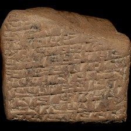 model input (224x224)  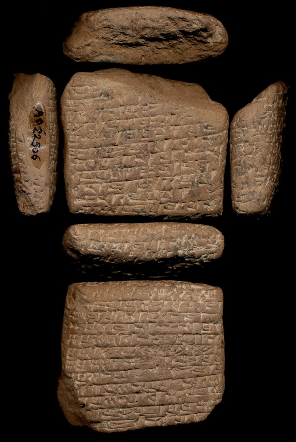 full photo (reference)</td><td valign="top"><table><tr><th>#</th><th>face</th><th>cuneiform</th><th>transliteration</th><th>translation</th></tr><tr><td>1</td><td>obverse</td><td>𒈾 𒋗 𒁉 𒅆 𒅎 𒊹 𒅆 𒅇</td><td>a-na szu-be2-lim im-di2-lim u3</td><td>&mdash;</td></tr><tr><td>2</td><td>obverse</td><td>𒋓 𒍪 𒇻 𒇷 𒆠 𒁉 𒈠</td><td>a-szur3-s,u2-lu-li qi2-bi-ma</td><td>&mdash;</td></tr><tr><td>3</td><td>obverse</td><td>𒌝 𒈠 𒂊 𒈾 𒁉 𒅆 𒈠</td><td>um-ma e-na-be2-lum2-ma</td><td>&mdash;</td></tr><tr><td>4</td><td>obverse</td><td>𒄘 𒐏 𒈠 𒈾 𒀭 𒈾 𒆪 𒉡 𒆪 𒀀</td><td>gu2 4(u) ma-na an-na ku-nu-ku-a</td><td>&mdash;</td></tr><tr><td>5</td><td>obverse</td><td>𒐉 𒌆 𒇷 𒉿 𒁴 𒅇 𒁹 𒈨 𒀜 𒌋 𒁹 𒌆</td><td>4(disz) tug2 li-wi-tim u3 1(disz) me-at 2(u) 1(disz) tug2</td><td>&mdash;</td></tr><tr><td>6</td><td>obverse</td><td>𒆪 𒋫 𒉡 𒂵 𒊹 𒊭 𒇷 𒉿 𒁴</td><td>ku-ta-nu qa2-di2 sza li-wi-tim</td><td>&mdash;</td></tr><tr><td>7</td><td>obverse</td><td>𒆪 𒍣 𒀀 𒌈 𒀠 𒆪 𒄿 𒀀 𒌈</td><td>ku-si2-a-tum al-ku-i-a-tum</td><td>&mdash;</td></tr><tr><td>8</td><td>obverse</td><td>𒌆 𒁍 𒊏 𒌑 𒀖 𒁺 𒊌</td><td>tug2 bu-ra-u2 ab2-tu3-uq</td><td>&mdash;</td></tr><tr><td>9</td><td>obverse</td><td>𒊹 𒐈 𒌆 𒁍 𒊏 𒌑 𒈾 𒅈 𒁍 𒌑</td><td>qa2-di2 3(disz) tug2 bu-ra-u2 na-ar-bu-u2</td><td>&mdash;</td></tr><tr><td>10</td><td>obverse</td><td>x 𒌆 𒇻 𒁍 𒋗 𒁀 𒍣 𒌑 𒌈</td><td>x tug2 lu-bu-szu pa2-s,i2-u2-tum</td><td>&mdash;</td></tr><tr><td>11</td><td>obverse</td><td>𒇻 𒌒 𒌑 𒁹 𒌆 𒆪 𒍣 𒌈</td><td>...-x-lu-ub u2 1(disz) tug2 ku-si2-tum</td><td>&mdash;</td></tr><tr><td>12</td><td>obverse</td><td>𒌈 𒅆𒂟 𒋛𒀀</td><td>...-tum sag10 diri</td><td>&mdash;</td></tr><tr><td>1'</td><td>reverse</td><td>x</td><td>x ...</td><td>&mdash;</td></tr><tr><td>2'</td><td>reverse</td><td>𒅇 𒉌</td><td>u3 ni ...</td><td>&mdash;</td></tr><tr><td>3'</td><td>reverse</td><td>𒌑 𒁀 𒉏</td><td>u2 pa2-nim ...</td><td>&mdash;</td></tr><tr><td>4'</td><td>reverse</td><td>𒀀 𒊹 𒀀 𒇲 𒂵 𒉌</td><td>a-di2 a-la2-ka3-ni lu-qu2-tum</td><td>&mdash;</td></tr><tr><td>5'</td><td>reverse</td><td>𒊭 𒋛 𒅁 𒑰 𒄿 𒋛 𒅎 𒍪</td><td>sza sze2-ep / i-szi2-im-su2-en6</td><td>&mdash;</td></tr><tr><td>6'</td><td>reverse</td><td>𒇻 𒀭 𒈾 𒇻 𒌆 𒄭 𒀀 𒑰 𒋗 𒈠</td><td>lu an-na lu tug2 hi-a / szu-ma</td><td>&mdash;</td></tr><tr><td>7'</td><td>reverse</td><td>𒄿 𒂵 𒉌 𒅖 𒆠 𒑰 𒋛 𒈬 𒌝</td><td>i-ka3-ni-isz / szi2-mu-um</td><td>&mdash;</td></tr><tr><td>8'</td><td>reverse</td><td>𒊑 𒂊 𒋗 𒑰 𒈾 𒋛 𒀭 𒈾 𒆠</td><td>re-e-szu / na-szi2 an-na -ki</td><td>&mdash;</td></tr><tr><td>9'</td><td>reverse</td><td>𒅇 𒌆 𒄭 𒀀 𒄿 𒋫 𒀜 𒇴</td><td>u3 tug2 hi-a i-ta-at,-lam</td><td>&mdash;</td></tr><tr><td>10'</td><td>reverse</td><td>𒊹 𒈾 𒈠 𒆬 𒌓 𒇷 𒊒 𒌒 𒈠</td><td>di2-na-ma ku3-babbar li-ru-ub-ma</td><td>&mdash;</td></tr><tr><td>11'</td><td>reverse</td><td>𒀭 𒈾 𒅇 𒌆 𒄭 𒀀</td><td>an-na u3 tug2 hi-a</td><td>&mdash;</td></tr><tr><td>12'</td><td>reverse</td><td>𒇻 𒊻 𒌑 𒑰 𒋗 𒈠 𒋛 𒈬 𒌝</td><td>lu-us,-u2 / szu-ma szi2-mu-um</td><td>&mdash;</td></tr><tr><td>13'</td><td>reverse</td><td>𒁀 𒄭 𒅅 𒑰 𒀀 𒈾 𒌑 𒀀 𒆠 𒉏</td><td>ba-ti2-iq / a-na u2-<me-a-nim> ke-nim</td><td>&mdash;</td></tr><tr><td>14'</td><td>reverse</td><td>𒁉 𒅅 𒋫 𒈠 𒑰 𒀀 𒈾 𒁍 𒊒 𒍑 𒄩 𒁴</td><td>pi2-iq-da2-ma / a-na bu-ru-usz-ha-tim</td><td>&mdash;</td></tr><tr><td>1</td><td>left</td><td>𒇷 𒊹 𒅔</td><td>li-di2-in</td><td>&mdash;</td></tr></table></td></tr></table>

**Original text (transliteration):**
> - na šu - be₂ - lim im - di₂ - lim u₃ - šur₃ - ṣu₂ - lu - li qi₂ - bi - ma um - ma e - na - be₂ - lum₂ - ma gu₂ 4u ma - na an - na ku - nu - ku - a 4diš tug₂ li - wi - tim u₃ 1diš me - at 2u 1diš tug₂ ku - ta - nu qa₂ - di₂ ša li - wi - tim ku - si₂ - a - tum al - ku - i - a - tum tug₂ bu - ra - u₂ ab₂ - tu₃ - uq - di₂ 3diš tug₂ bu - ra - u₂ na - ar - bu - u₂ x tug₂ lu - bu - šu pa₂ - ṣi₂ - u₂ - tum - x - lu - ub u₂ 1diš tug₂ ku - si₂ - tum - tum sag₁₀ diri u₃ ni u₂ pa₂ - nim a - di₂ a - la₂ - ka₃ - ni ša še₂ - ep / i - ši₂ - im - su₂ - lu an - na lu tug₂ hi - a / šu - ma i - ka₃ - ni - iš ki / ši₂ - mu - um re - e - šu / na - ši₂ an - na - ki u₃ tug₂ hi - a i - ta - aṭ - lam di₂ - na - ma ku₃ - babbar li - ru - ub - ma lu - uṣ - u₂ / šu - ma ši₂ - mu - um ba - ti₂ - iq / a - na u₂ - me - a - nim ke - nim pi₂ - iq - da₂ - ma / a - na bu - ru - uš - ha - tim li - di₂ - in

**Cuneiform (Unicode signs, whole document, not position-aligned to the text above):**
> 𒈾 𒋗 𒁉 𒅆 𒅎 𒄭 𒅆 𒅇 𒋓 𒍪 𒇻 𒇷 𒆠 𒁉 𒈠 𒌝 𒈠 𒂊 𒈾 𒁉 𒅆 𒈠 𒄘 𒈠 𒈾 𒀭 𒈾 𒆪 𒉡 𒆪 𒀀 𒐉 𒌆 𒇷 𒉿 𒁴 𒅇 𒁹 𒈨 𒀜 𒌋𒌋 𒁹 𒌆 𒆪 𒋫 𒉡 𒂵 𒄭 𒊭 𒇷 𒉿 𒁴 𒆪 𒍣 𒀀 𒌈 𒀠 𒆪 𒄿 𒀀 𒌈 𒌆 𒁍 𒊏 𒌑 𒀖 𒁺 𒊌 𒄭 𒐈 𒌆 𒁍 𒊏 𒌑 𒈾 𒅈 𒁍 𒌑 𒌆 𒇻 𒁍 𒋗 𒁀 𒍣 𒌑 𒌈 𒇻 𒌒 𒌑 𒁹 𒌆 𒆪 𒍣 𒌈 𒌈 𒅆𒂟 𒋛𒀀 𒅇 𒉌 𒌑 𒁀 𒉏 𒀀 𒄭 𒀀 𒇲 𒂵 𒉌 𒊭 𒋛 𒅁 𒑰 𒄿 𒋛 𒅎 𒍪 𒇻 𒀭 𒈾 𒇻 𒌆 𒄭 𒀀 𒑰 𒋗 𒈠 𒄿 𒂵 𒉌 𒅖 𒆠 𒑰 𒋛 𒈬 𒌝 𒊑 𒂊 𒋗 𒑰 𒈾 𒋛 𒀭 𒈾 𒆠 𒅇 𒌆 𒄭 𒀀 𒄿 𒋫 𒀜 𒇴 𒄭 𒈾 𒈠 𒆬 𒌓 𒇷 𒊒 𒌒 𒈠 𒇻 𒊻 𒌑 𒑰 𒋗 𒈠 𒋛 𒈬 𒌝 𒁀 𒄭 𒅅 𒑰 𒀀 𒈾 𒌑 𒀀 𒆠 𒉏 𒁉 𒅅 𒋫 𒈠 𒑰 𒀀 𒈾 𒁍 𒊒 𒍑 𒄩 𒁴 𒇷 𒄭 𒅔

**Masked input (58 positions):**
> - na šu - [MASK]₂ - lim im - di₂ - lim u₃ - šur₃ - ṣu₂ - lu [MASK] li qi₂ - bi - ma um - ma e - na - be [MASK] - lum₂ - ma gu₂ 4u ma - na an [MASK] [MASK] [MASK] - nu - ku - a 4diš [MASK] [MASK] [MASK] [MASK] [MASK] wi - tim u₃ 1diš me - at 2u 1diš tu [MASK]₂ ku [MASK] ta - nu qa [MASK] - [MASK]₂ ša li [MASK] wi - tim ku - si₂ - a - tum al - ku - i - a - tum tug [MASK] bu - ra - u₂ ab₂ - tu₃ - uq - di₂ 3diš tug₂ bu - ra [MASK] u₂ na - [MASK] - bu - [MASK]₂ x tug [MASK] [MASK] - bu - šu pa₂ - ṣi₂ - u₂ - tum - x - [MASK] - [MASK]b u [MASK] 1diš tug₂ ku - si [MASK] - tum - tum [MASK]₁ [MASK] diri [MASK]₃ ni u₂ pa₂ - nim [MASK] - di₂ a [MASK] la [MASK] - ka₃ - ni ša še₂ - ep / i - [MASK]₂ - im [MASK] su₂ - lu an - na lu tug₂ hi - [MASK] [MASK] [MASK] - ma [MASK] - ka₃ - [MASK] - iš [MASK] / ši₂ - mu - um re - e - šu / [MASK] - ši₂ an - na - ki [MASK]₃ tu [MASK]₂ hi - a i - [MASK] - aṭ - la [MASK] di [MASK] - na [MASK] ma ku₃ - babbar li [MASK] ru [MASK] u [MASK] [MASK] ma lu - uṣ - u [MASK] / šu - ma [MASK]₂ - mu [MASK] um ba - ti₂ - iq / [MASK] - na u₂ - [MASK] - a - nim [MASK] - nim pi₂ - [MASK]q - da₂ - ma / a - na bu - ru - uš - ha - tim li - di₂ - in

### Restoration (masked-token predictions)

| # | true token | text-only top-1 | text-only top-3 | vision top-1 | vision top-3 | text-only correct | vision correct |
|---|---|---|---|---|---|---|---|
| 1 | `be` | `pi` | `pi`, `di`, `pa` | `di` | `di`, `la`, `pi` | ❌ | ❌ |
| 2 | `-` | `-` | `-`, `##₂`, `##m` | `-` | `-`, `##m`, `##₂` | ✅ | ✅ |
| 3 | `##₂` | `##₂` | `##₂`, `##₃`, `##₄` | `##₂` | `##₂`, `##₃`, `##₄` | ✅ | ✅ |
| 4 | `-` | `-` | `-`, `##še`, `/` | `-` | `-`, `##še`, `/` | ✅ | ✅ |
| 5 | `na` | `na` | `na`, `ta`, `ni` | `na` | `na`, `ni`, `ta` | ✅ | ✅ |
| 6 | `ku` | `ku` | `ku`, `a`, `i` | `ku` | `ku`, `a`, `i` | ✅ | ✅ |
| 7 | `tu` | `tu` | `tu`, `me`, `ša` | `tu` | `tu`, `me`, `ku` | ✅ | ✅ |
| 8 | `##g` | `##g` | `##g`, `-`, `##₂` | `##g` | `##g`, `-`, `##₂` | ✅ | ✅ |
| 9 | `##₂` | `##₂` | `##₂`, `na`, `ša` | `##₂` | `##₂`, `na`, `ša` | ✅ | ✅ |
| 10 | `li` | `li` | `li`, `a`, `na` | `li` | `li`, `a`, `la` | ✅ | ✅ |
| 11 | `-` | `-` | `-`, `##₂`, `/` | `-` | `-`, `##₂`, `a` | ✅ | ✅ |
| 12 | `##g` | `##g` | `##g`, `##m`, `##l` | `##g` | `##g`, `##m`, `##l` | ✅ | ✅ |
| 13 | `-` | `-` | `-`, `##₃`, `##₂` | `-` | `-`, `##₂`, `##₃` | ✅ | ✅ |
| 14 | `##₂` | `##₂` | `##₂`, `##₃`, `##p` | `##₂` | `##₂`, `##₃`, `##r` | ✅ | ✅ |
| 15 | `di` | `ti` | `ti`, `tam`, `u` | `ti` | `ti`, `tam`, `di` | ❌ | ❌ |
| 16 | `-` | `-` | `-`, `##₂`, `/` | `-` | `-`, `##₂`, `/` | ✅ | ✅ |
| 17 | `##₂` | `##₂` | `##₂`, `-`, `##₃` | `##₂` | `##₂`, `-`, `##₃` | ✅ | ✅ |
| 18 | `-` | `-` | `-`, `##₂`, `/` | `-` | `-`, `##₂`, `/` | ✅ | ✅ |
| 19 | `ar` | `ab` | `ab`, `aš`, `ru` | `ab` | `ab`, `aš`, `ra` | ❌ | ❌ |
| 20 | `u` | `u` | `u`, `ti`, `su` | `u` | `u`, `ti`, `su` | ✅ | ✅ |
| 21 | `##₂` | `##₂` | `##₂`, `-`, `##₃` | `##₂` | `##₂`, `##₃`, `-` | ✅ | ✅ |
| 22 | `lu` | `a` | `a`, `ku`, `ha` | `a` | `a`, `ha`, `ku` | ❌ | ❌ |
| 23 | `lu` | `a` | `a`, `ku`, `ta` | `ku` | `ku`, `a`, `šu` | ❌ | ❌ |
| 24 | `u` | `u` | `u`, `gu`, `šu` | `u` | `u`, `gu`, `šu` | ✅ | ✅ |
| 25 | `##₂` | `##₃` | `##₃`, `##₂`, `##₄` | `##₃` | `##₃`, `##₂`, `##₄` | ❌ | ❌ |
| 26 | `##₂` | `##₂` | `##₂`, `##₄`, `##₃` | `##₂` | `##₂`, `##₄`, `##₃` | ✅ | ✅ |
| 27 | `sag` | `sig` | `sig`, `sag`, `eš` | `sag` | `sag`, `sig`, `u` | ❌ | ✅ |
| 28 | `##₀` | `##₀` | `##₀`, `##₁`, `-` | `##₀` | `##₀`, `##₁`, `##₈` | ✅ | ✅ |
| 29 | `u` | `u` | `u`, `ku`, `ša` | `u` | `u`, `ku`, `ša` | ✅ | ✅ |
| 30 | `a` | `a` | `a`, `i`, `ta` | `a` | `a`, `i`, `li` | ✅ | ✅ |
| 31 | `-` | `-` | `-`, `##₂`, `/` | `-` | `-`, `##₂`, `/` | ✅ | ✅ |
| 32 | `##₂` | `##₂` | `##₂`, `##₃`, `##m` | `##₂` | `##₂`, `i`, `##₃` | ✅ | ✅ |
| 33 | `ši` | `di` | `di`, `ši`, `ṣi` | `di` | `di`, `ši`, `ṣi` | ❌ | ❌ |
| 34 | `-` | `-` | `-`, `/`, `ša` | `-` | `-`, `/`, `ša` | ✅ | ✅ |
| 35 | `a` | `a` | `a`, `i`, `na` | `a` | `a`, `i`, `na` | ✅ | ✅ |
| 36 | `/` | `-` | `-`, `/`, `u` | `-` | `-`, `/`, `u` | ❌ | ❌ |
| 37 | `šu` | `um` | `um`, `ki`, `a` | `ki` | `ki`, `um`, `##₂` | ❌ | ❌ |
| 38 | `i` | `i` | `i`, `a`, `ta` | `a` | `a`, `i`, `ta` | ✅ | ❌ |
| 39 | `ni` | `ni` | `ni`, `ri`, `li` | `ni` | `ni`, `ri`, `li` | ✅ | ✅ |
| 40 | `ki` | `/` | `/`, `##kur`, `##₃` | `##kur` | `##kur`, `##₃`, `/` | ❌ | ❌ |
| 41 | `na` | `a` | `a`, `i`, `ma` | `a` | `a`, `i`, `ma` | ❌ | ❌ |
| 42 | `u` | `u` | `u`, `ku`, `/` | `u` | `u`, `ša`, `ku` | ✅ | ✅ |
| 43 | `##g` | `##g` | `##g`, `##l`, `-` | `##g` | `##g`, `##m`, `##l` | ✅ | ✅ |
| 44 | `ta` | `na` | `na`, `ta`, `ba` | `ba` | `ba`, `na`, `ta` | ❌ | ❌ |
| 45 | `##m` | `##₂` | `##₂`, `-`, `##m` | `-` | `-`, `##₂`, `##m` | ❌ | ❌ |
| 46 | `##₂` | `##₂` | `##₂`, `##₃`, `##₄` | `##₂` | `##₂`, `##₃`, `##₄` | ✅ | ✅ |
| 47 | `-` | `-` | `-`, `/`, `##₂` | `-` | `-`, `/`, `a` | ✅ | ✅ |
| 48 | `-` | `-` | `-`, `/`, `##₂` | `-` | `-`, `/`, `##₂` | ✅ | ✅ |
| 49 | `-` | `-` | `-`, `##₂`, `/` | `-` | `-`, `/`, `##₂` | ✅ | ✅ |
| 50 | `##b` | `##₂` | `##₂`, `##b`, `##h` | `##₂` | `##₂`, `##b`, `##h` | ❌ | ❌ |
| 51 | `-` | `-` | `-`, `/`, `a` | `-` | `-`, `/`, `a` | ✅ | ✅ |
| 52 | `##₂` | `##₂` | `##₂`, `##b`, `##ṣ` | `##₂` | `##₂`, `##b`, `##h` | ✅ | ✅ |
| 53 | `ši` | `ši` | `ši`, `ṣi`, `qa` | `ši` | `ši`, `ṣi`, `qi` | ✅ | ✅ |
| 54 | `-` | `-` | `-`, `/`, `##₂` | `-` | `-`, `/`, `.` | ✅ | ✅ |
| 55 | `a` | `a` | `a`, `i`, `an` | `a` | `a`, `i`, `an` | ✅ | ✅ |
| 56 | `me` | `ta` | `ta`, `ra`, `na` | `ta` | `ta`, `bi`, `ba` | ❌ | ❌ |
| 57 | `ke` | `a` | `a`, `an`, `šu` | `a` | `a`, `i`, `šu` | ❌ | ❌ |
| 58 | `i` | `i` | `i`, `e`, `u` | `i` | `i`, `e`, `u` | ✅ | ✅ |

Top-1 accuracy on this example: text-only 41/58 (71%), vision 41/58 (71%)

### Metadata predictions

| head | ground truth | text-only prediction | vision prediction |
|---|---|---|---|
| period | Old Assyrian | Old Assyrian (0.92) | Old Assyrian (0.94) |
| genre | Letters | Letters (0.84) | Letters (0.83) |
| language | Akkadian | Akkadian (0.90) | Akkadian (0.90) |
| provenience | Kanesh | Kanesh (0.93) | Kanesh (0.95) |

---

## Example 14 — `P242347` (has photo: True)

*ARET 03, 155 -- Administrative, Ebla, Ebla (mod. Tell Mardikh) -- National Museum of Syria, Idlib, Syria -- published in Testi amministrativi di vario contenuto (Archivio L. 2769: TM.75.G.3000-4101) (Archi, 1982)*

<table><tr><td valign="top" width="240">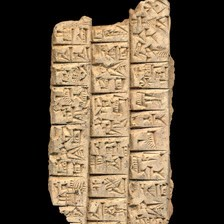 model input (224x224)  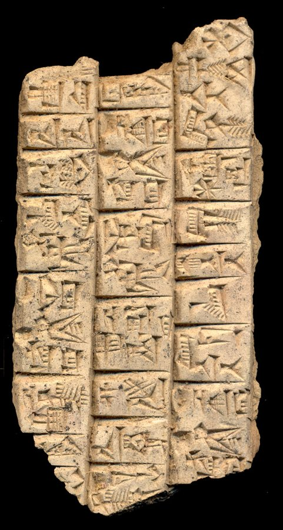 full photo (reference)</td><td valign="top"><table><tr><th>#</th><th>face</th><th>cuneiform</th><th>transliteration</th><th>translation</th></tr><tr><td>1'</td><td>default</td><td>𒀸 𒄈 𒈥 𒌅 𒋾 𒆬 𒄀</td><td>1(asz@c) gir2 mar-tu ti ku3-sig17</td><td>&mdash;</td></tr><tr><td>2'</td><td>default</td><td>𒀸 𒀀𒋢 𒌆 𒀸 𒁯 𒌆</td><td>1(asz@c) aktum 1(asz@c) |IB2+3(DISZ@t)| dar tug2</td><td>&mdash;</td></tr><tr><td>3'</td><td>default</td><td>𒁮 𒁕 𒀧</td><td>dam-da-il</td><td>&mdash;</td></tr><tr><td>4'</td><td>default</td><td>𒀀 𒊏 𒂍 𒀜 𒆠</td><td>a-ra-'a3-ad</td><td>&mdash;</td></tr><tr><td>5'</td><td>default</td><td>𒀸 𒊩 𒌆 𒀸 𒁯 𒌆</td><td>1(asz@c) SAL 1(asz@c) |IB2+3(DISZ@t)| dar tug2</td><td>&mdash;</td></tr><tr><td>6'</td><td>default</td><td>𒋗 𒀀𒀭𒂷 𒋾</td><td>szu ba4-ti</td><td>&mdash;</td></tr><tr><td>7'</td><td>default</td><td>𒀸 𒀀𒋢 𒌆 𒀸 𒁯 𒌆</td><td>1(asz@c) aktum 1(asz@c) |IB2+3(DISZ@t)| dar tug2 ...</td><td>&mdash;</td></tr><tr><td>8'</td><td>default</td><td>x</td><td>x x ...</td><td>&mdash;</td></tr></table></td></tr></table>

**Original text (transliteration):**
> kak - mi - um DU - DU si - in en - na - il 1aš @ c SAL 1aš @ c IB2 + 3DIŠ @ t dar tug₂ a - zi - um 1aš @ c aktum 1aš @ c IB2 + 3DIŠ @ t dar tug₂ dam - da - il a - ra - ' a₃ - ad du - bi₂ 1aš @ c gu - zi - dum ... 1aš @ c gir₂ mar - tu ti ku₃ - sig₁₇ u₃ - ra - an šu - du₈ aš₂ - ti šu ba₄ - ti 1aš @ c aktum 1aš @ c IB2 + 3DIŠ @ t dar tug₂ ...

**Masked input (21 positions):**
> kak - mi - um DU [MASK] [MASK] si - in en - na - il 1aš @ c SA [MASK] 1aš @ c IB2 + [MASK] [MASK]Š @ t dar tug₂ a - zi - um [MASK] [MASK] c aktum 1aš @ c IB2 + 3DIŠ [MASK] [MASK] dar tug₂ dam - da - il a [MASK] ra [MASK] ' a [MASK] [MASK] ad du - bi₂ 1aš @ c gu - zi - dum ... 1aš @ c gir₂ mar - tu ti ku₃ - sig₁₇ u₃ - [MASK] - an šu - du₈ [MASK]₂ - ti [MASK] ba₄ - ti 1aš @ c [MASK] [MASK] 1aš @ c [MASK]2 + 3DIŠ @ [MASK] dar tu [MASK]₂ ...

### Restoration (masked-token predictions)

| # | true token | text-only top-1 | text-only top-3 | vision top-1 | vision top-3 | text-only correct | vision correct |
|---|---|---|---|---|---|---|---|
| 1 | `-` | `##₃` | `##₃`, `-`, `##B` | `##₃` | `##₃`, `-`, `##G` | ❌ | ❌ |
| 2 | `DU` | `-` | `-`, `##₃`, `##₂` | `-` | `-`, `##₃`, `##₂` | ❌ | ❌ |
| 3 | `##L` | `##L` | `##L`, `##G`, `##₂` | `##L` | `##L`, `##G`, `##GA` | ✅ | ✅ |
| 4 | `3D` | `3D` | `3D`, `2D`, `2` | `3D` | `3D`, `2D`, `4` | ✅ | ✅ |
| 5 | `##I` | `##I` | `##I`, `##A`, `##U` | `##I` | `##I`, `##A`, `##U` | ✅ | ✅ |
| 6 | `1aš` | `1aš` | `1aš`, `1u`, `2u` | `1aš` | `1aš`, `1u`, `2u` | ✅ | ✅ |
| 7 | `@` | `@` | `@`, `-`, `:` | `@` | `@`, `-`, `'` | ✅ | ✅ |
| 8 | `@` | `@` | `@`, `'`, `-` | `@` | `@`, `'`, `-` | ✅ | ✅ |
| 9 | `t` | `t` | `t`, `T`, `c` | `t` | `t`, `T`, `c` | ✅ | ✅ |
| 10 | `-` | `-` | `-`, `##₂`, `'` | `-` | `-`, `##₂`, `'` | ✅ | ✅ |
| 11 | `-` | `-` | `-`, `##₂`, `##₃` | `-` | `-`, `##₂`, `##₃` | ✅ | ✅ |
| 12 | `##₃` | `-` | `-`, `##₂`, `ma` | `-` | `-`, `##₂`, `##₃` | ❌ | ❌ |
| 13 | `-` | `-` | `-`, `um`, `a` | `-` | `-`, `a`, `'` | ✅ | ✅ |
| 14 | `ra` | `ma` | `ma`, `da`, `ba` | `ma` | `ma`, `da`, `ba` | ❌ | ❌ |
| 15 | `aš` | `u` | `u`, `e`, `lu` | `e` | `e`, `u`, `gir` | ❌ | ❌ |
| 16 | `šu` | `-` | `-`, `šu`, `ki` | `-` | `-`, `šu`, `ša` | ❌ | ❌ |
| 17 | `akt` | `SA` | `SA`, `GA`, `akt` | `SA` | `SA`, `akt`, `GA` | ❌ | ❌ |
| 18 | `##um` | `##₂` | `##₂`, `##L`, `##G` | `##₂` | `##₂`, `##₃`, `##₄` | ❌ | ❌ |
| 19 | `IB` | `IB` | `IB`, `##IB`, `B` | `IB` | `IB`, `##IB`, `B` | ✅ | ✅ |
| 20 | `t` | `t` | `t`, `T`, `c` | `t` | `t`, `T`, `c` | ✅ | ✅ |
| 21 | `##g` | `##g` | `##g`, `##gin`, `##h` | `##g` | `##g`, `##h`, `##gin` | ✅ | ✅ |

Top-1 accuracy on this example: text-only 13/21 (62%), vision 13/21 (62%)

### Metadata predictions

| head | ground truth | text-only prediction | vision prediction |
|---|---|---|---|
| period | Third Millennium | Third Millennium (0.90) | Third Millennium (0.87) |
| genre | Administrative | Administrative (0.90) | Administrative (0.91) |
| language | Peripheral/Other | Peripheral/Other (0.96) | Peripheral/Other (0.96) |
| provenience | Ebla | Ebla (0.97) | Ebla (0.98) |

---

## Example 15 — `P401113` (has photo: True)

*Gilgamesh fragment -- Neo-Assyrian -- The British Museum*

<table><tr><td valign="top" width="240">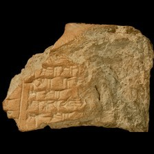 model input (224x224)  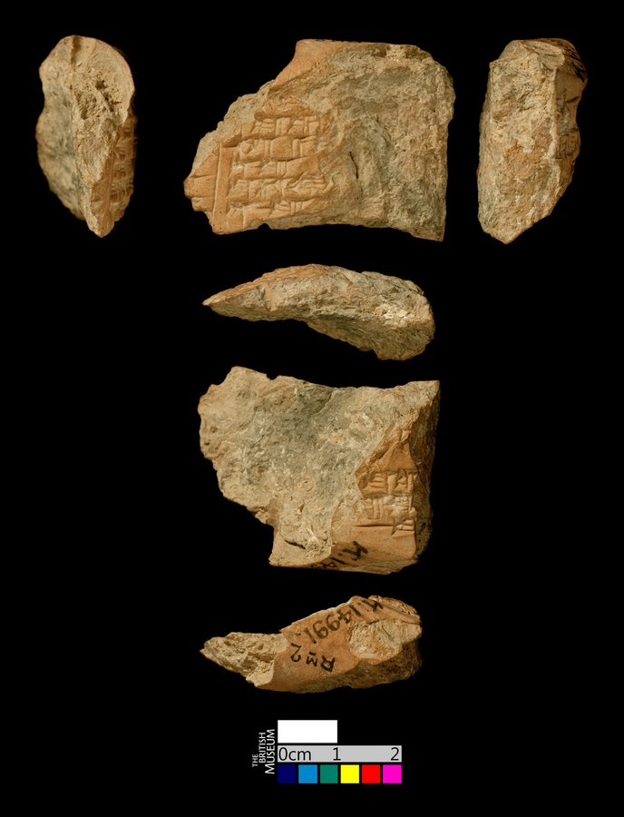 full photo (reference)</td><td valign="top"><table><tr><th>#</th><th>face</th><th>cuneiform</th><th>transliteration</th><th>translation</th></tr><tr><td>1</td><td>obverse</td><td>x</td><td>%sux ... & %sb x x ...</td><td>&mdash;</td></tr><tr><td>2</td><td>obverse</td><td>𒈪</td><td>%sux ... & %sb x-mi ...</td><td>&mdash;</td></tr><tr><td>3</td><td>obverse</td><td>𒀀 𒍢 𒂊</td><td>%sux ... & %sb a-ṣe-e-ri x</td><td>&mdash;</td></tr><tr><td>4</td><td>obverse</td><td>𒅇 𒀀 𒁹</td><td>%sux ... & %sb u₃ a-ma-x</td><td>&mdash;</td></tr><tr><td>5</td><td>obverse</td><td>x</td><td>%sux ... x & %sb AN.TA x x</td><td>&mdash;</td></tr><tr><td>6</td><td>obverse</td><td>x 𒋗 𒄯</td><td>%sux ... x & %sb šu-us₂-hur-tu x x</td><td>&mdash;</td></tr><tr><td>7</td><td>obverse</td><td>x x</td><td>%sux ... x & %sb AN.TA x x x</td><td>&mdash;</td></tr><tr><td>1'</td><td>reverse</td><td>x</td><td>%sux ... & %sb x x x x</td><td>&mdash;</td></tr><tr><td>2'</td><td>reverse</td><td>𒌋</td><td>%sux ... & %sb x x-mu-u</td><td>&mdash;</td></tr><tr><td>3'</td><td>reverse</td><td>𒋗 𒌑</td><td>%sux ... & %sb x x-x šu-u₂</td><td>&mdash;</td></tr><tr><td>4'</td><td>reverse</td><td></td><td>%sux ... & %sb x x AN.TA.KI.TA</td><td>&mdash;</td></tr><tr><td>5'</td><td>reverse</td><td></td><td>%sux ... & %sb AN.TA</td><td>&mdash;</td></tr><tr><td>6'</td><td>reverse</td><td></td><td>%sux ... & %sb ($ $)</td><td>&mdash;</td></tr></table></td></tr></table>

**Original text (transliteration):**
> % sux ... & % sb a - ṣe - e - ri x % sux ... & % sb u₃ a - ma - x % sux ... x & % sb šu - us₂ - hur - tu x x

**Cuneiform (Unicode signs, whole document, not position-aligned to the text above):**
> 𒀀 𒍢 𒂊 𒅇 𒀀 𒁹 x 𒋗 𒄯

**Masked input (6 positions):**
> % su [MASK] ... & % sb a - ṣe - e - ri x % sux ... & % sb u [MASK] a - ma - x [MASK] sux ... x & % s [MASK] šu - us₂ - [MASK] - [MASK] x x

### Restoration (masked-token predictions)

| # | true token | text-only top-1 | text-only top-3 | vision top-1 | vision top-3 | text-only correct | vision correct |
|---|---|---|---|---|---|---|---|
| 1 | `##x` | `##x` | `##x`, `##₃`, `##X` | `##x` | `##x`, `##X`, `##₃` | ✅ | ✅ |
| 2 | `##₃` | `##₃` | `##₃`, `##₂`, `-` | `-` | `-`, `##₃`, `##₂` | ✅ | ❌ |
| 3 | `%` | `%` | `%`, `.`, `-` | `%` | `%`, `-`, `.` | ✅ | ✅ |
| 4 | `##b` | `##b` | `##b`, `##₂`, `##d` | `##b` | `##b`, `##d`, `##₂` | ✅ | ✅ |
| 5 | `hur` | `sa` | `sa`, `su`, `ma` | `sa` | `sa`, `su`, `a` | ❌ | ❌ |
| 6 | `tu` | `ma` | `ma`, `ni`, `ri` | `ma` | `ma`, `ni`, `a` | ❌ | ❌ |

Top-1 accuracy on this example: text-only 4/6 (67%), vision 3/6 (50%)

### Metadata predictions

| head | ground truth | text-only prediction | vision prediction |
|---|---|---|---|
| period | Neo-Assyrian | Neo-Assyrian (0.85) | Neo-Assyrian (0.77) |
| genre | Literary & Scholarly | Administrative (0.35) | Literary & Scholarly (0.40) **<- differs** |
| language | Akkadian | Akkadian (0.87) | Akkadian (0.89) |
| provenience | Nineveh | Nineveh (0.78) | Nineveh (0.93) |

---

## Example 16 — `P228051` (has photo: False)

*CDLI Lexical 000031, ex. 003 -- Lexical, Old Babylonian, Nippur (mod. Nuffar) -- Penn Museum, Philadelphia, Pennsylvania, USA*

**Original text (transliteration):**
> 1U uz AMA 1U maš₂ si₄ ab₂ ga gu₇ - eš amar ga naŋ - eš 3AŠ ziz₂ GANA₂ ... ANŠE - da ri - a nunuz kad₄ - gam 1ŋeš₂ 1u 1diš uri IŠ ZU šag₄ nam - gu₂ sig₁₀ amar ga - ... 5aš ŋir₂ AN 1U LUL×Xda₃ nunuz kad₄ - ... 1ŋeš₂ 1u 1diš ki ŠAR₂×2U ZI & ZI ... x x x ri - a PAP - PU₂ - bi PAP - PU₂ U₂. X. ZU & U₂. X. ZUbi apin erin₂ ... ZI & ZI. LAGABra ZI & ZI. LAGAB BAD - a ZI & ZI. LAGAB dur EN gana₂ ... BA - x

**Cuneiform (Unicode signs, whole document, not position-aligned to the text above):**
> 𒌋 𒊻 𒂼 𒌋 𒈧 𒋜 𒀖 𒂵 𒅥 𒌍 𒀫 𒂵 𒅘 𒌍 𒐁 𒍩 𒃷 [#] 𒀲 𒁕 𒊑 𒀀 𒉭 𒆒 𒃵 𒄷 𒐕 𒌋 𒁹 𒌵 𒊑 𒅖 𒍪 𒊮 𒉆 𒄘 𒋧 𒀫 𒂵 [#] 𒐃 𒄈 𒀭 𒌋 X 𒆕 𒉭 𒆒 [#] 𒄷 𒐕 𒌋 𒁹 𒆠 󰀽 𒍤 [#] X X X 𒊑 𒀀 𒉽 𒇥 𒁉 𒉽 𒇥 X 𒁉 𒄑 𒀳 𒂟 [#] 𒍤𒆸 𒊏 𒍤𒆸 𒄑 𒁁 𒀀 𒍤𒆸 𒄙 𒄑 𒂗 𒃷 [#] 𒁀 X

**Masked input (28 positions):**
> 1U uz AMA 1U maš [MASK] si₄ ab₂ ga gu [MASK] - eš amar ga naŋ [MASK] eš 3AŠ [MASK]z₂ GA [MASK]₂ ... ANŠE [MASK] da ri - a nunuz [MASK]₄ - gam 1ŋeš₂ 1u [MASK] [MASK] I [MASK] ZU šag [MASK] nam - [MASK]₂ sig₁ [MASK] amar ga - ... 5aš ŋir₂ [MASK] 1U LUL×Xda₃ nunuz kad₄ [MASK] ... 1ŋeš₂ 1u 1diš ki ŠAR₂×2U ZI & ZI ... x x x [MASK] [MASK] a PA [MASK] - P [MASK]₂ - bi PAP - PU₂ U₂. X. ZU & U₂. X. ZUbi apin erin [MASK] ... ZI & Z [MASK]. LAGABra [MASK] [MASK] & Z [MASK] [MASK] LAGAB BAD [MASK] a ZI & ZI [MASK] LAGAB dur EN [MASK]₂ ... BA - x

### Restoration (masked-token predictions)

| # | true token | text-only top-1 | text-only top-3 | vision top-1 | vision top-3 | text-only correct | vision correct |
|---|---|---|---|---|---|---|---|
| 1 | `##₂` | `##₂` | `##₂`, `-`, `##₄` | `##₂` | `##₂`, `-`, `##₄` | ✅ | ✅ |
| 2 | `##₇` | `##b` | `##b`, `##₂`, `##₄` | `##₂` | `##₂`, `##b`, `##₄` | ❌ | ❌ |
| 3 | `-` | `-` | `-`, `##₂`, `##₄` | `-` | `-`, `##₂`, `##₃` | ✅ | ✅ |
| 4 | `zi` | `zi` | `zi`, `gu`, `gi` | `zi` | `zi`, `gu`, `ama` | ✅ | ✅ |
| 5 | `##NA` | `##N` | `##N`, `##R`, `##BA` | `##N` | `##N`, `##R`, `##Z` | ❌ | ❌ |
| 6 | `-` | `-` | `-`, `amar`, `ama` | `-` | `-`, `amar`, `uz` | ✅ | ✅ |
| 7 | `kad` | `sig` | `sig`, `gu`, `u` | `sig` | `sig`, `kad`, `gu` | ❌ | ❌ |
| 8 | `1diš` | `1diš` | `1diš`, `2diš`, `5diš` | `1diš` | `1diš`, `1`, `2diš` | ✅ | ✅ |
| 9 | `uri` | `ki` | `ki`, `-`, `##₂` | `ki` | `ki`, `-`, `##₂` | ❌ | ❌ |
| 10 | `##Š` | `.` | `.`, `##Š`, `&` | `.` | `.`, `##Š`, `&` | ❌ | ❌ |
| 11 | `##₄` | `##₄` | `##₄`, `##₂`, `##₃` | `##₄` | `##₄`, `##₂`, `##₃` | ✅ | ✅ |
| 12 | `gu` | `ga` | `ga`, `lu`, `gal` | `lu` | `lu`, `ga`, `gu` | ❌ | ❌ |
| 13 | `##₀` | `##₇` | `##₇`, `##₅`, `##₄` | `##₅` | `##₅`, `##₇`, `##₄` | ❌ | ❌ |
| 14 | `AN` | `-` | `-`, `ga`, `ki` | `ga` | `ga`, `gal`, `ki` | ❌ | ❌ |
| 15 | `-` | `-` | `-`, `ga`, `ki` | `-` | `-`, `ga`, `amar` | ✅ | ✅ |
| 16 | `ri` | `ri` | `ri`, `a`, `AN` | `ri` | `ri`, `a`, `ra` | ✅ | ✅ |
| 17 | `-` | `-` | `-`, `##₂`, `##₃` | `-` | `-`, `##₂`, `##₃` | ✅ | ✅ |
| 18 | `##P` | `##P` | `##P`, `##D`, `##B` | `##P` | `##P`, `##B`, `##D` | ✅ | ✅ |
| 19 | `##U` | `##U` | `##U`, `##I`, `##UR` | `##U` | `##U`, `##I`, `##UR` | ✅ | ✅ |
| 20 | `##₂` | `##₂` | `##₂`, `-`, `##₃` | `##₂` | `##₂`, `-`, `##₃` | ✅ | ✅ |
| 21 | `##I` | `##I` | `##I`, `##A`, `##U` | `##I` | `##I`, `##A`, `##U` | ✅ | ✅ |
| 22 | `Z` | `Z` | `Z`, `##Z`, `##x` | `Z` | `Z`, `##Z`, `##x` | ✅ | ✅ |
| 23 | `##I` | `##I` | `##I`, `##₂`, `##A` | `##I` | `##I`, `##₂`, `##A` | ✅ | ✅ |
| 24 | `##I` | `##I` | `##I`, `##A`, `##U` | `##I` | `##I`, `##A`, `##U` | ✅ | ✅ |
| 25 | `.` | `.` | `.`, `-`, `&` | `.` | `.`, `-`, `&` | ✅ | ✅ |
| 26 | `-` | `-` | `-`, `~`, `##₂` | `-` | `-`, `##₂`, `~` | ✅ | ✅ |
| 27 | `.` | `.` | `.`, `&`, `-` | `.` | `.`, `-`, `&` | ✅ | ✅ |
| 28 | `gana` | `##GA` | `##GA`, `##D`, `u` | `##GA` | `##GA`, `##D`, `##G` | ❌ | ❌ |

Top-1 accuracy on this example: text-only 19/28 (68%), vision 19/28 (68%)

### Metadata predictions

| head | ground truth | text-only prediction | vision prediction |
|---|---|---|---|
| period | Old Babylonian | Old Babylonian (0.56) | Old Babylonian (0.52) |
| genre | Lexical | Lexical (0.88) | Lexical (0.88) |
| language | Sumerian | Sumerian (0.89) | Sumerian (0.82) |
| provenience | Nippur | Nippur (0.68) | Nippur (0.44) |

---

## Example 17 — `P211424` (has photo: True)

*Hermitage 3, 027 -- Administrative, Ur III, Girsu (mod. Tello) -- State Hermitage Museum, St. Petersburg, Russian Federation -- published in Hermitage 3 (Koslova, nd)*

<table><tr><td valign="top" width="240">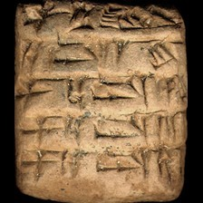 model input (224x224)  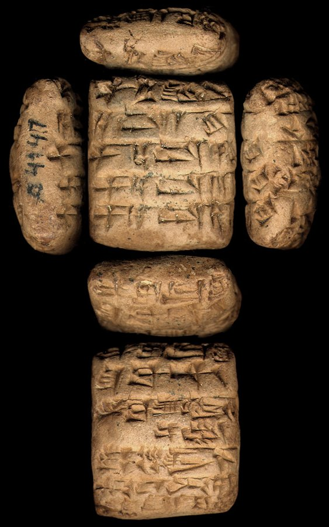 full photo (reference)</td><td valign="top"><table><tr><th>#</th><th>face</th><th>cuneiform</th><th>transliteration</th><th>translation</th></tr><tr><td>1</td><td>obverse</td><td>𒑏 𒃻 𒈗</td><td>1(ban2) ninda lugal</td><td>&mdash;</td></tr><tr><td>2</td><td>obverse</td><td>𒀀 𒁺 𒁹 𒄭𒁁</td><td>a-ra2 1(disz)-kam</td><td>&mdash;</td></tr><tr><td>3</td><td>obverse</td><td>𒑏 𒀀 𒁺 𒁹 𒄭𒁁</td><td>1(ban2) a-ra2 2(disz)-kam</td><td>&mdash;</td></tr><tr><td>4</td><td>obverse</td><td>𒑏 𒀀 𒁺 𒐈 𒄭𒁁</td><td>1(ban2) a-ra2 3(disz)-kam</td><td>&mdash;</td></tr><tr><td>5</td><td>obverse</td><td>𒑏 𒀀 𒁺 𒐉 𒄭𒁁</td><td>1(ban2) a-ra2 4(disz)-kam</td><td>&mdash;</td></tr><tr><td>1</td><td>reverse</td><td>𒉺𒇻 𒌨 𒂠</td><td>sipa ur-gi7</td><td>&mdash;</td></tr><tr><td>2</td><td>reverse</td><td>𒋗 𒁀 𒋾</td><td>szu ba-ti</td><td>&mdash;</td></tr><tr><td>3</td><td>reverse</td><td>𒁀 𒁀𒌑 𒌈 𒄖 𒌌 𒑐𒁽</td><td>ba-ba6-ib2-gu-ul maszkim</td><td>&mdash;</td></tr><tr><td>4</td><td>reverse</td><td>𒌚 𒊺 𒆥 𒋻</td><td>iti sze-sag11-ku5</td><td>&mdash;</td></tr><tr><td>5</td><td>reverse</td><td>𒈬 𒄑 𒄖 𒍝 𒂗 𒆤 𒇲 𒁀 𒁶</td><td>mu gu-za en-lil2-la2 ba-dim2</td><td>&mdash;</td></tr></table></td></tr></table>

**Original text (transliteration):**
> 1ban₂ ninda lugal 1ban₂ a - ra₂ 2diš - kam 1ban₂ a - ra₂ 3diš - kam 1ban₂ a - ra₂ 4diš - kam sipa ur - gi₇ D ba - ba₆ - ib₂ - gu - ul maškim

**Cuneiform (Unicode signs, whole document, not position-aligned to the text above):**
> 𒑏 𒃻 𒈗 𒑏 𒀀 𒁺 𒈫 𒄰 𒑏 𒀀 𒁺 𒐈 𒄰 𒑏 𒀀 𒁺 𒐉 𒄰 𒉺𒇻 𒌨 𒂠 <D> 𒁀 𒌑 𒌈 𒄖 𒌌 𒉺𒁽

**Masked input (8 positions):**
> 1ban₂ ninda lugal 1ban₂ a [MASK] ra₂ 2diš - kam 1 [MASK] [MASK] a [MASK] ra₂ 3diš - kam 1ban₂ a - ra₂ 4diš [MASK] kam sipa [MASK] - gi₇ D ba - [MASK]₆ - ib₂ - gu - ul maš [MASK]

### Restoration (masked-token predictions)

| # | true token | text-only top-1 | text-only top-3 | vision top-1 | vision top-3 | text-only correct | vision correct |
|---|---|---|---|---|---|---|---|
| 1 | `-` | `-` | `-`, `##₂`, `.` | `-` | `-`, `##₂`, `.` | ✅ | ✅ |
| 2 | `##ban` | `##ban` | `##ban`, `##geš`, `##barig` | `##ban` | `##ban`, `##geš`, `##ba` | ✅ | ✅ |
| 3 | `##₂` | `##₂` | `##₂`, `##₃`, `##₁` | `##₂` | `##₂`, `##₃`, `-` | ✅ | ✅ |
| 4 | `-` | `-` | `-`, `##₂`, `.` | `-` | `-`, `##₂`, `.` | ✅ | ✅ |
| 5 | `-` | `-` | `-`, `.`, `+` | `-` | `-`, `.`, `:` | ✅ | ✅ |
| 6 | `ur` | `kin` | `kin`, `ur`, `geš` | `kin` | `kin`, `šu`, `ur` | ❌ | ❌ |
| 7 | `ba` | `ba` | `ba`, `sa`, `du` | `ba` | `ba`, `sa`, `du` | ✅ | ✅ |
| 8 | `##kim` | `##kim` | `##kim`, `##₂`, `ki` | `##kim` | `##kim`, `##₂`, `ki` | ✅ | ✅ |

Top-1 accuracy on this example: text-only 7/8 (88%), vision 7/8 (88%)

### Metadata predictions

| head | ground truth | text-only prediction | vision prediction |
|---|---|---|---|
| period | Ur III | Ur III (0.93) | Ur III (0.95) |
| genre | Administrative | Administrative (0.94) | Administrative (0.95) |
| language | Sumerian | Sumerian (0.92) | Sumerian (0.95) |
| provenience | Girsu | Umma (0.47) | Umma (0.50) |

---

## Example 18 — `P135581` (has photo: True)

*TUT 010 -- Administrative, Ur III, Girsu (mod. Tello) -- Vorderasiatisches Museum, Berlin, Germany -- published in Tempelurkunden aus Telloh (Reisner, 1901)*

<table><tr><td valign="top" width="240">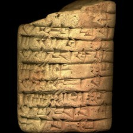 model input (224x224)  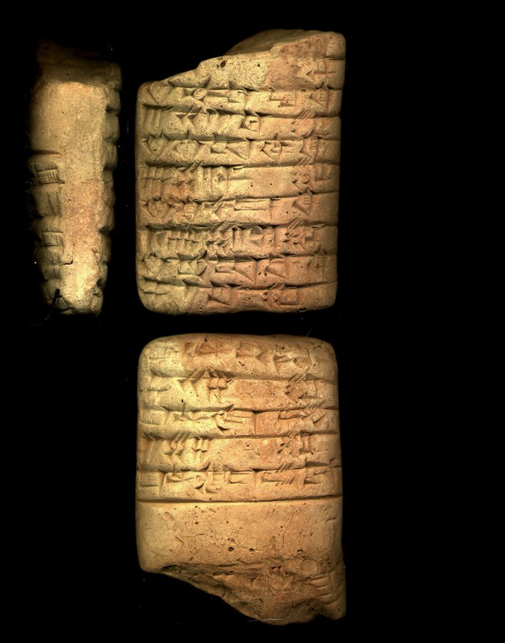 full photo (reference)</td><td valign="top"><table><tr><th>#</th><th>face</th><th>cuneiform</th><th>transliteration</th><th>translation</th></tr><tr><td>1</td><td>obverse</td><td>x</td><td>... x</td><td>&mdash;</td></tr><tr><td>2</td><td>obverse</td><td>𒌋 𒊬</td><td>... 2(u) sar</td><td>&mdash;</td></tr><tr><td>3</td><td>obverse</td><td>𒊮 𒋓𒁓𒆷 𒆠</td><td>sza3 lagasz</td><td>&mdash;</td></tr><tr><td>4</td><td>obverse</td><td>𒐗 𒌋 𒁹 𒑛 𒊬</td><td>3(gesz2) 2(u) 2(disz) 2/3(disz) sar</td><td>&mdash;</td></tr><tr><td>5</td><td>obverse</td><td>𒊮 𒆠 𒁲 𒆠</td><td>sza3 ki-es3-sa2</td><td>&mdash;</td></tr><tr><td>6</td><td>obverse</td><td>𒐚 𒐏 𒁹 𒈦 𒊬</td><td>6(gesz2) 4(u) 2(disz) 1/2(disz) sar</td><td>&mdash;</td></tr><tr><td>7</td><td>obverse</td><td>𒊮 𒆠 𒉡 𒉪 𒆠</td><td>sza3 ki-nu-nir</td><td>&mdash;</td></tr><tr><td>8</td><td>obverse</td><td>𒐞 𒐜 𒐏 𒁹 𒈦 𒊬</td><td>1(gesz'u) 8(gesz2) 4(u) 2(disz) 1/2(disz) sar</td><td>&mdash;</td></tr><tr><td>9</td><td>obverse</td><td>𒊮 𒄘 𒀊 𒁀 𒆠</td><td>sza3 gu2-ab-ba</td><td>&mdash;</td></tr><tr><td>10</td><td>obverse</td><td>𒐘 𒁹 𒑛 𒊬</td><td>4(gesz2) 1(disz) 2/3(disz) sar</td><td>&mdash;</td></tr><tr><td>1</td><td>reverse</td><td>𒂍 𒀫 𒂗𒍪</td><td>e2 amar-suen</td><td>&mdash;</td></tr><tr><td>2</td><td>reverse</td><td>𒐘 𒌋 𒐊 𒊬</td><td>4(gesz2) 2(u) 5(disz) sar</td><td>&mdash;</td></tr><tr><td>3</td><td>reverse</td><td>𒂍 𒂄 𒄀</td><td>e2 szul-gi</td><td>&mdash;</td></tr><tr><td>4</td><td>reverse</td><td>𒐖 𒐐 𒐊 𒊬</td><td>2(gesz2) 5(u) 5(disz) sar</td><td>&mdash;</td></tr><tr><td>5</td><td>reverse</td><td>𒂍 𒊩𒌆 𒄑 𒍣 𒁕</td><td>e2 nin-gesz-zi-da</td><td>&mdash;</td></tr><tr><td>6</td><td>reverse</td><td>𒄑 𒆥</td><td>... gesz-kin</td><td>&mdash;</td></tr></table></td></tr></table>

**Original text (transliteration):**
> 6geš₂ 4u 2diš 1 / 2diš sar 1geš ' u 8geš₂ 4u 2diš 1 / 2diš sar 4geš₂ 2u 5diš sar

**Cuneiform (Unicode signs, whole document, not position-aligned to the text above):**
> 𒐚 𒈫 𒈦 𒊬 𒈫 𒈦 𒊬 𒌋𒌋 𒐊 𒊬

**Masked input (5 positions):**
> 6geš₂ 4u 2diš [MASK] / [MASK] sar 1geš ' u 8geš [MASK] [MASK]u 2diš 1 / 2diš sar 4geš₂ 2u 5diš sa [MASK]

### Restoration (masked-token predictions)

| # | true token | text-only top-1 | text-only top-3 | vision top-1 | vision top-3 | text-only correct | vision correct |
|---|---|---|---|---|---|---|---|
| 1 | `1` | `1` | `1`, `2`, `5` | `1` | `1`, `2`, `5` | ✅ | ✅ |
| 2 | `2diš` | `2diš` | `2diš`, `3diš`, `6diš` | `2diš` | `2diš`, `3diš`, `6diš` | ✅ | ✅ |
| 3 | `##₂` | `##₂` | `##₂`, `'`, `##₃` | `##₂` | `##₂`, `'`, `##₃` | ✅ | ✅ |
| 4 | `4` | `4` | `4`, `3`, `5` | `4` | `4`, `3`, `5` | ✅ | ✅ |
| 5 | `##r` | `##r` | `##r`, `##₂`, `##₆` | `##r` | `##r`, `##₂`, `##₃` | ✅ | ✅ |

Top-1 accuracy on this example: text-only 5/5 (100%), vision 5/5 (100%)

### Metadata predictions

| head | ground truth | text-only prediction | vision prediction |
|---|---|---|---|
| period | Ur III | Ur III (0.91) | Ur III (0.93) |
| genre | Administrative | Administrative (0.91) | Administrative (0.92) |
| language | Sumerian | Sumerian (0.95) | Sumerian (0.94) |
| provenience | Girsu | Umma (0.76) | Umma (0.34) |

---

## Example 19 — `P222171` (has photo: True)

*FTP 104 -- Administrative, ED IIIa, Nippur (mod. Nuffar) -- Penn Museum, Philadelphia, Pennsylvania, USA -- published in The Fara tablets in the University of Pennsylvania Museum of Archaeology and Anthropology (Martin, 2001)*

<table><tr><td valign="top" width="240">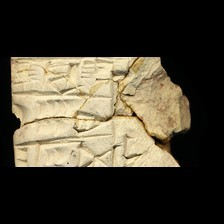 model input (224x224)  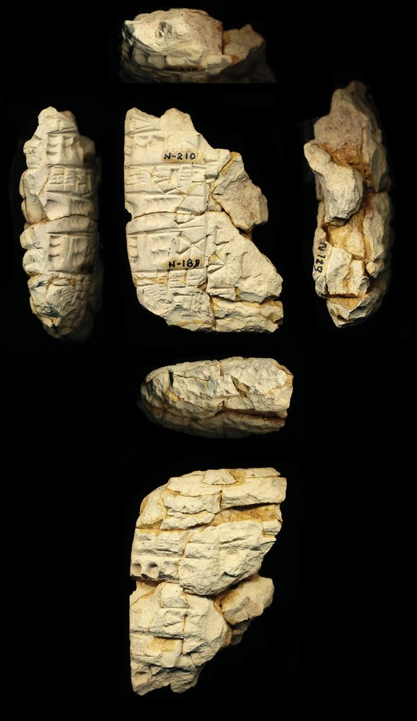 full photo (reference)</td><td valign="top"><table><tr><th>#</th><th>face</th><th>cuneiform</th><th>transliteration</th><th>translation</th></tr><tr><td>1'</td><td>obverse</td><td>𒉌</td><td>... i3-nun</td><td>&mdash;</td></tr><tr><td>2'</td><td>obverse</td><td>𒄥 𒑏</td><td>5(barig@c) 1(ban2@c) gamurx(LAK490)</td><td>&mdash;</td></tr><tr><td>3'</td><td>obverse</td><td>𒂍 𒄑𒈪 𒄭</td><td>e2-gissu-du10</td><td>&mdash;</td></tr><tr><td>4'</td><td>obverse</td><td>𒐕 𒐅 𒉌</td><td>1(gesz2@c) 7(asz@c) i3</td><td>&mdash;</td></tr><tr><td>5'</td><td>obverse</td><td>𒁹𒁹𒁹 𒇲 𒐂 𒋡</td><td>3(barig@c) la2 4(asz@c) sila3 gamurx(LAK490)</td><td>&mdash;</td></tr><tr><td>6'</td><td>obverse</td><td>𒂗 𒆤 𒌺 𒀀</td><td>en-lil2-unken-a</td><td>&mdash;</td></tr><tr><td>1</td><td>reverse</td><td>𒐃 𒋗 𒋳</td><td>x 5(asz@c) gamurx(LAK490) szu-tag</td><td>&mdash;</td></tr><tr><td>2</td><td>reverse</td><td>𒌋 𒐁 𒉌 𒉣</td><td>1(u@c) 3(asz@c) x i3-nun</td><td>&mdash;</td></tr><tr><td>3</td><td>reverse</td><td>𒌋 𒐃</td><td>2(u@c) 5(asz@c) i3-nun</td><td>&mdash;</td></tr><tr><td>4</td><td>reverse</td><td>𒁹</td><td>x 1(barig@c) gamurx(LAK490)</td><td>&mdash;</td></tr><tr><td>5</td><td>reverse</td><td>𒂍 𒄑𒈪 𒄭</td><td>e2-gissu-du10</td><td>&mdash;</td></tr><tr><td>6</td><td>reverse</td><td>𒌋</td><td>1(u@c) x i3-nun</td><td>&mdash;</td></tr></table></td></tr></table>

**Original text (transliteration):**
> 3barig @ c la₂ 4aš @ c sila₃ gamurxLAK490 D nin - kin -

**Cuneiform (Unicode signs, whole document, not position-aligned to the text above):**
> 𒇲 𒋡 <D> 𒊩𒌆 𒆥

**Masked input (4 positions):**
> 3 [MASK] @ c la₂ 4aš [MASK] c sila₃ ga [MASK]xLAK490 D [MASK] - kin -

### Restoration (masked-token predictions)

| # | true token | text-only top-1 | text-only top-3 | vision top-1 | vision top-3 | text-only correct | vision correct |
|---|---|---|---|---|---|---|---|
| 1 | `##barig` | `##u` | `##u`, `##barig`, `##aš` | `##u` | `##u`, `##barig`, `##aš` | ❌ | ❌ |
| 2 | `@` | `@` | `@`, `-`, `'` | `@` | `@`, `'`, `-` | ✅ | ✅ |
| 3 | `##mur` | `##m` | `##m`, `##un`, `ze` | `##m` | `##m`, `##g`, `ze` | ❌ | ❌ |
| 4 | `nin` | `nin` | `nin`, `en`, `šu` | `nin` | `nin`, `en`, `da` | ✅ | ✅ |

Top-1 accuracy on this example: text-only 2/4 (50%), vision 2/4 (50%)

### Metadata predictions

| head | ground truth | text-only prediction | vision prediction |
|---|---|---|---|
| period | Third Millennium | Third Millennium (0.98) | Third Millennium (0.98) |
| genre | Administrative | Administrative (0.93) | Administrative (0.90) |
| language | Sumerian | Sumerian (0.95) | Sumerian (0.94) |
| provenience | Šuruppak | Girsu (0.30) | Nippur (0.20) **<- differs** |

---

## Example 20 — `P110147` (has photo: True)

*HLC 273 (pl. 118) -- Administrative, Ur III, Girsu (mod. Tello) -- Institute for the Study of Ancient Cultures West Asia & North Africa Museum, Chicago, Illinois, USA -- published in HLC (Barton, 1905-1914)*

<table><tr><td valign="top" width="240">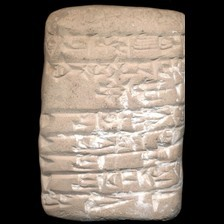 model input (224x224)  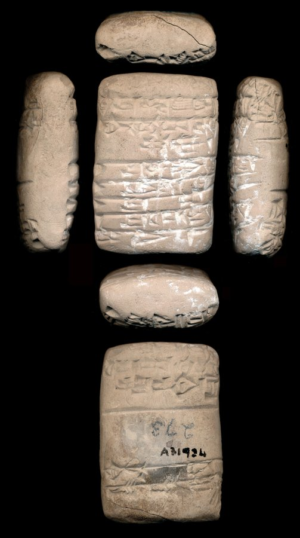 full photo (reference)</td><td valign="top"><table><tr><th>#</th><th>face</th><th>cuneiform</th><th>transliteration</th><th>translation</th></tr><tr><td>1</td><td>obverse</td><td>𒀸 𒄖 𒈾 𒅎 𒂊 𒋺 𒀀</td><td>1(asz@c) gu-na im-e tak4-a</td><td>&mdash;</td></tr><tr><td>2</td><td>obverse</td><td>𒆠 𒌨 𒁀 𒁀𒌑 𒌉 𒀀 𒌅</td><td>ki ur-ba-ba6 dumu a-tu</td><td>&mdash;</td></tr><tr><td>3</td><td>obverse</td><td>𒁔 𒄘 𒀊 𒁀 𒆠 𒈭 𒁮</td><td>bur2 gu2-ab-ba dah-dam</td><td>&mdash;</td></tr><tr><td>4</td><td>obverse</td><td>𒀸 𒌨 𒀠 𒆷</td><td>1(asz@c) ur-al-la</td><td>&mdash;</td></tr><tr><td>5</td><td>obverse</td><td>𒀸 𒇽 𒊷 𒂵</td><td>1(asz) lu2-sa6-ga</td><td>&mdash;</td></tr><tr><td>6</td><td>obverse</td><td>𒀸 𒌨 𒈩</td><td>1(asz) ur-mes</td><td>&mdash;</td></tr><tr><td>7</td><td>obverse</td><td>𒁹 𒌨 𒊕 𒀚 𒆠</td><td>1(disz) ur-sag-ub3</td><td>&mdash;</td></tr><tr><td>8</td><td>obverse</td><td>𒌉 𒉌 𒈨</td><td>dumu-ni-me</td><td>&mdash;</td></tr><tr><td>1</td><td>reverse</td><td>𒀸 𒈗 𒀀 𒈠 𒊒</td><td>1(asz@c) lugal-a-ma-ru</td><td>&mdash;</td></tr><tr><td>2</td><td>reverse</td><td>𒊕 𒀊 𒆠 𒉘 𒉺𒇻 𒑐𒋼𒋛</td><td>sag esz3-ki-ag2 sipa ensi2</td><td>&mdash;</td></tr><tr><td>3</td><td>reverse</td><td>𒁔 𒋫</td><td>bur2-ta</td><td>&mdash;</td></tr><tr><td>4</td><td>reverse</td><td>𒍣 𒍣 𒁮</td><td>zi-zi-dam</td><td>&mdash;</td></tr></table></td></tr></table>

**Original text (transliteration):**
> 1aš @ c gu - na im - e tak₄ - a ki ur - ba - ba₆ dumu a - tu bur₂ gu₂ - ab - ba dah - dam 1aš @ c ur - al - la sag eš₃ - ki - ag₂ sipa ensi₂

**Cuneiform (Unicode signs, whole document, not position-aligned to the text above):**
> 𒀸 𒄖 𒈾 𒅎 𒂊 𒋺 𒀀 𒆠 𒌨 𒁀 𒁀𒌑 𒌉 𒀀 𒌅 𒁔 𒄘 𒀊 𒁀 𒆠 𒈭 𒁮 𒀸 𒌨 𒀠 𒆷 𒊕 𒀊 𒆠 𒉘 𒉺𒇻 𒑐𒋼𒋛

**Masked input (9 positions):**
> 1aš @ c gu - na im - [MASK] [MASK]₄ - a ki ur [MASK] ba - ba₆ [MASK] a - tu bur₂ gu₂ - ab - ba dah - dam 1aš @ c ur - al - [MASK] [MASK] eš₃ [MASK] ki - ag₂ [MASK]pa ensi [MASK]

### Restoration (masked-token predictions)

| # | true token | text-only top-1 | text-only top-3 | vision top-1 | vision top-3 | text-only correct | vision correct |
|---|---|---|---|---|---|---|---|
| 1 | `e` | `du` | `du`, `gur`, `gi` | `du` | `du`, `gur`, `da` | ❌ | ❌ |
| 2 | `tak` | `gi` | `gi`, `##₁`, `##g` | `gi` | `gi`, `##₁`, `##g` | ❌ | ❌ |
| 3 | `-` | `-` | `-`, `##uda`, `##₂` | `-` | `-`, `##uda`, `D` | ✅ | ✅ |
| 4 | `dumu` | `-` | `-`, `dumu`, `ki` | `-` | `-`, `dumu`, `ki` | ❌ | ❌ |
| 5 | `la` | `la` | `la`, `li`, `lu` | `la` | `la`, `lu`, `li` | ✅ | ✅ |
| 6 | `sag` | `-` | `-`, `##₃`, `ki` | `-` | `-`, `ki`, `dumu` | ❌ | ❌ |
| 7 | `-` | `-` | `-`, `ki`, `dumu` | `-` | `-`, `ki`, `dumu` | ✅ | ✅ |
| 8 | `si` | `si` | `si`, `lu`, `tal` | `si` | `si`, `lu`, `tal` | ✅ | ✅ |
| 9 | `##₂` | `##₂` | `##₂`, `##₃`, `##₅` | `##₂` | `##₂`, `-`, `##₃` | ✅ | ✅ |

Top-1 accuracy on this example: text-only 5/9 (56%), vision 5/9 (56%)

### Metadata predictions

| head | ground truth | text-only prediction | vision prediction |
|---|---|---|---|
| period | Ur III | Third Millennium (0.60) | Third Millennium (0.87) |
| genre | Administrative | Administrative (0.91) | Administrative (0.93) |
| language | Sumerian | Sumerian (0.93) | Sumerian (0.93) |
| provenience | Girsu | Girsu (0.82) | Girsu (0.51) |

---
