# Prediction demo: text-only vs vision (provenience) model

20 random test-split tablets, seed=42. Both models see the exact same masked positions per example (bold <strong>?</strong> shown at every chosen position, 15% of eligible tokens) -- differences in restoration come only from the two models' separately trained weights, not from the image itself (the image only reaches `provenience_head`, see module docstring). The metadata table's `provenience` row is where the image can actually change an answer.

## Example 1 — `P116446` (has photo: False)

*MVN 12, 184 -- Administrative, Ur III, Girsu (mod. Tello) -- British Museum, London, UK -- published in Wirtschaftstexte der Ur III-Zeit aus dem British Museum (Gomi, 1982)*

**Original text (transliteration):**
> 1gešʾu 5geš₂ 3u 6aš še gur lugal 7aš 3barig ziz₂ gur i₃ - dub ša₃ e₂ ba - gara₂ 1geš₂ 2u 1aš 3barig gur i₃ - dub igi e₂ ba - gara₂ še a - ša₃ a - du₁₀ - ga

**Masked input (9 positions):**
> 1gešʾ <strong>?</strong> 5geš₂ 3u 6aš še gur lugal 7aš 3barig ziz₂ <strong>?</strong> i₃ - <strong>?</strong> ša₃ e₂ ba <strong>?</strong> gara <strong>?</strong> 1geš₂ 2u 1aš 3barig gur i₃ - dub igi <strong>?</strong>₂ ba - gara₂ <strong>?</strong> <strong>?</strong> - ša₃ a - du₁₀ <strong>?</strong> ga

### Restoration (masked-token predictions)

| # | true token | text-only top-1 | text-only top-3 | vision top-1 | vision top-3 | text-only correct | vision correct |
|---|---|---|---|---|---|---|---|
| 1 | `##u` | `##u` | `##u`, `##₂`, `##i` | `##u` | `##u`, `##₂`, `##i` | ✅ | ✅ |
| 2 | `gur` | `gur` | `gur`, `še`, `-` | `gur` | `gur`, `še`, `-` | ✅ | ✅ |
| 3 | `dub` | `dub` | `dub`, `geš`, `ba` | `dub` | `dub`, `geš`, `nun` | ✅ | ✅ |
| 4 | `-` | `-` | `-`, `.`, `:` | `-` | `-`, `.`, `:` | ✅ | ✅ |
| 5 | `##₂` | `##₂` | `##₂`, `##₃`, `##₆` | `##₂` | `##₂`, `##₃`, `-` | ✅ | ✅ |
| 6 | `e` | `e` | `e`, `E`, `lu` | `e` | `e`, `lu`, `ma` | ✅ | ✅ |
| 7 | `še` | `mu` | `mu`, `dumu`, `še` | `dumu` | `dumu`, `mu`, `še` | ❌ | ❌ |
| 8 | `a` | `a` | `a`, `##₂`, `##₃` | `a` | `a`, `##₂`, `##₃` | ✅ | ✅ |
| 9 | `-` | `-` | `-`, `:`, `.` | `-` | `-`, `:`, `.` | ✅ | ✅ |

Top-1 accuracy on this example: text-only 8/9 (89%), vision 8/9 (89%)

### Metadata predictions

| head | ground truth | text-only prediction | vision prediction |
|---|---|---|---|
| period | Ur III | Ur III (0.92) | Ur III (0.91) |
| genre | Administrative | Administrative (0.92) | Administrative (0.92) |
| language | Sumerian | Sumerian (0.92) | Sumerian (0.93) |
| provenience | Girsu | Girsu (0.91) | Girsu (0.90) |

---

## Example 2 — `P281965` (has photo: True)

*MARV 3, 60 -- Middle Assyrian, Assur (mod. Qalat Sherqat) -- Vorderasiatisches Museum, Berlin, Germany -- published in Mittelassyrische Rechtsurkunden und Verwaltungstexte III (Freydank, 1982)*

<table><tr><td valign="top" width="240">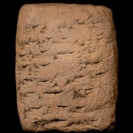 model input (224x224)  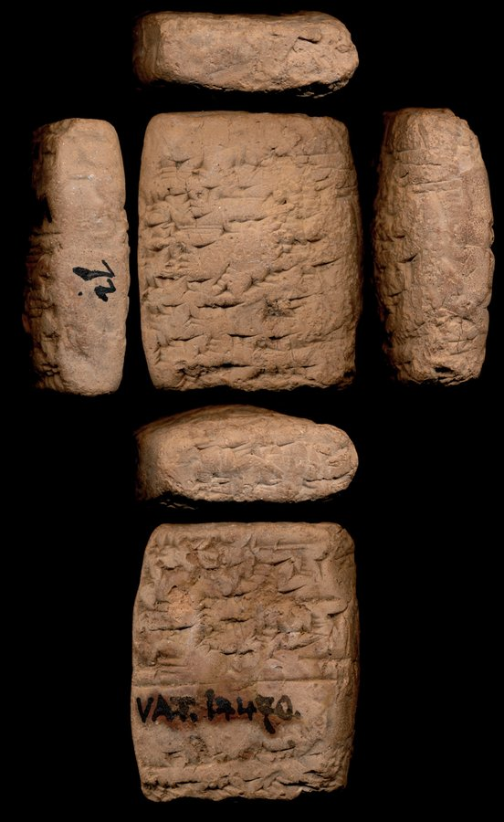 full photo (reference)</td><td valign="top">(no line-by-line ATF available for this tablet)</td></tr></table>

**Original text (transliteration):**
> i + na BAN₂ hi - bur - ni pi - rik₂ ri - te ma - ad - du ša ŠU 30TI. LA a - di - a - e li - mu lip - ta - nu

**Cuneiform (Unicode signs, whole document, not position-aligned to the text above):**
> 𒄿 𒈾 𒄑 𒑏 𒄭 𒁓 𒉌 𒉿 𒍮 𒊑 𒋼 𒈠 𒀜 𒁺 𒊭 𒋗 𒁹 𒀭 𒌍 𒌑 𒋾 𒆷 𒁹 𒀀 𒁲 𒀀 𒂊 𒇷 𒈬 𒁹 𒈜 𒋫 𒉡

**Masked input (7 positions):**
> i + na <strong>?</strong> <strong>?</strong> <strong>?</strong> hi - bu <strong>?</strong> - ni pi - rik₂ <strong>?</strong> - te ma <strong>?</strong> ad - du <strong>?</strong> ŠU 30TI. LA a - di - a - e li - mu lip - ta - nu

### Restoration (masked-token predictions)

| # | true token | text-only top-1 | text-only top-3 | vision top-1 | vision top-3 | text-only correct | vision correct |
|---|---|---|---|---|---|---|---|
| 1 | `BA` | `ša` | `ša`, `a`, `ṣ` | `ša` | `ša`, `a`, `ṣ` | ❌ | ❌ |
| 2 | `##N` | `##₂` | `##₂`, `-`, `a` | `##₂` | `##₂`, `-`, `a` | ❌ | ❌ |
| 3 | `##₂` | `-` | `-`, `na`, `##₂` | `-` | `-`, `na`, `ni` | ❌ | ❌ |
| 4 | `##r` | `pa` | `pa`, `##r`, `an` | `##r` | `##r`, `pa`, `an` | ❌ | ✅ |
| 5 | `ri` | `bir` | `bir`, `iš`, `GAL` | `bir` | `bir`, `GAL`, `DINGIR` | ❌ | ❌ |
| 6 | `-` | `-` | `-`, `##₂`, `+` | `-` | `-`, `##₂`, `.` | ✅ | ✅ |
| 7 | `ša` | `ša` | `ša`, `ina`, `LUGAL` | `ša` | `ša`, `ina`, `LUGAL` | ✅ | ✅ |

Top-1 accuracy on this example: text-only 2/7 (29%), vision 3/7 (43%)

### Metadata predictions

| head | ground truth | text-only prediction | vision prediction |
|---|---|---|---|
| period | Middle Assyrian | Middle Assyrian (0.95) | Middle Assyrian (0.94) |
| genre | (no label) | Administrative (0.40) | Administrative (0.42) |
| language | Akkadian | Akkadian (0.95) | Akkadian (0.94) |
| provenience | Assur | Assur (0.92) | Assur (0.92) |

---

## Example 3 — `P242450` (has photo: True)

*ARET 03, 257 -- Administrative, Ebla, Ebla (mod. Tell Mardikh) -- National Museum of Syria, Idlib, Syria -- published in Testi amministrativi di vario contenuto (Archivio L. 2769: TM.75.G.3000-4101) (Archi, 1982)*

<table><tr><td valign="top" width="240">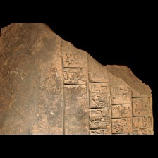 model input (224x224)  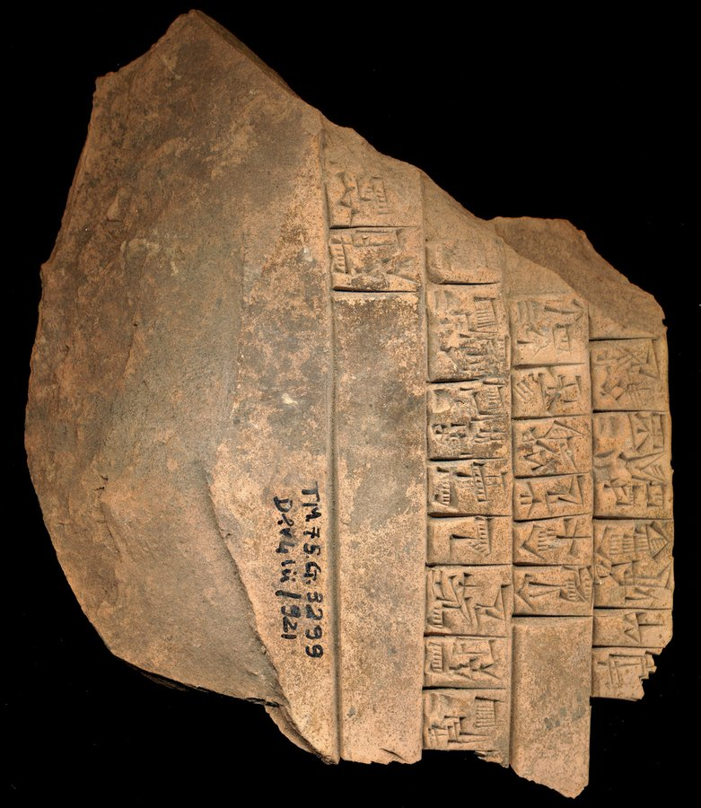 full photo (reference)</td><td valign="top"><table><tr><th>#</th><th>face</th><th>cuneiform</th><th>transliteration</th><th>translation</th></tr><tr><td>2'</td><td>default</td><td>𒐀 𒆥 𒋠 𒈠 𒌷 𒆠</td><td>2(asz@c) KIN SIKI ma-ri2</td><td>&mdash;</td></tr><tr><td>3'</td><td>default</td><td>𒐀 𒊩 𒌆 𒐀 𒁯 𒌆</td><td>2(asz@c) SAL 2(asz@c) |IB2+3(DISZ@t)| dar tug2</td><td>&mdash;</td></tr><tr><td>4'</td><td>default</td><td>𒈪 𒂵 𒀧</td><td>mi-ga-il</td><td>&mdash;</td></tr><tr><td>5'</td><td>default</td><td>𒈪 𒉡</td><td>mi-nu</td><td>&mdash;</td></tr><tr><td>6'</td><td>default</td><td>𒀀 𒁀 𒁕 𒁺</td><td>a-ba-da-du</td><td>&mdash;</td></tr><tr><td>1'</td><td>default</td><td>𒐁 𒄖 𒈮 𒌆</td><td>3(asz@c) gu-mug</td><td>&mdash;</td></tr><tr><td>7'</td><td>default</td><td>𒋗 𒀀𒀭𒂷 𒋾</td><td>szu ba4-ti</td><td>&mdash;</td></tr><tr><td>8'</td><td>default</td><td>𒐀 𒆥 𒋠</td><td>2(asz@c) KIN SIKI</td><td>&mdash;</td></tr><tr><td>9'</td><td>default</td><td>x</td><td>x ...</td><td>&mdash;</td></tr></table></td></tr></table>

**Original text (transliteration):**
> maškim - su₃ 2aš @ c SAL 2aš @ c IB2 + 3DIŠ @ t dar tug₂ mi - ga - il ir₃ - i₃ - ba 3aš @ c gu - mug 3aš @ c dam lu₂ kar mi - nu ab₂ - šu 2aš @ c KIN SIKI ma - ri₂ 1aš @ c KIN SIKI ba - ra - i a - ba - da - du šu ba₄ - ti 2aš @ c KIN SIKI šu ba₄ - ti

**Masked input (16 positions):**
> maš <strong>?</strong> - su₃ 2aš @ c SAL 2aš @ c IB2 <strong>?</strong> 3DIŠ @ t dar tu <strong>?</strong> <strong>?</strong> mi - ga - il ir <strong>?</strong> <strong>?</strong> i₃ - ba 3aš @ c gu - mug 3aš @ <strong>?</strong> <strong>?</strong> lu₂ kar mi - nu <strong>?</strong>₂ - šu <strong>?</strong> @ c KIN SIKI ma - <strong>?</strong>₂ 1aš @ c KIN SIKI ba - ra - i a - ba - da - du šu <strong>?</strong>₄ - <strong>?</strong> 2aš @ c <strong>?</strong>N SIKI šu ba <strong>?</strong> - <strong>?</strong>

### Restoration (masked-token predictions)

| # | true token | text-only top-1 | text-only top-3 | vision top-1 | vision top-3 | text-only correct | vision correct |
|---|---|---|---|---|---|---|---|
| 1 | `##kim` | `##₂` | `##₂`, `##kim`, `ki` | `##₂` | `##₂`, `##kim`, `ki` | ❌ | ❌ |
| 2 | `+` | `+` | `+`, `&`, `/` | `+` | `+`, `-`, `&` | ✅ | ✅ |
| 3 | `##g` | `##g` | `##g`, `-`, `##l` | `##g` | `##g`, `-`, `##kul` | ✅ | ✅ |
| 4 | `##₂` | `##₂` | `##₂`, `-`, `ra` | `##₂` | `##₂`, `-`, `ra` | ✅ | ✅ |
| 5 | `##₃` | `##₃` | `##₃`, `-`, `##₇` | `##₃` | `##₃`, `-`, `##₇` | ✅ | ✅ |
| 6 | `-` | `-` | `-`, `šu`, `##₃` | `-` | `-`, `ra`, `##₂` | ✅ | ✅ |
| 7 | `c` | `c` | `c`, `t`, `a` | `c` | `c`, `t`, `a` | ✅ | ✅ |
| 8 | `dam` | `dar` | `dar`, `gu`, `še` | `še` | `še`, `dam`, `gi` | ❌ | ❌ |
| 9 | `ab` | `e` | `e`, `u`, `lu` | `e` | `e`, `lu`, `##d` | ❌ | ❌ |
| 10 | `2aš` | `1aš` | `1aš`, `2aš`, `1u` | `1aš` | `1aš`, `2aš`, `1u` | ❌ | ❌ |
| 11 | `ri` | `ri` | `ri`, `šum`, `la` | `ri` | `ri`, `šum`, `num` | ✅ | ✅ |
| 12 | `ba` | `ba` | `ba`, `gi`, `u` | `ba` | `ba`, `ku`, `gi` | ✅ | ✅ |
| 13 | `ti` | `a` | `a`, `um`, `ti` | `a` | `a`, `ti`, `ra` | ❌ | ❌ |
| 14 | `KI` | `KI` | `KI`, `API`, `GI` | `KI` | `KI`, `MU`, `GI` | ✅ | ✅ |
| 15 | `##₄` | `##₄` | `##₄`, `##₂`, `##₅` | `##₄` | `##₄`, `##₂`, `##₆` | ✅ | ✅ |
| 16 | `ti` | `ti` | `ti`, `a`, `na` | `ti` | `ti`, `a`, `ra` | ✅ | ✅ |

Top-1 accuracy on this example: text-only 11/16 (69%), vision 11/16 (69%)

### Metadata predictions

| head | ground truth | text-only prediction | vision prediction |
|---|---|---|---|
| period | Third Millennium | Third Millennium (0.92) | Third Millennium (0.91) |
| genre | Administrative | Administrative (0.95) | Administrative (0.95) |
| language | Peripheral/Other | Peripheral/Other (0.96) | Peripheral/Other (0.97) |
| provenience | Ebla | Ebla (0.95) | Ebla (0.96) |

---

## Example 4 — `P400479` (has photo: True)

*CANONICAL > Technical > Medicine > Therapeutic -- Neo-Assyrian -- The British Museum*

<table><tr><td valign="top" width="240">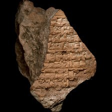 model input (224x224)  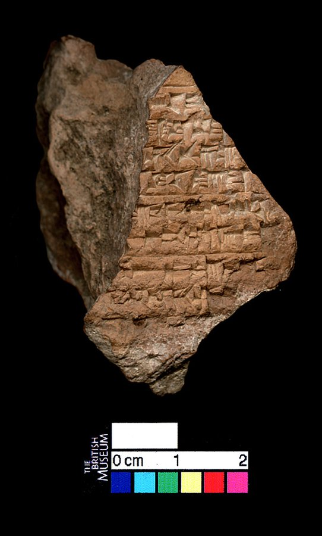 full photo (reference)</td><td valign="top"><table><tr><th>#</th><th>face</th><th>cuneiform</th><th>transliteration</th><th>translation</th></tr><tr><td>1'</td><td>default</td><td>x</td><td>... x ...</td><td>&mdash;</td></tr><tr><td>2'</td><td>default</td><td>𒌍 𒋙 𒁹</td><td>... GU₇-MEŠ-šu₂-ma ...</td><td>&mdash;</td></tr><tr><td>3'</td><td>default</td><td>𒍣 𒊬 𒑚</td><td>... GAZI ŠUŠANA MA.NA ...</td><td>&mdash;</td></tr><tr><td>4'</td><td>default</td><td>𒉽 𒐋 𒌑</td><td>... ŠUR.MIN₃ PAP 6 U₂-MEŠ ...</td><td>&mdash;</td></tr><tr><td>5'</td><td>default</td><td>𒁹 𒋙 𒁾 𒈠</td><td>... ana DUR₂-šu₂ DUB-ma ...</td><td>&mdash;</td></tr><tr><td>6'</td><td>default</td><td>𒌑 𒅆 𒅆 𒌑 𒋻</td><td>... IGI-lim tar-muš₈ ...</td><td>&mdash;</td></tr><tr><td>7'</td><td>default</td><td>x 𒀸 𒁉 𒅘 𒈨𒌍 𒈠</td><td>... x ina KAŠ NAG-MEŠ-ma ...</td><td>&mdash;</td></tr><tr><td>8'</td><td>default</td><td>𒊩 𒋻 𒋫</td><td>... ŠEG₆-šal tar-ta-x ...</td><td>&mdash;</td></tr><tr><td>9'</td><td>default</td><td>𒁹 𒌋𒌋 𒋥 x</td><td>... IM.GU₂.EN.NA DIŠ-niš SUD₂ x ...</td><td>&mdash;</td></tr><tr><td>10'</td><td>default</td><td>x x</td><td>... x x ...</td><td>&mdash;</td></tr></table></td></tr></table>

**Original text (transliteration):**
> - meš - šu₂ - ma gazi sar 1 / 3diš ma - šur - min₃ pap 6diš u₂ ana dur₂ - šu₂ dub - ma u₂ igi - lim u₂ tar - muš₈ <strong>x</strong> ina kaš nag - meš - ma - šal i - ta - <strong>x</strong> - gu₂ - en - na diš - niš sud₂

**Cuneiform (Unicode signs, whole document, not position-aligned to the text above):**
> 𒈨𒌍 𒋙 𒈠 𒓊 𒊬 𒑚 𒈠 𒋩 𒌋𒌋 𒉽 𒐋 𒌑 𒁹 𒂉 𒋙 𒁾 𒈠 𒌑 𒅆 𒅆 𒌑 𒋻 𒀸 𒁉 𒅘 𒈨𒌍 𒈠 𒊩 𒄿 𒋫 𒄘 𒂗 𒈾 𒁹 𒌋𒌋

**Masked input (11 positions):**
> - meš - <strong>?</strong>₂ - ma gazi sar 1 <strong>?</strong> 3diš ma - šur - min₃ <strong>?</strong>p 6diš u₂ <strong>?</strong> <strong>?</strong>₂ - šu₂ dub - ma u₂ igi - li <strong>?</strong> u <strong>?</strong> tar - muš₈ <strong>x</strong> ina kaš <strong>?</strong> - meš - ma - šal <strong>?</strong> - <strong>?</strong> - <strong>x</strong> - gu₂ - <strong>?</strong> - na diš - niš sud₂

### Restoration (masked-token predictions)

| # | true token | text-only top-1 | text-only top-3 | vision top-1 | vision top-3 | text-only correct | vision correct |
|---|---|---|---|---|---|---|---|
| 1 | `šu` | `šu` | `šu`, `u`, `šum` | `šu` | `šu`, `šum`, `u` | ✅ | ✅ |
| 2 | `/` | `/` | `/`, `.`, `-` | `/` | `/`, `.`, `-` | ✅ | ✅ |
| 3 | `pa` | `pa` | `pa`, `ša`, `ši` | `ša` | `ša`, `pa`, `ši` | ✅ | ❌ |
| 4 | `ana` | `-` | `-`, `ša`, `2diš` | `-` | `-`, `6diš`, `1diš` | ❌ | ❌ |
| 5 | `dur` | `u` | `u`, `aš`, `kin` | `aš` | `aš`, `u`, `ša` | ❌ | ❌ |
| 6 | `##m` | `##₂` | `##₂`, `##m`, `-` | `##m` | `##m`, `##š`, `-` | ❌ | ✅ |
| 7 | `##₂` | `##₂` | `##₂`, `##₃`, `##b` | `##₂` | `##₂`, `##₃`, `-` | ✅ | ✅ |
| 8 | `nag` | `##₃` | `##₃`, `igi`, `1diš` | `##₂` | `##₂`, `##₃`, `1diš` | ❌ | ❌ |
| 9 | `i` | `##₂` | `##₂`, `##₃`, `a` | `##₂` | `##₂`, `a`, `##₃` | ❌ | ❌ |
| 10 | `ta` | `ma` | `ma`, `na`, `mu` | `ma` | `ma`, `na`, `la` | ❌ | ❌ |
| 11 | `en` | `nun` | `nun`, `an`, `a` | `en` | `en`, `nun`, `an` | ❌ | ✅ |

Top-1 accuracy on this example: text-only 4/11 (36%), vision 5/11 (45%)

### Metadata predictions

| head | ground truth | text-only prediction | vision prediction |
|---|---|---|---|
| period | Neo-Assyrian | Neo-Assyrian (0.93) | Neo-Assyrian (0.88) |
| genre | (no label) | Literary & Scholarly (0.53) | Royal Inscriptions (0.62) **<- differs** |
| language | Akkadian | Akkadian (0.95) | Akkadian (0.94) |
| provenience | Nineveh | Nineveh (0.84) | Nineveh (0.85) |

---

## Example 5 — `P416484` (has photo: True)

*Nimrud NW Palace zzz015 = RIMA 2.0.101.023, ex. add419 -- Official or display, Neo-Assyrian, Kalhu (mod. Nimrūd) -- Peabody Essex Museum, Salem, Massachusetts, USA*

<table><tr><td valign="top" width="240">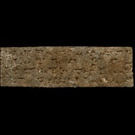 model input (224x224)  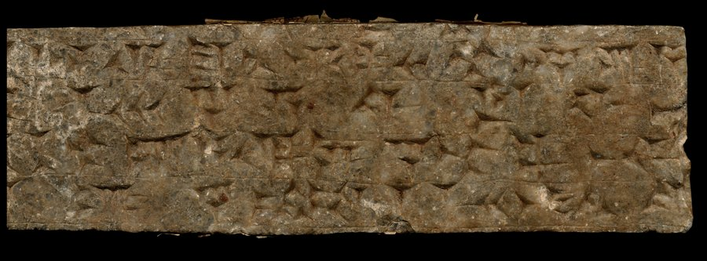 full photo (reference)</td><td valign="top"><table><tr><th>#</th><th>face</th><th>cuneiform</th><th>transliteration</th><th>translation</th></tr><tr><td>1'</td><td>obverse</td><td>𒁹 𒁲 𒈠 𒉡 𒊕 𒌋𒌋 𒆳 𒀸 𒋩 𒉣 𒀀</td><td>... szul3-ma-nu-sag man kur asz-szur nun a-...</td><td>&mdash;</td></tr><tr><td>2'</td><td>obverse</td><td>𒈨𒌍 𒃻 𒀀 𒉿 𒇻 𒅆</td><td>... x-mesz sza2 a-pe-lu-szi-...</td><td>&mdash;</td></tr><tr><td>3'</td><td>obverse</td><td>𒋙 𒆳 𒂍 𒀀 𒁲 𒉌 𒃻 𒆳 𒉺 𒋾</td><td>...-szu2 e2 a-di-ni sza2 hat-ti ...</td><td>&mdash;</td></tr><tr><td>4'</td><td>obverse</td><td>𒌑 𒃻 𒉋 𒁹 𒈨 𒌋 𒄘 𒉿</td><td>... u2-sza2-pil2 1(disz) me 2(u) tik-pi ...</td><td>&mdash;</td></tr></table></td></tr></table>

**Original text (transliteration):**
> <strong>...</strong> šul₃ - ma - nu - sag man kur aš - šur nun a - <strong>...</strong> <strong>...</strong> <strong>x</strong> - meš ša₂ a - pe - lu - ši - <strong>...</strong> <strong>...</strong> - šu₂ e₂ a - di - ni ša₂ hat - ti <strong>...</strong> <strong>...</strong> u₂ - ša₂ - pil₂ 1diš me 2u tik - pi <strong>...</strong>

**Cuneiform (Unicode signs, whole document, not position-aligned to the text above):**
> 𒁹 𒁲 𒈠 𒉡 𒊕 𒌋𒌋 𒆳 𒀸 𒋩 𒉣 𒀀 𒈨𒌍 𒃻 𒀀 𒉿 𒇻 𒅆 𒋙 𒆳 𒂍 𒀀 𒁲 𒉌 𒃻 𒆳 𒉺 𒋾 𒌑 𒃻 𒉋 𒁹 𒈨 𒌋 𒄘 𒉿

**Masked input (9 positions):**
> <strong>...</strong> šul <strong>?</strong> - ma - nu <strong>?</strong> sag man kur aš - šur nun a <strong>?</strong> <strong>...</strong> <strong>...</strong> <strong>x</strong> - meš ša₂ a - pe - lu - ši - <strong>...</strong> <strong>...</strong> <strong>?</strong> šu₂ <strong>?</strong>₂ <strong>?</strong> - di - ni <strong>?</strong>₂ hat - ti <strong>...</strong> <strong>...</strong> u <strong>?</strong> <strong>?</strong> ša₂ - pil₂ 1diš me 2u tik - pi <strong>...</strong>

### Restoration (masked-token predictions)

| # | true token | text-only top-1 | text-only top-3 | vision top-1 | vision top-3 | text-only correct | vision correct |
|---|---|---|---|---|---|---|---|
| 1 | `##₃` | `##₂` | `##₂`, `##₃`, `##₄` | `##₂` | `##₂`, `##₃`, `##₅` | ❌ | ❌ |
| 2 | `-` | `-` | `-`, `man`, `kur` | `-` | `-`, `man`, `kur` | ✅ | ✅ |
| 3 | `-` | `-` | `-`, `##₂`, `ina` | `-` | `-`, `##₂`, `.` | ✅ | ✅ |
| 4 | `-` | `-` | `-`, `ina`, `ša` | `-` | `-`, `mu`, `ina` | ✅ | ✅ |
| 5 | `e` | `ša` | `ša`, `E`, `u` | `ša` | `ša`, `E`, `u` | ❌ | ❌ |
| 6 | `a` | `id` | `id`, `a`, `na` | `id` | `id`, `a`, `na` | ❌ | ❌ |
| 7 | `ša` | `ša` | `ša`, `E`, `u` | `ša` | `ša`, `E`, `u` | ✅ | ✅ |
| 8 | `##₂` | `##₂` | `##₂`, `##₃`, `##₄` | `##₂` | `##₂`, `##₃`, `##₄` | ✅ | ✅ |
| 9 | `-` | `-` | `-`, `na`, `ina` | `-` | `-`, `2u`, `2diš` | ✅ | ✅ |

Top-1 accuracy on this example: text-only 6/9 (67%), vision 6/9 (67%)

### Metadata predictions

| head | ground truth | text-only prediction | vision prediction |
|---|---|---|---|
| period | Neo-Assyrian | Neo-Assyrian (0.84) | Neo-Assyrian (0.84) |
| genre | Royal Inscriptions | Royal Inscriptions (0.93) | Royal Inscriptions (0.96) |
| language | Akkadian | Akkadian (0.92) | Akkadian (0.91) |
| provenience | Nimrud | Nimrud (0.37) | Nimrud (0.47) |

---

## Example 6 — `P216958` (has photo: True)

*RTC 182 -- Administrative, Lagash II, Girsu (mod. Tello) -- Louvre Museum, Paris, France -- published in Recueil de tablettes chaldéennes (Thureau-Dangin, 1903)*

<table><tr><td valign="top" width="240">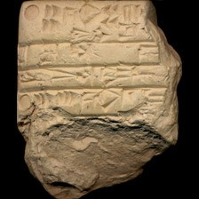 model input (224x224)  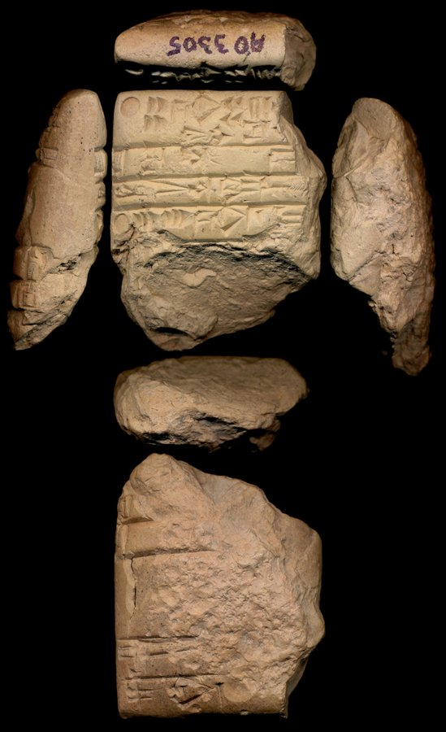 full photo (reference)</td><td valign="top"><table><tr><th>#</th><th>face</th><th>cuneiform</th><th>transliteration</th><th>translation</th></tr><tr><td>1</td><td>obverse</td><td>𒌋 𒐂 𒄘 𒐏 𒐈 𒈠 𒉌𒌓 𒋛 𒁲</td><td>1(u@c) 4(asz@c) gu2 4(u) 3(disz) ma-na siki na4 si-sa2</td><td>&mdash;</td></tr><tr><td>2</td><td>obverse</td><td>𒋠 𒇻 𒀏</td><td>siki udu nansze</td><td>&mdash;</td></tr><tr><td>3</td><td>obverse</td><td>𒇽 𒌉 𒍣</td><td>lu2-dumu-zi</td><td>&mdash;</td></tr><tr><td>4</td><td>obverse</td><td>𒌋 𒐄 𒄘 𒇲 𒁹 𒈠</td><td>1(u@c) 6(asz@c) gu2 la2 1(disz@t) ma-na</td><td>&mdash;</td></tr><tr><td>5</td><td>obverse</td><td>𒋠</td><td>siki udu x-x</td><td>&mdash;</td></tr><tr><td>1'</td><td>reverse</td><td>𒋃</td><td>sanga ...</td><td>&mdash;</td></tr><tr><td>2'</td><td>reverse</td><td>𒋗 𒁀</td><td>szu ba-ti</td><td>&mdash;</td></tr><tr><td>3'</td><td>reverse</td><td>𒄊</td><td>pirig-me3</td><td>&mdash;</td></tr><tr><td>4'</td><td>reverse</td><td>𒑐𒋼𒋛</td><td>ensi2</td><td>&mdash;</td></tr></table></td></tr></table>

**Original text (transliteration):**
> 1u @ c 4aš @ c gu₂ 4u 3diš ma - na₄ si - sa₂ siki udu D nanše 1u @ c 6aš @ c gu₂ la₂ 1diš @ t ma -

**Cuneiform (Unicode signs, whole document, not position-aligned to the text above):**
> 𒄘 𒐈 𒈠 𒉌𒌓 𒋛 𒁲 𒋠 𒇻 <D> 𒀏 𒄘 𒇲 𒈠

**Masked input (6 positions):**
> 1u @ c <strong>?</strong>š @ c gu₂ 4u 3diš <strong>?</strong> <strong>?</strong> na₄ si - sa <strong>?</strong> siki udu <strong>?</strong> nanše 1u @ c 6aš @ c gu₂ la₂ 1diš @ t <strong>?</strong> -

### Restoration (masked-token predictions)

| # | true token | text-only top-1 | text-only top-3 | vision top-1 | vision top-3 | text-only correct | vision correct |
|---|---|---|---|---|---|---|---|
| 1 | `4a` | `3a` | `3a`, `4a`, `5` | `3a` | `3a`, `4a`, `5` | ❌ | ❌ |
| 2 | `ma` | `@` | `@`, `sila`, `gu` | `@` | `@`, `sila`, `-` | ❌ | ❌ |
| 3 | `-` | `t` | `t`, `##₂`, `##i` | `t` | `t`, `c`, `##₂` | ❌ | ❌ |
| 4 | `##₂` | `##₂` | `##₂`, `##₆`, `##₃` | `##₂` | `##₂`, `##₆`, `##₃` | ✅ | ✅ |
| 5 | `D` | `-` | `-`, `D`, `dumu` | `D` | `D`, `-`, `udu` | ❌ | ✅ |
| 6 | `ma` | `ma` | `ma`, `ba`, `udu` | `udu` | `udu`, `ma`, `si` | ✅ | ❌ |

Top-1 accuracy on this example: text-only 2/6 (33%), vision 2/6 (33%)

### Metadata predictions

| head | ground truth | text-only prediction | vision prediction |
|---|---|---|---|
| period | Third Millennium | Third Millennium (0.93) | Third Millennium (0.92) |
| genre | Administrative | Administrative (0.95) | Administrative (0.94) |
| language | (no label) | Sumerian (0.92) | Sumerian (0.93) |
| provenience | Girsu | Girsu (0.74) | Girsu (0.74) |

---

## Example 7 — `P382054` (has photo: True)

*TCBI 2/1, 46 -- Administrative, ED IIIb, Zabalam (mod. Tall Ibzaīykh) -- Banca d'Italia, Rome, Italy -- published in Le tavolette pre-sargoniche e sargoniche (Westenholz, 2006)*

<table><tr><td valign="top" width="240">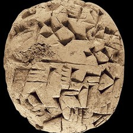 model input (224x224)  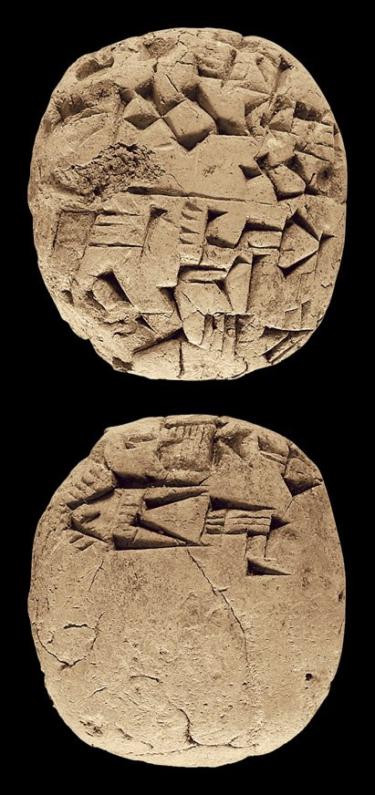 full photo (reference)</td><td valign="top"><table><tr><th>#</th><th>face</th><th>cuneiform</th><th>transliteration</th><th>translation</th></tr><tr><td>1</td><td>obverse</td><td>𒌋 𒀸 𒄑 𒁍 𒁕 𒅇 𒈲</td><td>1(u@c) 1(asz@c) gesz gid2-da u3 musz</td><td>&mdash;</td></tr><tr><td>2</td><td>obverse</td><td>𒂍 𒃲 𒋫 𒁺</td><td>e2-gal-ta de6</td><td>&mdash;</td></tr><tr><td>3</td><td>obverse</td><td>𒐀 𒌚 𒐉 𒈬</td><td>2(asz@c) ... iti 4(disz@t) mu</td><td>&mdash;</td></tr><tr><td>1</td><td>reverse</td><td>𒈩 𒌌 𒈿 𒋃</td><td>mes-du7-nu2 sanga</td><td>&mdash;</td></tr></table></td></tr></table>

**Original text (transliteration):**
> 1u @ c 1aš @ c geš gid₂ - da u₃ muš e₂ - gal - ta de₆ 2aš @ c <strong>...</strong> iti 4diš @ t mu mes - du₇ - nu₂ sanga

**Masked input (6 positions):**
> <strong>?</strong> @ c 1aš @ c geš <strong>?</strong>d₂ <strong>?</strong> da u₃ mu <strong>?</strong> e₂ - gal <strong>?</strong> ta de₆ 2aš @ c <strong>...</strong> <strong>?</strong>i 4diš @ t mu mes - du₇ - nu₂ sanga

### Restoration (masked-token predictions)

| # | true token | text-only top-1 | text-only top-3 | vision top-1 | vision top-3 | text-only correct | vision correct |
|---|---|---|---|---|---|---|---|
| 1 | `1u` | `1u` | `1u`, `2u`, `3u` | `1u` | `1u`, `2u`, `3u` | ✅ | ✅ |
| 2 | `gi` | `gi` | `gi`, `ara`, `zi` | `gi` | `gi`, `ara`, `zi` | ✅ | ✅ |
| 3 | `-` | `-` | `-`, `:`, `a` | `-` | `-`, `:`, `geš` | ✅ | ✅ |
| 4 | `##š` | `##šen` | `##šen`, `geš`, `-` | `##šen` | `##šen`, `##g`, `##š` | ❌ | ❌ |
| 5 | `-` | `-` | `-`, `:`, `a` | `-` | `-`, `a`, `:` | ✅ | ✅ |
| 6 | `it` | `it` | `it`, `sik`, `sag` | `it` | `it`, `sik`, `sag` | ✅ | ✅ |

Top-1 accuracy on this example: text-only 5/6 (83%), vision 5/6 (83%)

### Metadata predictions

| head | ground truth | text-only prediction | vision prediction |
|---|---|---|---|
| period | Third Millennium | Third Millennium (0.95) | Third Millennium (0.95) |
| genre | Administrative | Administrative (0.95) | Administrative (0.94) |
| language | Sumerian | Sumerian (0.92) | Sumerian (0.93) |
| provenience | Zabalam | Zabalam (0.90) | Zabalam (0.94) |

---

## Example 8 — `P131536` (has photo: False)

*SAT 1, 433 -- Administrative, Ur III, Girsu (mod. Tello) -- British Museum, London, UK -- published in Texts from the British Museum (Sigrist, 1993)*

**Original text (transliteration):**
> 1diš sila₃ lu₂ - utu dumu - dab₅ - ba 1diš sila₃ ur - mes gala 1diš sila₃ ur - ba - ba₆ gala 1diš sila₃ lu₂ - suen lu₂ bu₃ - u₂ - du 1diš sila₃ lugal - ab - ba lu₂ nin - gal 1diš sila₃ ARAD₂ - mu erin₂ e₂ nin - geš - zi - da 1diš sila₃ lu₂ - dumu - zi lu₂ dusu 1diš sila₃ ur - nin - geš - zi - da e₂ nin - geš - zi - da 1diš sila₃ lu₂ - uru₁₁ sipa 1diš sila₃ ur - bad₃ - tibir - ra ARAD₂ lugal - ša₃ - la₂ 1diš sila₃ ša₃ - ha - ma erin₂ lu₂ mu - ni - gin₇ - du₁₀ 1u 1diš guruš 1diš sila₃ - ta kiri₆ nin - gir₂ - su gaba - ri 1diš sila₃ ur - tur lu₂ - azlag₂ 1diš sila₃ lu₂ - uru₁₁ ša₃ - gu₄ nam - tur 1diš sila₃ ur - mes e₂ uru₁₁ 1diš sila₃ nam - iri - na e₂ nin - mar 1diš sila₃ ur - nanše dumu lu₂ - nin - šubur 1diš sila₃ ša₃ - a - ba - mu - da - su₂ e₂ nanše 1diš sila₃ ba - ta - sa₆ - ge e₂ ga₂ - tum₃ - du₁₀ 1diš sila₃ ur - sukkal lu₂ ninda sig il₂ - la 1diš sila₃ da - du ša₃ - gu₄ e₂ šul - gi 1diš sila₃ lu₂ - utu ša₃ - gu₄ e₂ nin - geš - zi - da 1diš sila₃ na - ga 1diš sila₃ lugal - ab - ba

**Masked input (56 positions):**
> 1diš sila₃ lu <strong>?</strong> - utu dumu - <strong>?</strong>₅ - ba 1diš sila₃ ur - mes <strong>?</strong> <strong>?</strong> sila₃ ur - ba - ba₆ <strong>?</strong> 1diš sila₃ lu₂ - suen lu₂ bu₃ - u <strong>?</strong> <strong>?</strong> du 1diš sila₃ lugal - ab <strong>?</strong> ba lu₂ nin - gal <strong>?</strong> sila₃ <strong>?</strong>AD₂ - <strong>?</strong> erin₂ e₂ nin - geš - <strong>?</strong> <strong>?</strong> <strong>?</strong> 1diš sila₃ lu₂ - dumu - zi lu₂ dusu 1diš <strong>?</strong>₃ <strong>?</strong> <strong>?</strong> nin - geš - zi - da e₂ nin - geš - zi - da 1diš sila₃ lu <strong>?</strong> - uru₁ <strong>?</strong> sipa <strong>?</strong> <strong>?</strong>₃ ur - bad₃ - tibir - ra ARAD <strong>?</strong> lugal - ša₃ - la₂ 1diš <strong>?</strong>₃ ša₃ - ha - ma erin₂ lu <strong>?</strong> mu - ni - gin₇ - du₁₀ <strong>?</strong> 1diš guruš 1diš <strong>?</strong>₃ - ta kiri <strong>?</strong> <strong>?</strong> - gir₂ - su gab <strong>?</strong> - ri <strong>?</strong> sila₃ ur - tur lu₂ - <strong>?</strong>lag₂ 1diš sila₃ lu₂ - uru₁₁ ša₃ - gu₄ nam - tur 1diš <strong>?</strong>₃ ur - mes e₂ uru₁₁ 1diš sila₃ nam - iri - na <strong>?</strong>₂ nin - mar <strong>?</strong> <strong>?</strong> <strong>?</strong> ur - nanše <strong>?</strong> lu₂ - nin - šubur 1diš sila₃ ša₃ - a - ba - mu <strong>?</strong> da - <strong>?</strong> <strong>?</strong> e₂ nanše 1diš sila <strong>?</strong> <strong>?</strong> - ta - <strong>?</strong>₆ - ge e₂ ga <strong>?</strong> - <strong>?</strong>₃ - du₁₀ <strong>?</strong> sila₃ ur - sukkal lu₂ ninda <strong>?</strong> il₂ - <strong>?</strong> 1diš sila₃ da - du ša₃ - <strong>?</strong>₄ e₂ šul - gi 1diš sila₃ lu₂ - utu ša₃ - gu₄ <strong>?</strong> <strong>?</strong> <strong>?</strong> - geš <strong>?</strong> zi - <strong>?</strong> 1diš <strong>?</strong>₃ na - ga 1diš sila₃ lugal <strong>?</strong> ab - ba

### Restoration (masked-token predictions)

| # | true token | text-only top-1 | text-only top-3 | vision top-1 | vision top-3 | text-only correct | vision correct |
|---|---|---|---|---|---|---|---|
| 1 | `##₂` | `##₂` | `##₂`, `##₃`, `##m` | `##₂` | `##₂`, `##₃`, `##m` | ✅ | ✅ |
| 2 | `dab` | `dab` | `dab`, `ur`, `lu` | `dab` | `dab`, `lu`, `ku` | ✅ | ✅ |
| 3 | `gala` | `nar` | `nar`, `lugal`, `##ta` | `nar` | `nar`, `lugal`, `ki` | ❌ | ❌ |
| 4 | `1diš` | `1diš` | `1diš`, `2diš`, `3diš` | `1diš` | `1diš`, `2diš`, `3diš` | ✅ | ✅ |
| 5 | `gala` | `nar` | `nar`, `lugal`, `dumu` | `nar` | `nar`, `lugal`, `dumu` | ❌ | ❌ |
| 6 | `##₂` | `##₂` | `##₂`, `##₃`, `##b` | `##₂` | `##₂`, `##₃`, `##h` | ✅ | ✅ |
| 7 | `-` | `-` | `-`, `##₂`, `##₃` | `-` | `-`, `##₂`, `##₃` | ✅ | ✅ |
| 8 | `-` | `-` | `-`, `.`, `:` | `-` | `-`, `.`, `:` | ✅ | ✅ |
| 9 | `1diš` | `1diš` | `1diš`, `2diš`, `3diš` | `1diš` | `1diš`, `2diš`, `3diš` | ✅ | ✅ |
| 10 | `AR` | `AR` | `AR`, `AL`, `Š` | `AR` | `AR`, `Š`, `AL` | ✅ | ✅ |
| 11 | `mu` | `mu` | `mu`, `zu`, `gal` | `mu` | `mu`, `zu`, `da` | ✅ | ✅ |
| 12 | `zi` | `zi` | `zi`, `gi`, `i` | `zi` | `zi`, `gi`, `a` | ✅ | ✅ |
| 13 | `-` | `-` | `-`, `##₂`, `##₃` | `-` | `-`, `##₂`, `##₃` | ✅ | ✅ |
| 14 | `da` | `da` | `da`, `du`, `na` | `da` | `da`, `du`, `a` | ✅ | ✅ |
| 15 | `sila` | `sila` | `sila`, `i`, `u` | `sila` | `sila`, `giri`, `u` | ✅ | ✅ |
| 16 | `ur` | `e` | `e`, `ur`, `lu` | `e` | `e`, `ur`, `lu` | ❌ | ❌ |
| 17 | `-` | `##₂` | `##₂`, `##₃`, `-` | `##₂` | `##₂`, `##₃`, `-` | ❌ | ❌ |
| 18 | `##₂` | `##₂` | `##₂`, `##₃`, `##m` | `##₂` | `##₂`, `##₃`, `##m` | ✅ | ✅ |
| 19 | `##₁` | `##₁` | `##₁`, `##₀`, `##₂` | `##₁` | `##₁`, `##₀`, `##₂` | ✅ | ✅ |
| 20 | `1diš` | `1diš` | `1diš`, `2diš`, `3diš` | `1diš` | `1diš`, `2diš`, `3diš` | ✅ | ✅ |
| 21 | `sila` | `sila` | `sila`, `giri`, `še` | `sila` | `sila`, `giri`, `še` | ✅ | ✅ |
| 22 | `##₂` | `##₂` | `##₂`, `##2`, `##₃` | `##₂` | `##₂`, `##2`, `-` | ✅ | ✅ |
| 23 | `sila` | `sila` | `sila`, `giri`, `u` | `sila` | `sila`, `giri`, `u` | ✅ | ✅ |
| 24 | `##₂` | `##₂` | `##₂`, `-`, `##₃` | `##₂` | `##₂`, `##₃`, `-` | ✅ | ✅ |
| 25 | `1u` | `1u` | `1u`, `2u`, `3u` | `1u` | `1u`, `2u`, `3u` | ✅ | ✅ |
| 26 | `sila` | `sila` | `sila`, `i`, `ša` | `sila` | `sila`, `ša`, `i` | ✅ | ✅ |
| 27 | `##₆` | `##₆` | `##₆`, `##₃`, `##₇` | `##₆` | `##₆`, `##₃`, `##₇` | ✅ | ✅ |
| 28 | `nin` | `nin` | `nin`, `ur`, `en` | `nin` | `nin`, `en`, `lugal` | ✅ | ✅ |
| 29 | `##a` | `##a` | `##a`, `##₂`, `##i` | `##a` | `##a`, `##₂`, `##i` | ✅ | ✅ |
| 30 | `1diš` | `1diš` | `1diš`, `2diš`, `3diš` | `1diš` | `1diš`, `2diš`, `3diš` | ✅ | ✅ |
| 31 | `az` | `az` | `az`, `kis`, `ab` | `az` | `az`, `ab`, `šu` | ✅ | ✅ |
| 32 | `sila` | `sila` | `sila`, `giri`, `gu` | `sila` | `sila`, `giri`, `še` | ✅ | ✅ |
| 33 | `e` | `e` | `e`, `lu`, `ensi` | `e` | `e`, `lu`, `ensi` | ✅ | ✅ |
| 34 | `1diš` | `1diš` | `1diš`, `-`, `2diš` | `1diš` | `1diš`, `-`, `2diš` | ✅ | ✅ |
| 35 | `sila` | `sila` | `sila`, `še`, `e` | `sila` | `sila`, `še`, `sa` | ✅ | ✅ |
| 36 | `##₃` | `##₃` | `##₃`, `##₂`, `dumu` | `##₃` | `##₃`, `##₂`, `dumu` | ✅ | ✅ |
| 37 | `dumu` | `dumu` | `dumu`, `1diš`, `dam` | `dumu` | `dumu`, `1diš`, `1barig` | ✅ | ✅ |
| 38 | `-` | `dumu` | `dumu`, `-`, `1diš` | `dumu` | `dumu`, `-`, `1diš` | ❌ | ❌ |
| 39 | `su` | `gu` | `gu`, `gal`, `še` | `num` | `num`, `lu`, `gu` | ❌ | ❌ |
| 40 | `##₂` | `##₃` | `##₃`, `##₂`, `##₄` | `##₂` | `##₂`, `##₃`, `##₄` | ❌ | ✅ |
| 41 | `##₃` | `##₃` | `##₃`, `##₂`, `##₄` | `##₃` | `##₃`, `##₂`, `##₄` | ✅ | ✅ |
| 42 | `ba` | `in` | `in`, `ba`, `ab` | `in` | `in`, `ba`, `ab` | ❌ | ❌ |
| 43 | `sa` | `sa` | `sa`, `du`, `se` | `sa` | `sa`, `se`, `du` | ✅ | ✅ |
| 44 | `##₂` | `##₂` | `##₂`, `##₆`, `##g` | `##₂` | `##₂`, `##₆`, `##g` | ✅ | ✅ |
| 45 | `tum` | `eš` | `eš`, `tum`, `i` | `eš` | `eš`, `tum`, `ša` | ❌ | ❌ |
| 46 | `1diš` | `1diš` | `1diš`, `2diš`, `3diš` | `1diš` | `1diš`, `2diš`, `3diš` | ✅ | ✅ |
| 47 | `sig` | `-` | `-`, `dumu`, `1diš` | `-` | `-`, `dumu`, `lugal` | ❌ | ❌ |
| 48 | `la` | `la` | `la`, `le`, `ta` | `la` | `la`, `le`, `sa` | ✅ | ✅ |
| 49 | `gu` | `gu` | `gu`, `gur`, `gi` | `gu` | `gu`, `gi`, `sila` | ✅ | ✅ |
| 50 | `e` | `e` | `e`, `lu`, `giri` | `e` | `e`, `lu`, `giri` | ✅ | ✅ |
| 51 | `##₂` | `##₂` | `##₂`, `##₃`, `-` | `##₂` | `##₂`, `##₃`, `-` | ✅ | ✅ |
| 52 | `nin` | `nin` | `nin`, `en`, `ur` | `nin` | `nin`, `en`, `ur` | ✅ | ✅ |
| 53 | `-` | `-` | `-`, `:`, `.` | `-` | `-`, `:`, `.` | ✅ | ✅ |
| 54 | `da` | `da` | `da`, `ra`, `a` | `da` | `da`, `du`, `a` | ✅ | ✅ |
| 55 | `sila` | `sila` | `sila`, `giri`, `u` | `sila` | `sila`, `giri`, `u` | ✅ | ✅ |
| 56 | `-` | `-` | `-`, `:`, `.` | `-` | `-`, `.`, `:` | ✅ | ✅ |

Top-1 accuracy on this example: text-only 46/56 (82%), vision 47/56 (84%)

### Metadata predictions

| head | ground truth | text-only prediction | vision prediction |
|---|---|---|---|
| period | Ur III | Ur III (0.91) | Ur III (0.92) |
| genre | Administrative | Administrative (0.91) | Administrative (0.92) |
| language | Sumerian | Sumerian (0.93) | Sumerian (0.93) |
| provenience | Girsu | Girsu (0.92) | Girsu (0.92) |

---

## Example 9 — `P113480` (has photo: True)

*MVN 02, 181 -- Administrative, Ur III, Girsu (mod. Tello) -- Musée d'Art et d'Histoire, Geneva, Switzerland -- published in Wirtschaftsurkunden des Musée d’Art et d’Histoire in Genf (Sauren, 1974)*

<table><tr><td valign="top" width="240">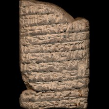 model input (224x224)  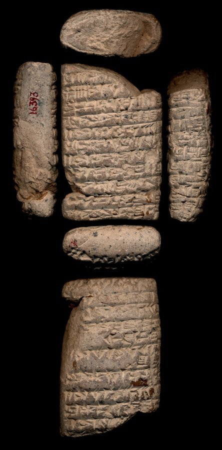 full photo (reference)</td><td valign="top"><table><tr><th>#</th><th>face</th><th>cuneiform</th><th>transliteration</th><th>translation</th></tr><tr><td>1'</td><td>obverse</td><td>𒋗 𒀀 𒄀</td><td>szu-a gi-na</td><td>&mdash;</td></tr><tr><td>2'</td><td>obverse</td><td>𒑏 𒐍 𒋡 𒌓 𒁹</td><td>1(ban2) 8(disz) sila3 u4 1(disz)-kam u4 3(u)-sze3</td><td>&mdash;</td></tr><tr><td>3'</td><td>obverse</td><td>𒌉 𒄑𒆵 𒆠 𒀀 x x</td><td>dumu umma a x x</td><td>&mdash;</td></tr><tr><td>4'</td><td>obverse</td><td>𒄊 𒇽 𒁀 𒁀𒌑</td><td>giri3 lu2-ba-ba6</td><td>&mdash;</td></tr><tr><td>5'</td><td>obverse</td><td>𒁹 𒋡 𒌓 𒁹 𒄭𒁁 𒌓 𒌋 𒂠</td><td>2(disz) sila3 u4 1(disz)-kam u4 3(u)-sze3</td><td>&mdash;</td></tr><tr><td>6'</td><td>obverse</td><td>𒈥 𒌅 𒀀 𒊒 𒀀 𒊮</td><td>mar-tu a-ru-a sza3 x-x</td><td>&mdash;</td></tr><tr><td>7'</td><td>obverse</td><td>𒁹 𒋡 𒈥 𒌅 𒊮</td><td>2(disz) sila3 mar-tu sza3 x-x-x-x</td><td>&mdash;</td></tr><tr><td>8'</td><td>obverse</td><td>𒐀 𒁹𒁹𒁹 𒄥 𒃶 𒆪 𒊮 𒅕 𒀀</td><td>2(asz) 3(barig) gur he2-dab5 sza3 iri-a</td><td>&mdash;</td></tr><tr><td>9'</td><td>obverse</td><td>𒄊 𒉆 𒍣 𒋻 𒊏</td><td>giri3 nam-zi-tar-ra</td><td>&mdash;</td></tr><tr><td>10'</td><td>obverse</td><td>𒐀 𒁹𒁹 𒄥 𒃶 𒆪 𒀀</td><td>2(asz) 2(barig) gur he2-dab5 tusz-a</td><td>&mdash;</td></tr><tr><td>11'</td><td>obverse</td><td>𒄊 𒇽 𒊩𒌆 𒋚</td><td>giri3 lu2-nin-szubur</td><td>&mdash;</td></tr><tr><td>1</td><td>reverse</td><td>𒐉 𒋡 𒌓 𒁹 𒄭𒁁 𒌓 𒌋 𒂠</td><td>4(disz) sila3 u4 1(disz)-kam u4 3(u)-sze3</td><td>&mdash;</td></tr><tr><td>2</td><td>reverse</td><td>𒁲 𒌉 𒉌 𒁹 𒀀𒀭</td><td>na-silim dumu-ni 2(disz)-am3</td><td>&mdash;</td></tr><tr><td>3</td><td>reverse</td><td>𒋡 𒌓 𒁹 𒄭𒁁 𒌓 𒌋 𒂠</td><td>2(disz) sila3 u4 1(disz)-kam u4 3(u)-sze3</td><td>&mdash;</td></tr><tr><td>4</td><td>reverse</td><td>𒌨 𒁀 𒁀𒌑 𒌉 𒅆 𒍪 𒁇 𒊏</td><td>x ur-ba-ba6 dumu igi-zu-bar-ra</td><td>&mdash;</td></tr><tr><td>5</td><td>reverse</td><td>𒋡 𒌓 𒁹 𒄭𒁁 𒌓 𒌋 𒂠</td><td>x sila3 u4 1(disz)-kam u4 3(u)-sze3</td><td>&mdash;</td></tr><tr><td>6</td><td>reverse</td><td>𒇽 𒈹 𒑐𒀠</td><td>lu2-inanna szabra</td><td>&mdash;</td></tr><tr><td>7</td><td>reverse</td><td>𒁹 𒋡 𒌓 𒁹 𒄭𒁁 𒌓 𒌋 𒂠</td><td>2(disz) sila3 u4 1(disz)-kam u4 3(u)-sze3</td><td>&mdash;</td></tr><tr><td>8</td><td>reverse</td><td>𒌨 𒀏 𒄖 𒍝</td><td>ur-nansze gu-za-la2</td><td>&mdash;</td></tr><tr><td>9</td><td>reverse</td><td>𒁹 𒋡 𒌓 𒁹 𒄭𒁁</td><td>2(disz) sila3 u4 1(disz)-kam u4 3(u)-sze3</td><td>&mdash;</td></tr><tr><td>10</td><td>reverse</td><td></td><td>x-...</td><td>&mdash;</td></tr></table></td></tr></table>

**Original text (transliteration):**
> 1ban₂ 8diš sila₃ u₄ 1diš - dumu umma ki a <strong>x</strong> <strong>x</strong> 2diš sila₃ u₄ 1diš - kam u₄ 3u - še₃ mar - tu a - ru - a ša₃ <strong>x</strong> - <strong>x</strong> 2diš sila₃ mar - tu ša₃ <strong>x</strong> - <strong>x</strong> - <strong>x</strong> - <strong>x</strong> 2aš 3barig gur he₂ - dab₅ ša₃ iri - a 2aš 2barig gur he₂ - tuš - a 4diš sila₃ u₄ 1diš - kam u₄ 3u - še₃ - silim dumu - ni 2diš - am₃ sila₃ u₄ 1diš - kam u₄ 3u - še₃ ur - D ba - ba₆ dumu igi - zu - bar - ra lu₂ - D inanna šabra ur - D nanše gu - za - 2diš sila₃ u₄ 1diš - kam

**Cuneiform (Unicode signs, whole document, not position-aligned to the text above):**
> 𒑏 𒋡 𒌓 𒁹 𒌉 𒄑𒆵 𒆠 𒀀 𒈫 𒋡 𒌓 𒁹 𒄰 𒌓 𒌍 𒂠 𒈥 𒌅 𒀀 𒊒 𒀀 𒊮 𒈫 𒋡 𒈥 𒌅 𒊮 𒑗 𒄥 𒃶 𒆪 𒊮 𒌷 𒀀 𒄥 𒃶 𒆪 𒀀 𒐉 𒋡 𒌓 𒁹 𒄰 𒌓 𒌍 𒂠 𒁲 𒌉 𒉌 𒈫 𒀀𒀭 𒋡 𒌓 𒁹 𒄰 𒌓 𒌍 𒂠 𒌨 <D> 𒁀 𒌑 𒌉 𒅆 𒍪 𒁇 𒊏 𒇽 <D> 𒈹 𒉺𒀠 𒌨 <D> 𒀏 𒄖 𒍝 𒈫 𒋡 𒌓 𒁹 𒄰

**Masked input (23 positions):**
> <strong>?</strong>₂ 8diš <strong>?</strong>₃ u₄ 1diš - dumu umma ki a <strong>x</strong> <strong>x</strong> 2diš sila <strong>?</strong> u₄ 1diš - kam u₄ 3u - še₃ mar - tu a - ru - a ša₃ <strong>x</strong> <strong>?</strong> <strong>x</strong> 2diš <strong>?</strong>₃ mar - tu ša <strong>?</strong> <strong>x</strong> - <strong>x</strong> - <strong>x</strong> - <strong>x</strong> 2aš 3barig gur he₂ - dab₅ ša <strong>?</strong> iri - a 2aš 2barig <strong>?</strong> he₂ <strong>?</strong> tuš - a <strong>?</strong> sila₃ u₄ 1diš - <strong>?</strong> u₄ 3u - še₃ <strong>?</strong> silim dumu <strong>?</strong> ni 2diš - <strong>?</strong>₃ sila₃ u₄ 1diš - kam u₄ 3u - še₃ ur - D <strong>?</strong> <strong>?</strong> ba₆ <strong>?</strong> igi - zu - bar - ra lu₂ <strong>?</strong> D inanna šabra <strong>?</strong> - D <strong>?</strong> <strong>?</strong> gu <strong>?</strong> za - 2diš sila₃ u₄ 1diš <strong>?</strong> kam

### Restoration (masked-token predictions)

| # | true token | text-only top-1 | text-only top-3 | vision top-1 | vision top-3 | text-only correct | vision correct |
|---|---|---|---|---|---|---|---|
| 1 | `1ban` | `1geš` | `1geš`, `1ban`, `a` | `1geš` | `1geš`, `a`, `1ban` | ❌ | ❌ |
| 2 | `sila` | `sila` | `sila`, `zi`, `gin` | `sila` | `sila`, `zi`, `giri` | ✅ | ✅ |
| 3 | `##₃` | `##₃` | `##₃`, `##₄`, `##₂` | `##₃` | `##₃`, `##₄`, `##₂` | ✅ | ✅ |
| 4 | `-` | `-` | `-`, `ki`, `+` | `-` | `-`, `ki`, `+` | ✅ | ✅ |
| 5 | `sila` | `sila` | `sila`, `u`, `giri` | `sila` | `sila`, `giri`, `u` | ✅ | ✅ |
| 6 | `##₃` | `##₃` | `##₃`, `##bra`, `##₂` | `##₃` | `##₃`, `##bra`, `-` | ✅ | ✅ |
| 7 | `##₃` | `##₃` | `##₃`, `##bra`, `##gina` | `##₃` | `##₃`, `##bra`, `##gina` | ✅ | ✅ |
| 8 | `gur` | `gur` | `gur`, `še`, `1barig` | `gur` | `gur`, `še`, `1barig` | ✅ | ✅ |
| 9 | `-` | `-` | `-`, `:`, `še` | `-` | `-`, `:`, `še` | ✅ | ✅ |
| 10 | `4diš` | `2diš` | `2diš`, `1diš`, `3diš` | `2diš` | `2diš`, `1diš`, `3diš` | ❌ | ❌ |
| 11 | `kam` | `kam` | `kam`, `dumu`, `šu` | `kam` | `kam`, `##kam`, `ka` | ✅ | ✅ |
| 12 | `-` | `-` | `-`, `še`, `ki` | `-` | `-`, `gi`, `še` | ✅ | ✅ |
| 13 | `-` | `-` | `-`, `a`, `D` | `-` | `-`, `a`, `dumu` | ✅ | ✅ |
| 14 | `am` | `še` | `še`, `am`, `banda` | `am` | `am`, `še`, `ša` | ❌ | ✅ |
| 15 | `ba` | `ba` | `ba`, `a`, `na` | `ba` | `ba`, `nin`, `za` | ✅ | ✅ |
| 16 | `-` | `-` | `-`, `.`, `+` | `-` | `-`, `##₂`, `.` | ✅ | ✅ |
| 17 | `dumu` | `dumu` | `dumu`, `ki`, `-` | `dumu` | `dumu`, `ki`, `-` | ✅ | ✅ |
| 18 | `-` | `-` | `-`, `ki`, `dumu` | `-` | `-`, `en`, `ki` | ✅ | ✅ |
| 19 | `ur` | `ur` | `ur`, `šu`, `lugal` | `ur` | `ur`, `šu`, `lugal` | ✅ | ✅ |
| 20 | `nan` | `nan` | `nan`, `sue`, `ina` | `nan` | `nan`, `sue`, `ina` | ✅ | ✅ |
| 21 | `##še` | `##na` | `##na`, `##nna`, `-` | `-` | `-`, `##nna`, `##na` | ❌ | ❌ |
| 22 | `-` | `-` | `-`, `##₂`, `##₄` | `-` | `-`, `##₂`, `##₄` | ✅ | ✅ |
| 23 | `-` | `-` | `-`, `.`, `:` | `-` | `-`, `.`, `:` | ✅ | ✅ |

Top-1 accuracy on this example: text-only 19/23 (83%), vision 20/23 (87%)

### Metadata predictions

| head | ground truth | text-only prediction | vision prediction |
|---|---|---|---|
| period | Ur III | Ur III (0.95) | Ur III (0.94) |
| genre | Administrative | Administrative (0.90) | Administrative (0.90) |
| language | Sumerian | Sumerian (0.94) | Sumerian (0.94) |
| provenience | Girsu | Girsu (0.86) | Girsu (0.94) |

---

## Example 10 — `P339259` (has photo: False)

*BPOA 01, 0603 -- Administrative, Ur III, Umma (mod. Tell Jokha) -- British Museum, London, UK -- published in Ur III administrative tablets from the British Museum. Part one (Ozaki, 2006)*

**Original text (transliteration):**
> i₇ i₇ sal₄ - la šu ur₃ - ra kab₂ - ku₅ i₇ kun - nagar gub - ba ka i₇ amar - suen - ke₄ - gar gub - ba mar - tu ba - du₃

**Masked input (8 positions):**
> i₇ i₇ <strong>?</strong>₄ - la šu ur₃ - <strong>?</strong> kab₂ - ku₅ i₇ kun - nag <strong>?</strong> gub - ba ka i₇ amar <strong>?</strong> <strong>?</strong>n - ke₄ - gar gu <strong>?</strong> <strong>?</strong> ba mar <strong>?</strong> tu ba - du₃

### Restoration (masked-token predictions)

| # | true token | text-only top-1 | text-only top-3 | vision top-1 | vision top-3 | text-only correct | vision correct |
|---|---|---|---|---|---|---|---|
| 1 | `sal` | `sal` | `sal`, `gal`, `bil` | `sal` | `sal`, `gal`, `bil` | ✅ | ✅ |
| 2 | `ra` | `ra` | `ra`, `re`, `ta` | `ra` | `ra`, `re`, `da` | ✅ | ✅ |
| 3 | `##ar` | `##ar` | `##ar`, `##a`, `##₃` | `##ar` | `##ar`, `##a`, `-` | ✅ | ✅ |
| 4 | `-` | `-` | `-`, `D`, `geš` | `-` | `-`, `D`, `mu` | ✅ | ✅ |
| 5 | `sue` | `sue` | `sue`, `še`, `api` | `sue` | `sue`, `api`, `še` | ✅ | ✅ |
| 6 | `##b` | `##b` | `##b`, `##₂`, `##₃` | `##b` | `##b`, `##₂`, `##₃` | ✅ | ✅ |
| 7 | `-` | `-` | `-`, `##₂`, `a` | `-` | `-`, `##₂`, `:` | ✅ | ✅ |
| 8 | `-` | `-` | `-`, `:`, `+` | `-` | `-`, `:`, `##₂` | ✅ | ✅ |

Top-1 accuracy on this example: text-only 8/8 (100%), vision 8/8 (100%)

### Metadata predictions

| head | ground truth | text-only prediction | vision prediction |
|---|---|---|---|
| period | Ur III | Ur III (0.92) | Ur III (0.92) |
| genre | Administrative | Administrative (0.93) | Administrative (0.93) |
| language | Sumerian | Sumerian (0.93) | Sumerian (0.93) |
| provenience | Umma | Umma (0.91) | Umma (0.93) |

---

## Example 11 — `P209495` (has photo: True)

*Ontario 2, 037 -- Administrative, Ur III, Umma (mod. Tell Jokha) -- Royal Ontario Museum of Archaeology, Toronto, Ontario, Canada -- published in Neo-Sumerian texts from the Royal Ontario Museum. II: Administrative texts mainly from Umma (Sigrist, 2004)*

<table><tr><td valign="top" width="240">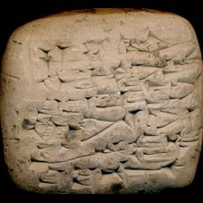 model input (224x224)  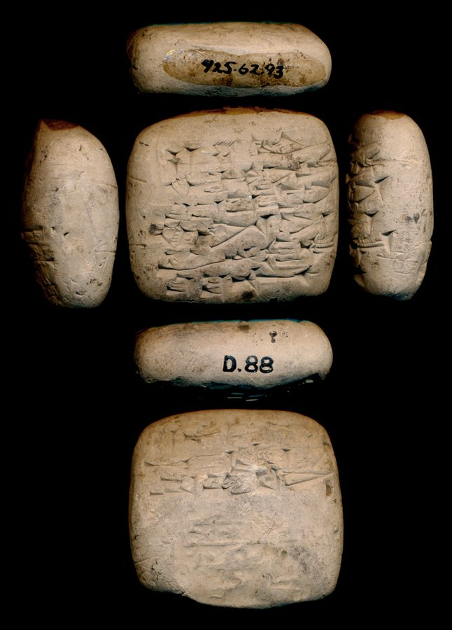 full photo (reference)</td><td valign="top"><table><tr><th>#</th><th>face</th><th>cuneiform</th><th>transliteration</th><th>translation</th></tr><tr><td>1</td><td>obverse</td><td>𒁹𒁹𒁹 𒊺 𒈗</td><td>3(barig) sze lugal</td><td>&mdash;</td></tr><tr><td>2</td><td>obverse</td><td>𒊮 𒃲 𒄏 𒋙𒀭</td><td>sza3-gal kunga2</td><td>&mdash;</td></tr><tr><td>3</td><td>obverse</td><td>𒋗 𒋢 𒂷 𒊏 𒋫</td><td>szu-su ga2-ra-ta</td><td>&mdash;</td></tr><tr><td>4</td><td>obverse</td><td>𒆠 𒀵 𒋫</td><td>ki ARAD2-ta</td><td>&mdash;</td></tr><tr><td>5</td><td>obverse</td><td>𒇽 𒊩𒌆 𒋚</td><td>lu2-nin-szubur</td><td>&mdash;</td></tr><tr><td>6</td><td>obverse</td><td>𒋗 𒁀 𒋾</td><td>szu ba-ti</td><td>&mdash;</td></tr><tr><td>1</td><td>reverse</td><td>𒌚 𒌉 𒍣</td><td>iti dumu-zi</td><td>&mdash;</td></tr><tr><td>2</td><td>reverse</td><td>𒈬 𒂍 𒅤𒊭 𒁕 𒃶 𒁀 𒆕</td><td>mu e2 puzur4-da-gan ba-du3</td><td>&mdash;</td></tr></table></td></tr></table>

**Original text (transliteration):**
> šu - su ga₂ - ra - ta

**Cuneiform (Unicode signs, whole document, not position-aligned to the text above):**
> 𒋗 𒋢 𒂷 𒊏 𒋫

**Masked input (1 positions):**
> šu - su ga₂ - ra <strong>?</strong> ta

### Restoration (masked-token predictions)

| # | true token | text-only top-1 | text-only top-3 | vision top-1 | vision top-3 | text-only correct | vision correct |
|---|---|---|---|---|---|---|---|
| 1 | `-` | `-` | `-`, `:`, `a` | `-` | `-`, `##₂`, `:` | ✅ | ✅ |

Top-1 accuracy on this example: text-only 1/1 (100%), vision 1/1 (100%)

### Metadata predictions

| head | ground truth | text-only prediction | vision prediction |
|---|---|---|---|
| period | Ur III | Ur III (0.91) | Ur III (0.89) |
| genre | Administrative | Administrative (0.92) | Administrative (0.91) |
| language | Sumerian | Sumerian (0.93) | Sumerian (0.93) |
| provenience | Umma | Umma (0.90) | Umma (0.91) |

---

## Example 12 — `P112877` (has photo: True)

*MCS 8, 71 AO 8104 -- Administrative, Ur III, Girsu (mod. Tello) -- Louvre Museum, Paris, France -- published in MCS 8 (Fish, 1958)*

<table><tr><td valign="top" width="240">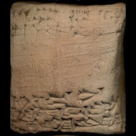 model input (224x224)  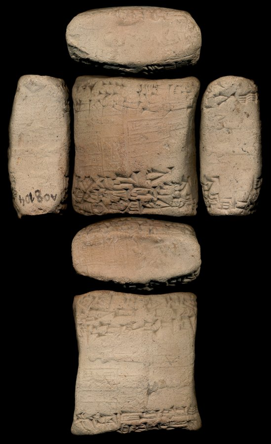 full photo (reference)</td><td valign="top"><table><tr><th>#</th><th>face</th><th>cuneiform</th><th>transliteration</th><th>translation</th></tr><tr><td>1</td><td>obverse</td><td>𒌋 𒐅 𒊺 𒄥 𒈗</td><td>3(u) 7(asz) sze gur lugal</td><td>&mdash;</td></tr><tr><td>2</td><td>obverse</td><td>𒄥 𒌓𒅗𒈦 𒃻 𒊏 𒋫</td><td>x gur zabar gar-ra-ta</td><td>&mdash;</td></tr><tr><td>3</td><td>obverse</td><td>𒀀 𒊮 𒇥 𒁺 𒋫</td><td>a-sza3 tul2-tum2-ta</td><td>&mdash;</td></tr><tr><td>4</td><td>obverse</td><td>𒆠 𒁀 𒀜 𒁕 𒌷 𒋫</td><td>ki ba-ad-da-ri2-ta</td><td>&mdash;</td></tr><tr><td>5</td><td>obverse</td><td>𒁾 𒄯 𒁉 𒂠 𒇽 𒋆</td><td>kiszib3 ur5-bi-sze3 lu2 lunga</td><td>&mdash;</td></tr><tr><td>1</td><td>reverse</td><td>𒁲 𒅗 𒑐𒋼𒋛 𒅗</td><td>sa2-du11 ensi2-ka</td><td>&mdash;</td></tr><tr><td>3</td><td>reverse</td><td>𒄊 𒌨</td><td>giri3 ur-...</td><td>&mdash;</td></tr><tr><td>4</td><td>reverse</td><td>𒌚 𒂡 𒉈 𒋜</td><td>iti ezem-li9-si4</td><td>&mdash;</td></tr><tr><td>5</td><td>reverse</td><td>𒈬 𒍑 𒊓 𒌨 𒉈 𒈝 𒆠 𒁀 𒅆𒌨</td><td>mu us2-sa ur-bi2-lum ba-hul</td><td>&mdash;</td></tr></table></td></tr></table>

**Original text (transliteration):**
> 3u 7aš še gur lugal <strong>x</strong> gur zabar gar - ra - ta sa₂ - du₁₁ ensi₂ - ka

**Cuneiform (Unicode signs, whole document, not position-aligned to the text above):**
> 𒌋 𒐅 𒊺 𒄥 𒈗 𒄥 𒌓𒅗𒈦 𒃻 𒊏 𒋫 𒁲 𒅗 𒑐𒋼𒋛 𒅗

**Masked input (4 positions):**
> 3u 7aš še <strong>?</strong> lugal <strong>x</strong> gur zabar <strong>?</strong> - ra - ta sa₂ - <strong>?</strong>₁ <strong>?</strong> ensi₂ - ka

### Restoration (masked-token predictions)

| # | true token | text-only top-1 | text-only top-3 | vision top-1 | vision top-3 | text-only correct | vision correct |
|---|---|---|---|---|---|---|---|
| 1 | `gur` | `gur` | `gur`, `lugal`, `še` | `gur` | `gur`, `lugal`, `še` | ✅ | ✅ |
| 2 | `gar` | `gar` | `gar`, `gur`, `kur` | `gar` | `gar`, `##₃`, `bar` | ✅ | ✅ |
| 3 | `du` | `du` | `du`, `sig`, `gur` | `du` | `du`, `##₁`, `si` | ✅ | ✅ |
| 4 | `##₁` | `##₁` | `##₁`, `##₇`, `##₀` | `##₁` | `##₁`, `##₇`, `##₀` | ✅ | ✅ |

Top-1 accuracy on this example: text-only 4/4 (100%), vision 4/4 (100%)

### Metadata predictions

| head | ground truth | text-only prediction | vision prediction |
|---|---|---|---|
| period | Ur III | Ur III (0.94) | Ur III (0.92) |
| genre | Administrative | Administrative (0.92) | Administrative (0.91) |
| language | Sumerian | Sumerian (0.93) | Sumerian (0.94) |
| provenience | Girsu | Umma (0.71) | Umma (0.69) |

---

## Example 13 — `P144721` (has photo: False)

*SAT 3, 1521 -- Administrative, Ur III, Umma (mod. Tell Jokha) -- Yale Babylonian Collection, New Haven, Connecticut, USA -- published in Texts from the Yale Babylonian collections. Part 2 (Sigrist, 2000)*

**Original text (transliteration):**
> 1ban₂ še - ba lu₂ - ama - na dumu ukken - ne₂ ki lugal - e₂ - mah - e 1ban₂ 5diš sila₃ ARAD2 - D šara₂ ki lu₂ - du₁₀ - ga nu - banda₃ - gu₄

**Cuneiform (Unicode signs, whole document, not position-aligned to the text above):**
> 𒑏 𒊺 𒁀 𒇽 𒂼 𒈾 𒌉 𒌺 𒉌 𒆠 𒈗 𒂍 𒈤 𒂊 𒑏 𒐊 𒋡 𒀵 <D> 𒇋 𒆠 𒇽 𒄭 𒂵 𒉡 𒌉 𒄞

**Masked input (8 positions):**
> 1ban₂ še - ba lu <strong>?</strong> <strong>?</strong> ama - na dumu ukken - ne₂ ki lugal - <strong>?</strong>₂ - mah - e <strong>?</strong>₂ 5diš sila₃ ARAD <strong>?</strong> - D šara₂ ki lu <strong>?</strong> <strong>?</strong> du₁₀ - ga nu - banda₃ - gu <strong>?</strong>

### Restoration (masked-token predictions)

| # | true token | text-only top-1 | text-only top-3 | vision top-1 | vision top-3 | text-only correct | vision correct |
|---|---|---|---|---|---|---|---|
| 1 | `##₂` | `##₂` | `##₂`, `##l`, `##kur` | `##₂` | `##₂`, `##kur`, `##m` | ✅ | ✅ |
| 2 | `-` | `-` | `-`, `D`, `:` | `-` | `-`, `D`, `:` | ✅ | ✅ |
| 3 | `e` | `e` | `e`, `nam`, `a` | `e` | `e`, `nam`, `a` | ✅ | ✅ |
| 4 | `1ban` | `1ban` | `1ban`, `3ban`, `lu` | `1ban` | `1ban`, `3ban`, `##ban` | ✅ | ✅ |
| 5 | `##2` | `##₂` | `##₂`, `##2`, `##3` | `##₂` | `##₂`, `##2`, `##3` | ❌ | ❌ |
| 6 | `##₂` | `##₂` | `##₂`, `##₃`, `##₅` | `##₂` | `##₂`, `##₃`, `##m` | ✅ | ✅ |
| 7 | `-` | `-` | `-`, `:`, `##₂` | `-` | `-`, `:`, `D` | ✅ | ✅ |
| 8 | `##₄` | `##₄` | `##₄`, `##₇`, `##₂` | `##₄` | `##₄`, `##₇`, `##₂` | ✅ | ✅ |

Top-1 accuracy on this example: text-only 7/8 (88%), vision 7/8 (88%)

### Metadata predictions

| head | ground truth | text-only prediction | vision prediction |
|---|---|---|---|
| period | Ur III | Ur III (0.92) | Ur III (0.92) |
| genre | Administrative | Administrative (0.93) | Administrative (0.91) |
| language | Sumerian | Sumerian (0.92) | Sumerian (0.93) |
| provenience | Umma | Umma (0.91) | Umma (0.90) |

---

## Example 14 — `P285954` (has photo: False)

*CT 51, 092 -- Lexical, Babylon (mod. Bābil) -- British Museum, London, UK -- published in Miscellaneous texts (1972)*

**Original text (transliteration):**
> <strong>x</strong> 30 - mu - kin - AGA - EN - ti - šu₂ SILA KA₂. <strong>x</strong> - <strong>x</strong> SILA IŠKUR - za - nin - UN. MEŠ - šu₂ SILA KA₂. GAL - <strong>x</strong> SILA UTU - ṣu - lul - ERIM. MEŠ - šu₂ SILA KA₂. GAL - UTU SILA ku - ru - ub - liš - me - e - me - e - u₂ - su SILA E. SIR₂ SIG₅ - DINGIR - šu₂ E. SIR₂ KA₂. LIMMU₂. BA SILA E. SIR₂ IMIN. BI E. SIR₂ MAŠ. TAB. TA SILA ḫu - ud - da - KUR - su - ṭa - at - su - ka - ra - bi SILA i - šem - mu - ana - ru - u₂ - qa su - ul - a AMAR. UTU <strong>x</strong>. NIGIN 43 ma - aḫ - zi DINGIR. MEŠ GAL. MEŠ <strong>x</strong> - bi KA₂. DINGIR. RA 55 BARA₂. DIDLI AMAR. UTU. <strong>x</strong> <strong>x</strong> ker - ḫi 3 ID₂. MEŠ 8 KA₂. MEŠ 24 SILA E <strong>x</strong> - ḫur - sag - ti - la a - na 3 ŠUB - u₂ <strong>x</strong> ti - im - lak - e - ḫi - is MU - šu₂ <strong>x</strong> <strong>x</strong> am - mu MU - šu₂ BARA₂ ša₂ ina E₂ qu - le - e ina pa - na - at <strong>x</strong> ni - na - a - tum na - du - u₂

**Masked input (51 positions):**
> <strong>x</strong> 30 - mu - kin - <strong>?</strong>A - EN - ti - šu₂ SI <strong>?</strong> KA₂. <strong>x</strong> <strong>?</strong> <strong>x</strong> SI <strong>?</strong> IŠ <strong>?</strong>UR - za <strong>?</strong> nin <strong>?</strong> UN. <strong>?</strong> - <strong>?</strong>₂ SI <strong>?</strong> <strong>?</strong>₂. GAL - <strong>x</strong> SILA UT <strong>?</strong> <strong>?</strong> <strong>?</strong>u - <strong>?</strong>l - ERIM. MEŠ - šu₂ SILA <strong>?</strong>₂. GAL - UTU SILA ku - ru - ub - liš - me - e - me <strong>?</strong> e - u₂ - <strong>?</strong> <strong>?</strong>LA E. SI <strong>?</strong>₂ SI <strong>?</strong>₅ - DINGIR <strong>?</strong> šu₂ <strong>?</strong>. SIR₂ <strong>?</strong>₂. LIMMU₂. BA SILA E. <strong>?</strong>R₂ IMIN <strong>?</strong> BI E. SIR₂ MAŠ. TAB. TA SILA ḫu <strong>?</strong> ud - da - KUR - su - ṭa - at - su - ka - ra - bi SILA i - šem - mu <strong>?</strong> ana - <strong>?</strong> <strong>?</strong> u₂ - qa su - ul - <strong>?</strong> <strong>?</strong>AR. UTU <strong>x</strong>. NIGIN 43 ma - a <strong>?</strong> - zi DINGIR. MEŠ GAL. MEŠ <strong>x</strong> - bi KA₂. DINGIR. RA 55 BARA₂. DIDLI AM <strong>?</strong>. UTU. <strong>x</strong> <strong>x</strong> ker - ḫ <strong>?</strong> 3 <strong>?</strong> <strong>?</strong>. MEŠ 8 KA₂. MEŠ 24 SILA E <strong>x</strong> - ḫ <strong>?</strong> - sag - <strong>?</strong> <strong>?</strong> la <strong>?</strong> - na 3 ŠUB - u₂ <strong>x</strong> ti - im - <strong>?</strong>k - e - ḫi <strong>?</strong> is MU - šu₂ <strong>x</strong> <strong>x</strong> am - mu MU <strong>?</strong> šu₂ BARA₂ ša₂ <strong>?</strong> E₂ qu - <strong>?</strong> - e ina <strong>?</strong> - na - at <strong>x</strong> ni - na <strong>?</strong> <strong>?</strong> - tum na - du - <strong>?</strong> <strong>?</strong>

### Restoration (masked-token predictions)

| # | true token | text-only top-1 | text-only top-3 | vision top-1 | vision top-3 | text-only correct | vision correct |
|---|---|---|---|---|---|---|---|
| 1 | `AG` | `AM` | `AM`, `Z`, `AG` | `Z` | `Z`, `AM`, `Š` | ❌ | ❌ |
| 2 | `##LA` | `##LA` | `##LA`, `##L`, `##PA` | `##LA` | `##LA`, `##L`, `##PA` | ✅ | ✅ |
| 3 | `-` | `-` | `-`, `.`, `+` | `-` | `-`, `.`, `+` | ✅ | ✅ |
| 4 | `##LA` | `##LA` | `##LA`, `##L`, `##PA` | `##LA` | `##LA`, `##L`, `##PA` | ✅ | ✅ |
| 5 | `##K` | `##K` | `##K`, `##H`, `G` | `##K` | `##K`, `##H`, `##T` | ✅ | ✅ |
| 6 | `-` | `-` | `-`, `.`, `##r` | `-` | `-`, `##r`, `:` | ✅ | ✅ |
| 7 | `-` | `-` | `-`, `##₂`, `##sku` | `-` | `-`, `ša`, `##₂` | ✅ | ✅ |
| 8 | `MEŠ` | `MEŠ` | `MEŠ`, `ME`, `GI` | `MEŠ` | `MEŠ`, `NA`, `ME` | ✅ | ✅ |
| 9 | `šu` | `šu` | `šu`, `u`, `ša` | `šu` | `šu`, `u`, `ša` | ✅ | ✅ |
| 10 | `##LA` | `##LA` | `##LA`, `##L`, `##A` | `##LA` | `##LA`, `##L`, `##PA` | ✅ | ✅ |
| 11 | `KA` | `E` | `E`, `KA`, `e` | `E` | `E`, `KA`, `e` | ❌ | ❌ |
| 12 | `##U` | `##U` | `##U`, `##UL`, `##UR` | `##U` | `##U`, `##UL`, `##UR` | ✅ | ✅ |
| 13 | `-` | `-` | `-`, `.`, `u` | `-` | `-`, `.`, `u` | ✅ | ✅ |
| 14 | `ṣ` | `ḫ` | `ḫ`, `ṣ`, `ṭ` | `ḫ` | `ḫ`, `ṣ`, `ṭ` | ❌ | ❌ |
| 15 | `lu` | `lu` | `lu`, `li`, `ša` | `lu` | `lu`, `li`, `ša` | ✅ | ✅ |
| 16 | `KA` | `E` | `E`, `KA`, `e` | `E` | `E`, `KA`, `e` | ❌ | ❌ |
| 17 | `-` | `-` | `-`, `.`, `##₂` | `-` | `-`, `.`, `:` | ✅ | ✅ |
| 18 | `su` | `ti` | `ti`, `a`, `qa` | `qa` | `qa`, `ti`, `a` | ❌ | ❌ |
| 19 | `SI` | `SI` | `SI`, `SA`, `MI` | `SI` | `SI`, `SA`, `##SI` | ✅ | ✅ |
| 20 | `##R` | `##R` | `##R`, `##RA`, `##AR` | `##R` | `##R`, `##G`, `##AR` | ✅ | ✅ |
| 21 | `##G` | `##G` | `##G`, `##R`, `##D` | `##G` | `##G`, `##R`, `##LA` | ✅ | ✅ |
| 22 | `-` | `-` | `-`, `.`, `:` | `-` | `-`, `.`, `:` | ✅ | ✅ |
| 23 | `E` | `E` | `E`, `e`, `A` | `E` | `E`, `e`, `EN` | ✅ | ✅ |
| 24 | `KA` | `KA` | `KA`, `E`, `LU` | `KA` | `KA`, `E`, `LU` | ✅ | ✅ |
| 25 | `SI` | `SI` | `SI`, `U`, `SA` | `SI` | `SI`, `SA`, `U` | ✅ | ✅ |
| 26 | `.` | `.` | `.`, `-`, `##₂` | `.` | `.`, `-`, `##₂` | ✅ | ✅ |
| 27 | `-` | `-` | `-`, `.`, `##₂` | `-` | `-`, `:`, `.` | ✅ | ✅ |
| 28 | `-` | `-` | `-`, `##š`, `##l` | `-` | `-`, `##š`, `##t` | ✅ | ✅ |
| 29 | `ru` | `ku` | `ku`, `šu`, `mu` | `ku` | `ku`, `šu`, `mu` | ❌ | ❌ |
| 30 | `-` | `-` | `-`, `##₂`, `ina` | `-` | `-`, `##₂`, `ina` | ✅ | ✅ |
| 31 | `a` | `lu` | `lu`, `la`, `li` | `lu` | `lu`, `li`, `mu` | ❌ | ❌ |
| 32 | `AM` | `AM` | `AM`, `H`, `##AM` | `AM` | `AM`, `H`, `Š` | ✅ | ✅ |
| 33 | `##ḫ` | `##ʾ` | `##ʾ`, `##ḫ`, `##ṣ` | `##ʾ` | `##ʾ`, `##ṣ`, `##ḫ` | ❌ | ❌ |
| 34 | `##AR` | `##AR` | `##AR`, `##A`, `##₂` | `##AR` | `##AR`, `##₂`, `##R` | ✅ | ✅ |
| 35 | `##i` | `##i` | `##i`, `##u`, `##ir` | `##i` | `##i`, `##u`, `##a` | ✅ | ✅ |
| 36 | `ID` | `KA` | `KA`, `ŠU`, `E` | `KA` | `KA`, `E`, `ŠU` | ❌ | ❌ |
| 37 | `##₂` | `##₂` | `##₂`, `##B`, `##I` | `##₂` | `##₂`, `##IM`, `##I` | ✅ | ✅ |
| 38 | `##ur` | `##ur` | `##ur`, `##u`, `##a` | `##i` | `##i`, `##u`, `##a` | ✅ | ❌ |
| 39 | `ti` | `il` | `il`, `gal`, `gu` | `il` | `il`, `gal`, `lu` | ❌ | ❌ |
| 40 | `-` | `-` | `-`, `##₂`, `##₄` | `-` | `-`, `##₂`, `##₄` | ✅ | ✅ |
| 41 | `a` | `a` | `a`, `i`, `in` | `a` | `a`, `i`, `in` | ✅ | ✅ |
| 42 | `la` | `tu` | `tu`, `su`, `ša` | `tu` | `tu`, `su`, `du` | ❌ | ❌ |
| 43 | `-` | `-` | `-`, `.`, `:` | `-` | `-`, `:`, `.` | ✅ | ✅ |
| 44 | `-` | `-` | `-`, `.`, `:` | `-` | `-`, `.`, `:` | ✅ | ✅ |
| 45 | `ina` | `ina` | `ina`, `EN`, `LUGAL` | `ina` | `ina`, `EN`, `ana` | ✅ | ✅ |
| 46 | `le` | `re` | `re`, `le`, `de` | `re` | `re`, `le`, `de` | ❌ | ❌ |
| 47 | `pa` | `dan` | `dan`, `da`, `ši` | `ma` | `ma`, `pa`, `na` | ❌ | ❌ |
| 48 | `-` | `-` | `-`, `.`, `u` | `-` | `-`, `.`, `u` | ✅ | ✅ |
| 49 | `a` | `a` | `a`, `ab`, `ba` | `a` | `a`, `ab`, `ba` | ✅ | ✅ |
| 50 | `u` | `u` | `u`, `lu`, `a` | `u` | `u`, `lu`, `qu` | ✅ | ✅ |
| 51 | `##₂` | `-` | `-`, `##₂`, `u` | `-` | `-`, `##₂`, `u` | ❌ | ❌ |

Top-1 accuracy on this example: text-only 37/51 (73%), vision 36/51 (71%)

### Metadata predictions

| head | ground truth | text-only prediction | vision prediction |
|---|---|---|---|
| period | (no label) | Neo-Babylonian (0.53) | Neo-Assyrian (0.60) **<- differs** |
| genre | Lexical | Lexical (0.68) | Lexical (0.86) |
| language | (no label) | Akkadian (0.89) | Akkadian (0.90) |
| provenience | Babylon | Babylon (0.31) | Nineveh (0.26) **<- differs** |

---

## Example 15 — `P377065` (has photo: False)

*Nisaba 31/2, 141 -- Administrative, Ur III, Girsu (mod. Tello) -- British Museum, London, UK -- published in Neo-Sumerian administrative texts from the Géjou collection kept in the British Museum (Alivernini, 2019)*

**Original text (transliteration):**
> a - ša₃ nin - mar - ki kišib₃ lugal - e₂ - mah - e mu šu - suen lugal

**Masked input (4 positions):**
> a - ša₃ nin - <strong>?</strong> <strong>?</strong> ki kišib₃ lugal - e₂ <strong>?</strong> mah - e mu <strong>?</strong> - suen lugal

### Restoration (masked-token predictions)

| # | true token | text-only top-1 | text-only top-3 | vision top-1 | vision top-3 | text-only correct | vision correct |
|---|---|---|---|---|---|---|---|
| 1 | `mar` | `mar` | `mar`, `ur`, `sun` | `šu` | `šu`, `sun`, `mar` | ✅ | ❌ |
| 2 | `-` | `-` | `-`, `##ar`, `##bur` | `##bur` | `##bur`, `-`, `##₂` | ✅ | ❌ |
| 3 | `-` | `-` | `-`, `:`, `.` | `-` | `-`, `:`, `.` | ✅ | ✅ |
| 4 | `šu` | `šu` | `šu`, `amar`, `ur` | `šu` | `šu`, `amar`, `ur` | ✅ | ✅ |

Top-1 accuracy on this example: text-only 4/4 (100%), vision 2/4 (50%)

### Metadata predictions

| head | ground truth | text-only prediction | vision prediction |
|---|---|---|---|
| period | Ur III | Ur III (0.92) | Ur III (0.92) |
| genre | Administrative | Administrative (0.92) | Administrative (0.92) |
| language | Sumerian | Sumerian (0.94) | Sumerian (0.93) |
| provenience | Girsu | Umma (0.90) | Umma (0.91) |

---

## Example 16 — `P011043` (has photo: True)

*WF 086 -- Administrative, ED IIIa, Shuruppak (mod. Fara) -- Vorderasiatisches Museum, Berlin, Germany -- published in Wirtschafttexte Aus Fara (Deimel, 1924)*

<table><tr><td valign="top" width="240">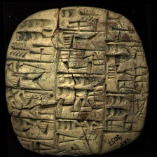 model input (224x224)  </td><td valign="top"><table><tr><th>#</th><th>face</th><th>cuneiform</th><th>transliteration</th><th>translation</th></tr><tr><td>1</td><td>obverse</td><td>𒐅 𒊺 𒄥</td><td>7(asz@c) 1/2(asz@c) sze gur</td><td>&mdash;</td></tr><tr><td>2</td><td>obverse</td><td>𒐂 𒈗 𒀉 𒈤</td><td>4(asz@c) lugal-a2-mah</td><td>&mdash;</td></tr><tr><td>3</td><td>obverse</td><td>𒉽 𒀉 𒉡 𒊨</td><td>pa4-a2-nu-kusz2</td><td>&mdash;</td></tr><tr><td>4</td><td>obverse</td><td>𒐅 𒁾 𒌋𒌆 𒋻</td><td>7(asz@c) dub-dul-tar</td><td>&mdash;</td></tr><tr><td>5</td><td>obverse</td><td>𒐁 𒁹 𒑐 𒅗 𒉌 𒍣</td><td>3(asz@c) 1/2(asz@c) 1(barig@c) 2(ban2@c) KA-ni-zi</td><td>&mdash;</td></tr><tr><td>1</td><td>reverse</td><td>𒐀 𒋗 𒁁</td><td>2(asz@c) szu bad</td><td>&mdash;</td></tr><tr><td>2</td><td>reverse</td><td>𒈗 𒆠 𒆪 𒄭</td><td>lugal-ki-tusz-du10</td><td>&mdash;</td></tr><tr><td>3</td><td>reverse</td><td>𒐃 𒋗 𒁁</td><td>5(asz@c) szu bad</td><td>&mdash;</td></tr><tr><td>4</td><td>reverse</td><td>𒋀 𒂼 𒈾</td><td>szesz-ama-na</td><td>&mdash;</td></tr></table></td></tr></table>

**Original text (transliteration):**
> lu₂ šu bad 7aš @ c dub - dul - tar

**Cuneiform (Unicode signs, whole document, not position-aligned to the text above):**
> 𒇽 𒋗 𒁁 𒁾 𒌋𒌆 𒋻

**Masked input (2 positions):**
> lu₂ šu bad 7aš @ c dub <strong>?</strong> <strong>?</strong>l - tar

### Restoration (masked-token predictions)

| # | true token | text-only top-1 | text-only top-3 | vision top-1 | vision top-3 | text-only correct | vision correct |
|---|---|---|---|---|---|---|---|
| 1 | `-` | `-` | `-`, `##₂`, `gur` | `-` | `-`, `gur`, `##₂` | ✅ | ✅ |
| 2 | `du` | `ka` | `ka`, `šu`, `ku` | `ka` | `ka`, `šu`, `ku` | ❌ | ❌ |

Top-1 accuracy on this example: text-only 1/2 (50%), vision 1/2 (50%)

### Metadata predictions

| head | ground truth | text-only prediction | vision prediction |
|---|---|---|---|
| period | Third Millennium | Third Millennium (0.95) | Third Millennium (0.94) |
| genre | Administrative | Administrative (0.93) | Administrative (0.93) |
| language | Sumerian | Sumerian (0.90) | Sumerian (0.91) |
| provenience | Šuruppak | Girsu (0.34) | Šuruppak (0.81) **<- differs** |

---

## Example 17 — `P393918` (has photo: False)

*ABL 1002 -- Letter, Neo-Assyrian, Nineveh (mod. Kuyunjik) -- British Museum, London, UK -- published in Assyrian and Babylonian letters belonging to the Kouyunjik collections of the British museum (Harper, 1892-1914)*

**Original text (transliteration):**
> ša at - tu - nu EN. NUN ta - aṣ - ṣur - a - ni tam - qut - a - ni me - ta - ku - nu - u - ni <strong>x</strong> <strong>x</strong> <strong>x</strong> u₃ ina UGU 30 - MAN - PAB ša₂ taq - ba - a - ni ma - a la ra - i - mu ša₂ KUR - aš - šur šu - u a - na - ku la u₂ - da - a ki - i e - mur - u - ni DINGIR - MEŠ - ia₂ i - na ŠU. 2 KUR₂ - ia₂ la u₂ - šal - lim - u₂ - ni e - ta - at - qa it - tal - ka i - na GIR₃. 2 - MEŠ - ia₂ iṣ - ṣa - bat u ina UGU ša₂ taq - ba - a - ni ma - a dib - bi - ia sam - ku - u - te ina IGI GAL - MEŠ i - dab₂ - bu - ub mi - i - nu hap - pu an - ni - u ina UGU - hi - ka i - qab - bi <strong>x</strong> <strong>x</strong> <strong>x</strong> u ina UGU <strong>x</strong> <strong>x</strong> <strong>x</strong> <strong>x</strong> <strong>x</strong> <strong>x</strong> <strong>x</strong> <strong>x</strong> šul <strong>x</strong> <strong>x</strong> <strong>x</strong> <strong>x</strong> <strong>x</strong> <strong>x</strong> <strong>x</strong> <strong>x</strong> an - ni - u <strong>x</strong> <strong>x</strong> <strong>x</strong> <strong>x</strong> <strong>x</strong> <strong>x</strong> <strong>x</strong> dul - lu - u ša₂ a - na <strong>x</strong> <strong>x</strong> <strong>x</strong> <strong>x</strong> <strong>x</strong> a - dag - gal <strong>x</strong> um <strong>x</strong> + <strong>x</strong> <strong>x</strong> <strong>x</strong> <strong>x</strong> <strong>x</strong> EN. NUN ta - aṣ - ṣur - a - ni tam - qut - a - ni ina UGU šu - me - ia₂ me - ta - ku - nu - u - ni šu - u i - qab - bi - a <strong>x</strong> <strong>x</strong> <strong>x</strong> <strong>x</strong> <strong>x</strong> muh - hu - u šu - u <strong>x</strong> <strong>x</strong> <strong>x</strong> <strong>x</strong> <strong>x</strong> <strong>x</strong> <strong>x</strong> <strong>x</strong> <strong>x</strong> <strong>x</strong> GA NAG

**Cuneiform (Unicode signs, whole document, not position-aligned to the text above):**
> 𒊭 𒀜 𒌅 𒉡 𒂗 𒉣 𒋫 𒊍 𒀫 𒀀 𒉌 𒌓 𒋻 𒀀 𒉌 𒈨 𒋫 𒆪 𒉡 𒌋 𒉌 x x x 𒅇 𒀸 𒌋𒅗 𒁹 𒀭 𒌍 𒎙 𒉽 𒃻 𒋳 𒁀 𒀀 𒉌 𒈠 𒀀 𒆷 𒊏 𒄿 𒈬 𒃻 𒆳 𒀸 𒋩 𒋗 𒌋 𒀀 𒈾 𒆪 𒆷 𒌑 𒁕 𒀀 𒆠 𒄿 𒂊 𒄯 𒌋 𒉌 𒀭 𒎌 𒐊 𒄿 𒈾 𒋗 𒈫 𒇽 𒉽 𒐊 𒆷 𒌑 𒊩 𒅆 𒌑 𒉌 𒂊 𒋫 𒀜 𒋡 𒀉 𒊑 𒅗 𒄿 𒈾 𒄊 𒈫 𒎌 𒐊 𒄑 𒍝 𒁁 𒌋 𒀸 𒌋𒅗 𒃻 𒋳 𒁀 𒀀 𒉌 𒈠 𒀀 𒁳 𒁉 𒅀 𒌑 𒆪 𒌋 𒋼 𒀸 𒅆 𒇽 𒃲 𒎌 𒄿 𒋰 𒁍 𒌒 𒈪 𒄿 𒉡 𒇽 𒆸 𒁍 𒀭 𒉌 𒌋 𒀸 𒌋𒅗 𒄭 𒅗 𒄿 𒃮 𒁉 x x x 𒌋 𒀸 𒌋𒅗 x x x x x x x x 𒂄 x x x x x x x x 𒀭 𒉌 𒌋 x x x x x x x 𒌋𒌆 𒇻 𒌋 𒃻 𒀀 𒈾 x x x x x 𒀀 𒁖 𒃲 x 𒌝 x x x x x x 𒂗 𒉣 𒋫 𒊍 𒀫 𒀀 𒉌 𒌓 𒋻 𒀀 𒉌 𒀸 𒌋𒅗 𒋗 𒈨 𒐊 𒈨 𒋫 𒆪 𒉡 𒌋 𒉌 𒋗 𒌋 𒄿 𒃮 𒁉 𒀀 x x x x x 𒌋𒅗 𒄷 𒌋 𒋗 𒌋 x x x x x x x x x x 𒂵 𒅘

**Masked input (50 positions):**
> <strong>?</strong> at - <strong>?</strong> - nu EN. <strong>?</strong>UN ta - aṣ - ṣur <strong>?</strong> a - ni tam - qut - a - ni me - ta - ku - nu - u - ni <strong>x</strong> <strong>x</strong> <strong>x</strong> u₃ ina UGU 30 - MAN - PAB ša <strong>?</strong> <strong>?</strong>q - ba - a - ni ma - a la ra - i <strong>?</strong> mu ša₂ KUR - aš - šur šu - <strong>?</strong> a - na - <strong>?</strong> la u₂ - da <strong>?</strong> <strong>?</strong> ki - i e - mur - u - ni DINGIR - MEŠ - ia₂ <strong>?</strong> - na ŠU <strong>?</strong> 2 KUR₂ - ia₂ la u₂ <strong>?</strong> šal - lim - <strong>?</strong>₂ - ni e - ta - at - qa it - tal - <strong>?</strong> i - na GIR₃. <strong>?</strong> <strong>?</strong> MEŠ - ia₂ iṣ <strong>?</strong> ṣa - <strong>?</strong> <strong>?</strong> ina UGU ša <strong>?</strong> taq - ba - a - <strong>?</strong> ma - <strong>?</strong> <strong>?</strong>b - bi - ia <strong>?</strong> - <strong>?</strong> - u - te ina IGI GAL - MEŠ i <strong>?</strong> dab <strong>?</strong> - bu - ub <strong>?</strong> <strong>?</strong> i - nu hap <strong>?</strong> pu <strong>?</strong> - ni - u ina <strong>?</strong>GU <strong>?</strong> hi <strong>?</strong> ka i <strong>?</strong> qab - bi <strong>x</strong> <strong>x</strong> <strong>x</strong> u ina UGU <strong>x</strong> <strong>x</strong> <strong>x</strong> <strong>x</strong> <strong>x</strong> <strong>x</strong> <strong>x</strong> <strong>x</strong> šul <strong>x</strong> <strong>x</strong> <strong>x</strong> <strong>x</strong> <strong>x</strong> <strong>x</strong> <strong>x</strong> <strong>x</strong> an - ni - u <strong>x</strong> <strong>x</strong> <strong>x</strong> <strong>x</strong> <strong>x</strong> <strong>x</strong> <strong>x</strong> dul - lu - u ša <strong>?</strong> a - na <strong>x</strong> <strong>x</strong> <strong>x</strong> <strong>x</strong> <strong>x</strong> a - dag <strong>?</strong> gal <strong>x</strong> um <strong>x</strong> + <strong>x</strong> <strong>x</strong> <strong>x</strong> <strong>x</strong> <strong>x</strong> EN. NUN <strong>?</strong> - aṣ - ṣ <strong>?</strong> - <strong>?</strong> - ni tam <strong>?</strong> qut <strong>?</strong> a - ni ina UG <strong>?</strong> šu - me - ia₂ me - ta <strong>?</strong> ku <strong>?</strong> nu - u <strong>?</strong> ni šu - u i - qab - bi - a <strong>x</strong> <strong>x</strong> <strong>x</strong> <strong>x</strong> <strong>x</strong> <strong>?</strong>h <strong>?</strong> hu - u šu - u <strong>x</strong> <strong>x</strong> <strong>x</strong> <strong>x</strong> <strong>x</strong> <strong>x</strong> <strong>x</strong> <strong>x</strong> <strong>x</strong> <strong>x</strong> GA NAG

### Restoration (masked-token predictions)

| # | true token | text-only top-1 | text-only top-3 | vision top-1 | vision top-3 | text-only correct | vision correct |
|---|---|---|---|---|---|---|---|
| 1 | `ša` | `₂` | `₂`, `u`, `-` | `u` | `u`, `₂`, `la` | ❌ | ❌ |
| 2 | `tu` | `ta` | `ta`, `tu`, `tan` | `ta` | `ta`, `tu`, `tan` | ❌ | ❌ |
| 3 | `N` | `N` | `N`, `n`, `G` | `N` | `N`, `n`, `G` | ✅ | ✅ |
| 4 | `-` | `-` | `-`, `.`, `:` | `-` | `-`, `.`, `:` | ✅ | ✅ |
| 5 | `##₂` | `##₂` | `##₂`, `-`, `LUGAL` | `##₂` | `##₂`, `-`, `ina` | ✅ | ✅ |
| 6 | `ta` | `ta` | `ta`, `te`, `tu` | `ta` | `ta`, `te`, `tu` | ✅ | ✅ |
| 7 | `-` | `-` | `-`, `.`, `:` | `-` | `-`, `.`, `:` | ✅ | ✅ |
| 8 | `u` | `u` | `u`, `nu`, `ma` | `u` | `u`, `nu`, `ut` | ✅ | ✅ |
| 9 | `ku` | `ku` | `ku`, `a`, `ka` | `ku` | `ku`, `ka`, `a` | ✅ | ✅ |
| 10 | `-` | `-` | `-`, `##k`, `##h` | `-` | `-`, `##k`, `##h` | ✅ | ✅ |
| 11 | `a` | `a` | `a`, `an`, `mu` | `a` | `a`, `ri`, `nu` | ✅ | ✅ |
| 12 | `i` | `a` | `a`, `i`, `an` | `a` | `a`, `i`, `an` | ❌ | ❌ |
| 13 | `.` | `.` | `.`, `-`, `/` | `.` | `.`, `-`, `/` | ✅ | ✅ |
| 14 | `-` | `-` | `-`, `.`, `:` | `-` | `-`, `.`, `:` | ✅ | ✅ |
| 15 | `u` | `u` | `u`, `šu`, `tu` | `u` | `u`, `šu`, `ša` | ✅ | ✅ |
| 16 | `ka` | `ka` | `ka`, `ku`, `kam` | `ka` | `ka`, `ku`, `kam` | ✅ | ✅ |
| 17 | `2` | `2` | `2`, `II`, `3` | `2` | `2`, `II`, `3` | ✅ | ✅ |
| 18 | `-` | `-` | `-`, `.`, `:` | `-` | `-`, `.`, `:` | ✅ | ✅ |
| 19 | `-` | `-` | `-`, `.`, `:` | `-` | `-`, `.`, `:` | ✅ | ✅ |
| 20 | `bat` | `ab` | `ab`, `bat`, `a` | `bat` | `bat`, `ab`, `a` | ❌ | ✅ |
| 21 | `u` | `##₂` | `##₂`, `##b`, `u` | `##₂` | `##₂`, `##b`, `##i` | ❌ | ❌ |
| 22 | `##₂` | `##₂` | `##₂`, `-`, `LUGAL` | `##₂` | `##₂`, `-`, `ina` | ✅ | ✅ |
| 23 | `ni` | `ni` | `ni`, `nu`, `na` | `ni` | `ni`, `nu`, `na` | ✅ | ✅ |
| 24 | `a` | `a` | `a`, `la`, `i` | `a` | `a`, `la`, `i` | ✅ | ✅ |
| 25 | `di` | `qa` | `qa`, `i`, `di` | `qa` | `qa`, `di`, `ka` | ❌ | ❌ |
| 26 | `sam` | `a` | `a`, `e`, `at` | `e` | `e`, `a`, `i` | ❌ | ❌ |
| 27 | `ku` | `nu` | `nu`, `mu`, `pu` | `mur` | `mur`, `bu`, `nu` | ❌ | ❌ |
| 28 | `-` | `-` | `-`, `+`, `##₃` | `-` | `-`, `+`, `##₃` | ✅ | ✅ |
| 29 | `##₂` | `##₂` | `##₂`, `##b`, `##₃` | `##₂` | `##₂`, `##b`, `##₅` | ✅ | ✅ |
| 30 | `mi` | `-` | `-`, `šu`, `mi` | `šu` | `šu`, `mi`, `-` | ❌ | ❌ |
| 31 | `-` | `-` | `-`, `ni`, `##₂` | `-` | `-`, `##₂`, `ni` | ✅ | ✅ |
| 32 | `-` | `-` | `-`, `.`, `##₂` | `-` | `-`, `.`, `##₂` | ✅ | ✅ |
| 33 | `an` | `an` | `an`, `pa`, `a` | `an` | `an`, `pa`, `a` | ✅ | ✅ |
| 34 | `U` | `U` | `U`, `u`, `G` | `U` | `U`, `u`, `I` | ✅ | ✅ |
| 35 | `-` | `-` | `-`, `la`, `LUGAL` | `-` | `-`, `ina`, `ša` | ✅ | ✅ |
| 36 | `-` | `-` | `-`, `la`, `.` | `-` | `-`, `la`, `ina` | ✅ | ✅ |
| 37 | `-` | `-` | `-`, `+`, `.` | `-` | `-`, `##₃`, `+` | ✅ | ✅ |
| 38 | `##₂` | `##₂` | `##₂`, `##d`, `LUGAL` | `##₂` | `##₂`, `LUGAL`, `##d` | ✅ | ✅ |
| 39 | `-` | `-` | `-`, `##₂`, `ina` | `-` | `-`, `##₂`, `##₃` | ✅ | ✅ |
| 40 | `ta` | `ta` | `ta`, `tu`, `te` | `ta` | `ta`, `tu`, `te` | ✅ | ✅ |
| 41 | `##ur` | `##ur` | `##ur`, `##ar`, `##ir` | `##ur` | `##ur`, `##ir`, `##ar` | ✅ | ✅ |
| 42 | `a` | `a` | `a`, `i`, `an` | `a` | `a`, `an`, `u` | ✅ | ✅ |
| 43 | `-` | `-` | `-`, `.`, `:` | `-` | `-`, `.`, `:` | ✅ | ✅ |
| 44 | `-` | `-` | `-`, `.`, `:` | `-` | `-`, `.`, `:` | ✅ | ✅ |
| 45 | `##U` | `##U` | `##U`, `##₂`, `##UD` | `##U` | `##U`, `##₂`, `-` | ✅ | ✅ |
| 46 | `-` | `-` | `-`, `.`, `:` | `-` | `-`, `.`, `:` | ✅ | ✅ |
| 47 | `-` | `-` | `-`, `.`, `:` | `-` | `-`, `.`, `:` | ✅ | ✅ |
| 48 | `-` | `-` | `-`, `.`, `##₂` | `-` | `-`, `.`, `##₂` | ✅ | ✅ |
| 49 | `mu` | `u` | `u`, `mu`, `ta` | `u` | `u`, `du`, `mu` | ❌ | ❌ |
| 50 | `-` | `-` | `-`, `.`, `##₂` | `-` | `-`, `.`, `##₂` | ✅ | ✅ |

Top-1 accuracy on this example: text-only 40/50 (80%), vision 41/50 (82%)

### Metadata predictions

| head | ground truth | text-only prediction | vision prediction |
|---|---|---|---|
| period | Neo-Assyrian | Neo-Assyrian (0.91) | Neo-Assyrian (0.95) |
| genre | Administrative | Administrative (0.81) | Administrative (0.90) |
| language | Akkadian | Akkadian (0.93) | Akkadian (0.94) |
| provenience | Nineveh | Nineveh (0.93) | Nineveh (0.92) |

---

## Example 18 — `P271181` (has photo: True)

*EA 027 -- Middle Babylonian, Akhetaten (mod. el-Amarna) -- Vorderasiatisches Museum, Berlin, Germany -- published in  Die El-Amarna-Tafeln (Knudtzon, 1915)*

<table><tr><td valign="top" width="240">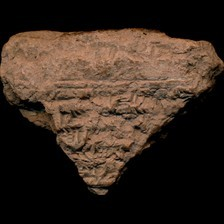 model input (224x224)  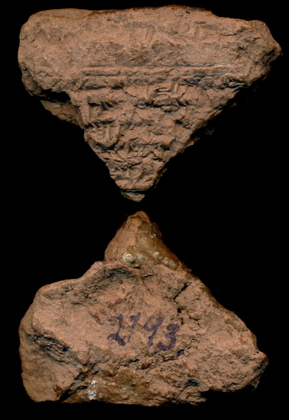 full photo (reference)</td><td valign="top"><table><tr><th>#</th><th>face</th><th>cuneiform</th><th>transliteration</th><th>translation</th></tr><tr><td>1</td><td>obverse</td><td>𒊑 𒄿 𒋀 𒅀 𒄩 𒋫 𒉌 𒅀 𒊭</td><td>a-na na-ap-hur-ri-ia lugal-gal lugal kur mi-is,-ri-i szesz -ia ha-ta-ni-ia sza ; a-ra-am-mu-usz</td><td>&mdash;</td></tr><tr><td>2</td><td>obverse</td><td>𒁺 𒍑 𒋥 𒋫 𒈗 𒃲 𒈗 𒆳 𒈪</td><td>sza i-ra-'a-a-ma-an-ni qi2-bi2-ma um-ma du-usz-rat-ta lugal-gal lugal kur ; mi-i-ta-an-ni</td><td>&mdash;</td></tr><tr><td>3</td><td>obverse</td><td>𒈠 𒀀 𒈾 𒅀 𒅆 𒂄 𒈬 𒀀 𒈾 𒅗 𒀀 𒊭 𒇻</td><td>e-mu-ka u3 sza i-ra-'a-a-mu-ka szesz -ka-ma a-na ia-szi szul-mu a-na-ka-a-sza ; lu-u2 szul-mu</td><td>&mdash;</td></tr><tr><td>4</td><td>obverse</td><td>𒅗 𒇻 𒌑 𒂄 𒈾 𒊩 𒋫 𒀀 𒁺 𒃶 𒉺 𒌉 𒅀</td><td>a-na te-i-e ama -ka a-na e2 -ka lu-u2 szul-mu a-na ta-a-du-he2-pa dumu-munus -ia</td><td>&mdash;</td></tr><tr><td>5</td><td>obverse</td><td>𒀀 𒈾 𒌉 𒈨𒌍 𒈨𒌍 𒅗 𒀀 𒈾 𒄑 𒇀 𒅗</td><td>... a-na dumu-mesz -ka a-na lu2-mesz -ka ; a-na gigir-mesz -ka</td><td>&mdash;</td></tr><tr><td>6</td><td>obverse</td><td>𒈨𒌍 𒅗 𒀀 𒀀 𒈾 𒄨 𒄑 𒄨 𒄑 𒇻 𒌑 𒂄 𒈬</td><td>a-na ansze-kur-ra-mesz -ka a-na erin2-mesz -ka a-na kur -ka u3 a-na ; mim-mu-ka dan-nisz2 dan-nisz2 lu-u2 szul-mu</td><td>&mdash;</td></tr><tr><td>7</td><td>obverse</td><td>𒉌 𒂊 𒇽 𒌉 𒆥 𒋗 𒊭 𒋀 𒅀 𒂄 𒈠 𒀀 𒈾 𒊭 𒂖 𒋼 𒈨 𒈠</td><td>ma-ne2-e lu2-dumu-kin -szu sza szesz -ia it-tal-ka u3 szul-ma-a-na ; sza szesz -ia el-te-me-ma</td><td>&mdash;</td></tr><tr><td>8</td><td>obverse</td><td>𒄴 𒁕 𒁺 𒄨 𒄑 𒌑 𒉡 𒋫 𒊭 𒋀 𒅀 𒁉 𒇻 𒀀 𒋫 𒈥 𒈠 𒄴 𒁕 𒁺 𒄨 𒄑</td><td>ah-da-du dan-nisz2 u2-nu-ta sza szesz -ia u2-sze-e-bi-lu a-ta-mar-ma ah-da-du dan-nisz2</td><td>&mdash;</td></tr><tr><td>9</td><td>obverse</td><td>𒋀 𒅀 𒀀 𒈠 𒋫 𒀭 𒉌 𒋫 𒅅 𒋫 𒁉 𒆠 𒄿 𒈨 𒂊 𒀉 𒋾 𒀀 𒁉 𒅀 𒈪 𒅎 𒈬 𒊑 𒅀</td><td>szesz -ia a-ma-ta an-ni-ta iq-ta-bi ki-i-me-e it-ti a-bi-ia mi-im-mu-ri-ia</td><td>&mdash;</td></tr><tr><td>10</td><td>obverse</td><td>𒋫 𒅈 𒋫 𒈾 𒀪 𒀀 𒈬 𒌑 𒈪 𒅇 𒀀 𒅗 𒀭 𒈾 𒄿 𒈾 𒀭 𒈾 𒊑 𒋫 𒀪 𒌌 𒌈 𒋀 𒅀</td><td>ta-ar-ta-na-'a-a-mu-u2-mi u3 a-ka-an-na i-na-an-na ri-ta-'a-am-me ul-tu4 szesz -ia</td><td>&mdash;</td></tr><tr><td>11</td><td>obverse</td><td>𒀉 𒋾 𒅀 𒊏 𒀀 𒈬 𒌑 𒋫 𒋻 𒄷 𒅇 𒀀 𒈾 𒆪 𒀉 𒋾 𒋀 𒅀 𒊏 𒀀 𒈬 𒌌 𒋻 𒄩 𒆪</td><td>it-ti-ia ra-a-mu-u2-ta hasz-hu u3 a-na-ku it-ti szesz -ia ra-a-mu-u2-ta ul hasz-ha-ku</td><td>&mdash;</td></tr><tr><td>12</td><td>obverse</td><td>𒌋𒅗 𒀀 𒁉 𒅗 𒄿 𒈾 𒀭 𒈾 𒈠 𒀉 𒋾 𒅗 𒄨 𒄑 𒀀 𒈾 𒌋 𒋗 𒅈 𒋫 𒄠</td><td>ugu a-bi-ka i-na-an-na-ma it-ti-ka dan-nisz2 a-na 1(u)-szu ar-ta-na-'a-am</td><td>&mdash;</td></tr><tr><td>13</td><td>obverse</td><td>𒅇 𒀀 𒁍 𒅗 𒁹 𒈪 𒅎 𒈬 𒊑 𒅀 𒀀 𒈠 𒋫 𒀭 𒉌 𒋫 𒄿 𒈾 𒁾 𒁉 𒋗 𒅅 𒌦 𒌈 𒁹 𒈠 𒉌 𒂊</td><td>u3 a-bu-ka mi-im-mu-ri-ia a-ma-ta an-ni-ta i-na t,up-pi2-szu iq-ta-bi-me un-tu4 ; ma-ne2-e</td><td>&mdash;</td></tr><tr><td>14</td><td>obverse</td><td>𒌁 𒄩 𒋫 𒌒 𒇻 𒅇 𒀀 𒅗 𒀭 𒈾 𒋀 𒅀 𒁹 𒈪 𒅎 𒈬 𒌑 𒊑 𒅀 𒅅 𒋫 𒁉 𒈨 𒀭 𒉡 𒌑 𒌑 𒉡 𒋫</td><td>ter-ha-ta ub-lu u3 a-ka-an-na szesz -ia mi-im-mu-u2-ri-ia iq-ta-bi-me an-nu-u2 u2-nu-ta</td><td>&mdash;</td></tr><tr><td>15</td><td>obverse</td><td>𒊭 𒄿 𒈾 𒀭 𒈾 𒌑 𒊺 𒂊 𒁉 𒇻 𒆷 𒈪 𒅎 𒈠 𒀀 𒈨 𒅇 𒋀 𒅀 𒆷 𒌓 𒋫 𒍝 𒄠 𒈨 𒈪 𒅎 𒈠</td><td>sza i-na-an-na u2-sze-e-bi-lu la mi-im-ma-a-me u3 szesz -ia la ut-ta-za-am-me mi-im-ma</td><td>&mdash;</td></tr><tr><td>16</td><td>obverse</td><td>𒆷 𒌑 𒊺 𒂊 𒉋 𒈨 𒀭 𒉡 𒌑 𒌑 𒉡 𒋫 𒊭 𒄿 𒈾 𒀭 𒈾 𒌑 𒊺 𒂊 𒉋 𒀝 𒆪 𒈨 𒅗 𒄠 𒈠 𒈨</td><td>la u2-sze-e-bil2-me an-nu-u2 u2-nu-ta sza i-na-an-na u2-sze-e-bil2-ak-ku-me ka-am-ma-me</td><td>&mdash;</td></tr><tr><td>17</td><td>obverse</td><td>𒌌 𒋼 𒂊 𒉋 𒀝 𒄣 𒈨 𒅇 𒌦 𒁺 𒁮 𒋾 𒊭 𒂊 𒊑 𒋗 𒋀 𒅀 𒄿 𒈾 𒀭 𒁷 𒈠 𒀀 𒈨</td><td>ul-te-e-bil2-ak-kum-me u3 un-du dam -ti sza e-ri-szu szesz -ia i-na-an-din-ma-a-me</td><td>&mdash;</td></tr><tr><td>18</td><td>obverse</td><td>𒄿 𒇷 𒅅 𒆪 𒌑 𒉏 𒈠 𒈨 𒀀 𒄠 𒈠 𒊒 𒅆 𒅇 𒌋 𒋗 𒈠 𒆷 𒀭 𒉌 𒄿 𒌑 𒊺 𒉋 𒀝 𒄣 𒈨</td><td>i-le-ek-ku-u2-nim-ma-me a-am-ma-ru-szi u3 1(u)-szu ma-la an-ni-i u2-sze-bil2-ak-kum-me</td><td>&mdash;</td></tr><tr><td>19</td><td>obverse</td><td>𒅇 𒀩 𒈨𒌍 𒊭 𒆬 𒄀 𒊭 𒀊 𒄖 𒌈 𒌒 𒁍 𒄣 𒌑 𒌈 𒁹 𒂗 𒀩 𒀀 𒈾 𒅀 𒅆 𒅇 𒊭 𒉌 𒌈 𒀩</td><td>u3 alam-mesz sza ku3-sig17 sza-ap-gu-tu4 up-pu-qu-u2-tu4 1(disz)-en alam a-na ia-szi ; u3 sza-ni-tu4 alam</td><td>&mdash;</td></tr><tr><td>20</td><td>obverse</td><td>𒀀 𒈾 𒀩 𒊩 𒁕 𒀀 𒁺 𒃶 𒂊 𒉺 𒌉 𒊩 𒅀 𒀀 𒊬 𒀀 𒁉 𒄿 𒅗 𒈠 𒁹 𒈪 𒅎 𒈬 𒌑 𒊑 𒅀 𒂊 𒋼 𒊑 𒅖</td><td>a-na alam da-a-du-he2-e-pa dumu-munus -ia a-szar a-bi-i-ka-ma mi-im-mu-u2-ri-ia ; e-te-ri-isz</td><td>&mdash;</td></tr><tr><td>21</td><td>obverse</td><td>𒅇 𒅅 𒋫 𒁉 𒀀 𒁍 𒅗 𒈠 𒈲 𒀀 𒈾 𒊭 𒆬 𒄀 𒈠 𒊭 𒁉 𒅅 𒋫 𒌒 𒁍 𒊌 𒋫 𒈾 𒋫 𒀀 𒀭 𒍪 𒉡 𒈨</td><td>u3 iq-ta-bi a-bu-ka-ma musz-x a-na sza ku3-sig17 -ma sza-pi2-ik-ta up-pu-uq-ta ; na-ta-a-an-su2-nu-me</td><td>&mdash;</td></tr><tr><td>22</td><td>obverse</td><td>𒅇 𒊭 𒉌𒌓 𒍝 𒆳 𒆳 𒀀 𒈾 𒀭 𒁷 𒀝 𒄣 𒈨 𒅇 𒆬 𒄀 𒀊 𒁍 𒈾 𒊭 𒈾 𒀀 𒈠 𒀪 𒋫 𒌑 𒉡 𒋫</td><td>u3 sza za-gin3-kur a-na-an-din-ak-kum-me u3 ku3-sig17 ap-pu-na sza-na-a ma-'a-ta u2-nu-ta</td><td>&mdash;</td></tr><tr><td>23</td><td>obverse</td><td>𒉺 𒋫 𒆷 𒄿 𒋗 𒌑 𒀉 𒋾 𒀩 𒈨𒌍 𒀀 𒈾 𒀭 𒁷 𒀝 𒄣 𒈨 𒅇 𒆬 𒄀 𒊭 𒀩 𒈨𒌍 𒇽 𒌉 𒈨𒌍 𒆥 𒅀</td><td>sza pa-ta la i-szu-u2 it-ti alam-mesz a-na-an-din-ak-kum-me u3 ku3-sig17 sza ; alam-mesz lu2-dumu-mesz-kin -ia</td><td>&mdash;</td></tr><tr><td>24</td><td>obverse</td><td>𒆏 𒁉 𒄿 𒋗 𒉡 𒈠 𒊭 𒄿 𒈾 𒆳 𒈪 𒄑 𒊑 𒄿 𒀸 𒁍 𒄿 𒈾 𒅆 𒈨𒌍 𒋗 𒉡 𒄿 𒋫 𒄠 𒊒 𒅇 𒀩 𒈨𒌍 𒀀 𒁍 𒅗 𒈠</td><td>gab2-bi-i-szu-nu-ma sza i-na kur mi-is,-ri-i asz-bu i-na igi-mesz -szu-nu i-ta-am-ru ; u3 alam-mesz a-bu-ka-ma</td><td>&mdash;</td></tr><tr><td>25</td><td>obverse</td><td>𒈾 𒉺 𒉌 𒇽 𒌉 𒈨𒌍 𒆥 𒅀 𒀀 𒈾 𒅆 𒅁 𒆠 𒌓 𒋼 𒂊 𒅕 𒋗 𒉡 𒄿 𒋼 𒁍 𒊻 𒍪 𒉡 𒅅 𒋫 𒈥 𒋗 𒉡</td><td>a-na pa-ni lu2-dumu-mesz-kin -ia a-na szi-ip-ki ut-te-e-er-szu-nu i-te-pu-us-su2-nu ig-ta-mar-szu-nu</td><td>&mdash;</td></tr><tr><td>26</td><td>obverse</td><td>𒊻 𒍣 𒅅 𒆠 𒋗 𒉡 𒅇 𒆠 𒄿 𒀀 𒈾 𒅆 𒅁 𒆠 𒁺 𒌨 𒊒 𒇽 𒌉 𒈨𒌍 𒆥 𒅀 𒄿 𒈾 𒅆 𒈨𒌍 𒋗 𒉡 𒄿 𒌓 𒊒</td><td>us-se2-ek-ki-szu-nu u3 ki-i a-na szi-ip-ki du-ur-ru lu2-dumu-mesz-kin -ia ; i-na igi-mesz -szu-nu i-tam-ru</td><td>&mdash;</td></tr><tr><td>27</td><td>obverse</td><td>𒅇 𒆠 𒄿 𒆚 𒊒 𒈠 𒍝 𒄖 𒌑 𒄿 𒈾 𒅆 𒈨𒌍 𒋗 𒉡 𒄿 𒋫 𒄠 𒊒</td><td>u3 ki-i kam2-ru-ma za-gu-u2 i-na igi-mesz -szu-nu i-ta-am-ru</td><td>&mdash;</td></tr><tr><td>28</td><td>obverse</td><td>𒅇 𒆬 𒄀 𒊭 𒉡 𒌑 𒈠 𒀪 𒁺 𒊭 𒉺 𒋫 𒆷 𒄿 𒋗 𒌑 𒊭 𒀀 𒈾 𒅀 𒅆 𒌑 𒊺 𒂊 𒅁 𒁉 𒇻 𒊌 𒋼 𒇷 𒅎 𒈠</td><td>u3 ku3-sig17 sza-nu-u2 ma-'a-du sza pa-t,a2 la i-szu-u2 sza a-na ia-szi u2-sze-e-eb-bi-lu ; uk-te-li-im-ma</td><td>&mdash;</td></tr><tr><td>29</td><td>obverse</td><td>𒅇 𒅅 𒋫 𒁉 𒀀 𒈾 𒇽 𒌉 𒈨𒌍 𒆥 𒅀 𒀀 𒉡 𒌝 𒈠 𒀩 𒈨𒌍 𒅇 𒀀 𒉡 𒌝 𒈠 𒈠 𒀀 𒋫 𒅇 𒌑 𒉡 𒋫</td><td>u3 iq-ta-bi a-na lu2-dumu-mesz-kin -ia a-nu-um-ma alam-mesz u3 a-nu-um-ma ; ku3-sig17 ma-a-ta u3 u2-nu-ta</td><td>&mdash;</td></tr><tr><td>30</td><td>obverse</td><td>𒊭 𒀀 𒉺 𒋫 𒆷 𒄿 𒋗 𒌑 𒊭 𒀀 𒈾 𒋀 𒅀 𒌑 𒊺 𒁉 𒇻 𒅇 𒄿 𒈾 𒅆 𒈨𒌍 𒄖 𒉡 𒄠 𒊏 𒀀 𒈨</td><td>sza-a pa-ta la i-szu-u2 sza a-na szesz -ia u2-sze-bi-lu u3 i-na igi-mesz -gu-nu am-ra-a-me</td><td>&mdash;</td></tr><tr><td>31</td><td>obverse</td><td>𒅇 𒇽 𒌉 𒈨𒌍 𒆥 𒄿 𒈾 𒅆 𒈨𒌍 𒋗 𒉡 𒄿 𒋫 𒄠 𒊒</td><td>u3 lu2-dumu-mesz-kin i-na igi-mesz -szu-nu i-ta-am-ru</td><td>&mdash;</td></tr><tr><td>32</td><td>obverse</td><td>𒅇 𒄿 𒈾 𒀭 𒈾 𒋀 𒅀 𒀩 𒌒 𒁍 𒄣 𒌑 𒁺 𒊭 𒀀 𒁍 𒅗 𒌑 𒊺 𒂊 𒅁 𒁉 𒇻 𒆷 𒁺 𒊺 𒂊 𒁉 𒆷</td><td>u3 i-na-an-na szesz -ia alam up-pu-qu-u2-du sza a-bu-ka u2-sze-e-eb-be2-lu la du-sze-e-bi-la</td><td>&mdash;</td></tr><tr><td>33</td><td>obverse</td><td>𒅇 𒊭 𒄑 𒈨𒌍 𒄴 𒄷 𒍪 𒁺 𒁺 𒌌 𒋼 𒂊 𒁉 𒆷 𒌑 𒉡 𒋫 𒊭 𒀀 𒁍 𒅗 𒀀 𒈾 𒅀 𒅆 𒌑 𒊺 𒂊 𒅁 𒁉 𒇻</td><td>u3 sza gesz-mesz uh-hu-zu-du du-ul-te-e-bi-la u2-nu-ta sza a-bu-ka a-na ia-szi ; u2-sze-e-eb-be2-lu</td><td>&mdash;</td></tr><tr><td>34</td><td>obverse</td><td>𒆷 𒁺 𒊺 𒂊 𒁉 𒇴 𒈠 𒅇 𒁺 𒌌 𒋼 𒂊 𒁹 𒄑 𒄨 𒄑 𒈠</td><td>la tu3-sze-e-bi-lam-ma u3 tu3-ul-te-e-disz-is, dan-nisz2-ma</td><td>&mdash;</td></tr><tr><td>35</td><td>obverse</td><td>𒅇 𒀀 𒈠 𒁺 𒈪 𒅎 𒈠 𒊭 𒄿 𒁺 𒌑 𒊭 𒀀 𒈾 𒋀 𒅀 𒄴 𒁺 𒌑 𒅀 𒉡 𒌑 𒄿 𒈾 𒀀 𒄿 𒅎 𒈨 𒂊 𒌓 𒈪 𒊭 𒋀 𒅀</td><td>u3 a-ma-du mi-im-ma sza i-du-u2 sza a-na szesz -ia ah-du-u2 ia-nu-u2 i-na a-i-im-me-e ; u4-mi sza szesz -ia</td><td>&mdash;</td></tr><tr><td>36</td><td>obverse</td><td>𒂄 𒈠 𒀭 𒍪 𒂖 𒋼 𒈨 𒅇 𒌓 𒈠 𒊭 𒀀 𒋗 𒉺 𒉌 𒋫 𒂊 𒋼 𒁍 𒊻 𒍪</td><td>szul-ma-an-su2 el-te-me u3 u4-ma sza-a-szu pa-ni-ta e-te-pu-us-su2</td><td>&mdash;</td></tr><tr><td>37</td><td>obverse</td><td>𒅇 𒄩 𒀀 𒈦 𒅆 𒇽 𒌉 𒆥 𒋗 𒊭 𒋀 𒅀 𒌦 𒁺 𒀀 𒈾 𒌋𒅗 𒅀 𒀧 𒇷 𒄖 𒅇 𒌦 𒁺 𒊭 𒋀 𒅀</td><td>u3 ha-a-masz-szi lu2-dumu-kin -szu sza szesz -ia un-du a-na ugu -ia il-li-gu ; u3 un-du sza szesz -ia</td><td>&mdash;</td></tr><tr><td>38</td><td>obverse</td><td>𒀀 𒈠 𒋼 𒈨𒌍 𒋗 𒅅 𒁍 𒌑 𒈠 𒌍 𒈬 𒌑 𒅇 𒀀 𒅗 𒀭 𒈾 𒀝 𒋫 𒁉 𒆠 𒄿 𒈨 𒂊 𒀉 𒋾 𒁹 𒈪 𒈬 𒊑 𒅀</td><td>a-ma-te- mesz -szu iq-bu-u2-ma esz-mu-u2 u3 a-ka-an-na aq-ta-bi ki-i-me-e it-ti ; mi-mu-ri-ia</td><td>&mdash;</td></tr><tr><td>39</td><td>obverse</td><td>𒀀 𒁉 𒅗 𒅈 𒋫 𒈾 𒀪 𒀀 𒈬 𒈨 𒅇 𒄿 𒈾 𒀭 𒈾 𒌋 𒋗 𒀉 𒋾 𒁹 𒈾 𒀊 𒄯 𒅀 𒅈 𒋫 𒈾 𒀪 𒄠 𒈨</td><td>a-bi-ka ar-ta-na-'a-a-mu-me u3 i-na-an-na 1(u)-szu it-ti na-ap-hur-ri-ia ; ar-ta-na-'a-am-me</td><td>&mdash;</td></tr><tr><td>40</td><td>obverse</td><td>𒄨 𒄑 𒅇 𒀀 𒅗 𒀭 𒈾 𒀀 𒈾 𒁹 𒄩 𒀀 𒈦 𒅆 𒇽 𒌉 𒆥 𒅗 𒀝 𒋫 𒁉</td><td>dan-nisz2 u3 a-ka-an-na a-na ha-a-masz-szi lu2-dumu-kin -ka aq-ta-bi</td><td>&mdash;</td></tr><tr><td>41</td><td>obverse</td><td>𒅇 𒄿 𒈾 𒀭 𒈾 𒋀 𒅀 𒀩 𒈨𒌍 𒊭 𒆬 𒄀 𒌒 𒁍 𒄣 𒁺 𒆷 𒌑 𒊺 𒂊 𒁉 𒆷 𒅇 𒊑 𒄴 𒋫 𒌑 𒉡 𒋫</td><td>u3 i-na-an-na szesz -ia alam-mesz sza ku3-sig17 up-pu-qu-du la u2-sze-e-bi-la u3 ; re-eh-ta u2-nu-ta</td><td>&mdash;</td></tr><tr><td>42</td><td>obverse</td><td>𒊭 𒁹 𒀀 𒁍 𒅗 𒀀 𒈾 𒋗 𒁍 𒇷 𒅅 𒁍 𒌑 𒈪 𒀉 𒄩 𒊑 𒅖 𒋀 𒅀 𒆷 𒌑 𒊺 𒂊 𒁉 𒇴 𒈠</td><td>sza a-bu-ka a-na szu-bu-li iq-bu-u2 mi-it-ha-ri-isz szesz -ia la u2-sze-e-bi-lam-ma</td><td>&mdash;</td></tr><tr><td>43</td><td>obverse</td><td>𒄿 𒈾 𒀭 𒈾 𒋀 𒅀 𒀩 𒈨𒌍 𒊭 𒆬 𒄀 𒌒 𒁍 𒄣 𒌑 𒁺 𒊭 𒀀 𒈾 𒀀 𒁉 𒅗 𒂊 𒊑 𒋗</td><td>i-na-an-na szesz -ia alam-mesz sza ku3-sig17 up-pu-qu-u2-du sza a-na a-bi-ka e-ri-szu</td><td>&mdash;</td></tr><tr><td>44</td><td>obverse</td><td>𒇷 𒀉 𒁷 𒄠 𒈠 𒇻 𒀀 𒄿 𒃲 𒆷 𒀀</td><td>li-id-din-am-ma lu-u2 la-a ... i-gal-la-a-szu-nu</td><td>&mdash;</td></tr><tr><td>45</td><td>obverse</td><td>𒆳 𒆳 𒆏 𒁉 𒄿 𒋗 𒈾 𒈾 𒋫 𒀀 𒉌 𒅅</td><td>kur-kur gab2-bi-i-szu-nu ... sza a-na na-ta-a-ni iq-bu-u2</td><td>&mdash;</td></tr><tr><td>46</td><td>obverse</td><td>𒅇 𒄿 𒈾 𒀭 𒈾 𒋳 𒈠 𒆏 𒁉 𒄿</td><td>u3 i-na-an-na szum-ma ... gab2-bi-i ...</td><td>&mdash;</td></tr><tr><td>47</td><td>obverse</td><td>𒋳 𒈠 𒀉 𒁁 𒌈 𒋫 𒀀</td><td>szum-ma it-til-tu4 ... ta a-...</td><td>&mdash;</td></tr><tr><td>48</td><td>obverse</td><td>𒀀 𒈾 𒆷 𒋫 𒁍 𒌓 𒀩 𒈨𒌍</td><td>a-na la ta-bu-ut-ti ... alam-mesz sza a-na</td><td>&mdash;</td></tr><tr><td>49</td><td>obverse</td><td>𒈾 𒁕 𒉌 𒅅 𒁍 𒊒</td><td>na-da-ni iq-bu-u2 ... ru ...</td><td>&mdash;</td></tr><tr><td>50</td><td>obverse</td><td>𒅇 𒄿 𒈾 𒆳 𒊭 𒋀 𒊭 𒋀</td><td>u3 i-na kur sza szesz -ia ... i-na sza3 -szu sza szesz ia alam-mesz</td><td>&mdash;</td></tr><tr><td>51</td><td>obverse</td><td>𒅎 𒋻 𒍝 𒀀 𒈠 𒆷 𒅗 𒈠 𒀀 𒈾 𒅀</td><td>im-tar-s,a-a-ma la it-ti-na ... a-bu-ka-ma a-na ia-szi x x</td><td>&mdash;</td></tr><tr><td>52</td><td>obverse</td><td>𒁹 𒄩 𒀀 𒈦 𒅆 𒇽 𒀉 𒋫 𒀠 𒅗</td><td>ha-a-masz-szi lu2-dumu-kin -szu sza szesz -ia x x x a-na ugu -ia it-ta-al-ka ...</td><td>&mdash;</td></tr><tr><td>53</td><td>obverse</td><td>𒈪 𒅎 𒈠 𒆷 𒌑 𒅗</td><td>mi-im-ma la u2-sze-e-bil x ... ka ...</td><td>&mdash;</td></tr><tr><td>54</td><td>obverse</td><td>𒅇 𒀀 𒅗 𒀭 𒄿 𒉌 𒋀</td><td>u3 a-ka-an-na ... i-ni szesz ...</td><td>&mdash;</td></tr><tr><td>55</td><td>obverse</td><td>x x 𒄿 𒈾 𒃲 𒇷 x</td><td>... x x ... i-na gal-le-e ... x</td><td>&mdash;</td></tr><tr><td>56</td><td>obverse</td><td>𒈾 𒃲 𒇷 𒅎 𒈠 𒌓 𒋼 𒂊 𒅕 𒋗</td><td>... x x i-na gal-le-e-em-ma ut-te-e-er-szu</td><td>&mdash;</td></tr><tr><td>57</td><td>obverse</td><td>𒌌 𒋼 𒂊 𒁉 𒆷 𒅇 𒅕 𒁁 𒂊 𒀉 𒈠 𒀸 𒄖</td><td>... x x du-ul-te-e-bi-la u3 er-be-e-et ma-asz-gu</td><td>&mdash;</td></tr><tr><td>58</td><td>obverse</td><td>x 𒅆 𒄿 𒈠 𒋀 𒅀 𒇽 𒌉 𒆥 𒋗 𒇷 𒄑 𒀠</td><td>... x ...-szi-i-ma szesz -ia lu2-dumu-kin -szu li-is-al</td><td>&mdash;</td></tr><tr><td>1</td><td>reverse</td><td>𒀀 𒅈 𒅗 𒄿 𒈾 𒀭 𒁲 𒉡 𒈠 𒁹 𒄀 𒇷 𒅀 𒀧 𒆠 𒄿 𒈨</td><td>... a ar-ka-... i-na-an-di-nu-ma gi-li-ia il-... u3 ki-i-me-e</td><td>&mdash;</td></tr><tr><td>2</td><td>reverse</td><td>𒀀 𒅗 𒀭 𒈾 𒅇 𒁹 𒌅 𒇻 𒌒 𒋫 𒁇 𒋗 𒉡</td><td>... u3 a-ka-an-na ... u3 tu-lu-ub-ri ... al-ta-par2-szu-nu</td><td>&mdash;</td></tr><tr><td>3</td><td>reverse</td><td>𒅎 𒍪 𒀀 𒉡 𒊭 𒈠 𒀸 𒁉</td><td>x x-im zu ...-a-nu sza ku3-sig17 ... ... ma asz-bi</td><td>&mdash;</td></tr><tr><td>4</td><td>reverse</td><td>𒊭 𒀀 𒁍 𒀀</td><td>sza a-bu-... a</td><td>&mdash;</td></tr><tr><td>5</td><td>reverse</td><td>𒅇 𒀀 𒅗 𒀭 𒈾 𒅅 𒋫 𒁉 𒀀 𒁍 𒅗 𒆬 𒄀 𒈨𒌍 𒊭 𒀀 𒋗 𒉡</td><td>u3 a-ka-an-na iq-ta-bi a-bu-u2-ka ku3-sig17-mesz sza-a-szu-nu ...</td><td>&mdash;</td></tr><tr><td>6</td><td>reverse</td><td>𒉺 𒄿 𒈾 𒀭 𒈾 𒌌 𒋼 𒂊 𒉋 x</td><td>pa x x i-na-an-na ... ul-te-e-bil2 ... x ...</td><td>&mdash;</td></tr><tr><td>7</td><td>reverse</td><td>𒀉 𒋾 𒅀 𒀀 𒈾 𒅕 𒅇 𒌨 𒋼</td><td>it-ti-ia a-na ...-er u3 ... ur-te ...</td><td>&mdash;</td></tr><tr><td>8</td><td>reverse</td><td>𒅎 𒈠 𒋾 𒄿 𒈨 𒉡</td><td>im-ma-ti-i-me-e ...-nu ...</td><td>&mdash;</td></tr><tr><td>9</td><td>reverse</td><td>x 𒆷 𒌑 𒊺 𒅀 𒇷</td><td>x la u2-sze-bi-la ...-ia li-x ...</td><td>&mdash;</td></tr><tr><td>10</td><td>reverse</td><td>𒊭 𒀀 x</td><td>... sza a ... x ...</td><td>&mdash;</td></tr><tr><td>11</td><td>reverse</td><td>𒌈 𒊭 𒀀 𒈾 𒁍 𒅇 𒊭 𒁍 𒌑 𒋾 𒅀</td><td>u3 a-ma-a-tu4 sza a-na a-bi-i-ka a-dab-bu-bu u3 sza a-bu-u2-ka it-ti-ia</td><td>&mdash;</td></tr><tr><td>12</td><td>reverse</td><td>𒈠 𒄠 𒈠 𒌌 𒁹 𒄀 𒇷 𒅀 𒋾</td><td>i-dab-bu-bu ma-am-ma ul i-te-szu-nu te-i-e ama -ka gi-li-ia ; u3 ma-ne2-e a-ma-a-ti</td><td>&mdash;</td></tr><tr><td>13</td><td>reverse</td><td>𒈠 𒄠 𒈠 𒊭 𒉡 𒌑 𒌝 𒈠 𒌌 𒄿 𒋼 𒅇 𒂼 𒋗 𒋗</td><td>i-te ma-am-ma sza-nu-u2-um-ma ul i-te-szu-nu szesz -ia u3 ama -szu sza szesz -ia ; i-te gab2-ba2-szu</td><td>&mdash;</td></tr><tr><td>14</td><td>reverse</td><td>𒆠 𒈨 𒂊 𒀀 𒁍 𒌑 𒅗 𒀉 𒋾 𒅀 𒈬 𒌑 𒌓 x</td><td>ki-i-me-e a-bu-u2-ka it-ti-ia i-dab2-bu-bu ra-mu-u2-ut-ta ... x</td><td>&mdash;</td></tr><tr><td>15</td><td>reverse</td><td>𒆠 𒄿 𒈨 𒂊 𒀀 𒈾 𒆪 𒀉 𒋾 𒀀 𒁉 𒄿 𒅗 𒁍 𒁍 𒊏 𒈬</td><td>ki-i-me-e a-na-ku it-ti a-bi-i-ka a-dab2-bu-bu ra-mu-u2-ut-ta ...</td><td>&mdash;</td></tr><tr><td>16</td><td>reverse</td><td>𒈾 𒀭 𒈾 𒋀 𒅀 𒅅 𒁉 𒆠 𒈨 𒂊 𒀉 𒋾 𒀀 𒅀 𒋫</td><td>u3 i-na-an-na szesz -ia iq-ta-bi ki-i-me-e it-ti a-bi-ia ta-ar-ta-na-'a-am-me u3</td><td>&mdash;</td></tr><tr><td>17</td><td>reverse</td><td>𒀀 𒅗 𒈾 𒀉 𒋾 𒊑 𒈨 𒅇 𒋀 𒅀 𒈠 𒄿 𒈥 𒀭 𒉌 𒆠</td><td>a-ka-na it-ti-ia ri-ta-'a-am-me u3 szesz -ia-ma i-mar-an-ni ; ki-i-me-e it-ti szesz -ia</td><td>&mdash;</td></tr><tr><td>18</td><td>reverse</td><td>𒅈 𒋫 𒈾 𒋫 𒁉 𒋀 𒅀 𒂼 𒋗 𒇻 𒋫 𒀪</td><td>ar-ta-na-'a-am u3 a-na-ku aq-ta-bi szesz -ia ama -szu lu isz-ta-'a-al-szi ...</td><td>&mdash;</td></tr><tr><td>19</td><td>reverse</td><td>𒄿 𒈥 𒀭 𒉌 𒆠 𒄿 𒈨 𒂊</td><td>... szesz -ia-ma i-mar-an-ni ki-i-me-e ...</td><td>&mdash;</td></tr><tr><td>20</td><td>reverse</td><td></td><td>...</td><td>&mdash;</td></tr><tr><td>21</td><td>reverse</td><td>𒁹 𒈠 𒋀 𒅀 x 𒀭 𒊭 𒀀 x x</td><td>ma-ne2-e lu2-dumu-kin -szu sza szesz -ia x x-an ... sza a x x</td><td>&mdash;</td></tr><tr><td>22</td><td>reverse</td><td>𒀀</td><td>a-x ...</td><td>&mdash;</td></tr><tr><td>23</td><td>reverse</td><td>𒀀 𒁉 𒋗 x x 𒉌 𒈠 𒀀 𒀉 𒋾</td><td>a-bi-i-szu x x ni a ma a it-ti-... el-te-me x x</td><td>&mdash;</td></tr><tr><td>24</td><td>reverse</td><td>𒀀 𒈠 𒋼 𒈨𒌍 𒋀 𒅀 𒅇 𒄴 𒋫 𒋫</td><td>a-ma-te- mesz sza szesz -ia u3 ah-ta-du ta-an-nisz2-ma</td><td>&mdash;</td></tr><tr><td>25</td><td>reverse</td><td>𒅇 𒄿 𒈾 𒀭 𒈾 𒈠</td><td>u3 i-na-an-na ma-ne2-e ...</td><td>&mdash;</td></tr><tr><td>26</td><td>reverse</td><td>𒅅 𒋫 𒆷 𒀀 𒋗 𒉡 𒈨𒌍</td><td>ik-ta-la-a-szu-nu ...- mesz ...</td><td>&mdash;</td></tr><tr><td>27</td><td>reverse</td><td>𒅇 𒀸 𒋳 𒀭 𒉌 𒋾</td><td>u3 asz-szum an-ni-ti ...</td><td>&mdash;</td></tr><tr><td>28</td><td>reverse</td><td>𒅇 𒃶 𒁺 𒌑 𒁺 𒋫 𒀭 𒄑</td><td>u3 he2-du-u2-du ta-an-nisz2 ...</td><td>&mdash;</td></tr><tr><td>29</td><td>reverse</td><td>𒂡 𒄿 𒈥 𒅎 𒅇 𒈠</td><td>ezem i-mar iszkur u3 a-ma-nu-um ...</td><td>&mdash;</td></tr><tr><td>30</td><td>reverse</td><td>𒇷 𒈠 𒀀 𒈾 𒆪 𒅇</td><td>li-misz-x-ma a-na-ku u3 at-ta ...</td><td>&mdash;</td></tr><tr><td>31</td><td>reverse</td><td>𒀀 𒉡 𒌝 𒈠 𒁹 𒌓 𒊑 𒄑 𒍣</td><td>a-nu-um-ma pir-ri-iz-zi u3 tul-up-ri lu2-dumu-mesz-kin -ia x x</td><td>&mdash;</td></tr><tr><td>32</td><td>reverse</td><td>𒀀 𒈾 𒋀 𒅀 𒀀 𒈾 𒃲 𒇷 𒂊</td><td>a-na szesz -ia a-na gal-le-e-em-ma al-ta-par2-szu-nu u3 a-na du-ul-lu-hi ; aq-ta-pa-a-szu-nu</td><td>&mdash;</td></tr><tr><td>33</td><td>reverse</td><td>𒅇 𒋀 𒅀 𒇻 𒆷 𒀀 𒈠</td><td>u3 szesz -ia lu-u2 la-a i-gal-la-a-szu-nu ha-mut-ta li-x-x-szu-nu-ma te-e-ma</td><td>&mdash;</td></tr><tr><td>34</td><td>reverse</td><td>𒇷 𒋼 𒅕 𒌑 𒉌 𒊭 𒈨 𒂊 𒈠 𒇻</td><td>li-te-er-ru-u2-ni sza szesz -ia szul-ma-an-szu lu-usz-me-e-ma lu-uh-du</td><td>&mdash;</td></tr><tr><td>35</td><td>reverse</td><td>𒅇 𒊭 𒀀 𒋀 𒅀 x 𒁹 𒉿 𒊑 𒄑 𒍣 𒈾 x 𒀜</td><td>u3 sza-a szesz -ia ... x pi-ri-iz-zi i-na x ad ...</td><td>&mdash;</td></tr><tr><td>36</td><td>reverse</td><td>𒀀 𒈾 𒀧 𒇷 𒄖 𒉌 𒀀 𒈾 𒊭 𒀀 𒋗 𒉡 𒀀 𒋫</td><td>a-na ... il-li-gu-ni a-na sza-a-szu-nu a-ta-...</td><td>&mdash;</td></tr><tr><td>37</td><td>reverse</td><td>𒀀 𒋾 x 𒌌 𒇷 𒄿 𒄑 𒁲 𒄴 𒄩 𒊒</td><td>a-ti x ... ul-li-i is-sa2-ah-ha-ru ...</td><td>&mdash;</td></tr><tr><td>38</td><td>reverse</td><td>𒅇 𒀀 𒅗 𒀭 𒈾 𒋀 𒅀 𒌑 𒈦 𒊬 𒋗 𒅇 𒀜 𒁺 𒅀</td><td>u3 a-ka-an-na ma-ne2-e lu2-dumu-kin -szu sza szesz -ia u2-masz-szar-szu u3 ad-du-ia</td><td>&mdash;</td></tr><tr><td>39</td><td>reverse</td><td>𒇽 𒌉 𒈨𒌍 𒆥 𒅀 𒈠 𒉌 𒂊 𒀀 𒊭 𒀊 𒁇 𒀀 𒈾 𒃶 𒁺 𒌑 𒋾</td><td>lu2-dumu-mesz-kin -ia szesz -ia li-x-x-szu-nu-ma u3 ma-ne2-e a-sza-ap-par2 ; a-na he2-du-u2-ti</td><td>&mdash;</td></tr><tr><td>40</td><td>reverse</td><td>𒀀 𒈾 𒀀 𒄭 𒄿 𒀀</td><td>a-na ... a-hi-i-a</td><td>&mdash;</td></tr><tr><td>41</td><td>reverse</td><td>𒅇 𒌦 𒌈 𒌉 𒈨𒌍 𒆥 𒋗 𒊭 𒀀 𒄭 𒄿 𒀀</td><td>u3 un-tu4 ... lu2-dumu-mesz-kin -szu sza a-hi-i-a</td><td>&mdash;</td></tr><tr><td>42</td><td>reverse</td><td>𒀉 𒈾 𒄿 𒍣 𒄿 𒉌 𒊏 𒁉 𒄿 𒀀 𒈾 𒆠 𒅎 𒊑</td><td>it-ta-al-ku ... a-na i-si2-i-ni ra-bi-i a-na ki-im-ri</td><td>&mdash;</td></tr><tr><td>43</td><td>reverse</td><td>𒀀 x 𒇻 𒌑 𒅅 𒋗 𒁺 𒅇 𒋳 𒈠 𒀀 𒅗 𒀭 𒈾</td><td>a-... x lu-u2 ik-szu-du u3 szum-ma a-ka-an-na</td><td>&mdash;</td></tr><tr><td>44</td><td>reverse</td><td>𒀀 𒀸 𒊭 𒌈 𒈪 𒄿 𒈾 𒀀 𒂊 𒁍 𒊻 𒍪 𒉡 𒋾</td><td>a-na ugu -ia i-ka-asz-sza-tu4 u3 mi-i-na-a e-pu-us-su2-nu-ti</td><td>&mdash;</td></tr><tr><td>45</td><td>reverse</td><td>𒋫 𒌨 𒄿 𒋛 𒉌</td><td>... ta ... ur ... i-si-ni</td><td>&mdash;</td></tr><tr><td>46</td><td>reverse</td><td>𒅇 𒅀 𒆬 𒄀 𒈠 𒀀 𒋫 𒇷 𒊺 𒂊 𒁉 𒆷 𒋛 𒉌 𒆠 𒅎 𒊑</td><td>u3 szesz -ia ku3-sig17 ma-a-ta li-sze-e-bi-la a-na i-si-ni ki-im-ri</td><td>&mdash;</td></tr><tr><td>47</td><td>reverse</td><td>𒈠 𒀀 𒋫 𒀀 𒋾 𒉡 𒌑 𒋾 𒋀</td><td>... ma-a-ta-a-ti u2-nu-u2-ti szesz -ia ...</td><td>&mdash;</td></tr><tr><td>48</td><td>reverse</td><td>𒈾 𒋀 𒅀 𒂊 𒁁 𒊑 𒈠 𒀀 𒋀 𒅀 𒇷 𒅁 𒁉</td><td>i-na kur sza szesz -ia ku3-sig17 ki-i e-be-ri ma-a-ta-at szesz -ia li-ib-bi</td><td>&mdash;</td></tr><tr><td>49</td><td>reverse</td><td>𒉚 𒊏 𒊍 𒀀 𒋫 𒇷 𒊺 𒂊 𒁉 𒆷 𒈨 𒂊 𒀀 𒈾 𒋀 𒅀</td><td>lu-u2 la-a u2-szam2-ra-as, ku3-sig ma-a-ta li-sze-e-bi-la ki-i-me-e a-na szesz -ia</td><td>&mdash;</td></tr><tr><td>50</td><td>reverse</td><td>𒈠 𒋫 𒀀 𒋾 𒋾 𒌑 𒅗 𒀊 𒉺 𒋫 𒉌 𒋀 𒅀 𒌋𒅗 𒀀 𒁉 𒄿 𒋗</td><td>... ma-a-ta-a-ti u2-nu-ti u2-ka-ap-pa-ta-ni szesz -ia ugu a-bi-i-szu</td><td>&mdash;</td></tr><tr><td>51</td><td>reverse</td><td>𒋫 𒇷 𒄿 𒀉 𒌁 𒀭 𒉌</td><td>... ta li-i-it-ter-an-ni</td><td>&mdash;</td></tr><tr><td>52</td><td>reverse</td><td>𒅗 𒌆 𒄘 𒄯 𒊑 𒁹 𒌆 𒄘 𒅕 𒁹 𒌆 𒁇 𒌋𒌆 𒁹 𒉌𒌓</td><td>a-nu-um-ma a-na szul-ma-ni-ka tug2-gu2 hur-ri 1(disz) tug2-gu2-iri ; 1(disz) tug2-bar-dul 1(disz) na4 x x</td><td>&mdash;</td></tr><tr><td>53</td><td>reverse</td><td>𒊭 𒋾 𒅆 𒈨𒌍 𒌈 𒉌𒌓 𒆳 𒐊 𒄿 𒈾 𒋃 𒋾 𒆬 𒄀 𒃻</td><td>... 1(disz) szu sza qa-ti igi-mesz -tu4 nir2-kur 5(disz) i-na ; szid -ti ku3-sig17 gar</td><td>&mdash;</td></tr><tr><td>54</td><td>reverse</td><td>𒄭 𒂵 𒈠 𒁹 𒉡 𒌈 𒉌𒌓 𒈨𒌍 𒆬 𒄀 𒊩 𒋼 𒄿 𒂊 𒂼 𒅗 x x</td><td>1(disz) ta-pa-tu4 sza i3-du10-ga ma-lu-u2 1(disz)-nu-tu4 na4-mesz ku3-sig17 gar ; a-na te-i-e ama -ka x x</td><td>&mdash;</td></tr><tr><td>55</td><td>reverse</td><td>𒇻 𒌑 𒁹 𒉡 𒉌𒌓 𒈨𒌍 𒆬 𒄀 𒊩 𒋫 𒀀 𒌈 𒃶 𒂊 𒉺</td><td>1(disz) ta-pa-tu4 sza i3-du10-ga ma-lu-u2 1(disz)-nu-tu4 na4-mesz ku3-sig17 gar ; a-na ta-a-tu4-he2-e-pa</td><td>&mdash;</td></tr><tr><td>56</td><td>reverse</td><td>𒁮 𒅗 𒌌 𒋼 𒉋</td><td>dumu-munus -ia dam -ka ul-te-bil2</td><td>&mdash;</td></tr></table></td></tr></table>

**Original text (transliteration):**
> - ri - i šeš - ia ha - ta - ni - ia ša ; du - uš - rat - ta lugal - gal lugal kur ; mi - - ma a - na ia - ši šul - mu a - na - ka - a - ša ; lu - - ka lu - u₂ šul - na munus ta - a - du - he₂ - pa dumu - ia a - na dumu - meš - meš - ka ; a - na geš gigir - ka - meš - ka a - a - na ; dan - niš₂ dan - niš₂ lu - u₂ šul - mu - ne₂ - e lu₂ - dumu - kin - šu ša šeš - ia šul - ma - a - na ; ša el - te - me - ma ah - da - du dan - niš₂ u₂ - nu - ta ša šeš - ia - bi - lu a - ta - mar - ma ah - da - du dan - niš₂ šeš - ia a - ma - ta an - ni - ta iq - ta - bi ki - i - me - e it - ti a - bi - ia mi - im - mu - ri - ia ta - ar - ta - na - ' a - a - mu - u₂ - mi u₃ a - ka - an - na i - na - an - na ri - ta - ' a - ul - tu₄ šeš - ia it - ti - ia ra - a - mu - u₂ - ta haš - hu u₃ a - na - ku it - ti šeš - ia ra - a - mu - ul haš - ha - ku ugu a - bi - ka i - na - an - na - ma it - ti - ka dan - niš₂ a - na 1u - šu ar - ta - am u₃ a - bu - ka diš mi - im - mu - ri - ia a - ma - ta an - ni - ta i - na ṭup - pi₂ - šu iq - un - tu₄ ; diš ma - ne₂ - e ter - ha - ta ub - lu u₃ a - ka - an - na šeš - ia diš mi - im - mu - u₂ - ri - ia iq - ta - bi - me an - nu - u₂ u

**Cuneiform (Unicode signs, whole document, not position-aligned to the text above):**
> 𒊑 𒄿 𒋀 𒅀 𒄩 𒋫 𒉌 𒅀 𒊭 𒁺 𒍑 𒋥 𒋫 𒈗 𒃲 𒈗 𒆳 𒈪 𒈠 𒀀 𒈾 𒅀 𒅆 𒂄 𒈬 𒀀 𒈾 𒅗 𒀀 𒊭 𒇻 𒅗 𒇻 𒌑 𒂄 𒈾 𒊩 𒋫 𒀀 𒁺 𒃶 𒉺 𒌉 𒅀 𒀀 𒈾 𒌉 𒈨𒌍 𒈨𒌍 𒅗 𒀀 𒈾 𒄑 𒇀 𒅗 𒈨𒌍 𒅗 𒀀 𒀀 𒈾 𒆗 𒄑 𒆗 𒄑 𒇻 𒌑 𒂄 𒈬 𒉌 𒂊 𒇽 𒌉 𒆥 𒋗 𒊭 𒋀 𒅀 𒂄 𒈠 𒀀 𒈾 𒊭 𒂖 𒋼 𒈨 𒈠 𒄴 𒁕 𒁺 𒆗 𒄑 𒌑 𒉡 𒋫 𒊭 𒋀 𒅀 𒁉 𒇻 𒀀 𒋫 𒈥 𒈠 𒄴 𒁕 𒁺 𒆗 𒄑 𒋀 𒅀 𒀀 𒈠 𒋫 𒀭 𒉌 𒋫 𒅅 𒋫 𒁉 𒆠 𒄿 𒈨 𒂊 𒀉 𒋾 𒀀 𒁉 𒅀 𒈪 𒅎 𒈬 𒊑 𒅀 𒋫 𒅈 𒋫 𒈾 𒀪 𒀀 𒈬 𒌑 𒈪 𒅇 𒀀 𒅗 𒀭 𒈾 𒄿 𒈾 𒀭 𒈾 𒊑 𒋫 𒀪 𒌌 𒌈 𒋀 𒅀 𒀉 𒋾 𒅀 𒊏 𒀀 𒈬 𒌑 𒋫 𒋻 𒄷 𒅇 𒀀 𒈾 𒆪 𒀉 𒋾 𒋀 𒅀 𒊏 𒀀 𒈬 𒌌 𒋻 𒄩 𒆪 𒌋𒅗 𒀀 𒁉 𒅗 𒄿 𒈾 𒀭 𒈾 𒈠 𒀉 𒋾 𒅗 𒆗 𒄑 𒀀 𒈾 𒌋 𒋗 𒅈 𒋫 𒄠 𒅇 𒀀 𒁍 𒅗 𒁹 𒈪 𒅎 𒈬 𒊑 𒅀 𒀀 𒈠 𒋫 𒀭 𒉌 𒋫 𒄿 𒈾 𒁾 𒁉 𒋗 𒅅 𒌦 𒌈 𒁹 𒈠 𒉌 𒂊 𒌁 𒄩 𒋫 𒌒 𒇻 𒅇 𒀀 𒅗 𒀭 𒈾 𒋀 𒅀 𒁹 𒈪 𒅎 𒈬 𒌑 𒊑 𒅀 𒅅 𒋫 𒁉 𒈨 𒀭 𒉡 𒌑 𒌑 𒉡 𒋫 𒊭 𒄿 𒈾 𒀭 𒈾 𒌑 𒊺 𒂊 𒁉 𒇻 𒆷 𒈪 𒅎 𒈠 𒀀 𒈨 𒅇 𒋀 𒅀 𒆷 𒌓 𒋫 𒍝 𒄠 𒈨 𒈪 𒅎 𒈠 𒆷 𒌑 𒊺 𒂊 𒉋 𒈨 𒀭 𒉡 𒌑 𒌑 𒉡 𒋫 𒊭 𒄿 𒈾 𒀭 𒈾 𒌑 𒊺 𒂊 𒉋 𒀝 𒆪 𒈨 𒅗 𒄠 𒈠 𒈨 𒌌 𒋼 𒂊 𒉋 𒀝 𒄣 𒈨 𒅇 𒌦 𒁺 𒁮 𒋾 𒊭 𒂊 𒊑 𒋗 𒋀 𒅀 𒄿 𒈾 𒀭 𒁷 𒈠 𒀀 𒈨 𒄿 𒇷 𒅅 𒆪 𒌑 𒉏 𒈠 𒈨 𒀀 𒄠 𒈠 𒊒 𒅆 𒅇 𒌋 𒋗 𒈠 𒆷 𒀭 𒉌 𒄿 𒌑 𒊺 𒉋 𒀝 𒄣 𒈨 𒅇 𒀩 𒈨𒌍 𒊭 𒆬 𒄀 𒊭 𒀊 𒄖 𒌈 𒌒 𒁍 𒄣 𒌑 𒌈 𒁹 𒂗 𒀩 𒀀 𒈾 𒅀 𒅆 𒅇 𒊭 𒉌 𒌈 𒀩 𒀀 𒈾 𒀩 𒊩 𒁕 𒀀 𒁺 𒃶 𒂊 𒉺 𒌉 𒊩 𒅀 𒀀 𒊬 𒀀 𒁉 𒄿 𒅗 𒈠 𒁹 𒈪 𒅎 𒈬 𒌑 𒊑 𒅀 𒂊 𒋼 𒊑 𒅖 𒅇 𒅅 𒋫 𒁉 𒀀 𒁍 𒅗 𒈠 𒈲 𒀀 𒈾 𒊭 𒆬 𒄀 𒈠 𒊭 𒁉 𒅅 𒋫 𒌒 𒁍 𒊌 𒋫 𒈾 𒋫 𒀀 𒀭 𒍪 𒉡 𒈨 𒅇 𒊭 𒉌𒌓 𒍝 𒆳 𒆳 𒀀 𒈾 𒀭 𒁷 𒀝 𒄣 𒈨 𒅇 𒆬 𒄀 𒀊 𒁍 𒈾 𒊭 𒈾 𒀀 𒈠 𒀪 𒋫 𒌑 𒉡 𒋫 𒉺 𒋫 𒆷 𒄿 𒋗 𒌑 𒀉 𒋾 𒀩 𒈨𒌍 𒀀 𒈾 𒀭 𒁷 𒀝 𒄣 𒈨 𒅇 𒆬 𒄀 𒊭 𒀩 𒈨𒌍 𒇽 𒌉 𒈨𒌍 𒆥 𒅀 𒆏 𒁉 𒄿 𒋗 𒉡 𒈠 𒊭 𒄿 𒈾 𒆳 𒈪 𒄑 𒊑 𒄿 𒀸 𒁍 𒄿 𒈾 𒅆 𒈨𒌍 𒋗 𒉡 𒄿 𒋫 𒄠 𒊒 𒅇 𒀩 𒈨𒌍 𒀀 𒁍 𒅗 𒈠 𒈾 𒉺 𒉌 𒇽 𒌉 𒈨𒌍 𒆥 𒅀 𒀀 𒈾 𒅆 𒅁 𒆠 𒌓 𒋼 𒂊 𒅕 𒋗 𒉡 𒄿 𒋼 𒁍 𒊻 𒍪 𒉡 𒅅 𒋫 𒈥 𒋗 𒉡 𒊻 𒍣 𒅅 𒆠 𒋗 𒉡 𒅇 𒆠 𒄿 𒀀 𒈾 𒅆 𒅁 𒆠 𒁺 𒌨 𒊒 𒇽 𒌉 𒈨𒌍 𒆥 𒅀 𒄿 𒈾 𒅆 𒈨𒌍 𒋗 𒉡 𒄿 𒌓 𒊒 𒅇 𒆠 𒄿 𒆚 𒊒 𒈠 𒍝 𒄖 𒌑 𒄿 𒈾 𒅆 𒈨𒌍 𒋗 𒉡 𒄿 𒋫 𒄠 𒊒 𒅇 𒆬 𒄀 𒊭 𒉡 𒌑 𒈠 𒀪 𒁺 𒊭 𒉺 𒆷 𒄿 𒋗 𒌑 𒊭 𒀀 𒈾 𒅀 𒅆 𒌑 𒊺 𒂊 𒅁 𒁉 𒇻 𒊌 𒋼 𒇷 𒅎 𒈠 𒅇 𒅅 𒋫 𒁉 𒀀 𒈾 𒇽 𒌉 𒈨𒌍 𒆥 𒅀 𒀀 𒉡 𒌝 𒈠 𒀩 𒈨𒌍 𒅇 𒀀 𒉡 𒌝 𒈠 𒈠 𒀀 𒋫 𒅇 𒌑 𒉡 𒋫 𒊭 𒀀 𒉺 𒋫 𒆷 𒄿 𒋗 𒌑 𒊭 𒀀 𒈾 𒋀 𒅀 𒌑 𒊺 𒁉 𒇻 𒅇 𒄿 𒈾 𒅆 𒈨𒌍 𒄖 𒉡 𒄠 𒊏 𒀀 𒈨 𒅇 𒇽 𒌉 𒈨𒌍 𒆥 𒄿 𒈾 𒅆 𒈨𒌍 𒋗 𒉡 𒄿 𒋫 𒄠 𒊒 𒅇 𒄿 𒈾 𒀭 𒈾 𒋀 𒅀 𒀩 𒌒 𒁍 𒄣 𒌑 𒁺 𒊭 𒀀 𒁍 𒅗 𒌑 𒊺 𒂊 𒅁 𒁉 𒇻 𒆷 𒁺 𒊺 𒂊 𒁉 𒆷 𒅇 𒊭 𒄑 𒈨𒌍 𒄴 𒄷 𒍪 𒁺 𒁺 𒌌 𒋼 𒂊 𒁉 𒆷 𒌑 𒉡 𒋫 𒊭 𒀀 𒁍 𒅗 𒀀 𒈾 𒅀 𒅆 𒌑 𒊺 𒂊 𒅁 𒁉 𒇻 𒆷 𒁺 𒊺 𒂊 𒁉 𒇴 𒈠 𒅇 𒁺 𒌌 𒋼 𒂊 𒁹 𒄑 𒆗 𒄑 𒈠 𒅇 𒀀 𒈠 𒁺 𒈪 𒅎 𒈠 𒊭 𒄿 𒁺 𒌑 𒊭 𒀀 𒈾 𒋀 𒅀 𒄴 𒁺 𒌑 𒅀 𒉡 𒌑 𒄿 𒈾 𒀀 𒄿 𒅎 𒈨 𒂊 𒌓 𒈪 𒊭 𒋀 𒅀 𒂄 𒈠 𒀭 𒍪 𒂖 𒋼 𒈨 𒅇 𒌓 𒈠 𒊭 𒀀 𒋗 𒉺 𒉌 𒋫 𒂊 𒋼 𒁍 𒊻 𒍪 𒅇 𒄩 𒀀 𒈦 𒅆 𒇽 𒌉 𒆥 𒋗 𒊭 𒋀 𒅀 𒌦 𒁺 𒀀 𒈾 𒌋𒅗 𒅀 𒅋 𒇷 𒄖 𒅇 𒌦 𒁺 𒊭 𒋀 𒅀 𒀀 𒈠 𒋼 𒈨𒌍 𒋗 𒅅 𒁍 𒌑 𒈠 𒌍 𒈬 𒌑 𒅇 𒀀 𒅗 𒀭 𒈾 𒀝 𒋫 𒁉 𒆠 𒄿 𒈨 𒂊 𒀉 𒋾 𒁹 𒈪 𒈬 𒊑 𒅀 𒀀 𒁉 𒅗 𒅈 𒋫 𒈾 𒀪 𒀀 𒈬 𒈨 𒅇 𒄿 𒈾 𒀭 𒈾 𒌋 𒋗 𒀉 𒋾 𒁹 𒈾 𒀊 𒄯 𒅀 𒅈 𒋫 𒈾 𒀪 𒄠 𒈨 𒆗 𒄑 𒅇 𒀀 𒅗 𒀭 𒈾 𒀀 𒈾 𒁹 𒄩 𒀀 𒈦 𒅆 𒇽 𒌉 𒆥 𒅗 𒀝 𒋫 𒁉 𒅇 𒄿 𒈾 𒀭 𒈾 𒋀 𒅀 𒀩 𒈨𒌍 𒊭 𒆬 𒄀 𒌒 𒁍 𒄣 𒁺 𒆷 𒌑 𒊺 𒂊 𒁉 𒆷 𒅇 𒊑 𒄴 𒋫 𒌑 𒉡 𒋫 𒊭 𒁹 𒀀 𒁍 𒅗 𒀀 𒈾 𒋗 𒁍 𒇷 𒅅 𒁍 𒌑 𒈪 𒀉 𒄩 𒊑 𒅖 𒋀 𒅀 𒆷 𒌑 𒊺 𒂊 𒁉 𒇴 𒈠 𒄿 𒈾 𒀭 𒈾 𒋀 𒅀 𒀩 𒈨𒌍 𒊭 𒆬 𒄀 𒌒 𒁍 𒄣 𒌑 𒁺 𒊭 𒀀 𒈾 𒀀 𒁉 𒅗 𒂊 𒊑 𒋗 𒇷 𒀉 𒁷 𒄠 𒈠 𒇻 𒀀 𒄿 𒃲 𒆷 𒀀 𒆳 𒆳 𒆏 𒁉 𒄿 𒋗 𒈾 𒈾 𒋫 𒀀 𒉌 𒅅 𒅇 𒄿 𒈾 𒀭 𒈾 𒋳 𒈠 𒆏 𒁉 𒄿 𒋳 𒈠 𒀉 𒌀 𒌈 𒋫 𒀀 𒀀 𒈾 𒆷 𒋫 𒁍 𒌓 𒀩 𒈨𒌍 𒈾 𒁕 𒉌 𒅅 𒁍 𒊒 𒅇 𒄿 𒈾 𒆳 𒊭 𒋀 𒊭 𒋀 𒅎 𒋻 𒍝 𒀀 𒈠 𒆷 𒅗 𒈠 𒀀 𒈾 𒅀 𒁹 𒄩 𒀀 𒈦 𒅆 𒇽 𒀉 𒋫 𒀠 𒅗 𒈪 𒅎 𒈠 𒆷 𒌑 𒅗 𒅇 𒀀 𒅗 𒀭 𒄿 𒉌 𒋀 𒄿 𒈾 𒃲 𒇷 𒈾 𒃲 𒇷 𒅎 𒈠 𒌓 𒋼 𒂊 𒅕 𒋗 𒌌 𒋼 𒂊 𒁉 𒆷 𒅇 𒅕 𒁁 𒂊 𒀉 𒈠 𒀸 𒄖 𒅆 𒄿 𒈠 𒋀 𒅀 𒇽 𒌉 𒆥 𒋗 𒇷 𒄑 𒀠 𒀀 𒅈 𒅗 𒄿 𒈾 𒀭 𒁲 𒉡 𒈠 𒁹 𒄀 𒇷 𒅀 𒅋 𒆠 𒄿 𒈨 𒀀 𒅗 𒀭 𒈾 𒅇 𒁹 𒌅 𒇻 𒌒 𒋫 𒁇 𒋗 𒉡 𒅎 𒍪 𒀀 𒉡 𒊭 𒈠 𒀸 𒁉 𒊭 𒀀 𒁍 𒀀 𒅇 𒀀 𒅗 𒀭 𒈾 𒅅 𒋫 𒁉 𒀀 𒁍 𒅗 𒆬 𒄀 𒈨𒌍 𒊭 𒀀 𒋗 𒉡 𒉺 𒄿 𒈾 𒀭 𒈾 𒌌 𒋼 𒂊 𒉋 𒀉 𒋾 𒅀 𒀀 𒈾 𒅕 𒅇 𒌨 𒋼 𒅎 𒈠 𒋾 𒄿 𒈨 𒉡 𒆷 𒌑 𒊺 𒅀 𒇷 𒌈 𒊭 𒀀 𒈾 𒁍 𒅇 𒊭 𒁍 𒌑 𒋾 𒅀 𒈠 𒄠 𒈠 𒌌 𒁹 𒄀 𒇷 𒅀 𒋾 𒈠 𒄠 𒈠 𒊭 𒉡 𒌑 𒌝 𒈠 𒌌 𒄿 𒋼 𒅇 𒂼 𒋗 𒋗 𒆠 𒈨 𒂊 𒀀 𒁍 𒌑 𒅗 𒀉 𒋾 𒅀 𒈬 𒌑 𒌓 𒆠 𒄿 𒈨 𒂊 𒀀 𒈾 𒆪 𒀉 𒋾 𒀀 𒁉 𒄿 𒅗 𒁍 𒁍 𒊏 𒈬 𒈾 𒀭 𒈾 𒋀 𒅀 𒅅 𒁉 𒆠 𒈨 𒂊 𒀉 𒋾 𒀀 𒅀 𒋫 𒀀 𒅗 𒈾 𒀉 𒋾 𒊑 𒈨 𒅇 𒋀 𒅀 𒈠 𒄿 𒈥 𒀭 𒉌 𒆠 𒅈 𒋫 𒈾 𒋫 𒁉 𒋀 𒅀 𒂼 𒋗 𒇻 𒋫 𒀪 𒄿 𒈥 𒀭 𒉌 𒆠 𒄿 𒈨 𒂊 𒁹 𒈠 𒋀 𒅀 𒀭 𒊭 𒀀 𒀀 𒁉 𒋗 𒉌 𒈠 𒀀 𒀉 𒋾 𒀀 𒈠 𒋼 𒈨𒌍 𒋀 𒅀 𒅇 𒄴 𒋫 𒋫 𒅇 𒄿 𒈾 𒀭 𒈾 𒈠 𒅅 𒋫 𒆷 𒀀 𒋗 𒉡 𒈨𒌍 𒅇 𒀸 𒋳 𒀭 𒉌 𒋾 𒅇 𒃶 𒁺 𒌑 𒁺 𒋫 𒀭 𒄑 𒂡 𒄿 𒈥 <D> 𒅎 𒅇 <D> 𒈠 𒇷 𒈠 𒀀 𒈾 𒆪 𒅇 𒀀 𒉡 𒌝 𒈠 𒁹 𒌓 𒊑 𒄑 𒍣 𒀀 𒈾 𒋀 𒅀 𒀀 𒈾 𒃲 𒇷 𒂊 𒅇 𒋀 𒅀 𒇻 𒆷 𒀀 𒈠 𒇷 𒋼 𒅕 𒌑 𒉌 𒊭 𒈨 𒂊 𒈠 𒇻 𒅇 𒊭 𒀀 𒋀 𒅀 𒁹 𒉿 𒊑 𒄑 𒍣 𒈾 𒀜 𒀀 𒈾 𒅋 𒇷 𒄖 𒉌 𒀀 𒈾 𒊭 𒀀 𒋗 𒉡 𒀀 𒋫 𒀀 𒋾 𒌌 𒇷 𒄿 𒄑 𒁲 𒄴 𒄩 𒊒 𒅇 𒀀 𒅗 𒀭 𒈾 𒋀 𒅀 𒌑 𒈦 𒊬 𒋗 𒅇 𒀜 𒁺 𒅀 𒇽 𒌉 𒈨𒌍 𒆥 𒅀 𒈠 𒉌 𒂊 𒀀 𒊭 𒀊 𒁇 𒀀 𒈾 𒃶 𒁺 𒌑 𒋾 𒀀 𒈾 𒀀 𒄭 𒄿 𒀀 𒅇 𒌦 𒌈 𒌉 𒈨𒌍 𒆥 𒋗 𒊭 𒀀 𒄭 𒄿 𒀀 𒀉 𒈾 𒄿 𒍣 𒄿 𒉌 𒊏 𒁉 𒄿 𒀀 𒈾 𒆠 𒅎 𒊑 𒀀 𒇻 𒌑 𒅅 𒋗 𒁺 𒅇 𒋳 𒈠 𒀀 𒅗 𒀭 𒈾 𒀀 𒀸 𒊭 𒌈 𒈪 𒄿 𒈾 𒀀 𒂊 𒁍 𒊻 𒍪 𒉡 𒋾 𒋫 𒌨 𒄿 𒋛 𒉌 𒅇 𒅀 𒆬 𒄀 𒈠 𒀀 𒋫 𒇷 𒊺 𒂊 𒁉 𒆷 𒋛 𒉌 𒆠 𒅎 𒊑 𒈠 𒀀 𒋫 𒀀 𒋾 𒉡 𒌑 𒋾 𒋀 𒈾 𒋀 𒅀 𒂊 𒁁 𒊑 𒈠 𒀀 𒋀 𒅀 𒇷 𒅁 𒁉 𒉚 𒊏 𒊍 𒀀 𒋫 𒇷 𒊺 𒂊 𒁉 𒆷 𒈨 𒂊 𒀀 𒈾 𒋀 𒅀 𒈠 𒋫 𒀀 𒋾 𒋾 𒌑 𒅗 𒀊 𒉺 𒋫 𒉌 𒋀 𒅀 𒌋𒅗 𒀀 𒁉 𒄿 𒋗 𒋫 𒇷 𒄿 𒀉 𒌁 𒀭 𒉌 𒅗 𒌆 𒄘 𒄯 𒊑 𒁹 𒌆 𒄘 𒌷 𒁹 𒌆 𒁇 𒌋𒌆 𒁹 𒉌𒌓 𒊭 𒋾 𒅆 𒈨𒌍 𒌈 𒉌𒌓 𒆳 𒐊 𒄿 𒈾 𒋃 𒋾 𒆬 𒄀 𒃻 𒄭 𒂵 𒈠 𒁹 𒉡 𒌈 𒉌𒌓 𒈨𒌍 𒆬 𒄀 𒊩 𒋼 𒄿 𒂊 𒂼 𒅗 𒇻 𒌑 𒁹 𒉡 𒉌𒌓 𒈨𒌍 𒆬 𒄀 𒊩 𒋫 𒀀 𒌈 𒃶 𒂊 𒉺 𒁮 𒅗 𒌌 𒋼 𒉋

**Masked input (74 positions):**
> - ri - i šeš - ia ha - ta <strong>?</strong> ni - ia ša ; du - <strong>?</strong> - rat - ta lugal - gal lugal <strong>?</strong> ; mi - - ma a - na ia - <strong>?</strong> <strong>?</strong>l - mu a - na <strong>?</strong> <strong>?</strong> - a - ša ; lu - - ka lu - u <strong>?</strong> šul - na munus ta - <strong>?</strong> - du - he₂ - pa dumu <strong>?</strong> ia a - na dumu - meš <strong>?</strong> meš - ka ; a - na geš gigir - ka - meš - ka a - <strong>?</strong> - <strong>?</strong> ; dan - ni <strong>?</strong>₂ dan <strong>?</strong> niš₂ lu - u₂ <strong>?</strong>l - mu <strong>?</strong> ne₂ - <strong>?</strong> lu₂ - dumu - <strong>?</strong> - šu ša šeš - ia šul - ma <strong>?</strong> a - na ; ša el - <strong>?</strong> - me - ma <strong>?</strong> - da - du <strong>?</strong> - niš₂ u₂ <strong>?</strong> nu - ta <strong>?</strong> šeš - ia <strong>?</strong> bi - lu a - ta - <strong>?</strong> - ma ah - da - du dan <strong>?</strong> niš₂ šeš - ia a <strong>?</strong> ma - ta an - ni - ta <strong>?</strong>q - ta - bi ki - i - me - e <strong>?</strong> - ti a - bi - ia mi - im - <strong>?</strong> - <strong>?</strong> - ia ta - ar - ta - na - ' <strong>?</strong> - a - mu - u₂ - mi u₃ a - ka - an - na i - na <strong>?</strong> <strong>?</strong> - na ri - ta - <strong>?</strong> <strong>?</strong> - ul <strong>?</strong> tu₄ <strong>?</strong>š - ia it - <strong>?</strong> - ia ra - a - mu - u₂ - ta haš - hu u₃ a - na - ku <strong>?</strong> - ti šeš - <strong>?</strong> ra - a - mu - ul haš - ha - ku ugu a - bi <strong>?</strong> ka i - na - <strong>?</strong> - na - ma it - ti - ka dan <strong>?</strong> niš₂ <strong>?</strong> <strong>?</strong> na 1u - šu ar - <strong>?</strong> - am u₃ a - bu - ka diš <strong>?</strong> <strong>?</strong> im - mu <strong>?</strong> ri - ia a - <strong>?</strong> - ta an - ni - ta <strong>?</strong> - <strong>?</strong> ṭup <strong>?</strong> <strong>?</strong> <strong>?</strong> <strong>?</strong> <strong>?</strong> iq - un - tu₄ ; diš ma <strong>?</strong> ne₂ - <strong>?</strong> ter - ha - ta <strong>?</strong> <strong>?</strong> - lu u₃ <strong>?</strong> - ka - an <strong>?</strong> na šeš - <strong>?</strong> diš mi <strong>?</strong> im - mu - <strong>?</strong> <strong>?</strong> <strong>?</strong> ri - <strong>?</strong> i <strong>?</strong> - ta - bi - <strong>?</strong> an - nu - u₂ u

### Restoration (masked-token predictions)

| # | true token | text-only top-1 | text-only top-3 | vision top-1 | vision top-3 | text-only correct | vision correct |
|---|---|---|---|---|---|---|---|
| 1 | `-` | `-` | `-`, `.`, `:` | `-` | `-`, `.`, `:` | ✅ | ✅ |
| 2 | `uš` | `uš` | `uš`, `ur`, `um` | `ur` | `ur`, `uš`, `mu` | ✅ | ❌ |
| 3 | `kur` | `-` | `-`, `ša`, `ki` | `-` | `-`, `ša`, `ki` | ❌ | ❌ |
| 4 | `ši` | `ti` | `ti`, `at`, `a` | `ti` | `ti`, `a`, `ku` | ❌ | ❌ |
| 5 | `šu` | `šu` | `šu`, `ka`, `ša` | `šu` | `šu`, `ka`, `ša` | ✅ | ✅ |
| 6 | `-` | `-` | `-`, `šu`, `ša` | `-` | `-`, `šu`, `u` | ✅ | ✅ |
| 7 | `ka` | `##₂` | `##₂`, `##₃`, `ia` | `##₂` | `##₂`, `ia`, `##₃` | ❌ | ❌ |
| 8 | `##₂` | `##₂` | `##₂`, `##₃`, `-` | `##₂` | `##₂`, `-`, `##₃` | ✅ | ✅ |
| 9 | `a` | `ad` | `ad`, `na`, `ma` | `ad` | `ad`, `ab`, `an` | ❌ | ❌ |
| 10 | `-` | `-` | `-`, `a`, `ki` | `-` | `-`, `;`, `:` | ✅ | ✅ |
| 11 | `-` | `-` | `-`, `;`, `.` | `-` | `-`, `.`, `:` | ✅ | ✅ |
| 12 | `a` | `na` | `na`, `bi`, `ta` | `na` | `na`, `ma`, `ta` | ❌ | ❌ |
| 13 | `na` | `ka` | `ka`, `ta`, `ku` | `ka` | `ka`, `ia`, `ta` | ❌ | ❌ |
| 14 | `##š` | `##š` | `##š`, `##šu`, `##z` | `##š` | `##š`, `##s`, `##šu` | ✅ | ✅ |
| 15 | `-` | `-` | `-`, `.`, `:` | `-` | `-`, `.`, `:` | ✅ | ✅ |
| 16 | `šu` | `šu` | `šu`, `ka`, `ša` | `šu` | `šu`, `ka`, `ša` | ✅ | ✅ |
| 17 | `-` | `-` | `-`, `ša`, `;` | `-` | `-`, `ša`, `;` | ✅ | ✅ |
| 18 | `e` | `e` | `e`, `lu`, `šu` | `e` | `e`, `lu`, `šu` | ✅ | ✅ |
| 19 | `kin` | `ni` | `ni`, `zi`, `me` | `ni` | `ni`, `ia`, `me` | ❌ | ❌ |
| 20 | `-` | `-` | `-`, `;`, `ša` | `;` | `;`, `-`, `ša` | ✅ | ❌ |
| 21 | `te` | `li` | `li`, `te`, `la` | `li` | `li`, `lu`, `la` | ❌ | ❌ |
| 22 | `ah` | `ah` | `ah`, `ha`, `hi` | `ah` | `ah`, `ha`, `hi` | ✅ | ✅ |
| 23 | `dan` | `dan` | `dan`, `an`, `nin` | `dan` | `dan`, `an`, `nin` | ✅ | ✅ |
| 24 | `-` | `-` | `-`, `.`, `:` | `-` | `-`, `.`, `:` | ✅ | ✅ |
| 25 | `ša` | `ša` | `ša`, `;`, `-` | `ša` | `ša`, `;`, `-` | ✅ | ✅ |
| 26 | `-` | `;` | `;`, `-`, `ša` | `;` | `;`, `-`, `ša` | ❌ | ❌ |
| 27 | `mar` | `ku` | `ku`, `am`, `a` | `am` | `am`, `ku`, `a` | ❌ | ❌ |
| 28 | `-` | `-` | `-`, `.`, `:` | `-` | `-`, `.`, `:` | ✅ | ✅ |
| 29 | `-` | `-` | `-`, `##₂`, `.` | `-` | `-`, `##₂`, `.` | ✅ | ✅ |
| 30 | `i` | `i` | `i`, `u`, `a` | `i` | `i`, `a`, `e` | ✅ | ✅ |
| 31 | `it` | `it` | `it`, `at`, `##q` | `it` | `it`, `iš`, `at` | ✅ | ✅ |
| 32 | `mu` | `mu` | `mu`, `ma`, `me` | `mu` | `mu`, `ma`, `me` | ✅ | ✅ |
| 33 | `ri` | `ri` | `ri`, `ra`, `ni` | `ri` | `ri`, `ru`, `ni` | ✅ | ✅ |
| 34 | `a` | `ra` | `ra`, `a`, `na` | `ra` | `ra`, `a`, `na` | ❌ | ❌ |
| 35 | `-` | `-` | `-`, `šu`, `ša` | `-` | `-`, `šu`, `ša` | ✅ | ✅ |
| 36 | `an` | `an` | `an`, `a`, `i` | `an` | `an`, `a`, `ku` | ✅ | ✅ |
| 37 | `'` | `ku` | `ku`, `šu`, `ka` | `šu` | `šu`, `ku`, `ka` | ❌ | ❌ |
| 38 | `a` | `##₂` | `##₂`, `pu`, `šu` | `šu` | `šu`, `pu`, `ku` | ❌ | ❌ |
| 39 | `-` | `-` | `-`, `.`, `:` | `-` | `-`, `.`, `:` | ✅ | ✅ |
| 40 | `še` | `še` | `še`, `me`, `ni` | `še` | `še`, `me`, `te` | ✅ | ✅ |
| 41 | `ti` | `ti` | `ti`, `ta`, `ri` | `ti` | `ti`, `ta`, `tu` | ✅ | ✅ |
| 42 | `it` | `it` | `it`, `at`, `iš` | `it` | `it`, `at`, `iš` | ✅ | ✅ |
| 43 | `ia` | `ia` | `ia`, `ka`, `šu` | `ia` | `ia`, `ka`, `šu` | ✅ | ✅ |
| 44 | `-` | `-` | `-`, `.`, `##₂` | `-` | `-`, `.`, `:` | ✅ | ✅ |
| 45 | `an` | `an` | `an`, `di`, `ad` | `an` | `an`, `ad`, `na` | ✅ | ✅ |
| 46 | `-` | `-` | `-`, `.`, `:` | `-` | `-`, `.`, `:` | ✅ | ✅ |
| 47 | `a` | `a` | `a`, `i`, `an` | `a` | `a`, `i`, `an` | ✅ | ✅ |
| 48 | `-` | `-` | `-`, `+`, `##₂` | `-` | `-`, `+`, `a` | ✅ | ✅ |
| 49 | `ta` | `ra` | `ra`, `ha`, `ka` | `ra` | `ra`, `ta`, `ka` | ❌ | ❌ |
| 50 | `mi` | `mi` | `mi`, `ri`, `i` | `mi` | `mi`, `ri`, `me` | ✅ | ✅ |
| 51 | `-` | `-` | `-`, `.`, `##₂` | `-` | `-`, `##₂`, `##₃` | ✅ | ✅ |
| 52 | `-` | `-` | `-`, `.`, `:` | `-` | `-`, `.`, `:` | ✅ | ✅ |
| 53 | `ma` | `ma` | `ma`, `na`, `mu` | `ma` | `ma`, `na`, `ta` | ✅ | ✅ |
| 54 | `i` | `a` | `a`, `i`, `ki` | `a` | `a`, `i`, `ki` | ❌ | ❌ |
| 55 | `na` | `na` | `na`, `ma`, `ti` | `na` | `na`, `ma`, `ti` | ✅ | ✅ |
| 56 | `-` | `-` | `-`, `##₂`, `##₃` | `-` | `-`, `##₂`, `##₃` | ✅ | ✅ |
| 57 | `pi` | `pi` | `pi`, `pu`, `pa` | `pi` | `pi`, `pa`, `pu` | ✅ | ✅ |
| 58 | `##₂` | `-` | `-`, `##₂`, `pi` | `-` | `-`, `##₂`, `;` | ❌ | ❌ |
| 59 | `-` | `-` | `-`, `li`, `ti` | `-` | `-`, `li`, `ti` | ✅ | ✅ |
| 60 | `šu` | `-` | `-`, `ia`, `šu` | `-` | `-`, `ia`, `šu` | ❌ | ❌ |
| 61 | `-` | `-` | `-`, `##₂`, `/` | `-` | `-`, `##₂`, `:` | ✅ | ✅ |
| 62 | `e` | `e` | `e`, `li`, `šu` | `e` | `e`, `šu`, `ia` | ✅ | ✅ |
| 63 | `u` | `-` | `-`, `;`, `šu` | `-` | `-`, `;`, `ša` | ❌ | ❌ |
| 64 | `##b` | `bi` | `bi`, `##₂`, `ba` | `bi` | `bi`, `ba`, `a` | ❌ | ❌ |
| 65 | `a` | `a` | `a`, `i`, `ma` | `a` | `a`, `i`, `an` | ✅ | ✅ |
| 66 | `-` | `-` | `-`, `.`, `:` | `-` | `-`, `.`, `:` | ✅ | ✅ |
| 67 | `ia` | `ia` | `ia`, `ka`, `šu` | `ia` | `ia`, `ka`, `šu` | ✅ | ✅ |
| 68 | `-` | `-` | `-`, `.`, `:` | `-` | `-`, `:`, `.` | ✅ | ✅ |
| 69 | `u` | `ri` | `ri`, `ra`, `ru` | `ri` | `ri`, `ra`, `ru` | ❌ | ❌ |
| 70 | `##₂` | `a` | `a`, `##₂`, `-` | `a` | `a`, `-`, `##₂` | ❌ | ❌ |
| 71 | `-` | `-` | `-`, `ia`, `ka` | `-` | `-`, `ia`, `ka` | ✅ | ✅ |
| 72 | `ia` | `ia` | `ia`, `ka`, `šu` | `ia` | `ia`, `ka`, `šu` | ✅ | ✅ |
| 73 | `##q` | `##q` | `##q`, `##b`, `##p` | `##q` | `##q`, `##b`, `##ṣ` | ✅ | ✅ |
| 74 | `me` | `lu` | `lu`, `la`, `ia` | `ia` | `ia`, `ka`, `ma` | ❌ | ❌ |

Top-1 accuracy on this example: text-only 52/74 (70%), vision 50/74 (68%)

### Metadata predictions

| head | ground truth | text-only prediction | vision prediction |
|---|---|---|---|
| period | Middle Babylonian | Middle Babylonian (0.97) | Middle Babylonian (0.95) |
| genre | (no label) | Letters (0.40) | Letters (0.40) |
| language | (no label) | Akkadian (0.75) | Akkadian (0.71) |
| provenience | Amarna | Amarna (0.59) | Amarna (0.76) |

---

## Example 19 — `P408325` (has photo: True)

*HSS 13, 064 -- Administrative, Middle Babylonian, Gasur/Nuzi (mod. Yorgan Tepe) -- Harvard Museum of the Ancient Near East, Harvard University, Cambridge, Massachusetts, USA -- published in Excavations at Nuzi. Volume IV: Miscellaneous texts from Nuzi. Part 1 (Pfeiffer, 1942)*

<table><tr><td valign="top" width="240">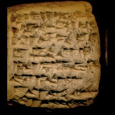 model input (224x224)  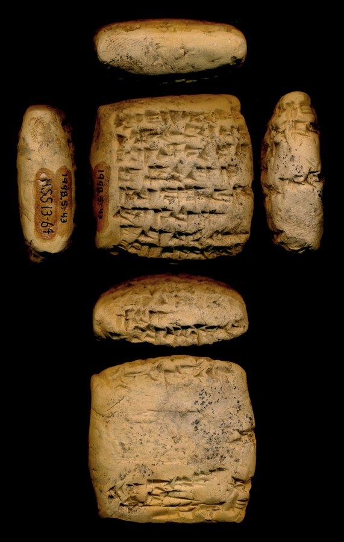 full photo (reference)</td><td valign="top"><table><tr><th>#</th><th>face</th><th>cuneiform</th><th>transliteration</th><th>translation</th></tr><tr><td>1</td><td>obverse</td><td>𒌝 𒈠 𒁹 𒋻 𒈪 𒅀 𒈠 𒇽 𒋃</td><td>um-ma tar-mi-ia-ma sanga</td><td>&mdash;</td></tr><tr><td>2</td><td>obverse</td><td>𒁹 𒄑 𒈥 𒁍 𒁕 𒄑 𒄠 𒉺 𒀭 𒉡</td><td>1(disz) <> mar-gid2-da am-pa-an-nu</td><td>&mdash;</td></tr><tr><td>3</td><td>obverse</td><td>𒊭 𒁹 𒄷 𒁉 𒋫</td><td>sza hu-pi2-ta</td><td>&mdash;</td></tr><tr><td>4</td><td>obverse</td><td>𒌉 𒅅 𒆠 𒀀</td><td>dumu ik-ki-a</td><td>&mdash;</td></tr><tr><td>5</td><td>obverse</td><td>𒀀 𒈾 𒂍 𒃲 𒅆 𒀀 𒈾 𒀭</td><td>a-na e2-kal2-li3 a-na-an-din*-mi*</td><td>&mdash;</td></tr><tr><td>6</td><td>obverse</td><td>𒅇 𒀀 𒈾 𒆪</td><td>u3 a-na-ku</td><td>&mdash;</td></tr><tr><td>7</td><td>obverse</td><td>𒋗 𒄀 𒁍 𒉡</td><td>szu-gi-pu-nu</td><td>&mdash;</td></tr><tr><td>8</td><td>obverse</td><td>𒊭 𒁹 𒄷 𒁉 𒋫</td><td>sza hu-pi2-ta</td><td>&mdash;</td></tr><tr><td>1</td><td>reverse</td><td>𒂖 𒋼 𒄀 𒈪</td><td>el-te-qe3-mi</td><td>&mdash;</td></tr><tr><td>2</td><td>reverse</td><td>𒉌𒌓 𒁹 𒋻 𒈪 𒅀</td><td>na4 tar-mi-ia</td><td>&mdash;</td></tr><tr><td>3</td><td>reverse</td><td>𒇽 𒋃</td><td>lu2 sanga</td><td>&mdash;</td></tr></table></td></tr></table>

**Original text (transliteration):**
> um - ma diš tar - mi - ia - ma lu₂ sanga 1diš giš mar - gid₂ - da giš am - pa - an - nu ša diš hu - pi₂ - ta dumu ik - ki - a a - na e₂ - kal₂ - li₃ a - na - an - din - mi tug₃ šu - gi - pu - nu diš ša - ri - ip - til - la el - te - qe₃ - mi na₄ diš tar - mi - ia

**Cuneiform (Unicode signs, whole document, not position-aligned to the text above):**
> 𒌝 𒈠 𒁹 𒋻 𒈪 𒅀 𒈠 𒇽 𒋃 𒁹 𒄑 𒈥 𒁍 𒁕 𒄑 𒄠 𒉺 𒀭 𒉡 𒊭 𒁹 𒄷 𒁉 𒋫 𒌉 𒅅 𒆠 𒀀 𒀀 𒈾 𒂍 𒃲 𒅆 𒀀 𒈾 𒀭 𒋗 𒄀 𒁍 𒉡 𒁹 𒊭 𒊑 𒅁 𒌀 𒆷 𒂖 𒋼 𒈪 𒉌𒌓 𒁹 𒋻 𒈪 𒅀

**Masked input (16 positions):**
> um <strong>?</strong> ma diš <strong>?</strong> <strong>?</strong> mi - ia - ma lu₂ sanga 1diš giš <strong>?</strong> - gid₂ - da giš am - pa - an - nu ša diš hu <strong>?</strong> <strong>?</strong> <strong>?</strong> - ta dumu ik - ki <strong>?</strong> a a - na e₂ - kal₂ - li₃ a - <strong>?</strong> - an <strong>?</strong> din <strong>?</strong> mi tu <strong>?</strong>₃ šu - gi <strong>?</strong> pu - <strong>?</strong> <strong>?</strong>š ša - ri - ip - til - la el - te - qe₃ <strong>?</strong> mi na₄ diš tar - mi - ia

### Restoration (masked-token predictions)

| # | true token | text-only top-1 | text-only top-3 | vision top-1 | vision top-3 | text-only correct | vision correct |
|---|---|---|---|---|---|---|---|
| 1 | `-` | `-` | `-`, `:`, `a` | `-` | `-`, `a`, `/` | ✅ | ✅ |
| 2 | `tar` | `tar` | `tar`, `ta`, `ri` | `tar` | `tar`, `ta`, `ur` | ✅ | ✅ |
| 3 | `-` | `-` | `-`, `.`, `/` | `-` | `-`, `.`, `:` | ✅ | ✅ |
| 4 | `mar` | `šu` | `šu`, `nu`, `mu` | `šu` | `šu`, `nu`, `im` | ❌ | ❌ |
| 5 | `-` | `-` | `-`, `##š`, `##m` | `-` | `-`, `##š`, `##m` | ✅ | ✅ |
| 6 | `pi` | `u` | `u`, `ur`, `-` | `u` | `u`, `ur`, `-` | ❌ | ❌ |
| 7 | `##₂` | `##₂` | `##₂`, `##m`, `##₃` | `##₂` | `##₂`, `##m`, `##₃` | ✅ | ✅ |
| 8 | `-` | `-` | `-`, `.`, `:` | `-` | `-`, `.`, `/` | ✅ | ✅ |
| 9 | `na` | `ha` | `ha`, `na`, `ša` | `ha` | `ha`, `na`, `ša` | ❌ | ❌ |
| 10 | `-` | `-` | `-`, `dumu`, `ša` | `-` | `-`, `dumu`, `ša` | ✅ | ✅ |
| 11 | `-` | `##gir` | `##gir`, `-`, `##₃` | `##gir` | `##gir`, `-`, `##₂` | ❌ | ❌ |
| 12 | `##g` | `##g` | `##g`, `##ku`, `##kul` | `##g` | `##g`, `##ku`, `##š` | ✅ | ✅ |
| 13 | `-` | `-` | `-`, `##₄`, `##š` | `-` | `-`, `##š`, `##₄` | ✅ | ✅ |
| 14 | `nu` | `um` | `um`, `ut`, `šu` | `um` | `um`, `ut`, `šu` | ❌ | ❌ |
| 15 | `di` | `di` | `di`, `gi`, `me` | `di` | `di`, `gi`, `me` | ✅ | ✅ |
| 16 | `-` | `-` | `-`, `ša`, `šu` | `-` | `-`, `ša`, `šu` | ✅ | ✅ |

Top-1 accuracy on this example: text-only 11/16 (69%), vision 11/16 (69%)

### Metadata predictions

| head | ground truth | text-only prediction | vision prediction |
|---|---|---|---|
| period | Middle Babylonian | Middle Babylonian (0.96) | Middle Babylonian (0.97) |
| genre | Administrative | Administrative (0.67) | Administrative (0.74) |
| language | Akkadian | Akkadian (0.95) | Akkadian (0.93) |
| provenience | Nuzi | Nuzi (0.85) | Nuzi (0.91) |

---

## Example 20 — `P242305` (has photo: True)

*ARET 03, 117 -- Administrative, Ebla, Ebla (mod. Tell Mardikh) -- National Museum of Syria, Idlib, Syria -- published in Testi amministrativi di vario contenuto (Archivio L. 2769: TM.75.G.3000-4101) (Archi, 1982)*

<table><tr><td valign="top" width="240">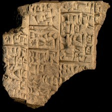 model input (224x224)  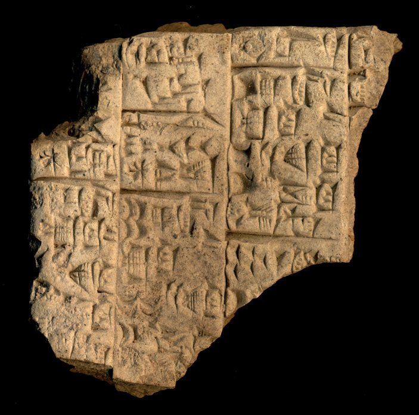 full photo (reference)</td><td valign="top"><table><tr><th>#</th><th>face</th><th>cuneiform</th><th>transliteration</th><th>translation</th></tr><tr><td>1'</td><td>default</td><td>𒀀 𒅤 𒈠 𒌨</td><td>a-bu3-ma-lik</td><td>&mdash;</td></tr><tr><td>2'</td><td>default</td><td>𒀸 𒂍 𒁕 𒌝 𒌆 𒁹 𒀀𒋢 𒌆 𒀸 𒁯 𒊷 𒌆 𒐐 𒆬 𒄀 𒀸</td><td>1(asz@c) 'a3-da-um 2(disz@t) 1(asz@c@90) aktum 1(asz@c) |IB2+3(DISZ@t)| dar sa6 tug2 5(u@c) 1(asz@c@90) GIN2 ku3-sig17 1(asz@c) ...</td><td>&mdash;</td></tr><tr><td>3'</td><td>default</td><td>𒐂 𒂍 𒁕 𒌝 𒌆 𒁹 𒀀𒋢 𒌆 𒐂 𒌈 𒁯 𒊷 𒌆</td><td>4(asz@c) 'a3-da-um 2(disz@t) 4(asz@c@90) aktum 4(asz@c) ib2 dar sa6 tug2</td><td>&mdash;</td></tr></table></td></tr></table>

**Original text (transliteration):**
> <strong>x</strong> - <strong>x</strong> - KU - ra 1aš @ c ' a₃ - da - um 2diš @ t 1aš @ c @ 90 aktum 1aš @ c IB2 + nDIŠ @ t dar sa₆ tug₂ <strong>...</strong> a - bu₃ - ma - lik lu₂ i - ti - NI - lam 4aš @ c ' a₃ - da - um 2diš @ t 4aš @ c @ 90 aktum 4aš @ c ib₂ dar sa₆ tug₂ KIŠ 1aš @ c ' a₃ - da - um 2diš @ t 1aš @ c @ 90 aktum 1aš @ c IB2 + 3DIŠ @ t dar sa₆ tug₂ 5u @ c 1aš @ c @ 90 GIN2 ku₃ - sig₁₇ 1aš @ c <strong>...</strong>

**Masked input (23 positions):**
> <strong>x</strong> - <strong>x</strong> - KU - ra 1aš @ c ' a₃ - <strong>?</strong> - um 2diš @ t 1aš @ c <strong>?</strong> 90 <strong>?</strong>um 1aš @ c IB2 + nDI <strong>?</strong> @ t dar <strong>?</strong>₆ <strong>?</strong>g₂ <strong>...</strong> a - bu₃ - ma - lik lu₂ i - ti - <strong>?</strong>I - lam 4aš @ c ' a <strong>?</strong> - da - um 2diš @ <strong>?</strong> 4aš @ c @ 90 aktum 4aš @ <strong>?</strong> ib₂ dar sa₆ tug₂ KIŠ 1aš @ <strong>?</strong> ' <strong>?</strong>₃ - da - um 2diš @ <strong>?</strong> 1aš @ c <strong>?</strong> 90 aktum 1aš @ c <strong>?</strong>2 + 3DIŠ @ <strong>?</strong> <strong>?</strong> sa₆ tug₂ 5u <strong>?</strong> c 1aš <strong>?</strong> c @ 90 GIN2 <strong>?</strong>₃ - sig₁ <strong>?</strong> <strong>?</strong> @ <strong>?</strong> <strong>...</strong>

### Restoration (masked-token predictions)

| # | true token | text-only top-1 | text-only top-3 | vision top-1 | vision top-3 | text-only correct | vision correct |
|---|---|---|---|---|---|---|---|
| 1 | `da` | `da` | `da`, `du`, `di` | `da` | `da`, `du`, `a` | ✅ | ✅ |
| 2 | `@` | `@` | `@`, `'`, `-` | `@` | `@`, `'`, `-` | ✅ | ✅ |
| 3 | `akt` | `akt` | `akt`, `Akt`, `aq` | `akt` | `akt`, `aq`, `Akt` | ✅ | ✅ |
| 4 | `##Š` | `##Š` | `##Š`, `##N`, `##K` | `##Š` | `##Š`, `##š`, `##K` | ✅ | ✅ |
| 5 | `sa` | `sa` | `sa`, `a`, `na` | `sa` | `sa`, `a`, `su` | ✅ | ✅ |
| 6 | `tu` | `tu` | `tu`, `ti`, `mu` | `tu` | `tu`, `ti`, `mu` | ✅ | ✅ |
| 7 | `N` | `N` | `N`, `H`, `P` | `N` | `N`, `H`, `P` | ✅ | ✅ |
| 8 | `##₃` | `##₃` | `##₃`, `##₂`, `##₇` | `##₃` | `##₃`, `##₂`, `##₇` | ✅ | ✅ |
| 9 | `t` | `t` | `t`, `T`, `c` | `t` | `t`, `T`, `c` | ✅ | ✅ |
| 10 | `c` | `c` | `c`, `t`, `90` | `c` | `c`, `t`, `90` | ✅ | ✅ |
| 11 | `c` | `c` | `c`, `t`, `a` | `c` | `c`, `t`, `a` | ✅ | ✅ |
| 12 | `a` | `a` | `a`, `i`, `e` | `a` | `a`, `i`, `e` | ✅ | ✅ |
| 13 | `t` | `t` | `t`, `T`, `c` | `t` | `t`, `T`, `c` | ✅ | ✅ |
| 14 | `@` | `@` | `@`, `'`, `-` | `@` | `@`, `'`, `-` | ✅ | ✅ |
| 15 | `IB` | `IB` | `IB`, `GAN`, `AB` | `IB` | `IB`, `GAN`, `AB` | ✅ | ✅ |
| 16 | `t` | `t` | `t`, `c`, `T` | `t` | `t`, `c`, `T` | ✅ | ✅ |
| 17 | `dar` | `dar` | `dar`, `'`, `-` | `dar` | `dar`, `'`, `-` | ✅ | ✅ |
| 18 | `@` | `@` | `@`, `-`, `'` | `@` | `@`, `'`, `-` | ✅ | ✅ |
| 19 | `@` | `@` | `@`, `-`, `'` | `@` | `@`, `-`, `'` | ✅ | ✅ |
| 20 | `ku` | `ku` | `ku`, `zi`, `i` | `ku` | `ku`, `zi`, `i` | ✅ | ✅ |
| 21 | `##₇` | `##₇` | `##₇`, `##₅`, `##₄` | `##₇` | `##₇`, `##₅`, `##₀` | ✅ | ✅ |
| 22 | `1aš` | `2diš` | `2diš`, `1diš`, `3diš` | `2diš` | `2diš`, `1diš`, `3diš` | ❌ | ❌ |
| 23 | `c` | `t` | `t`, `c`, `90` | `t` | `t`, `c`, `v` | ❌ | ❌ |

Top-1 accuracy on this example: text-only 21/23 (91%), vision 21/23 (91%)

### Metadata predictions

| head | ground truth | text-only prediction | vision prediction |
|---|---|---|---|
| period | Third Millennium | Third Millennium (0.92) | Third Millennium (0.95) |
| genre | Administrative | Administrative (0.94) | Administrative (0.95) |
| language | Peripheral/Other | Peripheral/Other (0.95) | Peripheral/Other (0.96) |
| provenience | Ebla | Ebla (0.96) | Ebla (0.92) |

---
