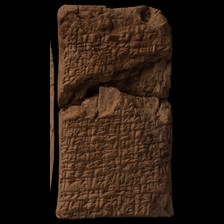
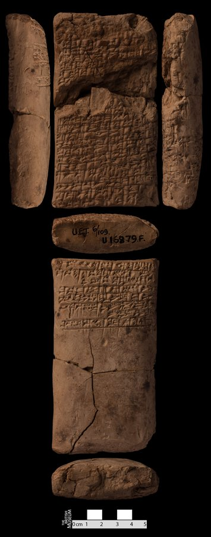

# Prediction demo: text-only vs vision (provenience) model

11 hand-picked tablet(s) (`--tablet_ids`). Both models see the exact same masked positions per example (bold <strong>?</strong> shown at every chosen position, 15% of eligible tokens) -- differences in restoration come only from the two models' separately trained weights, not from the image itself (the image only reaches `provenience_head`, see module docstring). The metadata table's `provenience` row is where the image can actually change an answer.

## Example 1 — `P273207` (has photo: True)

*Gilgamesh fragment -- Neo-Assyrian -- The British Museum*

<table><tr><td valign="top" width="240"> model input (224x224)   full photo (reference)</td><td valign="top"><table><tr><th>#</th><th>face</th><th>cuneiform</th><th>transliteration</th><th>translation</th></tr><tr><td>1'</td><td>default</td><td>x</td><td>... x</td><td>&mdash;</td></tr><tr><td>2'</td><td>default</td><td>x x 𒉿</td><td>x x pi ...</td><td>&mdash;</td></tr><tr><td>3'</td><td>default</td><td>𒂊 𒌨 𒄷 x</td><td>e taš-hu x ...</td><td>&mdash;</td></tr><tr><td>4'</td><td>default</td><td>𒅎 𒈥 x</td><td>im-mar x ...</td><td>&mdash;</td></tr><tr><td>5'</td><td>default</td><td>𒅁 𒁍 𒌋 x</td><td>ib-bu-u x ...</td><td>&mdash;</td></tr><tr><td>6'</td><td>default</td><td>𒅁 𒅆 𒋗</td><td>ib-ši šu ...</td><td>&mdash;</td></tr><tr><td>7'</td><td>default</td><td>𒄿 𒅘 𒄫 x</td><td>i-nak-kir x ...</td><td>&mdash;</td></tr><tr><td>8'</td><td>default</td><td>x x x</td><td>x x x ...</td><td>&mdash;</td></tr></table></td></tr></table>

**Original text (transliteration):**
> e taš - hu <strong>x</strong> <strong>...</strong> im - mar <strong>x</strong> <strong>...</strong> ib - bu - u <strong>x</strong> <strong>...</strong> ib - ši šu <strong>...</strong> i - nak - kir <strong>x</strong> <strong>...</strong> <strong>x</strong> <strong>x</strong> <strong>x</strong> <strong>...</strong>

**Cuneiform (Unicode signs, whole document, not position-aligned to the text above):**
> 𒂊 𒌨 𒄷 x 𒅎 𒈥 x 𒅁 𒁍 𒌋 x 𒅁 𒅆 𒋗 𒄿 𒅘 𒄫 x x x x

**Masked input (4 positions):**
> <strong>?</strong> taš <strong>?</strong> hu <strong>x</strong> <strong>...</strong> im - mar <strong>x</strong> <strong>...</strong> ib - bu - u <strong>x</strong> <strong>...</strong> ib - ši šu <strong>...</strong> i <strong>?</strong> nak - <strong>?</strong>r <strong>x</strong> <strong>...</strong> <strong>x</strong> <strong>x</strong> <strong>x</strong> <strong>...</strong>

### Restoration (masked-token predictions)

| # | true token | text-only top-1 | text-only top-3 | vision top-1 | vision top-3 | text-only correct | vision correct |
|---|---|---|---|---|---|---|---|
| 1 | `e` | `-` | `-`, `ina`, `la` | `-` | `-`, `ša`, `ina` | ❌ | ❌ |
| 2 | `-` | `-` | `-`, `##₂`, `.` | `-` | `-`, `##₂`, `##₃` | ✅ | ✅ |
| 3 | `-` | `-` | `-`, `##b`, `##₃` | `-` | `-`, `##b`, `##₇` | ✅ | ✅ |
| 4 | `ki` | `ki` | `ki`, `ši`, `qa` | `ki` | `ki`, `ši`, `qa` | ✅ | ✅ |

Top-1 accuracy on this example: text-only 3/4 (75%), vision 3/4 (75%)

### Metadata predictions

| head | ground truth | text-only prediction | vision prediction |
|---|---|---|---|
| period | Neo-Assyrian | Neo-Assyrian (0.95) | Neo-Assyrian (0.92) |
| genre | Literary & Scholarly | Lexical (0.42) | Royal Inscriptions (0.53) **<- differs** |
| language | Akkadian | Akkadian (0.96) | Akkadian (0.95) |
| provenience | Nineveh | Nineveh (0.89) | Nineveh (0.93) |

---

## Example 2 — `P285823` (has photo: True)

*Gilgamesh fragment -- Atraḫasīs (Story of the Flood) -- Neo-Assyrian -- The British Museum*

<table><tr><td valign="top" width="240"> model input (224x224)   full photo (reference)</td><td valign="top"><table><tr><th>#</th><th>face</th><th>cuneiform</th><th>transliteration</th><th>translation</th></tr><tr><td>1'</td><td>default</td><td>x 𒇻 𒌋 x</td><td>x x x x lu-u x x x x x (x x)</td><td>&mdash;</td></tr><tr><td>2'</td><td>default</td><td>x 𒆠 𒈠 𒄒 𒉺 x</td><td>x x x x ki-ma kip-pa-ti₃ x x x (x x)</td><td>&mdash;</td></tr><tr><td>3'</td><td>default</td><td>𒌋 𒁕 𒀭 𒂊 𒇺 𒌋 š</td><td>ku-up-ru lu da-an e-liš u šap-liš</td><td>&mdash;</td></tr><tr><td>4'</td><td>default</td><td>𒂊 𒉿 𒄭 𒄑</td><td>x (x) x-e pe-hi MA₂</td><td>&mdash;</td></tr><tr><td>5'</td><td>default</td><td>𒀀 𒄨 𒈾 𒃻 𒀀 𒉺𒅁 𒉺 𒊩</td><td>u₂-ṣur a-dan-na ša₂ a-šap-pa-rak-ka</td><td>&mdash;</td></tr><tr><td>6'</td><td>default</td><td>𒂊 𒊒 𒌝 𒈠 𒄑 𒌁</td><td>MA₂ e-ru-um-ma KA₂ MA₂ tir-ra</td><td>&mdash;</td></tr><tr><td>7'</td><td>default</td><td>𒁉 𒃻 𒅗 𒅗 𒌋</td><td>zi-ib-la ina lib₃-bi-ša₂ ŠE.BAR-ka NIG₂.ŠU-ka u NIG₂.GA-ka</td><td>&mdash;</td></tr><tr><td>8'</td><td>default</td><td>𒀀 𒆠 𒆳 𒅗 𒊓 𒆳 𒅗 𒌋 𒌉 𒈨𒌍 𒌝 𒁹</td><td>aš₂-šat-ka ki-mat-ka sa-lat-ka u DUMU-MEŠ um-ma-ni</td><td>&mdash;</td></tr><tr><td>9'</td><td>default</td><td>𒁷 𒌑 𒈠 𒄠 𒂔 𒈠 𒆷 𒈨 𒅕</td><td>bu-ul EDIN u₂-ma-am EDIN ma-la U₂.ŠIM me-er-ʾi-sun</td><td>&mdash;</td></tr><tr><td>10'</td><td>default</td><td>𒀀 𒊩 𒈠 𒄿 𒈾 𒊍 𒍝 𒊒</td><td>a-šap-pa-rak-kum₂-ma i-na-aṣ-ṣa-ru KA₂-ka</td><td>&mdash;</td></tr><tr><td>11'</td><td>default</td><td>𒀀 𒄩 𒋀 𒉺 𒀀 𒋙 𒈠</td><td>at-ra-ha-sis pa-a-šu₂ DU₃-ma DUG₄.GA</td><td>&mdash;</td></tr><tr><td>12'</td><td>default</td><td>𒋼𒀀 𒁹 𒂍 𒀀 𒁁 𒉌</td><td>i-zak-kar ana e₂-a be-li₂-šu₂</td><td>&mdash;</td></tr><tr><td>13'</td><td>default</td><td>𒄿 𒈠 𒀀 𒄑 𒌌 𒂊 𒁍 𒍑 x</td><td>ma-ti-ma-a MA₂ ul e-pu-uš x x</td><td>&mdash;</td></tr><tr><td>14'</td><td>default</td><td>𒀀 𒊑 𒂊 𒈲 𒌑 ṣ</td><td>ina qaq-qa-ri e-ṣir u₂-ṣur-tu₂</td><td>&mdash;</td></tr><tr><td>15'</td><td>default</td><td>𒌅 𒇻 𒄯 𒈠 𒄑</td><td>u₂-ṣur-tu lu-mur-ma MA₂ lu-pu-uš</td><td>&mdash;</td></tr><tr><td>16'</td><td>default</td><td>𒀀 𒀸 𒆕 𒋡 𒊑 𒂊</td><td>e₂-a ina qaq-qa-ri e-ṣir u₂-ṣur-tu</td><td>&mdash;</td></tr><tr><td>17'</td><td>default</td><td>𒂊 𒉌 𒃻 𒋳 𒁀 𒀀</td><td>x x (x) be-li₂ ša₂ taq-ba-a x x x (x x x)</td><td>&mdash;</td></tr></table></td></tr></table>

**Original text (transliteration):**
> <strong>x</strong> <strong>x</strong> <strong>x</strong> <strong>x</strong> lu - u <strong>x</strong> <strong>x</strong> <strong>x</strong> <strong>x</strong> <strong>x</strong> <strong>x</strong> <strong>x</strong> <strong>x</strong> <strong>x</strong> <strong>x</strong> <strong>x</strong> ki - ma kip - pa - ti₃ <strong>x</strong> <strong>x</strong> <strong>x</strong> <strong>x</strong> <strong>x</strong> ku - up - ru lu da - an e - liš u šap - liš <strong>x</strong> <strong>x</strong> <strong>x</strong> - e pe - hi MA₂ u₂ - ṣur a - dan - na ša₂ a - šap - pa - rak - ka MA₂ e - ru - um - ma KA₂ MA₂ tir - ra zi - ib - la ina lib₃ - bi - ša₂ ŠE. BAR - ka NIG₂. ŠU - ka u NIG₂. GA - ka aš₂ - šat - ka ki - mat - ka sa - lat - ka u DUMU - MEŠ um - ma - ni bu - ul EDIN u₂ - ma - am EDIN ma - la U₂. ŠIM me - er - ʾi - sun a - šap - pa - rak - kum₂ - ma i - na - aṣ - ṣa - ru KA₂ - ka at - ra - ha - sis pa - a - šu₂ DU₃ - ma DUG₄. GA i - zak - kar ana e₂ - a be - li₂ - šu₂ ma - ti - ma - a MA₂ ul e - pu - uš <strong>x</strong> <strong>x</strong> ina qaq - qa - ri e - ṣir u₂ - ṣur - tu₂ u₂ - ṣur - tu lu - mur - ma MA₂ lu - pu - uš e₂ - a ina qaq - qa - ri e - ṣir u₂ - ṣur - tu <strong>x</strong> <strong>x</strong> <strong>x</strong> be - li₂ ša₂ taq - ba - a <strong>x</strong> <strong>x</strong> <strong>x</strong> <strong>x</strong> <strong>x</strong> <strong>x</strong>

**Cuneiform (Unicode signs, whole document, not position-aligned to the text above):**
> x 𒇻 𒌋 x x 𒆠 𒈠 𒄒 𒉺 x 𒌋 𒁕 𒀭 𒂊 𒇺 𒌋 š 𒂊 𒉿 𒄭 𒄑 𒀀 𒄨 𒈾 𒃻 𒀀 𒉺𒅁 𒉺 𒊩 𒂊 𒊒 𒌝 𒈠 𒄑 𒌁 𒁉 𒃻 𒅗 𒅗 𒌋 𒀀 𒆠 𒆳 𒅗 𒊓 𒆳 𒅗 𒌋 𒌉 𒈨𒌍 𒌝 𒁹 𒁷 𒌑 𒈠 𒄠 𒂔 𒈠 𒆷 𒈨 𒅕 𒀀 𒊩 𒈠 𒄿 𒈾 𒊍 𒍝 𒊒 𒀀 𒄩 𒋀 𒉺 𒀀 𒋙 𒈠 𒋼𒀀 𒁹 𒂍 𒀀 𒁁 𒉌 𒄿 𒈠 𒀀 𒄑 𒌌 𒂊 𒁍 𒍑 x 𒀀 𒊑 𒂊 𒈲 𒌑 ṣ 𒌅 𒇻 𒄯 𒈠 𒄑 𒀀 𒀸 𒆕 𒋡 𒊑 𒂊 𒂊 𒉌 𒃻 𒋳 𒁀 𒀀

**Masked input (49 positions):**
> <strong>x</strong> <strong>x</strong> <strong>x</strong> <strong>x</strong> lu - u <strong>x</strong> <strong>x</strong> <strong>x</strong> <strong>x</strong> <strong>x</strong> <strong>x</strong> <strong>x</strong> <strong>x</strong> <strong>x</strong> <strong>x</strong> <strong>x</strong> <strong>?</strong> - ma kip - pa - ti₃ <strong>x</strong> <strong>x</strong> <strong>x</strong> <strong>x</strong> <strong>x</strong> <strong>?</strong> - <strong>?</strong> <strong>?</strong> ru lu da - an <strong>?</strong> - liš u šap - liš <strong>x</strong> <strong>x</strong> <strong>x</strong> - e pe - hi MA₂ u <strong>?</strong> - ṣur <strong>?</strong> - dan <strong>?</strong> na <strong>?</strong>₂ a <strong>?</strong> šap - pa - rak - ka MA₂ <strong>?</strong> - ru - um - ma KA <strong>?</strong> MA₂ tir - ra zi - <strong>?</strong>b <strong>?</strong> la ina lib₃ - bi - ša₂ ŠE. BAR - ka <strong>?</strong>IG₂ <strong>?</strong> ŠU - ka u NIG₂. <strong>?</strong> <strong>?</strong> <strong>?</strong> aš <strong>?</strong> - šat - <strong>?</strong> ki - mat - ka <strong>?</strong> - lat - ka u DUMU - MEŠ um <strong>?</strong> ma - ni bu <strong>?</strong> ul <strong>?</strong>IN u₂ - ma - am <strong>?</strong>IN ma - la U₂. ŠIM me - er - ʾi - sun a - šap <strong>?</strong> pa <strong>?</strong> rak <strong>?</strong> kum₂ - ma i <strong>?</strong> na <strong>?</strong> aṣ - ṣa - ru <strong>?</strong> <strong>?</strong> - ka at - ra - ha - sis pa - a - šu₂ DU₃ - ma <strong>?</strong>G <strong>?</strong>. GA i - zak - kar ana e₂ - <strong>?</strong> be - li₂ - <strong>?</strong>₂ ma - ti - ma - a MA₂ ul e - pu - uš <strong>x</strong> <strong>x</strong> ina qaq - qa - <strong>?</strong> e - ṣir u₂ - ṣur - tu₂ u₂ - <strong>?</strong>ur - tu lu <strong>?</strong> mur - <strong>?</strong> MA₂ lu - <strong>?</strong> - uš e₂ - a ina <strong>?</strong>q - qa - ri <strong>?</strong> <strong>?</strong> ṣir u₂ - <strong>?</strong> <strong>?</strong> - tu <strong>x</strong> <strong>x</strong> <strong>x</strong> be - li₂ <strong>?</strong>₂ taq - <strong>?</strong> - a <strong>x</strong> <strong>x</strong> <strong>x</strong> <strong>x</strong> <strong>x</strong> <strong>x</strong>

### Restoration (masked-token predictions)

| # | true token | text-only top-1 | text-only top-3 | vision top-1 | vision top-3 | text-only correct | vision correct |
|---|---|---|---|---|---|---|---|
| 1 | `ki` | `um` | `um`, `ki`, `šum` | `um` | `um`, `ki`, `šum` | ❌ | ❌ |
| 2 | `ku` | `a` | `a`, `ma`, `i` | `a` | `a`, `i`, `ma` | ❌ | ❌ |
| 3 | `up` | `a` | `a`, `pu`, `ma` | `a` | `a`, `mu`, `pu` | ❌ | ❌ |
| 4 | `-` | `-` | `-`, `.`, `##₂` | `-` | `-`, `.`, `##₂` | ✅ | ✅ |
| 5 | `e` | `be` | `be`, `##₂`, `e` | `be` | `be`, `##₂`, `pa` | ❌ | ❌ |
| 6 | `##₂` | `##₂` | `##₂`, `##₃`, `##ṣ` | `##₂` | `##₂`, `e`, `##ṣ` | ✅ | ✅ |
| 7 | `a` | `a` | `a`, `i`, `na` | `a` | `a`, `i`, `ta` | ✅ | ✅ |
| 8 | `-` | `-` | `-`, `##₂`, `.` | `-` | `-`, `##₂`, `.` | ✅ | ✅ |
| 9 | `ša` | `MA` | `MA`, `ša`, `E` | `MA` | `MA`, `ša`, `E` | ❌ | ❌ |
| 10 | `-` | `-` | `-`, `##₂`, `.` | `-` | `-`, `.`, `##₂` | ✅ | ✅ |
| 11 | `e` | `mah` | `mah`, `bu`, `ir` | `še` | `še`, `šu`, `e` | ❌ | ❌ |
| 12 | `##₂` | `##₂` | `##₂`, `.`, `##Š` | `##₂` | `##₂`, `##Š`, `##R` | ✅ | ✅ |
| 13 | `i` | `i` | `i`, `zi`, `ki` | `i` | `i`, `zi`, `ri` | ✅ | ✅ |
| 14 | `-` | `-` | `-`, `##₂`, `lu` | `-` | `-`, `##₂`, `lu` | ✅ | ✅ |
| 15 | `N` | `N` | `N`, `n`, `Z` | `N` | `N`, `n`, `Z` | ✅ | ✅ |
| 16 | `.` | `.` | `.`, `-`, `u` | `.` | `.`, `-`, `ina` | ✅ | ✅ |
| 17 | `GA` | `ŠU` | `ŠU`, `GA`, `KUR` | `ŠU` | `ŠU`, `GA`, `BA` | ❌ | ❌ |
| 18 | `-` | `-` | `-`, `.`, `##₂` | `-` | `-`, `.`, `##₂` | ✅ | ✅ |
| 19 | `ka` | `ka` | `ka`, `-`, `ia` | `ka` | `ka`, `-`, `ia` | ✅ | ✅ |
| 20 | `##₂` | `##₂` | `##₂`, `a`, `##₃` | `##₂` | `##₂`, `##₈`, `##₃` | ✅ | ✅ |
| 21 | `ka` | `ti` | `ti`, `tu`, `ka` | `ti` | `ti`, `tu`, `ta` | ❌ | ❌ |
| 22 | `sa` | `e` | `e`, `i`, `il` | `e` | `e`, `il`, `al` | ❌ | ❌ |
| 23 | `-` | `-` | `-`, `.`, `:` | `-` | `-`, `.`, `:` | ✅ | ✅ |
| 24 | `-` | `-` | `-`, `##r`, `##₂` | `-` | `-`, `##r`, `##₂` | ✅ | ✅ |
| 25 | `ED` | `ED` | `ED`, `N`, `T` | `ED` | `ED`, `T`, `N` | ✅ | ✅ |
| 26 | `ED` | `ED` | `ED`, `N`, `T` | `ED` | `ED`, `N`, `T` | ✅ | ✅ |
| 27 | `-` | `-` | `-`, `.`, `:` | `-` | `-`, `.`, `:` | ✅ | ✅ |
| 28 | `-` | `-` | `-`, `.`, `:` | `-` | `-`, `.`, `:` | ✅ | ✅ |
| 29 | `-` | `-` | `-`, `ina`, `u` | `-` | `-`, `u`, `ina` | ✅ | ✅ |
| 30 | `-` | `-` | `-`, `+`, `.` | `-` | `-`, `+`, `.` | ✅ | ✅ |
| 31 | `-` | `-` | `-`, `la`, `LUGAL` | `-` | `-`, `la`, `LUGAL` | ✅ | ✅ |
| 32 | `KA` | `-` | `-`, `MA`, `E` | `-` | `-`, `E`, `ina` | ❌ | ❌ |
| 33 | `##₂` | `##₂` | `##₂`, `ti`, `##₃` | `##₃` | `##₃`, `##₂`, `ti` | ✅ | ❌ |
| 34 | `DU` | `DU` | `DU`, `GI`, `KU` | `DU` | `DU`, `KU`, `GI` | ✅ | ✅ |
| 35 | `##₄` | `##₃` | `##₃`, `##₂`, `##₅` | `##₃` | `##₃`, `##₅`, `##₂` | ❌ | ❌ |
| 36 | `a` | `a` | `a`, `gal`, `e` | `a` | `a`, `gal`, `šu` | ✅ | ✅ |
| 37 | `šu` | `šu` | `šu`, `ia`, `ša` | `ia` | `ia`, `šu`, `ša` | ✅ | ❌ |
| 38 | `ri` | `ri` | `ri`, `ru`, `ra` | `ri` | `ri`, `ru`, `ra` | ✅ | ✅ |
| 39 | `ṣ` | `ṣ` | `ṣ`, `ṭ`, `ḫ` | `ṣ` | `ṣ`, `ṭ`, `Ṣ` | ✅ | ✅ |
| 40 | `-` | `-` | `-`, `##₂`, `.` | `-` | `-`, `##₂`, `.` | ✅ | ✅ |
| 41 | `ma` | `tu` | `tu`, `uš`, `ru` | `uš` | `uš`, `ši`, `ma` | ❌ | ❌ |
| 42 | `pu` | `mur` | `mur`, `pu`, `mu` | `mur` | `mur`, `pu`, `mu` | ❌ | ❌ |
| 43 | `qa` | `qa` | `qa`, `ši`, `ša` | `qa` | `qa`, `ši`, `ša` | ✅ | ✅ |
| 44 | `e` | `e` | `e`, `E`, `i` | `e` | `e`, `E`, `i` | ✅ | ✅ |
| 45 | `-` | `-` | `-`, `##₂`, `.` | `-` | `-`, `##₂`, `.` | ✅ | ✅ |
| 46 | `ṣ` | `ṣ` | `ṣ`, `ṭ`, `##ṣ` | `ṣ` | `ṣ`, `ṭ`, `Ṣ` | ✅ | ✅ |
| 47 | `##ur` | `##ur` | `##ur`, `##u`, `##r` | `##ur` | `##ur`, `##u`, `##ir` | ✅ | ✅ |
| 48 | `ša` | `ša` | `ša`, `MA`, `u` | `MA` | `MA`, `ša`, `E` | ✅ | ❌ |
| 49 | `ba` | `ba` | `ba`, `la`, `ta` | `ma` | `ma`, `ba`, `qa` | ✅ | ❌ |

Top-1 accuracy on this example: text-only 36/49 (73%), vision 32/49 (65%)

### Metadata predictions

| head | ground truth | text-only prediction | vision prediction |
|---|---|---|---|
| period | Old Babylonian | Neo-Assyrian (0.90) | Neo-Assyrian (0.91) |
| genre | Literary & Scholarly | Literary & Scholarly (0.77) | Literary & Scholarly (0.75) |
| language | Akkadian | Akkadian (0.94) | Akkadian (0.95) |
| provenience | (no label) | Nineveh (0.75) | Nineveh (0.93) |

---

## Example 3 — `P273223` (has photo: True)

*Gilgamesh fragment -- Neo-Assyrian -- The British Museum*

<table><tr><td valign="top" width="240"> model input (224x224)   full photo (reference)</td><td valign="top"><table><tr><th>#</th><th>face</th><th>cuneiform</th><th>transliteration</th><th>translation</th></tr><tr><td>1'</td><td>default</td><td>x x x</td><td>... x x x ...</td><td>&mdash;</td></tr><tr><td>2'</td><td>default</td><td>𒄿 𒉺 𒀾 š</td><td>man-za-zu i-pa-<<da>>-aš₂-šum-ma is-sah-ra</td><td>&mdash;</td></tr><tr><td>3'</td><td>default</td><td>𒅎 𒄷 𒌑 𒈦 š</td><td>il-lik SIM u₂-maš-šar : ...</td><td>&mdash;</td></tr><tr><td>4'</td><td>default</td><td>𒌋</td><td>man-za-zu ul ip-pa-aš₂-šum-ma is-sah-ra</td><td>&mdash;</td></tr><tr><td>5'</td><td>default</td><td>𒊑 𒁀 𒌑</td><td>u₂-še-ṣi-ma a-ri-ba u₂-maš-šar : ...</td><td>&mdash;</td></tr><tr><td>6'</td><td>default</td><td>𒅈 𒊑 𒌌</td><td>ik-kal i-ša₂-ah-hi i-tar-ri ul is-sah-ra</td><td>&mdash;</td></tr></table></td></tr></table>

**Original text (transliteration):**
> man - za - zu i - pa - aš₂ - šum - ma is - sah - ra il - lik SIM u₂ - maš - šar : <strong>...</strong> u₂ - še - ṣi - ma a - ri - ba u₂ - maš - šar : <strong>...</strong> ik - kal i - ša₂ - ah - hi i - tar - ri ul is - sah - ra

**Cuneiform (Unicode signs, whole document, not position-aligned to the text above):**
> 𒄿 𒉺 𒀾 š 𒅎 𒄷 𒌑 𒈦 š 𒊑 𒁀 𒌑 𒅈 𒊑 𒌌

**Masked input (11 positions):**
> man - za - zu <strong>?</strong> - pa <strong>?</strong> aš <strong>?</strong> - <strong>?</strong> - ma is - sah - ra il - lik SIM u₂ - maš <strong>?</strong> šar : <strong>...</strong> u₂ - <strong>?</strong> - <strong>?</strong>i - ma a - ri - ba <strong>?</strong>₂ <strong>?</strong> maš - šar : <strong>...</strong> ik - kal i <strong>?</strong> ša₂ - ah - hi i - tar - ri ul is - <strong>?</strong> - ra

### Restoration (masked-token predictions)

| # | true token | text-only top-1 | text-only top-3 | vision top-1 | vision top-3 | text-only correct | vision correct |
|---|---|---|---|---|---|---|---|
| 1 | `i` | `i` | `i`, `e`, `iš` | `i` | `i`, `ap`, `up` | ✅ | ✅ |
| 2 | `-` | `-` | `-`, `:`, `##₂` | `-` | `-`, `##₂`, `:` | ✅ | ✅ |
| 3 | `##₂` | `##₂` | `##₂`, `##₃`, `a` | `##₂` | `##₂`, `##₃`, `##₄` | ✅ | ✅ |
| 4 | `šum` | `šu` | `šu`, `ši`, `ri` | `šu` | `šu`, `ši`, `ru` | ❌ | ❌ |
| 5 | `-` | `-` | `-`, `:`, `.` | `-` | `-`, `:`, `.` | ✅ | ✅ |
| 6 | `še` | `še` | `še`, `ša`, `ma` | `še` | `še`, `ša`, `ma` | ✅ | ✅ |
| 7 | `ṣ` | `ṣ` | `ṣ`, `ṭ`, `q` | `ṣ` | `ṣ`, `ṭ`, `q` | ✅ | ✅ |
| 8 | `u` | `u` | `u`, `U`, `tu` | `u` | `u`, `U`, `a` | ✅ | ✅ |
| 9 | `-` | `-` | `-`, `:`, `.` | `-` | `-`, `:`, `.` | ✅ | ✅ |
| 10 | `-` | `-` | `-`, `+`, `:` | `-` | `-`, `+`, `:` | ✅ | ✅ |
| 11 | `sah` | `sah` | `sah`, `sa`, `si` | `sah` | `sah`, `sa`, `si` | ✅ | ✅ |

Top-1 accuracy on this example: text-only 10/11 (91%), vision 10/11 (91%)

### Metadata predictions

| head | ground truth | text-only prediction | vision prediction |
|---|---|---|---|
| period | Neo-Assyrian | Neo-Assyrian (0.74) | Neo-Assyrian (0.71) |
| genre | Literary & Scholarly | Royal Inscriptions (0.49) | Literary & Scholarly (0.57) **<- differs** |
| language | Akkadian | Akkadian (0.93) | Akkadian (0.96) |
| provenience | Nineveh | Nineveh (0.69) | Nineveh (0.91) |

---

## Example 4 — `P402919` (has photo: True)

*Enuma Elish fragment -- Neo-Assyrian -- The British Museum*

<table><tr><td valign="top" width="240"> model input (224x224)   full photo (reference)</td><td valign="top"><table><tr><th>#</th><th>face</th><th>cuneiform</th><th>transliteration</th><th>translation</th></tr><tr><td>1'</td><td>default</td><td>𒀯 𒇸</td><td>mul-lil AN-e u KI-ti₃ ...</td><td>&mdash;</td></tr><tr><td>2'</td><td>default</td><td>𒀀 𒈾 𒁺 𒌦</td><td>ša₂ a-na du-un-ni ...</td><td>&mdash;</td></tr><tr><td>3'</td><td>default</td><td>𒁀 𒉡</td><td>GIŠ.NUMUN.AB₂ ba-nu-u₂ ...</td><td>&mdash;</td></tr><tr><td>4'</td><td>default</td><td>𒂍 𒀭 𒈨𒌍 𒃻</td><td>a-bit DINGIR-MEŠ ša₂ ...</td><td>&mdash;</td></tr><tr><td>5'</td><td>default</td><td>𒈗</td><td>LUGAL.AB₂.DUBUR₂ LUGAL ...</td><td>&mdash;</td></tr></table></td></tr></table>

**Original text (transliteration):**
> mul - lil AN - e u KI - ti₃ <strong>...</strong> ša₂ a - na du - un - ni <strong>...</strong> a - bit DINGIR - MEŠ ša₂ <strong>...</strong>

**Cuneiform (Unicode signs, whole document, not position-aligned to the text above):**
> 𒀯 𒇸 𒀀 𒈾 𒁺 𒌦 𒂍 𒀭 𒈨𒌍 𒃻

**Masked input (5 positions):**
> mul - lil <strong>?</strong> <strong>?</strong> e <strong>?</strong> KI - <strong>?</strong>₃ <strong>...</strong> ša₂ a - na du - un <strong>?</strong> ni <strong>...</strong> a - bit DINGIR - MEŠ ša₂ <strong>...</strong>

### Restoration (masked-token predictions)

| # | true token | text-only top-1 | text-only top-3 | vision top-1 | vision top-3 | text-only correct | vision correct |
|---|---|---|---|---|---|---|---|
| 1 | `AN` | `##₂` | `##₂`, `##₃`, `-` | `##₂` | `##₂`, `-`, `.` | ❌ | ❌ |
| 2 | `-` | `-` | `-`, `ša`, `.` | `-` | `-`, `ša`, `LUGAL` | ✅ | ✅ |
| 3 | `u` | `u` | `u`, `-`, `##₃` | `u` | `u`, `-`, `##₂` | ✅ | ✅ |
| 4 | `ti` | `ti` | `ti`, `DU`, `AM` | `ti` | `ti`, `DU`, `AM` | ✅ | ✅ |
| 5 | `-` | `-` | `-`, `.`, `:` | `-` | `-`, `.`, `:` | ✅ | ✅ |

Top-1 accuracy on this example: text-only 4/5 (80%), vision 4/5 (80%)

### Metadata predictions

| head | ground truth | text-only prediction | vision prediction |
|---|---|---|---|
| period | Neo-Assyrian | Neo-Assyrian (0.93) | Neo-Assyrian (0.93) |
| genre | Literary & Scholarly | Royal Inscriptions (0.85) | Royal Inscriptions (0.92) |
| language | Akkadian | Akkadian (0.95) | Akkadian (0.94) |
| provenience | Nineveh | Nineveh (0.89) | Nineveh (0.91) |

---

## Example 5 — `ebl:BM.42004` (has photo: False)

*Atrahasis fragment -- Atraḫasīs (Story of the Flood) -- Neo-Babylonian -- The British Museum*

**Original text (transliteration):**
> <strong>...</strong> <strong>x</strong> TUKUL i - <strong>...</strong> <strong>...</strong> <strong>x</strong> ina GU. ZA <strong>x</strong> <strong>...</strong> <strong>...</strong> + en - lil₂ KA - šu₂ DU₃ - ma <strong>...</strong> <strong>...</strong> zag - ga - <strong>x</strong> <strong>x</strong> <strong>...</strong>

**Cuneiform (Unicode signs, whole document, not position-aligned to the text above):**
> x 𒄑 𒆪 𒄿 x 𒀸 𒄑 x 𒅍 𒅗 𒋙 𒀭 𒍠 𒂵 x

**Masked input (4 positions):**
> <strong>...</strong> <strong>x</strong> TUK <strong>?</strong> i - <strong>...</strong> <strong>...</strong> <strong>x</strong> ina GU. ZA <strong>x</strong> <strong>...</strong> <strong>...</strong> + en - lil₂ KA - šu <strong>?</strong> <strong>?</strong> <strong>?</strong> - ma <strong>...</strong> <strong>...</strong> zag - ga - <strong>x</strong> <strong>x</strong> <strong>...</strong>

### Restoration (masked-token predictions)

| # | true token | text-only top-1 | text-only top-3 | vision top-1 | vision top-3 | text-only correct | vision correct |
|---|---|---|---|---|---|---|---|
| 1 | `##UL` | `##UL` | `##UL`, `##U`, `-` | `##UL` | `##UL`, `##U`, `-` | ✅ | ✅ |
| 2 | `##₂` | `##₂` | `##₂`, `-`, `##b` | `##₂` | `##₂`, `-`, `##b` | ✅ | ✅ |
| 3 | `DU` | `-` | `-`, `u`, `la` | `-` | `-`, `u`, `ša` | ❌ | ❌ |
| 4 | `##₃` | `##₂` | `##₂`, `nu`, `ti` | `##₂` | `##₂`, `nu`, `um` | ❌ | ❌ |

Top-1 accuracy on this example: text-only 2/4 (50%), vision 2/4 (50%)

### Metadata predictions

| head | ground truth | text-only prediction | vision prediction |
|---|---|---|---|
| period | (no label) | Neo-Assyrian (0.95) | Neo-Assyrian (0.94) |
| genre | (no label) | Letters (0.46) | Literary & Scholarly (0.71) **<- differs** |
| language | (no label) | Akkadian (0.92) | Akkadian (0.91) |
| provenience | (no label) | Nineveh (0.93) | Nineveh (0.83) |

---

## Example 6 — `P404643` (has photo: True)

*Hammurabi fragment -- Neo-Assyrian -- The British Museum*

<table><tr><td valign="top" width="240"> model input (224x224)   full photo (reference)</td><td valign="top"><table><tr><th>#</th><th>face</th><th>cuneiform</th><th>transliteration</th><th>translation</th></tr><tr><td>1'</td><td>reverse</td><td>𒍪 𒊻</td><td>i-zu-uz-zu</td><td>&mdash;</td></tr><tr><td>2'</td><td>reverse</td><td>𒀀</td><td>i-na NIG₂.GA E₂ A.BA</td><td>&mdash;</td></tr><tr><td>3'</td><td>reverse</td><td>x 𒈬</td><td>... x mu ...</td><td>&mdash;</td></tr><tr><td>4'</td><td>reverse</td><td>𒂊 𒄴</td><td>ṣe-eh-ri-im</td><td>&mdash;</td></tr><tr><td>5'</td><td>reverse</td><td>š 𒊭 𒌈 𒆷 𒀀</td><td>ša aš-ša-tum la ah-zu</td><td>&mdash;</td></tr><tr><td>6'</td><td>reverse</td><td>𒇷 𒀜</td><td>e-li-at ši₂-ti-šu</td><td>&mdash;</td></tr><tr><td>7'</td><td>reverse</td><td>x x x x</td><td>... x x x x ...</td><td>&mdash;</td></tr></table></td></tr></table>

**Original text (transliteration):**
> i - zu - uz - zu ṣe - eh - ri - im ša aš - ša - tum la ah - zu e - li - at ši₂ - ti - šu

**Cuneiform (Unicode signs, whole document, not position-aligned to the text above):**
> 𒍪 𒊻 𒂊 𒄴 š 𒊭 𒌈 𒆷 𒀀 𒇷 𒀜

**Masked input (6 positions):**
> i - zu - uz - zu ṣe - <strong>?</strong>h - ri - <strong>?</strong> ša aš - ša - tum la ah <strong>?</strong> zu e - li <strong>?</strong> at ši₂ - <strong>?</strong> - <strong>?</strong>

### Restoration (masked-token predictions)

| # | true token | text-only top-1 | text-only top-3 | vision top-1 | vision top-3 | text-only correct | vision correct |
|---|---|---|---|---|---|---|---|
| 1 | `e` | `e` | `e`, `lu`, `u` | `e` | `e`, `lu`, `u` | ✅ | ✅ |
| 2 | `im` | `im` | `im`, `šu`, `ia` | `im` | `im`, `šu`, `ia` | ✅ | ✅ |
| 3 | `-` | `-` | `-`, `:`, `##₂` | `-` | `-`, `:`, `.` | ✅ | ✅ |
| 4 | `-` | `-` | `-`, `##₂`, `:` | `-` | `-`, `##₂`, `##m` | ✅ | ✅ |
| 5 | `ti` | `im` | `im`, `na`, `ma` | `ma` | `ma`, `na`, `im` | ❌ | ❌ |
| 6 | `šu` | `at` | `at`, `tum`, `ti` | `tum` | `tum`, `at`, `ti` | ❌ | ❌ |

Top-1 accuracy on this example: text-only 4/6 (67%), vision 4/6 (67%)

### Metadata predictions

| head | ground truth | text-only prediction | vision prediction |
|---|---|---|---|
| period | Neo-Assyrian | Neo-Babylonian (0.33) | Neo-Assyrian (0.34) **<- differs** |
| genre | (no label) | Royal Inscriptions (0.42) | Literary & Scholarly (0.61) **<- differs** |
| language | Akkadian | Akkadian (0.80) | Akkadian (0.81) |
| provenience | Nineveh | Nineveh (0.40) | Nineveh (0.50) |

---

## Example 7 — `P402685` (has photo: True)

*Hammurabi fragment -- Legal -- Neo-Assyrian -- The British Museum*

<table><tr><td valign="top" width="240"> model input (224x224)   full photo (reference)</td><td valign="top"><table><tr><th>#</th><th>face</th><th>cuneiform</th><th>transliteration</th><th>translation</th></tr><tr><td>1'</td><td>obverse</td><td>𒀭</td><td>li-ib-bi iš₈-tar₂</td><td>&mdash;</td></tr><tr><td>2'</td><td>obverse</td><td>𒂖</td><td>ru-bu-um el-lu/lim</td><td>&mdash;</td></tr><tr><td>3'</td><td>obverse</td><td>𒋾 𒋗</td><td>ša ni-iš qa₂-ti-šu</td><td>&mdash;</td></tr><tr><td>4'</td><td>obverse</td><td>𒄿 𒁺 𒌑</td><td>IŠKUR i-du-u₂</td><td>&mdash;</td></tr><tr><td>5'</td><td>obverse</td><td>𒄿 𒅁 𒁉</td><td>mu-ne-eh li-ib-bi IŠKUR</td><td>&mdash;</td></tr><tr><td>6'</td><td>obverse</td><td>𒄿 𒈾 𒌷 𒅎 𒆠</td><td>qu₂-ra-di-im i-na IM</td><td>&mdash;</td></tr><tr><td>7'</td><td>obverse</td><td>𒄿 𒅔 𒋛 𒈠 𒁴</td><td>mu-uš-ta-ak-ki-in si-ma-tim</td><td>&mdash;</td></tr><tr><td>8'</td><td>obverse</td><td>𒌓 𒃲 𒃲</td><td>i-na e₂-u₄-gal-gal</td><td>&mdash;</td></tr><tr><td>9'</td><td>obverse</td><td>𒅖</td><td>LUGAL na-di-in na-pi₂-iš-tim</td><td>&mdash;</td></tr></table></td></tr></table>

**Original text (transliteration):**
> ša ni - iš qa₂ - ti - šu IŠKUR i - du - u₂ mu - ne - eh li - ib - bi IŠKUR qu₂ - ra - di - im i - na IM mu - uš - ta - ak - ki - in si - ma - tim i - na e₂ - u₄ - gal - gal LUGAL na - di - in na - pi₂ - iš - tim

**Cuneiform (Unicode signs, whole document, not position-aligned to the text above):**
> 𒋾 𒋗 𒄿 𒁺 𒌑 𒄿 𒅁 𒁉 𒄿 𒈾 𒌷 𒅎 𒆠 𒄿 𒅔 𒋛 𒈠 𒁴 𒌓 𒃲 𒃲 𒅖

**Masked input (14 positions):**
> ša ni - iš <strong>?</strong>₂ - <strong>?</strong> <strong>?</strong> šu IŠKUR i - du - u₂ mu - ne - eh li <strong>?</strong> <strong>?</strong> <strong>?</strong> - bi IŠ <strong>?</strong>UR qu₂ - ra <strong>?</strong> <strong>?</strong> - im i - na IM mu - uš <strong>?</strong> ta - ak - ki - in si - ma - tim i - na e₂ - u <strong>?</strong> - gal - gal LUGAL na - di - <strong>?</strong> na - pi₂ - <strong>?</strong> <strong>?</strong> tim

### Restoration (masked-token predictions)

| # | true token | text-only top-1 | text-only top-3 | vision top-1 | vision top-3 | text-only correct | vision correct |
|---|---|---|---|---|---|---|---|
| 1 | `qa` | `u` | `u`, `e`, `qa` | `u` | `u`, `pi`, `qa` | ❌ | ❌ |
| 2 | `ti` | `ni` | `ni`, `ri`, `ti` | `ri` | `ri`, `ni`, `bi` | ❌ | ❌ |
| 3 | `-` | `-` | `-`, `##₂`, `##m` | `-` | `-`, `##₂`, `##₃` | ✅ | ✅ |
| 4 | `-` | `-` | `-`, `##₂`, `##š` | `-` | `-`, `##š`, `##₂` | ✅ | ✅ |
| 5 | `i` | `-` | `-`, `i`, `li` | `-` | `-`, `i`, `q` | ❌ | ❌ |
| 6 | `##b` | `##b` | `##b`, `##q`, `##₂` | `##b` | `##b`, `##₂`, `##q` | ✅ | ✅ |
| 7 | `##K` | `##K` | `##K`, `##H`, `##KA` | `##K` | `##K`, `##H`, `K` | ✅ | ✅ |
| 8 | `-` | `-` | `-`, `##₂`, `:` | `-` | `-`, `##₂`, `u` | ✅ | ✅ |
| 9 | `di` | `bi` | `bi`, `ti`, `ri` | `bi` | `bi`, `ri`, `ti` | ❌ | ❌ |
| 10 | `-` | `-` | `-`, `##₂`, `ša` | `-` | `-`, `##₂`, `ša` | ✅ | ✅ |
| 11 | `##₄` | `##₂` | `##₂`, `##b`, `##₃` | `##₂` | `##₂`, `##₃`, `##b` | ❌ | ❌ |
| 12 | `in` | `in` | `in`, `im`, `i` | `in` | `in`, `im`, `iš` | ✅ | ✅ |
| 13 | `iš` | `it` | `it`, `a`, `ir` | `it` | `it`, `a`, `la` | ❌ | ❌ |
| 14 | `-` | `-` | `-`, `.`, `:` | `-` | `-`, `##₂`, `.` | ✅ | ✅ |

Top-1 accuracy on this example: text-only 8/14 (57%), vision 8/14 (57%)

### Metadata predictions

| head | ground truth | text-only prediction | vision prediction |
|---|---|---|---|
| period | Neo-Assyrian | Old Assyrian (0.62) | Neo-Babylonian (0.52) **<- differs** |
| genre | (no label) | Royal Inscriptions (0.93) | Royal Inscriptions (0.95) |
| language | Akkadian | Akkadian (0.96) | Akkadian (0.94) |
| provenience | Nineveh | Mari (0.28) | Babylon (0.21) **<- differs** |

---

## Example 8 — `P387407` (has photo: True)

*TCL 18, 111 -- Letter, Old Babylonian, Larsa (mod. Tell as-Senkereh) -- Louvre Museum, Paris, France -- published in Lettres de la première dynastie babylonienne II (Dossin, 1934)*

<table><tr><td valign="top" width="240"> model input (224x224)   full photo (reference)</td><td valign="top"><table><tr><th>#</th><th>face</th><th>cuneiform</th><th>transliteration</th><th>translation</th></tr><tr><td>1</td><td>obverse</td><td>𒀀 𒈾 𒍣 𒉡 𒌑</td><td>a-na zi-nu-u2</td><td>To Zinu</td></tr><tr><td>2</td><td>obverse</td><td>𒆠 𒉈 𒈠</td><td>qi2-bi2-ma</td><td>speak,</td></tr><tr><td>3</td><td>obverse</td><td>𒌝 𒈠 𒄿 𒁷 𒂗𒍪 𒈠</td><td>um-ma i-din-suen-ma</td><td>thus Iddin-Sin:</td></tr><tr><td>4</td><td>obverse</td><td>𒌓 𒀫𒌓 𒅇 𒊩𒌆 𒋚</td><td>utu marduk u3 nin-szubur</td><td>May Shamash, Marduk, and Ninshubur</td></tr><tr><td>5</td><td>obverse</td><td>𒀸 𒋳 𒅀 𒀀 𒈾 𒁕 𒊑 𒀀 𒁴</td><td>asz-szum-ia a-na da-ri-a-tim</td><td>for my sake forever</td></tr><tr><td>6</td><td>obverse</td><td>𒇷 𒁀 𒀠 𒇷 𒁺 𒆠</td><td>li-ba-al-li-t,u3-ki</td><td>sustain you!</td></tr><tr><td>7</td><td>obverse</td><td>𒌆 𒍪 𒁀 𒀀 𒀜 𒀀 𒉿 𒇷 𒂊</td><td>s,u2-ba-a-at a-wi-le-e</td><td>The garments of others</td></tr><tr><td>8</td><td>obverse</td><td>𒊭 𒀜 𒌓 𒀀 𒈾 𒊭 𒀜 𒁴</td><td>sza-at-tam a-na sza-at-tim</td><td>year for year</td></tr><tr><td>9</td><td>obverse</td><td>𒄿 𒁕 𒄠 𒈪 𒆪</td><td>i-da-am-mi-qu2</td><td>are improving,</td></tr><tr><td>10</td><td>obverse</td><td>𒀜 𒋾 𒌆 𒍪 𒁀 𒀀 𒋾</td><td>at-ti s,u2-ba-a-ti</td><td>but as for you, my garments</td></tr><tr><td>1</td><td>reverse</td><td>𒊭 𒀜 𒌓 𒀀 𒈾 𒊭 𒀜 𒁴</td><td>sza-at-tam a-na sza-at-tim</td><td>year for year</td></tr><tr><td>2</td><td>reverse</td><td>𒌅 𒂵 𒀠 𒆷 𒇷</td><td>tu-qa2-al-la-li</td><td>you reduce!</td></tr><tr><td>3</td><td>reverse</td><td>𒄿 𒈾 𒌆 𒍪 𒁀 𒋾 𒅀</td><td>i-na s,u2-ba-ti-ia</td><td>In my garments</td></tr><tr><td>4</td><td>reverse</td><td>𒄖 𒌌 𒇻 𒅆 𒅇 𒆪 𒊻 𒍣</td><td>qu3-ul-lu-lim u3 ku-uz-zi</td><td>reducing and ...-ing,</td></tr><tr><td>5</td><td>reverse</td><td>𒋫 𒀸 𒋫 𒊑 𒄿</td><td>ta-asz-ta-ri-i</td><td>you have become rich!</td></tr><tr><td>6</td><td>reverse</td><td>𒄿 𒈾 𒋠 𒄭 𒀀 𒄿 𒈾 𒁉 𒋾 𒉌</td><td>i-na siki hi-a i-na bi-ti-ni</td><td>With respect to the wool in our estate,</td></tr><tr><td>7</td><td>reverse</td><td>𒆠 𒈠 𒀀 𒅗 𒅆 𒅔 𒈾 𒅗 𒆷</td><td>ki-ma a-ka-lim in-na-ka-la</td><td>which like bread is being consumed,</td></tr><tr><td>8</td><td>reverse</td><td>𒀜 𒋾 𒌆 𒍪 𒁀 𒋾 𒌅 𒂵 𒀠 𒇷 𒇷</td><td>at-ti s,u2-ba-ti tu-qa2-al-li-li</td><td>my garments you reduce!</td></tr><tr><td>9</td><td>reverse</td><td>𒌉 𒁹 𒅎 𒄿 𒊹 𒉆</td><td>dumu iszkur-i-di2-nam</td><td>The son of Adad-iddinam,</td></tr><tr><td>10</td><td>reverse</td><td>𒊭 𒀀 𒁍 𒋗 𒍪 𒄩 𒅈 𒀀 𒁉 𒅀</td><td>sza a-bu-szu s,u2-ha-ar a-bi-ia</td><td>whose father is an underling of my father,</td></tr><tr><td>11</td><td>reverse</td><td>𒅆 𒈾 𒌆 𒍪 𒁀 𒋼 𒂊 𒌍 𒋗 𒁴</td><td>szi-na s,u2-ba-te-e esz-szu-tim</td><td>two new garments,</td></tr><tr><td>12</td><td>reverse</td><td>𒁉 𒅖 𒀜 𒀀 𒈾 𒌆 𒍪 𒁀 𒋾 𒅀</td><td>la-bi-isz at-ti a-na s,u2-ba-ti-ia</td><td>wears, but as for you, about my single garment</td></tr><tr><td>13</td><td>reverse</td><td>𒋼 𒂗 𒋫 𒋫 𒈾 𒄴 𒁕 𒊑</td><td>isz-te-en ta-ta-na-ah-da-ri</td><td>you keep obsessing!</td></tr><tr><td>14</td><td>reverse</td><td>𒆠 𒈠 𒀜 𒋾 𒅀 𒋾</td><td>ki-ma at-ti ia-ti</td><td>Although you to me</td></tr><tr><td>15</td><td>reverse</td><td>𒌅 𒌌 𒁲 𒅔 𒉌</td><td>tu-ul-di-in-ni</td><td>gave birth,</td></tr><tr><td>1</td><td>left</td><td>𒊭 𒀀 𒋾 𒌝 𒈠 𒋗</td><td>sza-a-ti um-ma-szu</td><td>yet although as to him,</td></tr><tr><td>2</td><td>left</td><td>𒌝 𒈠 𒋗 𒄿 𒊏 𒀀 𒈬 𒋗</td><td>um-ma-szu <i>-ra-a-mu-szu</td><td>his mother loves him,</td></tr><tr><td>3</td><td>left</td><td>𒀜 𒋾 𒀀 𒋾 𒌑 𒌌 𒋫 𒊏 𒄠 𒈪 𒅔 𒉌</td><td>at-ti ia-a-ti u2-ul ta-ra-am-mi-in-ni</td><td>you, you do not really love me.</td></tr></table></td></tr></table>

**Original text (transliteration):**
> um - ma i - din - suen - ma utu marduk u₃ nin - šubur ṣu₂ - ba - a - at a - wi - le - e ša - at - tam a - na ša - at - tim i - da - am - mi - qu₂ at - ti ṣu₂ - ba - a - ti tu - qa₂ - al - la - li i - na ṣu₂ - ba - ti - ia qu₃ - ul - lu - lim u₃ ku - uz - zi ta - aš - ta - ri - i i - na siki hi - a i - na bi - ti - ni ki - ma a - ka - lim in - na - ka - la at - ti ṣu₂ - ba - ti tu - qa₂ - al - li - li dumu iškur - i - di₂ - nam ša a - bu - šu ṣu₂ - ha - ar a - bi - ia ši - na ṣu₂ - ba - te - e eš - šu - tim la - bi - iš at - ti a - na ṣu₂ - ba - ti - ia iš - te - en ta - ta - na - ah - da - ri ki - ma at - ti ia - ti tu - ul - di - in - ni ša - a - ti um - ma - šu a - na le - qi₂ - tim u₃ ki - ma ša - a - ti um - ma - šu i - ra - a - mu - šu at - ti ia - a - ti u₂ - ul ta - ra - am - mi - in - ni

**Cuneiform (Unicode signs, whole document, not position-aligned to the text above):**
> 𒌝 𒈠 𒄿 𒁷 𒂗𒍪 𒈠 𒌓 𒀫𒌓 𒅇 𒊩𒌆 𒋚 𒌆 𒍪 𒁀 𒀀 𒀜 𒀀 𒉿 𒇷 𒂊 𒊭 𒀜 𒌓 𒀀 𒈾 𒊭 𒀜 𒁴 𒄿 𒁕 𒄠 𒈪 𒆪 𒀜 𒋾 𒌆 𒍪 𒁀 𒀀 𒋾 𒌅 𒂵 𒀠 𒆷 𒇷 𒄿 𒈾 𒌆 𒍪 𒁀 𒋾 𒅀 𒄖 𒌌 𒇻 𒅆 𒅇 𒆪 𒊻 𒍣 𒋫 𒀸 𒋫 𒊑 𒄿 𒄿 𒈾 𒋠 𒄭 𒀀 𒄿 𒈾 𒁉 𒋾 𒉌 𒆠 𒈠 𒀀 𒅗 𒅆 𒅔 𒈾 𒅗 𒆷 𒀜 𒋾 𒌆 𒍪 𒁀 𒋾 𒌅 𒂵 𒀠 𒇷 𒇷 𒌉 𒁹 𒅎 𒄿 𒊹 𒉆 𒊭 𒀀 𒁍 𒋗 𒍪 𒄩 𒅈 𒀀 𒁉 𒅀 𒅆 𒈾 𒌆 𒍪 𒁀 𒋼 𒂊 𒌍 𒋗 𒁴 𒁉 𒅖 𒀜 𒀀 𒈾 𒌆 𒍪 𒁀 𒋾 𒅀 𒋼 𒂗 𒋫 𒋫 𒈾 𒄴 𒁕 𒊑 𒆠 𒈠 𒀜 𒋾 𒅀 𒋾 𒌅 𒌌 𒁲 𒅔 𒉌 𒊭 𒀀 𒋾 𒌝 𒈠 𒋗 𒀀 𒈾 𒇷 𒆠 𒁴 𒅇 𒆠 𒈠 𒊭 𒀀 𒋾 𒌝 𒈠 𒋗 𒄿 𒊏 𒀀 𒈬 𒋗 𒀜 𒋾 𒀀 𒋾 𒌑 𒌌 𒋫 𒊏 𒄠 𒈪 𒅔 𒉌

**English translation (CDLI, whole document, line-by-line above is the exact alignment):**
> To Zinu speak, thus Iddin-Sin: May Shamash, Marduk, and Ninshubur for my sake forever sustain you! The garments of others year for year are improving, but as for you, my garments year for year you reduce! In my garments reducing and ...-ing, you have become rich! With respect to the wool in our estate, which like bread is being consumed, my garments you reduce! The son of Adad-iddinam, whose father is an underling of my father, two new garments, wears, but as for you, about my single garment you keep obsessing! Although you to me gave birth, yet although as to him, his mother loves him, you, you do not really love me.

**Masked input (51 positions):**
> um <strong>?</strong> ma i - <strong>?</strong> - suen - ma utu marduk u₃ nin - šubur ṣu₂ <strong>?</strong> ba - a - at a - <strong>?</strong> - le - e ša - at - tam a - na ša <strong>?</strong> at - tim i - da - am - <strong>?</strong> <strong>?</strong> <strong>?</strong>₂ at - ti ṣu₂ - ba - a <strong>?</strong> <strong>?</strong> tu <strong>?</strong> qa₂ - al <strong>?</strong> la <strong>?</strong> <strong>?</strong> i - na ṣu₂ - ba - ti - ia qu₃ - ul - lu - lim u₃ ku - uz <strong>?</strong> zi ta - <strong>?</strong> - ta - ri - i i - na siki hi - <strong>?</strong> i <strong>?</strong> na bi - ti - <strong>?</strong> <strong>?</strong> <strong>?</strong> ma a - ka - lim in - na - ka - <strong>?</strong> at - ti ṣu₂ - ba - ti <strong>?</strong> - qa₂ - al - li - li dumu iškur <strong>?</strong> i - di₂ - nam ša a - bu <strong>?</strong> šu ṣu₂ - ha - ar a <strong>?</strong> bi <strong>?</strong> ia ši - na <strong>?</strong>u <strong>?</strong> - ba - te - e eš - šu - tim <strong>?</strong> - bi <strong>?</strong> iš at <strong>?</strong> ti a - na ṣu₂ - ba <strong>?</strong> ti <strong>?</strong> ia iš - te <strong>?</strong> en ta - ta - na - ah - da - ri <strong>?</strong> - ma <strong>?</strong> - ti ia - <strong>?</strong> tu - ul - di - in - ni <strong>?</strong> - a - <strong>?</strong> <strong>?</strong> - ma - šu a - na <strong>?</strong> - qi <strong>?</strong> - tim <strong>?</strong>₃ ki - ma ša - a <strong>?</strong> <strong>?</strong> um - ma - šu <strong>?</strong> - ra - a - mu - šu at - ti ia - a - <strong>?</strong> u₂ - ul ta - <strong>?</strong> <strong>?</strong> am - mi - in <strong>?</strong> ni

### Restoration (masked-token predictions)

| # | true token | text-only top-1 | text-only top-3 | vision top-1 | vision top-3 | text-only correct | vision correct |
|---|---|---|---|---|---|---|---|
| 1 | `-` | `-` | `-`, `.`, `:` | `-` | `-`, `.`, `:` | ✅ | ✅ |
| 2 | `din` | `bi` | `bi`, `din`, `di` | `bi` | `bi`, `din`, `na` | ❌ | ❌ |
| 3 | `-` | `-` | `-`, `.`, `:` | `-` | `-`, `.`, `:` | ✅ | ✅ |
| 4 | `wi` | `wi` | `wi`, `bi`, `ka` | `wi` | `wi`, `ba`, `ka` | ✅ | ✅ |
| 5 | `-` | `-` | `-`, `##₂`, `##₃` | `-` | `-`, `##₃`, `##₂` | ✅ | ✅ |
| 6 | `mi` | `mi` | `mi`, `ma`, `mu` | `mi` | `mi`, `ma`, `mu` | ✅ | ✅ |
| 7 | `-` | `-` | `-`, `##₂`, `##₃` | `-` | `-`, `##₂`, `##₃` | ✅ | ✅ |
| 8 | `qu` | `u` | `u`, `li`, `la` | `u` | `u`, `di`, `li` | ❌ | ❌ |
| 9 | `-` | `-` | `-`, `.`, `##₂` | `-` | `-`, `a`, `##₂` | ✅ | ✅ |
| 10 | `ti` | `at` | `at`, `tim`, `tu` | `at` | `at`, `ti`, `tim` | ❌ | ❌ |
| 11 | `-` | `-` | `-`, `##₃`, `##₂` | `-` | `-`, `##₃`, `##₂` | ✅ | ✅ |
| 12 | `-` | `-` | `-`, `.`, `/` | `-` | `-`, `.`, `:` | ✅ | ✅ |
| 13 | `-` | `-` | `-`, `##m`, `##l` | `-` | `-`, `##m`, `##l` | ✅ | ✅ |
| 14 | `li` | `li` | `li`, `ni`, `a` | `li` | `li`, `ni`, `a` | ✅ | ✅ |
| 15 | `-` | `-` | `-`, `##₂`, `##u` | `-` | `-`, `##₂`, `.` | ✅ | ✅ |
| 16 | `aš` | `ah` | `ah`, `aš`, `ap` | `ah` | `ah`, `at`, `aq` | ❌ | ❌ |
| 17 | `a` | `a` | `a`, `li`, `i` | `a` | `a`, `li`, `i` | ✅ | ✅ |
| 18 | `-` | `-` | `-`, `+`, `/` | `-` | `-`, `+`, `.` | ✅ | ✅ |
| 19 | `ni` | `ia` | `ia`, `šu`, `im` | `ia` | `ia`, `šu`, `i` | ❌ | ❌ |
| 20 | `ki` | `ki` | `ki`, `um`, `##m` | `ki` | `ki`, `um`, `šu` | ✅ | ✅ |
| 21 | `-` | `-` | `-`, `ma`, `a` | `-` | `-`, `##₂`, `a` | ✅ | ✅ |
| 22 | `la` | `an` | `an`, `al`, `at` | `an` | `an`, `al`, `at` | ❌ | ❌ |
| 23 | `tu` | `tu` | `tu`, `ta`, `i` | `tu` | `tu`, `ta`, `i` | ✅ | ✅ |
| 24 | `-` | `-` | `-`, `dumu`, `ša` | `-` | `-`, `dumu`, `ša` | ✅ | ✅ |
| 25 | `-` | `-` | `-`, `.`, `:` | `-` | `-`, `.`, `:` | ✅ | ✅ |
| 26 | `-` | `-` | `-`, `.`, `##₂` | `-` | `-`, `.`, `##₂` | ✅ | ✅ |
| 27 | `-` | `-` | `-`, `##₂`, `:` | `-` | `-`, `:`, `.` | ✅ | ✅ |
| 28 | `ṣ` | `ṣ` | `ṣ`, `ṭ`, `Ṣ` | `ṣ` | `ṣ`, `ṭ`, `Ṣ` | ✅ | ✅ |
| 29 | `##₂` | `##₂` | `##₂`, `##₄`, `##₃` | `##₂` | `##₂`, `##₃`, `##₄` | ✅ | ✅ |
| 30 | `la` | `a` | `a`, `i`, `li` | `a` | `a`, `li`, `ra` | ❌ | ❌ |
| 31 | `-` | `-` | `-`, `##₂`, `:` | `-` | `-`, `##₂`, `:` | ✅ | ✅ |
| 32 | `-` | `-` | `-`, `.`, `:` | `-` | `-`, `.`, `:` | ✅ | ✅ |
| 33 | `-` | `-` | `-`, `.`, `:` | `-` | `-`, `.`, `:` | ✅ | ✅ |
| 34 | `-` | `-` | `-`, `.`, `:` | `-` | `-`, `.`, `:` | ✅ | ✅ |
| 35 | `-` | `-` | `-`, `##₂`, `.` | `-` | `-`, `##₂`, `:` | ✅ | ✅ |
| 36 | `ki` | `ki` | `ki`, `um`, `šum` | `ki` | `ki`, `um`, `šum` | ✅ | ✅ |
| 37 | `at` | `at` | `at`, `it`, `iš` | `at` | `at`, `it`, `iš` | ✅ | ✅ |
| 38 | `ti` | `a` | `a`, `at`, `ma` | `a` | `a`, `at`, `nu` | ❌ | ❌ |
| 39 | `ša` | `ša` | `ša`, `ia`, `la` | `ia` | `ia`, `ša`, `ma` | ✅ | ❌ |
| 40 | `ti` | `am` | `am`, `ti`, `na` | `am` | `am`, `šu`, `tim` | ❌ | ❌ |
| 41 | `um` | `um` | `um`, `šum`, `a` | `um` | `um`, `a`, `šum` | ✅ | ✅ |
| 42 | `le` | `pa` | `pa`, `la`, `pi` | `la` | `la`, `mu`, `pa` | ❌ | ❌ |
| 43 | `##₂` | `##₂` | `##₂`, `##₃`, `##₄` | `##₂` | `##₂`, `##₃`, `##₄` | ✅ | ✅ |
| 44 | `u` | `u` | `u`, `ša`, `mi` | `u` | `u`, `ša`, `mi` | ✅ | ✅ |
| 45 | `-` | `-` | `-`, `.`, `a` | `-` | `-`, `.`, `/` | ✅ | ✅ |
| 46 | `ti` | `am` | `am`, `tim`, `ti` | `am` | `am`, `tim`, `šu` | ❌ | ❌ |
| 47 | `i` | `ta` | `ta`, `tu`, `i` | `ta` | `ta`, `i`, `tu` | ❌ | ❌ |
| 48 | `ti` | `am` | `am`, `ti`, `tim` | `am` | `am`, `tim`, `šu` | ❌ | ❌ |
| 49 | `ra` | `da` | `da`, `na`, `ta` | `na` | `na`, `da`, `ta` | ❌ | ❌ |
| 50 | `-` | `-` | `-`, `##₂`, `.` | `-` | `-`, `##₂`, `.` | ✅ | ✅ |
| 51 | `-` | `-` | `-`, `.`, `/` | `-` | `-`, `.`, `##₂` | ✅ | ✅ |

Top-1 accuracy on this example: text-only 37/51 (73%), vision 36/51 (71%)

### Metadata predictions

| head | ground truth | text-only prediction | vision prediction |
|---|---|---|---|
| period | Old Babylonian | Old Babylonian (0.93) | Old Babylonian (0.94) |
| genre | Letters | Letters (0.94) | Letters (0.96) |
| language | Akkadian | Akkadian (0.97) | Akkadian (0.95) |
| provenience | Larsa | Sippar (0.67) | Sippar (0.58) |

---

## Example 9 — `P346194` (has photo: True)

*CDLI Literary 000623, ex. 011 -- Literary, Old Babylonian, Ur (mod. Tell Muqayyar) -- British Museum, London, UK*

<table><tr><td valign="top" width="240"> model input (224x224)   full photo (reference)</td><td valign="top"><table><tr><th>#</th><th>face</th><th>cuneiform</th><th>transliteration</th><th>translation</th></tr><tr><td>3</td><td>obverse</td><td>𒊮 𒋤</td><td>sza3 su3-...</td><td>(Possessing) a profound mind, true woman, (possessing) a pure/bright heart, I want to speak to you about your me</td></tr><tr><td>4</td><td>obverse</td><td>𒈪 𒉌𒄑 𒆬 𒈾 𒄷 𒈬 𒊑</td><td>ge6-par4 ku3-na hu-mu-...-re</td><td>(I?) shall enter into her(!) holy cloister</td></tr><tr><td>5</td><td>obverse</td><td>𒂗 𒈨 𒂗 𒂗 𒃶 𒀭 𒈾</td><td>en-me-en en-he2-<du7>-an-na ...</td><td>I am the en priestess, I am Enheduana</td></tr><tr><td>6</td><td>obverse</td><td>𒄀 𒈠 𒁲 𒀊 𒉌 𒅍 𒂢 𒇲 𒉌 𒅗</td><td>ma-sa2-ab i3-gur3 asil3-la2 i3-du11</td><td>The masab basket was carried, the asila was intoned</td></tr><tr><td>7</td><td>obverse</td><td>𒆠 𒋛 𒂵 𒉈 𒅔 𒋾 𒂊</td><td>ki-si-ga bi2-in-...-ti-e</td><td>... established funerary offerings (as if) I was not living there(?)</td></tr><tr><td>8</td><td>obverse</td><td>𒌓 𒉈 𒁀 𒋼</td><td>u4-de3 ba-te ...</td><td>(I?) approached the sunlight, the sunlight was burning</td></tr><tr><td>9</td><td>obverse</td><td>𒄑𒈪</td><td>gissu-...</td><td>(I?) approached the shade, but it covered by (lit. along with) a southern storm(?)</td></tr><tr><td>10</td><td>obverse</td><td>𒌋 𒅗</td><td>1(u) x-...-du11</td><td>My “honey mouth” was ...</td></tr><tr><td>11</td><td>obverse</td><td>𒄄</td><td>...-gi4</td><td>My “thing that gladdened the liver” was turned back with the dust(?)/I turned that which pleased me back with the dust(?)</td></tr><tr><td>12</td><td>obverse</td><td>x x</td><td>... x x ...</td><td>My fate, (involving?) Suen and lugalane</td></tr><tr><td>13</td><td>obverse</td><td>𒀭 𒊏 𒅗 𒈬 𒈾 𒀊 𒂊</td><td>an-ra du11-mu-na-ab ...-e</td><td>Speak to An, so that he undoes it for me</td></tr><tr><td>14</td><td>obverse</td><td>𒀀 𒁕 𒇴 𒀭 𒊏 𒅗 𒈬 𒈾 𒁀 𒁺 𒂊</td><td>a-da-lam an-ra du11-mu-na ba-...-du-e</td><td>Now, speak to An, he will undo it for me</td></tr><tr><td>15</td><td>obverse</td><td>𒉆 𒈗 𒀭 𒉌 𒊩 𒂊 𒁀 𒀊 𒋼𒀀 𒊑</td><td>nam lugal-an-ne2 munus-e ba-ab-kar-re</td><td>The woman will take away the fate (of, from?) lugalane</td></tr><tr><td>16</td><td>obverse</td><td>𒆳 𒀀 𒈠 𒊒 𒄊 𒉌 𒂠 𒉌 𒈿</td><td>kur a-ma-ru giri3-ni-sze3 i3-nu2</td><td>Mountain and flood alike lie/crouch at her feet</td></tr><tr><td>17</td><td>obverse</td><td>𒊩 𒁉 𒉌 𒂵 𒈤 𒅕 𒆠 𒈬 𒁕 𒇧 𒀀</td><td>munus-bi i3-ga-mah iri mu-da-tuku4-a</td><td>That woman is also supreme, she can shake the city(?)</td></tr><tr><td>18</td><td>obverse</td><td>𒁺 𒁀 𒊮 𒂵 𒉌 𒄩 𒈠 𒈹𒁲 𒉈</td><td>gub-ba sza3-ga-ni ha-ma-sed4-de3</td><td>Stand/serve, so that she is cooled in her heart for me</td></tr><tr><td>19</td><td>obverse</td><td>𒂗 𒃶 𒌌 𒀭 𒈾 𒈨 𒂗 𒀀 𒊏 𒍪 𒂵 𒈬 𒊏 𒅗</td><td>en-he2-du7-an-na-me-en a-ra-zu ga-mu-ra-du11</td><td>I am Enheduana, and I shall perform an arazu prayer for you</td></tr><tr><td>20</td><td>obverse</td><td>𒌋 𒀀𒅆 𒂷 𒁉 𒄭 𒂵 𒁶</td><td>1(u) er2-ga2 kasz du10-ga-gin7</td><td>My tears like sweet beer</td></tr><tr><td>21</td><td>obverse</td><td>𒆬 𒈹 𒊏 𒋗 𒄷 𒈬 𒉌 𒁇 𒊑 𒁲 𒋻 𒂵 𒈬 𒊏 𒀊 𒅗</td><td>ku3 inanna-ra szu hu-mu-ni-bar-re di ku5 ga-mu-ra-ab-du11</td><td>for holy Inanna I shall release, I shall say to you “judge"(?).</td></tr><tr><td>22</td><td>obverse</td><td>𒀸 𒁽 𒌓 𒀭 𒀭 𒊨 𒅇 𒀀𒀭</td><td>dil-im2-babbar AN an-kusz2-u3-am3</td><td>Dilimbabbar is an exhausted god(!?)</td></tr><tr><td>23</td><td>obverse</td><td>𒋗 𒈛 𒀭 𒆬 𒂵 𒋫 𒃻 𒈾 𒈠 𒉽</td><td>szu-luh an ku3-ga-ta nig2-na-ma-...-kur2</td><td>Away from/togther with(?) the cleansing rites of holy An, everything of his is changed</td></tr><tr><td>24</td><td>obverse</td><td>𒀭 𒋫 𒂍 𒀭 𒈾 𒄩 𒁀 𒁕 𒀭</td><td>an-ta e2-an-na ha-ba-da-an-...</td><td>And thus (Lugalane) has removed the Eanna temple from An</td></tr><tr><td>1</td><td>reverse</td><td>𒀭 𒇽 𒄖 𒆷 𒋫 𒉎 𒁀 𒊏 𒁀 𒁕 𒋼</td><td>an lu2 gu-la-ta ni2 ba-ra-ba-da-te</td><td>He has not feared An(?), the greatest one</td></tr><tr><td>2</td><td>reverse</td><td>𒂍 𒁉 𒆷 𒆷 𒁉 𒁀 𒊏 𒈬 𒌦 𒄀 𒄭 𒇷 𒁉 𒁀 𒊏 𒈬 𒌦 𒁁</td><td>e2-bi la-la-bi ba-ra-mu-un-gin6 hi-li-bi ba-ra-mu-un-til</td><td>He did not solidify(!?) the charm of that temple, he did not fulfill its allure</td></tr><tr><td>3</td><td>reverse</td><td>𒂍 𒁉 𒂍 𒅆𒌨 𒀀 𒄷 𒈬 𒁲 𒉌 𒌈 𒆮</td><td>e2-bi e2 hul-a hu-mu-di-ni-ib2-ku4</td><td>He turned that temple into a malevolent temple</td></tr><tr><td>4</td><td>reverse</td><td>𒑊 𒈬 𒅆 𒅔 𒆮 𒊏 𒉌 𒈠 𒉌 𒄷 𒈬 𒋼</td><td>tab mu-szi-in-ku4-ra-ni ninim-ma-ni hu-mu-te</td><td>When(?) he entered ..., he drew his envy near(?)</td></tr><tr><td>5</td><td>reverse</td><td>𒄢 𒍣 𒉈 𒉌 𒇽 𒃶 𒌈 𒊬 𒊑 𒇽 𒃶 𒅎 𒌈 𒆪 𒁉</td><td>sumun2-zi-de3-ni lu2 he2-eb2-sar-re lu2 he2-em-ib2-dab5-be2-...</td><td>May his(?) “true wild cow” chase that man away, may you seize that man</td></tr><tr><td>6</td><td>reverse</td><td>𒆠 𒍣 𒊮 𒅅 𒅗 𒂷 𒂊 𒈾 𒂗</td><td>ki zi-sza3-gal2-ka ga2-e na-<me>-en</td><td>In the place of life giving force/encouragement, what(!?) am I?</td></tr></table></td></tr></table>

**Original text (transliteration):**
> 011 ša₃ su₃ - <strong>...</strong> ge₆ - par₄ ku₃ - na hu - mu - <strong>...</strong> - re en - me - en en - he₂ - du₇ - an - na <strong>...</strong> ma - sa₂ - ab i₃ - gur₃ asil₃ - la₂ i₃ - du₁₁ ki - si - ga bi₂ - in - <strong>...</strong> - ti - e u₄ - de₃ ba - te <strong>...</strong> an - ra du₁₁ - mu - na - ab <strong>...</strong> - e a - da - lam an - ra du₁₁ - mu - na ba - <strong>...</strong> - du - e munus - bi i₃ - ga - mah iri mu - da - tuku₄ - a gub - ba ša₃ - ga - ni ha - ma - sed₄ - de₃ en - he₂ - du₇ - an - na - me - en a - ra - zu ga - mu - ra - du₁₁ 1u er₂ - ga₂ kaš du₁₀ - ga - gin₇ ku₃ inanna - ra šu hu - mu - ni - bar - re di ku₅ ga - mu - ra - ab - du₁₁ dil - im₂ - babbar AN an - kuš₂ - u₃ - am₃ šu - luh an ku₃ - ga - ta nig₂ - na - ma - <strong>...</strong> - kur₂ an - ta e₂ - an - na ha - ba - da - an - <strong>...</strong> e₂ - bi la - la - bi ba - ra - mu - un - gin₆ hi - li - bi ba - ra - mu - un - til e₂ - bi e₂ hul - a hu - mu - di - ni - ib₂ - ku₄ sumun₂ - zi - de₃ - ni lu₂ he₂ - eb₂ - sar - re lu₂ he₂ - em - ib₂ - dab₅ - be₂ - <strong>...</strong> ki zi - ša₃ - gal₂ - ka ga₂ - e na - me - en

**Cuneiform (Unicode signs, whole document, not position-aligned to the text above):**
> 𒊮 𒋤 𒈪 𒉌𒄑 𒆬 𒈾 𒄷 𒈬 𒊑 𒂗 𒈨 𒂗 𒂗 𒃶 𒀭 𒈾 𒄀 𒈠 𒁲 𒀊 𒉌 𒅍 𒂢 𒇲 𒉌 𒅗 𒆠 𒋛 𒂵 𒉈 𒅔 𒋾 𒂊 𒌓 𒉈 𒁀 𒋼 𒀭 𒊏 𒅗 𒈬 𒈾 𒀊 𒂊 𒀀 𒁕 𒇴 𒀭 𒊏 𒅗 𒈬 𒈾 𒁀 𒁺 𒂊 𒊩 𒁉 𒉌 𒂵 𒈤 𒅕 𒆠 𒈬 𒁕 𒇧 𒀀 𒁺 𒁀 𒊮 𒂵 𒉌 𒄩 𒈠 𒈹𒁲 𒉈 𒂗 𒃶 𒌌 𒀭 𒈾 𒈨 𒂗 𒀀 𒊏 𒍪 𒂵 𒈬 𒊏 𒅗 𒌋 𒀀𒅆 𒂷 𒁉 𒄭 𒂵 𒁶 𒆬 𒈹 𒊏 𒋗 𒄷 𒈬 𒉌 𒁇 𒊑 𒁲 𒋻 𒂵 𒈬 𒊏 𒀊 𒅗 𒀸 𒁽 𒌓 𒀭 𒀭 𒊨 𒅇 𒀀𒀭 𒋗 𒈛 𒀭 𒆬 𒂵 𒋫 𒃻 𒈾 𒈠 𒉽 𒀭 𒋫 𒂍 𒀭 𒈾 𒄩 𒁀 𒁕 𒀭 𒂍 𒁉 𒆷 𒆷 𒁉 𒁀 𒊏 𒈬 𒌦 𒄀 𒄭 𒇷 𒁉 𒁀 𒊏 𒈬 𒌦 𒁁 𒂍 𒁉 𒂍 𒅆𒌨 𒀀 𒄷 𒈬 𒁲 𒉌 𒌈 𒆮 𒄢 𒍣 𒉈 𒉌 𒇽 𒃶 𒌈 𒊬 𒊑 𒇽 𒃶 𒅎 𒌈 𒆪 𒁉 𒆠 𒍣 𒊮 𒅅 𒅗 𒂷 𒂊 𒈾 𒂗

**English translation (CDLI, whole document, line-by-line above is the exact alignment):**
> (Possessing) a profound mind, true woman, (possessing) a pure/bright heart, I want to speak to you about your me (I?) shall enter into her(!) holy cloister I am the en priestess, I am Enheduana The masab basket was carried, the asila was intoned ... established funerary offerings (as if) I was not living there(?) (I?) approached the sunlight, the sunlight was burning (I?) approached the shade, but it covered by (lit. along with) a southern storm(?) My “honey mouth” was ... My “thing that gladdened the liver” was turned back with the dust(?)/I turned that which pleased me back with the dust(?) My fate, (involving?) Suen and lugalane Speak to An, so that he undoes it for me Now, speak to An, he will undo it for me The woman will take away the fate (of, from?) lugalane Mountain and flood alike lie/crouch at her feet That woman is also supreme, she can shake the city(?) Stand/serve, so that she is cooled in her heart for me I am Enheduana, and I shall perform an arazu prayer for you My tears like sweet beer for holy Inanna I shall release, I shall say to you “judge"(?). Dilimbabbar is an exhausted god(!?) Away from/togther with(?) the cleansing rites of holy An, everything of his is changed And thus (Lugalane) has removed the Eanna temple from An He has not feared An(?), the greatest one He did not solidify(!?) the charm of that temple, he did not fulfill its allure He turned that temple into a malevolent temple When(?) he entered ..., he drew his envy near(?) May his(?) “true wild cow” chase that man away, may you seize that man In the place of life giving force/encouragement, what(!?) am I?

**Masked input (60 positions):**
> <strong>?</strong> ša₃ su₃ - <strong>...</strong> ge₆ - <strong>?</strong>₄ ku₃ - na hu - mu - <strong>...</strong> - re en - me - en en - he <strong>?</strong> - du₇ - an <strong>?</strong> na <strong>...</strong> ma - sa <strong>?</strong> - ab <strong>?</strong>₃ - gur₃ asil₃ - la₂ <strong>?</strong>₃ - <strong>?</strong>₁₁ ki - si - <strong>?</strong> <strong>?</strong>₂ - in - <strong>...</strong> - ti - e u₄ - de <strong>?</strong> ba - te <strong>...</strong> <strong>?</strong> - <strong>?</strong> du₁₁ - mu - <strong>?</strong> - ab <strong>...</strong> - e a - da - la <strong>?</strong> <strong>?</strong> - ra du₁₁ <strong>?</strong> mu - na ba - <strong>...</strong> - du - e munus - bi <strong>?</strong> <strong>?</strong> - ga - mah iri mu - da - tu <strong>?</strong> <strong>?</strong> - a gub - ba ša₃ - ga - ni ha - ma - <strong>?</strong>₄ - de₃ <strong>?</strong> - <strong>?</strong>₂ - du₇ - <strong>?</strong> - na - me - en a - ra - zu ga - mu - ra - du₁ <strong>?</strong> 1u er₂ - ga <strong>?</strong> kaš du₁₀ - ga - gin₇ ku₃ ina <strong>?</strong> - ra šu hu - mu - ni - bar - <strong>?</strong> di ku₅ ga - mu - <strong>?</strong> - ab - du₁₁ dil - im₂ - babbar AN an - ku <strong>?</strong>₂ - u₃ <strong>?</strong> am <strong>?</strong> šu - luh an <strong>?</strong>₃ - <strong>?</strong> - ta nig₂ - na - ma - <strong>...</strong> - <strong>?</strong> <strong>?</strong> <strong>?</strong> - ta e <strong>?</strong> - an - na <strong>?</strong> - ba - da - an - <strong>...</strong> e <strong>?</strong> - bi la - la - bi ba - ra - mu - un - <strong>?</strong>₆ hi - <strong>?</strong> <strong>?</strong> bi ba - ra - mu - un <strong>?</strong> til e₂ - bi e <strong>?</strong> hul - a hu <strong>?</strong> mu - di - <strong>?</strong> - ib₂ - <strong>?</strong>₄ sumun₂ - zi - de₃ <strong>?</strong> ni lu₂ he₂ - eb₂ - sar <strong>?</strong> re lu <strong>?</strong> <strong>?</strong>₂ - em <strong>?</strong> <strong>?</strong>b₂ - dab₅ - be₂ - <strong>...</strong> ki zi <strong>?</strong> ša₃ <strong>?</strong> <strong>?</strong>₂ <strong>?</strong> ka ga₂ - e <strong>?</strong> - me - en

### Restoration (masked-token predictions)

| # | true token | text-only top-1 | text-only top-3 | vision top-1 | vision top-3 | text-only correct | vision correct |
|---|---|---|---|---|---|---|---|
| 1 | `011` | `-` | `-`, `a`, `ki` | `-` | `-`, `a`, `an` | ❌ | ❌ |
| 2 | `par` | `par` | `par`, `ge`, `ke` | `par` | `par`, `ge`, `ke` | ✅ | ✅ |
| 3 | `##₂` | `##₂` | `##₂`, `##₃`, `##₆` | `##₂` | `##₂`, `##₃`, `##₆` | ✅ | ✅ |
| 4 | `-` | `-` | `-`, `.`, `:` | `-` | `-`, `.`, `:` | ✅ | ✅ |
| 5 | `##₂` | `##₂` | `##₂`, `##₃`, `##₆` | `##₂` | `##₂`, `##₃`, `##₆` | ✅ | ✅ |
| 6 | `i` | `gur` | `gur`, `i`, `u` | `gur` | `gur`, `u`, `gu` | ❌ | ❌ |
| 7 | `i` | `gur` | `gur`, `i`, `ku` | `ku` | `ku`, `gur`, `i` | ❌ | ❌ |
| 8 | `du` | `du` | `du`, `sig`, `gur` | `du` | `du`, `sig`, `gur` | ✅ | ✅ |
| 9 | `ga` | `bi` | `bi`, `i`, `ge` | `ge` | `ge`, `e`, `bi` | ❌ | ❌ |
| 10 | `bi` | `bi` | `bi`, `##i`, `##₁` | `bi` | `bi`, `he`, `mi` | ✅ | ✅ |
| 11 | `##₃` | `##₃` | `##₃`, `##₂`, `##₆` | `##₃` | `##₃`, `##₆`, `##₂` | ✅ | ✅ |
| 12 | `an` | `a` | `a`, `ba`, `ki` | `a` | `a`, `ba`, `ki` | ❌ | ❌ |
| 13 | `ra` | `na` | `na`, `ra`, `ni` | `ra` | `ra`, `na`, `ta` | ❌ | ✅ |
| 14 | `na` | `na` | `na`, `ra`, `da` | `na` | `na`, `ra`, `da` | ✅ | ✅ |
| 15 | `##m` | `-` | `-`, `##l`, `##₂` | `-` | `-`, `##l`, `##₂` | ❌ | ❌ |
| 16 | `an` | `##₂` | `##₂`, `ba`, `ab` | `ba` | `ba`, `bar`, `a` | ❌ | ❌ |
| 17 | `-` | `-` | `-`, `:`, `.` | `-` | `-`, `:`, `a` | ✅ | ✅ |
| 18 | `i` | `ša` | `ša`, `e`, `ku` | `ša` | `ša`, `e`, `lu` | ❌ | ❌ |
| 19 | `##₃` | `##₃` | `##₃`, `##₂`, `##₆` | `##₃` | `##₃`, `##₂`, `##₆` | ✅ | ✅ |
| 20 | `##ku` | `##ku` | `##ku`, `##š`, `-` | `##ku` | `##ku`, `##g`, `##š` | ✅ | ✅ |
| 21 | `##₄` | `##₂` | `##₂`, `##₅`, `##₃` | `##₂` | `##₂`, `##₄`, `##₅` | ❌ | ❌ |
| 22 | `sed` | `gi` | `gi`, `ke`, `dug` | `gi` | `gi`, `ke`, `ge` | ❌ | ❌ |
| 23 | `en` | `en` | `en`, `nin`, `in` | `en` | `en`, `nin`, `an` | ✅ | ✅ |
| 24 | `he` | `he` | `he`, `e`, `bi` | `he` | `he`, `sa`, `lu` | ✅ | ✅ |
| 25 | `an` | `an` | `an`, `a`, `en` | `an` | `an`, `a`, `en` | ✅ | ✅ |
| 26 | `##₁` | `##₁` | `##₁`, `##₀`, `##₂` | `##₁` | `##₁`, `##₀`, `##₂` | ✅ | ✅ |
| 27 | `##₂` | `##₂` | `##₂`, `-`, `še` | `-` | `-`, `##₂`, `še` | ✅ | ❌ |
| 28 | `##nna` | `##nna` | `##nna`, `##na`, `##n` | `##nna` | `##nna`, `##na`, `##n` | ✅ | ✅ |
| 29 | `re` | `re` | `re`, `ra`, `e` | `re` | `re`, `ra`, `e` | ✅ | ✅ |
| 30 | `ra` | `na` | `na`, `da`, `ra` | `da` | `da`, `na`, `ra` | ❌ | ❌ |
| 31 | `##š` | `##š` | `##š`, `##m`, `##l` | `##š` | `##š`, `##m`, `##l` | ✅ | ✅ |
| 32 | `-` | `-` | `-`, `an`, `AN` | `-` | `-`, `ki`, `AN` | ✅ | ✅ |
| 33 | `##₃` | `##₃` | `##₃`, `##₆`, `-` | `##₃` | `##₃`, `##₆`, `##₅` | ✅ | ✅ |
| 34 | `ku` | `ku` | `ku`, `u`, `i` | `ku` | `ku`, `u`, `ša` | ✅ | ✅ |
| 35 | `ga` | `bi` | `bi`, `a`, `ga` | `ga` | `ga`, `bi`, `na` | ❌ | ✅ |
| 36 | `kur` | `e` | `e`, `a`, `ra` | `e` | `e`, `ra`, `a` | ❌ | ❌ |
| 37 | `##₂` | `-` | `-`, `e`, `u` | `-` | `-`, `e`, `u` | ❌ | ❌ |
| 38 | `an` | `##₂` | `##₂`, `a`, `##₃` | `##₂` | `##₂`, `##₃`, `a` | ❌ | ❌ |
| 39 | `##₂` | `##₂` | `##₂`, `##₃`, `##gir` | `##₂` | `##₂`, `##gir`, `##₃` | ✅ | ✅ |
| 40 | `ha` | `ha` | `ha`, `a`, `ba` | `ga` | `ga`, `ha`, `ba` | ✅ | ❌ |
| 41 | `##₂` | `##₂` | `##₂`, `##₃`, `##gir` | `##₂` | `##₂`, `##₃`, `##gir` | ✅ | ✅ |
| 42 | `gin` | `sa` | `sa`, `de`, `du` | `de` | `de`, `sa`, `ge` | ❌ | ❌ |
| 43 | `li` | `li` | `li`, `a`, `hi` | `a` | `a`, `li`, `la` | ✅ | ❌ |
| 44 | `-` | `-` | `-`, `##₂`, `a` | `-` | `-`, `##₂`, `a` | ✅ | ✅ |
| 45 | `-` | `-` | `-`, `:`, `.` | `-` | `-`, `:`, `.` | ✅ | ✅ |
| 46 | `##₂` | `##₂` | `##₂`, `-`, `##₃` | `##₂` | `##₂`, `-`, `##₃` | ✅ | ✅ |
| 47 | `-` | `-` | `-`, `##₂`, `:` | `-` | `-`, `##₂`, `:` | ✅ | ✅ |
| 48 | `ni` | `ni` | `ni`, `bi`, `di` | `ni` | `ni`, `li`, `bi` | ✅ | ✅ |
| 49 | `ku` | `dug` | `dug`, `ku`, `tak` | `dug` | `dug`, `tak`, `gi` | ❌ | ❌ |
| 50 | `-` | `-` | `-`, `ki`, `a` | `-` | `-`, `a`, `:` | ✅ | ✅ |
| 51 | `-` | `-` | `-`, `:`, `.` | `-` | `-`, `:`, `.` | ✅ | ✅ |
| 52 | `##₂` | `##₂` | `##₂`, `-`, `##₃` | `##₂` | `##₂`, `-`, `##₃` | ✅ | ✅ |
| 53 | `he` | `he` | `he`, `ze`, `ne` | `he` | `he`, `ze`, `ne` | ✅ | ✅ |
| 54 | `-` | `##e` | `##e`, `-`, `##₂` | `-` | `-`, `##e`, `##₂` | ❌ | ✅ |
| 55 | `i` | `i` | `i`, `e`, `u` | `i` | `i`, `e`, `ka` | ✅ | ✅ |
| 56 | `-` | `-` | `-`, `##₃`, `ki` | `-` | `-`, `##₃`, `ga` | ✅ | ✅ |
| 57 | `-` | `-` | `-`, `eri`, `gi` | `-` | `-`, `eri`, `ge` | ✅ | ✅ |
| 58 | `gal` | `la` | `la`, `ga`, `##a` | `la` | `la`, `##a`, `##m` | ❌ | ❌ |
| 59 | `-` | `-` | `-`, `ki`, `a` | `-` | `-`, `ki`, `a` | ✅ | ✅ |
| 60 | `na` | `##₃` | `##₃`, `en`, `##₂` | `##₃` | `##₃`, `##b`, `##₂` | ❌ | ❌ |

Top-1 accuracy on this example: text-only 39/60 (65%), vision 39/60 (65%)

### Metadata predictions

| head | ground truth | text-only prediction | vision prediction |
|---|---|---|---|
| period | Old Babylonian | Old Babylonian (0.97) | Old Babylonian (0.96) |
| genre | Literary & Scholarly | Literary & Scholarly (0.86) | Literary & Scholarly (0.88) |
| language | Sumerian | Sumerian (0.96) | Sumerian (0.95) |
| provenience | Ur | Nippur (0.79) | Ur (0.72) **<- differs** |

---

## Example 10 — `P461942` (has photo: False)

*RIME 2.01.01.16 composite -- Official or display, Old Akkadian, Ur (mod. Tell Muqayyar) -- published in Sargonic and Gutian Periods (2334-2113 BC) (Frayne, 1993)*

**Original text (transliteration):**
> e₂ inanna - za - za bara₂ - si - ga bara₂ banšur an - na

**Cuneiform (Unicode signs, whole document, not position-aligned to the text above):**
> 𒂍 𒈹 𒍝 𒍝 𒁁 𒋛 𒂵 𒁁 𒍎 𒀭 𒈾

**English translation (CDLI, whole document, line-by-line above is the exact alignment):**
> Enḫedu’ana, the zirru-priestess and wife of Nanna, the daughter of Sargon, king of the world, in the temple of Inanna-zaza of Ur a built-up dais she had constructed, and Dais and Table of An she named it.

**Masked input (3 positions):**
> e₂ ina <strong>?</strong> - za - za bara₂ - si - ga <strong>?</strong>₂ <strong>?</strong>šur an - na

### Restoration (masked-token predictions)

| # | true token | text-only top-1 | text-only top-3 | vision top-1 | vision top-3 | text-only correct | vision correct |
|---|---|---|---|---|---|---|---|
| 1 | `##nna` | `##nna` | `##nna`, `##na`, `##₂` | `##nna` | `##nna`, `##na`, `##₄` | ✅ | ✅ |
| 2 | `bara` | `e` | `e`, `lu`, `gu` | `e` | `e`, `lu`, `ma` | ❌ | ❌ |
| 3 | `ban` | `ban` | `ban`, `šu`, `ba` | `ban` | `ban`, `šu`, `bi` | ✅ | ✅ |

Top-1 accuracy on this example: text-only 2/3 (67%), vision 2/3 (67%)

### Metadata predictions

| head | ground truth | text-only prediction | vision prediction |
|---|---|---|---|
| period | Third Millennium | Ur III (0.74) | Ur III (0.46) |
| genre | Royal Inscriptions | Administrative (0.69) | Administrative (0.71) |
| language | (no label) | Sumerian (0.95) | Sumerian (0.96) |
| provenience | Ur | Girsu (0.33) | Ur (0.39) **<- differs** |

---

## Example 11 — `P249253` (has photo: False)

*RIME 4.03.06.add21, ex. 01 -- Official or display, Old Babylonian, Susa (mod. Shush) -- Louvre Museum, Paris, France -- published in Old Baylonian Period (2003-1595 BC) (Frayne, 1990)*

**Original text (transliteration):**
> i₃ - nu an ṣi - ru - um lugal a - nun - na - ki be - el ša - me - e u₃ er - ṣe - tim ša - i - im ši - ma - at kalam a - na marduk dumu re - eš - ti - im ša en - ki en - lil₂ - ut kiš ni - ši₃ i - ši - mu - šum in i - gi₄ - gi₄ u₂ - šar - bi₂ - u₃ - šu šum - šu ṣi - ra - am ib - bi - u₃ in ki - ib - ra - tim u₂ - ša - ṭe₄ - ru - šu i - na li - ib - bi - šu šar - ru - tam da - ri₂ - tam ša ki - ma ša - me - e iš - da - ša šu - ur₂ - šu - da u₂ - ki - in - nu - šum ha - am - mu - ra - pi₂ na - a ' - dam pa - li - ih i₃ - li₂ ia - ti mi - ša - ra - am i - na ma - tim a - na šu - pi₂ - i - im ra - ga - am u₃ ṣe - nam a - na hu - ul - lu - qi₂ - im dan - nu - um en - ša - am a - na la ha - ba - li - im ki - ma utu a - na sag - ge₆ wa - ṣe - e - em - ma nu - wu - ri - im a - na ši - ir ni - ši ṭu₂ - ub - bi - im šu - mi ib - bu - u₂ re - iu - um ni - bi - it en - lil₂ a - na - ku mu - kam - me - er nu - uh₂ - ši - im u₃ ṭu₂ - uh₂ - di - im mu - ša - ak - li - il mi - im - ma šum - šu a - na nibru dur - an - ki za - ni - nu - um na - a ' - du - um ša e₂ - kur lugal le - iu - um mu - te - er eridu mu - ub - bi - ib šu - luh e₂ - abzu ti - i - ib ki - ib - ra - at er - be₂ - ti

**Cuneiform (Unicode signs, whole document, not position-aligned to the text above):**
> 𒉌 𒉡 𒀭 𒍢 𒊒 𒌝 𒈗 𒀀 𒉣 𒈾 𒆠 𒁁 𒂖 𒊭 𒈨 𒂊 𒅇 𒅕 𒍢 𒁴 𒊭 𒄿 𒅎 𒅆 𒈠 𒀜 𒌦 𒀀 𒈾 𒀫𒌓 𒌉 𒊑 𒌍 𒋾 𒅎 𒊭 𒂗 𒆠 𒂗 𒆤 𒌓 𒆧 𒉌 𒋝 𒄿 𒅆 𒈬 𒋳 𒅔 𒄿 𒄄 𒄄 𒌑 𒊬 𒉈 𒅇 𒋗 𒋳 𒋗 𒍢 𒊏 𒄠 𒅁 𒁉 𒅇 𒅔 𒆠 𒅁 𒊏 𒁴 𒌑 𒊭 𒋼 𒊒 𒋗 𒄿 𒈾 𒇷 𒅁 𒁉 𒋗 𒊬 𒊒 𒌓 𒁕 𒌷 𒌓 𒊭 𒆠 𒈠 𒊭 𒈨 𒂊 𒅖 𒁕 𒊭 𒋗 𒌫 𒋗 𒁕 𒌑 𒆠 𒅔 𒉡 𒋳 𒁹 𒄩 𒄠 𒈬 𒊏 𒁉 𒈾 𒀪 𒁮 𒉺 𒇷 𒄴 𒉌 𒉌 𒅀 𒋾 𒈪 𒊭 𒊏 𒄠 𒄿 𒈾 𒈠 𒁴 𒀀 𒈾 𒋗 𒁉 𒄿 𒅎 𒊏 𒂵 𒄠 𒅇 𒍢 𒉆 𒀀 𒈾 𒄷 𒌌 𒇻 𒆠 𒅎 𒄨 𒉡 𒌝 𒂗 𒊭 𒄠 𒀀 𒈾 𒆷 𒄩 𒁀 𒇷 𒅎 𒆠 𒈠 𒌓 𒀀 𒈾 𒊕 𒈪 𒁀 𒍢 𒂊 𒅎 𒈠 𒉡 𒉿 𒊑 𒅎 𒀀 𒈾 𒅆 𒅕 𒉌 𒅆 𒌅 𒌒 𒁉 𒅎 𒋗 𒈪 𒅁 𒁍 𒌑 𒊑 𒅀 𒌝 𒉌 𒁉 𒀉 𒂗 𒆤 𒀀 𒈾 𒆪 𒈬 𒄭𒁁 𒈨 𒅕 𒉡 𒌓𒆵 𒅆 𒅎 𒅇 𒌅 𒌓𒆵 𒁲 𒅎 𒈬 𒊭 𒀝 𒇷 𒀧 𒈪 𒅎 𒈠 𒋳 𒋗 𒀀 𒈾 𒂗𒆤 𒆠 𒄙 𒀭 𒆠 𒍝 𒉌 𒉡 𒌝 𒈾 𒀪 𒁺 𒌝 𒊭 𒂍 𒆳 𒈗 𒇷 𒅀 𒌝 𒈬 𒋼 𒅕 𒅕 𒉣 𒆠 𒈬 𒌒 𒁉 𒅁 𒋗 𒈛 𒂍 𒍪𒀊 𒋾 𒄿 𒅁 𒆠 𒅁 𒊏 𒀜 𒅕 𒁉 𒁴 𒈬 𒊬 𒉈 𒍣 𒅅 𒊒 𒈬 𒋾 𒅁 𒇷 𒅁 𒁉 𒀫𒌓 𒊭 𒌓 𒈪 𒋗 𒄑 𒍝 𒍪 𒆰 𒊬 𒊒 𒁴 𒊭 𒂗𒍪 𒅁 𒉌 𒅇 𒋗 𒈬 𒈾 𒄴 𒄭 𒅖 𒅕 𒋀𒀊 𒆠 𒁀 𒀸 𒊒 𒌝 𒈬 𒍑 𒋼 𒈪 𒄣 𒁀 𒉋 𒃶 𒅅 𒀀 𒈾 𒂍 𒆧 𒉡 𒅅 𒈗 𒋫 𒅆 𒅎 𒁴 𒊺 𒈬 𒌓 𒁕 𒈝 𒁼 𒌓𒄒𒉣 𒆠 𒈬 𒊭 𒀠 𒁉 𒅖 𒁀 𒅈 𒆠 𒅎 𒄀 𒄖 𒉈 𒂊 𒀀 𒀀 𒈬 𒍢 𒅕 𒊭 𒆠 𒋗 𒁀 𒀜 𒊭 𒈠 𒄿 𒌨 𒊕 𒂵 𒈪 𒀧 𒈬 𒌓 𒁲 𒅖 𒂍 𒌓 𒀀 𒈾 𒌓 𒊑 𒍢 𒋗 𒁁 𒈝 𒈬 𒁀 𒉌 𒀉 𒊭 𒆠 𒅔 𒈨 𒂊 𒀀 𒈾 𒉌 𒅆 𒋗 𒈬 𒌌 𒇷 𒊑 𒌍 𒂍 𒀭 𒈾 𒄭 𒄑 𒁉 𒅎 𒀀 𒈾 𒀭 𒉏 𒅇 𒈹 𒀭 𒊨 𒈠 𒁴 𒈬 𒉺 𒄴 𒄭 𒅕 𒉌 𒅆 𒊷 𒀊 𒄩 𒁴 𒊭 𒉌 𒋛 𒅔 𒆠 𒈬 𒁕 𒄴 𒄭 𒀉 𒂍 𒂍 𒃲 𒈤 𒃲𒁔 𒈗 𒌷 𒋫 𒇷 𒅎 𒍝 𒀀𒀭𒂷 𒀀𒀭𒂷 𒈬 𒊬 𒅆 𒀉 𒋗 𒁀 𒀜 𒅕 𒆧 𒆠 𒈬 𒍑 𒋫 𒀾 𒄭 𒅕 𒈨 𒇷 𒅎 𒈪 𒂍 𒈨 𒋼 𒌨 𒊕 𒈬 𒍑 𒋼 𒄑 𒁉 𒉺 𒅈 𒍣 𒊏 𒁍 𒌑 𒁴 𒊭 𒈹 𒉺 𒆠 𒀉 𒁉 𒁴 𒄯 𒊕 𒌦 𒈠 𒊓 𒉌𒄑 𒈾 𒆠 𒊑 𒊭 𒀴 𒊏 𒊒 𒋗 𒌑 𒊭 𒀝 𒅆 𒁺 𒉌 𒄑 𒈠 𒍪 𒈬 𒊭 𒋼 𒅕 𒅕 𒄘 𒂃 𒀀 𒆠 𒈬 𒊏 𒀊 𒁉 𒅖 𒁹 𒈩 𒇴 𒅗 𒀜 𒊒 𒌝 𒈬 𒈾 𒀝 𒆠 𒅁 𒍝 𒄿 𒊑 𒈾 𒊏 𒄠 𒌅 𒌅 𒈬 𒊑 𒅖 𒅕 𒁇 𒍣 𒁀 𒆠 𒆷 𒈬 𒌒 𒉺 𒅈 𒆪 𒌑 𒌝 𒄿 𒇻 𒈗 𒌷 𒈬 𒁲 𒅆 𒅅 𒅎 𒈬 𒊭 𒀜 𒁲 𒀧 𒈨 𒊑 𒌍 𒁴 𒈬 𒂵 𒅈 𒊑 𒅔 𒄦 𒄦 𒀀 𒈾 𒅁 𒂵 𒀸 𒊑 𒅎 𒁁 𒈝 𒍣 𒈠 𒀜 𒄩 𒀜 𒁲 𒅎 𒅇 𒀀 𒄀 𒅎 𒊭 𒌑 𒊭 𒀝 𒇷 𒇻 𒋗 𒂊 𒊑 𒅖 𒌈 𒌑 𒍪 𒊏 𒁴 𒊭 𒋙𒀭𒄲 𒆠 𒈬 𒁲 𒌍 𒅆 𒈠 𒅗 𒇷 𒂖 𒇻 𒁴 𒀀 𒈾 𒊩𒌆 𒌅 𒈬 𒍑 𒋫 𒈝 𒄀 𒀉 𒈠 𒈝 𒈪 𒊑 𒁴 𒅇 𒈠 𒀸 𒆠 𒁴 𒀀 𒈾 𒋓𒁓𒆷 𒆠 𒈬 𒆠 𒀧 𒉌 𒅔 𒁕 𒁉 𒂊 𒊏 𒁍 𒁴 𒀀 𒈾 𒂍 𒐐 𒈬 𒌓 𒈨 𒄴 𒀀 𒀀 𒁉 𒈪 𒄄 𒅕 𒋼 𒇷 𒁴 𒋼 𒊑 𒁴 𒊭 𒍝𒈹𒀕 𒆠 𒈬 𒄩 𒀜 𒁲 𒇷 𒅁 𒁉 𒀹 𒁯 𒊒 𒁍 𒌝 𒂖 𒈝 𒊭 𒉌 𒅖 𒂵 𒋾 𒋗 𒅎 𒄿 𒁺 𒌑 𒈬 𒉈 𒄴 𒇷 𒅁 𒁉 𒅎 𒄘 𒊏 𒁲 𒅎 𒄿 𒈾 𒅕 𒅎 𒆠 𒈬 𒍑 𒋫 𒀝 𒆠 𒅔 𒍣 𒈠 𒁴 𒄿 𒈾 𒂍 𒌓 𒃲 𒃲 𒈗 𒈾 𒁲 𒅔 𒈾 𒁉 𒅖 𒁴 𒂍 𒂍 𒈤 𒂊 𒋼 𒂖 𒈗 𒌷 𒂵 𒁀 𒀠 𒆷 𒈠 𒄩 𒊑 𒅎 𒋗 𒄿 𒆠 𒋗 𒈾 𒀊 𒊭 𒌓 𒀀 𒈾 𒅕 𒈦 𒃶 𒑐𒀠 𒆠 𒈬 𒊺 𒌍 𒆠 𒀀 𒈾 𒈩 𒇴 𒈬 𒑊 𒁉 𒈝 𒋗 𒅅 𒋗 𒁺 𒈾 𒂵 𒀊 𒌫 𒅆 𒅎 𒈬 𒍑 𒉺 𒊍 𒍣 𒅕 𒉌 𒅆 𒂷 𒀠 𒅘 𒀀 𒆠 𒅔 𒅗 𒊏 𒅆 𒅎 𒈬 𒊬 𒅆 𒁺 𒋗 𒁀 𒋾 𒅆 𒅔 𒅔 𒉡 𒌓𒆵 𒅆 𒅔 𒀀 𒈾 𒂗 𒆠 𒅇 𒁮 𒃲 𒉣 𒈾 𒈬 𒊬 𒁍 𒌑 𒊬 𒊒 𒋾 𒋗 𒁕 𒌷 𒅖 𒄿 𒅆 𒈬 𒍣 𒁉 𒂖 𒇻 𒁴 𒀀 𒊭 𒊑 𒀉 𒈗 𒌷 𒈬 𒅗 𒀭 𒉌 𒅖 𒁕 𒀜 𒈪 𒉌 𒌈 𒁕 𒃶 𒁀 𒉌 𒋗 𒋗 𒅅 𒈪 𒇻 𒉌 𒅆 𒈨 𒊏 𒆠 𒅇 𒌅 𒌅 𒌌 𒆠 𒊒 𒁍 𒌝 𒈬 𒈾 𒉿 𒅕 𒉺 𒉌 𒈽 𒊭 𒆠 𒅔 𒈠 𒅗 𒇷 𒂖 𒇻 𒁴 𒀀 𒈾 𒊩𒌆 𒀀 𒍪 𒊭 𒋾 𒅁 𒉌 𒅆 𒋗 𒅔 𒁍 𒍑 𒆠 𒅎 𒈬 𒆠 𒅔 𒉡 𒅖 𒁲 𒅆 𒅔 𒄫 𒁍 𒌝 𒋗 𒌌 𒈠 𒉌 𒅖 𒉺𒇻 𒉌 𒋝 𒊭 𒅁 𒊺 𒌅 𒋗 𒂊 𒇷 𒀹 𒁯 𒁕 𒁀 𒈬 𒆠 𒅔 𒉌 𒀹 𒁯 𒄿 𒈾 𒂍 𒌌 𒈦 𒊑 𒁉 𒁴 𒈬 𒊺 𒁉 𒆠 𒈾 𒁴 𒈬 𒋗 𒊺 𒅕 𒄠 𒈪 𒈬 𒋼 𒅕 𒄨 𒋗 𒀀 𒈾 𒅕 𒀀 𒇳𒊬 𒆠 𒈬 𒊺 𒅁 𒁉 𒈾 𒁉 𒄭 𒈗 𒊭 𒄿 𒈾 𒉌 𒉡 𒀀 𒆠 𒄿 𒈾 𒂍 𒈩 𒈩 𒌑 𒋗 𒁉 𒅇 𒈨 𒂊 𒈹 𒀀 𒈾 𒀭 𒃲 𒃲 𒇷 𒅁 𒇷 𒁉 𒊭 𒁹 𒋢 𒈬 𒆷 𒀭 𒌉𒍑 𒁕 𒈝 𒊭 𒁹 𒂗𒍪 𒈬 𒁀 𒉌 𒀉 𒆰 𒁕 𒌷 𒌝 𒊭 𒊬 𒊒 𒁴 𒌓 𒋗 𒈬 𒊺 𒍣 𒉡 𒊑 𒅎 𒈗 𒈬 𒍑 𒋼 𒌍 𒈪 𒈪 𒄄 𒅕 𒈹 𒀀 𒈾 𒆪 𒀀 𒈾 𒋗 𒋼 𒋗 𒌨 𒉌 𒅆 𒌦 𒌑 𒋛 𒋗 𒄷 𒍣 𒅎 𒌑 𒁀 𒂊 𒊏 𒀭 𒉌 𒆠 𒀉 𒌓 𒅇 𒈪 𒊭 𒊏 𒄠 𒄿 𒈾 𒅗 𒈠 𒁴 𒅆 𒅕 𒉌 𒅆 𒌑 𒁲 𒅁 𒋳 𒈠 𒀀 𒉿 𒈝 𒀀 𒉿 𒇴 𒌑 𒌒 𒁉 𒅕 𒈠 𒉈 𒅕 𒌓 𒂊 𒇷 𒋗 𒆷 𒊌 𒋾 𒅔 𒋗 𒈬 𒌒 𒁉 𒅕 𒋗 𒀉 𒁕 𒀝 𒋳 𒈠 𒀀 𒉿 𒈝 𒆠 𒅖 𒁉 𒂊 𒇷 𒀀 𒉿 𒅆 𒀉 𒁲 𒈠 𒊭 𒂊 𒇷 𒋗 𒆠 𒅖 𒁍 𒈾 𒁺 𒌑 𒀀 𒈾 𒀀𒇉 𒄿 𒀧 𒆷 𒀝 𒀀𒇉 𒄿 𒊭 𒀠 𒇷 𒀀 𒄠 𒈠 𒋳 𒈠 𒀀𒇉 𒅅 𒋫 𒊭 𒍪 𒂍 𒍪 𒄿 𒑊 𒁀 𒀠 𒋳 𒈠 𒀀 𒉿 𒇴 𒋗 𒀀 𒋾 𒌑 𒋼 𒅁 𒁉 𒁀 𒀸 𒋗 𒈠 𒅖 𒋫 𒀠 𒈠 𒄠 𒆠 𒅖 𒁉 𒀉 𒁺 𒌑 𒊭 𒀀𒇉 𒅖 𒇷 𒀀 𒄠 𒂍 𒈬 𒌒 𒁉 𒊑 𒋗 𒄿 𒑊 𒁀 𒀠 𒄿 𒈾 𒁲 𒉏 𒀀 𒈾 𒅆 𒁍 𒌓 𒍝 𒅈 𒊏 𒁴 𒌑 𒍢 𒀀 𒄠 𒈠 𒀀 𒁀 𒀜 𒅅 𒁍 𒌑 𒆷 𒊌 𒋾 𒅔 𒋳 𒈠 𒁲 𒉡 𒌝 𒋗 𒌑 𒁲 𒅔 𒈾 𒁉 𒅖 𒁴 𒋳 𒈠 𒀀 𒈾 𒅆 𒁍 𒌓 𒊺 𒅇 𒆬 𒌓 𒌑 𒍢 𒀀 𒄠 𒀀 𒊏 𒀭 𒁲 𒉏 𒋗 𒀀 𒋾 𒋳 𒈠 𒁕 𒀀 𒀀 𒉡 𒌝 𒁲 𒉆 𒄿 𒁲 𒅔 𒁍 𒊒 𒍝 𒄠 𒅁 𒊒 𒍑 𒆪 𒉡 𒊌 𒄭𒁁 𒌑 𒊺 𒍣 𒅁 𒁀 𒅈 𒅗 𒉡 𒌝 𒈠 𒁲 𒅔 𒋗 𒄿 𒋼 𒉌 𒁕 𒀀 𒀀 𒉆 𒋗 𒀀 𒋾 𒄿 𒈾 𒁲 𒅔 𒄿 𒁲 𒉡 𒂊 𒉈 𒅎 𒌑 𒅗 𒀭 𒉡 𒋗 𒈠 𒊒 𒄖 𒌝 𒈠 𒄠 𒊭 𒄿 𒈾 𒁲 𒉏 𒋗 𒀀 𒋾 𒀀 𒁺 𒌋 𒁹 𒋗 𒅇 𒄿 𒈾 𒁍 𒌓𒆵 𒊑 𒅎 𒁕 𒀀 𒀀 𒉡 𒋾 𒋗 𒌑 𒊺 𒀉 𒁍 𒌑 𒋗 𒈠 𒀉 𒋾 𒁕 𒀀 𒀀 𒉌 𒌑 𒌌 𒍑 𒋫 𒀊 𒃻 𒂵 𒀭 𒅖 𒊑 𒅅 𒅇 𒊭 𒋗 𒌫 𒂵 𒄠 𒇻 𒀵 𒇻 𒊩𒆳 𒇻 𒄞 𒇻 𒇻 𒇻 𒄏 𒅇 𒇻 𒈪 𒅎 𒈠 𒋳 𒋗 𒄿 𒈾 𒂵 𒀜 𒌉 𒀀 𒉿 𒅆 𒅇 𒇻 𒀵 𒀀 𒉿 𒅆 𒁀 𒈝 𒅆 𒁉 𒅇 𒊑 𒅅 𒊓 𒁴 𒅖 𒋫 𒄠 𒅇 𒇻 𒀀 𒈾 𒈠 𒍝 𒊒 𒁴 𒅎 𒄷 𒌨 𒊬 𒊏 𒀝 𒀉 𒁕 𒀝 𒇻 𒄞 𒇻 𒇻 𒇻 𒄏 𒇻 𒂄 𒅇 𒇻 𒄑 𒈣 𒋳 𒈠 𒊭 𒄿 𒅆 𒋳 𒈠 𒊭 𒂍 𒃲 𒀀 𒁺 𒌋 𒋗 𒋳 𒈠 𒊭 𒀀 𒁺 𒌋 𒋗 𒄿 𒊑 𒀀 𒀊 𒋳 𒈠 𒊬 𒊏 𒂵 𒉡 𒌝 𒊭 𒈾 𒁕 𒉏 𒆷 𒄿 𒋗 𒊭 𒈪 𒅎 𒈬 𒋗 𒄬 𒆪 𒈪 𒅎 𒈠 𒋗 𒄬 𒂵 𒄠 𒄿 𒈾 𒂵 𒋾 𒀀 𒉿 𒅆 𒄑 𒍝 𒁀 𒀜 𒀀 𒉿 𒈝 𒊭 𒄷 𒌌 𒄣 𒈾 𒁲 𒈾 𒉡 𒌝 𒈪 𒀉 𒁲 𒉆 𒈠 𒄯 𒅆 𒁉 𒈪 𒀀 𒊭 𒄠 𒅇 𒁁 𒂖 𒄷 𒌌 𒆠 𒅎 𒅆 𒁉 𒈬 𒁲 𒄷 𒌌 𒆠 𒅀 𒈪 𒊭 𒀀 𒀀 𒈠 𒉡 𒌝 𒅇 𒅆 𒁉 𒊭 𒄿 𒈾 𒈤 𒊑 𒋗 𒉡 𒄿 𒊭 𒈬 𒀉 𒁀 𒇴 𒅆 𒁉 𒈬 𒁲 𒄷 𒌌 𒆠 𒋗 𒀉 𒁀 𒇴 𒁕 𒀀 𒀀 𒉡 𒀀 𒁀 𒀀 𒋾 𒋗 𒉡 𒄿 𒅎 𒈠 𒊒 𒈠 𒅆 𒁍 𒊭 𒈤 𒊑 𒋗 𒉡 𒅆 𒈬 𒌝 𒅖 𒊭 𒈬 𒅇 𒅆 𒁍 𒈬 𒁲 𒄷 𒌌 𒆠 𒅎 𒈬 𒁺 𒍪 𒉡 𒈠 𒄯 𒄿 𒅆 𒄿 𒂵 𒀊 𒁍 𒈠 𒈾 𒁲 𒈾 𒉡 𒌝 𒁁 𒂖 𒄷 𒌌 𒆠 𒅎 𒄷 𒇻 𒊌 𒋗 𒈾 𒁲 𒈾 𒉏 𒆬 𒌓 𒅖 𒆪 𒇻 𒋳 𒈠 𒊭 𒀀 𒀀 𒈠 𒉡 𒌝 𒅇 𒅆 𒁉 𒊭 𒄿 𒈾 𒈤 𒊑 𒋗 𒉡 𒆷 𒀉 𒁀 𒇴 𒁁 𒂖 𒄷 𒌌 𒆠 𒅎 𒈠 𒄷 𒌌 𒆠 𒋗 𒀉 𒁀 𒇴 𒋳 𒈠 𒁁 𒂖 𒄷 𒌌 𒆠 𒅎 𒄷 𒌌 𒆠 𒋗 𒌅 𒍑 𒊭 𒄠 𒈠 𒀉 𒆠 𒋳 𒈠 𒈾 𒁲 𒈾 𒉡 𒌝 𒀀 𒈾 𒅆 𒅎 𒁴 𒄿 𒈾 𒁉 𒀉 𒊒 𒄖 𒌝 𒈨 𒂊 𒀀 𒁺 𒐊 𒋗 𒋳 𒈠 𒀀 𒉿 𒈝 𒋗 𒌑 𒅆 𒁍 𒋗 𒆷 𒄫 𒁍 𒁕 𒀀 𒀀 𒉡 𒀀 𒁕 𒉆 𒀀 𒈾 𒌚 𒐋 𒄭𒁁 𒄿 𒊭 𒀝 𒅗 𒉡 𒋳 𒈠 𒋳 𒈠 𒄿 𒈾 𒌚 𒐋 𒄭𒁁 𒅆 𒁉 𒋗 𒆷 𒅕 𒁲 𒀀 𒄠 𒀀 𒊏 𒀭 𒁲 𒉏 𒋗 𒀀 𒋾 𒌉 𒀀 𒉿 𒅆 𒍢 𒄴 𒊏 𒄠 𒅖 𒋫 𒊑 𒅅 𒇻 𒀵 𒂍 𒃲 𒇻 𒊩𒆳 𒂍 𒃲 𒇻 𒀵 𒇻 𒊩𒆳 𒆍𒃲 𒍑 𒋼 𒍣 𒅇 𒇻 𒄿 𒈾 𒁉 𒋾 𒋗 𒅕 𒋫 𒆠 𒈠 𒀀 𒈾 𒅆 𒋛 𒀉 𒈾 𒄀 𒊑 𒅎 𒆷 𒍑 𒋼 𒍣 𒀀 𒄠 𒁁 𒂖 𒂍 𒋗 𒌑 𒄿 𒈾 𒍢 𒊑 𒅎 𒀀 𒈾 𒁁 𒉌 𒋗 𒅕 𒋼 𒁲 𒀀 𒀸 𒋗 𒁁 𒂖 𒀵 𒄿 𒈾 𒀜 𒁲 𒅖 𒋳 𒋳 𒈠 𒀵 𒋗 𒌑 𒆷 𒄑 𒍝 𒋼𒀀 𒄿 𒊑 𒀉 𒁲 𒋗 𒁀 𒅈 𒅗 𒍪 𒅁 𒉺 𒅈 𒊏 𒀾 𒈠 𒌑 𒋫 𒅈 𒊒 𒋗 𒋳 𒈠 𒀵 𒅅 𒋫 𒆷 𒋗 𒁀 𒅈 𒅗 𒀵 𒀉 𒋫 𒊍 𒁀 𒀜 𒄿 𒈾 𒂵 𒀜 𒍝 𒁉 𒋫 𒉌 𒋗 𒀀 𒈾 𒁁 𒂖 𒀵 𒉌 𒅖 𒄿 𒅆 𒄿 𒍝 𒋼𒀀 𒈠 𒌑 𒋫 𒀸 𒊬 𒅁 𒇻 𒍑 𒄿 𒈾 𒉺 𒉌 𒁉 𒀧 𒅆 𒅎 𒄿 𒁺 𒊌 𒆪 𒋗 𒈠 𒄿 𒄩 𒀠 𒆷 𒇻 𒋗 𒄴 𒁍 𒌓 𒈠 𒋳 𒈠 𒄩 𒀊 𒁀 𒌈 𒆷 𒀉 𒋫 𒊍 𒁀 𒀜 𒄩 𒀊 𒌈 𒌑 𒁀 𒅈 𒈠 𒅇 𒊏 𒁉 𒀀 𒉡 𒌝 𒊭 𒄿 𒈾 𒅕 𒍢 𒋾 𒋗 𒉡 𒅇 𒉺 𒁲 𒋗 𒉡 𒄷 𒌒 𒌈 𒄴 𒄩 𒀊 𒌅 𒄿 𒊑 𒀀 𒀊 𒁍 𒋳 𒋳 𒈠 𒈾 𒁉 𒅖 𒌈 𒅕 𒅇 𒊏 𒁉 𒀀 𒉡 𒌝 𒄿 𒊭 𒂵 𒇻 𒋳 𒈠 𒄿 𒈾 𒂍 𒀀 𒉿 𒅆 𒄿 𒊭 𒌈 𒅔 𒈾 𒁉 𒄴 𒈠 𒊭 𒀀 𒈾 𒁍 𒌌 𒇷 𒅎 𒀧 𒇷 𒆪 𒀀 𒈾 𒉡 𒈠 𒀜 𒄿 𒅔 𒋗 𒅖 𒅆 𒈠 𒉡 𒈠 𒀜 𒀧 𒋼 𒁲 𒀀 𒈾 𒄿 𒊭 𒁴 𒋗 𒀀 𒋾 𒅔 𒈾 𒀜 𒁲 𒋳 𒈠 𒇻 𒂆 𒍑 𒅇 𒇻 𒋗 𒄩 𒊭 𒀀 𒈾 𒄯 𒊏 𒀭 𒊬 𒊑 𒅎 𒀀 𒆷 𒀝 𒋗 𒂵 𒁍 𒌑 𒆷 𒀧 𒇷 𒅅 𒇻 𒇽 𒂠 𒂷 𒁍 𒌓𒆵 𒋗 𒀉 𒁕 𒊏 𒀜 𒇻 𒂆 𒍑 𒅇 𒇻 𒋗 𒄩 𒋗 𒌑 𒈬 𒈾 𒀝 𒄀 𒅕 𒋗 𒂍 𒍪 𒊭 𒄿 𒈾 𒄨 𒈾 𒀜 𒊬 𒊑 𒅎 𒌅 𒌫 𒊒 𒁀 𒅈 𒆠 𒋗 𒀀 𒊮 𒋗 𒅇 𒄑 𒊬 𒋗 𒀉 𒁲 𒉡 𒈠 𒄿 𒇷 𒅅 𒋗 𒋳 𒈠 𒀉 𒌅 𒊏 𒄠 𒈠 𒅕 𒋗 𒅅 𒋫 𒀾 𒁮 𒌑 𒋫 𒅈 𒊒 𒋳 𒈠 𒋗 𒈠 𒄿 𒇷 𒅅 𒋗 𒌉 𒋗 𒀧 𒄭𒁁 𒀀 𒆷 𒄭𒁁 𒄿 𒇷 𒄿 𒀀 𒊮 𒅇 𒄑 𒊬 𒅔 𒈾 𒀜 𒁲 𒅖 𒋳 𒈠 𒄿 𒇷 𒅅 𒁉 𒋗 𒄿 𒀧 𒀝 𒋳 𒈠 𒌉 𒋗 𒍢 𒄭 𒅕 𒈠 𒄿 𒇷 𒅅 𒀀 𒁉 𒋗 𒀀 𒆷 𒄭𒁁 𒆷 𒄿 𒇷 𒄿 𒊭 𒇻 𒍑 𒋾 𒀀 𒊮 𒅇 𒄑 𒊬 𒀀 𒈾 𒌝 𒈪 𒋗 𒅔 𒈾 𒀜 𒁲 𒅔 𒈠 𒌑 𒊏 𒀊 𒁀 𒋗 𒀀 𒊮 𒋗 𒄑 𒊬 𒋗 𒅇 𒂍 𒍪 𒄿 𒈾 𒉺 𒉌 𒀧 𒆠 𒅎 𒌓 𒁕 𒀊 𒁉 𒅕 𒀀 𒊮 𒋗 𒄑 𒊬 𒋗 𒈬 𒐈 𒄭𒁁 𒄿 𒅕 𒊑 𒅖 𒌑 𒌌 𒅔 𒈾 𒀜 𒁲 𒅖 𒋳 𒊭 𒄑 𒍝 𒀊 𒌅 𒈠 𒀉 𒋫 𒀠 𒆪 𒋗 𒈠 𒄿 𒀧 𒆷 𒀝 𒋳 𒈠 𒊭 𒀜 𒌓 𒅖 𒋾 𒀀 𒀜 𒈠 𒌓 𒁕 𒀊 𒁉 𒅕 𒈠 𒀉 𒌅 𒊏 𒄠 𒊭 𒄿 𒈾 𒄯 𒊏 𒀭 𒁮 𒃼 𒅁 𒌅 𒊏 𒀸 𒋗 𒈠 𒅕 𒋗 𒍑 𒋫 𒀝 𒅆 𒁕 𒀸 𒋗 𒋳 𒈠 𒄿 𒈾 𒁉 𒋾 𒋗 𒊭 𒉺 𒁕 𒊑 𒅎 𒋗 𒈠 𒊏 𒈠 𒀭 𒋗 𒄿 𒉺 𒀜 𒁕 𒅈 𒊭 𒉺 𒁕 𒊑 𒋗 𒄿 𒈾 𒂍 𒀭 𒅕 𒋗 𒅁 𒉺 𒀜 𒁯 𒋳 𒈠 𒄿 𒈾 𒂍 𒀭 𒅕 𒋗 𒂍 𒃲 𒄿 𒉺 𒀜 𒁕 𒊑 𒋗 𒀀 𒈾 𒅁 𒋼 𒊑 𒋗 𒌑 𒌌 𒅔 𒈾 𒀜 𒁲 𒅔 𒋳 𒈠 𒇻 𒉺 𒉺 𒅇 𒇻 𒉡 𒌉 𒂟 𒉌 𒄑 𒄩 𒁴 𒅕 𒋫 𒅆 𒅇 𒇻 𒀀 𒈾 𒆜 𒇽 𒂠 𒂷 𒁍 𒄩 𒄠 𒅎 𒄷 𒌨 𒈠 𒅕 𒋼 𒁲 𒇻 𒉺 𒉺 𒅇 𒇻 𒉡 𒌉 𒋗 𒌑 𒉡 𒈠 𒀜 𒂆 𒍑 𒀧 𒋼 𒆠 𒂆 𒍑 𒄴 𒋫 𒁀 𒀠 𒂆 𒍑 𒀀 𒈾 𒅅 𒊑 𒅎 𒂆 𒍑 𒄿 𒈾 𒁲 𒉏 𒀀 𒈾 𒄨 𒉏 𒅖 𒋫 𒊏 𒀝 𒆠 𒅖 𒋾 𒊬 𒊒 𒌝 𒈾 𒂆 𒍑 𒀉 𒁲 𒉡 𒅇 𒇇 𒇻 𒄭 𒀀 𒊭 𒊬 𒊒 𒌝 𒀀 𒈾 𒂆 𒍑 𒄿 𒈾 𒂵 𒋾 𒂆 𒍑 𒄿 𒈾 𒆬 𒌓 𒋗 𒀀 𒊮 𒌝 𒄑 𒊬 𒅇 𒂍 𒊭 𒂆 𒍑 𒋗 𒄩 𒅇 𒈾 𒅆 𒁉 𒀧 𒁴 𒌑 𒌌 𒄿 𒈾 𒀜 𒁲 𒅔 𒀀 𒊮 𒄑 𒊬 𒅇 𒂍 𒅇 𒈾 𒅆 𒄘𒌦 𒁾 𒉺 𒋗 𒄴 𒄭 𒅁 𒁉 𒅇 𒄿 𒈾 𒆬 𒌓 𒋗 𒄿 𒋫 𒅈 𒂆 𒍑 𒋗 𒄩 𒄿 𒈾 𒀀 𒊮 𒄑 𒊬 𒅇 𒂍 𒊭 𒀧 𒆠 𒋗 𒀀 𒈾 𒀸 𒊭 𒋾 𒋗 𒅇 𒌉 𒊩 𒋗 𒌑 𒌌 𒄿 𒊭 𒀜 𒁕 𒅈 𒅇 𒀀 𒈾 𒄿 𒀧 𒋾 𒋗 𒊭 𒄿 𒊭 𒄠 𒈬 𒈠 𒄿 𒊏 𒀸 𒋗 𒌑 𒄿 𒊭 𒀜 𒁯 𒅇 𒀀 𒈾 𒂊 𒄭 𒀧 𒋾 𒋗 𒊩𒈨 𒁮 𒃼 𒅇 𒀧 𒄣 𒀀 𒄷 𒌑 𒌝 𒅇 𒂍 𒍪 𒀀 𒈾 𒆬 𒌓 𒄿 𒇷 𒅅 𒀀 𒊮 𒄑 𒊬 𒅇 𒂍 𒊭 𒄿 𒊭 𒄠 𒈬 𒌑 𒁉 𒄴 𒅇 𒉌 𒅁 𒆷 𒋾 𒀀 𒈾 𒀀 𒊮 𒋗 𒄑 𒊬 𒋗 𒅇 𒂍 𒋗 𒅇 𒉌 𒅁 𒆷 𒁴 𒊭 𒅔 𒈾 𒀜 𒉡 𒋳 𒄿 𒈾 𒀀 𒊮 𒊺 𒆷 𒍑 𒑊 𒅆 𒄿 𒈾 𒀀 𒊮 𒅆 𒅁 𒊑 𒅎 𒆷 𒂊 𒁉 𒅆 𒅎 𒊺 𒆠 𒈠 𒄿 𒋼 𒋗 𒀀 𒈾 𒁁 𒂖 𒀀 𒊮 𒋳 𒈠 𒀀 𒊮 𒄠 𒆷 𒄿 𒊑 𒅖 𒈠 𒀉 𒋫 𒁲 𒅇 𒀀 𒊮 𒊭 𒀉 𒁺 𒌑 𒈠 𒀀 𒀀 𒊑 𒄿 𒈠 𒄴 𒄩 𒊍 𒄿 𒊭 𒀝 𒅗 𒀝 𒈠 𒀀 𒈾 𒈬 𒐈 𒄭𒁁 𒀀 𒈾 𒋼 𒅁 𒋾 𒁴 𒀀 𒄴 𒋗 𒀉 𒁲 𒈠 𒀀 𒊮 𒆷 𒅁 𒋼 𒋼 𒄿 𒈾 𒊑 𒁍 𒁴 𒊭 𒀜 𒁴 𒀀 𒊮 𒈠 𒀀 𒀀 𒊑 𒄿 𒈥 𒊏 𒅈 𒅇 𒄿 𒊭 𒀝 𒅗 𒀝 𒈠 𒅇 𒌋 𒃷 𒂊 𒄿 𒈠 𒀜 𒁕 𒀜 𒀀 𒊮 𒋗 𒀀 𒈾 𒄘𒌦 𒀀 𒈾 𒅕 𒊑 𒅆 𒅎 𒅇 𒄘𒌦 𒀀 𒊮 𒋗 𒅎 𒋫 𒄩 𒅈 𒁀 𒅈 𒅗 𒀀 𒊮 𒅎 𒅕 𒋫 𒄭 𒄑 𒅇 𒇻 𒁉 𒅁 𒁍 𒈝 𒁉 𒋾 𒅅 𒌈 𒊭 𒅕 𒊑 𒅆 𒅎 𒈠 𒋳 𒈠 𒄘𒌦 𒀀 𒊮 𒋗 𒆷 𒅎 𒋫 𒄩 𒅈 𒅇 𒇻 𒀀 𒈾 𒈪 𒅖 𒆷 𒉌 𒅇 𒇻 𒀀 𒈾 𒊭 𒇻 𒍑 𒀀 𒊮 𒀉 𒁲 𒅔 𒊺 𒊭 𒄿 𒈾 𒀀 𒊮 𒅇 𒁁 𒂖 𒀀 𒊮 𒀀 𒈾 𒀊 𒅆 𒋼 𒅎 𒋳 𒈠 𒅕 𒊑 𒋳 𒀸 𒋳 𒄿 𒈾 𒊭 𒀜 𒁴 𒈤 𒊑 𒁴 𒈠 𒈾 𒄩 𒋾 𒋗 𒆷 𒀧 𒆪 𒌑 𒀀 𒊮 𒂊 𒊑 𒊭 𒄠 𒅅 𒋫 𒁉 𒌑 𒌌 𒌑 𒌒 𒉺 𒊍 𒅕 𒊑 𒋢 𒈠 𒀀 𒊮 𒋗 𒄿 𒅕 𒊑 𒅖 𒈠 𒄿 𒈾 𒂘 𒆠 𒈠 𒊑 𒅅 𒊓 𒋾 𒋗 𒊺 𒄿 𒇷 𒆠 𒄷 𒁍 𒌌 𒈝 𒂊 𒇷 𒋗 𒄿 𒁀 𒀸 𒅆 𒈠 𒊮 𒋗 𒅕 𒋫 𒄭 𒄑 𒅇 𒇻 𒌑 𒁉 𒅁 𒁍 𒈝 𒅇 𒇻 𒌑 𒄿 𒈾 𒆷 𒈨 𒂊 𒊺 𒄿 𒈾 𒀀 𒊮 𒆷 𒀉 𒑊 𒅆 𒄿 𒈾 𒊭 𒀜 𒁴 𒋗 𒀀 𒋾 𒊺 𒀀 𒈾 𒁁 𒂖 𒄷 𒁍 𒌌 𒇷 𒋗 𒌑 𒌌 𒌑 𒋫 𒅈 𒌑 𒊏 𒀜 𒁕 𒀊 𒅇 𒍢 𒅁 𒌓 𒊭 𒊭 𒀜 𒁴 𒋗 𒀀 𒋾 𒆬 𒌓 𒀉 𒋾 𒁮 𒃼 𒀧 𒆠 𒈠 𒀀 𒊮 𒅁 𒂊 𒁴 𒊭 𒊺 𒅇 𒇻 𒊺 𒄑 𒉌 𒀀 𒈾 𒁮 𒃼 𒀉 𒁲 𒅔 𒀀 𒊮 𒂊 𒊑 𒅖 𒈠 𒊺 𒅇 𒇻 𒌑 𒊺 𒄑 𒉌 𒊭 𒅁 𒁀 𒀸 𒋗 𒌑 𒂊 𒋛 𒅁 𒋫 𒁀 𒀠 𒅅 𒁉 𒋳 𒄿 𒈾 𒀀 𒊮 𒊺 𒅇 𒇻 𒊺 𒄑 𒉌 𒍑 𒑊 𒅆 𒄿 𒈾 𒂘 𒊺 𒅇 𒊺 𒄑 𒉌 𒊭 𒄿 𒈾 𒀀 𒊮 𒅁 𒁀 𒀸 𒋗 𒌑 𒁁 𒂖 𒀀 𒊮 𒈠 𒄿 𒇷 𒆠 𒈠 𒊺 𒊭 𒆬 𒌓 𒋗 𒅇 𒍢 𒁀 𒍪 𒊭 𒀉 𒋾 𒁮 𒃼 𒀧 𒆪 𒌑 𒅇 𒈠 𒈾 𒄩 𒀜 𒀀 𒈾 𒁮 𒃼 𒋳 𒈠 𒀀 𒊮 𒅕 𒊭 𒄠 𒀀 𒊮 𒊺 𒄑 𒉌 𒅕 𒊭 𒄠 𒀉 𒁲 𒅔 𒊺 𒅇 𒇻 𒊺 𒄑 𒉌 𒊭 𒄿 𒈾 𒀀 𒊮 𒆬 𒌓 𒅇 𒍢 𒁀 𒍪 𒀀 𒈾 𒁮 𒃼 𒌑 𒋫 𒅈 𒀀 𒈾 𒌅 𒌫 𒊑 𒅎 𒆷 𒄿 𒋗 𒀀 𒈾 𒈠 𒄭 𒊏 𒋾 𒋗 𒉡 𒊭 𒆬 𒌓 𒋗 𒅇 𒍢 𒅁 𒋾 𒋗 𒊭 𒀉 𒋾 𒁮 𒃼 𒀧 𒆪 𒌑 𒀀 𒈾 𒅗 𒍢 𒅎 𒁕 𒀜 𒀀 𒈾 𒁮 𒃼 𒄿 𒈾 𒀜 𒁲 𒅔 𒄿 𒈾 𒀀 𒊮 𒊺 𒄠 𒆷 𒍑 𒑊 𒅆 𒊑 𒅅 𒊓 𒋾 𒋗 𒌑 𒌌 𒅔 𒉌 𒀀 𒈾 𒋼𒀀 𒀀 𒊮 𒋗 𒋼𒀀 𒋗 𒆷 𒌑 𒄨 𒉌 𒅔 𒈠 𒄿 𒈾 𒋼𒀀 𒋗 𒁉 𒌈 𒀉 𒋼 𒅁 𒋼 𒅇 𒀀 𒃼 𒈨 𒂊 𒍑 𒋫 𒉋 𒊭 𒄿 𒈾 𒋼𒀀 𒋗 𒁉 𒌈 𒅁 𒁉 𒌅 𒌑 𒊺 𒊭 𒌑 𒄬 𒇷 𒆪 𒋳 𒈠 𒊺 𒊑 𒀀 𒁀 𒄠 𒅇 𒁉 𒊭 𒋗 𒌉 𒀀 𒃼 𒈨𒌍 𒊭 𒊺 𒋗 𒉡 𒈬 𒌑 𒌒 𒇻 𒀀 𒋰 𒉺 𒋗 𒀀 𒈾 𒅆 𒆠 𒁴 𒅁 𒋼 𒀀 𒊮 𒄿 𒋼 𒋗 𒈨 𒂊 𒍑 𒋫 𒉋 𒈨 𒂊 𒅁 𒋼 𒈠 𒅁 𒊺 𒁴 𒊭 𒀀 𒊮 𒄿 𒋼 𒋗 𒌋 𒃷 𒂊 𒋳 𒈠 𒉺𒇻 𒀀 𒈾 𒊭 𒄠 𒈪 𒇇 𒇻 𒄭 𒀀 𒋗 𒆪 𒅆 𒀉 𒋾 𒁁 𒂖 𒀀 𒊮 𒆷 𒅎 𒋫 𒃼 𒈠 𒁀 𒈝 𒁁 𒂖 𒀀 𒊮 𒀀 𒊮 𒇇 𒇻 𒄭 𒀀 𒍑 𒋫 𒆠 𒀧 𒁁 𒂖 𒀀 𒊮 𒀀 𒊮 𒋗 𒄿 𒄑 𒍢 𒀉 𒉺𒇻 𒊭 𒄿 𒈾 𒁀 𒈝 𒌑 𒊭 𒆠 𒇻 𒂊 𒇷 𒉡 𒌝 𒈠 𒋳 𒈠 𒅖 𒌅 𒇇 𒇻 𒄭 𒀀 𒄿 𒈾 𒀀 𒃼 𒄿 𒋼 𒇷 𒀀 𒉏 𒅗 𒀭 𒉡 𒂵 𒈠 𒅈 𒁴 𒄿 𒈾 𒆍𒃲 𒀉 𒋫 𒄴 𒆷 𒇻 𒉺𒇻 𒇇 𒇻 𒄭 𒀀 𒀀 𒈾 𒀀 𒊮 𒀉 𒁲 𒈠 𒉺𒇻 𒀀 𒊮 𒌑 𒊭 𒆠 𒇻 𒄿 𒈾 𒍝 𒅈 𒈠 𒁀 𒈝 𒁁 𒂖 𒄑 𒊬 𒄿 𒈾 𒄑 𒊬 𒀀 𒉿 𒅆 𒄿 𒍝 𒄠 𒅅 𒆠 𒄑 𒀀 𒊮 𒀀 𒈾 𒄑 𒊬 𒂵 𒁉 𒅎 𒈾 𒉡 𒄑 𒊬 𒀉 𒁲 𒅔 𒄑 𒊬 𒄑 𒆪 𒌒 𒈬 𒐉 𒄭𒁁 𒄑 𒊬 𒌑 𒊏 𒀊 𒁀 𒄿 𒈾 𒄩 𒈬 𒍑 𒁴 𒁁 𒂖 𒄑 𒊬 𒅇 𒉡 𒄑 𒊬 𒄩 𒆷 𒋗 𒄿 𒈾 𒍝 𒀝 𒈠 𒋳 𒈠 𒉡 𒄑 𒊬 𒀀 𒊮 𒄿 𒈾 𒍝 𒂵 𒁉 𒅎 𒆷 𒅅 𒄯 𒈠 𒉌 𒁲 𒌓 𒄿 𒍣 𒅁 𒉌 𒁲 𒌓 𒀀 𒈾 𒇷 𒅁 𒁉 𒄩 𒆷 𒋗 𒄿 𒊭 𒀝 𒅗 𒉡 𒋳 𒋳 𒈠 𒀀 𒊮 𒀀 𒈾 𒄑 𒊬 𒆷 𒄑 𒆪 𒌒 𒋳 𒈠 𒀊 𒉆 𒊭 𒊭 𒈾 𒁴 𒊭 𒅔 𒈾 𒁺 𒌑 𒆠 𒈠 𒄿 𒋼 𒋗 𒅇 𒀀 𒊮 𒅆 𒅁 𒊏 𒄠 𒄿 𒅁 𒁉 𒌍 𒈠 𒀀 𒈾 𒁁 𒂖 𒀀 𒊮 𒌑 𒋫 𒅈 𒀀 𒊮 𒅆 𒅁 𒊏 𒄠 𒀀 𒊮 𒁁 𒂖 𒀀 𒊮 𒊭 𒊭 𒀜 𒁴 𒄑 𒊬 𒋗 𒀀 𒈾 𒉡 𒄑 𒊬 𒀀 𒈾 𒊒 𒆪 𒁉 𒅎 𒀀 𒁲 𒄑 𒊬 𒍝 𒀊 𒌅 𒄿 𒈾 𒁉 𒆷 𒀜 𒄑 𒊬 𒀀 𒈾 𒁁 𒂖 𒄑 𒊬 𒋗 𒌑 𒄿 𒇷 𒆠 𒄑 𒊬 𒆷 𒌑 𒊏 𒀝 𒆠 𒅁 𒈠 𒁉 𒀧 𒌓 𒌝 𒋫 𒁲 𒁉 𒆷 𒀜 𒄑 𒊬 𒀀 𒈾 𒄿 𒋼 𒋗 𒍢 𒁀 𒀀 𒀜 𒆬 𒌓 𒈠 𒆷 𒀧 𒆪 𒌑 𒄿 𒊓 𒀜 𒁯 𒈠 𒌓 𒈪 𒋗 𒄿 𒈠 𒀭 𒉡 𒌑 𒈠 𒁮 𒃼 𒋗 𒋳 𒈠 𒀀 𒊬 𒀧 𒇷 𒆪 𒉈 𒈨 𒇴 𒆬 𒌓 𒀧 𒆪 𒌑 𒍑 𒋫 𒊭 𒈾 𒈠 𒌋𒃶 𒇲 𒀀 𒈾 𒁮 𒃼 𒋳 𒈠 𒁮 𒃼 𒀀 𒈾 𒌋𒃶 𒇲 𒆬 𒌓 𒀀 𒈾 𒋫 𒀜 𒈪 𒅅 𒁴 𒀉 𒋫 𒁲 𒅔 𒈠 𒀀 𒊬 𒀧 𒇷 𒆪 𒁉 𒋾 𒅅 𒌓 𒂵 𒂵 𒀜 𒆬 𒌓 𒋳 𒈠 𒄯 𒊏 𒉆 𒈾 𒀝 𒊒 𒌝 𒈪 𒅎 𒈠 𒊭 𒈾 𒋗 𒌑 𒍑 𒋫 𒀜 𒁲 𒋗 𒌋𒃶 𒇲 𒉌 𒅖 𒄿 𒅆 𒊺 𒋠 𒉌 𒄑 𒅇 𒈪 𒅎 𒈠 𒁉 𒊭 𒄠 𒌋𒃶 𒇲 𒆬 𒌓 𒌋𒃶 𒇲 𒅗 𒉌 𒅅 𒆬 𒌓 𒊭 𒀀 𒈾 𒁮 𒃼 𒋳 𒈠 𒌋𒃶 𒇲 𒄿 𒋼 𒄀 𒈠 𒅗 𒉌 𒅅 𒆬 𒌓 𒆷 𒀧 𒋼 𒆠 𒆬 𒌓 𒆷 𒅗 𒉌 𒆠 𒅎 𒌑 𒌌 𒅖 𒊭 𒀝 𒅗 𒀭 𒀉 𒋫 𒆠 𒅕 𒁮 𒃼 𒋗 𒌑 𒄿 𒈾 𒈠 𒄯 𒄿 𒅆 𒅇 𒅆 𒁉 𒄿 𒈾 𒆬 𒌓 𒇷 𒆠 𒅎 𒌋𒃶 𒇲 𒌑 𒅗 𒀭 𒈠 𒀀 𒁺 𒐈 𒋗 𒀀 𒈾 𒁮 𒃼 𒋳 𒈠 𒁮 𒃼 𒆬 𒌓 𒌋𒃶 𒇲 𒄿 𒆠 𒅁 𒈠 𒌋𒃶 𒇲 𒈪 𒅎 𒈠 𒊭 𒁮 𒃼 𒀉 𒁲 𒉡 𒋳 𒀀 𒈾 𒁮 𒃼 𒋗 𒌓 𒋼 𒅕 𒁮 𒃼 𒈪 𒅎 𒈠 𒊭 𒌋𒃶 𒇲 𒀉 𒋫 𒆠 𒅕 𒋗 𒌋𒃶 𒇲 𒋗 𒌑 𒁮 𒃼 𒌑 𒅗 𒀭 𒈠 𒁮 𒃼 𒀸 𒋳 𒌋𒃶 𒇲 𒋗 𒅅 𒆠 𒊒 𒈪 𒅎 𒈠 𒊭 𒀧 𒆪 𒌑 𒀀 𒁺 𒐋 𒋗 𒋳 𒈠 𒊩 𒁉𒁷 𒈾 𒀀 𒈾 𒉚 𒁉 𒊺 𒆷 𒅎 𒋫 𒄯 𒄿 𒈾 𒉌𒌓 𒊏 𒁉 𒁴 𒆬 𒌓 𒅎 𒋫 𒄯 𒅇 𒆠𒇴 𒁉 𒀀 𒈾 𒆠𒇴 𒊺 𒌝 𒋫 𒁲 𒊩 𒁉𒁷 𒈾 𒋗 𒀀 𒋾 𒌑 𒅗 𒀭 𒉡 𒅆 𒈠 𒄿 𒈾 𒁺 𒌑 𒅆 𒍝 𒅈 𒊒 𒌈 𒄿 𒈾 𒂍 𒊭 𒀉 𒋻 𒅗 𒍪 𒈠 𒍝 𒅈 𒊒 𒁴 𒋗 𒉡 𒋾 𒆷 𒄑 𒍝 𒀊 𒌓 𒈠 𒆷 𒅕 𒁲 𒀀 𒄠 𒊩 𒁉𒁷 𒈾 𒅆 𒄿 𒋳 𒈠 𒊩𒈨 𒊩𒌆 𒀭 𒊭 𒄿 𒈾 𒂷 𒄄 𒀀 𒆷 𒁀 𒀸 𒁀 𒀜 𒂍 𒁉𒁷 𒈾 𒅁 𒋼 𒋼 𒅇 𒇻 𒀀 𒈾 𒁉 𒀀 𒈾 𒂍 𒁉𒁷 𒈾 𒀀 𒉿 𒀧 𒌓 𒋗 𒀀 𒋾 𒄿 𒃲 𒇻 𒌑 𒅆 𒁹 𒁉 𒁉𒌑𒊓 𒅗 𒆕 𒀀 𒈾 𒆠 𒅁 𒁴 𒀉 𒁲 𒅔 𒑔 𒊺 𒄿 𒇷 𒆠 𒄿 𒈾 𒄯 𒊏 𒉏 𒁀 𒅆 𒅁 𒈠 𒆬 𒌓 𒆬 𒄀 𒉌𒌓 𒅇 𒁉 𒅖 𒂵 𒋾 𒋗 𒀀 𒈾 𒅆 𒁍 𒌌 𒁴 𒌑 𒊭 𒉋 𒋗 𒈪 𒅎 𒈠 𒊭 𒋗 𒁍 𒇻 𒀀 𒊬 𒋗 𒁍 𒇻 𒆷 𒀉 𒅔 𒈠 𒁁 𒂖 𒅆 𒁍 𒌌 𒁴 𒀀 𒉿 𒇴 𒋗 𒀀 𒋾 𒄿 𒈾 𒈪 𒅎 𒈠 𒊭 𒋗 𒁍 𒇻 𒈠 𒆷 𒀉 𒁲 𒉡 𒀀 𒁺 𒐊 𒋗 𒈪 𒅎 𒈠 𒀀 𒈾 𒁁 𒂖 𒅆 𒁍 𒌌 𒁴 𒂊 𒇷 𒀀 𒉿 𒅆 𒊺 𒅇 𒆬 𒌓 𒄿 𒋗 𒈠 𒄿 𒈾 𒁀 𒈝 𒁁 𒂖 𒊺 𒄿 𒈾 𒈾 𒀸 𒉺 𒆠 𒅎 𒅇 𒇻 𒄿 𒈾 𒈠 𒀸 𒅗 𒉏 𒊺 𒀧 𒋼 𒆠 𒅇 𒇻 𒄿 𒈾 𒆠𒌓 𒄿 𒈾 𒊺 𒇷 𒆠 𒅎 𒊺 𒈠 𒆷 𒀧 𒆪 𒌑 𒅇 𒄿 𒈾 𒈪 𒅎 𒈠 𒋳 𒋗 𒈠 𒆷 𒀉 𒁲 𒉡 𒆷 𒄿 𒋗 𒈠 𒉌 𒁍 𒍪 𒀉 𒋼 𒁉 𒀀 𒈾 𒉌 𒁍 𒁴 𒄿 𒋗 𒈠 𒉌 𒁍 𒍪 𒅁 𒁉 𒈠 𒉌 𒁍 𒌈 𒄿 𒈾 𒂍 𒉈 𒁉 𒊭 𒄿 𒈾 𒅆 𒈠 𒋾 𒊭 𒁲 𒉡 𒌝 𒋗 𒌑 𒌑 𒌌 𒄿 𒋗 𒋳 𒈠 𒉌 𒁍 𒌈 𒄿 𒈾 𒈠 𒄩 𒍣 𒅎 𒅇 𒇻 𒄿 𒈾 𒍑 𒋗 𒅆 𒅎 𒁁 𒂖 𒉌 𒁍 𒁴 𒌑 𒅗 𒀭 𒈠 𒋳 𒈠 𒌉 𒀀 𒉿 𒅆 𒌉 𒋗 𒄿 𒁺 𒊌 𒆪 𒋳 𒈠 𒀵 𒀀 𒉿 𒅆 𒋳 𒈠 𒀀 𒉿 𒇴 𒂊 𒄭 𒀧 𒌈 𒄑 𒁀 𒍪 𒈠 𒁮 𒍪 𒌉 𒋗 𒅇 𒌉 𒊩 𒍪 𒀀 𒈾 𒆬 𒌓 𒀉 𒁲 𒅔 𒅇 𒇻 𒀀 𒈾 𒆠 𒅖 𒊭 𒁴 𒀉 𒋫 𒀭 𒁲 𒅔 𒂍 𒊭 𒀀 𒀀 𒈠 𒉌 𒋗 𒉡 𒅇 𒅗 𒅆 𒅆 𒋗 𒉡 𒄿 𒅁 𒁉 𒋗 𒄿 𒈾 𒊑 𒁍 𒁴 𒀭 𒁺 𒊏 𒅈 𒋗 𒉡 𒋳 𒈠 𒀵 𒅇 𒇻 𒊩𒆳 𒀀 𒈾 𒆠 𒅖 𒊭 𒁴 𒁮 𒃼 𒌑 𒊺 𒋼 𒅅 𒀀 𒈾 𒆬 𒌓 𒄿 𒈾 𒀜 𒁷 𒌑 𒌌 𒅁 𒁀 𒃼 𒊩𒆳 𒍪 𒊭 𒌉 𒈨𒌍 𒌌 𒁺 𒋳 𒀀 𒈾 𒆬 𒌓 𒀉 𒋫 𒁷 𒆬 𒌓 𒁮 𒃼 𒅖 𒆪 𒇻 𒁁 𒂖 𒊩𒆳 𒄿 𒊭 𒃲 𒈠 𒊩𒆳 𒍪 𒄿 𒉺 𒁯 𒊺 𒋗 𒀀 𒈾 𒈾 𒀸 𒉺 𒆪 𒁴 𒄿 𒈾 𒂍 𒀀 𒉿 𒅆 𒅖 𒁍 𒊌 𒈠 𒄿 𒈾 𒂵 𒊑 𒁴 𒄿 𒅁 𒁍 𒌑 𒌝 𒀉 𒑊 𒅆 𒅇 𒇻 𒁁 𒂖 𒂍 𒈾 𒀸 𒉺 𒄭𒁁 𒅁 𒋼 𒈠 𒊺 𒀧 𒆠 𒅇 𒇻 𒊺 𒊭 𒀀 𒈾 𒂍 𒋗 𒀀 𒈾 𒂵 𒄠 𒊑 𒅎 𒁁 𒂖 𒊺 𒈠 𒄯 𒄿 𒅆 𒊺 𒋗 𒌑 𒁀 𒅈 𒈠 𒊺 𒊭 𒀧 𒆪 𒌑 𒀀 𒈾 𒁁 𒂖 𒊺 𒊺 𒅖 𒁍 𒊌 𒄿 𒈾 𒊭 𒈾 𒀜 𒀀 𒈾 𒀸 𒊺 𒄥 𒂊 𒐊 𒋡 𒊺 𒀉 𒈾 𒀸 𒉺 𒆠 𒅎 𒅇 𒈪 𒅎 𒈠 𒋳 𒋗 𒀀 𒈾 𒈠 𒍝 𒊒 𒁴 𒈪 𒅎 𒈠 𒈠 𒆷 𒅆 𒁉 𒌑 𒃲 𒇴 𒊑 𒅅 𒊓 𒁴 𒄿 𒊭 𒀝 𒅗 𒀭 𒈠 𒋳 𒈠 𒁀 𒈝 𒅆 𒁉 𒀀 𒊬 𒀉 𒁲 𒉡 𒀉 𒋫 𒀝 𒊒 𒋗 𒈠 𒄯 𒅆 𒁉 𒈪 𒅎 𒈠 𒊭 𒅅 𒆠 𒊒 𒀀 𒈾 𒈠 𒍝 𒊒 𒁴 𒀉 𒁲 𒅔 𒈠 𒅇 𒇻 𒀀 𒈾 𒁉 𒀧 𒅆 𒅎 𒅇 𒇻 𒄿 𒈾 𒈾 𒀠 𒅗 𒀜 𒁴 𒀉 𒋾 𒈪 𒅎 𒈨 𒂊 𒁁 𒂖 𒂍 𒄴 𒋫 𒇷 𒅅 𒁁 𒂖 𒂍 𒊭 𒄿 𒄖 𒈠 𒈪 𒅎 𒈠 𒊭 𒀀 𒈾 𒈠 𒍝 𒊒 𒁴 𒀉 𒁲 𒉡 𒋳 𒈠 𒌑 𒄬 𒇷 𒆪 𒌑 𒊭 𒇴 𒈠 𒀀 𒈾 𒁁 𒂖 𒃻 𒂵 𒈪 𒅎 𒈠 𒋗 𒄬 𒂵 𒄠 𒅖 𒋼 𒉈 𒄿 𒈠 𒋾 𒊬 𒊏 𒂵 𒉌 𒋗 𒋳 𒈠 𒉿 𒈝 𒆷 𒄩 𒇷 𒅅 𒈠 𒈪 𒅎 𒈨 𒂊 𒄩 𒇷 𒅅 𒅅 𒋫 𒁉 𒁀 𒀊 𒋫 𒋗 𒌑 𒋼 𒅁 𒁉 𒅕 𒆠 𒈠 𒈪 𒅎 𒈬 𒋗 𒆷 𒄬 𒆪 𒄿 𒈾 𒈠 𒄯 𒄿 𒅆 𒌑 𒁀 𒅈 𒋗 𒈠 𒊭 𒅕 𒄖 𒈬 𒀀 𒈾 𒁀 𒀊 𒋾 𒋗 𒂊 𒇷 𒊩𒌆 𒀭 𒅇 𒀀 𒊭 𒀜 𒀀 𒉿 𒅆 𒌑 𒁀 𒉆 𒌑 𒊭 𒀜 𒊑 𒄑 𒈠 𒈠 𒄯 𒁕 𒀀 𒀀 𒉌 𒄿 𒈾 𒀜 𒁺 𒌑 𒋗 𒅇 𒈬 𒌓 𒋫 𒍪 𒌑 𒃲 𒆷 𒁍 𒀸 𒊭 𒌓 𒄿 𒄷 𒊻 𒈠 𒊑 𒅅 𒊓 𒋾 𒊭 𒆷 𒅖 𒆪 𒌦 𒊩 𒅆 𒄿 𒌑 𒌌 𒀸 𒊭 𒀜 𒋳 𒈠 𒀸 𒊭 𒀜 𒀀 𒉿 𒅆 𒀉 𒋾 𒍣 𒅗 𒊑 𒅎 𒄿 𒈾 𒄿 𒌅 𒅆 𒀉 𒋫 𒊍 𒁁 𒄿 𒅗 𒍪 𒋗 𒉡 𒋾 𒈠 𒄿 𒈾 𒀜 𒁺 𒌑 𒋗 𒉡 𒋾 𒋳 𒈠 𒁁 𒂖 𒀸 𒊭 𒁴 𒀸 𒊭 𒍪 𒌑 𒁀 𒆷 𒀜 𒅇 𒊬 𒊒 𒌝 𒀵 𒍪 𒌑 𒁀 𒆷 𒀜 𒀸 𒊭 𒀜 𒀀 𒉿 𒅆 𒊭 𒍣 𒅗 𒊏 𒄠 𒆷 𒄿 𒁺 𒌑 𒈠 𒄿 𒈾 𒂍 𒀀 𒁉 𒊭 𒁀 𒀸 𒁀 𒀜 𒌑 𒆏 𒉋 𒅆 𒈠 𒄿 𒈾 𒋢 𒉌 𒊭 𒀉 𒋫 𒋾 𒀧 𒈠 𒄑 𒍝 𒀊 𒌅 𒋗 𒌑 𒋫 𒀀 𒊭 𒅈 𒋳 𒈠 𒀸 𒊭 𒀜 𒈬 𒍝 𒌑 𒌒 𒁉 𒅕 𒅆 𒈠 𒀉 𒋾 𒍣 𒅗 𒊑 𒅎 𒊭 𒉌 𒅎 𒄿 𒈾 𒌑 𒌅 𒅆 𒆷 𒄑 𒍝 𒁉 𒀉 𒀀 𒈾 𒂍 𒊭 𒄿 𒋫 𒅈 𒀸 𒋳 𒍣 𒅗 𒊑 𒅎 𒊭 𒉌 𒅎 𒌑 𒁀 𒉡 𒌝 𒂊 𒇷 𒊭 𒀉 𒋫 𒊑 𒄑 𒈠 𒀀 𒈾 𒈬 𒋾 𒊭 𒄿 𒊭 𒀠 𒇷 𒅖 𒊭 𒇷 𒀧 𒈠 𒊭 𒀀 𒅗 𒅆 𒁀 𒀸 𒅆 𒍝 𒌅 𒋳 𒊩 𒅆 𒄿 𒃼 𒊭 𒆷 𒄑 𒀫 𒈠 𒀀 𒈾 𒂍 𒊭 𒉌 𒅎 𒊩 𒋗 𒀀 𒋾 𒊭 𒀀 𒅗 𒇷 𒅎 𒀸 𒊭 𒍪 𒄿 𒅕 𒊒 𒌒 𒅈 𒉆 𒌑 𒌌 𒄿 𒋗 𒄿 𒋼 𒊒 𒌒 𒈠 𒌉 𒈨𒌍 𒀉 𒋫 𒆷 𒀜 𒄿 𒈾 𒁀 𒅈 𒅗 𒈬 𒍝 𒀉 𒌅 𒊏 𒄠 𒈠 𒅅 𒋫 𒀾 𒁮 𒀀 𒈾 𒄩 𒉿 𒊑 𒊭 𒌉 𒈨𒌍 𒁀 𒅈 𒆠 𒀀 𒁉 𒋗 𒉡 𒄿 𒀧 𒆷 𒆪 𒅕 𒋗 𒀉 𒁲 𒈠 𒀉 𒋫 𒁉 𒀉 𒀉 𒌅 𒊏 𒄠 𒈠 𒀸 𒋳 𒅕 𒋗 𒄿 𒍣 𒊒 𒈠 𒅔 𒈾 𒁉 𒌅 𒀸 𒊭 𒀜 𒈬 𒈾 𒀊 𒁴 𒌑 𒌌 𒄿 𒋫 𒅈 𒀀 𒈾 𒊩 𒋗 𒄄 𒁴 𒊭 𒌉 𒈨𒌍 𒌌 𒁺 𒋳 𒅇 𒇻 𒊩𒈨 𒊭 𒌉 𒈨𒌍 𒌑 𒊬 𒋗 𒋗 𒂊 𒍢 𒁉 𒅎 𒉺 𒉌 𒋗 𒀀 𒈾 𒊩 𒋗 𒀀 𒋾 𒊺 𒊑 𒅅 𒋫 𒊭 𒌑 𒋫 𒅈 𒊒 𒅆 𒅎 𒅇 𒈬 𒌓 𒋫 𒀜 𒀀 𒊮 𒄑 𒊬 𒅇 𒁉 𒅆 𒅎 𒄿 𒈾 𒀜 𒁲 𒉡 𒅆 𒅎 𒈠 𒌉 𒈨𒌍 𒊭 𒌑 𒊏 𒀊 𒁀 𒅖 𒌅 𒌉 𒈨𒌍 𒊭 𒌫 𒋫 𒀊 𒁍 𒌑 𒊭 𒀀 𒈾 𒌉 𒈨𒌍 𒊭 𒍢 𒀉 𒌓 𒆠 𒈠 𒀊 𒅆 𒅖 𒋼 𒂗 𒈬 𒌅 𒇷 𒅁 𒁉 𒊭 𒄿 𒄴 𒄩 𒊍 𒍣 𒄭 𒅕 𒋫 𒋗 𒊭 𒌉 𒈨𒌍 𒆷 𒌌 𒁺 𒋳 𒄿 𒄑 𒍣 𒅁 𒆬 𒌓 𒈠 𒆷 𒌁 𒄩 𒋾 𒊭 𒄿 𒈾 𒀜 𒁲 𒅖 𒅆 𒅎 𒅇 𒊺 𒊑 𒅅 𒌓 𒊭 𒅖 𒌅 𒂍 𒀀 𒁉 𒊭 𒌒 𒇴 𒌑 𒊭 𒇴 𒅆 𒅎 𒈠 𒄿 𒄑 𒍣 𒅁 𒅆 𒋳 𒈠 𒌁 𒄩 𒌈 𒀀 𒈾 𒌑 𒍪 𒌒 𒁉 𒅎 𒊭 𒄿 𒈾 𒂍 𒀀 𒉿 𒅆 𒀀 𒈾 𒁀 𒍢 𒅎 𒉺 𒉌 𒊭 𒅖 𒋫 𒅗 𒀭 𒈠 𒍣 𒆠 𒀧 𒌓 𒄿 𒍝 𒀝 𒆠 𒀧 𒂍 𒍝 𒌑 𒍝 𒀊 𒉺 𒄴 𒈬 𒍝 𒌑 𒊭 𒄠 𒁕 𒋳 𒈠 𒈬 𒍝 𒂊 𒍢 𒅁 𒊭 𒄩 𒊏 𒀭 𒊭 𒌑 𒍪 𒌒 𒁍 𒊭 𒌑 𒌌 𒅔 𒈾 𒀜 𒁲 𒅖 𒅆 𒅎 𒆷 𒂊 𒍢 𒅁 𒊭 𒅅 𒋫 𒁉 𒈬 𒍝 𒊩 𒊭 𒉌 𒌓 𒄿 𒄴 𒄩 𒊍 𒆠 𒈠 𒊩𒆳 𒄿 𒈾 𒂍 𒈬 𒋾 𒊭 𒍑 𒊭 𒀊 𒋳 𒈠 𒊩 𒈬 𒍝 𒄿 𒍣 𒅕 𒈠 𒌑 𒌌 𒋫 𒄴 𒄩 𒍝 𒀭 𒉌 𒁀 𒅈 𒅗 𒍝 𒄿 𒈾 𒁀 𒀊 𒋾 𒊭 𒋳 𒈠 𒈾 𒊍 𒊏 𒀜 𒈠 𒄭 𒁲 𒌓 𒅇 𒈬 𒊷 𒁀 𒍣 𒈠 𒈠 𒂵 𒀠 𒌑 𒊭 𒄠 𒁕 𒅆 𒀀 𒈾 𒂍 𒀀 𒁉 𒊭 𒀉 𒋫 𒀠 𒆷 𒀝 𒋳 𒈠 𒆷 𒈾 𒊍 𒊏 𒀜 𒈠 𒁀 𒍣 𒀀 𒀜 𒁉 𒍝 𒌑 𒍝 𒀊 𒉺 𒄴 𒊩𒈨 𒄿 𒄷 𒊻 𒈠 𒊩𒈨 𒅆 𒄿 𒊩𒆳 𒀀 𒈾 𒈬 𒋾 𒊭 𒌉 𒈨𒌍 𒍑 𒑊 𒅆 𒀀 𒄩 𒍣 𒅎 𒌑 𒌌 𒄿 𒈠 𒀝 𒂵 𒊒 𒋗 𒊩 𒋗 𒄄 𒌓 𒌑 𒌌 𒄿 𒄴 𒄩 𒊍 𒌉 𒈨𒌍 𒆷 𒌑 𒊬 𒅆 𒋗 𒈠 𒀀 𒈾 𒂍 𒋗 𒌑 𒊺 𒅕 𒊑 𒅁 𒅆 𒊩 𒋗 𒄄 𒌈 𒅆 𒄿 𒀉 𒋾 𒊩𒈨 𒌑 𒌌 𒍑 𒋫 𒈠 𒄴 𒄩 𒅈 𒁀 𒅈 𒅗 𒉡 𒌝 𒊩𒆳 𒅆 𒄿 𒀉 𒋾 𒁁 𒂖 𒋾 𒊭 𒍑 𒋫 𒌓 𒄭 𒅕 𒀸 𒋳 𒌉 𒈨𒌍 𒌌 𒁺 𒁁 𒇷 𒍝 𒌑 𒌌 𒄿 𒈾 𒀜 𒁲 𒅖 𒅆 𒀊 𒁍 𒌓 𒌓 𒄿 𒊭 𒀝 𒅗 𒀭 𒅆 𒈠 𒀉 𒋾 𒊩𒆳 𒄭 𒀀 𒄿 𒈠 𒀭 𒉡 𒅆 𒋳 𒈠 𒌉 𒈨𒌍 𒆷 𒌑 𒇷 𒀉 𒄿 𒈾 𒀜 𒁲 𒅖 𒅆 𒆷 𒀪 𒁍 𒌝 𒄑 𒍝 𒁀 𒊍 𒍣 𒀀 𒈾 𒊭 𒉌 𒁴 𒊭 𒆷 𒀪 𒁍 𒌝 𒄑 𒁀 𒌅 𒌑 𒌌 𒄿 𒄑 𒍣 𒅁 𒅆 𒄿 𒈾 𒂍 𒄿 𒁍 𒋗 𒍑 𒊭 𒄠 𒈠 𒀀 𒁲 𒁀 𒀠 𒁕 𒀜 𒀉 𒋫 𒈾 𒀸 𒅆 𒅆 𒋳 𒈠 𒊩 𒅆 𒄿 𒁀 𒊭 𒁀 𒄠 𒆷 𒅎 𒋫 𒃼 𒊭 𒅖 𒌅 𒂍 𒀀 𒁉 𒊭 𒌑 𒊭 𒇴 𒋆 𒈠 𒀀 𒊮 𒄑 𒊬 𒂍 𒅇 𒁉 𒊭 𒄠 𒅖 𒊒 𒊌 𒋆 𒄿 𒍣 𒅁 𒅆 𒅎 𒁀 𒅈 𒆠 𒈬 𒋾 𒊭 𒌉 𒈨𒌍 𒊭 𒌑 𒌌 𒄿 𒁀 𒂵 𒊒 𒅆 𒌝 𒈬 𒌝 𒀀 𒈾 𒌉 𒊭 𒋳 𒈠 𒊩 𒀸 𒋳 𒁁 𒂖 𒄷 𒁍 𒌌 𒅆 𒊭 𒈬 𒋾 𒊭 𒆷 𒍝 𒁀 𒋾 𒊭 𒈬 𒍝 𒌫 𒋫 𒀝 𒆠 𒄑 𒁾 𒉺 𒄠 𒍑 𒋼 𒍣 𒅁 𒆷 𒈠 𒊩 𒋗 𒀀 𒋾 𒄿 𒄴 𒄩 𒍪 𒁁 𒂖 𒄷 𒁍 𒌌 𒇷 𒋗 𒌑 𒌌 𒄿 𒍝 𒁀 𒌅 𒅇 𒋳 𒈠 𒊩 𒅆 𒄿 𒆷 𒈠 𒀀 𒈾 𒂍 𒀀 𒉿 𒅆 𒁁 𒂖 𒄷 𒁍 𒌌 𒇷 𒊭 𒈬 𒍝 𒌑 𒌌 𒄿 𒍝 𒁀 𒌅 𒋳 𒈠 𒅖 𒌅 𒀀 𒈾 𒂍 𒀀 𒉿 𒅆 𒂊 𒇷 𒋗 𒉡 𒀉 𒑊 𒅆 𒆠 𒆷 𒆷 𒋗 𒉡 𒁮 𒃼 𒄿 𒅁 𒉺 𒇻 𒀸 𒋳 𒍣 𒅗 𒊑 𒅎 𒈬 𒍝 𒍑 𒁲 𒅅 𒊩 𒋗 𒀀 𒋾 𒄿 𒈾 𒂵 𒅆 𒅆 𒅎 𒄿 𒊭 𒀝 𒅗 𒉡 𒅆 𒀧 𒋫 𒈠 𒀜 𒅕 𒌑 𒊺 𒄑 𒍪 𒌑 𒋗 𒀀 𒈾 𒌉 𒋗 𒂍 𒄄 𒀀 𒄿 𒄭 𒅕 𒈠 𒌉 𒋗 𒀧 𒈠 𒍣 𒋗 𒌑 𒁀 𒅈 𒅗 𒉡 𒌝 𒄿 𒈾 𒍪 𒉌 𒊭 𒄿 𒅗 𒍪 𒋗 𒈠 𒄿 𒄭 𒅕 𒈠 𒌉 𒋗 𒆷 𒀧 𒈠 𒍣 𒈠 𒋗 𒌑 𒄿 𒈾 𒍪 𒉌 𒊭 𒀉 𒋫 𒋾 𒀧 𒄿 𒊭 𒃲 𒅆 𒅎 𒈠 𒂍 𒀀 𒁉 𒊭 𒁀 𒅈 𒆠 𒀀 𒁉 𒋗 𒄿 𒈾 𒍪 𒌦 𒌝 𒈪 𒋗 𒄿 𒋫 𒋾 𒀧 𒆠 𒆷 𒇷 𒋗 𒉡 𒄿 𒃲 𒇻 𒌑 𒋗 𒉡 𒋾 𒄿 𒈾 𒍪 𒌦 𒊏 𒁉 𒋾 𒋗 𒊭 𒌉 𒈨𒌍 𒁀 𒀠 𒁕 𒀜 𒄿 𒈾 𒂍 𒀀 𒁀 𒅔 𒈾 𒊍 𒍝 𒄴 𒊭 𒀀 𒈾 𒂍 𒂊 𒈪 𒋗 𒁉 𒅁 𒇴 𒌑 𒊭 𒁉 𒇻 𒌁 𒄩 𒌓 𒀉 𒁲 𒉡 𒀀 𒈾 𒊩 𒊭 𒉌 𒁴 𒌒 𒋫 𒀠 𒇷 𒄑 𒈠 𒀀 𒈾 𒂊 𒈪 𒋗 𒌉 𒊩 𒅗 𒌑 𒌌 𒀀 𒄩 𒊍 𒅅 𒋫 𒁉 𒀀 𒁉 𒌉 𒊩 𒊭 𒅁 𒁀 𒀊 𒇻 𒋳 𒀀 𒈾 𒂍 𒂊 𒈪 𒅎 𒌑 𒊭 𒁉 𒀧 𒌁 𒄩 𒌓 𒌉 𒊩 𒄿 𒌑 𒌌 𒀀 𒈾 𒀜 𒁲 𒅅 𒄣 𒅁 𒁀 𒀊 𒇻 𒋳 𒍑 𒋫 𒊭 𒀭 𒈾 𒈠 𒀀 𒈾 𒂍 𒂊 𒈪 𒋗 𒁉 𒅁 𒇴 𒌑 𒊭 𒉋 𒄿 𒁉 𒅕 𒋗 𒊌 𒋻 𒊑 𒍪 𒂊 𒈬 𒋗 𒀀 𒈾 𒁁 𒂖 𒀸 𒊭 𒁴 𒌉 𒊩 𒄿 𒌑 𒌌 𒋫 𒄴 𒄩 𒊍 𒅇 𒀸 𒊭 𒍪 𒌉 𒈨𒌍 𒌑 𒇷 𒍮 𒈠 𒀀 𒈾 𒊺 𒊑 𒅅 𒋫 𒊭 𒀀 𒁍 𒊭 𒌑 𒌌 𒄿 𒊏 𒀝 𒄖 𒌝 𒊭 𒌉 𒈨𒌍 𒊭 𒈠 𒌉 𒈨𒌍 𒆷 𒌑 𒊬 𒅆 𒋗 𒋳 𒈠 𒌁 𒄩 𒌓 𒊭 𒀀 𒉿 𒈝 𒋗 𒌑 𒀀 𒈾 𒂍 𒂊 𒈪 𒋗 𒌒 𒇻 𒌓 𒋼 𒅕 𒋳 𒀀 𒈾 𒊺 𒊑 𒅅 𒋾 𒈬 𒍝 𒌑 𒌌 𒄿 𒊏 𒀝 𒄖 𒌝 𒊭 𒂍 𒀀 𒁉 𒊭 𒈠 𒋳 𒈠 𒂊 𒈬 𒋗 𒆷 𒌓 𒋼 𒅕 𒋳 𒄿 𒈾 𒊺 𒊑 𒅅 𒋾 𒊭 𒈠 𒆷 𒌁 𒄩 𒋾 𒊭 𒄿 𒄯 𒊏 𒊍 𒈠 𒀀 𒈾 𒂍 𒀀 𒋫 𒊭 𒀀 𒈾 𒌉𒍑 𒋗 𒊭 𒄿 𒅔 𒋗 𒈤 𒊒 𒅖 𒊒 𒊌 𒆪 𒉡 𒄭𒁁 𒅖 𒄙 𒋳 𒁀 𒅈 𒅗 𒀀 𒁍 𒌝 𒄿 𒉡 𒈠 𒄴 𒄷 𒆠 𒅖 𒋾 𒀀 𒁍 𒌝 𒄿 𒈾 𒃻 𒂵 𒂍 𒀀 𒁀 𒀀 𒈾 𒌉 𒈨𒌍 𒊭 𒅕 𒋗 𒌑 𒀸 𒊭 𒁴 𒄿 𒄷 𒊻 𒍢 𒄴 𒊑 𒅎 𒆷 𒄿 𒄷 𒊻 𒀀 𒈾 𒀀 𒄭 𒋗 𒉡 𒊭 𒀸 𒊭 𒌓 𒆷 𒄴 𒍪 𒂊 𒇷 𒀀 𒀜 𒍣 𒀉 𒋾 𒋗 𒆬 𒌓 𒌁 𒄩 𒁴 𒌑 𒊭 𒄴 𒄩 𒍪 𒋗 𒌉 𒈨𒌍 𒌑 𒇷 𒍮 𒁀 𒅈 𒆠 𒊭 𒊩 𒊭 𒉌 𒌓 𒄿 𒋫 𒄩 𒊍 𒈠 𒀀 𒁍 𒌝 𒀀 𒈾 𒅆 𒅎 𒁴 𒌉 𒈨𒌍 𒀀 𒈾 𒌝 𒈠 𒁴 𒌑 𒌌 𒄿 𒍪 𒊻 𒍪 𒊺 𒊑 𒅅 𒋾 𒌝 𒈠 𒋾 𒋗 𒉡 𒃻 𒂵 𒂍 𒀀 𒁀 𒈾 𒊓 𒄭 𒅎 𒉺 𒉆 𒅖 𒋫 𒅗 𒀭 𒀀 𒈾 𒁕 𒀀 𒀀 𒉌 𒌉 𒄿 𒀀 𒈾 𒍝 𒄴 𒅅 𒋫 𒁉 𒄿 𒁇 𒊏 𒋢 𒈠 𒋳 𒈠 𒌉 𒅈 𒉆 𒆏 𒌓 𒊭 𒄿 𒈾 𒀊 𒇻 𒁴 𒆷 𒌒 𒇴 𒀀 𒁍 𒌝 𒌉 𒋗 𒄿 𒈾 𒀊 𒇻 𒁴 𒌑 𒌌 𒄿 𒈾 𒍝 𒄴 𒋳 𒈠 𒅈 𒉆 𒆏 𒌓 𒀀 𒈾 𒀀 𒁉 𒋗 𒀀 𒈾 𒅖 𒋾 𒅖 𒋗 𒉺 𒉌 𒋗 𒌒 𒁀 𒇻 𒀀 𒁲 𒅆 𒉌 𒋗 𒀉 𒁀 𒇴 𒄿 𒈾 𒍝 𒄴 𒄿 𒈾 𒁍 𒌌 𒋾 𒋗 𒀀 𒈾 𒌉 𒈨𒌍 𒊭 𒊩𒆳 𒌌 𒁺 𒋳 𒌉 𒈨𒌍 𒌑 𒀀 𒅅 𒋫 𒁉 𒀉 𒋾 𒌉 𒈨𒌍 𒄭 𒅕 𒁴 𒅎 𒋫 𒉡 𒋗 𒉡 𒋾 𒌉 𒈨𒌍 𒄭 𒅕 𒁴 𒅇 𒌉 𒈨𒌍 𒊩𒆳 𒌉𒍑 𒌉 𒄭 𒅕 𒁴 𒄿 𒈾 𒍣 𒀉 𒁴 𒅇 𒋳 𒈠 𒀀 𒁍 𒌝 𒌉 𒈨𒌍 𒌑 𒀀 𒆷 𒅅 𒋫 𒁉 𒌉 𒈨𒌍 𒊩𒆳 𒀭 𒁺 𒊏 𒅈 𒊩𒆳 𒅇 𒌉 𒈨𒌍 𒊭 𒀀 𒈾 𒌉 𒈨𒌍 𒊩𒆳 𒀀 𒈾 𒁀 𒅈 𒁺 𒁴 𒄭 𒅕 𒌈 𒅇 𒉡 𒁺 𒌦 𒈾 𒄠 𒊭 𒈬 𒍝 𒅖 𒌅 𒊒 𒅆 𒅎 𒄿 𒈾 𒋗 𒁀 𒀜 𒈬 𒋾 𒊭 𒍑 𒊭 𒀊 𒀀 𒁲 𒁀 𒀠 𒁕 𒀜 𒄿 𒅅 𒅗 𒀠 𒉡 𒁺 𒌦 𒈾 𒄠 𒆷 𒀉 𒁲 𒅖 𒅆 𒅎 𒌑 𒊭 𒆷 𒈬 𒅆 𒅎 𒈠 𒄿 𒈾 𒃻 𒂵 𒂍 𒈬 𒋾 𒊭 𒆠 𒈠 𒌉𒍑 𒅖 𒋼 𒂗 𒋳 𒈠 𒌉 𒈨𒌍 𒊭 𒀸 𒋳 𒄿 𒈾 𒂍 𒋗 𒍣 𒅎 𒌑 𒍝 𒄴 𒄩 𒈬 𒅆 𒌉 𒈨𒌍 𒅈 𒉆 𒄿 𒅎 𒈪 𒁺 𒌑 𒌌 𒊻 𒍣 𒀀 𒈾 𒌉 𒈨𒌍 𒊭 𒊺 𒊑 𒅅 𒌓 𒊭 𒂍 𒀀 𒁉 𒊭 𒈬 𒌓 𒇷 𒅁 𒁉 𒊭 𒀀 𒊬 𒄿 𒊒 𒁍 𒁀 𒅈 𒅗 𒊩 𒅆 𒄿 𒅎 𒌅 𒌓 𒌉 𒈨𒌍 𒈤 𒊒 𒌈 𒅇 𒁀 𒅈 𒆪 𒌈 𒋳 𒈠 𒀀 𒈾 𒈬 𒋾 𒊭 𒌉 𒈨𒌍 𒆷 𒀉 𒋫 𒆷 𒀜 𒌉 𒈨𒌍 𒄩 𒉿 𒊑 𒊭 𒈠 𒋳 𒈠 𒇻 𒀵 𒂍 𒃲 𒅇 𒇻 𒀵 𒌉 𒊩 𒀀 𒉿 𒅆 𒀉 𒋫 𒆷 𒀜 𒅇 𒋳 𒈠 𒀵 𒂍 𒃲 𒄿 𒉡 𒈠 𒄿 𒄷 𒍪 𒅆 𒊺 𒊑 𒅅 𒁴 𒀀 𒈾 𒂍 𒀵 𒂍 𒃲 𒄿 𒊒 𒌒 𒈠 𒅖 𒌅 𒅔 𒉈 𒅎 𒁺 𒂍 𒄿 𒁍 𒋗 𒁉 𒊭 𒄠 𒅕 𒋗 𒌑 𒊭 𒈬 𒍝 𒅇 𒅆 𒄿 𒄿 𒍪 𒊻 𒍪 𒈠 𒈪 𒅖 𒇴 𒁁 𒂖 𒀵 𒈪 𒅖 𒇴 𒀀 𒈾 𒌉 𒈨𒌍 𒊭 𒄿 𒇷 𒆠 𒋳 𒈠 𒌉 𒊩 𒀀 𒉿 𒅆 𒊺 𒊑 𒅅 𒌓 𒆷 𒄿 𒋗 𒈪 𒅎 𒈠 𒊭 𒈬 𒍝 𒅇 𒅆 𒄿 𒋳 𒈠 𒉡 𒈬 𒋢 𒊭 𒌉 𒈨𒌍 𒊭 𒍢 𒄴 𒄭 𒊒 𒂊 𒊑 𒁉 𒅎 𒁀 𒈝 𒁕 𒀀 𒀀 𒉌 𒌑 𒌌 𒄿 𒅕 𒊒 𒌒 𒁀 𒅈 𒅗 𒀜 𒉺 𒉌 𒅎 𒂍 𒊭 𒈬 𒋾 𒊭 𒅇 𒊩 𒋗 𒀀 𒋾 𒄿 𒉺 𒀝 𒆠 𒁺 𒈠 𒌑 𒊺 𒄑 𒍣 𒁍 𒋗 𒉡 𒋾 𒂍 𒄿 𒈾 𒍝 𒊒 𒅇 𒍢 𒄴 𒄭 𒊒 𒁴 𒌑 𒊏 𒀊 𒁍 𒌑 𒌑 𒉌 𒀀 𒁴 𒌑 𒌌 𒄿 𒈾 𒀜 𒁲 𒉡 𒊭 𒌑 𒉡 𒌓 𒌉 𒈨𒌍 𒉡 𒈬 𒋢 𒃻 𒂵 𒀀 𒈾 𒁁 𒉌 𒋗 𒋳 𒈠 𒊩𒌆 𒀭 𒊩𒈨 𒅇 𒇻 𒊩 𒍣 𒅅 𒊒 𒌝 𒊭 𒀀 𒁍 𒊭 𒅖 𒊒 𒊌 𒅆 𒅎 𒊭 𒅖 𒌅 𒊒 𒅆 𒅎 𒂊 𒈨 𒂊 𒇷 𒊭 𒁕 𒁍 𒈾 𒁕 𒉆 𒆷 𒅖 𒄙 𒅆 𒅎 𒈠 𒈠 𒆷 𒇷 𒅁 𒁉 𒊭 𒆷 𒌑 𒊭 𒄠 𒍣 𒅆 𒀀 𒊮 𒊭 𒅇 𒊬 𒊭 𒄴 𒄷 𒊭 𒆠 𒈠 𒂊 𒈬 𒊌 𒍣 𒀉 𒋾 𒊭 𒊺 𒁀 𒉌 𒁀 𒅇 𒋠 𒁀 𒄿 𒈾 𒀜 𒁲 𒉡 𒋆 𒈠 𒇷 𒅁 𒁀 𒊭 𒌑 𒁕 𒀊 𒁍 𒋳 𒈠 𒄴 𒄷 𒊭 𒆷 𒀉 𒋫 𒀜 𒉡 𒅆 𒅎 𒈠 𒆷 𒌓 𒁲 𒅁 𒁍 𒊭 𒂊 𒇷 𒊭 𒁕 𒁍 𒄿 𒈾 𒀜 𒁲 𒅔 𒈠 𒅕 𒊑 𒍝 𒀀 𒁲 𒁀 𒀠 𒁕 𒀜 𒉌 𒄨 𒌑 𒌌 𒌑 𒌒 𒉺 𒀠 𒀊 𒇻 𒍝 𒊭 𒄴 𒄭 𒊭 𒈠 𒆪 𒉡 𒄭𒁁 𒂊 𒈠 𒂊 𒇷 𒊭 𒁕 𒁍 𒅖 𒄙 𒅆 𒅎 𒈠 𒍑 𒌓 𒍣 𒅆 𒌑 𒌌 𒄿 𒁀 𒀝 𒂵 𒊒 𒅆 𒋳 𒈠 𒀀 𒁍 𒌝 𒀀 𒈾 𒌉 𒊩 𒋗 𒊩𒈨 𒂷 𒄄 𒀀 𒆷 𒅖 𒊒 𒊌 𒅆 𒅎 𒍢 𒀉 𒌓 𒆠 𒈠 𒀊 𒅆 𒅖 𒋼 𒂗 𒄿 𒍝 𒊍 𒈠 𒀀 𒁲 𒁀 𒀠 𒁕 𒀜 𒊩𒈨 𒉡 𒈪𒉭 𒅇 𒇻 𒉡 𒁇 𒀀 𒈾 𒀭 𒅖 𒅆 𒈠 𒅆 𒐈 𒅅 𒌉𒍑 𒊭 𒊭 𒄴 𒄭 𒊭 𒄠 𒈠 𒊩𒈨 𒀫𒌓 𒊭 𒅗𒀭 𒆠 𒆷 𒅖 𒄙 𒅆 𒅎 𒀉 𒋾 𒄴 𒄭 𒊭 𒀧 𒄭𒁁 𒌑 𒌌 𒄿 𒀧 𒆷 𒀝 𒂊 𒈠 𒂊 𒇷 𒊭 𒀀 𒈾 𒌉 𒊩 𒋗 𒋗 𒄄 𒁴 𒀀 𒈾 𒈬 𒁴 𒀉 𒁲 𒅖 𒅆 𒅖 𒄙 𒅆 𒅎 𒌑 𒌌 𒄿 𒍝 𒊍 𒋗 𒄄 𒁴 𒆷 𒅖 𒊒 𒊌 𒋆 𒆷 𒀉 𒁲 𒅖 𒅆 𒆠 𒈠 𒂊 𒈬 𒊌 𒂍 𒀀 𒁀 𒄿 𒊬 𒊏 𒆪 𒅆 𒅎 𒈠 𒄿 𒈾 𒀜 𒁲 𒉡 𒅆 𒄿 𒈾 𒈨 𒂊 𒋗 𒀀 𒈾 𒈠 𒊒 𒁴 𒌫 𒋫 𒀊 𒁉 𒋗 𒋻 𒁉 𒌈 𒅆 𒄿 𒌑 𒌌 𒅁 𒁀 𒀝 𒃼 𒀀 𒈾 𒈠 𒊒 𒁴 𒀧 𒆠 𒀧 𒆪 𒌑 𒋗 𒀀 𒁀 𒋗 𒅇 𒌝 𒈠 𒋗 𒌉 𒄊 𒋧 𒂵 𒈬 𒍝 𒊍 𒂍 𒃲 𒅇 𒌉 𒊩 𒍣 𒅅 𒊒 𒌝 𒋳 𒈠 𒌉 𒌝 𒈪 𒀀 𒌉 𒀀 𒈾 𒋻 𒁉 𒁴 𒅆 𒁉 𒅕 𒂵 𒋾 𒋗 𒍑 𒋫 𒄭 𒍪 𒋳 𒈠 𒅆 𒁉 𒅕 𒂵 𒋾 𒋗 𒆷 𒍑 𒋫 𒄭 𒍪 𒊭 𒀀 𒈾 𒈠 𒊒 𒋾 𒋗 𒀧 𒆪 𒋗 𒈠 𒌑 𒊏 𒀊 𒁍 𒋗 𒀉 𒋾 𒌉 𒈨𒌍 𒋗 𒆷 𒅎 𒋫 𒉡 𒋗 𒌑 𒊏 𒀊 𒁍 𒌑 𒋗 𒂍 𒁀 𒄿 𒁍 𒍑 𒁀 𒅈 𒅗 𒌉 𒈨𒌍 𒅕 𒋫 𒅆 𒈠 𒀀 𒈾 𒋻 𒁉 𒁴 𒈾 𒊓 𒄭 𒅎 𒌉 𒋗 𒌑 𒊑 𒆪 𒍪 𒌑 𒌌 𒀉 𒋫 𒀠 𒆷 𒀝 𒀀 𒁍 𒌝 𒈬 𒊏 𒁉 𒋗 𒄿 𒈾 𒃻 𒂵 𒋗 𒅆 𒐈 𒅅 𒌉𒍑 𒋗 𒄿 𒈾 𒀜 𒁲 𒅖 𒋳 𒈠 𒄿 𒈾 𒀀 𒊮 𒄑 𒊬 𒌑 𒌌 𒄿 𒈾 𒀜 𒅖 𒋳 𒋳 𒈠 𒌉 𒄊 𒋧 𒂵 𒅇 𒇻 𒌉 𒊩 𒍣 𒅅 𒊒 𒌝 𒀀 𒈾 𒀀 𒁉 𒅎 𒈬 𒊏 𒁉 𒋗 𒅇 𒌝 𒈪 𒅎 𒈬 𒊏 𒁉 𒋾 𒋗 𒌑 𒌌 𒀀 𒁉 𒀜 𒋫 𒌑 𒌌 𒌝 𒈪 𒀜 𒋾 𒅅 𒋫 𒁉 𒅴 𒋗 𒄿 𒈾 𒀝 𒆠 𒋢 𒂍 𒀀 𒁉 𒋗 𒌑 𒉿 𒀉 𒁲 𒈠 𒀀 𒁀 𒄠 𒅇 𒌝 𒈠 𒄠 𒈬 𒊏 𒁉 𒍪 𒄿 𒍢 𒅕 𒈠 𒄿 𒅔 𒋗 𒌉 𒋗 𒀀 𒈾 𒈬 𒊺 𒉌 𒅅 𒁴 𒄿 𒈾 𒂵 𒀜 𒈬 𒊺 𒉌 𒅅 𒁴 𒈬 𒊺 𒉌 𒅅 𒌈 𒁀 𒈝 𒀀 𒁉 𒋗 𒅇 𒌝 𒈪 𒋗 𒌉 𒊭 𒉌 𒀀 𒄠 𒈠 𒅕 𒋫 𒅗 𒀾 𒀸 𒋳 𒁀 𒈝 𒀀 𒁉 𒋗 𒅇 𒌝 𒈪 𒌉 𒊭 𒉌 𒀀 𒄠 𒅕 𒆪 𒋢 𒁜 𒊭 𒋳 𒈠 𒌉 𒀀 𒁀 𒋗 𒅎 𒋫 𒄩 𒊍 𒁾 𒇲 𒋗 𒄿 𒅔 𒌉 𒀀 𒉿 𒅆 𒌓𒆵 𒋰 𒁉 𒀉 𒌑 𒄩 𒀊 𒉺 𒁺 𒋳 𒈠 𒄊 𒉻 𒁺 𒀀 𒉿 𒅆 𒅖 𒋼 𒁉 𒅕 𒄊 𒉻 𒁺 𒋗 𒄿 𒊺 𒅁 𒁉 𒊒 𒅇 𒇻 𒄊 𒉻 𒁺 𒋳 𒈠 𒄿 𒅔 𒀵 𒀀 𒉿 𒅆 𒅇 𒇻 𒄊 𒉻 𒁺 𒀵 𒀀 𒉿 𒅆 𒈪 𒅆 𒀧 𒉚 𒋗 𒅆 𒅔 𒉌 𒀀 𒉿 𒅆 𒈨 𒄴 𒊑 𒋗 𒅆 𒅔 𒈾 𒋗 𒄿 𒈾 𒀜 𒁺 𒌑 𒋳 𒈠 𒅆 𒅔 𒉌 𒇷 𒂊 𒀉 𒀀 𒉿 𒅆 𒊭 𒂊 𒇷 𒋗 𒊏 𒁍 𒌑 𒄿 𒈾 𒁍 𒌓𒆵 𒊑 𒅎 𒄿 𒈾 𒋢 𒉮 𒄞 𒁹 𒋗 𒅆 𒅎 𒈤 𒄩 𒊍 𒇷 𒂊 𒀉 𒌉 𒀀 𒉿 𒅆 𒊭 𒆠 𒈠 𒋗 𒀀 𒋾 𒇷 𒂊 𒀉 𒌋 𒂅 𒆬 𒌓 𒄿 𒊭 𒃲 𒌑 𒍪 𒌦 𒋗 𒄿 𒈾 𒊑 𒄑 𒁀 𒁴 𒅎 𒋫 𒄩 𒊍 𒈠 𒍣 𒅎 𒈠 𒄠 𒅖 𒋫 𒅗 𒀭 𒋗 𒄿 𒈾 𒄿 𒁺 𒌑 𒆷 𒄠 𒄩 𒍪 𒄿 𒌓 𒈠 𒅇 𒀀 𒍪 𒄿 𒅁 𒉺 𒀠 𒋳 𒈠 𒄿 𒈾 𒈠 𒄩 𒍣 𒋗 𒄿 𒌓 𒈠 𒈠 𒋳 𒈠 𒌉 𒅎 𒄩 𒊍 𒈠 𒊭 𒇷 𒅁 𒁉 𒊭 𒍑 𒋫 𒁲 𒅆 𒌋 𒂅 𒆬 𒌓 𒀀 𒈾 𒊭 𒇷 𒅁 𒁉 𒊭 𒋳 𒈠 𒌉 𒊩 𒍑 𒋫 𒀜 𒁲 𒅆 𒐊 𒂅 𒆬 𒌓 𒋳 𒈠 𒊩𒆳 𒀀 𒉿 𒅆 𒋳 𒈠 𒊩𒆳 𒅆 𒄿 𒋳 𒈠 𒀀 𒍪 𒀀 𒉿 𒇴 𒍣 𒅎 𒈠 𒄠 𒆏 𒌓 𒄿 𒈾 𒄈 𒆕 𒌓𒅗𒈦 𒀀 𒉿 𒇴 𒌒 𒋫 𒀠 𒇷 𒀉 𒅇 𒇻 𒈾 𒆏 𒋾 𒀀 𒉿 𒅆 𒅁 𒋼 𒈠 𒄿 𒅔 𒀀 𒉿 𒅆 𒌒 𒋫 𒀠 𒇷 𒀉 𒁁 𒂖 𒀵 𒀀 𒈾 𒀀 𒍪 𒋳 𒈠 𒀀 𒍪 𒀀 𒉿 𒇴 𒍣 𒅎 𒈠 𒄠 𒆏 𒌓 𒀀 𒉿 𒇴 𒍑 𒋫 𒈪 𒀉 𒅇 𒇻 𒈾 𒀉 𒋾 𒀀 𒉿 𒅆 𒅁 𒋼 𒈠 𒄿 𒅔 𒀀 𒉿 𒅆 𒁾 𒇲 𒋗 𒄿 𒈾 𒆠 𒋢 𒋳 𒈠 𒀀 𒍪 𒍣 𒅎 𒈠 𒄠 𒆏 𒌓 𒄿 𒁍 𒍑 𒈠 𒍑 𒋫 𒈪 𒀉 𒀵 𒆠 𒈠 𒀵 𒄿 𒊑 𒀊 𒋳 𒈠 𒈾 𒆏 𒋫 𒋗 𒄿 𒅔 𒋗 𒌓𒆵 𒋰 𒁉 𒁕 𒆬 𒌓 𒈪 𒅆 𒀧 𒉚 𒋗 𒄿 𒊭 𒃲 𒄊 𒉻 𒁺 𒀀 𒉿 𒅆 𒊺 𒁉 𒅕 𒌓 𒍑 𒋫 𒇷 𒅎 𒅇 𒇻 𒊺 𒅕 𒄩 𒉆 𒈥 𒍝 𒄠 𒆬 𒌓 𒁁 𒂖 𒍢 𒅎 𒈠 𒅎 𒀀 𒈾 𒀀 𒍪 𒐈 𒂅 𒆬 𒌓 𒋳 𒈠 𒀀 𒍪 𒄞 𒅇 𒇻 𒄏 𒇻 𒄞 𒅇 𒇻 𒄏 𒍢 𒅎 𒈠 𒄠 𒆏 𒌓 𒁁 𒂖 𒄞 𒅇 𒇻 𒄏 𒋳 𒈠 𒄞 𒅇 𒇻 𒄏 𒍑 𒋫 𒈪 𒀉 𒅆 𒐉 𒅅 𒉚 𒋗 𒀀 𒈾 𒁁 𒂖 𒄞 𒅇 𒇻 𒄏 𒋳 𒈠 𒋗 𒄿 𒁀 𒈝 𒁁 𒂖 𒀵 𒀊 𒁍 𒋾 𒀵 𒆷 𒊺 𒂊 𒅎 𒌑 𒂵 𒀠 𒇷 𒅁 𒁾 𒇲 𒋗 𒄿 𒋗 𒀀 𒋾 𒄿 𒈾 𒀝 𒆠 𒍪 𒋗 𒄿 𒄿 𒁕 𒊍 𒈠 𒀵 𒆷 𒊺 𒂊 𒅎 𒊌 𒁕 𒀠 𒇷 𒅁 𒄿 𒈾 𒆍 𒋗 𒋗 𒄿 𒄿 𒈾 𒄿 𒁺 𒌑 𒆷 𒌑 𒃲 𒇷 𒁍 𒋳 𒈠 𒁶 𒂍 𒀀 𒈾 𒀀 𒉿 𒅆 𒌑 𒊭 𒀝 𒇷 𒀧 𒋳 𒀀 𒈾 𒁹 𒊬 𒂍 𒀀 𒈾 𒆠 𒅖 𒋾 𒋗 𒂍 𒄿 𒁍 𒍑 𒈠 𒅆 𒁉 𒅕 𒋗 𒆷 𒌑 𒁕 𒀭 𒉌 𒅔 𒈠 𒅎 𒆪 𒌓 𒈠 𒁁 𒂖 𒂍 𒍑 𒋫 𒈪 𒀉 𒁶 𒋗 𒌑 𒀉 𒁕 𒀝 𒋳 𒈠 𒌉 𒁁 𒂖 𒂍 𒌉 𒁶 𒋗 𒀀 𒋾 𒋳 𒈠 𒀵 𒁁 𒂖 𒂍 𒀵 𒆠 𒈠 𒀵 𒀀 𒈾 𒁁 𒂖 𒂍 𒋳 𒈠 𒃻 𒂵 𒌓𒆵 𒋫 𒀠 𒇷 𒅅 𒊭 𒌑 𒄬 𒇷 𒆪 𒄿 𒊑 𒀊 𒅇 𒀸 𒋳 𒂍 𒄿 𒁍 𒋗 𒆷 𒌑 𒄨 𒉌 𒉡 𒈠 𒅎 𒆪 𒌅 𒂍 𒅎 𒆪 𒌅 𒄿 𒅁 𒁉 𒌍 𒋳 𒈠 𒁶 𒂍 𒀀 𒈾 𒀀 𒉿 𒅆 𒄿 𒁍 𒍑 𒈠 𒆷 𒍑 𒋼 𒄑 𒁉 𒈠 𒂍 𒋞 𒅅 𒌅 𒌒 𒁶 𒋗 𒌑 𒄿 𒈾 𒆬 𒌓 𒊏 𒈠 𒉌 𒋗 𒂍 𒋞 𒋗 𒀀 𒋾 𒌑 𒄨 𒈾 𒀭 𒋳 𒈠 𒈣 𒁺𒁺 𒀀 𒈾 𒀀 𒉿 𒅆 𒅁 𒄭 𒄑 𒈣 𒀀 𒈾 𒀀 𒉿 𒅆 𒅁 𒄭 𒈠 𒆷 𒌑 𒁖 𒆠 𒀧 𒈠 𒄿 𒈾 𒊭 𒀜 𒁴 𒈠 𒋗 𒀀 𒋾 𒄑 𒈣 𒅆 𒄿 𒄑 𒍝 𒁇 𒄭 𒁲 𒌓 𒅕 𒋫 𒅆 𒄑 𒈣 𒋗 𒀀 𒋾 𒄿 𒈾 𒃼 𒈠 𒄿 𒈾 𒃻 𒂵 𒊏 𒈠 𒉌 𒋗 𒌑 𒄨 𒈾 𒀭 𒈠 𒄑 𒈣 𒄨 𒈾 𒌓 𒀀 𒈾 𒁁 𒂖 𒄑 𒈣 𒄑 𒈣 𒋗 𒀀 𒈾 𒈣 𒁺𒁺 𒀀 𒈾 𒅅 𒊑 𒅎 𒈣 𒁺𒁺 𒄿 𒄀 𒈠 𒄑 𒈣 𒌓 𒋼 𒁉 𒅇 𒇻 𒌓𒆵 𒋫 𒀠 𒇷 𒅅 𒈣 𒁺𒁺 𒄑 𒈣 𒈣 𒁺𒁺 𒅇 𒄑 𒈣 𒊺 𒋠 𒉌 𒄑 𒅗 𒈝 𒊭 𒍢 𒉏 𒄿 𒍢 𒂗 𒅆 𒈣 𒁺𒁺 𒋗 𒌑 𒄿 𒄀 𒈠 𒄑 𒈣 𒌓 𒋼 𒅁 𒁉 𒅇 𒊭 𒇷 𒅁 𒁉 𒊭 𒄑 𒈣 𒊭 𒌑 𒋼 𒅁 𒁍 𒌑 𒊭 𒄿 𒈾 𒇷 𒅁 𒁉 𒊭 𒄑 𒈣 𒀀 𒉿 𒅆 𒌑 𒋼 𒅁 𒁉 𒈠 𒍑 𒋼 𒇷 𒀀 𒀸 𒅆 𒆬 𒌓 𒈪 𒅆 𒀧 𒉚 𒊭 𒐄 𒄿 𒈾 𒊭 𒈾 𒄿 𒈾 𒀜 𒅖 𒋳 𒈠 𒄑 𒊭 𒈠 𒄭 𒅕 𒁴 𒄑 𒈣 𒊭 𒈬 𒊌 𒆠 𒂖 𒁉 𒁴 𒌓 𒋼 𒅁 𒁉 𒁁 𒂖 𒄑 𒈣 𒊭 𒄑 𒈣 𒋗 𒋼 𒁉 𒀀 𒀜 𒈪 𒅎 𒈠 𒊭 𒄿 𒈾 𒄑 𒈣 𒋗 𒄬 𒆪 𒊭 𒄑 𒈣 𒊭 𒈬 𒊌 𒆠 𒂖 𒁉 𒁴 𒌑 𒋼 𒅁 𒁍 𒌑 𒄑 𒈣 𒋗 𒅇 𒈪 𒅎 𒈠 𒋗 𒄬 𒂵 𒄠 𒄿 𒊑 𒀀 𒀊 𒋳 𒄞 𒀀 𒈾 𒉌 𒁍 𒁴 𒀉 𒋼 𒁉 𒑚 𒈠 𒈾 𒆬 𒌓 𒄿 𒊭 𒃲 𒋳 𒈠 𒀀 𒉿 𒈝 𒄞 𒀀 𒈾 𒈬 𒁹 𒄿 𒄥 𒀉 𒄞 𒀉 𒃡 𒊏 𒀉 𒄞 𒀖 𒉠 𒊕 𒐁 𒊺 𒄥 𒀀 𒈾 𒁁 𒉌 𒋗 𒄞 𒄏 𒄿 𒄥 𒈠 𒌨 𒈤 𒀉 𒁺 𒊌 𒋗 𒀀 𒈾 𒁁 𒉌 𒋗 𒈠 𒄞 𒄿 𒄥 𒈠 𒄿 𒈾 𒈨 𒄖 𒁴 𒅇 𒇻 𒄿 𒈾 𒈠 𒄩 𒍣 𒅎 𒄞 𒆠 𒈠 𒄞 𒀀 𒈾 𒁁 𒂖 𒄞 𒄊 𒋗 𒅖 𒋼 𒁉 𒅕 𒅇 𒇻 𒆷 𒁉 𒀀 𒀭 𒋗 𒅆 𒋗 𒌓𒆵 𒋰 𒁉 𒀉 𒆬 𒌓 𒈪 𒅆 𒀧 𒉚 𒋗 𒋛 𒋗 𒅖 𒁉 𒅕 𒆲 𒍪 𒀉 𒋫 𒆠 𒄑 𒅇 𒇻 𒍜 𒊓 𒊩 𒋗 𒀉 𒋫 𒊓 𒀝 𒆬 𒌓 𒅆 𒐉 𒅅 𒉚 𒋗 𒄿 𒈝 𒅎 𒄩 𒍪 𒈠 𒀀 𒉿 𒈝 𒊭 𒄞 𒄿 𒄖 𒊒 𒋳 𒈠 𒄞 𒍪 𒂵 𒄠 𒀀 𒉿 𒇴 𒅅 𒆠 𒅁 𒈠 𒋳 𒈠 𒄞 𒀀 𒉿 𒅆 𒈾 𒀝 𒅗 𒁉 𒆠 𒈠 𒈾 𒀝 𒅗 𒁍 𒌑 𒌑 𒊺 𒁲 𒋳 𒈠 𒃼 𒉌 𒋗 𒆷 𒌑 𒊬 𒊑 𒅎 𒄞 𒋗 𒆷 𒌑 𒊓 𒀭 𒉌 𒅅 𒈠 𒄞 𒋗 𒌑 𒍑 𒈪 𒀉 𒈦 𒈾 𒆬 𒌓 𒄿 𒀜 𒁲 𒅔 𒈠 𒀵 𒀀 𒉿 𒅆 𒀀 𒈾 𒉺 𒉌 𒀀 𒊮 𒋗 𒌑 𒍪 𒊻 𒍣 𒅎 𒀠 𒆕 𒀀 𒄠 𒆠 𒅁 𒋗 𒄞 𒄭 𒀀 𒅁 𒆠 𒍮 𒀀 𒊮 𒂊 𒊑 𒅆 𒅎 𒌑 𒊏 𒀝 𒆠 𒍪 𒊺 𒆰 𒅇 𒇻 𒊮 𒃲 𒅖 𒊑 𒅅 𒈠 𒁾 𒇲 𒋗 𒄿 𒈾 𒀝 𒆠 𒋢 𒋳 𒈠 𒀠 𒆕 𒀀 𒄠 𒀧 𒆠 𒈠 𒀖 𒄞 𒄭 𒀀 𒌑 𒋼 𒂗 𒉌 𒅖 𒌑 𒋼 𒂗 𒆕 𒅖 𒋫 𒈾 𒊺 𒊭 𒅎 𒊑 𒊒 𒋳 𒈠 𒀖 𒄞 𒄭 𒀀 𒀀 𒉿 𒅆 𒀀 𒈾 𒅅 𒊑 𒅎 𒅇 𒇻 𒊺 𒆰 𒅖 𒊑 𒅅 𒈠 𒄿 𒈾 𒀀 𒊮 𒆷 𒍑 𒑊 𒅆 𒄿 𒈾 𒂘 𒌋 𒃷 𒂊 𒐕 𒊺 𒄥 𒄿 𒈠 𒀜 𒁕 𒀜 𒋳 𒈠 𒁉 𒄩 𒍪 𒀀 𒉺 𒇴 𒆷 𒄿 𒇷 𒄿 𒄿 𒈾 𒀀 𒊮 𒋗 𒀀 𒋾 𒄿 𒈾 𒀖 𒄞 𒄭 𒀀 𒅎 𒋫 𒈾 𒀸 𒊭 𒊒 𒋗 𒀳 𒄿 𒄥 𒄿 𒈾 𒈬 𒁹 𒄭𒁁 𒊮 𒄞 𒄿 𒄥 𒄑 𒀳 𒄿 𒈾 𒀀 𒃼 𒀀 𒈾 𒁁 𒂖 𒄑 𒀳 𒋳 𒈠 𒄑 𒀳 𒌆 𒆥 𒅇 𒇻 𒃷 𒃡 𒈾 𒃰 𒀀 𒈾 𒀖 𒄞 𒄭 𒀀 𒊑 𒅎 𒄿 𒄥 𒄞 𒅇 𒇻 𒇻 𒋳 𒈠 𒅇 𒇻 𒌓𒆵 𒋫 𒀠 𒇷 𒄞 𒆠 𒈠 𒇻 𒆠 𒈠 𒊭 𒀖 𒄞 𒅇 𒇻 𒇇 𒅔 𒈾 𒉡 𒋳 𒀉 𒋗 𒂵 𒄠 𒊏 𒁴 𒀖 𒄞 𒄭 𒀀 𒊻 𒍝 𒄴 𒄭 𒅕 𒋫 𒇷 𒀉 𒌓 𒌝 𒋫 𒁲 𒀀 𒈾 𒅗 𒊑 𒅅 𒊓 𒋾 𒋗 𒋫 𒇷 𒀉 𒌓 𒅇 𒁉 𒀧 𒌓 𒊭 𒀖 𒄞 𒄭 𒀀 𒅇 𒇻 𒇇 𒇻 𒄭 𒀀 𒀀 𒈾 𒊑 𒅎 𒌑 𒊓 𒅈 𒊑 𒅕 𒈠 𒅆 𒅎 𒌓 𒌓 𒋫 𒀝 𒆠 𒅕 𒅇 𒀀 𒈾 𒆬 𒌓 𒀀 𒁺 𒌋 𒋗 𒊭 𒅖 𒊑 𒆪 𒀀 𒈾 𒁁 𒉌 𒋗 𒉡 𒋳 𒈠 𒄿 𒈾 𒉣𒇬 𒇷 𒁉 𒀉 𒀭 𒀉 𒑊 𒅆 𒅇 𒇻 𒌨 𒈤 𒀉 𒁺 𒊌 𒉺𒇻 𒈠 𒄭 𒀭 𒌑 𒌒 𒁀 𒄠 𒈠 𒈪 𒆠 𒀉 𒋾 𒉣𒇬 𒁁 𒂖 𒉣𒇬 𒄿 𒈤 𒄯 𒋗 𒋳 𒈠 𒉺𒇻 𒄿 𒊩𒆳 𒈠 𒄿 𒈾 𒉣𒇬 𒁉 𒍝 𒌓 𒍑 𒑊 𒅆 𒉺𒇻 𒄭 𒁲 𒀉 𒁉 𒍝 𒁴 𒊭 𒄿 𒈾 𒉣𒇬 𒌑 𒊭 𒀊 𒋗 𒌑 𒀖 𒄞 𒄭 𒀀 𒅇 𒇇 𒇻 𒄭 𒀀 𒀀 𒈾 𒁲 𒀀 𒅆 𒅎 𒄿 𒄥 𒑐 𒊺 𒀉 𒋗 𒋳 𒈠 𒄏 𒑏 𒊺 𒀉 𒋗 𒋳 𒈠 𒈧 𒁹 𒋡 𒊺 𒀉 𒋗 𒀖 𒄞 𒄭 𒀀 𒄑 𒈥 𒁍 𒁕 𒅇 𒈬 𒌫 𒋼 𒁲 𒊭 𒄿 𒄥 𒄿 𒈾 𒌓 𒁹 𒄭𒁁 𒁹𒁹𒁹 𒊺 𒄑 𒈥 𒁍 𒁕 𒈠 𒀀 𒈾 𒊏 𒈠 𒉌 𒊭 𒄿 𒄥 𒄿 𒈾 𒌓 𒁹 𒄭𒁁 𒑒 𒊺 𒇽 𒂠 𒂷 𒄿 𒄥 𒅖 𒌅 𒊑 𒌍 𒊭 𒀜 𒁴 𒀀 𒁲 𒄩 𒄠 𒅆 𒅎 𒌚 𒅎 𒄿 𒈾 𒌓 𒁹 𒄭𒁁 𒅖 𒌅 𒅆 𒅆 𒅎 𒌚 𒅎 𒀀 𒁲 𒋫 𒀝 𒋾 𒁕 𒊭 𒀜 𒁴 𒐊 𒊺 𒆬 𒌓 𒌉 𒌝 𒈪 𒀀 𒄿 𒅅 𒂵 𒅈 𒀉 𒇽 𒂃 𒀀 𒈯 𒉄 𒀉 𒀿 𒀉 𒀜 𒆤 𒁶 𒁹 𒄭𒁁 𒐈 𒊺 𒆬 𒌓 𒀉 𒋗 𒋳 𒈠 𒈠 𒄭 𒅕 𒌓 𒄿 𒄥 𒈦 𒊺 𒆬 𒌓 𒀉 𒊭 𒄑 𒈣 𒐕 𒄥 𒄿 𒄥 𒅆 𒐋 𒅅 𒆬 𒌓 𒀉 𒊭 𒀵 𒊩𒆳 𒄿 𒊭 𒄠 𒈠 𒌚 𒋗 𒆷 𒅎 𒆷 𒈠 𒁉 𒂗 𒉌 𒂊 𒇷 𒋗 𒅎 𒋫 𒆪 𒌓 𒀀 𒈾 𒈾 𒁲 𒈾 𒉌 𒋗 𒌑 𒋫 𒅈 𒈠 𒁀 𒀝 𒊑 𒅕 𒋫 𒅆 𒈾 𒁲 𒈾 𒀭 𒋗 𒁀 𒀝 𒊑 𒄿 𒅁 𒉺 𒀠 𒄿 𒈾 𒈠 𒀜 𒉡 𒆪 𒌫 𒁴 𒀵 𒊩𒆳 𒊭 𒀀 𒉿 𒅆 𒄿 𒈾 𒇷 𒅁 𒁍 𒌦 𒀉 𒋫 𒀠 𒄭𒁁 𒈠 𒁁 𒂖 𒀵 𒅇 𒇻 𒊩𒆳 𒇻 𒀵 𒍪 𒅇 𒇻 𒊩𒆳 𒍪 𒌑 𒋼 𒀉 𒁲 𒋳 𒈠 𒀵 𒅇 𒇻 𒊩𒆳 𒋗 𒉡 𒌉 𒈨𒌍 𒈠 𒁴 𒁀 𒈝 𒆬 𒌓 𒈠 𒋳 𒈠 𒌉 𒈨𒌍 𒈠 𒁴 𒊭 𒉌 𒁴 𒊭 𒀀 𒀀 𒈠 𒉡 𒈠 𒆬 𒌓 𒅖 𒇻 𒇻 𒄿 𒁉 𒀊 𒁉 𒈠 𒆬 𒌓 𒅖 𒆪 𒇻 𒀀 𒈾 𒁮 𒃼 𒇻 𒀵 𒍪 𒇻 𒊩𒆳 𒍪 𒄿 𒉺 𒀝 𒋳 𒈠 𒀵 𒀀 𒈾 𒁁 𒉌 𒋗 𒌑 𒌌 𒁁 𒉌 𒀜 𒋫 𒆠 𒈠 𒀵 𒍪 𒌑 𒅗 𒀭 𒋗 𒈠 𒁁 𒂖 𒋗 𒌑 𒍪 𒌦 𒋗 𒄿 𒈾 𒀝 𒆠 𒄑 𒁲 𒈾 𒀀 𒀜 𒈪 𒊭 𒊑 𒅎 𒊭 𒁹 𒄩 𒄠 𒈬 𒊏 𒁉 𒊬 𒊒 𒌝 𒇷 𒌑 𒌝 𒌑 𒆠 𒅔 𒉡 𒈠 𒈠 𒌓 𒌑 𒊓 𒄠 𒆠 𒉆 𒅇 𒊑 𒁮 𒁮 𒂵 𒄠 𒌑 𒊭 𒊍 𒁉 𒌅 𒊬 𒊒 𒌝 𒄀 𒀉 𒈠 𒈝 𒀀 𒈾 𒆪 𒊭 𒂗 𒆤 𒅖 𒊒 𒄭𒁁 𒊑 𒌑 𒍣 𒈾 𒀫𒌓 𒄿 𒁷 𒉆 𒌑 𒌌 𒂊 𒄖 𒀀 𒄭 𒌑 𒌌 𒀜 𒁲 𒀸 𒊑 𒋗 𒌌 𒈪 𒅎 𒌍 𒋼 𒄿 𒅆 𒈾 𒋆 𒁍 𒍑 𒆠 𒁀 𒀸 𒌅 𒁴 𒌑 𒉿 𒀉 𒋾 𒉡 𒊏 𒄠 𒌑 𒊺 𒍢 𒅆 𒈾 𒅆 𒅎 𒄿 𒈾 𒄑 𒆪 𒁕 𒀭 𒉏 𒊭 𒍝 𒀀𒀭𒂷 𒀀𒀭𒂷 𒌑 𒊭 𒀜 𒇷 𒈬 𒉏 𒄿 𒈾 𒅆 𒅅 𒊭 𒂗 𒆠 𒄿 𒅆 𒈠 𒄠 𒄿 𒈾 𒇷 𒌑 𒁴 𒊭 𒀫𒌓 𒀉 𒁲 𒉆 𒈾 𒀝 𒊑 𒂊 𒇷 𒅖 𒅇 𒊭 𒀊 𒇷 𒅖 𒊍 𒍪 𒌓𒆵 𒂵 𒀊 𒆷 𒁴 𒌑 𒁉 𒂖 𒇷 𒅆 𒅕 𒈠 𒁴 𒌑 𒋾 𒅁 𒉌 𒅆 𒁕 𒀜 𒈪 𒀀 𒁍 𒌫 𒊑 𒌑 𒊬 𒉈 𒄑 𒈬 𒃲 𒇷 𒌓 𒌑 𒌌 𒌑 𒊬 𒅆 𒅆 𒈾 𒋾 𒀭 𒃲 𒃲 𒅁 𒁍 𒌑 𒊩𒌆 𒉌 𒈠 𒉺𒇻 𒈬 𒊭 𒀠 𒇷 𒈬 𒌝 𒊭 𒄑 𒉺 𒋗 𒄿 𒊭 𒊏 𒀜 𒍢 𒉌 𒁕 𒁍 𒌝 𒀀 𒈾 𒅕 𒅀 𒋫 𒊑 𒄑 𒄿 𒈾 𒌓 𒇷 𒅀 𒉌 𒅆 𒌦 𒋗 𒈨 𒌷 𒅎 𒌑 𒆠 𒀧 𒄿 𒈾 𒆷 𒈠 𒍣 𒅀 𒄴 𒄭 𒊭 𒄿 𒈾 𒋗 𒌌 𒈪 𒅎 𒀜 𒑊 𒁀 𒀠 𒅆 𒈾 𒋾 𒄿 𒈾 𒉈 𒈨 𒆠 𒅀 𒍑 𒋰 𒍢 𒅕 𒅆 𒈾 𒋾 𒄨 𒉡 𒌝 𒂗 𒊭 𒄠 𒀀 𒈾 𒆷 𒄩 𒁀 𒅆 𒉡 𒋠 𒉡 𒈬 𒋢 𒋗 𒋼 𒋗 𒊑 𒅎 𒄿 𒈾 𒅗𒀭 𒆠 𒅕 𒊭 𒀭 𒅇 𒂗 𒆤 𒊑 𒅆 𒋗 𒌑 𒌌 𒇻 𒌑 𒂍 𒊭 𒆠 𒈠 𒊭 𒈨 𒂊 𒅇 𒅕 𒍢 𒁴 𒁼 𒋗 𒆠 𒈾 𒁲 𒅔 𒈠 𒁴 𒀀 𒈾 𒁲 𒀀 𒉏 𒁍 𒊒 𒍣 𒂊 𒈠 𒁴 𒀀 𒈾 𒉺 𒊏 𒋛 𒅎 𒄩 𒀊 𒅆 𒋗 𒋼 𒋗 𒊑 𒅎 𒀀 𒁀 𒋾 𒅀 𒋗 𒆪 𒊏 𒁴 𒄿 𒈾 𒈾 𒊒 𒅀 𒀸 𒄙 𒈠 𒄿 𒈾 𒈠 𒄯 𒀩 𒅀 𒈗 𒊭 𒅔 𒈗 𒌷 𒋗 𒌅 𒊒 𒀀 𒈾 𒆪 𒀀 𒁀 𒌅 𒌑 𒀀 𒈾 𒀾 𒂵 𒇷 𒌑 𒋾 𒊭 𒉌 𒉆 𒄿 𒈾 𒆠 𒁉 𒀉 𒌓 𒁕 𒀀 𒀀 𒉏 𒊏 𒁉 𒅎 𒊭 𒀭 𒅇 𒆠 𒈪 𒊭 𒊑 𒄿 𒈾 𒌦 𒇷 𒅖 𒋼 𒁉 𒀫𒌓 𒁁 𒉌 𒅀 𒌑 𒍪 𒊏 𒌅 𒌑 𒀀 𒈬 𒊭 𒍣 𒄭𒁁 𒀀 𒅕 𒅆 𒀀 𒊭 𒀀 𒊏 𒄠 𒈬 𒋗 𒈪 𒄿 𒈾 𒁕 𒈪 𒅅 𒁴 𒀀 𒈾 𒁕 𒅈 𒇷 𒄑 𒍝 𒆠 𒅕 𒀀 𒉿 𒈝 𒄩 𒀊 𒈝 𒊭 𒀀 𒁀 𒌓 𒀀 𒈾 𒈠 𒄩 𒅈 𒀩 𒅀 𒇷 𒀧 𒇷 𒅅 𒈠 𒈾 𒊒 𒄿 𒊭 𒀜 𒊏 𒄠 𒇷 𒅖 𒋫 𒀾 𒋛 𒈠 𒀀 𒁀 𒋾 𒅀 𒋗 𒆪 𒊏 𒁴 𒇷 𒅖 𒈨 𒈠 𒈾 𒊒 𒄿 𒀀 𒁀 𒌓 𒇷 𒃲 𒅆 𒋗 𒁲 𒅔 𒋗 𒇷 𒈬 𒌫 𒇷 𒅁 𒁀 𒋗 𒇷 𒈾 𒀊 𒁉 𒅖 𒈠 𒁹 𒄩 𒄠 𒈬 𒊏 𒁉 𒈪 𒁁 𒈝 𒊭 𒆠 𒈠 𒀀 𒁉 𒅎 𒁀 𒇷 𒁲 𒅎 𒀀 𒈾 𒉌 𒅆 𒀀 𒈾 𒀀 𒁀 𒀜 𒀫𒌓 𒁁 𒉌 𒋗 𒍑 𒋫 𒀝 𒋾 𒀉 𒈠 𒅕 𒉌 𒋾 𒀫𒌓 𒂊 𒇷 𒅖 𒅇 𒊭 𒀊 𒇷 𒅖 𒁁 𒉌 𒋗 𒌑 𒋾 𒅁 𒅇 𒅆 𒊏 𒄠 𒁕 𒁀 𒄠 𒀀 𒈾 𒁕 𒅈 𒄿 𒅆 𒅎 𒅇 𒈠 𒌓 𒍑 𒋼 𒊺 𒅕 𒀉 𒉌 𒌓 𒇷 𒅅 𒁉 𒈠 𒄿 𒈾 𒈠 𒄯 𒇷 𒅅 𒊒 𒁀 𒄠 𒊺 𒁺 𒌝 𒆷 𒈠 𒍮 𒀭 𒀭 𒂊 𒊑 𒁍 𒌓 𒋞 𒂍 𒊕 𒅍 𒄿 𒄀 𒅕 𒊑 𒂊 𒇷 𒁮 𒈪 𒆪 𒀀 𒈾 𒁀 𒅈 𒆠 𒀀 𒀜 𒀀 𒈾 𒈠 𒋾 𒈠 𒈗 𒊭 𒄿 𒈾 𒌦 𒀀 𒁀 𒀀 𒀜 𒊭 𒄿 𒈾 𒈾 𒊒 𒅀 𒀸 𒌅 𒊒 𒇷 𒀫 𒁲 𒅔 𒈠 𒁴 𒊭 𒀀 𒁲 𒉡 𒁍 𒊒 𒍣 𒂊 𒌦 𒊭 𒀊 𒊒 𒋢 𒌑 𒍪 𒊏 𒋾 𒅀 𒀀 𒌑 𒊭 𒍣 𒅅 𒋫 𒅆 𒅎 𒌓 𒄿 𒋗 𒈠 𒈠 𒍪 𒋗 𒋼 𒋗 𒊏 𒄠 𒄿 𒇷 𒄿 𒀀 𒈾 𒀀 𒁀 𒀀 𒁴 𒊭 𒄿 𒈾 𒈾 𒊒 𒅀 𒀸 𒌅 𒊒 𒇷 𒄢 𒈠 𒆠 𒅁 𒊓 𒄠 𒊑 𒁮 𒁲 𒅔 𒌦 𒊭 𒀀 𒁲 𒉡 𒈾 𒊒 𒌝 𒋗 𒌑 𒇷 𒃲 𒅆 𒋗 𒈠 𒍝 𒀠 𒈠 𒀜 𒂵 𒂵 𒁲 𒋗 𒇷 𒅖 𒋼 𒊺 𒅕 𒁲 𒅔 𒅆 𒈾 𒇷 𒁲 𒅔 𒁍 𒊒 𒍝 𒅆 𒈾 𒇷 𒅁 𒊒 𒍑 𒄿 𒈾 𒈠 𒋾 𒋗 𒊏 𒂵 𒄠 𒅇 𒍢 𒉆 𒇷 𒍪 𒌓𒆵 𒅆 𒅕 𒉌 𒅆 𒋗 𒇷 𒁲 𒅁 𒊭 𒌓 𒆠 𒈾 𒁴 𒅖 𒊒 𒆪 𒋳 𒀀 𒈾 𒆪 𒊭 𒉌 𒉆 𒌑 𒌌 𒄿 𒊭 𒀀 𒂊 𒆷 𒀀 𒈾 𒆷 𒄩 𒍣 𒅎 𒀀 𒈾 𒅎 𒆠 𒅎 𒀀 𒈾 𒋫 𒈾 𒁕 𒁴 𒋗 𒍝 𒀀 𒀀 𒈾 𒀀 𒁀 𒋾 𒅀 𒊭 𒄿 𒈾 𒈾 𒊒 𒅀 𒀸 𒌅 𒊒 𒄿 𒄢 𒈠 𒁲 𒉌 𒆷 𒌑 𒊭 𒊍 𒍣 𒅅 𒆷 𒍑 𒋼 𒉿 𒂖 𒆷 𒌑 𒈾 𒆠 𒅕 𒆠 𒈠 𒅀 𒋾 𒌓 𒄑 𒉺 𒋗 𒇷 𒅕 𒊑 𒅅 𒉌 𒅆 𒋗 𒄿 𒈾 𒈪 𒊭 𒊑 𒅎 𒇷 𒊑 𒀸 𒌅 𒊒 𒆷 𒄿 𒄢 𒈠 𒅕 𒊑 𒋾 𒅀 𒄿 𒈨 𒌍 𒈠 𒅕 𒊑 𒀉 𒉌 𒉌 𒆷 𒄿 𒄙 𒈠 𒁲 𒅔 𒀀 𒁲 𒉡 𒌒 𒋫 𒊍 𒍣 𒄑 𒍑 𒋼 𒉿 𒂖 𒌓 𒋫 𒀝 𒆠 𒅕 𒋗 𒈪 𒊭 𒀜 𒊏 𒄠 𒅁 𒅆 𒀉 𒈠 𒋳 𒋗 𒅖 𒋫 𒁯 𒀸 𒋳 𒅕 𒊑 𒋳 𒅆 𒈾 𒋾 𒊭 𒉌 𒀀 𒄠 𒈠 𒍑 𒋫 𒄭 𒄑 𒇻 𒂗 𒇻 𒑐𒋼𒋛 𒅇 𒇻 𒀀 𒉿 𒇻 𒌈 𒊭 𒋗 𒈠 𒄠 𒈾 𒁉 𒀀 𒀜 𒀭 𒊏 𒁍 𒌝 𒀀 𒁍 𒉌 𒉌 𒈾 𒁍 𒌑 𒁄 𒅀 𒈨 𒉈 𒊬 𒊒 𒁴 𒇷 𒋼 𒅕 𒋗 𒄑 𒉺 𒋗 𒅆 𒈠 𒋾 𒋗 𒇷 𒊒 𒌨 𒂗 𒆤 𒁁 𒈝 𒈬 𒅆 𒅎 𒅆 𒈠 𒁴 𒊭 𒆠 𒉈 𒍪 𒆷 𒌓 𒋫 𒅗 𒊒 𒈬 𒊬 𒁍 𒅇 𒊬 𒊒 𒋾 𒅀 𒋼 𒅆 𒆷 𒋗 𒌒 𒁉 𒅎 𒂵 𒁀 𒊏 𒄴 𒄩 𒆷 𒆠 𒋗 𒄿 𒈾 𒋗 𒌒 𒋾 𒋗 𒇷 𒊭 𒀊 𒁉 𒄩 𒀸 𒋳 𒁄 𒋫 𒉈 𒄭 𒅎 𒌓 𒈪 𒄿 𒍪 𒁴 𒊭 𒈾 𒀀 𒀜 𒄷 𒊭 𒄴 𒄭 𒅎 𒅅 𒇷 𒀉 𒆷 𒈾 𒁀 𒊑 𒅎 𒈬 𒌓 𒉌 𒁲 𒀧 𒄿 𒉏 𒇷 𒅆 𒅎 𒋳 𒄩 𒆷 𒀝 𒅕 𒋗 𒈾 𒀾 𒁍 𒌓𒆵 𒉌 𒅆 𒋗 𒊬 𒊒 𒍪 𒋗 𒁉 𒇴 𒋳 𒋗 𒅇 𒍣 𒄫 𒋗 𒆷 𒋗 𒌒 𒊭 𒀀 𒄠 𒄿 𒈾 𒅗 𒋗 𒆏 𒁴 𒂼 𒊏 𒉈 𒌈 𒄿 𒈾 𒂍 𒆳 𒆏 𒋫 𒀜 𒊩𒌆 𒈬 𒁮 𒈪 𒂵 𒀜 𒄿 𒄀 𒅕 𒊑 𒅀 𒀀 𒊬 𒅆 𒅁 𒁲 𒅎 𒅇 𒁍 𒊒 𒍣 𒅎 𒄿 𒈾 𒈠 𒄯 𒂗 𒆤 𒀀 𒁀 𒍪 𒇷 𒇷 𒈪 𒅔 𒋗 𒌌 𒁍 𒌓 𒈠 𒋾 𒋗 𒄩 𒆷 𒀝 𒉌 𒅆 𒋗 𒋫 𒁀 𒀝 𒈾 𒄫 𒋾 𒋗 𒆠 𒈠 𒈨 𒂊 𒄿 𒈾 𒅗 𒂗 𒆤 𒇷 𒊭 𒀸 𒆠 𒅔 𒂗 𒆠 𒉣 𒊏 𒁉 𒌝 𒊭 𒅆 𒈠 𒌅 𒋗 𒄿 𒈾 𒈤 𒊏 𒄿 𒆷 𒅗 𒉣𒈨 𒉌 𒉌 𒈬 𒁲 𒈪 𒅎 𒈠 𒋳 𒋗 𒈬 𒊭 𒊑 𒆪 𒌓 𒌝 𒁀 𒆷 𒁲 𒅀 𒊻 𒉆 𒅇 𒉈 𒈨 𒃵 𒄿 𒈾 𒈪 𒅆 𒁴 𒇷 𒀉 𒋫 𒅈 𒊒 𒋗 𒀀𒇉 𒀀𒇉 𒋗 𒄿 𒈾 𒈾 𒀝 𒁉 𒅎 𒇷 𒄑 𒆠 𒅕 𒄿 𒈾 𒅕 𒍢 𒋾 𒋗 𒈾 𒁉 𒅖 𒋾 𒉌 𒅆 𒀀 𒌑 𒊭 𒀊 𒅆 𒌓 𒁕 𒀀 𒀀 𒉡 𒌝 𒊏 𒁉 𒌝 𒊭 𒊭 𒈨 𒂊 𒈬 𒍑 𒋼 𒊺 𒅕 𒊭 𒀝 𒈾 𒀜 𒈾 𒁉 𒅖 𒁴 𒁁 𒈝 𒌅 𒄢 𒋾 𒊬 𒊒 𒍪 𒇷 𒄑 𒆠 𒅁 𒁲 𒅔 𒋗 𒀀 𒄿 𒁲 𒅔 𒌑 𒊒 𒌓𒆵 𒋗 𒇷 𒅆 𒁺 𒌝 𒈠 𒉌 𒋗 𒇷 𒅖 𒄭 𒂖 𒍣 𒄿 𒈾 𒁉 𒊑 𒋗 𒍜 𒅆 𒉆 𒊭 𒈾 𒊓 𒄴 𒁼 𒊬 𒊒 𒋾 𒋗 𒅇 𒄩 𒆷 𒀝 𒈠 𒋾 𒋗 𒇷 𒅖 𒆪 𒌦 𒋳 𒀀 𒁀 𒌈 𒈠 𒊒 𒍑 𒌈 𒊭 𒌓 𒅈 𒄭 𒅖 𒇷 𒅅 𒋗 𒍪 𒄿 𒈾 𒁀 𒀠 𒌅 𒁴 𒇷 𒄑 𒍪 𒌓𒆵 𒋗 𒊭 𒀊 𒇷 𒅖 𒄿 𒈾 𒅕 𒍢 𒁴 𒈨 𒂊 𒇷 𒊭 𒊍 𒈪 𒂗𒍪 𒁁 𒂖 𒊭 𒈨 𒂊 𒊭 𒊺 𒊑 𒍪 𒄿 𒈾 𒉌 𒉌 𒋗 𒉺 𒀀 𒀜 𒂆 𒄑 𒄖 𒍝 𒊭 𒊬 𒊒 𒁴 𒅈 𒉆 𒆏 𒌓 𒊺 𒊑 𒍪 𒊏 𒁉 𒌓 𒊭 𒄿 𒈾 𒍪 𒌝 𒊑 𒋗 𒆷 𒄿 𒄬 𒇷 𒆪 𒌓 𒈪 𒌚 𒌚 𒊭 𒈾 𒀀 𒀜 𒁄 𒋗 𒄿 𒈾 𒋫 𒉈 𒄭 𒅎 𒅇 𒁲 𒅎 𒈠 𒁴 𒇷 𒊭 𒀝 𒋾 𒄭𒁁 𒈠 𒀠 𒊬 𒊒 𒁴 𒇷 𒊭 𒀜 𒁲 𒀧 𒋗 𒊭 𒀉 𒋾 𒈬 𒁴 𒅆 𒋫 𒀭 𒉡 𒅎 𒁁 𒂖 𒃶 𒅅 𒄘 𒃲 𒊭 𒈨 𒂊 𒊑 𒍪 𒌑 𒀀 𒍪 𒉌 𒄿 𒈾 𒊭 𒈨 𒂊 𒈪 𒇴 𒄿 𒈾 𒄷 𒊭 𒄴 𒄭 𒅎 𒅇 𒁍 𒁍 𒁴 𒇷 𒄬 𒇷 𒅅 𒂊 𒇷 𒅕 𒋗 𒇷 𒄑 𒋛 𒈠 𒈠 𒍪 𒀀 𒈾 𒇯 𒀀 𒁍 𒁉 𒅎 𒃼 𒊏 𒁺 𒌝 𒊏 𒁉 𒌝 𒌉 𒊑 𒌍 𒌅 𒌝 𒀀 𒇷 𒆪 𒅎 𒉌 𒅀 𒀀 𒊬 𒁮 𒄩 𒊑 𒅎 𒄑 𒆪 𒋗 𒇷 𒅖 𒁉 𒅕 𒌓 𒈠 𒄠 𒀀 𒈾 𒈬 𒅆 𒅎 𒇷 𒋼 𒅕 𒋳 𒈠 𒈾 𒆠 𒅕 𒋗 𒂊 𒇷 𒋗 𒇷 𒅖 𒍣 𒄑 𒈹 𒁁 𒇷 𒀉 𒀞 𒅇 𒊿 𒊿 𒄑 𒆪 𒅀 𒊏 𒄿 𒈠 𒀜 𒁄 𒅀 𒄿 𒈾 𒇷 𒅁 𒁉 𒊭 𒀝 𒄀 𒅎 𒄿 𒈾 𒊻 𒍝 𒋾 𒊭 𒊏 𒉈 𒀀 𒁴 𒊬 𒊒 𒍪 𒇷 𒊒 𒌨 𒁮 𒂵 𒋾 𒋗 𒀀 𒈾 𒇷 𒅎 𒉈 𒁴 𒀀 𒊬 𒀞 𒅇 𒊿 𒊿 𒄿 𒅆 𒌓 𒍝 𒄴 𒈠 𒀸 𒌓 𒇷 𒅖 𒆪 𒌦 𒋳 𒃼 𒊏 𒁲 𒋗 𒇷 𒊭 𒄠 𒆠 𒀉 𒁕 𒈪 𒋗 𒉡 𒅕 𒍢 𒌓 𒇷 𒅖 𒆠 𒄖 𒊒 𒌦 𒇷 𒀉 𒋫 𒀜 𒁲 𒂟 𒋗 𒈠 𒊑 𒈠 𒄠 𒀀 𒄿 𒌑 𒊬 𒅆 𒀀 𒈾 𒂵 𒀜 𒈾 𒀝 𒊑 𒋗 𒇷 𒈠 𒀠 𒇷 𒋗 𒈠 𒀀 𒈾 𒈠 𒀜 𒉡 𒆪 𒌫 𒋾 𒋗 𒅗 𒈪 𒅖 𒇷 𒊒 𒋗 𒄊 𒀕 𒃲 𒄨 𒉡 𒌝 𒄿 𒈾 𒉌 𒉌 𒂵 𒁀 𒀠 𒆷 𒈠 𒄩 𒅈 𒈬 𒊭 𒀝 𒅆 𒁺 𒅕 𒉌 𒋾 𒅀 𒄿 𒈾 𒅗 𒋗 𒅆 𒋗 𒊏 𒁉 𒅎 𒆠 𒈠 𒄿 𒊭 𒁴 𒄑 𒍣 𒁴 𒊭 𒀀 𒁉 𒅎 𒇷 𒅅 𒈨 𒅔 𒄑 𒆪 𒋗 𒄨 𒉏 𒇷 𒊭 𒋾 𒋗 𒈠 𒁉 𒉌 𒀀 𒋾 𒋗 𒆠 𒈠 𒍝 𒇴 𒁲 𒁲 𒅎 𒇷 𒄴 𒁍 𒍑 𒊩𒌆 𒍢 𒅕 𒌈 𒊭 𒈠 𒋫 𒁴 𒂼 𒁀 𒉌 𒋾 𒌉𒍑 𒇷 𒋼 𒊑 𒋗 𒈠 𒋗 𒈠 𒄠 𒀀 𒌑 𒊬 𒅆 𒋗 𒄿 𒈾 𒄫 𒁉 𒀉 𒉌 𒅆 𒋗 𒆰 𒀀 𒉿 𒇻 𒁴 𒀀 𒅁 𒉌 𒊩𒌆 𒋼𒀀 𒊏 𒀝 𒌉 𒊩 𒀭 𒉏 𒂵 𒁉 𒀀 𒀜 𒌈 𒆠 𒅀 𒄿 𒈾 𒂍 𒆳 𒄯 𒍝 𒄠 𒆏 𒌓 𒀉 𒉺 𒇷 𒅎 𒉆 𒍣 𒅎 𒈠 𒄠 𒈥 𒍝 𒄠 𒊭 𒆷 𒄿 𒉺 𒀸 𒊺 𒄷 𒀀 𒍪 𒆠 𒊑 𒅁 𒋗 𒆷 𒄿 𒇴 𒈠 𒁺 𒄿 𒈾 𒍣 𒅎 𒁲 𒆷 𒌑 𒈾 𒄴 𒄷 𒋗 𒆠 𒈠 𒉌 𒅆 𒅅 𒈬 𒁴 𒆷 𒅔 𒈾 𒍝 𒄷 𒄿 𒈾 𒁉 𒉌 𒀀 𒋾 𒋗 𒇷 𒊭 𒍢 𒀀 𒀸 𒋳 𒈠 𒀀 𒁲 𒈾 𒁉 𒅖 𒋫 𒋗 𒄿 𒁉 𒂖 𒇻 𒌑 𒀀 𒈾 𒀉 𒇻 𒋾 𒋗 𒇷 𒁕 𒁮 𒈠 𒄠 𒄿 𒈾 𒋗𒃸 𒋗 𒉡 𒊺 𒀉 𒁉 𒁴 𒋞 𒂍 𒌓 𒊏 𒆰 𒋗 𒈠 𒍪 𒂟 𒋗 𒅇 𒌝 𒈠 𒀭 𒋗 𒅕 𒊑 𒌓 𒈠 𒊒 𒍑 𒌓 𒇷 𒊒 𒊒 𒅕 𒊑 𒁴 𒁕 𒉌 𒀀 𒁴 𒄿 𒈾 𒅗 𒋗 𒊭 𒆷 𒌓 𒋫 𒀝 𒅗 𒊒 𒇷 𒊒 𒌨 𒋗 𒈠 𒇷 𒅅 𒋗 𒁕 𒋗

**Masked input (75 positions):**
> i₃ - <strong>?</strong> an ṣi - ru - <strong>?</strong> lugal a - nun - <strong>?</strong> - ki be - el ša - me <strong>?</strong> e <strong>?</strong>₃ er <strong>?</strong> <strong>?</strong> <strong>?</strong> - <strong>?</strong> ša <strong>?</strong> i <strong>?</strong> im ši - ma - at kalam a <strong>?</strong> <strong>?</strong> <strong>?</strong>duk dumu re - <strong>?</strong> - ti - im ša en - ki en - li <strong>?</strong>₂ - ut <strong>?</strong> ni - ši₃ i - ši - mu - šum in i - gi₄ - gi₄ u₂ <strong>?</strong> šar - bi <strong>?</strong> <strong>?</strong> u₃ - šu šum - šu ṣi - <strong>?</strong> - am <strong>?</strong>b - <strong>?</strong> - <strong>?</strong>₃ in ki <strong>?</strong> ib <strong>?</strong> ra <strong>?</strong> <strong>?</strong> u₂ - ša - ṭe₄ - ru - šu i - <strong>?</strong> li - ib - bi - šu šar - ru - tam da - ri₂ - tam ša ki - ma ša - me <strong>?</strong> e iš - <strong>?</strong> - ša šu - ur₂ - <strong>?</strong> - da u₂ - ki - in - nu - šum ha - am - mu - ra - pi₂ na - <strong>?</strong> ' <strong>?</strong> dam <strong>?</strong> - li - ih i <strong>?</strong> - li₂ <strong>?</strong> - ti mi - ša <strong>?</strong> ra - <strong>?</strong> i - na ma - tim <strong>?</strong> - na <strong>?</strong> - pi <strong>?</strong> - i - im ra <strong>?</strong> ga - am u₃ ṣe - nam a - na hu - <strong>?</strong> - lu - qi₂ - im dan - <strong>?</strong> - <strong>?</strong> en - ša - <strong>?</strong> a <strong>?</strong> na la ha - ba - li - <strong>?</strong> ki - <strong>?</strong> utu a - na <strong>?</strong> - ge₆ wa - ṣe - e - em - ma nu - wu - ri - im <strong>?</strong> - na ši - ir ni <strong>?</strong> ši ṭ <strong>?</strong> <strong>?</strong> - u <strong>?</strong> - bi - im <strong>?</strong> - <strong>?</strong> ib - bu - u₂ re - iu - um ni - bi - it <strong>?</strong> - lil₂ a - na <strong>?</strong> ku <strong>?</strong> <strong>?</strong> kam - me - er nu - uh₂ - ši - im u₃ ṭu₂ - uh₂ - di - im <strong>?</strong> - ša - ak - li - <strong>?</strong> mi - im <strong>?</strong> ma šum - šu a - na nibru dur - an - ki <strong>?</strong> - ni - nu - um na - a <strong>?</strong> - <strong>?</strong> <strong>?</strong> <strong>?</strong> ša e₂ - <strong>?</strong> lugal le - <strong>?</strong> - um mu - te - er eridu mu - <strong>?</strong>b - bi - ib šu - <strong>?</strong>h e₂ - ab <strong>?</strong> ti - i - ib ki - ib - ra - at er - be₂ - ti

### Restoration (masked-token predictions)

| # | true token | text-only top-1 | text-only top-3 | vision top-1 | vision top-3 | text-only correct | vision correct |
|---|---|---|---|---|---|---|---|
| 1 | `nu` | `dub` | `dub`, `geš`, `ba` | `dub` | `dub`, `geš`, `nun` | ❌ | ❌ |
| 2 | `um` | `um` | `um`, `am`, `tim` | `am` | `am`, `um`, `tim` | ✅ | ❌ |
| 3 | `na` | `an` | `an`, `na`, `en` | `an` | `an`, `na`, `en` | ❌ | ❌ |
| 4 | `-` | `-` | `-`, `##₂`, `##₃` | `-` | `-`, `##₂`, `##₃` | ✅ | ✅ |
| 5 | `u` | `u` | `u`, `giri`, `ša` | `u` | `u`, `ša`, `giri` | ✅ | ✅ |
| 6 | `-` | `-` | `-`, `##₂`, `##₃` | `-` | `-`, `##₂`, `##₃` | ✅ | ✅ |
| 7 | `ṣ` | `be` | `be`, `bi`, `bu` | `be` | `be`, `-`, `bi` | ❌ | ❌ |
| 8 | `##e` | `##₂` | `##₂`, `##₃`, `##b` | `##₂` | `##₂`, `##₃`, `##u` | ❌ | ❌ |
| 9 | `tim` | `ti` | `ti`, `tim`, `tu` | `ti` | `ti`, `tim`, `im` | ❌ | ❌ |
| 10 | `-` | `-` | `-`, `iri`, `ki` | `-` | `-`, `iri`, `ša` | ✅ | ✅ |
| 11 | `-` | `-` | `-`, `##₃`, `/` | `-` | `-`, `##₃`, `##₂` | ✅ | ✅ |
| 12 | `-` | `-` | `-`, `##₂`, `##₃` | `-` | `-`, `##₂`, `##₃` | ✅ | ✅ |
| 13 | `na` | `na` | `na`, `di`, `bi` | `na` | `na`, `di`, `a` | ✅ | ✅ |
| 14 | `mar` | `mar` | `mar`, `Mar`, `eri` | `mar` | `mar`, `Mar`, `eri` | ✅ | ✅ |
| 15 | `eš` | `e` | `e`, `eš`, `me` | `e` | `e`, `iu`, `eš` | ❌ | ❌ |
| 16 | `##l` | `##l` | `##l`, `##la`, `##m` | `##l` | `##l`, `##m`, `##la` | ✅ | ✅ |
| 17 | `kiš` | `##u` | `##u`, `-`, `##tu` | `##u` | `##u`, `-`, `##um` | ❌ | ❌ |
| 18 | `-` | `-` | `-`, `.`, `:` | `-` | `-`, `.`, `:` | ✅ | ✅ |
| 19 | `##₂` | `-` | `-`, `##₂`, `##₄` | `-` | `-`, `##₂`, `##₄` | ❌ | ❌ |
| 20 | `-` | `im` | `im`, `it`, `šu` | `im` | `im`, `šu`, `tim` | ❌ | ❌ |
| 21 | `ra` | `ru` | `ru`, `ra`, `ri` | `ru` | `ru`, `ra`, `ri` | ❌ | ❌ |
| 22 | `i` | `i` | `i`, `u`, `e` | `i` | `i`, `u`, `ka` | ✅ | ✅ |
| 23 | `bi` | `ba` | `ba`, `bu`, `ta` | `ba` | `ba`, `bu`, `bi` | ❌ | ❌ |
| 24 | `u` | `u` | `u`, `še`, `ti` | `u` | `u`, `ka`, `še` | ✅ | ✅ |
| 25 | `-` | `-` | `-`, `:`, `##₂` | `-` | `-`, `:`, `##₂` | ✅ | ✅ |
| 26 | `-` | `-` | `-`, `.`, `:` | `-` | `-`, `.`, `:` | ✅ | ✅ |
| 27 | `-` | `-` | `-`, `##₂`, `u` | `-` | `-`, `##₂`, `u` | ✅ | ✅ |
| 28 | `tim` | `at` | `at`, `am`, `tim` | `at` | `at`, `am`, `tim` | ❌ | ❌ |
| 29 | `na` | `na` | `na`, `di`, `ma` | `na` | `na`, `ma`, `di` | ✅ | ✅ |
| 30 | `-` | `-` | `-`, `##₂`, `:` | `-` | `-`, `##₂`, `##₃` | ✅ | ✅ |
| 31 | `da` | `pu` | `pu`, `tu`, `ti` | `pu` | `pu`, `ti`, `tu` | ❌ | ❌ |
| 32 | `šu` | `ma` | `ma`, `bi`, `da` | `ma` | `ma`, `zi`, `da` | ❌ | ❌ |
| 33 | `a` | `a` | `a`, `da`, `na` | `a` | `a`, `pa`, `na` | ✅ | ✅ |
| 34 | `-` | `-` | `-`, `a`, `u` | `-` | `-`, `a`, `u` | ✅ | ✅ |
| 35 | `pa` | `be` | `be`, `e`, `i` | `be` | `be`, `e`, `a` | ❌ | ❌ |
| 36 | `##₃` | `##₃` | `##₃`, `##₇`, `##₂` | `##₃` | `##₃`, `##₇`, `##₂` | ✅ | ✅ |
| 37 | `ia` | `it` | `it`, `iš`, `šu` | `it` | `it`, `ma`, `iš` | ❌ | ❌ |
| 38 | `-` | `-` | `-`, `##₂`, `##₃` | `-` | `-`, `##₂`, `##₃` | ✅ | ✅ |
| 39 | `am` | `am` | `am`, `tim`, `at` | `am` | `am`, `tim`, `at` | ✅ | ✅ |
| 40 | `a` | `a` | `a`, `i`, `an` | `a` | `a`, `i`, `an` | ✅ | ✅ |
| 41 | `šu` | `ši` | `ši`, `ša`, `a` | `ši` | `ši`, `ša`, `a` | ❌ | ❌ |
| 42 | `##₂` | `##₂` | `##₂`, `##₃`, `##₄` | `##₂` | `##₂`, `##₄`, `##₃` | ✅ | ✅ |
| 43 | `-` | `-` | `-`, `:`, `.` | `-` | `-`, `:`, `.` | ✅ | ✅ |
| 44 | `ul` | `ul` | `ul`, `bu`, `lu` | `ul` | `ul`, `bu`, `lu` | ✅ | ✅ |
| 45 | `nu` | `ni` | `ni`, `na`, `nu` | `na` | `na`, `ni`, `nu` | ❌ | ❌ |
| 46 | `um` | `am` | `am`, `im`, `ma` | `um` | `um`, `ma`, `im` | ❌ | ✅ |
| 47 | `am` | `am` | `am`, `an`, `at` | `tim` | `tim`, `am`, `an` | ✅ | ❌ |
| 48 | `-` | `-` | `-`, `.`, `##₂` | `-` | `-`, `.`, `##₂` | ✅ | ✅ |
| 49 | `im` | `im` | `im`, `iš`, `šu` | `im` | `im`, `šu`, `ia` | ✅ | ✅ |
| 50 | `ma` | `ma` | `ma`, `na`, `i` | `ma` | `ma`, `D`, `na` | ✅ | ✅ |
| 51 | `sag` | `ur` | `ur`, `sag`, `ba` | `ur` | `ur`, `se`, `na` | ❌ | ❌ |
| 52 | `a` | `a` | `a`, `i`, `an` | `a` | `a`, `i`, `an` | ✅ | ✅ |
| 53 | `-` | `-` | `-`, `##₂`, `##r` | `-` | `-`, `##bru`, `##₂` | ✅ | ✅ |
| 54 | `##u` | `##u` | `##u`, `##a`, `##i` | `##u` | `##u`, `##a`, `##i` | ✅ | ✅ |
| 55 | `##₂` | `##₂` | `##₂`, `##₃`, `##₄` | `##₂` | `##₂`, `##₃`, `##₄` | ✅ | ✅ |
| 56 | `##b` | `##b` | `##b`, `##₂`, `##h` | `##b` | `##b`, `##₂`, `##h` | ✅ | ✅ |
| 57 | `šu` | `a` | `a`, `i`, `ki` | `a` | `a`, `i`, `ki` | ❌ | ❌ |
| 58 | `mi` | `na` | `na`, `ma`, `ti` | `na` | `na`, `ma`, `ti` | ❌ | ❌ |
| 59 | `en` | `en` | `en`, `nin`, `ul` | `en` | `en`, `nin`, `ul` | ✅ | ✅ |
| 60 | `-` | `-` | `-`, `la`, `ša` | `-` | `-`, `ša`, `šu` | ✅ | ✅ |
| 61 | `mu` | `-` | `-`, `kam`, `a` | `-` | `-`, `##m`, `kam` | ❌ | ❌ |
| 62 | `-` | `-` | `-`, `ma`, `##₃` | `-` | `-`, `ma`, `bi` | ✅ | ✅ |
| 63 | `mu` | `i` | `i`, `mu`, `a` | `mi` | `mi`, `i`, `mu` | ❌ | ❌ |
| 64 | `il` | `im` | `im`, `šu`, `ma` | `im` | `im`, `šu`, `kam` | ❌ | ❌ |
| 65 | `-` | `-` | `-`, `.`, `:` | `-` | `-`, `:`, `.` | ✅ | ✅ |
| 66 | `za` | `an` | `an`, `a`, `i` | `an` | `an`, `pa`, `ba` | ❌ | ❌ |
| 67 | `'` | `'` | `'`, `##ʾ`, `##₂` | `'` | `'`, `##ʾ`, `##₂` | ✅ | ✅ |
| 68 | `du` | `dam` | `dam`, `a`, `ti` | `dam` | `dam`, `a`, `ti` | ❌ | ❌ |
| 69 | `-` | `-` | `-`, `ut`, `##₂` | `-` | `-`, `u`, `##₂` | ✅ | ✅ |
| 70 | `um` | `im` | `im`, `um`, `ti` | `im` | `im`, `-`, `um` | ❌ | ❌ |
| 71 | `kur` | `gal` | `gal`, `a`, `šu` | `a` | `a`, `gal`, `mah` | ❌ | ❌ |
| 72 | `iu` | `nu` | `nu`, `mu`, `bu` | `mu` | `mu`, `bu`, `pu` | ❌ | ❌ |
| 73 | `u` | `u` | `u`, `ša`, `i` | `u` | `u`, `ša`, `i` | ✅ | ✅ |
| 74 | `lu` | `u` | `u`, `lu`, `du` | `u` | `u`, `lu`, `e` | ❌ | ❌ |
| 75 | `##zu` | `-` | `-`, `##duk`, `##zu` | `-` | `-`, `##zu`, `##₂` | ❌ | ❌ |

Top-1 accuracy on this example: text-only 43/75 (57%), vision 42/75 (56%)

### Metadata predictions

| head | ground truth | text-only prediction | vision prediction |
|---|---|---|---|
| period | Old Babylonian | Old Babylonian (0.91) | Old Babylonian (0.95) |
| genre | Royal Inscriptions | Royal Inscriptions (0.71) | Royal Inscriptions (0.56) |
| language | Akkadian | Akkadian (0.74) | Akkadian (0.88) |
| provenience | Susa | Sippar (0.20) | Sippar (0.48) |

---
