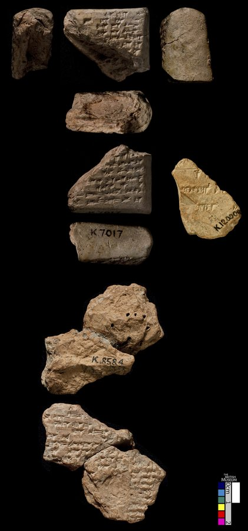
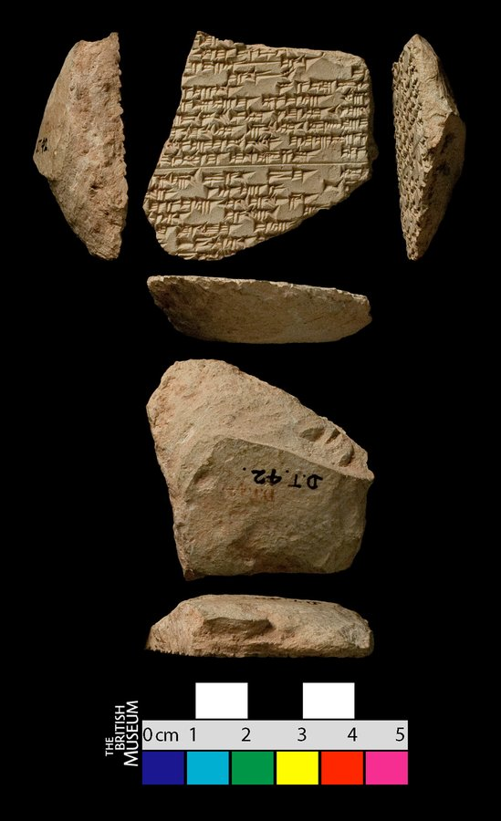
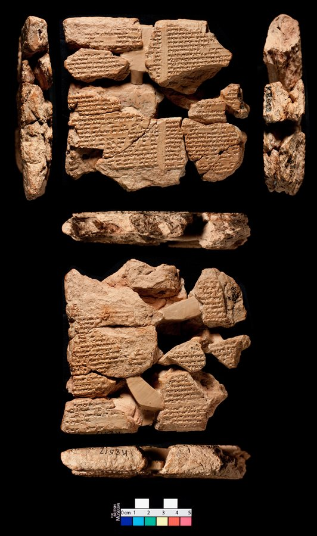
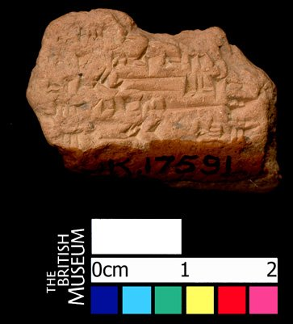
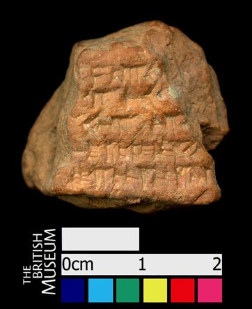
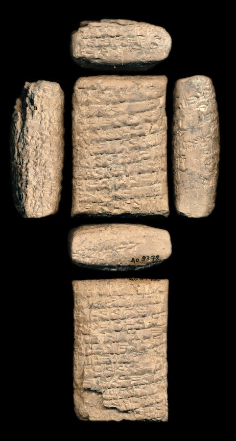

# Prediction demo: text-only vs vision (provenience) model

8 hand-picked tablet(s) (`--tablet_ids`). Both models see the exact same masked positions per example (`[MASK]` shown at every chosen position, 15% of eligible tokens) -- differences in restoration come only from the two models' separately trained weights, not from the image itself (the image only reaches `provenience_head`, see module docstring). The metadata table's `provenience` row is where the image can actually change an answer.

## Example 1 — `P273207` (has photo: True)

*Gilgamesh fragment -- Neo-Assyrian -- The British Museum*

<table><tr><td valign="top" width="240"> model input (224x224)   full photo (reference)</td><td valign="top"><table><tr><th>#</th><th>face</th><th>cuneiform</th><th>transliteration</th><th>translation</th></tr><tr><td>1'</td><td>default</td><td>x</td><td>... x</td><td>&mdash;</td></tr><tr><td>2'</td><td>default</td><td>x x 𒉿</td><td>x x pi ...</td><td>&mdash;</td></tr><tr><td>3'</td><td>default</td><td>𒂊 𒌨 𒄷 x</td><td>e taš-hu x ...</td><td>&mdash;</td></tr><tr><td>4'</td><td>default</td><td>𒅎 𒈥 x</td><td>im-mar x ...</td><td>&mdash;</td></tr><tr><td>5'</td><td>default</td><td>𒅁 𒁍 𒌋 x</td><td>ib-bu-u x ...</td><td>&mdash;</td></tr><tr><td>6'</td><td>default</td><td>𒅁 𒅆 𒋗</td><td>ib-ši šu ...</td><td>&mdash;</td></tr><tr><td>7'</td><td>default</td><td>𒄿 𒅘 𒄫 x</td><td>i-nak-kir x ...</td><td>&mdash;</td></tr><tr><td>8'</td><td>default</td><td>x x x</td><td>x x x ...</td><td>&mdash;</td></tr></table></td></tr></table>

**Original text (transliteration):**
> [unused1] [unused1] pi [unused2] e taš - hu [unused1] [unused2] im - mar [unused1] [unused2] ib - bu - u [unused1] [unused2] ib - ši šu [unused2] i - nak - kir [unused1] [unused2]

**Cuneiform (Unicode signs, whole document, not position-aligned to the text above):**
> x x 𒉿 𒂊 𒌨 𒄷 x 𒅎 𒈥 x 𒅁 𒁍 𒌋 x 𒅁 𒅆 𒋗 𒄿 𒅘 𒄫 x

**Masked input (4 positions):**
> [unused1] [unused1] [MASK] [unused2] e ta [MASK] - hu [unused1] [unused2] im - mar [unused1] [unused2] ib - bu - u [unused1] [unused2] ib - ši šu [unused2] i - [MASK] - ki [MASK] [unused1] [unused2]

### Restoration (masked-token predictions)

| # | true token | text-only top-1 | text-only top-3 | vision top-1 | vision top-3 | text-only correct | vision correct |
|---|---|---|---|---|---|---|---|
| 1 | `pi` | `-` | `-`, `e`, `šu` | `-` | `-`, `e`, `šu` | ❌ | ❌ |
| 2 | `##š` | `##h` | `##h`, `##š`, `##q` | `##h` | `##h`, `##š`, `##ḫ` | ❌ | ❌ |
| 3 | `nak` | `na` | `na`, `la`, `ta` | `na` | `na`, `din`, `ta` | ❌ | ❌ |
| 4 | `##r` | `-` | `-`, `##š`, `šu` | `-` | `-`, `šu`, `##š` | ❌ | ❌ |

Top-1 accuracy on this example: text-only 0/4 (0%), vision 0/4 (0%)

### Metadata predictions

| head | ground truth | text-only prediction | vision prediction |
|---|---|---|---|
| period | Neo-Assyrian | Middle Babylonian (0.43) | Neo-Assyrian (0.63) **<- differs** |
| genre | Literary & Scholarly | Lexical (0.66) | Lexical (0.48) |
| language | Akkadian | Akkadian (0.51) | Akkadian (0.69) |
| provenience | Nineveh | Nineveh (0.30) | Nineveh (0.86) |

---

## Example 2 — `P285823` (has photo: True)

*Gilgamesh fragment -- Atraḫasīs (Story of the Flood) -- Neo-Assyrian -- The British Museum*

<table><tr><td valign="top" width="240"> model input (224x224)   full photo (reference)</td><td valign="top"><table><tr><th>#</th><th>face</th><th>cuneiform</th><th>transliteration</th><th>translation</th></tr><tr><td>1'</td><td>default</td><td>x 𒇻 𒌋 x</td><td>x x x x lu-u x x x x x (x x)</td><td>&mdash;</td></tr><tr><td>2'</td><td>default</td><td>x 𒆠 𒈠 𒄒 𒉺 x</td><td>x x x x ki-ma kip-pa-ti₃ x x x (x x)</td><td>&mdash;</td></tr><tr><td>3'</td><td>default</td><td>𒌋 𒁕 𒀭 𒂊 𒇺 𒌋 š</td><td>ku-up-ru lu da-an e-liš u šap-liš</td><td>&mdash;</td></tr><tr><td>4'</td><td>default</td><td>𒂊 𒉿 𒄭 𒄑</td><td>x (x) x-e pe-hi MA₂</td><td>&mdash;</td></tr><tr><td>5'</td><td>default</td><td>𒀀 𒄨 𒈾 𒃻 𒀀 𒉺𒅁 𒉺 𒊩</td><td>u₂-ṣur a-dan-na ša₂ a-šap-pa-rak-ka</td><td>&mdash;</td></tr><tr><td>6'</td><td>default</td><td>𒂊 𒊒 𒌝 𒈠 𒄑 𒌁</td><td>MA₂ e-ru-um-ma KA₂ MA₂ tir-ra</td><td>&mdash;</td></tr><tr><td>7'</td><td>default</td><td>𒁉 𒃻 𒅗 𒅗 𒌋</td><td>zi-ib-la ina lib₃-bi-ša₂ ŠE.BAR-ka NIG₂.ŠU-ka u NIG₂.GA-ka</td><td>&mdash;</td></tr><tr><td>8'</td><td>default</td><td>𒀀 𒆠 𒆳 𒅗 𒊓 𒆳 𒅗 𒌋 𒌉 𒈨𒌍 𒌝 𒁹</td><td>aš₂-šat-ka ki-mat-ka sa-lat-ka u DUMU-MEŠ um-ma-ni</td><td>&mdash;</td></tr><tr><td>9'</td><td>default</td><td>𒁷 𒌑 𒈠 𒄠 𒂔 𒈠 𒆷 𒈨 𒅕</td><td>bu-ul EDIN u₂-ma-am EDIN ma-la U₂.ŠIM me-er-ʾi-sun</td><td>&mdash;</td></tr><tr><td>10'</td><td>default</td><td>𒀀 𒊩 𒈠 𒄿 𒈾 𒊍 𒍝 𒊒</td><td>a-šap-pa-rak-kum₂-ma i-na-aṣ-ṣa-ru KA₂-ka</td><td>&mdash;</td></tr><tr><td>11'</td><td>default</td><td>𒀀 𒄩 𒋀 𒉺 𒀀 𒋙 𒈠</td><td>at-ra-ha-sis pa-a-šu₂ DU₃-ma DUG₄.GA</td><td>&mdash;</td></tr><tr><td>12'</td><td>default</td><td>𒋼𒀀 𒁹 𒂍 𒀀 𒁁 𒉌</td><td>i-zak-kar ana e₂-a be-li₂-šu₂</td><td>&mdash;</td></tr><tr><td>13'</td><td>default</td><td>𒄿 𒈠 𒀀 𒄑 𒌌 𒂊 𒁍 𒍑 x</td><td>ma-ti-ma-a MA₂ ul e-pu-uš x x</td><td>&mdash;</td></tr><tr><td>14'</td><td>default</td><td>𒀀 𒊑 𒂊 𒈲 𒌑 ṣ</td><td>ina qaq-qa-ri e-ṣir u₂-ṣur-tu₂</td><td>&mdash;</td></tr><tr><td>15'</td><td>default</td><td>𒌅 𒇻 𒄯 𒈠 𒄑</td><td>u₂-ṣur-tu lu-mur-ma MA₂ lu-pu-uš</td><td>&mdash;</td></tr><tr><td>16'</td><td>default</td><td>𒀀 𒀸 𒆕 𒋡 𒊑 𒂊</td><td>e₂-a ina qaq-qa-ri e-ṣir u₂-ṣur-tu</td><td>&mdash;</td></tr><tr><td>17'</td><td>default</td><td>𒂊 𒉌 𒃻 𒋳 𒁀 𒀀</td><td>x x (x) be-li₂ ša₂ taq-ba-a x x x (x x x)</td><td>&mdash;</td></tr></table></td></tr></table>

**Original text (transliteration):**
> [unused1] [unused1] [unused1] [unused1] lu - u [unused1] [unused1] [unused1] [unused1] [unused1] [unused1] [unused1] [unused1] [unused1] [unused1] [unused1] ki - ma kip - pa - ti₃ [unused1] [unused1] [unused1] [unused1] [unused1] ku - up - ru lu da - an e - liš u šap - liš [unused1] [unused1] [unused1] - e pe - hi MA₂ u₂ - ṣur a - dan - na ša₂ a - šap - pa - rak - ka MA₂ e - ru - um - ma KA₂ MA₂ tir - ra zi - ib - la ina lib₃ - bi - ša₂ ŠE. BAR - ka NIG₂. ŠU - ka u NIG₂. GA - ka aš₂ - šat - ka ki - mat - ka sa - lat - ka u DUMU - MEŠ um - ma - ni bu - ul EDIN u₂ - ma - am EDIN ma - la U₂. ŠIM me - er - ʾi - sun a - šap - pa - rak - kum₂ - ma i - na - aṣ - ṣa - ru KA₂ - ka at - ra - ha - sis pa - a - šu₂ DU₃ - ma DUG₄. GA i - zak - kar ana e₂ - a be - li₂ - šu₂ ma - ti - ma - a MA₂ ul e - pu - uš [unused1] [unused1] ina qaq - qa - ri e - ṣir u₂ - ṣur - tu₂ u₂ - ṣur - tu lu - mur - ma MA₂ lu - pu - uš e₂ - a ina qaq - qa - ri e - ṣir u₂ - ṣur - tu [unused1] [unused1] [unused1] be - li₂ ša₂ taq - ba - a [unused1] [unused1] [unused1] [unused1] [unused1] [unused1]

**Cuneiform (Unicode signs, whole document, not position-aligned to the text above):**
> x 𒇻 𒌋 x x 𒆠 𒈠 𒄒 𒉺 x 𒌋 𒁕 𒀭 𒂊 𒇺 𒌋 š 𒂊 𒉿 𒄭 𒄑 𒀀 𒄨 𒈾 𒃻 𒀀 𒉺𒅁 𒉺 𒊩 𒂊 𒊒 𒌝 𒈠 𒄑 𒌁 𒁉 𒃻 𒅗 𒅗 𒌋 𒀀 𒆠 𒆳 𒅗 𒊓 𒆳 𒅗 𒌋 𒌉 𒈨𒌍 𒌝 𒁹 𒁷 𒌑 𒈠 𒄠 𒂔 𒈠 𒆷 𒈨 𒅕 𒀀 𒊩 𒈠 𒄿 𒈾 𒊍 𒍝 𒊒 𒀀 𒄩 𒋀 𒉺 𒀀 𒋙 𒈠 𒋼𒀀 𒁹 𒂍 𒀀 𒁁 𒉌 𒄿 𒈠 𒀀 𒄑 𒌌 𒂊 𒁍 𒍑 x 𒀀 𒊑 𒂊 𒈲 𒌑 ṣ 𒌅 𒇻 𒄯 𒈠 𒄑 𒀀 𒀸 𒆕 𒋡 𒊑 𒂊 𒂊 𒉌 𒃻 𒋳 𒁀 𒀀

**Masked input (48 positions):**
> [unused1] [unused1] [unused1] [unused1] lu - u [unused1] [unused1] [unused1] [unused1] [unused1] [unused1] [unused1] [unused1] [unused1] [unused1] [unused1] [MASK] - ma kip - pa - ti₃ [unused1] [unused1] [unused1] [unused1] [unused1] [MASK] - [MASK] [MASK] ru lu da - an [MASK] - liš u šap - liš [unused1] [unused1] [unused1] - e pe - hi MA₂ u [MASK] - ṣur [MASK] - dan [MASK] na [MASK]₂ a [MASK] šap - pa - rak - ka MA₂ [MASK] - ru - um - ma KA [MASK] MA₂ tir - ra zi - [MASK] - [MASK] ina lib₃ - bi - ša₂ ŠE. BAR - ka NIG₂. [MASK] - ka u NIG₂. GA [MASK] [MASK] [MASK]₂ [MASK] šat - ka [MASK] - mat - ka sa [MASK] lat - ka u DUMU - MEŠ um - [MASK] - ni bu - [MASK] ED [MASK] u₂ - ma - am ED [MASK] ma - la U₂. ŠIM me - er - ʾi - sun a - šap - [MASK] - [MASK] - [MASK]m₂ - ma i - [MASK] - [MASK]ṣ - ṣa - ru KA₂ [MASK] [MASK] at - ra - ha - sis pa - a - šu₂ DU₃ - ma DUG [MASK]. [MASK] i - zak - kar ana e₂ - a be [MASK] li₂ - šu₂ [MASK] - ti - ma - a MA₂ ul e - pu - uš [unused1] [unused1] ina qaq - qa - ri e [MASK] ṣir u₂ - ṣur - tu₂ u₂ - ṣur [MASK] tu lu - mur [MASK] ma MA [MASK] lu - pu - [MASK] e₂ - a ina qaq [MASK] qa - ri e - [MASK] [MASK] u₂ - ṣur [MASK] [MASK] [unused1] [unused1] [unused1] be - li₂ ša₂ [MASK]q - ba - [MASK] [unused1] [unused1] [unused1] [unused1] [unused1] [unused1]

### Restoration (masked-token predictions)

| # | true token | text-only top-1 | text-only top-3 | vision top-1 | vision top-3 | text-only correct | vision correct |
|---|---|---|---|---|---|---|---|
| 1 | `ki` | `um` | `um`, `ki`, `šu` | `um` | `um`, `ki`, `šu` | ❌ | ❌ |
| 2 | `ku` | `a` | `a`, `i`, `ma` | `a` | `a`, `ma`, `i` | ❌ | ❌ |
| 3 | `up` | `pu` | `pu`, `ra`, `pa` | `pu` | `pu`, `ma`, `a` | ❌ | ❌ |
| 4 | `-` | `-` | `-`, `.`, `a` | `-` | `-`, `.`, `##₂` | ✅ | ✅ |
| 5 | `e` | `pa` | `pa`, `##p`, `##₂` | `pa` | `pa`, `##p`, `pi` | ❌ | ❌ |
| 6 | `##₂` | `##₂` | `##₂`, `##ṣ`, `##b` | `##₂` | `##₂`, `##b`, `##ṣ` | ✅ | ✅ |
| 7 | `a` | `a` | `a`, `i`, `an` | `a` | `a`, `i`, `an` | ✅ | ✅ |
| 8 | `-` | `-` | `-`, `.`, `##₂` | `-` | `-`, `.`, `+` | ✅ | ✅ |
| 9 | `ša` | `MA` | `MA`, `KA`, `ša` | `MA` | `MA`, `KA`, `E` | ❌ | ❌ |
| 10 | `-` | `-` | `-`, `.`, `##₂` | `-` | `-`, `.`, `##₂` | ✅ | ✅ |
| 11 | `e` | `še` | `še`, `šu`, `na` | `lik` | `lik`, `še`, `da` | ❌ | ❌ |
| 12 | `##₂` | `##₂` | `##₂`, `.`, `##Š` | `##₂` | `##₂`, `.`, `##Š` | ✅ | ✅ |
| 13 | `ib` | `bi` | `bi`, `ri`, `i` | `bi` | `bi`, `bu`, `ba` | ❌ | ❌ |
| 14 | `la` | `ma` | `ma`, `ru`, `ti` | `ma` | `ma`, `ka`, `nu` | ❌ | ❌ |
| 15 | `ŠU` | `GA` | `GA`, `DU`, `MEŠ` | `GA` | `GA`, `DU`, `MEŠ` | ❌ | ❌ |
| 16 | `-` | `-` | `-`, `.`, `u` | `-` | `-`, `.`, `ša` | ✅ | ✅ |
| 17 | `ka` | `ka` | `ka`, `ma`, `-` | `ka` | `ka`, `ia`, `##₂` | ✅ | ✅ |
| 18 | `aš` | `u` | `u`, `ša`, `E` | `u` | `u`, `ša`, `aš` | ❌ | ❌ |
| 19 | `-` | `-` | `-`, `ina`, `la` | `-` | `-`, `ina`, `la` | ✅ | ✅ |
| 20 | `ki` | `a` | `a`, `na`, `am` | `a` | `a`, `na`, `am` | ❌ | ❌ |
| 21 | `-` | `-` | `-`, `##₂`, `.` | `-` | `-`, `##r`, `##₂` | ✅ | ✅ |
| 22 | `ma` | `ma` | `ma`, `man`, `mi` | `man` | `man`, `ma`, `me` | ✅ | ❌ |
| 23 | `ul` | `u` | `u`, `ut`, `ri` | `u` | `u`, `ut`, `lu` | ❌ | ❌ |
| 24 | `##IN` | `##IN` | `##IN`, `##IM`, `##EN` | `##IN` | `##IN`, `##I`, `##IM` | ✅ | ✅ |
| 25 | `##IN` | `##IN` | `##IN`, `##IM`, `##EN` | `##IN` | `##IN`, `##I`, `##IM` | ✅ | ✅ |
| 26 | `pa` | `pa` | `pa`, `pi`, `pu` | `pa` | `pa`, `pi`, `ta` | ✅ | ✅ |
| 27 | `rak` | `ra` | `ra`, `rak`, `ka` | `ra` | `ra`, `rak`, `ka` | ❌ | ❌ |
| 28 | `ku` | `lu` | `lu`, `la`, `ku` | `ku` | `ku`, `lu`, `la` | ❌ | ✅ |
| 29 | `na` | `na` | `na`, `ta`, `ba` | `ta` | `ta`, `na`, `ba` | ✅ | ❌ |
| 30 | `a` | `a` | `a`, `i`, `u` | `a` | `a`, `i`, `u` | ✅ | ✅ |
| 31 | `-` | `-` | `-`, `MA`, `.` | `MA` | `MA`, `-`, `.` | ✅ | ❌ |
| 32 | `ka` | `##₂` | `##₂`, `-`, `MEŠ` | `##₂` | `##₂`, `-`, `##₃` | ❌ | ❌ |
| 33 | `##₄` | `##₃` | `##₃`, `##₂`, `##₄` | `##₃` | `##₃`, `##₄`, `##₂` | ❌ | ❌ |
| 34 | `GA` | `GA` | `GA`, `UD`, `MEŠ` | `GA` | `GA`, `MEŠ`, `UD` | ✅ | ✅ |
| 35 | `-` | `-` | `-`, `.`, `##₂` | `-` | `-`, `.`, `##₂` | ✅ | ✅ |
| 36 | `ma` | `it` | `it`, `iš`, `i` | `it` | `it`, `iš`, `a` | ❌ | ❌ |
| 37 | `-` | `-` | `-`, `##₂`, `.` | `-` | `-`, `##₂`, `.` | ✅ | ✅ |
| 38 | `-` | `-` | `-`, `.`, `##₂` | `-` | `-`, `.`, `##₂` | ✅ | ✅ |
| 39 | `-` | `-` | `-`, `.`, `##₂` | `-` | `-`, `.`, `##₂` | ✅ | ✅ |
| 40 | `##₂` | `##₂` | `##₂`, `-`, `##Š` | `##₂` | `##₂`, `##I`, `##₃` | ✅ | ✅ |
| 41 | `uš` | `uš` | `uš`, `u`, `ru` | `uš` | `uš`, `šu`, `u` | ✅ | ✅ |
| 42 | `-` | `-` | `-`, `.`, `a` | `-` | `-`, `.`, `:` | ✅ | ✅ |
| 43 | `ṣi` | `ṣi` | `ṣi`, `ši`, `pi` | `ṣi` | `ṣi`, `ši`, `qi` | ✅ | ✅ |
| 44 | `##r` | `##r` | `##r`, `##l`, `##m` | `##r` | `##r`, `##š`, `##t` | ✅ | ✅ |
| 45 | `-` | `-` | `-`, `##₂`, `ša` | `-` | `-`, `.`, `##₂` | ✅ | ✅ |
| 46 | `tu` | `tu` | `tu`, `uš`, `ru` | `tu` | `tu`, `šu`, `ti` | ✅ | ✅ |
| 47 | `ta` | `i` | `i`, `ta`, `za` | `i` | `i`, `ta`, `za` | ❌ | ❌ |
| 48 | `a` | `ri` | `ri`, `ru`, `ni` | `ni` | `ni`, `ri`, `ra` | ❌ | ❌ |

Top-1 accuracy on this example: text-only 29/48 (60%), vision 27/48 (56%)

### Metadata predictions

| head | ground truth | text-only prediction | vision prediction |
|---|---|---|---|
| period | Old Babylonian | Neo-Assyrian (0.89) | Neo-Assyrian (0.90) |
| genre | Literary & Scholarly | Literary & Scholarly (0.89) | Literary & Scholarly (0.82) |
| language | Akkadian | Akkadian (0.93) | Akkadian (0.93) |
| provenience | (no label) | Nineveh (0.66) | Nineveh (0.94) |

---

## Example 3 — `P273223` (has photo: True)

*Gilgamesh fragment -- Neo-Assyrian -- The British Museum*

<table><tr><td valign="top" width="240"> model input (224x224)   full photo (reference)</td><td valign="top"><table><tr><th>#</th><th>face</th><th>cuneiform</th><th>transliteration</th><th>translation</th></tr><tr><td>1'</td><td>default</td><td>x x x</td><td>... x x x ...</td><td>&mdash;</td></tr><tr><td>2'</td><td>default</td><td>𒄿 𒉺 𒀾 š</td><td>man-za-zu i-pa-<<da>>-aš₂-šum-ma is-sah-ra</td><td>&mdash;</td></tr><tr><td>3'</td><td>default</td><td>𒅎 𒄷 𒌑 𒈦 š</td><td>il-lik SIM u₂-maš-šar : ...</td><td>&mdash;</td></tr><tr><td>4'</td><td>default</td><td>𒌋</td><td>man-za-zu ul ip-pa-aš₂-šum-ma is-sah-ra</td><td>&mdash;</td></tr><tr><td>5'</td><td>default</td><td>𒊑 𒁀 𒌑</td><td>u₂-še-ṣi-ma a-ri-ba u₂-maš-šar : ...</td><td>&mdash;</td></tr><tr><td>6'</td><td>default</td><td>𒅈 𒊑 𒌌</td><td>ik-kal i-ša₂-ah-hi i-tar-ri ul is-sah-ra</td><td>&mdash;</td></tr></table></td></tr></table>

**Original text (transliteration):**
> man - za - zu i - pa - aš₂ - šum - ma is - sah - ra il - lik SIM u₂ - maš - šar : [unused2] u₂ - še - ṣi - ma a - ri - ba u₂ - maš - šar : [unused2] ik - kal i - ša₂ - ah - hi i - tar - ri ul is - sah - ra

**Cuneiform (Unicode signs, whole document, not position-aligned to the text above):**
> 𒄿 𒉺 𒀾 š 𒅎 𒄷 𒌑 𒈦 š 𒊑 𒁀 𒌑 𒅈 𒊑 𒌌

**Masked input (11 positions):**
> man - za - zu [MASK] - pa [MASK] aš [MASK] - [MASK] - ma is - sah - ra il - lik SI [MASK] u₂ - maš [MASK] šar : [unused2] u₂ - [MASK] - [MASK] - ma a - ri - ba u₂ - [MASK] - šar : [unused2] ik - kal i - [MASK]₂ - ah - hi i - tar - ri ul is [MASK] sah - ra

### Restoration (masked-token predictions)

| # | true token | text-only top-1 | text-only top-3 | vision top-1 | vision top-3 | text-only correct | vision correct |
|---|---|---|---|---|---|---|---|
| 1 | `i` | `i` | `i`, `e`, `a` | `i` | `i`, `e`, `a` | ✅ | ✅ |
| 2 | `-` | `-` | `-`, `##₂`, `##š` | `-` | `-`, `##₂`, `:` | ✅ | ✅ |
| 3 | `##₂` | `##₂` | `##₂`, `a`, `i` | `##₂` | `##₂`, `a`, `ma` | ✅ | ✅ |
| 4 | `šum` | `šu` | `šu`, `nu`, `ru` | `šu` | `šu`, `nu`, `um` | ❌ | ❌ |
| 5 | `##M` | `##PA` | `##PA`, `##G`, `##L` | `##PA` | `##PA`, `##G`, `##LA` | ❌ | ❌ |
| 6 | `-` | `-` | `-`, `:`, `##₂` | `-` | `-`, `.`, `:` | ✅ | ✅ |
| 7 | `še` | `maš` | `maš`, `še`, `ši` | `maš` | `maš`, `še`, `ši` | ❌ | ❌ |
| 8 | `ṣi` | `šar` | `šar`, `šu`, `ši` | `šar` | `šar`, `šu`, `ši` | ❌ | ❌ |
| 9 | `maš` | `maš` | `maš`, `aš`, `udu` | `maš` | `maš`, `udu`, `ši` | ✅ | ✅ |
| 10 | `ša` | `ša` | `ša`, `la`, `na` | `ša` | `ša`, `na`, `la` | ✅ | ✅ |
| 11 | `-` | `-` | `-`, `.`, `:` | `-` | `-`, `.`, `##₂` | ✅ | ✅ |

Top-1 accuracy on this example: text-only 7/11 (64%), vision 7/11 (64%)

### Metadata predictions

| head | ground truth | text-only prediction | vision prediction |
|---|---|---|---|
| period | Neo-Assyrian | Neo-Assyrian (0.76) | Neo-Assyrian (0.55) |
| genre | Literary & Scholarly | Royal Inscriptions (0.53) | Royal Inscriptions (0.77) |
| language | Akkadian | Akkadian (0.87) | Akkadian (0.93) |
| provenience | Nineveh | Nineveh (0.63) | Nineveh (0.83) |

---

## Example 4 — `P402919` (has photo: True)

*Enuma Elish fragment -- Neo-Assyrian -- The British Museum*

<table><tr><td valign="top" width="240"> model input (224x224)   full photo (reference)</td><td valign="top"><table><tr><th>#</th><th>face</th><th>cuneiform</th><th>transliteration</th><th>translation</th></tr><tr><td>1'</td><td>default</td><td>𒀯 𒇸</td><td>mul-lil AN-e u KI-ti₃ ...</td><td>&mdash;</td></tr><tr><td>2'</td><td>default</td><td>𒀀 𒈾 𒁺 𒌦</td><td>ša₂ a-na du-un-ni ...</td><td>&mdash;</td></tr><tr><td>3'</td><td>default</td><td>𒁀 𒉡</td><td>GIŠ.NUMUN.AB₂ ba-nu-u₂ ...</td><td>&mdash;</td></tr><tr><td>4'</td><td>default</td><td>𒂍 𒀭 𒈨𒌍 𒃻</td><td>a-bit DINGIR-MEŠ ša₂ ...</td><td>&mdash;</td></tr><tr><td>5'</td><td>default</td><td>𒈗</td><td>LUGAL.AB₂.DUBUR₂ LUGAL ...</td><td>&mdash;</td></tr></table></td></tr></table>

**Original text (transliteration):**
> mul - lil AN - e u KI - ti₃ [unused2] ša₂ a - na du - un - ni [unused2] a - bit DINGIR - MEŠ ša₂ [unused2]

**Cuneiform (Unicode signs, whole document, not position-aligned to the text above):**
> 𒀯 𒇸 𒀀 𒈾 𒁺 𒌦 𒂍 𒀭 𒈨𒌍 𒃻

**Masked input (5 positions):**
> mul - lil [MASK] [MASK] e u KI - [MASK]₃ [unused2] ša₂ a - na du - [MASK] - ni [unused2] a - bit [MASK] - MEŠ ša₂ [unused2]

### Restoration (masked-token predictions)

| # | true token | text-only top-1 | text-only top-3 | vision top-1 | vision top-3 | text-only correct | vision correct |
|---|---|---|---|---|---|---|---|
| 1 | `AN` | `##₂` | `##₂`, `##₃`, `##₅` | `##₂` | `##₂`, `##₃`, `##₅` | ❌ | ❌ |
| 2 | `-` | `-` | `-`, `.`, `##₂` | `-` | `-`, `.`, `##₂` | ✅ | ✅ |
| 3 | `ti` | `ti` | `ti`, `i`, `DU` | `ti` | `ti`, `MEŠ`, `DU` | ✅ | ✅ |
| 4 | `un` | `u` | `u`, `a`, `du` | `u` | `u`, `a`, `lu` | ❌ | ❌ |
| 5 | `DINGIR` | `UN` | `UN`, `DINGIR`, `GAL` | `UN` | `UN`, `DINGIR`, `DUMU` | ❌ | ❌ |

Top-1 accuracy on this example: text-only 2/5 (40%), vision 2/5 (40%)

### Metadata predictions

| head | ground truth | text-only prediction | vision prediction |
|---|---|---|---|
| period | Neo-Assyrian | Neo-Assyrian (0.94) | Neo-Assyrian (0.95) |
| genre | Literary & Scholarly | Royal Inscriptions (0.60) | Royal Inscriptions (0.66) |
| language | Akkadian | Akkadian (0.94) | Akkadian (0.97) |
| provenience | Nineveh | Nineveh (0.87) | Nineveh (0.97) |

---

## Example 5 — `ebl:BM.42004` (has photo: False)

*Atrahasis fragment -- Atraḫasīs (Story of the Flood) -- Neo-Babylonian -- The British Museum*

**Original text (transliteration):**
> [unused2] [unused1] TUKUL i - [unused2] [unused2] [unused1] ina GU. ZA [unused1] [unused2] [unused2] + en - lil₂ KA - šu₂ DU₃ - ma [unused2] [unused2] zag - ga - [unused1] [unused1] [unused2]

**Cuneiform (Unicode signs, whole document, not position-aligned to the text above):**
> x 𒄑 𒆪 𒄿 x 𒀸 𒄑 x 𒅍 𒅗 𒋙 𒀭 𒍠 𒂵 x

**Masked input (4 positions):**
> [unused2] [unused1] TUKUL i - [unused2] [unused2] [unused1] ina GU. [MASK]A [unused1] [unused2] [unused2] + en - lil₂ KA - šu₂ [MASK] [MASK] [MASK] ma [unused2] [unused2] zag - ga - [unused1] [unused1] [unused2]

### Restoration (masked-token predictions)

| # | true token | text-only top-1 | text-only top-3 | vision top-1 | vision top-3 | text-only correct | vision correct |
|---|---|---|---|---|---|---|---|
| 1 | `Z` | `Z` | `Z`, `GAD`, `H` | `Z` | `Z`, `GAD`, `H` | ✅ | ✅ |
| 2 | `DU` | `-` | `-`, `u`, `ša` | `-` | `-`, `u`, `ša` | ❌ | ❌ |
| 3 | `##₃` | `nu` | `nu`, `##₂`, `a` | `##₂` | `##₂`, `nu`, `##₃` | ❌ | ❌ |
| 4 | `-` | `-` | `-`, `##₂`, `a` | `-` | `-`, `##₂`, `.` | ✅ | ✅ |

Top-1 accuracy on this example: text-only 2/4 (50%), vision 2/4 (50%)

### Metadata predictions

| head | ground truth | text-only prediction | vision prediction |
|---|---|---|---|
| period | (no label) | Neo-Assyrian (0.94) | Neo-Assyrian (0.93) |
| genre | (no label) | Royal Inscriptions (0.42) | Royal Inscriptions (0.31) |
| language | (no label) | Akkadian (0.96) | Akkadian (0.96) |
| provenience | (no label) | Nineveh (0.90) | Nineveh (0.86) |

---

## Example 6 — `P404643` (has photo: True)

*Hammurabi fragment -- Neo-Assyrian -- The British Museum*

<table><tr><td valign="top" width="240"> model input (224x224)   full photo (reference)</td><td valign="top"><table><tr><th>#</th><th>face</th><th>cuneiform</th><th>transliteration</th><th>translation</th></tr><tr><td>1'</td><td>reverse</td><td>𒍪 𒊻</td><td>i-zu-uz-zu</td><td>&mdash;</td></tr><tr><td>2'</td><td>reverse</td><td>𒀀</td><td>i-na NIG₂.GA E₂ A.BA</td><td>&mdash;</td></tr><tr><td>3'</td><td>reverse</td><td>x 𒈬</td><td>... x mu ...</td><td>&mdash;</td></tr><tr><td>4'</td><td>reverse</td><td>𒂊 𒄴</td><td>ṣe-eh-ri-im</td><td>&mdash;</td></tr><tr><td>5'</td><td>reverse</td><td>š 𒊭 𒌈 𒆷 𒀀</td><td>ša aš-ša-tum la ah-zu</td><td>&mdash;</td></tr><tr><td>6'</td><td>reverse</td><td>𒇷 𒀜</td><td>e-li-at ši₂-ti-šu</td><td>&mdash;</td></tr><tr><td>7'</td><td>reverse</td><td>x x x x</td><td>... x x x x ...</td><td>&mdash;</td></tr></table></td></tr></table>

**Original text (transliteration):**
> i - zu - uz - zu [unused2] [unused1] mu [unused2] ṣe - eh - ri - im ša aš - ša - tum la ah - zu e - li - at ši₂ - ti - šu

**Cuneiform (Unicode signs, whole document, not position-aligned to the text above):**
> 𒍪 𒊻 x 𒈬 𒂊 𒄴 š 𒊭 𒌈 𒆷 𒀀 𒇷 𒀜

**Masked input (6 positions):**
> i - zu - [MASK] - zu [unused2] [unused1] mu [unused2] ṣe [MASK] eh - ri [MASK] im ša aš - ša - tum la ah - zu e - [MASK] - at ši₂ [MASK] ti [MASK] šu

### Restoration (masked-token predictions)

| # | true token | text-only top-1 | text-only top-3 | vision top-1 | vision top-3 | text-only correct | vision correct |
|---|---|---|---|---|---|---|---|
| 1 | `uz` | `a` | `a`, `ah`, `an` | `a` | `a`, `ah`, `zu` | ❌ | ❌ |
| 2 | `-` | `-` | `-`, `##₂`, `##₃` | `-` | `-`, `##₂`, `##₃` | ✅ | ✅ |
| 3 | `-` | `-` | `-`, `##₂`, `##m` | `-` | `-`, `##₂`, `.` | ✅ | ✅ |
| 4 | `li` | `na` | `na`, `ta`, `ma` | `na` | `na`, `ba`, `ta` | ❌ | ❌ |
| 5 | `-` | `-` | `-`, `##₂`, `+` | `-` | `-`, `+`, `/` | ✅ | ✅ |
| 6 | `-` | `-` | `-`, `##₂`, `+` | `-` | `-`, `##₂`, `.` | ✅ | ✅ |

Top-1 accuracy on this example: text-only 4/6 (67%), vision 4/6 (67%)

### Metadata predictions

| head | ground truth | text-only prediction | vision prediction |
|---|---|---|---|
| period | Neo-Assyrian | Old Assyrian (0.82) | Old Assyrian (0.88) |
| genre | (no label) | Legal (0.40) | Legal (0.37) |
| language | Akkadian | Akkadian (0.91) | Akkadian (0.95) |
| provenience | Nineveh | Kanesh (0.79) | Kanesh (0.83) |

---

## Example 7 — `P402685` (has photo: True)

*Hammurabi fragment -- Legal -- Neo-Assyrian -- The British Museum*

<table><tr><td valign="top" width="240"> model input (224x224)   full photo (reference)</td><td valign="top"><table><tr><th>#</th><th>face</th><th>cuneiform</th><th>transliteration</th><th>translation</th></tr><tr><td>1'</td><td>obverse</td><td>𒀭</td><td>li-ib-bi iš₈-tar₂</td><td>&mdash;</td></tr><tr><td>2'</td><td>obverse</td><td>𒂖</td><td>ru-bu-um el-lu/lim</td><td>&mdash;</td></tr><tr><td>3'</td><td>obverse</td><td>𒋾 𒋗</td><td>ša ni-iš qa₂-ti-šu</td><td>&mdash;</td></tr><tr><td>4'</td><td>obverse</td><td>𒄿 𒁺 𒌑</td><td>IŠKUR i-du-u₂</td><td>&mdash;</td></tr><tr><td>5'</td><td>obverse</td><td>𒄿 𒅁 𒁉</td><td>mu-ne-eh li-ib-bi IŠKUR</td><td>&mdash;</td></tr><tr><td>6'</td><td>obverse</td><td>𒄿 𒈾 𒌷 𒅎 𒆠</td><td>qu₂-ra-di-im i-na IM</td><td>&mdash;</td></tr><tr><td>7'</td><td>obverse</td><td>𒄿 𒅔 𒋛 𒈠 𒁴</td><td>mu-uš-ta-ak-ki-in si-ma-tim</td><td>&mdash;</td></tr><tr><td>8'</td><td>obverse</td><td>𒌓 𒃲 𒃲</td><td>i-na e₂-u₄-gal-gal</td><td>&mdash;</td></tr><tr><td>9'</td><td>obverse</td><td>𒅖</td><td>LUGAL na-di-in na-pi₂-iš-tim</td><td>&mdash;</td></tr></table></td></tr></table>

**Original text (transliteration):**
> ša ni - iš qa₂ - ti - šu IŠKUR i - du - u₂ mu - ne - eh li - ib - bi IŠKUR qu₂ - ra - di - im i - na IM mu - uš - ta - ak - ki - in si - ma - tim i - na e₂ - u₄ - gal - gal

**Cuneiform (Unicode signs, whole document, not position-aligned to the text above):**
> 𒋾 𒋗 𒄿 𒁺 𒌑 𒄿 𒅁 𒁉 𒄿 𒈾 𒌷 𒅎 𒆠 𒄿 𒅔 𒋛 𒈠 𒁴 𒌓 𒃲 𒃲

**Masked input (11 positions):**
> ša ni - iš [MASK]₂ - [MASK] - šu IŠKUR i - du - u₂ mu - ne - eh li - [MASK] [MASK] bi IŠK [MASK] qu₂ - ra - [MASK] [MASK] im i - na IM mu [MASK] uš - [MASK] - ak - ki - in si - ma - tim i - na e₂ - u₄ [MASK] gal [MASK] gal

### Restoration (masked-token predictions)

| # | true token | text-only top-1 | text-only top-3 | vision top-1 | vision top-3 | text-only correct | vision correct |
|---|---|---|---|---|---|---|---|
| 1 | `qa` | `u` | `u`, `ša`, `qa` | `u` | `u`, `qa`, `aš` | ❌ | ❌ |
| 2 | `ti` | `ri` | `ri`, `bi`, `ni` | `bi` | `bi`, `ri`, `ni` | ❌ | ❌ |
| 3 | `ib` | `i` | `i`, `li`, `im` | `li` | `li`, `i`, `zi` | ❌ | ❌ |
| 4 | `-` | `-` | `-`, `.`, `a` | `-` | `-`, `.`, `##₂` | ✅ | ✅ |
| 5 | `##UR` | `##UR` | `##UR`, `##U`, `##UL` | `##UR` | `##UR`, `##U`, `##UL` | ✅ | ✅ |
| 6 | `di` | `ri` | `ri`, `bi`, `hi` | `bi` | `bi`, `ri`, `hi` | ❌ | ❌ |
| 7 | `-` | `-` | `-`, `##₂`, `/` | `-` | `-`, `##₂`, `/` | ✅ | ✅ |
| 8 | `-` | `-` | `-`, `ša`, `##₂` | `-` | `-`, `##₂`, `ša` | ✅ | ✅ |
| 9 | `ta` | `ta` | `ta`, `ra`, `la` | `ta` | `ta`, `ra`, `la` | ✅ | ✅ |
| 10 | `-` | `-` | `-`, `ki`, `dumu` | `-` | `-`, `##₂`, `ki` | ✅ | ✅ |
| 11 | `-` | `-` | `-`, `##₂`, `##₃` | `-` | `-`, `##₂`, `.` | ✅ | ✅ |

Top-1 accuracy on this example: text-only 7/11 (64%), vision 7/11 (64%)

### Metadata predictions

| head | ground truth | text-only prediction | vision prediction |
|---|---|---|---|
| period | Neo-Assyrian | Old Assyrian (0.47) | Neo-Babylonian (0.35) **<- differs** |
| genre | (no label) | Royal Inscriptions (0.94) | Royal Inscriptions (0.92) |
| language | Akkadian | Akkadian (0.97) | Akkadian (0.95) |
| provenience | Nineveh | Assur (0.33) | Assur (0.28) |

---

## Example 8 — `P387407` (has photo: True)

*TCL 18, 111 -- Letter, Old Babylonian, Larsa (mod. Tell as-Senkereh) -- Louvre Museum, Paris, France -- published in Lettres de la première dynastie babylonienne II (Dossin, 1934)*

<table><tr><td valign="top" width="240"> model input (224x224)   full photo (reference)</td><td valign="top"><table><tr><th>#</th><th>face</th><th>cuneiform</th><th>transliteration</th><th>translation</th></tr><tr><td>1</td><td>obverse</td><td>𒀀 𒈾 𒍣 𒉡 𒌑</td><td>a-na zi-nu-u2</td><td>To Zinu</td></tr><tr><td>2</td><td>obverse</td><td>𒆠 𒉈 𒈠</td><td>qi2-bi2-ma</td><td>speak,</td></tr><tr><td>3</td><td>obverse</td><td>𒌝 𒈠 𒄿 𒁷 𒂗𒍪 𒈠</td><td>um-ma i-din-suen-ma</td><td>thus Iddin-Sin:</td></tr><tr><td>4</td><td>obverse</td><td>𒌓 𒀫𒌓 𒅇 𒊩𒌆 𒋚</td><td>utu marduk u3 nin-szubur</td><td>May Shamash, Marduk, and Ninshubur</td></tr><tr><td>5</td><td>obverse</td><td>𒀸 𒋳 𒅀 𒀀 𒈾 𒁕 𒊑 𒀀 𒁴</td><td>asz-szum-ia a-na da-ri-a-tim</td><td>for my sake forever</td></tr><tr><td>6</td><td>obverse</td><td>𒇷 𒁀 𒀠 𒇷 𒁺 𒆠</td><td>li-ba-al-li-t,u3-ki</td><td>sustain you!</td></tr><tr><td>7</td><td>obverse</td><td>𒌆 𒍪 𒁀 𒀀 𒀜 𒀀 𒉿 𒇷 𒂊</td><td>s,u2-ba-a-at a-wi-le-e</td><td>The garments of others</td></tr><tr><td>8</td><td>obverse</td><td>𒊭 𒀜 𒌓 𒀀 𒈾 𒊭 𒀜 𒁴</td><td>sza-at-tam a-na sza-at-tim</td><td>year for year</td></tr><tr><td>9</td><td>obverse</td><td>𒄿 𒁕 𒄠 𒈪 𒆪</td><td>i-da-am-mi-qu2</td><td>are improving,</td></tr><tr><td>10</td><td>obverse</td><td>𒀜 𒋾 𒌆 𒍪 𒁀 𒀀 𒋾</td><td>at-ti s,u2-ba-a-ti</td><td>but as for you, my garments</td></tr><tr><td>1</td><td>reverse</td><td>𒊭 𒀜 𒌓 𒀀 𒈾 𒊭 𒀜 𒁴</td><td>sza-at-tam a-na sza-at-tim</td><td>year for year</td></tr><tr><td>2</td><td>reverse</td><td>𒌅 𒂵 𒀠 𒆷 𒇷</td><td>tu-qa2-al-la-li</td><td>you reduce!</td></tr><tr><td>3</td><td>reverse</td><td>𒄿 𒈾 𒌆 𒍪 𒁀 𒋾 𒅀</td><td>i-na s,u2-ba-ti-ia</td><td>In my garments</td></tr><tr><td>4</td><td>reverse</td><td>𒄖 𒌌 𒇻 𒅆 𒅇 𒆪 𒊻 𒍣</td><td>qu3-ul-lu-lim u3 ku-uz-zi</td><td>reducing and ...-ing,</td></tr><tr><td>5</td><td>reverse</td><td>𒋫 𒀸 𒋫 𒊑 𒄿</td><td>ta-asz-ta-ri-i</td><td>you have become rich!</td></tr><tr><td>6</td><td>reverse</td><td>𒄿 𒈾 𒋠 𒄭 𒀀 𒄿 𒈾 𒁉 𒋾 𒉌</td><td>i-na siki hi-a i-na bi-ti-ni</td><td>With respect to the wool in our estate,</td></tr><tr><td>7</td><td>reverse</td><td>𒆠 𒈠 𒀀 𒅗 𒅆 𒅔 𒈾 𒅗 𒆷</td><td>ki-ma a-ka-lim in-na-ka-la</td><td>which like bread is being consumed,</td></tr><tr><td>8</td><td>reverse</td><td>𒀜 𒋾 𒌆 𒍪 𒁀 𒋾 𒌅 𒂵 𒀠 𒇷 𒇷</td><td>at-ti s,u2-ba-ti tu-qa2-al-li-li</td><td>my garments you reduce!</td></tr><tr><td>9</td><td>reverse</td><td>𒌉 𒁹 𒅎 𒄿 𒊹 𒉆</td><td>dumu iszkur-i-di2-nam</td><td>The son of Adad-iddinam,</td></tr><tr><td>10</td><td>reverse</td><td>𒊭 𒀀 𒁍 𒋗 𒍪 𒄩 𒅈 𒀀 𒁉 𒅀</td><td>sza a-bu-szu s,u2-ha-ar a-bi-ia</td><td>whose father is an underling of my father,</td></tr><tr><td>11</td><td>reverse</td><td>𒅆 𒈾 𒌆 𒍪 𒁀 𒋼 𒂊 𒌍 𒋗 𒁴</td><td>szi-na s,u2-ba-te-e esz-szu-tim</td><td>two new garments,</td></tr><tr><td>12</td><td>reverse</td><td>𒁉 𒅖 𒀜 𒀀 𒈾 𒌆 𒍪 𒁀 𒋾 𒅀</td><td>la-bi-isz at-ti a-na s,u2-ba-ti-ia</td><td>wears, but as for you, about my single garment</td></tr><tr><td>13</td><td>reverse</td><td>𒋼 𒂗 𒋫 𒋫 𒈾 𒄴 𒁕 𒊑</td><td>isz-te-en ta-ta-na-ah-da-ri</td><td>you keep obsessing!</td></tr><tr><td>14</td><td>reverse</td><td>𒆠 𒈠 𒀜 𒋾 𒅀 𒋾</td><td>ki-ma at-ti ia-ti</td><td>Although you to me</td></tr><tr><td>15</td><td>reverse</td><td>𒌅 𒌌 𒁲 𒅔 𒉌</td><td>tu-ul-di-in-ni</td><td>gave birth,</td></tr><tr><td>1</td><td>left</td><td>𒊭 𒀀 𒋾 𒌝 𒈠 𒋗</td><td>sza-a-ti um-ma-szu</td><td>yet although as to him,</td></tr><tr><td>2</td><td>left</td><td>𒌝 𒈠 𒋗 𒄿 𒊏 𒀀 𒈬 𒋗</td><td>um-ma-szu <i>-ra-a-mu-szu</td><td>his mother loves him,</td></tr><tr><td>3</td><td>left</td><td>𒀜 𒋾 𒀀 𒋾 𒌑 𒌌 𒋫 𒊏 𒄠 𒈪 𒅔 𒉌</td><td>at-ti ia-a-ti u2-ul ta-ra-am-mi-in-ni</td><td>you, you do not really love me.</td></tr></table></td></tr></table>

**Original text (transliteration):**
> um - ma i - din - suen - ma utu marduk u₃ nin - šubur ṣu₂ - ba - a - at a - wi - le - e ša - at - tam a - na ša - at - tim i - da - am - mi - qu₂ at - ti ṣu₂ - ba - a - ti tu - qa₂ - al - la - li i - na ṣu₂ - ba - ti - ia qu₃ - ul - lu - lim u₃ ku - uz - zi ta - aš - ta - ri - i i - na siki hi - a i - na bi - ti - ni ki - ma a - ka - lim in - na - ka - la at - ti ṣu₂ - ba - ti tu - qa₂ - al - li - li dumu iškur - i - di₂ - nam ša a - bu - šu ṣu₂ - ha - ar a - bi - ia ši - na ṣu₂ - ba - te - e eš - šu - tim la - bi - iš at - ti a - na ṣu₂ - ba - ti - ia iš - te - en ta - ta - na - ah - da - ri ki - ma at - ti ia - ti tu - ul - di - in - ni ša - a - ti um - ma - šu a - na le - qi₂ - tim u₃ ki - ma ša - a - ti um - ma - šu i - ra - a - mu - šu at - ti ia - a - ti u₂ - ul ta - ra - am - mi - in - ni

**Cuneiform (Unicode signs, whole document, not position-aligned to the text above):**
> 𒌝 𒈠 𒄿 𒁷 𒂗𒍪 𒈠 𒌓 𒀫𒌓 𒅇 𒊩𒌆 𒋚 𒌆 𒍪 𒁀 𒀀 𒀜 𒀀 𒉿 𒇷 𒂊 𒊭 𒀜 𒌓 𒀀 𒈾 𒊭 𒀜 𒁴 𒄿 𒁕 𒄠 𒈪 𒆪 𒀜 𒋾 𒌆 𒍪 𒁀 𒀀 𒋾 𒌅 𒂵 𒀠 𒆷 𒇷 𒄿 𒈾 𒌆 𒍪 𒁀 𒋾 𒅀 𒄖 𒌌 𒇻 𒅆 𒅇 𒆪 𒊻 𒍣 𒋫 𒀸 𒋫 𒊑 𒄿 𒄿 𒈾 𒋠 𒄭 𒀀 𒄿 𒈾 𒁉 𒋾 𒉌 𒆠 𒈠 𒀀 𒅗 𒅆 𒅔 𒈾 𒅗 𒆷 𒀜 𒋾 𒌆 𒍪 𒁀 𒋾 𒌅 𒂵 𒀠 𒇷 𒇷 𒌉 𒁹 𒅎 𒄿 𒊹 𒉆 𒊭 𒀀 𒁍 𒋗 𒍪 𒄩 𒅈 𒀀 𒁉 𒅀 𒅆 𒈾 𒌆 𒍪 𒁀 𒋼 𒂊 𒌍 𒋗 𒁴 𒁉 𒅖 𒀜 𒀀 𒈾 𒌆 𒍪 𒁀 𒋾 𒅀 𒋼 𒂗 𒋫 𒋫 𒈾 𒄴 𒁕 𒊑 𒆠 𒈠 𒀜 𒋾 𒅀 𒋾 𒌅 𒌌 𒁲 𒅔 𒉌 𒊭 𒀀 𒋾 𒌝 𒈠 𒋗 𒀀 𒈾 𒇷 𒆠 𒁴 𒅇 𒆠 𒈠 𒊭 𒀀 𒋾 𒌝 𒈠 𒋗 𒄿 𒊏 𒀀 𒈬 𒋗 𒀜 𒋾 𒀀 𒋾 𒌑 𒌌 𒋫 𒊏 𒄠 𒈪 𒅔 𒉌

**English translation (CDLI, whole document, line-by-line above is the exact alignment):**
> To Zinu speak, thus Iddin-Sin: May Shamash, Marduk, and Ninshubur for my sake forever sustain you! The garments of others year for year are improving, but as for you, my garments year for year you reduce! In my garments reducing and ...-ing, you have become rich! With respect to the wool in our estate, which like bread is being consumed, my garments you reduce! The son of Adad-iddinam, whose father is an underling of my father, two new garments, wears, but as for you, about my single garment you keep obsessing! Although you to me gave birth, yet although as to him, his mother loves him, you, you do not really love me.

**Masked input (50 positions):**
> um - ma i - [MASK] - suen - ma utu marduk u₃ nin - šubur ṣu₂ [MASK] ba - a - at a - [MASK] [MASK] le - e ša - at - tam a - na ša [MASK] at - tim i - da - am - [MASK] [MASK] [MASK]₂ at - ti ṣu₂ - ba - a [MASK] [MASK] tu [MASK] qa₂ - al [MASK] la [MASK] [MASK] i - na ṣu₂ - ba - ti - ia qu₃ - ul - lu - lim u₃ ku - uz [MASK] zi ta - [MASK] - ta - ri - i i - na siki hi - [MASK] i [MASK] na bi - ti - [MASK] [MASK] [MASK] ma a - ka - lim in - na - ka - [MASK] at - ti ṣu₂ - ba - ti [MASK] - qa₂ - al - li - li dumu iškur [MASK] i - di₂ - nam ša a - bu [MASK] šu ṣu₂ - ha - ar a [MASK] bi [MASK] ia ši - na [MASK]u [MASK] - ba - te - e eš - šu - tim [MASK] - bi [MASK] iš at [MASK] ti a - na ṣu₂ - ba - ti [MASK] ia iš - te [MASK] en ta - ta - na - ah - da - ri [MASK] - ma [MASK] - ti ia - [MASK] tu - ul - di - in - ni [MASK] - a - [MASK] [MASK] - ma - šu a - na [MASK] - qi₂ [MASK] tim u [MASK] ki - ma ša - a - [MASK] [MASK] - ma - šu i [MASK] ra - a - mu - šu at - ti ia - a - ti [MASK]₂ - ul ta - ra [MASK] [MASK] - mi - in - [MASK]

### Restoration (masked-token predictions)

| # | true token | text-only top-1 | text-only top-3 | vision top-1 | vision top-3 | text-only correct | vision correct |
|---|---|---|---|---|---|---|---|
| 1 | `din` | `bi` | `bi`, `din`, `na` | `bi` | `bi`, `din`, `na` | ❌ | ❌ |
| 2 | `-` | `-` | `-`, `.`, `/` | `-` | `-`, `.`, `/` | ✅ | ✅ |
| 3 | `wi` | `wi` | `wi`, `bi`, `na` | `wi` | `wi`, `bi`, `šur` | ✅ | ✅ |
| 4 | `-` | `-` | `-`, `##₂`, `##₃` | `-` | `-`, `##₂`, `##₃` | ✅ | ✅ |
| 5 | `-` | `-` | `-`, `##₂`, `##₃` | `-` | `-`, `##₃`, `##₂` | ✅ | ✅ |
| 6 | `mi` | `mi` | `mi`, `li`, `ma` | `li` | `li`, `mi`, `ma` | ✅ | ❌ |
| 7 | `-` | `-` | `-`, `##₂`, `##m` | `-` | `-`, `##₂`, `##₃` | ✅ | ✅ |
| 8 | `qu` | `u` | `u`, `su`, `la` | `u` | `u`, `li`, `ti` | ❌ | ❌ |
| 9 | `-` | `-` | `-`, `u`, `a` | `-` | `-`, `.`, `##₂` | ✅ | ✅ |
| 10 | `ti` | `ni` | `ni`, `ti`, `am` | `at` | `at`, `ti`, `ni` | ❌ | ❌ |
| 11 | `-` | `-` | `-`, `##₃`, `##₂` | `-` | `-`, `##₃`, `##₂` | ✅ | ✅ |
| 12 | `-` | `-` | `-`, `##₂`, `a` | `-` | `-`, `##₂`, `.` | ✅ | ✅ |
| 13 | `-` | `-` | `-`, `##m`, `##₂` | `-` | `-`, `##₂`, `##m` | ✅ | ✅ |
| 14 | `li` | `li` | `li`, `ni`, `šu` | `li` | `li`, `ni`, `šu` | ✅ | ✅ |
| 15 | `-` | `-` | `-`, `##₂`, `##u` | `-` | `-`, `##₂`, `##u` | ✅ | ✅ |
| 16 | `aš` | `ah` | `ah`, `ar`, `ak` | `ah` | `ah`, `am`, `ak` | ❌ | ❌ |
| 17 | `a` | `a` | `a`, `ka`, `i` | `a` | `a`, `i`, `im` | ✅ | ✅ |
| 18 | `-` | `-` | `-`, `+`, `/` | `-` | `-`, `+`, `/` | ✅ | ✅ |
| 19 | `ni` | `ia` | `ia`, `i`, `šu` | `ia` | `ia`, `šu`, `im` | ❌ | ❌ |
| 20 | `ki` | `ki` | `ki`, `um`, `##m` | `um` | `um`, `ki`, `šu` | ✅ | ❌ |
| 21 | `-` | `-` | `-`, `ma`, `a` | `-` | `-`, `a`, `##₂` | ✅ | ✅ |
| 22 | `la` | `ni` | `ni`, `am`, `ma` | `ni` | `ni`, `tim`, `am` | ❌ | ❌ |
| 23 | `tu` | `tu` | `tu`, `ta`, `i` | `tu` | `tu`, `ta`, `i` | ✅ | ✅ |
| 24 | `-` | `-` | `-`, `ša`, `dumu` | `-` | `-`, `ša`, `##₂` | ✅ | ✅ |
| 25 | `-` | `-` | `-`, `##₂`, `##r` | `-` | `-`, `##₂`, `.` | ✅ | ✅ |
| 26 | `-` | `-` | `-`, `##₂`, `a` | `-` | `-`, `.`, `##₂` | ✅ | ✅ |
| 27 | `-` | `-` | `-`, `##₂`, `.` | `-` | `-`, `##₂`, `.` | ✅ | ✅ |
| 28 | `ṣ` | `ṣ` | `ṣ`, `ṭ`, `Ṣ` | `ṣ` | `ṣ`, `ṭ`, `Ṣ` | ✅ | ✅ |
| 29 | `##₂` | `##₂` | `##₂`, `##₃`, `##₄` | `##₂` | `##₂`, `##₃`, `##₄` | ✅ | ✅ |
| 30 | `la` | `a` | `a`, `i`, `na` | `a` | `a`, `i`, `li` | ❌ | ❌ |
| 31 | `-` | `-` | `-`, `##₂`, `.` | `-` | `-`, `##₂`, `.` | ✅ | ✅ |
| 32 | `-` | `-` | `-`, `.`, `a` | `-` | `-`, `.`, `a` | ✅ | ✅ |
| 33 | `-` | `-` | `-`, `.`, `##₂` | `-` | `-`, `.`, `##₂` | ✅ | ✅ |
| 34 | `-` | `-` | `-`, `##₂`, `##₃` | `-` | `-`, `##₂`, `.` | ✅ | ✅ |
| 35 | `ki` | `ki` | `ki`, `um`, `šu` | `ki` | `ki`, `um`, `šu` | ✅ | ✅ |
| 36 | `at` | `at` | `at`, `ia`, `a` | `at` | `at`, `a`, `ia` | ✅ | ✅ |
| 37 | `ti` | `ti` | `ti`, `a`, `na` | `ti` | `ti`, `a`, `na` | ✅ | ✅ |
| 38 | `ša` | `ša` | `ša`, `ia`, `šu` | `ša` | `ša`, `ia`, `i` | ✅ | ✅ |
| 39 | `ti` | `ti` | `ti`, `am`, `na` | `ti` | `ti`, `tim`, `am` | ✅ | ✅ |
| 40 | `um` | `um` | `um`, `a`, `ki` | `um` | `um`, `a`, `šu` | ✅ | ✅ |
| 41 | `le` | `i` | `i`, `ni`, `li` | `i` | `i`, `a`, `na` | ❌ | ❌ |
| 42 | `-` | `-` | `-`, `.`, `:` | `-` | `-`, `.`, `##₂` | ✅ | ✅ |
| 43 | `##₃` | `##₃` | `##₃`, `##₂`, `##₄` | `##₃` | `##₃`, `##₂`, `##₄` | ✅ | ✅ |
| 44 | `ti` | `ti` | `ti`, `am`, `at` | `ti` | `ti`, `tim`, `am` | ✅ | ✅ |
| 45 | `um` | `ki` | `ki`, `a`, `um` | `a` | `a`, `um`, `šu` | ❌ | ❌ |
| 46 | `-` | `-` | `-`, `+`, `/` | `-` | `-`, `+`, `/` | ✅ | ✅ |
| 47 | `u` | `u` | `u`, `qu`, `tu` | `u` | `u`, `qu`, `tu` | ✅ | ✅ |
| 48 | `-` | `-` | `-`, `##₂`, `##m` | `-` | `-`, `##₂`, `u` | ✅ | ✅ |
| 49 | `am` | `am` | `am`, `aq`, `al` | `am` | `am`, `aq`, `ah` | ✅ | ✅ |
| 50 | `ni` | `ni` | `ni`, `na`, `šu` | `ni` | `ni`, `na`, `ti` | ✅ | ✅ |

Top-1 accuracy on this example: text-only 41/50 (82%), vision 39/50 (78%)

### Metadata predictions

| head | ground truth | text-only prediction | vision prediction |
|---|---|---|---|
| period | Old Babylonian | Old Babylonian (0.87) | Old Babylonian (0.93) |
| genre | Letters | Letters (0.93) | Letters (0.93) |
| language | Akkadian | Akkadian (0.95) | Akkadian (0.94) |
| provenience | Larsa | Sippar (0.77) | Sippar (0.46) |

---
